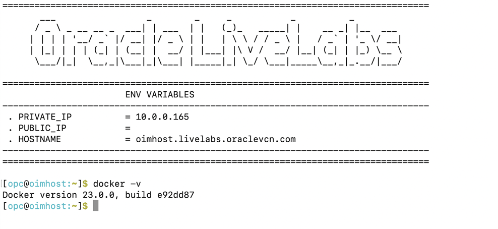

# Verify environment and initialize 

## Introduction

In this lab we will review the environment setup and start all services required to successfully run this workshop.

*Estimated Lab Time*: 15 minutes

Watch the video below for a quick walk-through of the lab.
[Environment intialize](videohub:1_9mdts598)

### Objectives

In this lab, you will:
 * Verify the docker 
 * Start OIG services
 * Verify the status of all servers
 * Verify the private IP address of the compute instance 

### Prerequisites
This lab assumes you have:
- A valid Oracle OCI tenancy, with OCI administrator privileges. 

    *Note:* From this lab onwards until the completetion of the workshop, all the steps need to be performed inside the Workshop URL only. 


## Task 1: Validate Docker is up and running

1. Open a terminal session. 

   

   The terminal session has started. 

   

2. Check the version of the docker.

    ```
    <copy>docker -v</copy>
    ```
    

    ```
    Expected output: Docker version 23.0.0, build e92dd87
    ```
    

3. Validate the status to verify if docker service is up/running

    ```
    <copy>systemctl status docker</copy>
    ```

     

     Enter **Ctrl+C** to return to the command prompt

## Task 2: Start the Oracle Identity Governance (OIG) Services

1. Move to the directory where the script files are located.
     
    ```
    <copy>cd /scratch/idmqa/scripts</copy>
    ```

    

2. List the files inside the directory.

    ```
    <copy>ls</copy>
    ```

    


3. Start DB and all servers manually,using below scripts.

    ```
    <copy>./start_db.sh</copy>
    ```
    Wait till DB gets started. Then proceed to start all servers.

    

    

    ```   
    <copy>./start_all_servers.sh</copy>
    ```

    

## Task 3: Verify the Private IP address of Compute Instance

1. Launch a browser window. Login to OCI console using the URL mentioned below. The OCI account sign in page appears. Enter the username and password provided during signup.
    
    ```
    <copy>https://console.us-ashburn-1.oraclecloud.com/</copy>
    ```

2. Click the Navigation Menu icon in the top left corner to display the *Navigation menu.* Select *Compute* in the *Navigation menu*. Select *Instances* from the list of products.
     
    
    


2. Notedown the Private IP address of the Compute Instance for reference. We will require to use them in the further labs. 

      

 

    You may now **proceed to the next lab.**

## Learn More

* [Oracle Access Governance Create Access Review Campaign](https://docs.oracle.com/en/cloud/paas/access-governance/pdapg/index.html)
* [Oracle Access Governance Product Page](https://www.oracle.com/security/cloud-security/access-governance/)
* [Oracle Access Governance Product tour](https://www.oracle.com/webfolder/s/quicktours/paas/pt-sec-access-governance/index.html)
* [Oracle Access Governance FAQ](https://www.oracle.com/security/cloud-security/access-governance/faq/)

## Acknowledgments
* **Author** - Anuj Tripathi, Indira Balasundaram, Anbu Anbarasu 
* **Contributors** - Edward Lu
* **Last Updated By/Date** - Anbu Anbarasu, Cloud Platform COE, January 2023