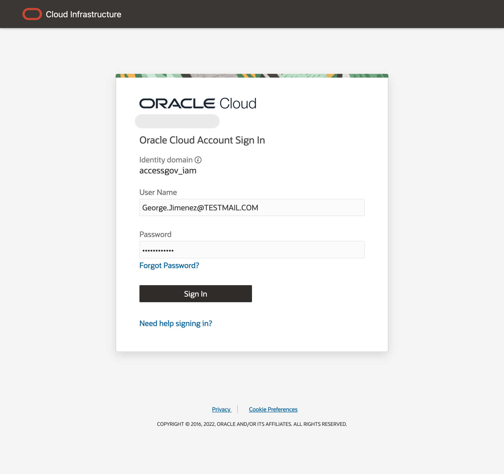

# Oracle Access Governance Agent Installation and Configuration

## Introduction

OAG Agent will be installed and configured. 

* Estimated Time: 10 minutes
* Persona: Campaign Administrator

### Objectives

In this lab, you will:
* Install and Configure **OAG Agent.**

## Task 1: Install OAG Agent on the Compute Instance and Configure

1. Move Agent ZIP file from the local file system to zip_oag inside OIG: vm /home/opc

  ssh -i <pvt_key_filenamekeypath> <username>@<computeinstancepublicipaddress>

  scp -i <-private key file name-> <-oig_agent_package.zip-> <-compute instance user-name->@<-ipaddress->:<-directory path where agent should be saved->

  scp -r -i <public_key file path> <zip file path> opc@<Public IP_Address>:/home/opc/zip_oag

  cd /home/opc/zip_oag

  ll

  Verify the Agent zip is present inside zip_oag.

2. Setting the Environment variables using the below command:

    source oag_agent.env

3. Install the agent

  sh agentManagement.sh --volume /home/opc/vol_oag —agentpackage /home/opc/zip_oag/oig-oag.zip —-install
   

	

4. Start the agent

  sh agentManagement.sh --volume /home/opc/vol_oag —-start

  

5. Verify the agent

  sh agentManagement.sh --volume /home/opc/vol_oag --status

## Task 2: Perform Data load in OAG console 

To initiate a data load from the target connected system instance, perform the following tasks.

1. In the Oracle Access Governance Console, access the navigation menu by selecting the Navigation Menu icon. Select **Service Administration → Connected Systems.**

  
2. In the **Connected Systems** screen, select the **Manage** button for the Oracle Access Governance connected system you want to manage.
  
3. Select the **Load data now** option from the **Actions** drop-down menu in the top right-hand corner. This will initiate a data load which you can track the status of in the **Activity Log.** Refresh screen and wait for the status to be **Successful**
  
4. Private IP need to updated in JDBC url and OIG url in AG settings
  

## Task 3: Create Users in IAM

Create users in IAM and assign them to Application roles.

1. In the Oracle Access Governance Console, access the Cloud Shell.

2. Add the below commands to create users in file as **user.sh** file and upload in Cloud shell:

  Quality Asurance: Mark Hernandez
	Operations: Pamela Green 

	oci iam user create --name mark.hernandez --email firstname.lastname@oracle.com --description OAG-User-Cloud-Shell

	oci iam user create --name pamela.green --email firstname.lastname@oracle.com --description OAG-User-Cloud-Shell 

  
2. In cloud shell enter the below commands to execute the .sh file:

  ll

  sh users.sh
  
3. Once the users activation mail is received , reset the password to the below mentioned password:

   **Password:** Oracl@123456
  
4. Private IP need to updated in JDBC url and OIG url in AG settings
  

5. In the OCI console, navigate to Identity -> Domains -> Default Domain -> Oracle Cloud Services -> AG-service-instance -> Application Role. 

  Assign AdminAppRole to User Pamela Green 
  Assign AG User to User Mark Hernandez

## Learn More

* [Oracle Access Governance Manage Access Review Campaign](https://docs.oracle.com/en/cloud/paas/access-governance/kfdck/index.html)
* [Oracle Access Governance Product Page](https://www.oracle.com/security/cloud-security/access-governance/)
* [Oracle Access Governance Product tour](https://www.oracle.com/webfolder/s/quicktours/paas/pt-sec-access-governance/index.html)
* [Oracle Access Governance FAQ](https://www.oracle.com/security/cloud-security/access-governance/faq/)

## Acknowledgments
* **Author** - Anuj Tripathi, Indira Balasundaram, Anbu Anbarasu 
* **Last Updated By/Date** - Anbu Anbarasu, Cloud Platform COE, January 2023
