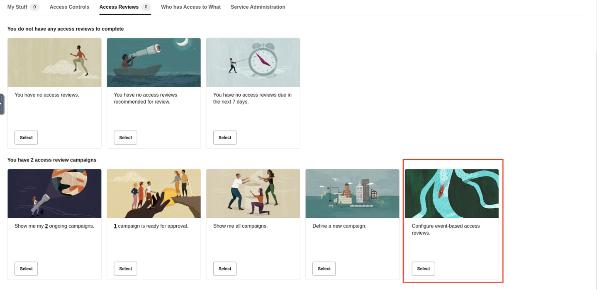
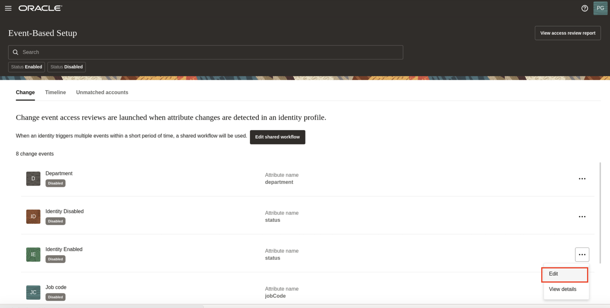
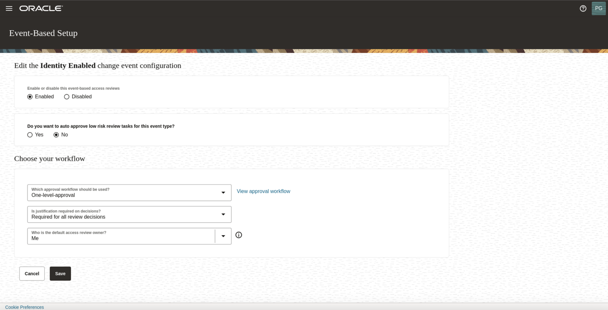
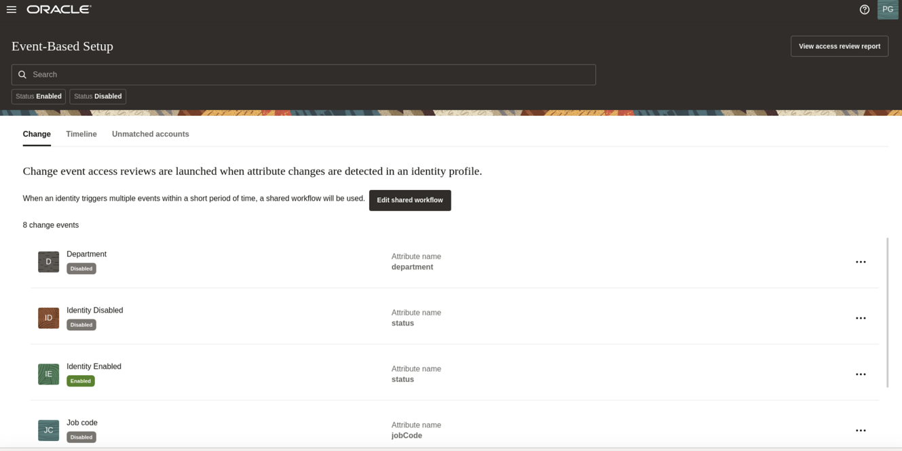
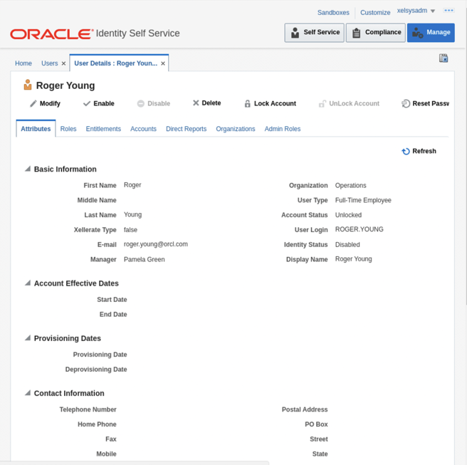

# Manage event based access review

## Introduction

Users with the **campaign administrator** role can create and manage event based access review campaigns using the **Oracle Access Governance** console. Users can view the progress of **on-going campaigns**, view and download detailed campaign analysis reports, clone **previous campaigns**, terminate **on-going campaigns**, etc. 

* Estimated Time: 10 minutes
* Persona: Campaign Administrator

Watch the video below for a quick walk-through of the lab.
[Manage Event Based Review Campaigns](videohub:1_1azcpenj)

### Objectives

In this lab, you will:
* View a list of **certification campaigns** you own or created
* View the progress of **certification campaigns** made by reviewers with **analytics insights**

### Prerequisites
This lab assumes you have:
- A valid Oracle OCI tenancy, with OCI administrator privileges.

## Task 1: Login Oracle Access Governance as Campaign Administrator

1. From your browser, navigate to the Oracle Access Governance Console using the URL specified in *Lab 5: Task 1: Step 4*


2. Enter **Oracle Access Governance Administrator** username and password (Pamela Green)

    **Username:**
    ```
    <copy>pamela.green</copy>
    ```

    **Password:**
    
    The password you have set for the user in *Lab 1: Task 2: Step 5*


  You will be navigated to the home page of your Oracle Access Governance Console.

3. You should see the **Oracle Access Governance** main dashboard. **Please note data on Oracle Access Governance main dashboard in your assigned system might be different from LiveLabs step screenshot.**


## Task 2: Enable Event Based Access Review Campaigns

1. Select **Configure Event Based Reviews** from the Home page of Access Governance.
  
2. Each event type is displayed as a tile with a status of Enabled or Disabled and an Actions drop-down menu, providing the option to Edit or View details. 

   Select Edit for the **Identity Enabled** event-type. 

   

   Select *One-level-approval workflow*.  On the Configure the event type screen:
  Use the radio button to Enable the event-type.
  If you want to auto-approve low risk task for this event type, select Yes. Click *Save*

     

    


## Task 3: Disable the user in Oracle Identity Governance

1.  Sign in to Identity Self Service console. Open a browser tab using the below URL to access OIG Identity Console.

  **URL:**
    ```
    <copy>http://oimhost.us.oracle.com:14000/identity</copy>
    ```
    **Username:**
    ```
    <copy>xelsysadm</copy>
    ```

  **Password:**
    ```
    <copy>Welcome1</copy>
    ```

  

2.  You should see the **Oracle Identity Governance** main dashboard
  

3. Click on Manage on the top right corner. Then, click on Users.Select **Display Name** and enter the user name **Roger Young**. The user profile of **Roger Young** is displayed.

  
4. Click on **Disable** button to disable the user identity **Roger Young** 


5. Provide the Justification and Click on *Submit*


6. Refresh the page , now you will see the user **Roger Young** is in disabled status.




## Task 4: Perform Data load in OAG console

1.  In the Oracle Access Governance Console, access the navigation menu by selecting the Navigation Menu icon. Select **Service Administration → Orchestrated Systems.**

     
    
    
2. In the **Orchestrated  Systems** screen, select the **Manage** button for the Oracle Access Governance Orchestrated system you want to manage.


3. Select the **Load data now** option from the **Actions** drop-down menu in the top right-hand corner. This will initiate a data load which you can track the status of in the **Activity Log.** Refresh screen and wait for the status to be **Successful**

## Task 5: Enable the user in Oracle Identity Governance

1.  Sign in to Identity Self Service console. Open a browser tab using the below URL to access OIG Identity Console.

    **URL:**
    ```
    <copy>http://oimhost.us.oracle.com:14000/identity</copy>
    ```
    **Username:**
    ```
    <copy>xelsysadm</copy>
    ```

    **Password:**
    ```
    <copy>Welcome1</copy>
    ```

  
2.  You should see the **Oracle Identity Governance** main dashboard. Click on Manage on the top right corner. Then, click on Users.Select **Display Name** and enter the user name **Roger Young**. The user profile of **Roger Young** is displayed.The user is in **Disabled** status. 

  
3. Click on **Enable** button to enable the user identity **Roger Young** . Provide the Justification and Click on *Submit*
4. Refresh the page , now you will see the user **Roger Young** is in **Active** status.


## Task 6: Again Perform Data load in OAG console

1.  In the Oracle Access Governance Console, access the navigation menu by selecting the Navigation Menu icon. Select **Service Administration → Orchestrated Systems.**

     
    
    
2. In the **Orchestrated Systems** screen, select the **Manage** button for the Oracle Access Governance Orchestrated system you want to manage. 

3. Select the **Load data now** option from the **Actions** drop-down menu in the top right-hand corner. This will initiate a data load which you can track the status of in the **Activity Log.** Refresh screen and wait for the status to be **Successful**

## Task 7: Login Oracle Access Governance as Campaign Administrator 

1.  In the Oracle Access Governance Console, access the navigation menu by selecting the Navigation Menu icon. Select **My Access Reviews**

     
    
    
2. You can view the certification event that Roger identity has been just enabled.

     

3. **Congratulations!** You now finish **Oracle Access Governance Hands-on Lab**. In this workshop, you have learned how to:
    - Create access review campaigns as a **campaign administrator**
    - Review user privileges for yourself and your direct reports as a **user manager**
    - Perform access review tasks as an **employee user** and a **user manager**
    - Monitor and manage access review campaigns as a **campaign administrator**
    - Manage event based access review campaigns as a **campaign administrator**

  You may now **proceed to the next lab.**

## Learn More

* [Oracle Access Governance Manage Access Review Campaign](https://docs.oracle.com/en/cloud/paas/access-governance/kfdck/index.html)
* [Oracle Access Governance Product Page](https://www.oracle.com/security/cloud-security/access-governance/)
* [Oracle Access Governance Product tour](https://www.oracle.com/webfolder/s/quicktours/paas/pt-sec-access-governance/index.html)
* [Oracle Access Governance FAQ](https://www.oracle.com/security/cloud-security/access-governance/faq/)

## Acknowledgments
* **Authors** - Anuj Tripathi, Indira Balasundaram, Anbu Anbarasu 
* **Last Updated By/Date** - Anbu Anbarasu, Cloud Platform COE, January 2023
