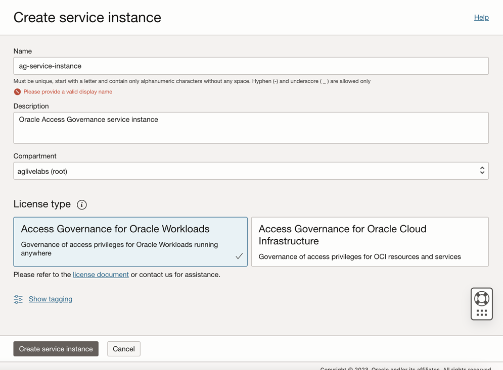

# Setup and configure Oracle Access Governance service instance

## Introduction

In this lab we will setup the OAG service instance and make configurations required to successfully run this workshop.

*Estimated Lab Time*: 15 minutes

Watch the video below for a quick walk-through of the lab.
[Access Governance instance setup](videohub:1_x3fb7d7m)

### Objectives

In this lab, you will:
 * Create AG Service Instance
 * Access the AG console url

### Prerequisites
This lab assumes you have:
- A valid Oracle OCI tenancy, with OCI administrator privileges. 


## Task 1: Create AG Service instance 

1. In the OCI console, click the Navigation Menu icon in the top left corner to display the *Navigation menu.* Click *Identity and Security* in the *Navigation menu*. Select *Access Governance* from the list of products.
    

2. On the Access Governance page, select *Service Instances.*


    ```
    Name: ag-service-instance
    Description: Oracle Access Governance service instance
    Compartment: Ensure your root compartment is selected
    ```
    
    

3. Select the License type : Access Governance for Oracle Workloads. Click on *Create Service Instance*

    

4. Wait for the service instance to have the *Active* status . Note down this URL as we will be using it in the further labs. 

    

5. Click on the Service Instance to access the URL. 

    


    You may now **proceed to the next lab.**

## Learn More

* [Oracle Access Governance Create Access Review Campaign](https://docs.oracle.com/en/cloud/paas/access-governance/pdapg/index.html)
* [Oracle Access Governance Product Page](https://www.oracle.com/security/cloud-security/access-governance/)
* [Oracle Access Governance Product tour](https://www.oracle.com/webfolder/s/quicktours/paas/pt-sec-access-governance/index.html)
* [Oracle Access Governance FAQ](https://www.oracle.com/security/cloud-security/access-governance/faq/)

## Acknowledgments
* **Authors** - Anuj Tripathi, Indira Balasundaram, Anbu Anbarasu 
* **Contributors** - Edward Lu
* **Last Updated By/Date** - Anbu Anbarasu, Cloud Platform COE, January 2023