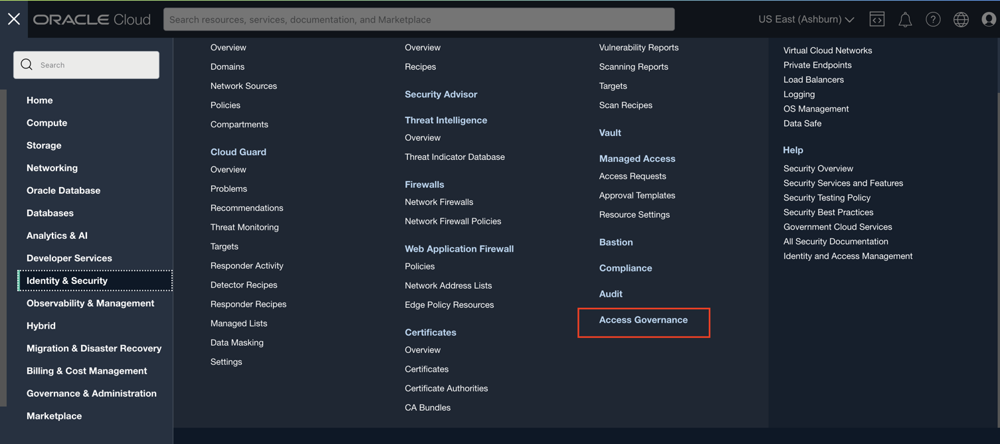
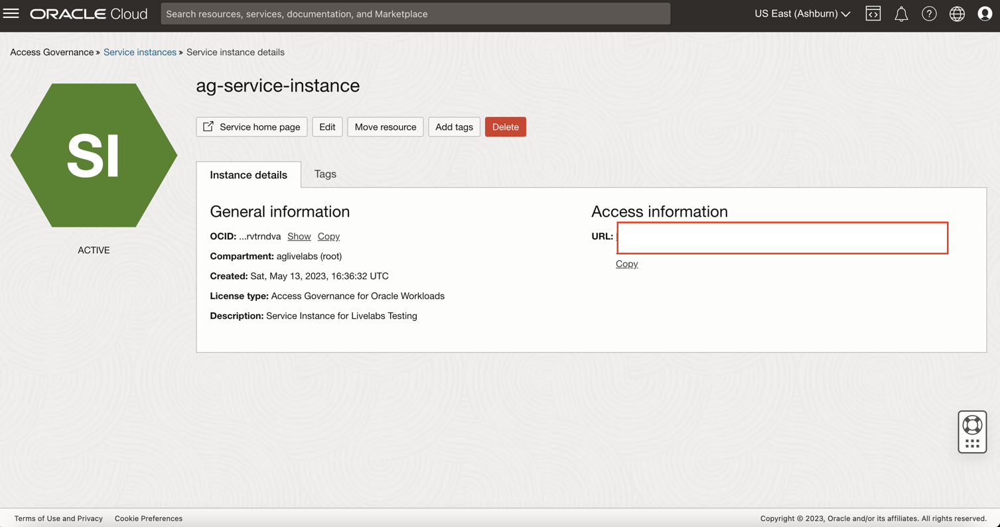
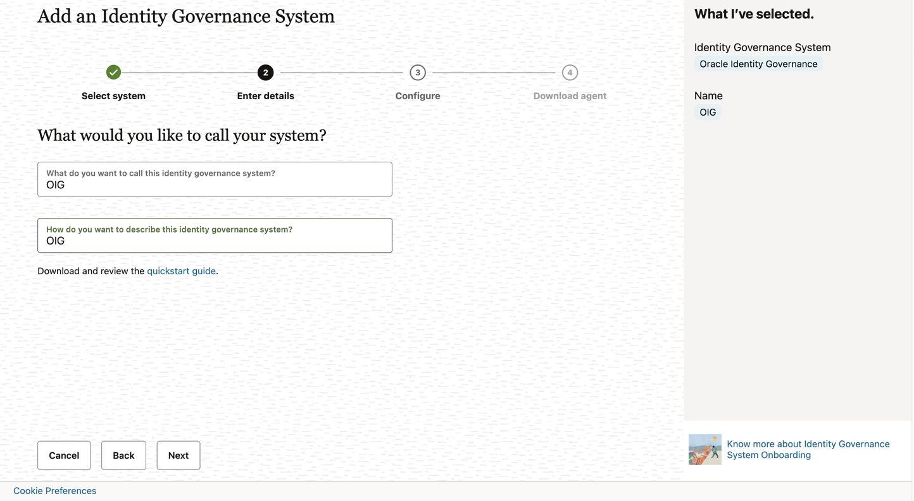

# Oracle Access Governance Service Instance Setup and Configuration

## Introduction

In this lab we will setup the OAG service instance and make configurations required to successfully run this workshop.

*Estimated Lab Time*: 15 minutes

### Objectives

In this lab, you will:
 * Create AG Service Instance
 * Access the AG console url
 * Download the Agent to perform the integration with OIG

### Prerequisites
This lab assumes you have:
- A Free Tier, Paid or LiveLabs Oracle Cloud account

## Task 1: Create AG Service instance 

1. Launch a browser window. Login to OCI console using the URL mentioned below. The OCI account sign in page appears. Enter the username and password.
     
    ```
    <copy>URL: https://console.us-ashburn-1.oraclecloud.com/</copy>
    ```
    

2. Click the Navigation Menu icon in the top left corner to display the *Navigation menu.*

3. Click *Identity and Security* in the *Navigation menu*


4. Select *Access Governance* from the list of products.


5. On the Access Governance page, select *Service Instances.*


6. Click on *Create Service Instance*


    ```
    Name: Service-Instance
    Description: Compartment
    Compartment: Ensure your compartment is selected
    ```

    Click *Create Service Instance*
    
    

7. Wait for the service instance to have the *Active* status 

    

8. Click on the Serivce Instance to access the URL. 

    

## Task 2: Integrate with Oracle Identity Governance

1. Login to the Oracle Access Governance service home page as the user with the Administrator application  role.

2. On the Oracle Access Governance service home page, click on the Navigation Menu icon and select **Service Administration** and then **Connected Systems.**

    

3. On the tile labeled **Would you like to connect to an Identity Governance System** select the **Add** button.
    

4. Click **Close** on the information pop-up to navigate to the **Add an Identity Governance System** page and begin the configuration.

    


5. On the **Select System** step, select the tile for **Oracle Identity Governance** to configure the agent for a target Oracle Identity Governance connected system, and then click **Next.**


    


6. On the **Enter Details** step, enter the following details:
  **Name**
  **Description**
  **Click Next.**

    

    

7. On the **Configure** step, enter connection details for the target system:

    * **JDBC URL:** jdbc:oracle:thin:@//<--privateipofyourcomputeinstance-->:1521/ORCL.NETWORKSPEOSUBN.IDMOCICLOU02PHX.ORACLEVCN.COM
    * **OIG Database User Name:** DEV_OIM
    * **Password:** Welcome1
    * **Confirm Password:** Welcome1
    * **OIG Server URL:** http://<--privateipofyourcomputeinstance-->:14000
    * **OIG Server User Name:** xelsysadm
    * **OIG Server Password:** Welcome1
    * **OIG Server Confirm Password:** Welcome1

8. On the Download Agent step, select the *Download link* and download the agent zip file to the environment in which the agent will run.


    
You may now [proceed to the next lab](#next).

## Learn More

* [Oracle Access Governance Create Access Review Campaign](https://docs.oracle.com/en/cloud/paas/access-governance/pdapg/index.html)
* [Oracle Access Governance Product Page](https://www.oracle.com/security/cloud-security/access-governance/)
* [Oracle Access Governance Product tour](https://www.oracle.com/webfolder/s/quicktours/paas/pt-sec-access-governance/index.html)
* [Oracle Access Governance FAQ](https://www.oracle.com/security/cloud-security/access-governance/faq/)

## Acknowledgments
* **Author** - Anuj Tripathi, Indira Balasundaram, Anbu Anbarasu 
* **Last Updated By/Date** - Anbu Anbarasu, Cloud Platform COE, January 2023