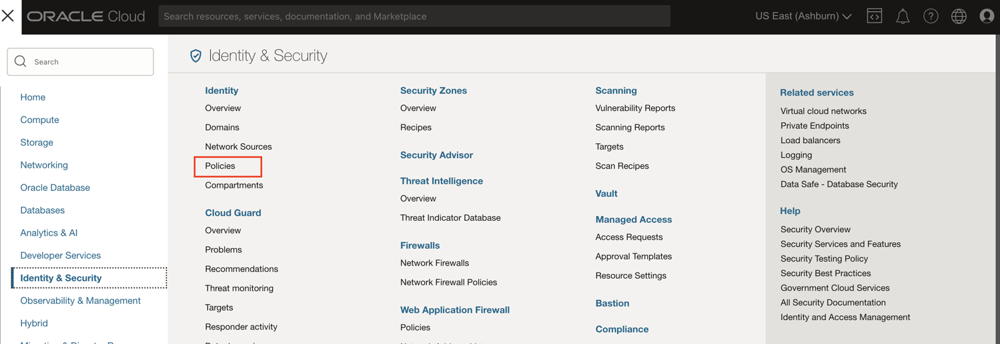
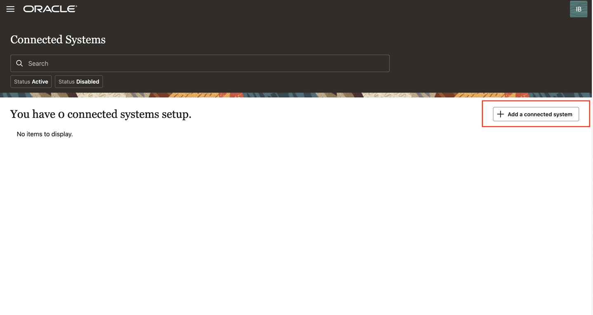
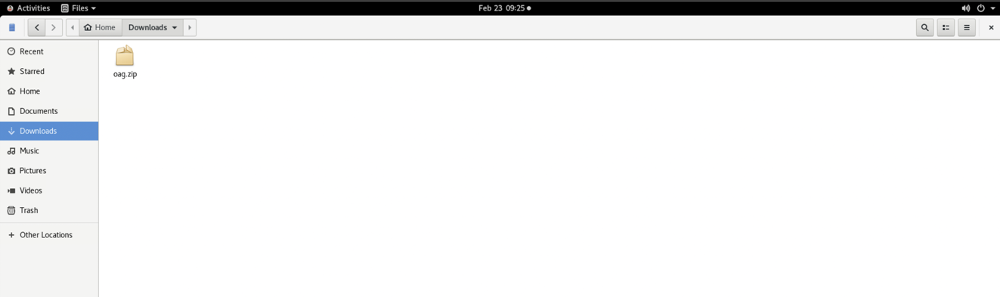

# Setup and configure Oracle Access Governance service instance

## Introduction

In this lab we will setup the OAG service instance and make configurations required to successfully run this workshop.

*Estimated Lab Time*: 15 minutes

Watch the video below for a quick walk-through of the lab.
[Access Governance instance setup](videohub:1_x3fb7d7m)

### Objectives

In this lab, you will:
 * Create AG Group and AG Policies
 * Create AG Service Instance
 * Access the AG console url
 * Download the Agent to perform the integration with OIG

### Prerequisites
This lab assumes you have:
- A valid Oracle OCI tenancy, with OCI administrator privileges. 

## Task 1: Create AG Group 

1. In the OCI console, click the Navigation Menu icon in the top left corner to display the *Navigation menu.* Click *Identity and Security* in the *Navigation menu*. Select *Domains* from the list of products.

    

2. On the Domains page, Click on *ag-domain* which is the identity domain you have created. Select *Groups*. Click on *Create Group*

    

    

    Enter the following details to create the *ag-group*
    ```
    Name: ag-group
    Description: Access governance group to manage users 
    Users: Select the Admin user from the list of users. 
    ```
    Click *Create*

    

    The *Group* has been created succesfully. 


## Task 2: Create AG Policies 


1. In the OCI console, click the Navigation Menu icon in the top left corner to display the *Navigation menu.* Click *Identity and Security* in the *Navigation menu*. Select *Policies* from the list of products.

    

3. On the Policies page, Click on *Create Policy* to create 3 policies : ag-access-policy, orm-access-policy, compute-policy


    ```
    Name: ag-access-policy
    Description: IAM policy for granting ag-group access to manage access governance instances
    Compartment: Ensure your root compartment is selected
    Policy Builder: Select the show manual editor checkbox
    Statement 1: Allow group ag-domain/ag-group to manage all-resources in tenancy
    ```

    Click *Create*

    ```
    Name: orm-access-policy
    Description: IAM policy for granting ag-group access to manage resource manager stacks and jobs
    Compartment: Ensure your root compartment is selected
    Policy Builder: Select the show manual editor checkbox 
    Statement 1: Allow group ag-domain/ag-group to manage orm-stacks in tenancy
    Statement 2: Allow group ag-domain/ag-group to manage orm-jobs in tenancy
    ```

    Click *Create*


    ```
    Name: compute-policy
    Description: Allow group ag-domain/ag-group to manage instance-family in tenancy
    Compartment: Ensure your root compartment is selected
    Policy Builder: Select the show manual editor checkbox 
    Statement 1: Allow group ag-domain/ag-group to manage instance-family in tenancy
    Statement 2: Allow group ag-domain/ag-group to use app-catalog-listing in tenancy
    Statement 3: Allow group ag-domain/ag-group to manage volume-family in tenancy
    Statement 4: Allow group ag-domain/ag-group to manage virtual-network-family in tenancy
    ```

    Click *Create*


    

     The *Policies* have been created successfully.


## Task 3: Create AG Service instance 

1. In the OCI console, click the Navigation Menu icon in the top left corner to display the *Navigation menu.* Click *Identity and Security* in the *Navigation menu*. Select *Access Governance* from the list of products.
    

3. On the Access Governance page, select *Service Instances.*Click on *Create Service Instance*


    ```
    Name: service-instance
    Description: Oracle Access Governance service instance
    Compartment: Ensure your root compartment is selected
    ```
    
    

4. Wait for the service instance to have the *Active* status . Note down this URL as we will be using it in the further labs. 

    

5. Click on the Service Instance to access the URL. 

    

## Task 4: Integrate with Oracle Identity Governance

1. On the Oracle Access Governance service home page, click on the Navigation Menu icon and select **Service Administration** and then **Connected Systems.**

    

2. Click on **Add a connected system**

    

3. On the tile labeled **Would you like to connect to an Identity Governance System** select the **Add** button.
    

4. Click **Close** on the information pop-up to navigate to the **Add an Identity Governance System** page and begin the configuration.

    


5. On the **Select System** step, select the tile for **Oracle Identity Governance** to configure the agent for a target Oracle Identity Governance connected system, and then click **Next.**


    


6. On the **Enter Details** step, enter the following details:

    * **Name:** oag
    * **Description:** oag
    * **Click Next.**

    

   

7. On the **Configure** step, enter connection details for the target system:

    **JDBC URL:** 
    Replace the placeholder in the below url with the private ip of your compute instance. Refer to *Lab 3 : Task 3*  for the private ip of your compute instance. 
    ```
    <copy>jdbc:oracle:thin:@//<--privateipofyourcomputeinstance-->:1521/ORCL.NETWORKSPEOSUBN.IDMOCICLOU02PHX.ORACLEVCN.COM</copy>
    ```
    **OIG Database User Name:**
    ```
    <copy>DEV_OIM</copy>
    ```
    **Password:**
    ```
    <copy>Welcome1</copy>
    ```
    **Confirm Password:**
    ```
    <copy>Welcome1</copy>
    ```
    **OIG Server URL:** 
    Replace the placeholder in the below url with the private ip of your compute instance. Refer to *Lab 3 : Task 3*  for the private ip of your compute instance. 
    ```
    <copy>http://<--privateipofyourcomputeinstance-->:14000</copy>
    ```
    **OIG Server User Name:** 
    ```
    <copy>xelsysadm</copy>
    ```
     **OIG Server User Password:** 
    ```
    <copy>Welcome1</copy>
    ```
    **OIG Server Confirm Password:** 
    ```
    <copy>Welcome1</copy>
    ```

     

8. On the Download Agent step, select the *Download link* and download the agent zip file. The zip file is present in: /home/opc/Downloads


    

9. You can verify the downloaded agent zip file.

     

     

    You may now **proceed to the next lab.**

## Learn More

* [Oracle Access Governance Create Access Review Campaign](https://docs.oracle.com/en/cloud/paas/access-governance/pdapg/index.html)
* [Oracle Access Governance Product Page](https://www.oracle.com/security/cloud-security/access-governance/)
* [Oracle Access Governance Product tour](https://www.oracle.com/webfolder/s/quicktours/paas/pt-sec-access-governance/index.html)
* [Oracle Access Governance FAQ](https://www.oracle.com/security/cloud-security/access-governance/faq/)

## Acknowledgments
* **Author** - Anuj Tripathi, Indira Balasundaram, Anbu Anbarasu 
* **Contributors** - Edward Lu
* **Last Updated By/Date** - Anbu Anbarasu, Cloud Platform COE, January 2023