# Connect to OIG

## Introduction

Establish Connection to Oracle Database and Oracle Identity Governance

* Persona: Identity Domain Administrator

*Estimated Time*: 15 minutes


### Objectives

In this lab, you will:

* Establish Connection to an Oracle Identity Governance

### Prerequisites

This lab assumes you have:

A valid Oracle OCI tenancy, with OCI administrator privileges.

## Task 1 : Verify Docker is up and Running

1. Open a terminal session.

2. Check the version of the docker.

    ```
    <copy>docker -v</copy>
    ```

    ```
    Expected output: Docker version 23.0.0, build e92dd87
    ```

3. Validate the status to verify if docker service is up/running

    ```
    <copy>systemctl status docker</copy>
    ```

     Enter **Ctrl+C** to return to the command prompt

## Task 2: Start the Oracle Identity Governance (OIG) DB Service

1. Move to the directory where the script files are located.

    ```
    <copy>cd /scratch/idmqa/scripts</copy>
    ```

2. List the files inside the directory.

    ```
    <copy>ls</copy>
    ```

3. Start DB and all servers manually,using below scripts.

    ```
    <copy>./start_db.sh</copy>
    ```

    Wait till DB gets started.

4. Now start the OIG services, using the below command.

    ```
    <copy>./start_all_servers.sh</copy>
    ```

## Task 3: Verify the Private IP address of Compute Instance

1. Launch a browser window. Login to OCI console using the URL mentioned below. The OCI account sign in page appears. Enter the username and password provided during signup.

    ```
    <copy>https://console.us-ashburn-1.oraclecloud.com/</copy>
    ```

2. Click the Navigation Menu icon in the top left corner to display the *Navigation menu.* Select *Compute* in the *Navigation menu*. Select *Instances* from the list of products.

    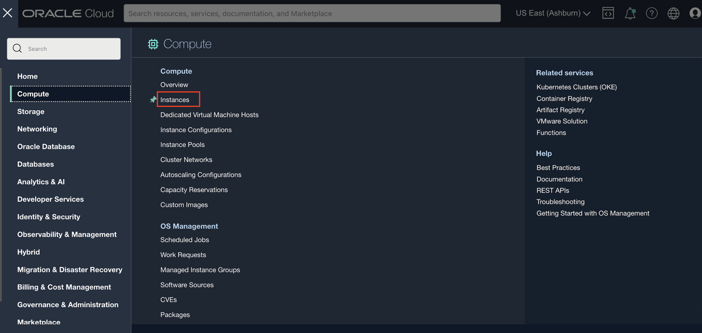

3. Notedown the Private IP address of the Compute Instance for reference. We will require to use them in the further labs.

      


## Task 4: Integrate with Oracle Identity Governance

1. On the Oracle Access Governance service home page *refer Lab 2:Task 1*, click on the Navigation Menu icon and select **Service Administration** and then **Orchestrated Systems.**

    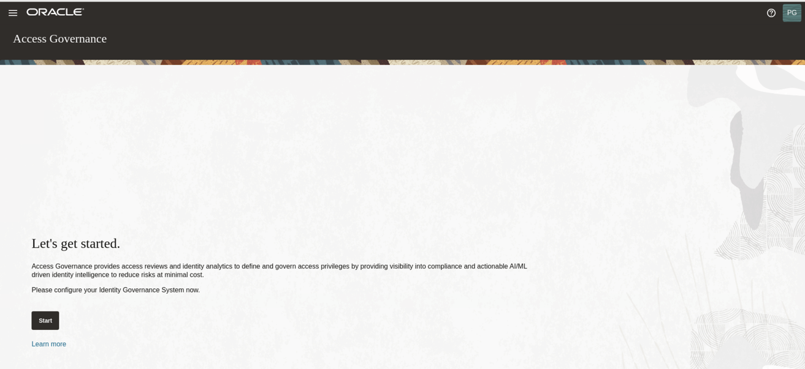

    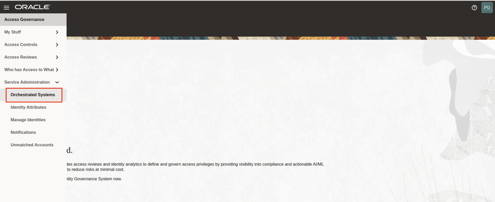

2. Click on **Add an orchestrated system**

    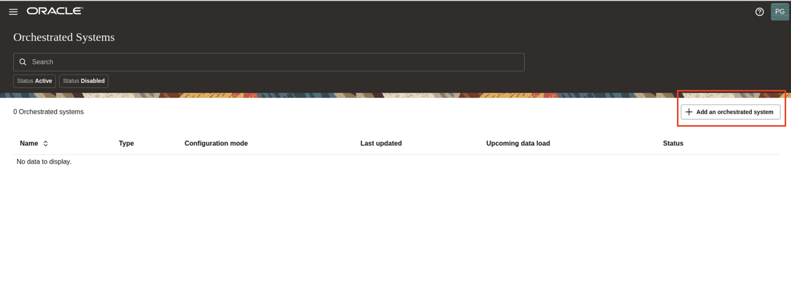

3. On the tile labeled **Select and configure a new orchestrated system**, select **Oracle Identity Governance** to configure the agent for a target Oracle Identity Governance connected system, and then click **Next.**

   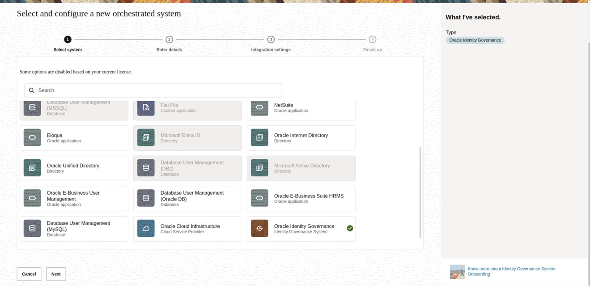

4. On the **Enter Details** step, enter the following details:

    * **Name:** oig
    * **Description:** oig
    * **Click Next.**

    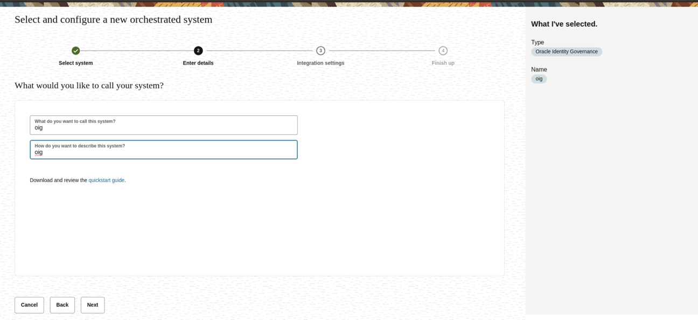

5. On the **Configure** step, enter connection details for the target system:

    **JDBC URL:**
    Replace the placeholder in the below url with the private ip of your compute instance. Refer to *Task 3 : Step 3*  above for the private ip of your compute instance.

    ```
    <copy>jdbc:oracle:thin:@//<--privateipofyourcomputeinstance-->:1521/ORCL.NETWORKSPEOSUBN.IDMOCICLOU02PHX.ORACLEVCN.COM</copy>
    ```

    **OIG Database User Name:**

    ```
    <copy>DEV_OIM</copy>
    ```

    **Password:**

    ```
    <copy>Welcome1</copy>
    ```

    **Confirm Password:**

    ```
    <copy>Welcome1</copy>
    ```

    **OIG Server URL:**
    Replace the placeholder in the below url with the private ip of your compute instance. Refer to *Lab 3 : Task 3*  for the private ip of your compute instance.

    ```
    <copy>http://<--privateipofyourcomputeinstance-->:14000</copy>
    ```

    **OIG Server User Name:**

    ```
    <copy>xelsysadm</copy>
    ```

     **OIG Server User Password:**

    ```
    <copy>Welcome1</copy>
    ```

    **OIG Server Confirm Password:**

    ```
    <copy>Welcome1</copy>
    ```

     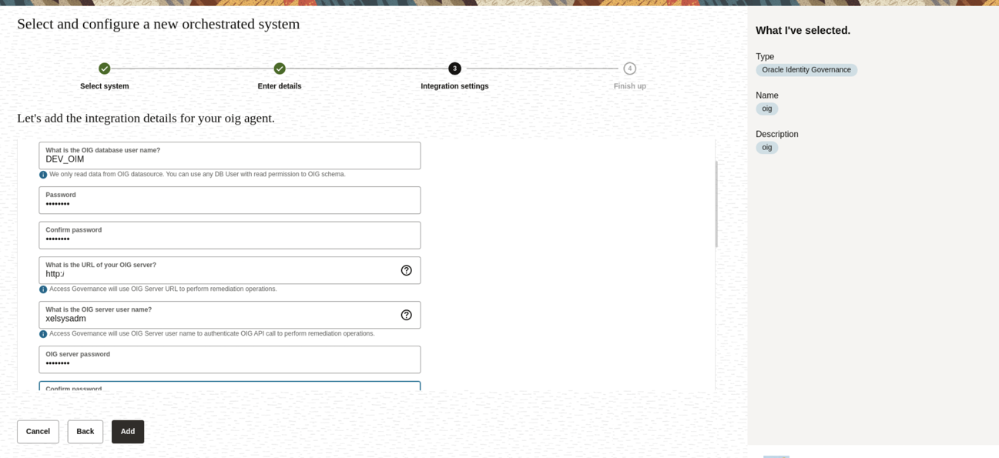

6. On the Download Agent step, select the *Download link* and download the agent zip file. The zip file is present in: /home/opc/Downloads

    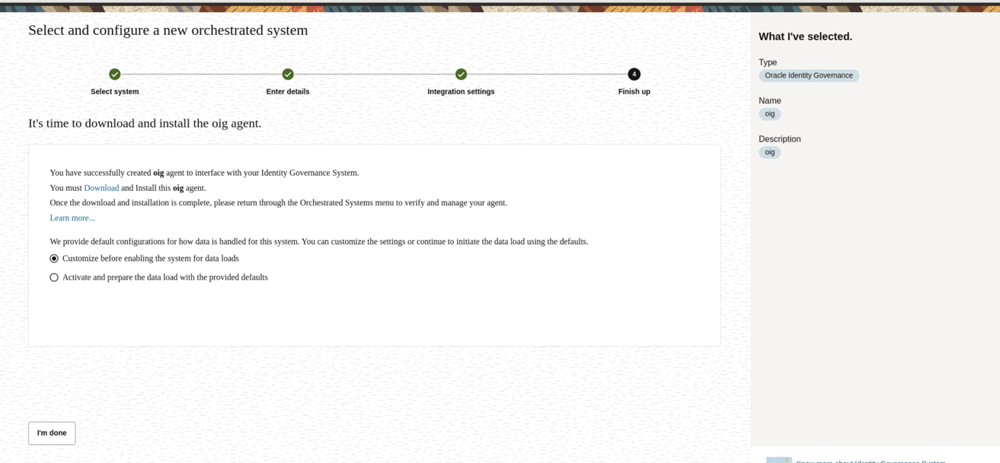

7. You can verify the downloaded agent zip file.

    
    Choose the option Customize before enabling the system for data loads. Click on **I'm done**

     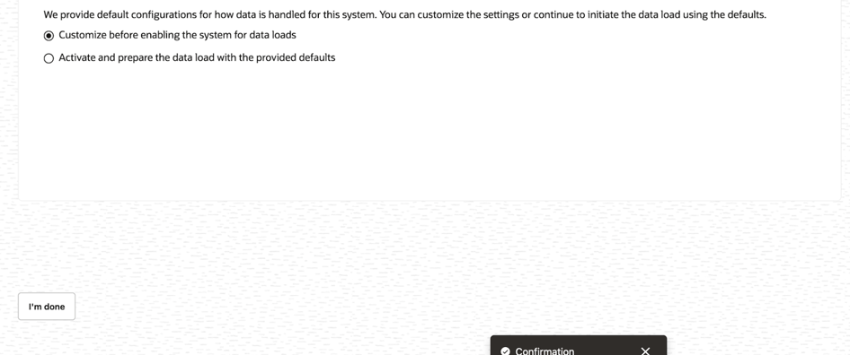

    Select **Matching Rules -> Manage**

     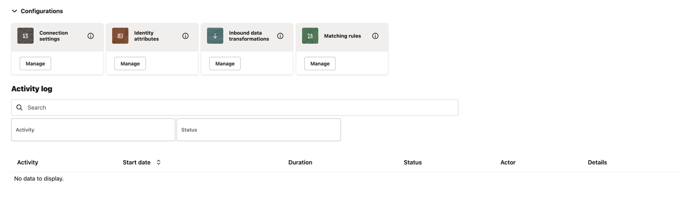

    Under **All** , select the following condition:

    Select connected system attribute: Employee user name

    Select operator: equals

    Select Identity attribute: Employee user name

    Click **Save**

     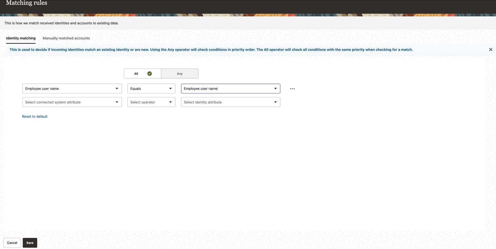

    Navigate back to the orchestrated system. It is in draft status. 

    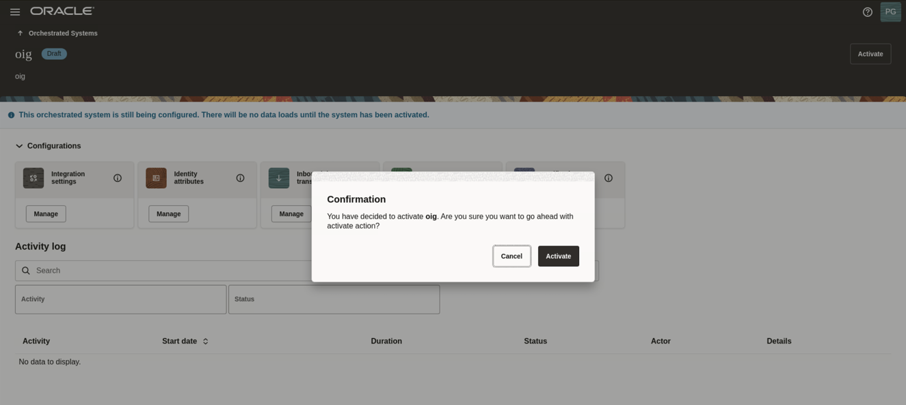

    Click on **Activate**. Confirm the Activation of oig in the pop-up dialog box. 


## Task 5: Install OIG Agent on the Compute Instance and Configure

1. Open the terminal session.

    

2. Move the downloaded zip file (oig.zip) present in the /home/opc/Downloads folder to /home/opc/zip_oag folder.

    ```
    <copy>mv /home/opc/Downloads/oig.zip /home/opc/zip_oag</copy>
    ```

    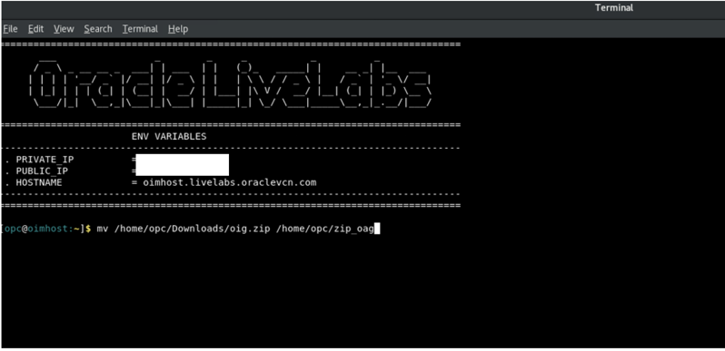

    Verify the Agent zip (oig.zip) is present inside folder zip_oag.

    ```
    <copy>cd /home/opc/zip_oag</copy>
    <copy>ls</copy>
    ```

    

3. Setting the Environment variables using the below command:

    ```
    <copy>cd ~</copy>
    <copy>source oag_agent.env</copy>
    ```

    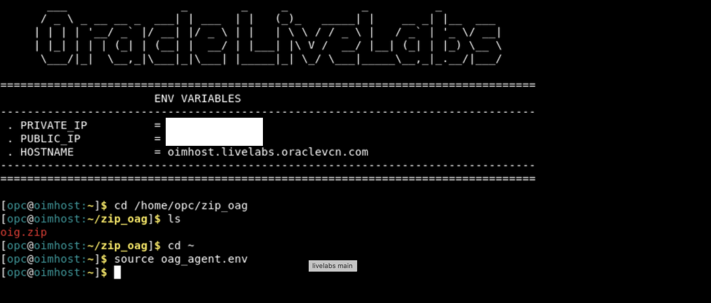

4. Install the agent

    ```
    <copy>sh agentManagement.sh --volume /home/opc/vol_oag --agentpackage /home/opc/zip_oag/oig.zip --install</copy>
    ```

    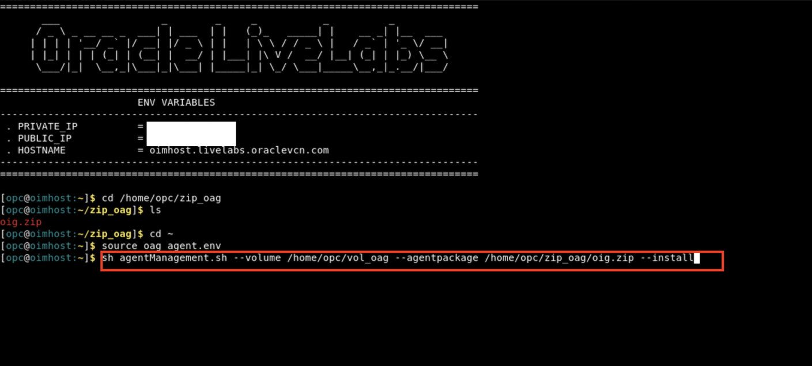

5. Start the agent

    ```
    <copy>sh agentManagement.sh --volume /home/opc/vol_oag --start</copy>
    ```

    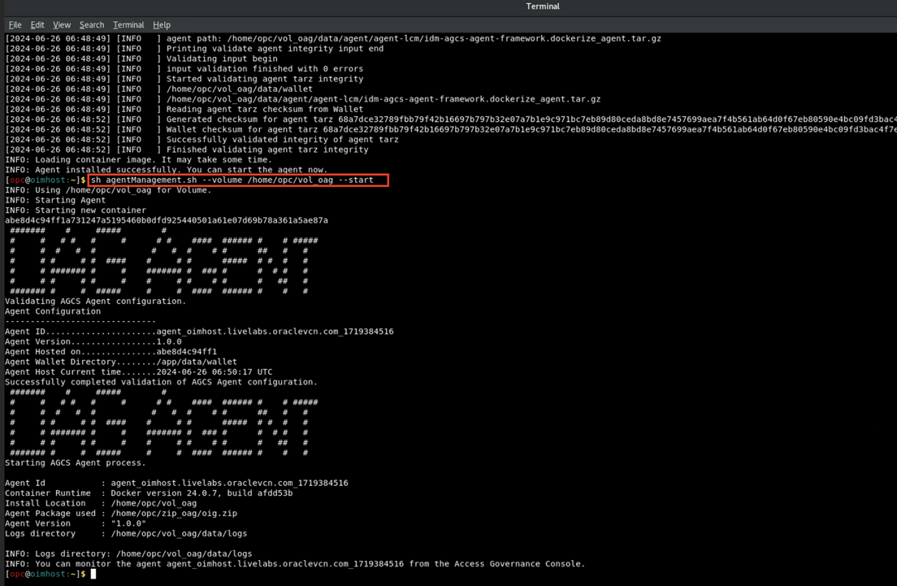

6. Verify the agent

    ```
    <copy>sh agentManagement.sh --volume /home/opc/vol_oag --status</copy>
    ```

    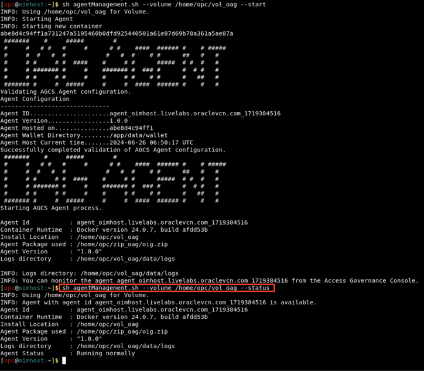

    Navigate back to the orchestrated system. Click on the Activate on the top-right corner.

    To confirm, click on Activate .
  

    The system is now **Active**. Click on **Load data** now to load the data.


    If the connection details are successfully validated, you will see the **Success** status for the **Validate** operation. The Full Data Load operation may take upto a few minutes, depending upon the data available in your OCI tenancy. The incremental data load is run every four hours for this connected system to sync the data.

    


  You may now **proceed to the next lab**.

## Learn More

* [Oracle Access Governance Create Access Review Campaign](https://docs.oracle.com/en/cloud/paas/access-governance/pdapg/index.html)
* [Oracle Access Governance Product Page](https://www.oracle.com/security/cloud-security/access-governance/)
* [Oracle Access Governance Product tour](https://www.oracle.com/webfolder/s/quicktours/paas/pt-sec-access-governance/index.html)
* [Oracle Access Governance FAQ](https://www.oracle.com/security/cloud-security/access-governance/faq/)

## Acknowledgements

* **Authors** - Anuj Tripathi, Anbu Anbarasu
* **Last Updated By/Date** - Indira Balasundaram 29 May 2024