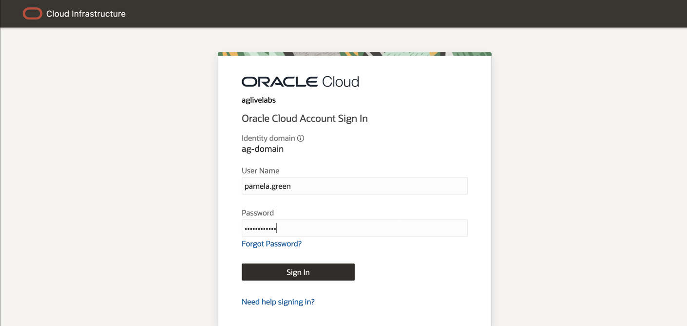
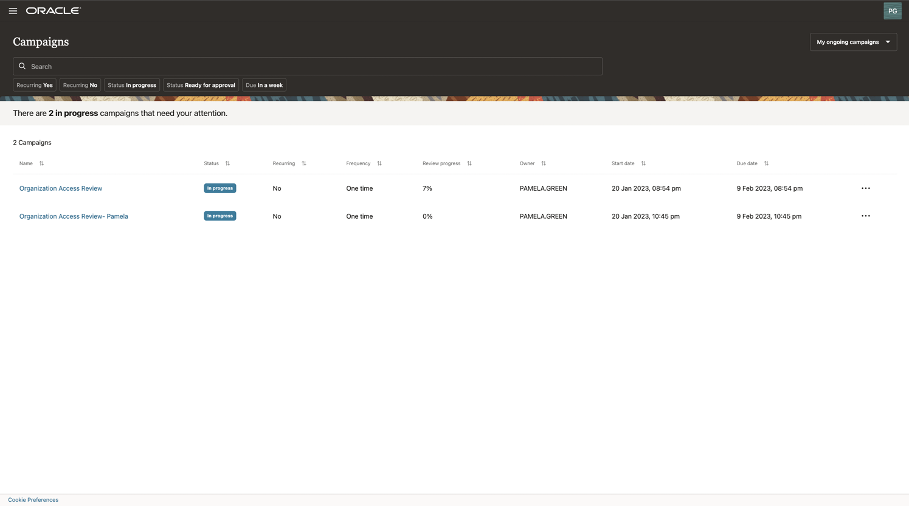
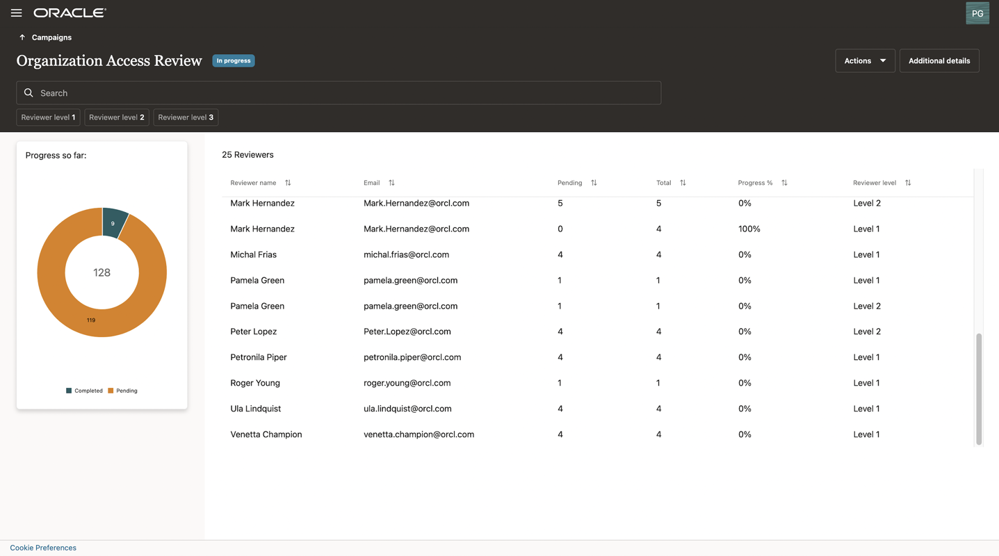
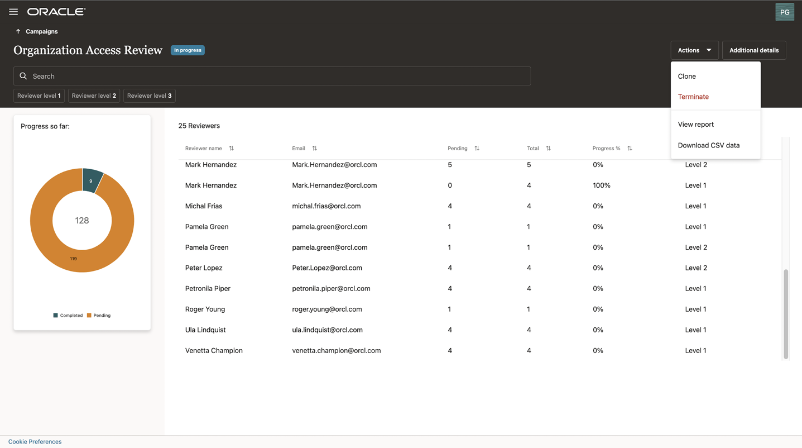

# Manage access review campaign (campaign owner)

## Introduction

Users with the **campaign administrator** role can monitor and manage access review campaigns using the **Oracle Access Governance** console. Users can view the progress of **on-going campaigns**, view and download detailed campaign analysis reports, clone **previous campaigns**, terminate **on-going campaigns**, etc. 

* Estimated Time: 10 minutes
* Persona: Campaign Administrator

Watch the video below for a quick walk-through of the lab.
[Manage Access Review Campaigns](videohub:1_b19sk9f6)

### Objectives

In this lab, you will:
* View a list of **certification campaigns** you own or created
* View the progress of **certification campaigns** made by reviewers with **analytics insights**

## Task 1: Login Oracle Access Governance as Campaign Administrator

1. If you are still login as a user from the previous lab, please make sure you log out and log in again. Ensure you have **Default** identity domain selected.
2. Log in to **Oracle Access Governance** as a **campaign administrator - Pamela Green** with a username and password provided by LiveLabs instruction. **Please note username on LiveLabs step screenshot might be different from the username you received.**
	
3. You should see the **Oracle Access Governance** main dashboard. **Please note data on Oracle Access Governance main dashboard in your assigned system might be different from LiveLabs step screenshot.**
  

## Task 2: Manage and Monitor Ongoing Certification Campaigns

1. Access Review Campaigns are organized by **Upcoming Campaigns**, **On-going Campaigns**, and **Previous Campaigns**. Click on the **Select** button of the tile **Show me my ongoing campaigns**.
  
2. You will see a list of **in progress** campaigns you own or created. Select the campaign you created in this lab.
  
3. You can have an insight into the progress made by reviewers. View how many **reviewers** are assigned to this campaign. For each reviewer, how many review items do they get assigned, and what are the percentage of progress did they make?
  
4. Click on the button **Additional Details** to see more details of the selected campaign.
  
5. Click on the drop-down menu of **Actions** and select **View report** to view a report showing the progress details of the selected campaign. If the **campaign progress report** has not yet been generated, pick a previous campaign to view **progress report**.
  
6. You can review out-of-the-box analytics and reports on campaign progress. You can also download the report as a PDF file. 
  
7. Click **Close** and go back to the campaign detail screen, click on the **Actions** drop-down menu. You have the option to **Terminate** the current campaign. You also have the option to **Clone** the current campaign. 
  
8. Click on **Clone** and enter a new name for the campaign, select **Run now**, then click on **Create**. You now create a new campaign by cloning an existing campaign. 
  
9. During this lab, as a **campaign administrator**, you have leveraged the analytics features delivered by **Oracle Access Governance** to have insights on campaign progress status. You also learn how to quickly create a new campaign by cloning an existing campaign. 

  You may now **proceed to the next lab**
  
## Learn More

* [Oracle Access Governance Manage Access Review Campaign](https://docs.oracle.com/en/cloud/paas/access-governance/kfdck/index.html)
* [Oracle Access Governance Product Page](https://www.oracle.com/security/cloud-security/access-governance/)
* [Oracle Access Governance Product tour](https://www.oracle.com/webfolder/s/quicktours/paas/pt-sec-access-governance/index.html)
* [Oracle Access Governance FAQ](https://www.oracle.com/security/cloud-security/access-governance/faq/)

## Acknowledgments
* **Author** - Anuj Tripathi, Indira Balasundaram, Anbu Anbarasu 
* **Contributors** - Edward Lu 
* **Last Updated By/Date** - Anbu Anbarasu, Cloud Platform COE, January 2023
