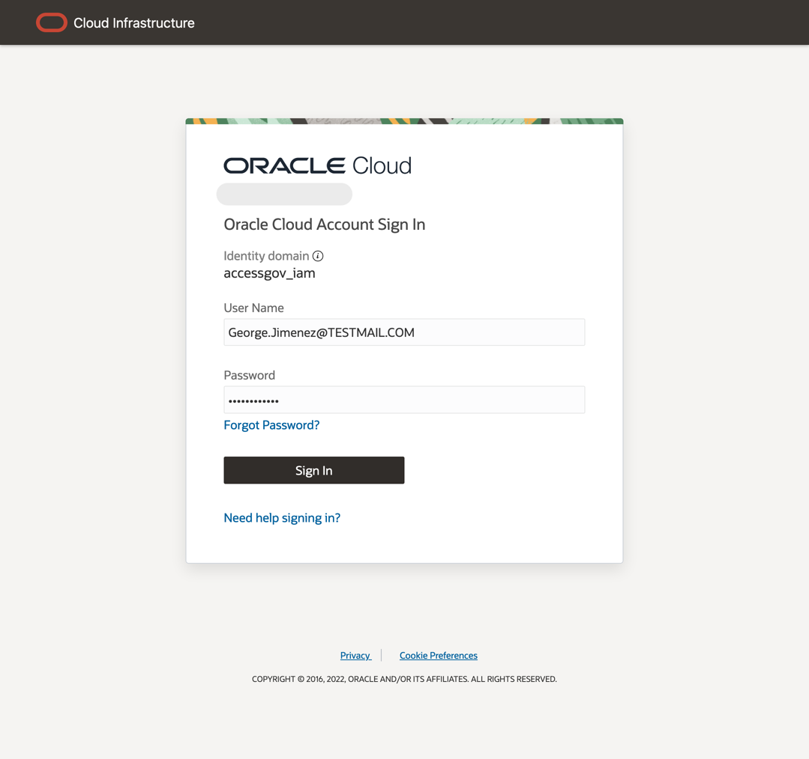
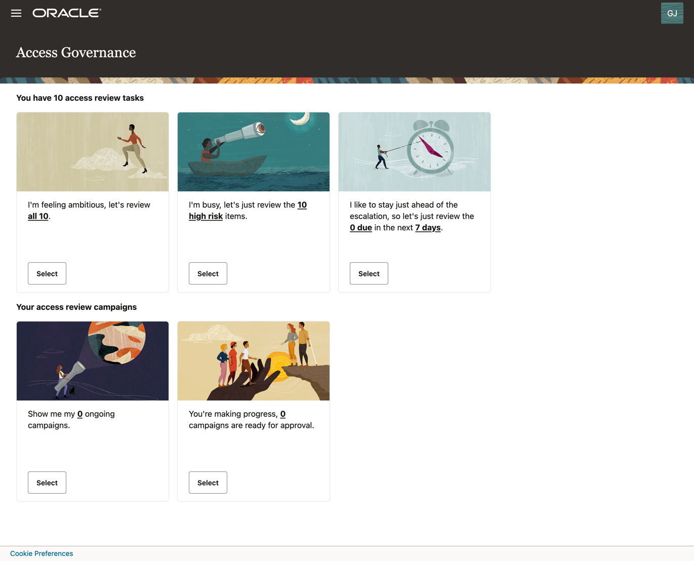
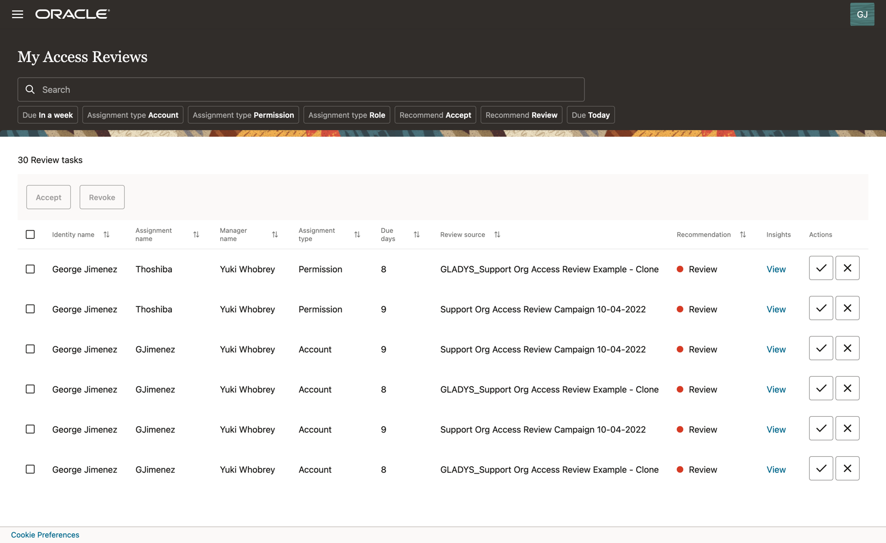
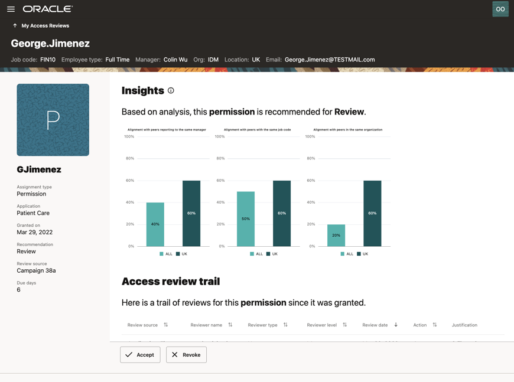
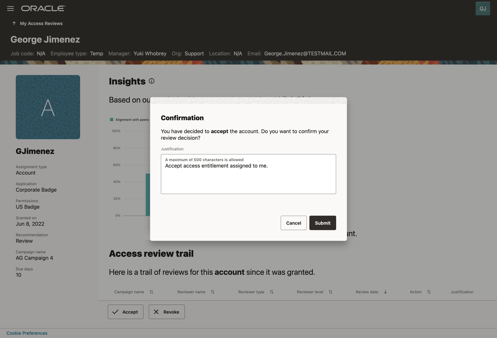
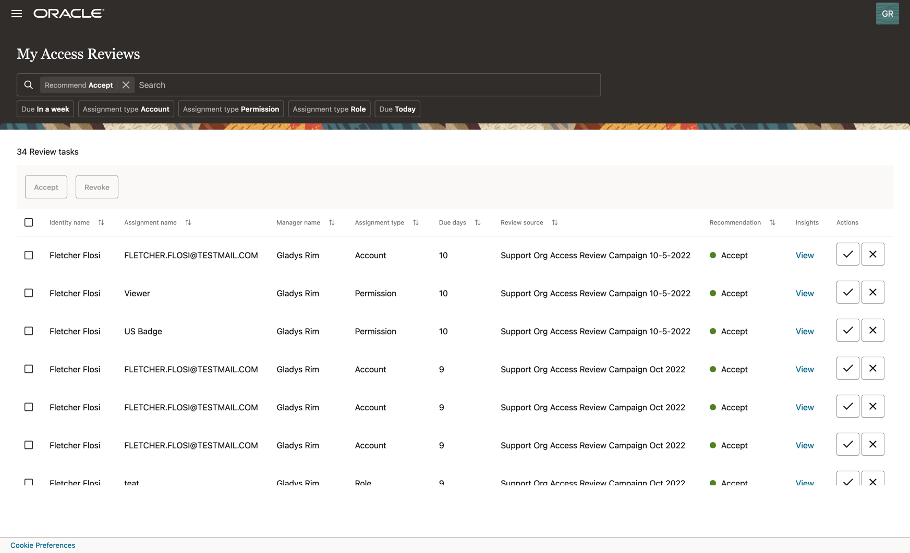
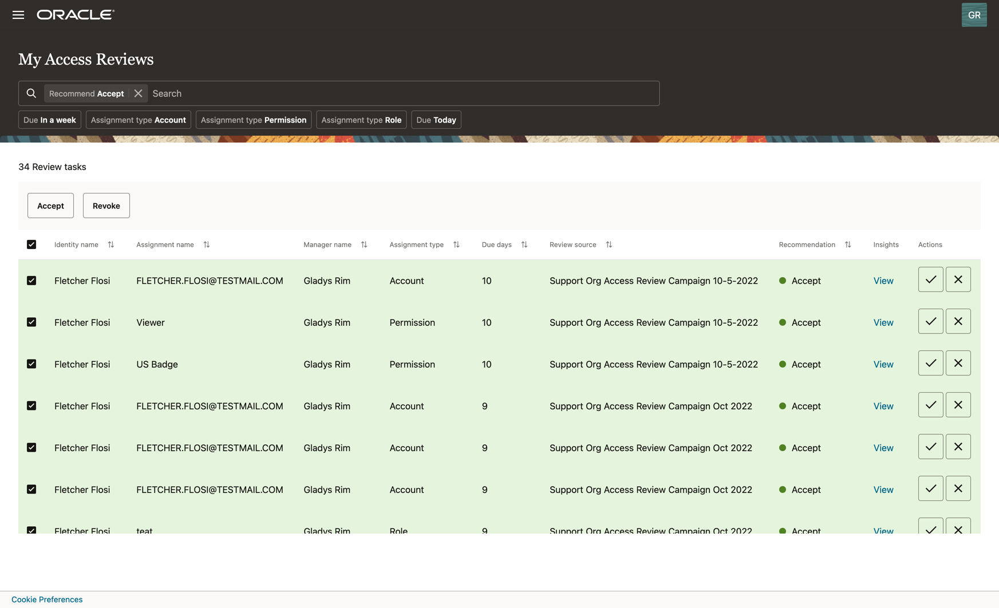
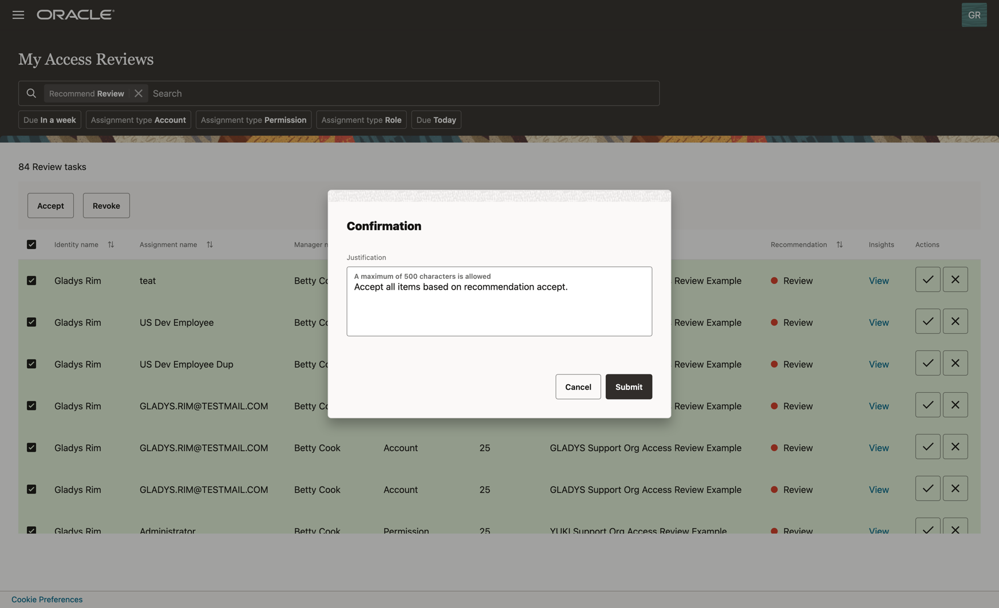
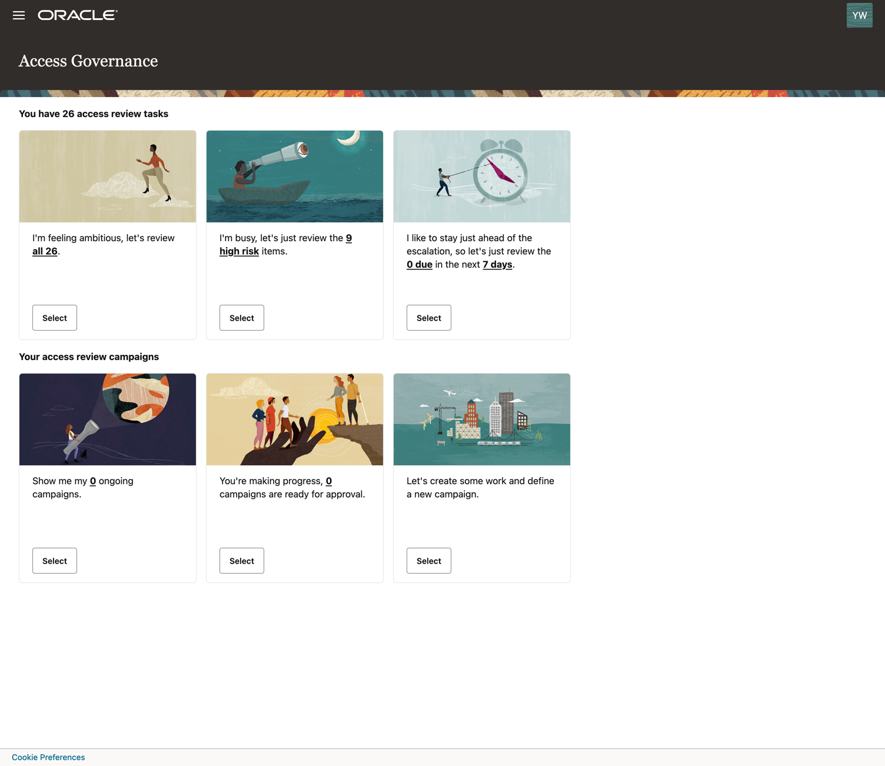
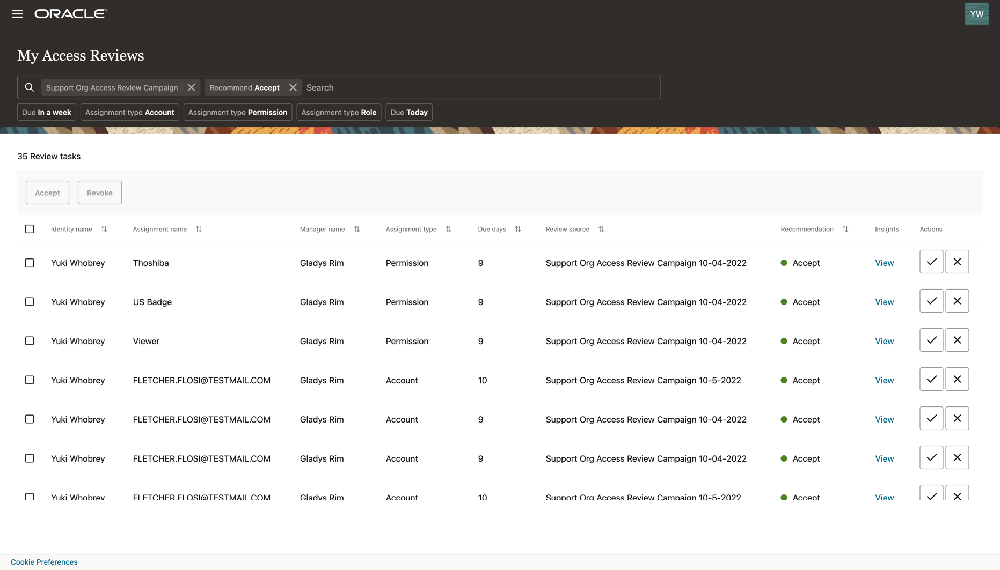

# Perform access review task

## Introduction

**Access reviews** can be carried out from the **Oracle Access Governance** console by users with the following roles, which are based on data attributes derived from the connected system:

* **User** (review access assigned to me/self)
* **Manager** (review access assigned to users in my team)
* **Owner** (review access assigned to users over resources I own)

Based on the workflow setup in the first lab **Create Access Review Campaign**, **Oracle Access Governance** distributes access reviews to corresponding reviewers across the selected organization. In this lab, **employee user** is the first-level reviewer, and **user manager** is the second-level reviewer. By leveraging the **prescriptive analytics** and **insights** embedded in access reviews, employees and user managers can make informed decisions about access entitlements. Users can also bulk approve low-risk items based on **AI/ML recommendations** from the system. 
* Estimated Time: 20 minutes
* Persona: Employee and User Manager

Watch the video below for a quick walk-through of the lab.
[Perform Access Review](videohub:1_kui9p56v)

### Objectives

In this lab, you will:
* Accept or revoke the **access review task** assigned to me from the **certification campaign** as an **employee user**
* Accept or revoke the **access review task** assigned to me from the **certification campaign** as a **user manager**

## Task 1: Login Oracle Access Governance as Employee User

1. Open Chrome browser and go to **Oracle Access Governance** URL based on your **group** assignment. 
    - [Oracle Access Governance LiveLabs Group 1](https://accessgov-ocw-01-yzukikevdw6w.access-governance.us-ashburn-1.oci.oraclecloud.com/ui/)
    - [Oracle Access Governance LiveLabs Group 2](https://accessgov-ocw-002-yzukikevdw6w.access-governance.us-ashburn-1.oci.oraclecloud.com/ui/)
    - [Oracle Access Governance LiveLabs Group 3](https://accessgov-ocw-03-yzukikevdw6w.access-governance.us-ashburn-1.oci.oraclecloud.com/ui/)
    - [Oracle Access Governance LiveLabs Group 4](https://accessgov-ocw04-yzukikevdw6w.access-governance.us-ashburn-1.oci.oraclecloud.com/ui/)
2. If you are still login as a user from the previous lab, please make sure you log out and log in again. Ensure you have **accessgov_iam** identity domain selected.
3. Log in to **Oracle Access Governance** as an **employee user** with a username and password provided by LiveLabs instruction. **Please note username on LiveLabs step screenshot might be different from the username you received.**
	
4. You should see the **Oracle Access Governance** main dashboard. **Please note data on Oracle Access Governance main dashboard in your assigned system might be different from LiveLabs step screenshot.**
  

## Task 2: Perform access review task (Employee User Review)

1. Select one of the Access Reviews Tasks tiles. For this lab, click on the **Select** button of the tile **I'm feeling ambitious, let's review all...**
  
2. You will see a list of **access review tasks** assigned to you from the **access review campaigns** scheduled from the first lab. You may do a search for the access review tasks created from the first lab based on the **Review source** aka **Campaign name** value in the middle column of the table, which you note down in **Lab 1**. In case the **campaign** from the first lab has not been started yet, you can also pick a **review task** from a pre-configured campaign. In that case, select the access review tasks with **Review source** as **...Org Access Review Example**, for example, **Support Org Access Review Example**. To review the access, please follow the below steps:
    - Check review task information such as **Identity name**, **Assignment name**, **Manager name**, **Assignment type**, and **Due days** for which the task is raised.
    - Filter the review tasks list by selecting **Recommend Accept** or **Recommend Review**. Based on **Prescriptive Analytics** powered by ML algorithm, **Oracle Access Governance** recommends action for each review item based on calculated risk scores and analytics. 
    - You may choose to accept the review item by clicking on **Accept** in the **Actions** column. This action is suggested for **Recommend Accept** items only. 
    - In case you want to view the analytic insights, especially for items flagged as **Recommend Review**, you may click on the **View** in **Insights** column to review a task.
  
Insights include:
    - AI/ ML driven insights with **alignment score** uses AI/ML **peer group analysis** conducted by **Oracle Access Governance** to recommend this item for **Review** or **Accept** 
    - Description of the review task
    - Access review trail
    - Recent changes in user’s profile
  
3. Decide (Accept or Revoke): Review all insights and select to **accept** or **revoke** this access privilege. In this lab, you may pick one access review with **Recommend Review**, view the detail, and **Accept** it. Enter **justification** for why you accept this access review item, which will be logged in **Access review trail**. **Accept** the review task item will trigger the **current review task** assigned to the second-level reviewer, which is the **user manager** in the next task. On the contrary, **revoke** access by an **employee user** will not trigger next-level access review by the **manager user**.  
  
4. Bulk action based on recommendation: You may also select multiple review tasks and decide to accept or revoke those privileges. For example, selecting the filter **Recommend Accept** will return a list of access review items recommended by **Oracle Access Governance** for **Accept** based on **prescriptive analytics**. 
  
5. Bulk selection: select all **Recommend Accept** items, then click on **Accept** button. Likewise, select all **Recommend Review** items, then click on **Revoke** button.
  
5. Bulk action with justification: Provide justification for **Accept** or **Revoke** then click on **Submit**.
  

## Task 3: Login Oracle Access Governance as User Manager

1. Open Chrome browser and go to **Oracle Access Governance** URL based on your **group** assignment. 
    - [Oracle Access Governance LiveLabs Group 1](https://accessgov-ocw-01-yzukikevdw6w.access-governance.us-ashburn-1.oci.oraclecloud.com/ui/)
    - [Oracle Access Governance LiveLabs Group 2](https://accessgov-ocw-002-yzukikevdw6w.access-governance.us-ashburn-1.oci.oraclecloud.com/ui/)
    - [Oracle Access Governance LiveLabs Group 3](https://accessgov-ocw-03-yzukikevdw6w.access-governance.us-ashburn-1.oci.oraclecloud.com/ui/)
    - [Oracle Access Governance LiveLabs Group 4](https://accessgov-ocw04-yzukikevdw6w.access-governance.us-ashburn-1.oci.oraclecloud.com/ui/)
2. If you are still login as a user from the previous lab, please make sure you log out and log in again. Ensure you have **accessgov_iam** identity domain selected.
3. Log in to **Oracle Access Governance** as a **manager user** with a username and password provided by LiveLabs instruction. **Please note username on LiveLabs step screenshot might be different from the username you received.**
	
4. You should see the **Oracle Access Governance** main dashboard. **Please note data on Oracle Access Governance main dashboard in your assigned system might be different from LiveLabs step screenshot.**
  

## Task 4: Perform access review task (User Manager Review)

1. In this lab, the user manager is the second-level reviewer. As user manager, you see the access review items your employee users accepted in the previous task. Click on the **Select** button of the tile **I'm feeling ambitious, let's review all...**. As an alternative, you can also click the **Select** button for the tile **I am busy, let's just review...** to review **high risk** items only. 
  
2. You will see a list of access review tasks assigned to you from access review campaigns or from your employee's access review results which you are the second-level reviewer as manager. Search the review task triggered by **Task 2: Perform access review task (Employee User Review)** by **Identity name** and **Assignment name**. You may also narrow down the list by searching the access review tasks based on the **Review source** aka **Campaign name** value in the middle column of the table. For review tasks:
    - Check review task information such as **Identity name**, **Assignment name**, **Manager name**, **Assignment type**, and **Due days** for which the task is raised.
    - Filter the review tasks list by selecting **Recommend Accept** or **Recommend Review**. Based on **Prescriptive Analytics** powered by **AI/ML algorithm**, **Oracle Access Governance** recommends action for each review item based on calculated risk scores and analytics.
    - You may choose to accept or revoke the review item by clicking on **Accept** or **Revoke** in the **Actions** column. The **Accept** action is suggested for **Recommend Accept** items only.
    - In case you want to view the analytic insights, especially for item flagged as **Recommend Review**, you may click on the **View** in **Insights** column to review a task.
  
Insights include:
    - AI/ ML driven insights with **alignment score** uses AI/ML **peer group analysis** conducted by **Oracle Access Governance** to recommend this item for **Review** or **Accept** 
    - Description of the review task
    - Access review trail, you should see the **justification** entered by your employee self-reviewer in the previous task. 
    - Recent changes in user’s profile
  
3. Decide (Accept or Revoke): Review all insights and select to **Accept** or **Revoke** this access privilege. In this lab, you may pick one access review with **Recommend Review**, view the detail, and **Revoke** it, which will trigger the auto-remediation process in the **Oracle Access Governance** system. 
4. During this lab, you have navigated the **Oracle Access Governance** console to select **access review tasks** assigned to you as an **employee** and **manager user**, view **prescriptive analytics** and **recommendation** proposed by **Oracle Access Governance**, and make informed decisions **Accept** or **Revoke** for review tasks based on **peer group analysis** and **insights**. 
5. You may now **proceed to the next lab**. 

## Learn More

* [Oracle Access Governance Perform Access Review Campaign](https://docs.oracle.com/en/cloud/paas/access-governance/aarrs/index.html)
* [Oracle Access Governance Product Page](https://www.oracle.com/security/cloud-security/access-governance/)
* [Oracle Access Governance Product tour](https://www.oracle.com/webfolder/s/quicktours/paas/pt-sec-access-governance/index.html)
* [Oracle Access Governance FAQ](https://www.oracle.com/security/cloud-security/access-governance/faq/)

## Acknowledgments
* **Author** - Anuj Tripathi, Indira Balasundaram, Anbu Anbarasu 
* **Last Updated By/Date** - Anbu Anbarasu, Cloud Platform COE, January 2023
