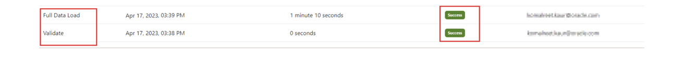

# Setup Identity Orchestration between Oracle Acccess Governance and OCI IAM 

## Introduction

As OCI Tenancy Administrators and Access Governance Administrators they can learn to integrate Oracle Access Governance with OCI IAM. 

* Estimated Time: 15 minutes
* Persona: Administrator

### Objectives

In this lab, you will:
* Generate API Keys and Oracle Cloud Identifier (OCID) for an Identity User
* Configure a new OCI IAM Cloud Service Connection in Oracle Access Governance Console

## Task 1: Generate API Keys and Oracle Cloud Identifier (OCID) for an Identity User

You need to generate API Keys for the identity user (Admin user who is part of the ag-group) and note OCID for that identity user. You will use it to configure your cloud service provider on the Oracle Access Governance Console.

1. On OCI console, from the navigation menu, select **Identity & Security**, and then **Domains.**

2. Select the **root** compartment and **ag-domain** domain.

3. From the left pane, select **Users.**

4. Select the identity user. In this tutorial, select the **Admin user**

5. On the left pane, in the **Resources** section, select **API keys.**

6. Click the **Add API** key button, and then select **Generate API key pair.**

7. Download the private key and save it.

8. Click **Add.** The configuration file is created displaying ocid, fingerprint, tenancy and region details.

9. Save the information available on the configuration file in a separate text file. For this tutorial, you will be using this information in **Task 2** of this lab.

  

## Task 2: Configure a new OCI IAM Cloud Service Connection in Oracle Access Governance Console

1.  In a browser, navigate to the Oracle Access Governance service home page and log in as a user with the Administrator application role.

2.  On the Oracle Access Governance service home page, click on the Navigation Menu icon, and select **Service Administration → Connected Systems**

3. Select the **Add a connected system** button from the Connected Systems page.

4.  Select the **Would you like to connect to a cloud service provider?** tile by clicking the Add button.

5. In the **Select system** step, select the **Oracle Cloud Infrastructure** tile and then click **Next.**

6. In the **Enter details** step, enter name and description of the connected system, and then click **Next.**

  

7. In the **Configure** step, add the connection details of the identity user, generated in **Task 1**

8. Click **Add.** If the connection details are successfully validated, you will see the **Success** status for the **Validate** operation. The Full Data Load operation may take upto a few minutes, depending upon the data available in your OCI tenancy. The incremental data load is run every four hours for this connected system to sync the data.

  

  You may now **proceed to the next lab**. 

## Learn More

* [Oracle Access Governance Create Access Review Campaign](https://docs.oracle.com/en/cloud/paas/access-governance/pdapg/index.html)
* [Oracle Access Governance Product Page](https://www.oracle.com/security/cloud-security/access-governance/)
* [Oracle Access Governance Product tour](https://www.oracle.com/webfolder/s/quicktours/paas/pt-sec-access-governance/index.html)
* [Oracle Access Governance FAQ](https://www.oracle.com/security/cloud-security/access-governance/faq/)

## Acknowledgments
* **Authors** - Anuj Tripathi, Indira Balasundaram, Anbu Anbarasu 
* **Contributors** - Edward Lu 
* **Last Updated By/Date** - Anbu Anbarasu, Cloud Platform COE, January 2023