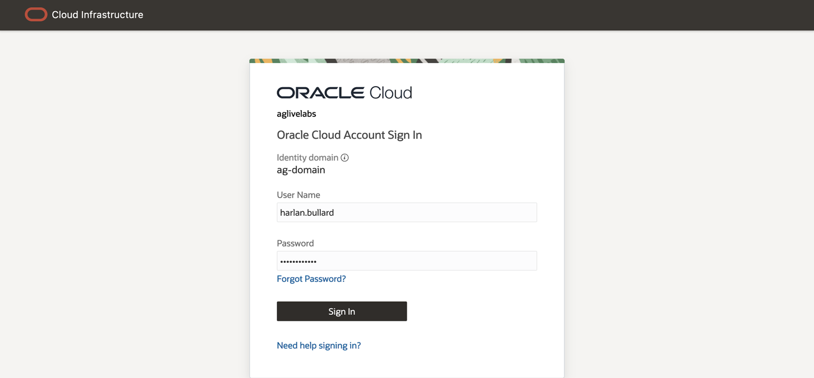

# Check who has access to what for myself or my direct reports

## Introduction

Users can check what access they have or what access their direct reports have. **Managers** can view details of the **applications**, **permissions**, and **roles** assigned to their direct reports. **Employee Users** can view details of the **applications**, **permissions**, and **roles** assigned to themselves.

* Estimated Time: 15 minutes
* Persona: User Manager

Watch the video below for a quick walk-through of the lab.
[Review Who has Access to What](videohub:1_tfcwfcju)

### Objectives

In this lab, you will:
* View details of the **applications**, **permissions**, and **roles** assigned to my direct reports
* View details of the **applications**, **permissions**, and **roles** assigned to me

## Task 1: Login Oracle Access Governance as User Manager

1. Ensure you have **default** identity domain selected.
2. Log in to **Oracle Access Governance** as **User Manager - Harlan Bullard** with the username and password mentioned below.

    **Username:**
    ```
    <copy>harlan.bullard</copy>
    ```

    **Password:**
    ```
    <copy>Oracl@123456</copy>
    ```
    
	
3. You should see the **Oracle Access Governance** main dashboard. **Please note data on Oracle Access Governance main dashboard in your assigned system might be different from LiveLabs step screenshot.** 
  

## Task 2: Review My Direct Report's Access

1. Click on the **Oracle Access Governance** menu, go to **Who has access to what**, then select **My Direct’s Access**.
  
2. You will see a list of users reporting to the current user manager. You may select one user. For example, Select **Mark Hernandez** as an example in the below screen. **Please note employee users in your assigned system might be different from LiveLabs step screenshot.** 
  
3. A list of applications to which **Mark Hernandez** has access is listed. You can select each application and review the privileges assigned to the user in the selected application. For each **application** your employee has, review **Accounts**, **Permission**, **Grant type**, **Date granted**, **Granted until** etc. 
  
4. Select **Roles** from **Group by** drop-down menu to see the list of roles assigned to a user.
  
5. Review **Roles** assigned to users and the detail for each role. 

## Task 3: Review My Access

1. Click on the **Oracle Access Governance** menu, go to **Who has access to what**, then select **My Access**.
  
2. You can review a list of **applications** to which the signed-in user has access. You can select each application and review the privileges assigned to the user.
  
3. Select **Roles** from **Group by** drop-down menu to see a list of roles assigned to the user. You can also click on each **Role** to view details.
4. During this lab, you have navigated the **Oracle Access Governance** console as a **user manager** to list your direct report employees and your own access privileges. This is a security good practice and part of the employees' **Due Care / Due Diligence**.

  You may now **proceed to the next lab**. 


## Learn More

* [Oracle Access Governance Who Has Access To What](https://docs.oracle.com/en/cloud/paas/access-governance/yhaty/index.html)
* [Oracle Access Governance Product Page](https://www.oracle.com/security/cloud-security/access-governance/)
* [Oracle Access Governance Product tour](https://www.oracle.com/webfolder/s/quicktours/paas/pt-sec-access-governance/index.html)
* [Oracle Access Governance FAQ](https://www.oracle.com/security/cloud-security/access-governance/faq/)

## Acknowledgments
* **Author** - Anuj Tripathi, Indira Balasundaram, Anbu Anbarasu 
* **Contributors** - Edward Lu
* **Last Updated By/Date** - Anbu Anbarasu, Cloud Platform COE, January 2023
