# Prepare your environment

## Introduction

This lab walks you through the steps to get started using the Oracle Autonomous Database and initialize it.

Estimated time: 10 minutes

Watch the video below for a quick walk-through of the lab.
[Prepare your environment](videohub:1_3krv0mxe)
<!-- [](youtube:RmiewRNMceQ)-->

### Objectives

-   Learn how to provision a new Autonomous Database
-   Create owner and load dataset to perform the lab

## Task 1: Provision an Autonomous Database

  **Note:** If you plan to use an existing Autonomous Database in your own tenancy, or you are using an Oracle-provided environment, you can skip this step.

1. Log in to the Oracle Cloud Infrastructure

2. Once you are logged in, you are taken to the cloud services dashboard where you can see all the services available to you. Click the navigation menu in the upper left to show top level navigation choices.

    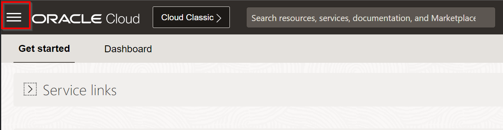

3. The following steps apply similarly to either Autonomous Data Warehouse (ADW) or Autonomous Transaction Processing (ATP). So please **click the provisioning of Autonomous Database of your choice** (here we choose an Oracle Autonomous Data Warehouse but again you can also choose Oracle Autonomous Transaction Processing if you prefer).

    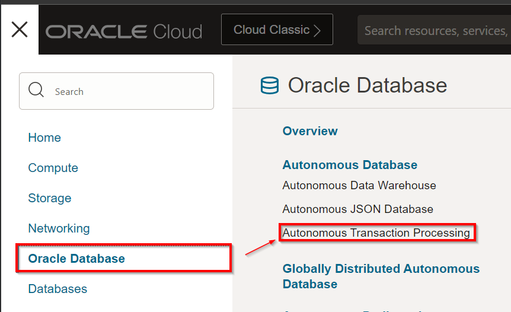

4. From the **Compartment** drop-down list, select your compartment

  **Note:**
     - This console shows that no databases yet exist
     - If there were a long list of databases, you could filter the list by the **State** of the databases (Available, Stopped, Terminated, and so on)
     - You can also sort by **Workload Type** (here, we selected **All**)

         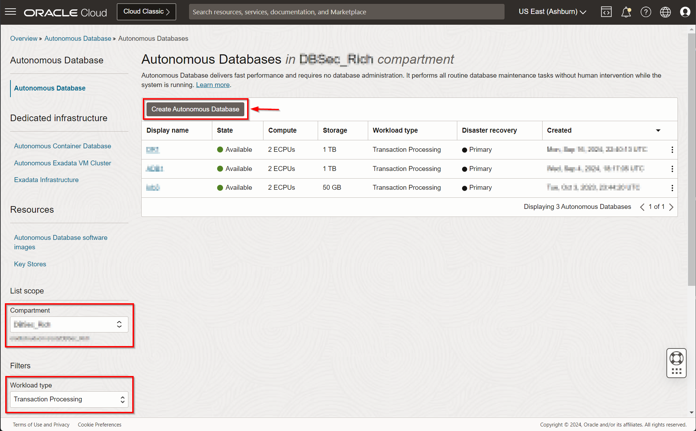


5. Click [**Create Autonomous Database**]

    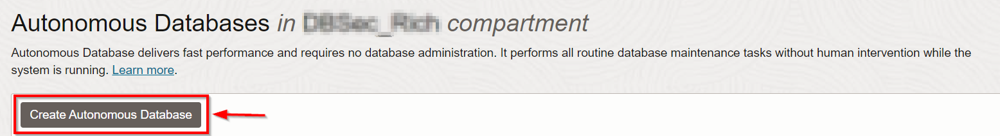

6. On the **Create Autonomous Database** page, provide basic information for your database:
    - **Compartment** - If needed, select your compartment
    - **Display name** - Enter a memorable name for the database for display purposes, for this lab, use *`ADBSecurity`*

        ```
        <copy>ADBSecurity</copy>
        ```

    - **Database Name** - Enter *`ADBSEC01`*, it's important to use letters and numbers only, starting with a letter (the maximum length is 14 characters and Underscores are not supported)
        
        ```
        <copy>ADBSEC01</copy>
        ```

    - **Workload Type** - Select the type of your Autonomous Database to match your choice at Step 3 earlier above (here we select "Transaction Processing")
    - **Deployment Type** - Leave *`Shared Infrastructure`* selected

         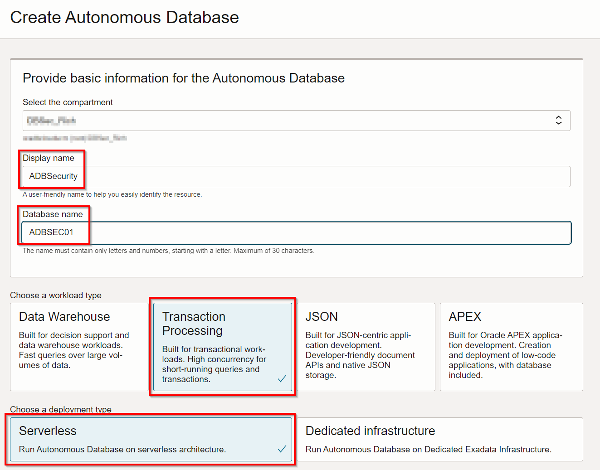

7. Configure the database:

    - **Always Free** - Select this option by moving the slider to the right
    - **Database version** - Select *`23ai`* 
    
         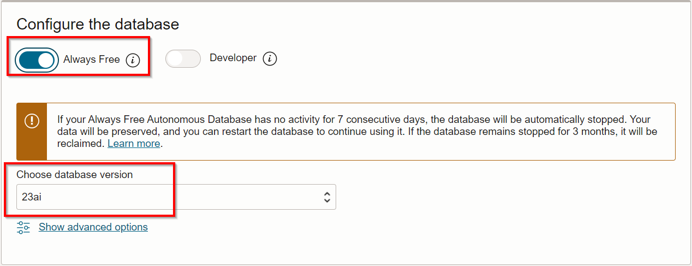


8. Create administrator credentials:

    - **Password** and **Confirm Password** - Specify a password for the ADMIN database user and jot it down. The password must be between 12 and 30 characters long and must include at least one uppercase letter, one lowercase letter, and one numeric character. It cannot contain your username or the double quote (") character. For example : *`WElcome_123#`*

        ```
        <copy>WElcome_123#</copy>
        ```

        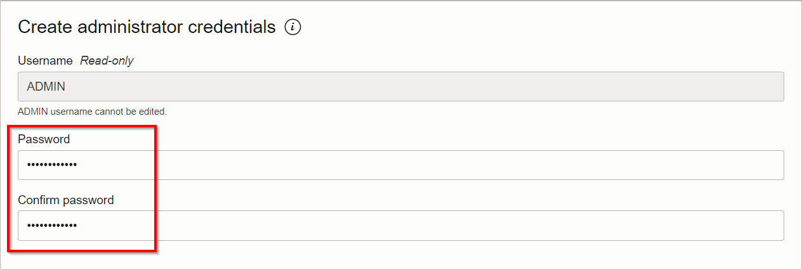

9. Choose the network access and the license type:

    - **Network Access** - Leave *`Secure access from everywhere`* selected
    - **License Type** - Select *`License Included`*
    - **Provide Contacts** - You can leave this blank

         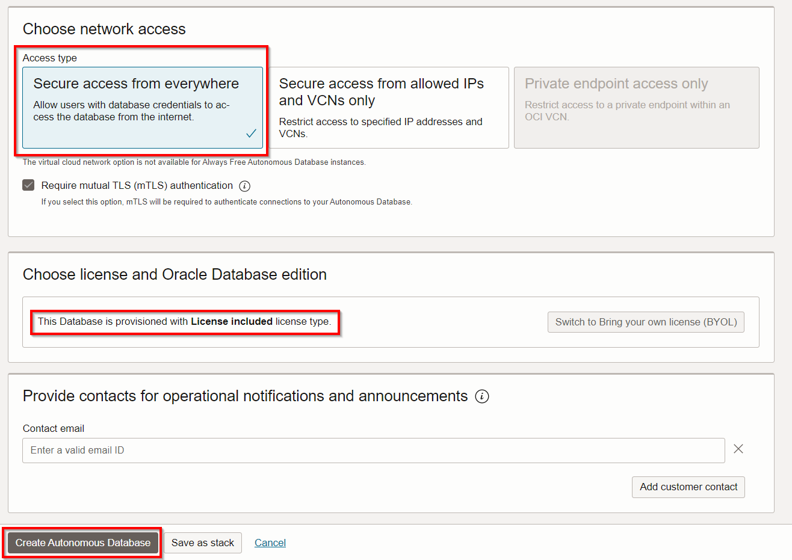

10. Click [**Create Autonomous Database**]

11.  Your instance will begin provisioning. In a few minutes, the state will turn from Provisioning to Available. At this point, your Autonomous Database is ready to use! Have a look at your instance's details here including its name, database version, OCPU count, and storage size.

      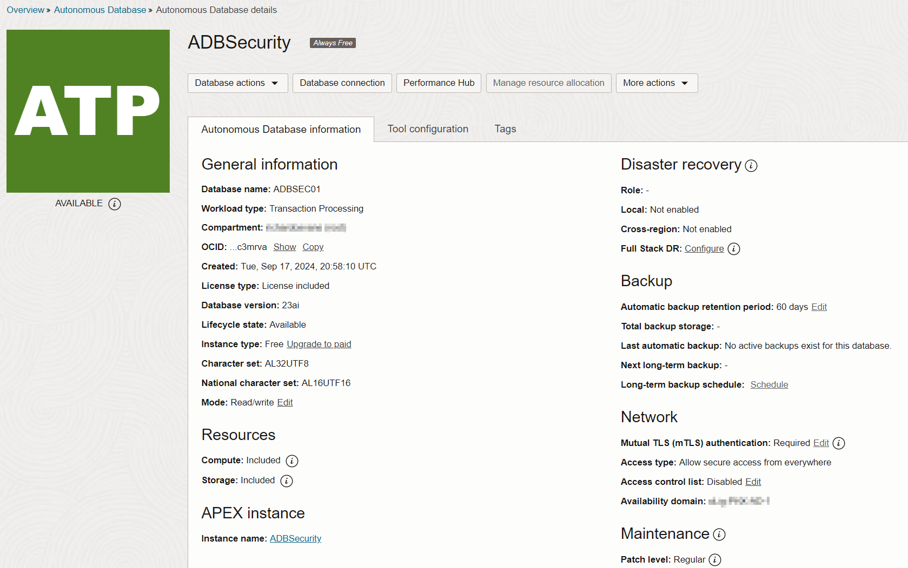

## Task 2: Launch SQL and familiarize yourself with the environment

Although you can connect to your Autonomous Database using local PC desktop tools like Oracle SQL Developer, you can conveniently access the browser-based SQL Worksheet directly from your Oracle Autonomous Data Warehouse or Oracle Autonomous Transaction Processing

1. In your **`ADBSecurity`** database's details page, click the **Database actions** button then click **SQL**. This will open a SQL worksheet.

    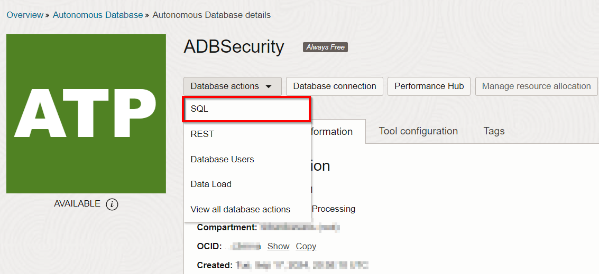

2. The SQL worksheet provides you the ability to run SQL statements against your Autonomous Database. Click the **X** on the tutorial and the warning icons. If this was a production environment, you should follow the tutorial and then create your own, named, account instead of using the **`ADMIN`** database user. 

    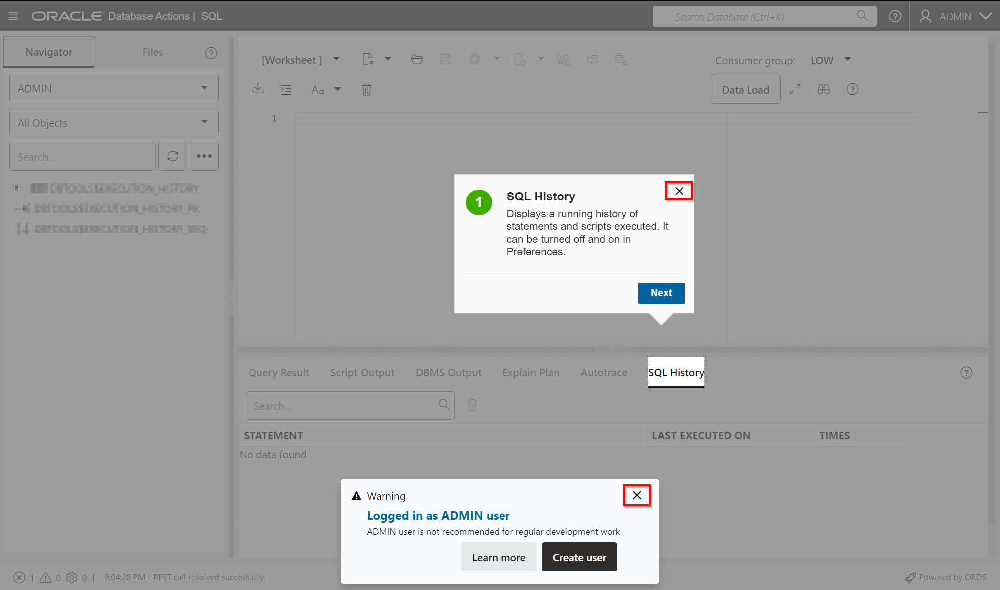

3. The Database Actions SQL worksheet page opens and is ready for you to write or paste your commands. 

    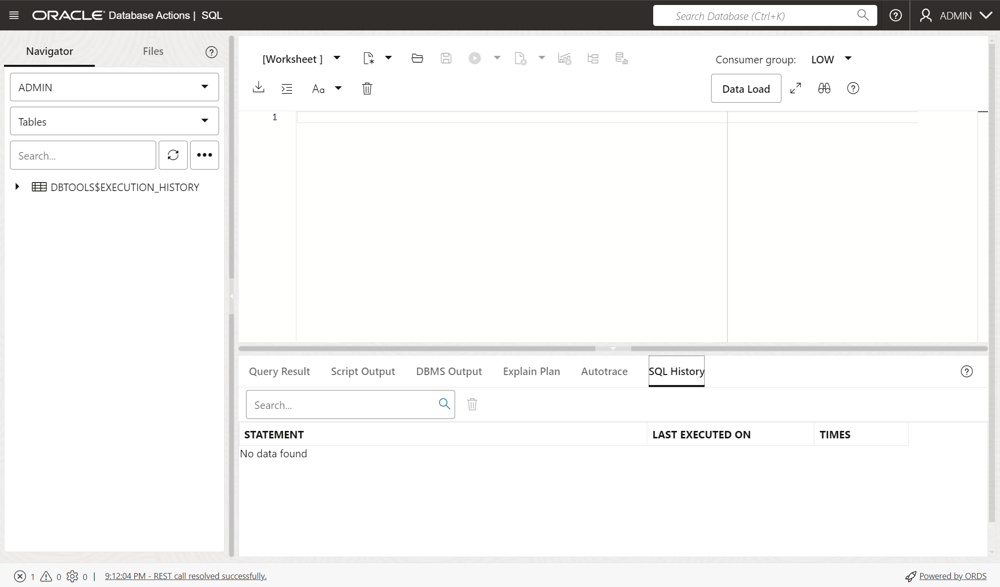

4. In the SQL worksheet, copy and paste the following SQL commands and run them. 

    - Query the current user

        ```
        <copy>
        select user from dual;
        </copy>
        ```

        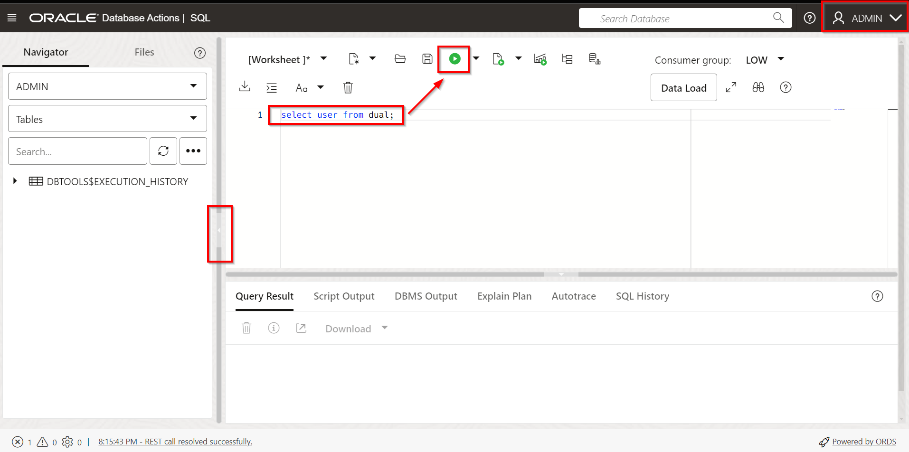

        **Note:** You can hide the left-hand **Navigator** pane by clicking on the **`<`** icon highlighted in red. 

    - Query the current user's session roles and privileges

        ```
        <copy>
        select * from session_roles order by 1;
        </copy>
        ```

        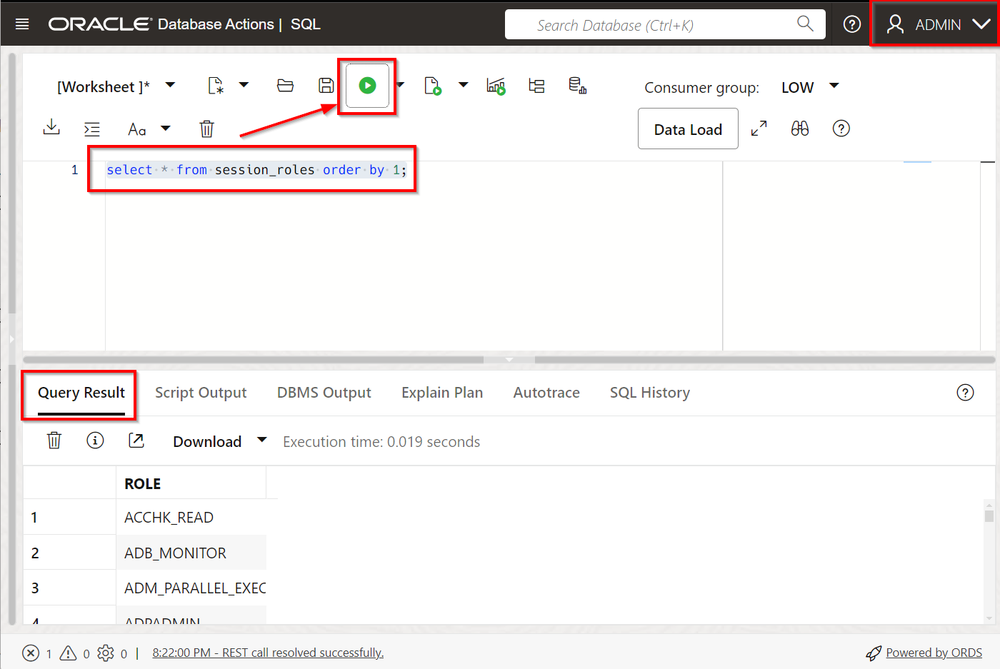

        ```
        <copy>
        select * from session_privs order by 1;
        </copy>
        ```

        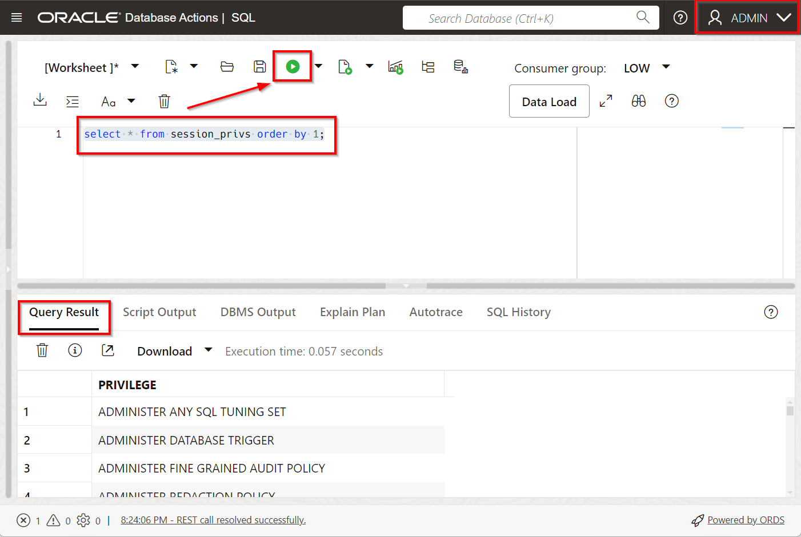
        

5. **Your environment is ready to use!** and you may now proceed to the next lab

## Want to Learn More?

Click [autonomous workflow](https://docs.oracle.com/en/cloud/paas/autonomous-data-warehouse-cloud/user/autonomous-workflow.html#GUID-5780368D-6D40-475C-8DEB-DBA14BA675C3) for documentation on the typical workflow for using Autonomous Data Warehouse.

## Acknowledgements
- **Author** - Hakim Loumi, Database Security PM
- **Contributors** - Rene Fontcha
- **Last Updated By/Date** - Hakim Loumi, Database Security PM - September 2021
