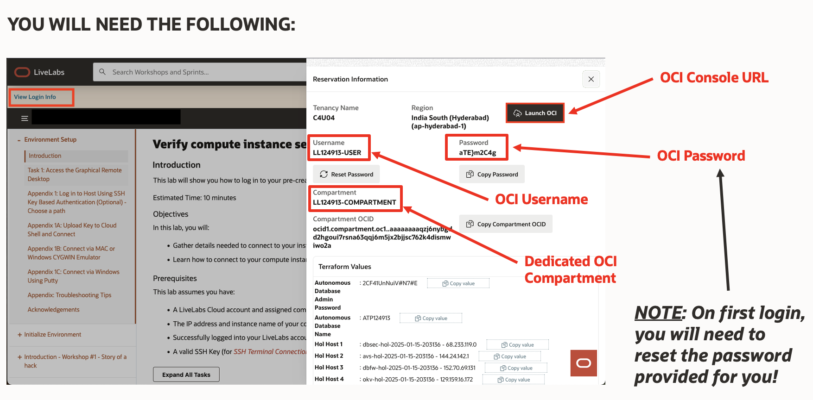
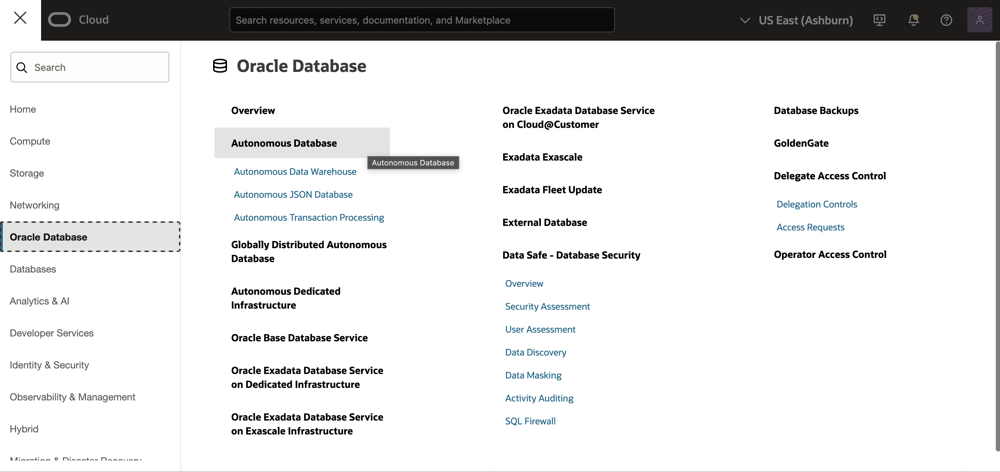
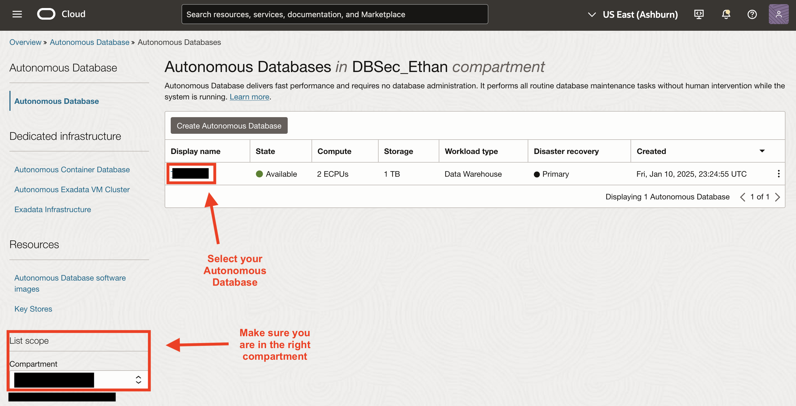

# Access your environment

## Introduction

In this lab, you access and review your LiveLabs Sandbox environment in Oracle Cloud Infrastructure. Your environment comes with a tenancy, a compartment, an Oracle Cloud account in the LiveLabs tenancy, and a pre-provisioned Autonomous Database. Sample data is loaded into your database and your database is registered with Oracle Data Safe.

Estimated Lab Time: 5 minutes

### Objectives

In this lab, you will:

- View your LiveLabs reservation information and sign in to Oracle Cloud Infrastructure (OCI)
- Navigate to and access your Oracle Autonomous Database

### Prerequisites

This lab assumes you have:

- Obtained an Oracle Cloud account and signed in to the Oracle Cloud Infrastructure Console at `https://cloud.oracle.com`

## Task 1: View your LiveLabs Sandbox reservation information and sign in to Oracle Cloud Infrastructure (OCI)

1. In the upper-left corner of the lab instructions page (this page), click the **View Login Info** link. 

    A **Reservation Information** panel is displayed.

2. Review the information. You are provided with the following in Oracle Cloud Infrastructure:

    - Access to one of the LiveLab's tenancies
    - A link that directs you to the sign-in page for Oracle Cloud Infrastructure (**Launch OCI** button)
    - A username and password to sign in to the LiveLabs tenancy. When signing in for the first time, you are prompted to change your password.
    - A compartment of your very own. We refer to this compartment as "your compartment" throughout the workshop. Make note of your compartment's name because you need to select it often throughout the workshop.
    - An Autonomous Database in your compartment. You are provided the password for the `ADMIN` account on your database.

    

3. Make note of your username and click the **Copy Password** button for Oracle Cloud Infrastructure.

4. On the **Reservation Information** panel, click the **Launch OCI** button. Leave the default domain selected, and click **Next**.

    A new browser tab is opened and the sign in page for the LiveLabs tenancy is displayed.

5. Enter your username (if needed) and paste the password into the **Password** box, and then click **Sign In**.

    The **Change Password** page is displayed.

6. In the **Current Password** box, paste your password. In the **New Password** and **Confirm New Password** boxes, enter a new password. Note the password requirements, which are provided on the page. Click **Save New Password**.

    You are now signed in to your LiveLabs Sandbox in Oracle Cloud Infrastructure.

## Task 2: Navigate to and access your Oracle Autonomous Database

1. Navigate to and select the hamburger menu at the top left of the screen, select **Oracle Database**, and then under the overview section select **Autonomous Database**.

    

2. Make sure you are in the correct compartment. Select the Autonomous Database that has already been created for you.

    

You may now **proceed to the next lab**.

## Learn More

- [Oracle Cloud Infrastructure documentation](https://docs.oracle.com/iaas/Content/home.htm)
- [OCI Cloud Free Tier](https://www.oracle.com/cloud/free/)
- [Target Database Registration](https://www.oracle.com/pls/topic/lookup?ctx=en/cloud/paas/data-safe&id=ADMDS-GUID-B5F255A7-07DD-4731-9FA5-668F7DD51AA6)
- [Oracle Data Safe Dashboard](https://www.oracle.com/pls/topic/lookup?ctx=en/cloud/paas/data-safe&id=ADMDS-GUID-B4D784B8-F3F7-4020-891D-49D709B9A302)

## Acknowledgements

- **Author** - Jody Glover, Consulting User Assistance Developer, Database Development
- **Last Updated By/Date** - Ethan Shmargad, February 10, 2025
