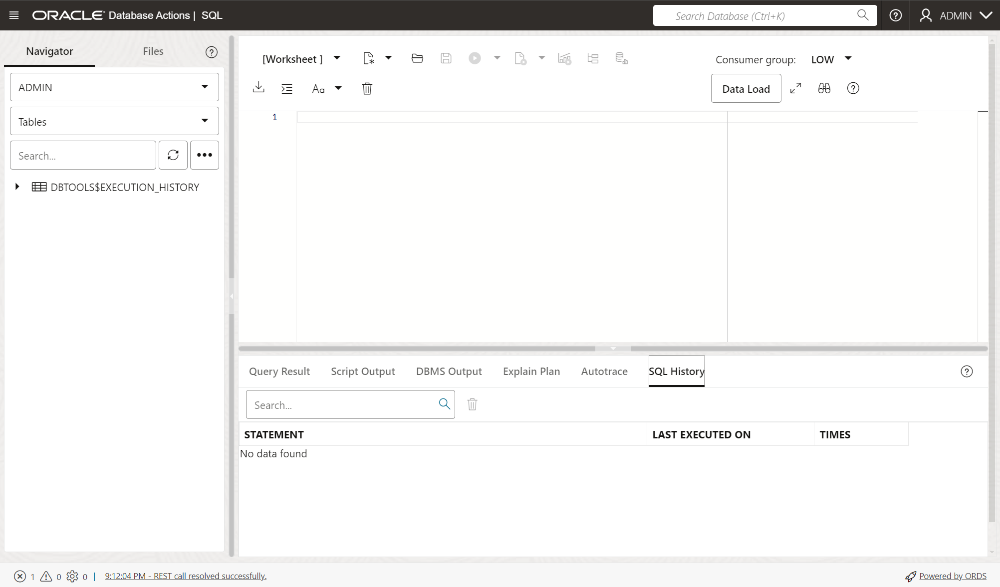

# Oracle Data Redaction on an Autonomous Database

## Introduction
This workshop introduces the various features and functionality of Oracle Data Redaction. It gives the user an opportunity to learn how to configure those features in an Autonomous Database to prevent unauthorized access to sensitive data. 

**Oracle Data Redaction helps secure existing database environments transparently, eliminating costly and time consuming application changes.**

Oracle Data Redaction enables you to obscure data that is returned from queries without affecting the data directly. This is done by redacting (selectively removing or obscuring sensitive or confidential information) the results of database queries just before presenting the results. You can apply a Data Redaction policy to a table, view, or materialized view. Then, you apply the policy on the table to specific columns in the table. In this lab, you will use several methods to redact column data.  Unlike data masking, which masks sensitive data by permanently replacing it with fictitious but realistic data, data redaction redacts data as it is received from the database, leaving the data in the database unchanged.


*Estimated Time:* 60 minutes

*Version tested in this lab:* Oracle Autonomous Database 23ai

### Video Preview

Watch a preview of "*Data Redaction - Extend it to multiple columns and Analytics
 (October 2023)*" [](youtube:Q0K2caAtGIY)

Watch the video below for a quick walk-through of the lab.
[Oracle Data Redaction on an Autonomous Database](videohub:1_hpawkio9)

### Objectives
Oracle Data Redaction comes pre-installed with your Autonomous Database.
In this lab you will:
- Create a copy of the Sales History (SH) sample data to work with.
- Create Data Redaction policies to protect critical data in Sales History tables.
- Explore built-in Data Redaction types and regular expression redaction
- Test various queries including advanced group by and union operations

In Oracle Autonomous Database the `SH` schema is a shared resource and meant for demonstration.  Instead, you will copy two tables (`CUSTOMERS` and `SALES`) to a new schema you will create, named `SH1`. The tables you are copying contain sensitive information and need to be protected a user account (e.g., `SH1_READER`).

**Note:**
- The PL/SQL package for Oracle Data Redaction, `DBMS_REDACT`, has been granted to the `ADMIN` user, who can forward-grant it to other users. 
- In Oracle Autonomous Database, the `ADMIN` user is exempt from redaction policy enforcement because it has the `EXEMPT REDACTION POLICY` privilege.
- In Oracle Database 23ai, in addition to `EXECUTE` on `DBMS_REDACT`, users must have the `ADMINISTER REDACTION POLICY` privilege to manage Data Redaction policies. 


### Prerequisites
This lab assumes you have:
- A Free Tier, Paid or LiveLabs Oracle Cloud account
- You have completed "Prepare Your Environment" step previously

### Lab Timing (estimated)
| Task No. | Feature | Approx. Time | Details ||
| -------- | ------- | ------------ ||
| 1 | Create the Sales History read-only account and data | 5 minutes ||
| 2 | Create an Oracle Data Redaction Policy | 10 minutes ||
| 3 | Add a built-in regular expression redaction | 10 minutes ||
| 4 | Redact data with built-in partial policies | 5 minutes ||
| 5 | Run analytics and advanced queries against your redacted data | 10 minutes ||
| 6 | (Optional) Modify the default value for full Data Redaction | 10 minutes ||
| 7 | (Optional) Clean-up | 5 minutes ||


## Task 1: Create the Sales History data and a user account

1. In your `ADBSecurity` database's details page, click the **Database actions** button then click **SQL**. This will open a SQL worksheet.

    

2. The SQL worksheet provides you the ability to run SQL statements against your Autonomous Database. 

    

3. As `ADMIN`, copy and paste the following SQL commands and run them. 

    - Create a copy of 3 tables from the sales history schema. 

         ```
         <copy>
         -- Create SH1 schema
         CREATE USER sh1 IDENTIFIED BY WElcome_123#;
         GRANT CREATE SESSION, RESOURCE TO sh1;
         GRANT UNLIMITED TABLESPACE TO sh1;
         BEGIN
            ORDS_ADMIN.ENABLE_SCHEMA(p_enabled => TRUE, p_schema => UPPER('sh1'), p_url_mapping_type => 'BASE_PATH', p_url_mapping_pattern => LOWER('sh1'), p_auto_rest_auth => TRUE);
         END;
         /
         CREATE TABLE sh1.customers AS SELECT * FROM sh.customers;
         CREATE TABLE sh1.countries AS SELECT * FROM sh.countries;
         CREATE TABLE sh1.sales AS SELECT * FROM sh.sales;

         </copy>
         ```

    - Create the read only user. You will grant `SH1_READER` the READ ANY TABLE privilege on `SH1`. This is a 23ai feature called schema-level privileges.  The `ORDS_ADMIN` call enables `SH1_READER1` to use the **Database Actions** web page.

         ```
         <copy>
         -- Create SH1_READER user
         CREATE USER sh1_reader IDENTIFIED BY WElcome_123#;
         GRANT CREATE SESSION TO sh1_reader;
         -- Schema-level privileges available on 23ai
         GRANT READ ANY TABLE ON SCHEMA sh1 TO sh1_reader;
         BEGIN
            ORDS_ADMIN.ENABLE_SCHEMA(p_enabled => TRUE, p_schema => UPPER('sh1_reader'), p_url_mapping_type => 'BASE_PATH', p_url_mapping_pattern => LOWER('sh1_reader'), p_auto_rest_auth => TRUE);
         END;
         /

         </copy>
      ```

    - Press [**F5**] or click the "Run Scripts" icon

         

    - Check that there are no errors

4. As `ADMIN`, create referential integrity for the tables

      ```
      <copy>
      -- Add primary key to CUSTOMERS
      ALTER TABLE SH1.CUSTOMERS ADD CONSTRAINT CUSTOMERS_PK PRIMARY KEY (CUST_ID);

      -- Add primary key to SALES
      ALTER TABLE SH1.SALES ADD CONSTRAINT SALES_PK PRIMARY KEY (PROD_ID, CUST_ID, TIME_ID, CHANNEL_ID, PROMO_ID);

      -- Add foreign keys to SALES
      ALTER TABLE SH1.SALES ADD CONSTRAINT SALES_CUSTOMER_FK 
         FOREIGN KEY (CUST_ID) REFERENCES SH1.CUSTOMERS(CUST_ID);
      </copy>
      ```

5. Create a new table (`PAYMENTS`) that adds payment data for you to apply redaction expressions on. 

      ```
      <copy>
      -- Create the PAYMENTS table 
      CREATE TABLE SH1.PAYMENTS (
         Payment_ID NUMBER PRIMARY KEY,
         Customer_ID NUMBER,
         Sale_ID NUMBER,
         Payment_Amount NUMBER NOT NULL,
         Payment_Date DATE NOT NULL,
         Payment_Method VARCHAR2(50),
         VISA VARCHAR2(16),
         AMEX VARCHAR2(15),
         DISCOVER VARCHAR2(16),
         MC VARCHAR2(16),
         BANKING_ACCOUNT VARCHAR2(17),
         ROUTING_NUMBER VARCHAR2(9),
         FOREIGN KEY (Customer_ID) REFERENCES SH1.CUSTOMERS(CUST_ID)
      );
      </copy>
      ```


6. Insert randomly generated data into the `PAYMENTS` table. For the sake of time, this will only generate data for ~500 customers instead of all ~55,000 customers. 

      ```
      <copy>
      -- Create a sequence generator for payment_id values
      CREATE SEQUENCE SH1.PAYMENT_ID_SEQ START WITH 1 INCREMENT BY 1;

      -- This is where the magic happens! 
      -- This will generate random payment data for a subset of users
      SET SERVEROUTPUT ON;
      DECLARE
         v_payment_method VARCHAR2(50);
         v_payment_date DATE;
         v_visa VARCHAR2(16);
         v_amex VARCHAR2(15);
         v_discover VARCHAR2(16);
         v_mc VARCHAR2(16);
         v_banking_account VARCHAR2(17);
         v_routing_number VARCHAR2(9);

         FUNCTION generate_random_number(p_length IN NUMBER) RETURN VARCHAR2 IS
         BEGIN
            RETURN LPAD(FLOOR(DBMS_RANDOM.VALUE(0, POWER(10, p_length))), p_length, '0');
         END;

      BEGIN
         FOR sale IN (SELECT PROD_ID, CUST_ID, TIME_ID, AMOUNT_SOLD 
                     FROM SH1.SALES 
                     WHERE CUST_ID in (103, 131, 147, 156))
         LOOP
            -- Randomly choose a payment method
            CASE FLOOR(DBMS_RANDOM.VALUE(0, 5))
                  WHEN 0 THEN v_payment_method := 'VISA';
                  WHEN 1 THEN v_payment_method := 'AMEX';
                  WHEN 2 THEN v_payment_method := 'DISCOVER';
                  WHEN 3 THEN v_payment_method := 'MC';
                  WHEN 4 THEN v_payment_method := 'BANK';
            END CASE;
            
            -- Generate random card numbers or bank details
            v_visa := CASE WHEN v_payment_method = 'VISA' THEN generate_random_number(16) ELSE NULL END;
            v_amex := CASE WHEN v_payment_method = 'AMEX' THEN generate_random_number(15) ELSE NULL END;
            v_discover := CASE WHEN v_payment_method = 'DISCOVER' THEN generate_random_number(16) ELSE NULL END;
            v_mc := CASE WHEN v_payment_method = 'MC' THEN generate_random_number(16) ELSE NULL END;
            v_banking_account := CASE WHEN v_payment_method = 'BANK' THEN generate_random_number(17) ELSE NULL END;
            v_routing_number := CASE WHEN v_payment_method = 'BANK' THEN generate_random_number(9) ELSE NULL END;
            
            -- Set payment date to be 1-5 days after the sale date
            v_payment_date := sale.TIME_ID + DBMS_RANDOM.VALUE(1, 5);
            
            -- Insert into PAYMENTS table
            INSERT INTO SH1.PAYMENTS (
                  Payment_ID,
                  Customer_ID,
                  Sale_ID,
                  Payment_Amount,
                  Payment_Date,
                  Payment_Method,
                  VISA,
                  AMEX,
                  DISCOVER,
                  MC,
                  BANKING_ACCOUNT,
                  ROUTING_NUMBER
            ) VALUES (
                  SH1.PAYMENT_ID_SEQ.NEXTVAL,
                  sale.CUST_ID,
                  sale.PROD_ID,  -- Using PROD_ID as a substitute for SALE_ID
                  sale.AMOUNT_SOLD,
                  v_payment_date,
                  v_payment_method,
                  v_visa,
                  v_amex,
                  v_discover,
                  v_mc,
                  v_banking_account,
                  v_routing_number
            );
         END LOOP;
         
      COMMIT;
      END;
      /
      </copy>
      ```

7. Gather statistics on the new tables. 

      ```
      <copy>
      -- Gather statistics on the new tables
      BEGIN
      DBMS_STATS.GATHER_TABLE_STATS('SH1', 'CUSTOMERS');
      DBMS_STATS.GATHER_TABLE_STATS('SH1', 'SALES');
      DBMS_STATS.GATHER_TABLE_STATS('SH1', 'PAYMENTS');
      END;
      /

      </copy>
      ```

8. Query the tables to make sure data exists.

      ```
      <copy>
      -- Query customers (~55,000 rows)
      SELECT COUNT(*) FROM SH1.CUSTOMERS;

      -- Query sales (~918,000 rows)
      SELECT COUNT(*) FROM SH1.SALES;
      
      -- Query payments (~500 rows)
      SELECT COUNT(*) FROM SH1.PAYMENTS;
      
      </copy>
      ```

   

9. Use `ADMIN` and `SH1_READER` to view the data

 - Open an **incognito** browser window to connect as **`SH1_READER`**. Copy the main portion of the URL (before the `/ords`) and paste it into the incognito browser window. 

       

   - You will see an incognito window. Paste your URL into the browser window.

       

   - Click **`Go`** for **SQL Developer Web**

       

   - Expand the **Advanced** setting and enter the following information for **Path**, **Username** and **Password** and click **Sign in**. 

      - Path (lowercase)

         ```
         <copy>sh1_reader</copy>
         ```
      - Username (case insensitive)

         ```
         <copy>sh1_reader</copy>
         ```
      - Password (case sensitive)

         ```
         <copy>WElcome_123#</copy>
         ```

      - The output should look similar to this screenshot. 

      

10. Once you have authenticated as **`SH1_READER`**, you will choose `SQL` and click **Open**

       

11. Click the **`X`** to close the tutorial. 

       

12. Paste the following SQL queries to ensure **`SH1_READER`** has access to the **`SH1`** tables.

      ```
      <copy>
      -- Query customers (~55,000 rows)
      SELECT COUNT(*) FROM SH1.CUSTOMERS;

      -- Query sales (~918,000 rows)
      SELECT COUNT(*) FROM SH1.SALES;
      
      -- Query payments (~500 rows)
      SELECT COUNT(*) FROM SH1.PAYMENTS;
      
      </copy>
      ```

      


## Task 2: Create an Oracle Data Redaction Policy

In Autonomous DB, the `ADMIN` account has many privileges, including the privileges to administer, and be exempted from, Oracle Data Redaction policies. In a production environment, you should minimize your day-to-day use of any database accounts that have the `EXEMPT REDACTION POLICY` privilege. 

For this lab, you will use the `ADMIN` user because it simplies the exercise. In your environment, you should create a named account (e.g. `JSMITH`) with only the roles and privileges require to perform their day-to-day job responsibilities. 

When you want to create a different user to create and manage Oracle Data Redaction policies, your user must have the following privileges:
   - `EXECUTE` on the `DBMS_REDACT` package.
   - The privilege `ADMINISTER REDACTION POLICY` (new in Oracle Database 23ai). 
      - In 23ai, this new privilege can be granted as a **schema-level** grant. 
      - For example: `GRANT ADMINISTER REDACTION POLICY ON SCHEMA sh1 TO sh1;`

Oracle also recommends you grant `READ` (or `SELECT`) on the following dictionary views to the user who will be maintaining the Data Redaction policies:
   - `SYS.REDACTION_COLUMNS` to view all redacted columns in the database. 
   - `SYS.REDACTION_EXPRESSIONS` to view all the Data Redaction named Policy Expressions in the database.
   - `SYS.REDACTION_POLICIES` to view all redaction policies in the database.
   - `SYS.REDACTION_VALUES_FOR_TYPE_FULL` to view the current value for full redaction on data types. 
   
You will be using some of the procedures in the `DBMS_REDACT` PL/SQL package in today's lab. 

| Procedure Name | Procedure Description |
|-----------|-------------|
| `DBMS_REDACT.ADD_POLICY` | Adds a Data Redaction policy to a table or view |
| `DBMS_REDACT.ALTER_POLICY` | Modifies a Data Redaction policy |
| `DBMS_REDACT.APPLY_POLICY_EXPR_TO_COL` | Applies a Data Redaction policy expression to a table or view column |
| `DBMS_REDACT.CREATE_POLICY_EXPRESSION` | Creates a Data Redaction policy expression |
| `DBMS_REDACT.DISABLE_POLICY` | Disables a Data Redaction policy |
| `DBMS_REDACT.DROP_POLICY` | Drops a Data Redaction policy |
| `DBMS_REDACT.DROP_POLICY_EXPRESSION` | Drops a Data Redaction policy expression |
| `DBMS_REDACT.ENABLE_POLICY` | Enables a Data Redaction policy |
| `DBMS_REDACT.UPDATE_FULL_REDACTION_VALUES` | Globally updates the full redaction value for a given data type. You must restart the database instance before the updated values can be used. |
| `DBMS_REDACT.UPDATE_POLICY_EXPRESSION` | Updates a Data Redaction policy expression |


1. Open the SQL Worksheet as the **`ADMIN`** user (as reminder, the password is `WElcome_123#`)

2. View `ADMIN`'s session privileges

      ```
      <copy>
      SELECT * FROM session_privs where privilege like '%EXEMPT%' order by 1;
      </copy>
      ```
   **Expected Result:** Notice that **`ADMIN`** has the privilege, **`EXEMPT REDACTION POLICY`**, which exempts `ADMIN` from Data Redaction policies. 

3. Run the same query as **`SH1_READER`** to verify this user does not have the `EXEMPT REDACXTION POLICY` privilege. 

      ```
      <copy>
      SELECT * FROM session_privs ORDER BY 1;
      </copy>
      ```

   **Expected Result:** The only privilege **`SH1_READER`** should have is **`CREATE SESSION`**. 
      

4. Query a subset of the `SH1.CUSTOMERS` rows as two users: `ADMIN` and `SH1_READER1`.

      ```
      <copy>
      SELECT cust_id, cust_first_name, cust_last_name, cust_marital_status, cust_credit_limit FROM SH1.CUSTOMERS WHERE cust_id IN (103, 131, 147, 156);
      </copy>
      ```

      - You should see data similar to this. All columns will show data. 

      ```
         CUST_ID CUST_FIRST_NAME  CUST_LAST_NAME   CUST_MARITAL_STATUS  CUST_CREDIT_LIMIT
      ---------- ---------------- ---------------- -------------------- -----------------
       103        Aileen           Newkirk         married                           9000
       131        Soriana          Rosenblum       widowed                           9000
       147        Ashley           Glassman        single                            5000
       156        Gerry            Leigh           married                           9000
      ```

5. As `ADMIN`, create the Data Redaction policy to redact data for all users **except** the `SH1` user. 

      **NOTE:** Redaction occurs when _one or both_ of the following criteria are met:
       - The policy expression evaluates to true (e.g. the user is *not* `SH1`).
       - The user does not have `EXEMPT REDACTION POLICY` (`SH1_READER` does not have this privilege).

      ```
      <copy>
BEGIN
    DBMS_REDACT.ADD_POLICY(
      object_schema => 'SH1',
      object_name   => 'CUSTOMERS',
      policy_name   => 'REDACT_SENSITIVE_DATA',
       expression 	=> 'SYS_CONTEXT(''USERENV'',''SESSION_USER'') != ''SH1'''
    );
END;
/
      </copy>
      ```

   **Expected Result:** `PL/SQL procedure successfully completed.`
              
6. Next, you will add the `CUST_MARITAL_STATUS` column to the redaction policy. This will apply the expression from the policy to redact this column for all users who are not `SH1` or do not have the `EXEMPT REDACTION POLICY` privilege. 

      - As `ADMIN`, add the `CUST_MARITAL_STATUS` column to the Data Redaction policy. Apply a `FULL` redaction policy to the column. 
      - All users, except `SH1` or users with the `EXEMPT REDACTION POLICY` privilege, will see redacted data.
         ```
         <copy>
         BEGIN
         DBMS_REDACT.ALTER_POLICY (
            object_schema          => 'SH1',
            object_name            => 'CUSTOMERS',
            policy_name            => 'REDACT_SENSITIVE_DATA',
            column_name            => 'CUST_MARITAL_STATUS',
            action                 => DBMS_REDACT.ADD_COLUMN,
            function_type          => DBMS_REDACT.FULL);
         END;
         /
         </copy>
         ```

         **Expected Result:** `PL/SQL procedure successfully completed.`

         **Caution:** Sometimes SQL Web will show "Error starting at line 7 Unknown Command". Try highlighting the entire PL/SQL block and running it as a single unit. 

7. As **`ADMIN`**, query the **`REDACTION_POLICIES`** and **`REDACTION_COLUMNS`** views to verify the policy was created and the column was added to the policy. 

      - Query the `REDACTION_POLICIES` view. 

         ```
         <copy>
   select policy_name, object_owner, object_name, enable from redaction_policies order by 1;
         </copy>
         ```

      - You will see one policy on the `SH1.CUSTOMERS` table. 

         ```
         POLICY_NAME             OBJECT_OWNER         OBJECT_NAME          ENABLE
         ----------------------- -------------------- -------------------- ----------
         REDACT_SENSITIVE_DATA   SH1                  CUSTOMERS            YES
         ```

      - Query the `REDACTION_COLUMNS` view for the `CUST_MARITAL_STATUS` column. 
      
         ```
         <copy>
         select column_name, function_type from redaction_columns where column_name = 'CUST_MARITAL_STATUS';
         </copy>
         ```

      - You will see the `FULL REDACTION` function type on the column. 

         ```
         COLUMN_NAME            FUNCTION_TYPE
         ---------------------- ---------------------------
         CUST_MARITAL_STATUS    FULL REDACTION
         ```

8. As your two users, run the query on `SH1.CUSTOMERS` and notice the `CUST_MARITAL_STATUS` now has redacted data for `SH1_READER`. 

      - As `ADMIN`, the `CUST_MARTIAL_STATUS` column will show full data because `ADMIN` has the `EXEMPT REDACTION POLICY` privilege. 
      
         ```
         <copy>
         SELECT cust_id, cust_first_name, cust_last_name, cust_marital_status, cust_credit_limit FROM SH1.CUSTOMERS WHERE cust_id IN (103, 131, 147, 156);
         </copy>
         ```

      - You should see data similar to this. All columns will show data. 

         ```
            CUST_ID CUST_FIRST_NAME  CUST_LAST_NAME   CUST_MARITAL_STATUS  CUST_CREDIT_LIMIT
         ---------- ---------------- ---------------- -------------------- -----------------
         103        Aileen           Newkirk         married                           9000
         131        Soriana          Rosenblum       widowed                           9000
         147        Ashley           Glassman        single                            5000
         156        Gerry            Leigh           married                           9000
         ```

      - As `SH1_READER`, the `CUST_MARTIAL_STATUS` column will show redacted data because:
         - `SH1_READER` does not have the `EXEMPT REDACTION POLICY` privilege
         - Nor is it included in the redaction policy expression as allowed to see full data (e.g. `expression 	=> 'SYS_CONTEXT(''USERENV'',''SESSION_USER'') != ''SH1'''`)
            - Redacted data is shown when the expression evaluates to _TRUE_. 

         ```
         <copy>
         SELECT cust_id, cust_first_name, cust_last_name, cust_marital_status, cust_credit_limit FROM SH1.CUSTOMERS WHERE cust_id IN (103, 131, 147, 156);
         </copy>
         ```

         - The output will look similar to this, where the `CUST_MARITAL_STATUS` is null. 
         ```
         CUST_ID    CUST_FIRST_NAME  CUST_LAST_NAME   CUST_MARITAL_STATUS  CUST_CREDIT_LIMIT
         ---------- ---------------- ---------------- -------------------- -----------------
         103        Aileen           Newkirk                                            9000
         131        Soriana          Rosenblum                                          9000
         147        Ashley           Glassman                                           5000
         156        Gerry            Leigh                                              9000
         ```


9. Next, as `ADMIN`, you will create a view to demontrate the data is redacted even through the view. Notice that this view has aggregate functions, table joins, and a group by function. This is a very complex query and Oracle Data Redaction now handles it seamlessly. 

      ```
      <copy>
      CREATE OR REPLACE VIEW SH1.CUSTOMER_SUMMARY AS
      SELECT 
         c.CUST_ID as customer_id,
         c.CUST_FIRST_NAME||' '||c.CUST_LAST_NAME as full_name,
         c.CUST_EMAIL as email,
         c.CUST_MARITAL_STATUS as marital_status, 
         c.CUST_POSTAL_CODE as postal_code, 
         SUM(s.QUANTITY_SOLD) AS TOTAL_ITEMS_BOUGHT, 
         p.PAYMENT_METHOD, 
         CASE 
            WHEN p.PAYMENT_METHOD = 'VISA' THEN p.VISA
            WHEN p.PAYMENT_METHOD = 'AMEX' THEN p.AMEX
            WHEN p.PAYMENT_METHOD = 'DISCOVER' THEN p.DISCOVER
            WHEN p.PAYMENT_METHOD = 'MC' THEN p.MC
            WHEN p.PAYMENT_METHOD = 'BANK_ACCOUNT' THEN p.BANKING_ACCOUNT || ' / ' || p.ROUTING_NUMBER
         END AS PAYMENT_DETAILS,
         SUM(p.PAYMENT_AMOUNT) AS TOTAL_PAYMENT_AMOUNT
      FROM 
         sh1.customers c 
      JOIN 
         sh1.sales s ON c.CUST_ID = s.CUST_ID 
      JOIN 
         sh1.payments p ON p.CUSTOMER_ID = c.CUST_ID 
      GROUP BY 
         c.CUST_ID, c.CUST_FIRST_NAME, c.CUST_LAST_NAME, c.CUST_EMAIL, c.CUST_MARITAL_STATUS, c.CUST_POSTAL_CODE, p.PAYMENT_METHOD,
         CASE 
            WHEN p.PAYMENT_METHOD = 'VISA' THEN p.VISA
            WHEN p.PAYMENT_METHOD = 'AMEX' THEN p.AMEX
            WHEN p.PAYMENT_METHOD = 'DISCOVER' THEN p.DISCOVER
            WHEN p.PAYMENT_METHOD = 'MC' THEN p.MC
            WHEN p.PAYMENT_METHOD = 'BANK_ACCOUNT' THEN p.BANKING_ACCOUNT || ' / ' || p.ROUTING_NUMBER
         END;
      </copy>
      ```

      **Expected Result:** `View SH1.CUSTOMER_SUMMARY created.`


10. Query the view as both `ADMIN` and `SH1_READER`. 

      - As `ADMIN`, the `CUST_MARTIAL_STATUS` column will show full data because `ADMIN` has the `EXEMPT REDACTION POLICY` privilege. 
      
         ```
         <copy>
         SELECT * FROM SH1.CUSTOMER_SUMMARY WHERE customer_id IN (103, 131, 147, 156);
         </copy>
         ```

      - As `SH1_READER`, the `CUST_MARTIAL_STATUS` column will still show redacted data because `SH1_READER` does not have the privilege to be exempt nor does it meet the redaction policy expression. 

         ```
         <copy>
         SELECT * FROM SH1.CUSTOMER_SUMMARY WHERE customer_id IN (103, 131, 147, 156);
         </copy>
         ```

You have completed this task. Next, you will move on to more advanced Data Redaction concepts. 

## Task 3: Add a built-in regular expression redaction 

In this task, you will use a built-in regular expression function to redact data on a column. Oracle Data Redaction has several built-in regular expression redaction functions available to you. 

When creating a Data Redaction policy using regular expressions, your `DBMS_REDACT.ADD_POLICY` procedure will include the `REGEXP_PATTERN` and `REGEXP_REPLACE_STRING` parameters for each column.  For rows where the `REGEXP_PATTERN` fails to match, Data Redaction performs `DBMS_REDACT.FULL` redaction. This mitigates the risk of a mistake in the `REGEXP_PATTERN` which causes the regular expression to fail to match all of the values in the column, from showing the actual data for those rows which it failed to match.


- This table shows some of the formats for the `REGEXP_PATTERN` parameter. 

   | Format | Description |
   |--------|-------------|
   | `DBMS_REDACT.RE_PATTERN_ANY_DIGIT` | Searches for any digit. Replaces the identified pattern with the characters specified by the `regexp_replace_string` parameter. Commonly used with: <br>- `DBMS_REDACT.RE_REDACT_WITH_SINGLE_X` (replaces matched digit with X)<br>- `DBMS_REDACT.RE_REDACT_WITH_SINGLE_1` (replaces matched digit with 1) |
   | `DBMS_REDACT.RE_PATTERN_CC_L6_T4` | Searches for the middle digits of any credit card (other than American Express) that has 6 leading digits and 4 trailing digits. Used with `DBMS_REDACT.RE_REDACT_CC_MIDDLE_DIGITS` to redact middle digits. |
   | `DBMS_REDACT.RE_PATTERN_CCN` | Matches credit card numbers other than American Express. Used with `DBMS_REDACT.RE_REDACT_CCN` to redact all digits except the last 4. |
   | `DBMS_REDACT.RE_PATTERN_AMEX_CCN` | Matches American Express credit card numbers. Used with `DBMS_REDACT.RE_REDACT_AMEX_CCN` to redact all digits except the last 5. |
   | `DBMS_REDACT.RE_PATTERN_US_PHONE` | Searches for any U.S. telephone number. Used with `DBMS_REDACT.RE_REDACT_US_PHONE_L7` to redact the last 7 digits. |
   | `DBMS_REDACT.RE_PATTERN_EMAIL_ADDRESS` | Searches for any email address. Can be used with the `regexp_replace_string` choices:<br>- `RE_REDACT_EMAIL_NAME` (redacts email user name)<br>- `RE_REDACT_EMAIL_DOMAIN` (redacts email domain)<br>- `RE_REDACT_EMAIL_ENTIRE` (redacts entire email address) |
   | `DBMS_REDACT.RE_PATTERN_IP_ADDRESS` | Searches for an IP address. Used with `DBMS_REDACT.RE_REDACT_IP_L3` to replace the last section with '999'. |

- This table shows some of the formats for the `REGEXP_REPLACE_STRING` parameter. 

   | Function Name | Regular expression redaction function description |
   |--------|-------------|
   | `DBMS_REDACT.RE_REDACT_WITH_SINGLE_X` | Replaces each character of the data with a single X. |
   | `DBMS_REDACT.RE_REDACT_WITH_SINGLE_1` | Replaces each digit of the data with a single 1. |
   | `DBMS_REDACT.RE_REDACT_CC_MIDDLE_DIGITS` | Redacts middle digits of credit card numbers, replacing each with X. |
   | `DBMS_REDACT.RE_REDACT_CCN` | Redacts first 12 digits of non-American Express credit card numbers. |
   | `DBMS_REDACT.RE_REDACT_AMEX_CCN` | Redacts first 10 digits of American Express card numbers. |
   | `DBMS_REDACT.RE_REDACT_PHONE_L7` | Redacts last 7 digits of hyphenated U.S. phone numbers. |
   | `DBMS_REDACT.RE_REDACT_EMAIL_NAME` | Redacts email username with four x characters. |
   | `DBMS_REDACT.RE_REDACT_EMAIL_DOMAIN` | Redacts email domain name with five x characters. |
   | `DBMS_REDACT.RE_REDACT_IP_L3` | Redacts last f digits of IP address. |

1. In this task, your business analyst, `SH1_READER` only needs to see the username portion of the `CUST_EMAIL` column. For example, first.`last@example.com` will become `first.last@xxxx.com`. You will use regular expression pattern matching function to complete this request. 

      - As `ADMIN`

         ```
            <copy>
            BEGIN
            DBMS_REDACT.ALTER_POLICY(
               object_schema => 'SH1',
               object_name   => 'CUSTOMERS',
               policy_name   => 'REDACT_SENSITIVE_DATA',
               action        => DBMS_REDACT.ADD_COLUMN,
               column_name   => 'CUST_EMAIL',
               function_type => DBMS_REDACT.REGEXP,
               regexp_pattern => DBMS_REDACT.RE_PATTERN_EMAIL_ADDRESS,
               regexp_replace_string => DBMS_REDACT.RE_REDACT_EMAIL_DOMAIN
            );
            END;
            /
            </copy>
         ```

         **Expected Result:** `PL/SQL procedure successfully completed.`

2. Query a subset of the `SH1.CUSTOMER_SUMMARY` view to see the `CUST_EMAIL` column as full data or redacted data, depending on the user.

   - First as `ADMIN` who will still see full data. 

         <copy>
         SELECT * FROM SH1.CUSTOMER_SUMMARY WHERE customer_id IN (103, 131, 147, 156);
         </copy>

   - Then as `SH1_READER1` to see that the marital status has been redacted to _null_ and email domain has been redacted to **`xxxxx.com`**. 

      ```
         <copy>
         SELECT * FROM SH1.CUSTOMER_SUMMARY WHERE customer_id IN (103, 131, 147, 156);
         </copy>
      ```

You have demonstrated how to use a built-in regular expression redaction policy. You have also learned there are several built-in regular expression redaction policies you can use on different column values such as credit card, email address, IP address, etc. You have also learned that Data Redaction, for security reasons, will fully-redact data if the regular expression is not met. 

## Task 4: Redact data with built-in partial policies

Oracle Data Redaction has several built-in partial redaction policies available to use. In this task, you will learn how to use a couple of the built-in partial redaction policy functions. 

In partial data redaction, only a portion of the data, such as the first five digits of an identification number, are redacted. To perform a partial redaction, you will use the parameters:
   - `FUNCTIONAL_TYPE => DBMS_REDACT.PARTIAL` 
   - `FUNCTION_PARAMETERS` 
   
Instead of the parameters for regular expressions:
   - `FUNCTIONAL_TYPE => DBMS_REDACT.REGEXP`
   - `REGEXP_PATTERN` and `REGEXP_REPLACE_STRING`


Here is a table that includes some of the most-commonly used partial redaction functions. More can be found in the Oracle Data Redaction documentation. 

   | Function Name | Built-in partial redaction function description |
   |--------|-------------|
   | `DBMS_REDACT.REDACT_US_SSN_L4` | Redacts the last 4 numbers of Social Security numbers when the column is a VARCHAR2 data type.  |
   | `DBMS_REDACT.REDACT_US_SSN_ENTIRE` | Redacts the entire Social Security number when the column is a VARCHAR2 data type. |
   | `DBMS_REDACT.REDACT_SIN_FORMATTED` | Redacts the Canadian Social Insurance Number by replacing the first 6 digits by X (string). |
   | `DBMS_REDACT.REDACT_UK_NIN_FORMATTED` | Redacts the UK National Insurance number by replacing the first 6 digits by X (string) but leaving the alphabetic characters as is. |
   | `DBMS_REDACT.REDACT_CCN_FORMATTED` | Redacts the credit card number (other than American Express) by replacing everything but the last 4 digits by *. |
   | `DBMS_REDACT.REDACT_CCN16_F12` | Redacts a 16-digit credit card number (other than American Express), leaving the last 4 digits displayed. |
   | `DBMS_REDACT.REDACT_AMEX_CCN_NUMBER` | Redacts the American Express Credit Card Number by replacing the digits with 0 except the last 5 digits.|
   | `DBMS_REDACT.REDACT_ZIP_CODE` | Redacts a 5-digit postal code when the column is a VARCHAR2 data type. |
   | `DBMS_REDACT.REDACT_DATE_EPOCH` | Redacts all dates to 01-JAN-70. |
   | `DBMS_REDACT.REDACT_NA_PHONE_FORMATTED` | Redacts the North American phone number by leaving the area code, but replacing everything else with X. |

1. First, create a new Data Redaction policy on the `PAYMENTS` base table. As `ADMIN`, run the `ADD_POLICY` procedure. When columns are added to this policy, it will redact column data for everyone, including the table owner `SH1`. Everyone except users that have the `EXEMPT REDACTION POLICY` privilege. This will allow us to view the effects of Data redaction on `SH1` and `SH1_READER`. 

      ```
      <copy>
      BEGIN
      DBMS_REDACT.ADD_POLICY(
         object_schema => 'SH1',
         object_name   => 'PAYMENTS',
         policy_name   => 'REDACT_PAYMENT_DATA',
         expression => '1=1',
         policy_description => 'Redact PAYMENT information');
      END;
      /
      </copy>
      ```
      
      **Expected Result:** `PL/SQL procedure successfully completed.`

2. Next, add two column redaction policies to the `REDACT_PAYMENT_DATA` policy. First, you will redact the `MC` column type using a partial redaction policy to only show the last 4 numbers of the MasterCard. 
      
      ```
      <copy>
      BEGIN
      DBMS_REDACT.ALTER_POLICY(
         object_schema => 'SH1',
         object_name   => 'PAYMENTS',
         policy_name   => 'REDACT_PAYMENT_DATA',
         action        => DBMS_REDACT.ADD_COLUMN,
         column_name   => 'MC',
         function_type => DBMS_REDACT.PARTIAL,
         function_parameters  => DBMS_REDACT.REDACT_CCN16_F12);
      END;
      /
      </copy>
      ```
      **Expected Result:** `PL/SQL procedure successfully completed.`

3. Then, you will use a function type specific for **American Express** credit cards, the `DBMS_REDACT.REDACT_AMEX_CCN_FORMATTED`, function. 

      ```
      <copy>
BEGIN
  DBMS_REDACT.ALTER_POLICY(
     object_schema => 'SH1',
     object_name   => 'PAYMENTS',
     policy_name   => 'REDACT_PAYMENT_DATA',
     action        => DBMS_REDACT.ADD_COLUMN,
     column_name   => 'AMEX',
     function_type => DBMS_REDACT.PARTIAL,
     function_parameters  => DBMS_REDACT.REDACT_AMEX_CCN_FORMATTED);
END;
/
      </copy>
      ```
      **Expected Result:** `PL/SQL procedure successfully completed.`

4. You know **`ADMIN`** will always see full data because it has `EXEMPT REDACTION POLICY` privilege. Instead, of using `ADMIN`, you will use **`SH1_READER`** and perform two different queries.

   - First, as **`SH1_READER`**, you will query the base table, `PAYMENTS`, to review the credit card related columns.

      ```
      <copy>
      select customer_id, payment_method, mc, amex 
        from sh1.payments
       where customer_id IN (103, 131, 147, 156) 
         and (mc is not null or amex is not null) 
       order by 1;
      </copy>
      ```

   - Your output should look similar to this.

      ```
      CUSTOMER_ID PAYMENT_METHOD MC                AMEX
      ----------- -------------- ----------------  ---------------
      103          MC             ****-****-****-3
      103          AMEX                             ****-******-783
      103          MC             ****-****-****-0
      103          AMEX                             ****-******-919
      103          MC             ****-****-****-3
      103          AMEX                             ****-******-948
      ```

5. However, if you run the query against the view, **`CUSTOMER_SUMMARY`**, you will notice a **`FULL REDACTION`** function has been applied to the aggregated **`PAYMENT_METHOD`** column. 

      ```
      <copy>
      select customer_id, payment_method, payment_details 
        from sh1.customer_summary 
       where customer_id IN (103, 131, 147, 156) 
         and PAYMENT_METHOD in ('MC','AMEX') 
       order by 1;
      </copy>
      ```

   - Your output will look similar to this.

      ```
         CUSTOMER_ID PAYMENT_METHOD PAYMENT_DETAILS
         ----------- -------------- ------------------
         103         AMEX
         103         AMEX
         103         AMEX
         103         AMEX
         103         AMEX
         103         AMEX
      ```

      **Note:** The `CUSTOMER_SUMMARY` output does not show the asterisks you see when querying the table directly. This is because the `CUSTOMER_SUMMARY` view uses an Oracle SQL function (`CASE`) to collapse five columns into a single column. To ensure actual data isn't exposed unintentionally, Data Redaction uses a full redaction policy when a SQL function is used. 


You have demonstrated how you can create different redaction policies and use different regular expression and partial redaction functions.  You have also learned there are times when Data Redaction applies full redaction for security reasons. 


## Task 5: Run analytics and advanced queries against your redacted data

In this example the `SH1_READER` user will perform business analytics operations on the `CUSTOMERS` data. You will protect this data from the analytic operations with Oracle Data Redaction. 

This task will show you how to use policy expressions to change the redaction policy based for individual columns. Your Data Redaction policy might have a common expressed, used as the default for columns that don't specify a policy expression, and other columns that use different expressions based on the scenario.

For example, in this task, you will show the `CUST_CREDIT_LIMIT` column values to users who have their **client identifier** set to `AnalyticsServer`. While very rudimentary, this gives you an idea of how you can create more advanced Data Redaction policies to show redacted, or full, data to the end user or application. 

1. As `ADMIN`, create a Data Redaction **named policy expression**. This policy expression will show full data if the **client identifier** is set to **`AnalyticsServer`** or the **session user** is **`SH1`**. 

      ```
      <copy>
BEGIN
DBMS_REDACT.CREATE_POLICY_EXPRESSION(
policy_expression_name => 'REDACT_UNLESS_ANALYTICS',
expression => 'SYS_CONTEXT(''USERENV'', ''CLIENT_IDENTIFIER'') != ''AnalyticsServer'' or SYS_CONTEXT(''USERENV'', ''CLIENT_IDENTIFIER'') IS NULL');
END;
/
      </copy>
      ```
      **Note:** If the `CLIENT_IDENTIFIER` is not set then it is null. Any comparison to a `NULL` is false. You must include the `IS NULL` comparison to ensure the policy expression returns to `TRUE` if the `CLIENT_IDENTIFIER` is not set to `AnalyticsServer` or is null. 

2. As `ADMIN`, view the Data Redaction named policy exprsesions. 

      ```
      <copy>
select * from redaction_expressions;
      </copy>
      ```
      **Expected result:** You should see one row for the `REDACT_UNLESS_ANALYTICS` named policy expression you just created. 

3. As `ADMIN`, add the `CUST_CREDIT_LIMIT` column to the `REDACT_SENSITIVE_DATA` policy.

      ```
      <copy>
BEGIN
 DBMS_REDACT.ALTER_POLICY (
   object_schema          => 'SH1',
   object_name            => 'CUSTOMERS',
   policy_name            => 'REDACT_SENSITIVE_DATA',
   column_name            => 'CUST_CREDIT_LIMIT',
   action                 => DBMS_REDACT.ADD_COLUMN,
   function_type          => DBMS_REDACT.FULL);
END;
/
</copy>
      ```

      **Note:** If you receive an error like _`Error at Line: 7 Column: 0`_ make sure you highlight all 10 lines, in Database Actions, and run the SQL statement again. You should see `PL/SQL procedure successfully completed.`

4. Apply the **named data redaction policy expression** to the `CUST_CREDIT_LIMIT` column

      ```
      <copy>
BEGIN
  DBMS_REDACT.APPLY_POLICY_EXPR_TO_COL(
    object_schema => 'SH1',
    object_name => 'CUSTOMERS',
    column_name => 'CUST_CREDIT_LIMIT',
    policy_expression_name => 'REDACT_UNLESS_ANALYTICS'
  );
END;
/
      </copy>
      ```


5. As the same two users, you will run the query to identify the number of customers and group by above or below the average customer credit limit.

      ```
      <copy>
   WITH avg_credit_limits AS (
      SELECT cust_postal_code, AVG(cust_credit_limit) AS avg_credit_limit
      FROM sh1.customers
      WHERE cust_postal_code IN ('55787', '63736', '38082')
      AND cust_credit_limit IS NOT NULL
      GROUP BY cust_postal_code
   )
   SELECT 
      c.cust_postal_code,
      COUNT(*) AS total_customer_count,
      COUNT(CASE WHEN c.cust_credit_limit < acl.avg_credit_limit THEN 1 END) AS num_customers_below_avg,
      COUNT(CASE WHEN c.cust_credit_limit > acl.avg_credit_limit THEN 1 END) AS num_customers_above_avg,
      MAX(c.cust_credit_limit) AS highest_credit_limit,
      ROUND(MIN(c.cust_credit_limit), 0) AS lowest_credit_limit,
      ROUND(AVG(c.cust_credit_limit), 0) AS average_credit_limit
   FROM sh1.customers c
   JOIN avg_credit_limits acl ON c.cust_postal_code = acl.cust_postal_code
   WHERE c.cust_postal_code IN ('55787', '63736', '38082')
   GROUP BY c.cust_postal_code
   ORDER BY c.cust_postal_code;
      </copy>
   ```

6. As `SH1_READER`, set and verify the client identifier. 

      ```
      <copy>
   SELECT SYS_CONTEXT('USERENV', 'CLIENT_IDENTIFIER') AS client_identifier FROM DUAL;

   BEGIN
   DBMS_SESSION.SET_IDENTIFIER('AnalyticsServer');
   END;
   /

   SELECT SYS_CONTEXT('USERENV', 'CLIENT_IDENTIFIER') AS client_identifier FROM DUAL;
      </copy>
      ```

7. Finally, as `SH1_READER` re-run the analytics query and your user will see actual data for `HIGHEST_CREDIT_LIMIT`, `LOWEST_CREDIT_LIMIT` and `AVERAGE_CREDIT_LIMIT` columns.

      ```
      <copy>
   WITH avg_credit_limits AS (
      SELECT cust_postal_code, AVG(cust_credit_limit) AS avg_credit_limit
      FROM sh1.customers
      WHERE cust_postal_code IN ('55787', '63736', '38082')
      AND cust_credit_limit IS NOT NULL
      GROUP BY cust_postal_code
   )
   SELECT 
      c.cust_postal_code,
      COUNT(*) AS total_customer_count,
      COUNT(CASE WHEN c.cust_credit_limit < acl.avg_credit_limit THEN 1 END) AS num_customers_below_avg,
      COUNT(CASE WHEN c.cust_credit_limit > acl.avg_credit_limit THEN 1 END) AS num_customers_above_avg,
      MAX(c.cust_credit_limit) AS highest_credit_limit,
      ROUND(MIN(c.cust_credit_limit), 0) AS lowest_credit_limit,
      ROUND(AVG(c.cust_credit_limit), 0) AS average_credit_limit
   FROM sh1.customers c
   JOIN avg_credit_limits acl ON c.cust_postal_code = acl.cust_postal_code
   WHERE c.cust_postal_code IN ('55787', '63736', '38082')
   GROUP BY c.cust_postal_code
   ORDER BY c.cust_postal_code;
      </copy>
      ```

You have now demonstrated how you can use Oracle Data Redaction for both simple and complex queries. You have learned how to use built-in functions to redact data using regular expression or partial policies. 

## Task 6: (Optional) Modify the default value for full Data Redaction

By default, `0` is the redacted value when Oracle Database performs full redaction (`DBMS_REDACT.FULL`) on a column of the `NUMBER` data type. If you want to change it to another value (for example, `-1`), then you can run the `DBMS_REDACT.UPDATE_FULL_REDACTION_VALUES` procedure to modify this value. The modification applies to all of the Data Redaction policies in the current database instance. After you modify a value, you must **restart** the database for it to take effect. You can find the current values by querying the `REDACTION_VALUES_FOR_TYPE_FULL` data dictionary view.


In this example, you will change the default value to `-1` to make it obvious the value has been redacted.

1. As **`ADMIN`**, query the current value displayed when performing FULL redaction on NUMBER columns.


       ```
      <copy>
      SELECT NUMBER_VALUE FROM REDACTION_VALUES_FOR_TYPE_FULL;
      </copy>
      ```

      **Expected Result:** The output should be **`0`**. 

2. Next, as **`ADMIN`**, update the value from **`0`** to **`-1`** to make it clearer the value has been redacted.

       ```
      <copy>
      EXEC DBMS_REDACT.UPDATE_FULL_REDACTION_VALUES (number_val => -1);
      </copy>
      ```

      **Expected Result:** `PL/SQL procedure successfully completed.`


3. Check the value now. It should say **`-1`** but it will not be in effect until the ADB has been restarted.

       ```
      <copy>
      SELECT NUMBER_VALUE FROM REDACTION_VALUES_FOR_TYPE_FULL;
      </copy>
      ```

      **Expected Result:** The output should be **`-1`**. 

4. In the OCI Autonomous Database details page, restart the database.

      - Click **More Actions** and click **Restart**. This operation will take 1-2 minutes. Get a cup of coffee and come back!

         

5. Afer the restart, as `SH1_READER`, re-run the query to demonstrate that `SH1_READER` will now see the `CUST_POSTAL_CODE` column data but not the specific credit scores for the groups of customers. 

       ```
      <copy>
   WITH avg_credit_limits AS (
      SELECT cust_postal_code, AVG(cust_credit_limit) AS avg_credit_limit
      FROM sh1.customers
      WHERE cust_postal_code IN ('55787', '63736', '38082')
      AND cust_credit_limit IS NOT NULL
      GROUP BY cust_postal_code
   )
   SELECT 
      c.cust_postal_code,
      COUNT(*) AS total_customer_count,
      COUNT(CASE WHEN c.cust_credit_limit < acl.avg_credit_limit THEN 1 END) AS num_customers_below_avg,
      COUNT(CASE WHEN c.cust_credit_limit > acl.avg_credit_limit THEN 1 END) AS num_customers_above_avg,
      MAX(c.cust_credit_limit) AS highest_credit_limit,
      ROUND(MIN(c.cust_credit_limit), 0) AS lowest_credit_limit,
      ROUND(AVG(c.cust_credit_limit), 0) AS average_credit_limit
   FROM sh1.customers c
   JOIN avg_credit_limits acl ON c.cust_postal_code = acl.cust_postal_code
   WHERE c.cust_postal_code IN ('55787', '63736', '38082')
   GROUP BY c.cust_postal_code
   ORDER BY c.cust_postal_code;
      </copy>
      ```

## Task 7: (Optional) Clean-up

You can delete the data or you can drop the entire database. If you wish to drop the `SH1` and `SH1_READER` schemas, you can follow these steps. Otherwise, you can terminate the `ADBSecurity` Autonomous Database instance. 


1. (optional) If you wish to delete the columns from the redaction policy you can perform this command as **`ADMIN`**.

      - As **`ADMIN`**, delete the column policies. This is an anonymous PL/SQL block that will iterate through all Data redaction policies on columns in the `SH1` schema and delete them.  

         ```
         <copy>
         BEGIN
         for x in (select a.policy_name, b.object_owner, b.object_name, b.column_name from redaction_policies a, redaction_columns b where a.object_owner = b.object_owner and a.object_name = b.object_name and a.object_owner = 'SH1') loop
         BEGIN
         DBMS_REDACT.ALTER_POLICY (
            object_schema          => x.object_owner,
            object_name            => x.object_name,
            policy_name            => x.policy_name,
            column_name            => x.column_name,
            action                 => DBMS_REDACT.DROP_COLUMN
         );
         END;
         END LOOP;
         END;
         /
         </copy>
         ```

         **Expected Result:** `PL/SQL procedure successfully completed.`


      - To verify the column policies have been deleted, run the following query

         ```
         <copy>
         select a.policy_name, b.object_owner, b.object_name, b.column_name from redaction_policies a, redaction_columns b where a.object_owner = b.object_owner and a.object_name = b.object_name and a.object_owner = 'SH1';
         </copy>
         ```
   
      **Expected Result:** `No rows selected.`

2. (optional) You can drop the Data Redaction policy and it will delete the column policies.

      - As **`ADMIN`**, delete the named expression policies. This is an anonymous PL/SQL block that will iterate through all Data redaction named expression policies and delete them. 

         ```
         <copy>
         BEGIN
         FOR x in (select * from redaction_policies) LOOP
         BEGIN
         DBMS_REDACT.DROP_POLICY(
            object_schema => x.object_owner, 
            object_name => x.object_name,
            policy_name => x.policy_name);
         END;
         END LOOP;
         END;
         /
         </copy>
         ```

      **Expected Result:** `PL/SQL procedure successfully completed.`

      - To verify the Data Redaction policies have been deleted, run the following query

         ```
         <copy>
         select * from redaction_policies;
         </copy>
         ```

         **Expected Result:** No rows selected. 

3. (optional) You can delete the Data Redaction named policy expression once it is no longer in use by a column or policy. 

      - As **`ADMIN`**, delete the named expression policies. This is an anonymous PL/SQL block that will iterate through all Data redaction named expression policies and delete them. 

         ```
         <copy>
         BEGIN
         FOR x in (select policy_expression_name from redaction_expressions) LOOP
         BEGIN
            DBMS_REDACT.DROP_POLICY_EXPRESSION(policy_expression_name => x.policy_expression_name);
         END;
         END LOOP;
         END;
         /
         </copy>
         ```

       **Expected Result:** `PL/SQL procedure successfully completed.`

      - To verify the column policies have been deleted, run the following query

         ```
         <copy>
         select * from redaction_expressions;
         </copy>
         ```

      **Expected Result:** No rows selected. 


4. (optional) Or, you can drop the users and the policies will be deleted with the users. Perform these steps as **`ADMIN`**. 

      - Delete the `SH1_READER` schema. **Make sure you logout of SH1_READER first**

         ```
         <copy>
         drop user sh1_reader cascade;
         </copy>
         ```

      - Delete the `SH1` schema.

         ```
         <copy>
         drop user sh1 cascade;
         </copy>
         ```

         **Expected Result:** No rows selected. 


5. (optional) If you are going to keep this database and you want to restore the redacted value to **`0`** when Oracle Database performs full redaction (`DBMS_REDACT.FULL`) on a column of the `NUMBER` data type. 

      - As **`ADMIN`**, check the current value. 

         ```
         <copy>
         SELECT NUMBER_VALUE FROM REDACTION_VALUES_FOR_TYPE_FULL;
         </copy>
         ```

         **Expected Result:** If you completed Task 6, the output should be **`1`**. 

      - Next, as **`ADMIN`**, update the value from **`-1`** back to the original value of **`0`**.

         ```
         <copy>
         EXEC DBMS_REDACT.UPDATE_FULL_REDACTION_VALUES (number_val => 0);
         </copy>
         ```

         **Expected Result:** `PL/SQL procedure successfully completed.`

      - Check the value now. It should say **`0`** but it will not be in effect until the ADB has been restarted.

         ```
         <copy>
         SELECT NUMBER_VALUE FROM REDACTION_VALUES_FOR_TYPE_FULL;
         </copy>
         ```

         **Expected Result:** The output should be **`0`**. 

      - In the OCI Autonomous Database details page, restart the database. Click **More Actions** and click **Restart**. This operation will take 1-2 minutes. Get a cup of coffee and come back!

         


You have completed the lab. Don't you feel amazing? You should, you're awesome!

You have learned a lot about Oracle Data Redaction in the past 60 minutes. For more information, please check out the **Appendix** section which has more links.


## **Appendix**: About the Product
### **Overview**

Oracle Data Redaction provides controls to prevent unauthorized users from accessing sensitive column data. 

   


Oracle Data Redaction helps secure existing database environments transparently, minimizing costly and time-consuming application changes.


Oracle Data Redaction provides a set of PL/SQL interfaces and packages that let you configure these components.
In general, the first step you take is to identify sensitive data. You can use **Oracle DBSAT**, **Oracle Data Safe**, or a third-party product to do this. Then, you will use the Data Redaction PL/SQL APIs to create and manage Data Redaction policies and named policy expressions. 

## Want to Learn More?

Technical Documentation:
  - [Oracle Data Redaction 23ai](https://docs.oracle.com/en/database/oracle/oracle-database/23/dbred/toc.htm)

Video:
  - *Data Redaction - Extend it to multiple columns and Analytics (October 2023)*" [](youtube:Q0K2caAtGIY)

## Acknowledgements
- **Author** - Richard C. Evans, Database Security PM
- **Contributors** - Anita Patel, Anna Haikl, Hakim Loumi
- **Last Updated By/Date** - Richard C. Evans, Database Security PM - October 2024