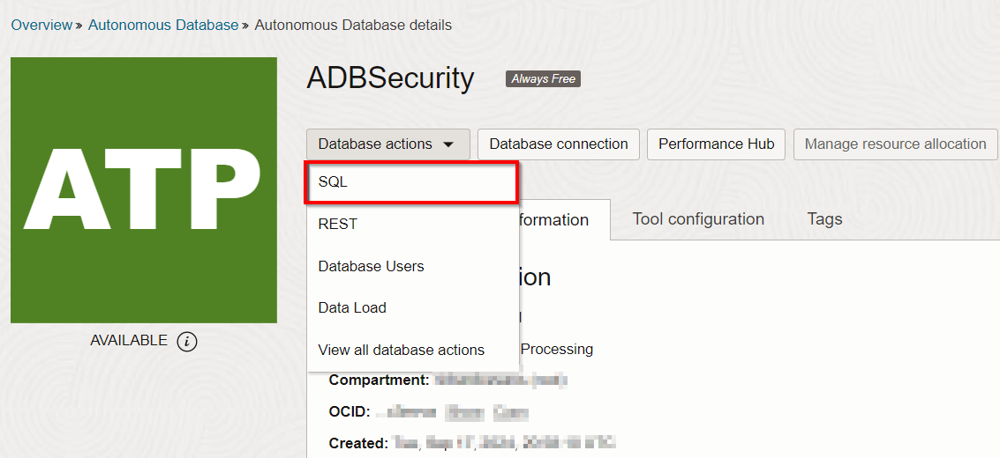

# Oracle Database Vault on an Autonomous Database

## Introduction
This workshop introduces the various features and functionality of Oracle Database Vault (DV). It gives the user an opportunity to learn how to configure those features in an Autonomous Database to prevent unauthorized privileged users from accessing sensitive data.

Managed database services run the risk of 'Admin snooping', allowing privileged users - and especially compromised privileged user accounts - access to sensitive data. Oracle Autonomous Database with Database Vault provides powerful security controls, restricting access to application data by privileged database users, reducing the risk of insider and outsider threats and addressing common compliance requirements.

You can deploy controls to block privileged account access to application data and control sensitive operations inside the database. Trusted paths can be used to add additional security controls to authorized data access and database changes. IP addresses, usernames, client program names and other factors can be used as part of Oracle Database Vault security controls to increase security. **Oracle Database Vault secures existing database environments transparently, eliminating costly and time consuming application changes.**

*Estimated Time:* 35 minutes

*Version tested in this lab:* Oracle Autonomous Database 19c

### Video Preview
Watch a preview of "*LiveLabs - Prevent unauthorized data access in Autonomous Databases with Database Vault (May 2022)*" [](youtube:xKq0a_dwM1Y)

### Objectives
Oracle Database vault comes pre-installed with your Autonomous database.
In this lab you will:
- Enable Database Vault in an Autonomous Database
- Protect sensitive data using a Database Vault realm
- Create an audit policy to capture realm violations
- Test Database Vault Controls with Simulation mode

You will use the `SH1` schema containing multiple tables such as `CUSTOMERS` or `COUNTRIES` tables which contain sensitive information and need to be protected from privileged users such as the schema owner (**user `SH1`**) and DBA (**user `DBA_DEBRA`**). But the data in these tables should be available to the application user (**user `APPUSER`**).

   

**Note:**
- **In this workshop, the Configure/Enable/Disable DV command syntax is only for Autonomous Database Shared.**
- Other Oracle Database deployments, including Autonomous Database Dedicated, Exadata Cloud Service, Database Systems, and on-premises database, use a slightly different syntax.

### Prerequisites
This lab assumes you have:
- A Free Tier, Paid or LiveLabs Oracle Cloud account
- You have completed "Prepare Your Environment" step previously

### Lab Timing (estimated)
| Task No. | Feature | Approx. Time |
|--|------------------------------------------------------------|-------------|
| 1 | Enable Database Vault | <5 minutes |
| 2 | Enable Separation of Duties (SoD) | <5 minutes |
| 3 | Create a Simple Realm | 10 minutes |
| 4 | Audit Policy to Capture Realm Violations | 5 minutes |
| 5 | Simulation Mode | 10 minutes |
| 6 | Disable Database Vault | <5 minutes |

## Task 1: Enable Database Vault

We start by creating two DV user accounts:

- **Database Vault owner (`SEC_ADMIN_OWEN`)**
    - This user is mandatory as an owner of DV objects
    - `SEC_ADMIN_OWEN` has the `DV_OWNER` and `DV_ADMIN` roles and can configure database vault policies
- **Database Vault account manager (`ACCTS_ADMIN_ACE`)**
    - This user is an optional but recommended role
    - `ACCTS_ADMIN_ACE` has the `DV_ACCTMGR` role and can create users and change user passwords
- While DV owner can also become DV account manager, Oracle recommends maintaining separation of duties by using two different accounts

1. Open a SQL Worksheet on your Autonomous DB as the *`ADMIN`* user
    
    - In Oracle Cloud Infrastructure (OCI), select your "`ADB Security`" database created during the "Prepare Your Environment" step

       

    - In your "`ADB Security`" database's details page, click the **Tools** tab

       

    - The Tools page provides you access to database administration and developer tools for Autonomous Database: Database Actions, Oracle Application Express, Oracle ML User Administration, and SODA Drivers. In the Database Actions box, click [**Open Database Actions**]

       

    - A sign-in page opens for Database Actions. For this lab, simply use your database instance's default administrator account (user *`admin`*) and click [**Next**]

       

    - Enter the admin Password you specified when creating the database (here *`WElcome_123#`*)
    
      ````
      <copy>WElcome_123#</copy>
      ````

    - Click [**Sign in**]

       

    - The Database Actions page opens. In the Development box, click [**SQL**]

       

2. Create the Database Vault owner and account manager users

      ````
      <copy>
      -- Create DV owner
      CREATE USER sec_admin_owen IDENTIFIED BY WElcome_123#;
      GRANT CREATE SESSION TO sec_admin_owen;
      GRANT SELECT ANY DICTIONARY TO sec_admin_owen;
      GRANT AUDIT_ADMIN to sec_admin_owen;

      -- Create DV account manager
      CREATE USER accts_admin_ace IDENTIFIED BY WElcome_123#;
      GRANT CREATE SESSION TO accts_admin_ace;
      GRANT AUDIT_ADMIN to accts_admin_ace;

      -- Enable SQL Worksheet for the users just created
      BEGIN
         ORDS_ADMIN.ENABLE_SCHEMA(p_enabled => TRUE, p_schema => UPPER('sec_admin_owen'), p_url_mapping_type => 'BASE_PATH', p_url_mapping_pattern => LOWER('sec_admin_owen'), p_auto_rest_auth => TRUE);
         ORDS_ADMIN.ENABLE_SCHEMA(p_enabled => TRUE, p_schema => UPPER('accts_admin_ace'), p_url_mapping_type => 'BASE_PATH', p_url_mapping_pattern => LOWER('accts_admin_ace'), p_auto_rest_auth => TRUE);
      END;
      /
      </copy>
      ````

    **Note:**
       - Copy/Paste the following SQL queries into SQL Worksheet
       - Press [**F5**] or click the "Run Scripts" icon
       - Check that there are no errors

       

3. Configure the Database Vault user accounts

      ````
      <copy>EXEC DBMS_CLOUD_MACADM.CONFIGURE_DATABASE_VAULT('sec_admin_owen', 'accts_admin_ace');</copy>
      ````

   


4. Verify that Database Vault is configured but not yet enabled

      ````
      <copy>SELECT * FROM DBA_DV_STATUS;</copy>
      ````

   

    **Note:** `DV_CONFIGURE_STATUS` must be **TRUE**

5. Now, enable Database Vault

      ````
      <copy>EXEC DBMS_CLOUD_MACADM.ENABLE_DATABASE_VAULT;</copy>
      ````

       
    
6. You must “restart” the database to complete the Database Vault enabling process

    - Restart the database from the console by selecting "**Restart**" in "More Actions" drop-list as shown

       

    - Once restart completes, go back to the SQL Worksheet as the `ADMIN` user and verify DV is enabled

      ````
      <copy>SELECT * FROM DBA_DV_STATUS;</copy>
      ````

       

    **Note:** `DV_ENABLE_STATUS` should be **TRUE**

7. Now, Database Vault is enabled!

## Task 2: Enable Separation of Duties (SoD)

In Autonomous DB, the `ADMIN` user has all privileges, including the privileges required to administer Database Vault security policies. In real life, you may wish to separate security administration, user administration, and database administration into different accounts. From now we will use a DBA account instead of `ADMIN` user because in production that's what you must do.

In the "Prepare your environment" step you created the user `DBA_DEBRA`. This user has the `DBA` role on the Autonomous DB

1. To demonstrate the effects of the DB Vault SoD on a DBA account, open the SQL Worksheet as the *`DBA_DEBRA`* user (as reminder, the password is `WElcome_123#`)
    
      ````
      <copy>WElcome_123#</copy>
      ````

2. View `DBA_DEBRA`'s roles

      ````
      <copy>SELECT * FROM session_roles ORDER BY 1;</copy>
      ````

       

    **Note:** Notice that DBA_DEBRA has several roles, including `PDB_DBA` (the DBA role in an Autonomous DB)

3. Create a test user `DEMO1`

      ````
      <copy>CREATE USER demo1;</copy>
      ````

       


    **Note:** Notice that `DBA_DEBRA` is not able to create a user, despite having the `DBA` role, **because Database Vault is enabled**!
                
4. Let's try altering the user `APPUSER`

      ````
      <copy>ALTER USER appuser IDENTIFIED BY WElcome_123456#;</copy>
      ````

       
                
       **Note:** `DBA_DEBRA` can no longer change a user's passwords!
                
5. In fact, **once DV is enabled, it immediately begins enforcing separation of duties** - the user `DBA_DEBRA` loses its ability to create/alter/drop DB user accounts and that privilege is then with the DV account manager role. 

6. As you continue with the lab, you will use `SEC_ADMIN_OWEN` and `ACCTS_ADMIN_ACE` for all database vault actions. The duties of database administration (done by `DBA_DEBRA`) are now separate from the duties of user administration (`ACCTS_ADMIN_ACE`) and security administration (`SEC_ADMIN_OWEN`)

## Task 3: Create a Simple Realm

Next we create a realm to secure the `SH1.CUSTOMERS` table from access by `DBA_DEBRA` and `SH1` (table owner) and grant access to `APPUSER` only.

A realm is a protected zone inside the database where database schemas, objects, and roles can be secured. For example, you can secure a set of schemas, objects, and roles that are related to accounting, sales, or human resources. After you have secured these into a realm, you can use the realm to control the use of system and object privileges by specific accounts or roles. This enables you to enforce context-sensitive access controls for anyone who wants to use these schemas, objects, and roles.

1. To demonstrate the effects of this realm, it's important to execute the same SQL query from these 3 users before and after creating the realm:
    - To proceed, **open SQL Worksheet in 3 web-browser pages** connected with a different user (*`DBA_DEBRA`*, *`SH1`* and *`APPUSER`*) as shown in Task 1 previously
   
       **Note:**
          -  Attention, only one SQL Worksheet session can be open in a standard browser window at the same time, hence **open each of your sessions in a new web-browser window (Mozilla, Chrome, Edge, Safari, etc) or by using the "Incognito mode"!**
          - As reminder, the password of these users is the same (here `WElcome_123#`)
    
             ````
             <copy>WElcome_123#</copy>
             ````

    - Copy/Paste and execute the following query

      ````
      <copy>
         SELECT cust_id, cust_first_name, cust_last_name, cust_email, cust_main_phone_number
           FROM sh1.customers
          WHERE rownum < 10;
      </copy>
      ````
 
       - as user "**`DBA_DEBRA`**"

          

       - as user "**`SH1`**"

          

       - as user "**`APPUSER`**"

          

       **Note:**
          - **These 3 users can see the `SH1.CUSTOMERS` table!**
          - `SH1` because `SH1` owns it
          -	`DBA_DEBRA` because it has the DBA role
          - `APPUSER` because it have the "`READ ANY TABLE`" system privilege

2. Now, let's create a realm to secure `SH1` tables by executing this query below as the *`SEC_ADMIN_OWEN`* user. So, please **open a 4th web-browser window**

      ````
      <copy>
      -- Create the "PROTECT_SH1" DV realm
         BEGIN
            DVSYS.DBMS_MACADM.CREATE_REALM(
                realm_name => 'PROTECT_SH1'
                ,description => 'A mandatory realm to protect SH1 tables'
                ,enabled => DBMS_MACUTL.G_YES
                ,audit_options => DBMS_MACUTL.G_REALM_AUDIT_FAIL
                ,realm_type => 1); 
         END;
         /

      -- Show the current DV realm
      SELECT name, description, enabled FROM dba_dv_realm WHERE id# >= 5000 ORDER BY 1;
      </copy>
      ````

       
 
    **Note:**
       - Now the Realm `PROTECT_SH1` is **created as mandatory and enabled**!
       - The difference between a **mandatory vs regular realm** is regular realms block system privileges (and allows direct object grants) while mandatory realms block direct object grants (even by the object owner) in addition to system privileges

3. Add objects to the realm to protect (here, the `CUSTOMERS` table)

      ````
      <copy>
      -- Set SH1 objects as protected by the DV realm "PROTECT_SH1"
         BEGIN
             DVSYS.DBMS_MACADM.ADD_OBJECT_TO_REALM(
                 realm_name   => 'PROTECT_SH1',
                 object_owner => 'SH1',
                 object_name  => 'CUSTOMERS',
                 object_type  => 'TABLE');
         END;
         /

      -- Show the objects protected by the DV realm PROTECT_SH1
      SELECT realm_name, owner, object_name, object_type
        FROM dvsys.dba_dv_realm_object
       WHERE realm_name IN (SELECT name FROM dvsys.dv$realm WHERE id# >= 5000);
      </copy>
      ````

   

       **Note:** Now the table `CUSTOMERS` is protected and no one can access on it!

4. Check the effect of this realm
   
      - Execute again the following query in SQL Worsheet of each the 3 users (*`DBA_DEBRA`*, *`SH1`* and *`APPUSER`*)

      ````
      <copy>
         SELECT cust_id, cust_first_name, cust_last_name, cust_email, cust_main_phone_number
           FROM sh1.customers
          WHERE rownum < 10;
      </copy>
      ````
 
       - as user "**`DBA_DEBRA`**"

          

       - as user "**`SH1`**"

          

       - as user "**`APPUSER`**"

          

       - **Objects in the realm cannot be accessed by any database users**, including the DBA (`DBA_DEBRA`) and the schema owner (`SH1`)!

5. Now, go back to SQL Worksheet as the *`SEC_ADMIN_OWEN`* user and make sure you have an authorized application user (`APPUSER`) in the realm by executing this query

      ````
      <copy>
      -- Grant access to APPUSER only for the DV realm "PROTECT_SH1"
         BEGIN
             DVSYS.DBMS_MACADM.ADD_AUTH_TO_REALM(
                 realm_name   => 'PROTECT_SH1',
                 grantee      => 'APPUSER');
         END;
         /
      </copy>
      ````

   

6. Re-execute the SQL query to show that only `APPUSER` now can read the data

      ````
      <copy>
         SELECT cust_id, cust_first_name, cust_last_name, cust_email, cust_main_phone_number
           FROM sh1.customers
          WHERE rownum < 10;
      </copy>
      ````
 
       - as user "**`DBA_DEBRA`**"

          

       - as user "**`SH1`**"

          

       - as user "**`APPUSER`**"

          

       - **`APPUSER` must be the only user who has access to the table from now!**

## Task 4: Create an Audit Policy to Capture Realm Violations

You may also want to capture an audit trail of unauthorized access attempts to your realm objects. Since the Autonomous Database includes Unified Auditing, we will create a policy to audit database vault activities

1. Open a SQL Worksheet as the *`ACCTS_ADMIN_ACE`* user (as reminder, the password is `WElcome_123#`)
    
      ````
      <copy>WElcome_123#</copy>
      ````

2. Check that no audit trail log exists

      ````
      <copy>
      -- Display the audit trail log
      SELECT os_username, dbusername, event_timestamp, action_name, sql_text 
        FROM unified_audit_trail
       WHERE DV_ACTION_NAME='Realm Violation Audit' order by 3;
      </copy>
      ````

   

    **Note:** The query should return no rows!

3. Create an audit policy on the DV realm `PROTECT_SH1` created earlier in Step 2

      ````
      <copy>
      -- Create the Audit Policy
         CREATE AUDIT POLICY dv_realm_sh1
            ACTIONS SELECT, UPDATE, DELETE
            ACTIONS COMPONENT=DV Realm Violation ON "PROTECT_SH1";

      -- Enable the Audit Policy
         AUDIT POLICY dv_realm_sh1;
      </copy>
      ````

   

4. Like in Step 2, let's see the effects of the audit

    - To proceed, **re-execute the same SQL query in 3 different SQL Worksheet opened in 3 web-browser window** connected with a different user (*`DBA_DEBRA`*, *`SH1`* and *`APPUSER`*)
   
       **Note:**
          -  Attention, only one SQL Worksheet session can be open in a standard browser window at the same time, hence **open each of your sessions in a new web-browser window (Mozilla, Chrome, Edge, Safari, etc) or by using the "Incognito mode"!**
          - As a reminder, the password of these users is the same (here `WElcome_123#`)
    
             ````
             <copy>WElcome_123#</copy>
             ````

    - Copy/Paste and execute the following query

      ````
      <copy>
         SELECT cust_id, cust_first_name, cust_last_name, cust_email, cust_main_phone_number
           FROM sh1.customers
          WHERE rownum < 10;
      </copy>
      ````
 
       - as user "**`DBA_DEBRA`**"

       

       - as user "**`SH1`**"

       

       - as user "**`APPUSER`**"

       

       - `DBA_DEBRA` **and** `SH1` **users cannot access the** `SH1.CUSTOMERS` **table and should generate an audit record of their failed attempt to violate policy!**

5. Go back to the SQL Worksheet as the *`ACCTS_ADMIN_ACE`* user to review realm violation audit trail 

      ````
      <copy>
      -- Display the audit trail log
      SELECT os_username, dbusername, event_timestamp, action_name, sql_text 
        FROM unified_audit_trail
       WHERE DV_ACTION_NAME='Realm Violation Audit' order by 3;
      </copy>
      ````

   

    **Note:** You should see the `DBA_DEBRA` and `SH1` failed attempts

6. When you have completed this lab, sign in as the *`SEC_ADMIN_OWEN`* user to reset the audit settings

      ````
      <copy>
      -- Show the current DV realm
      SELECT name, description, enabled FROM dba_dv_realm WHERE id# >= 5000 order by 1;

      -- Purge the DB Vault audit trail logs
      DELETE FROM DVSYS.AUDIT_TRAIL$;

      -- Purge the audit trail logs
      BEGIN
          DBMS_AUDIT_MGMT.CLEAN_AUDIT_TRAIL(
             audit_trail_type         =>  DBMS_AUDIT_MGMT.AUDIT_TRAIL_UNIFIED,
             use_last_arch_timestamp  =>  FALSE);
      END;
      /

      -- Display the audit trail log
      SELECT os_username, dbusername, event_timestamp, action_name, sql_text 
        FROM unified_audit_trail
       WHERE DV_ACTION_NAME='Realm Violation Audit' order by 3;
       
      -- Disable the audit policy
      NOAUDIT POLICY dv_realm_sh1;

      -- Drop the audit policy
      DROP AUDIT POLICY dv_realm_sh1;
      
      </copy>
      ````

      

7. Now, you have no longer audit policy and DV realm!

## Task 5: Simulation Mode

We will use simulation mode to find the factors to use for our "trusted path" connection to the `SH1.COUNTRIES` table. We will do that by completely disabling access to the table – but then put the realm policy into simulation mode. Since simulation mode won’t block the actual SQL commands – the SQL commands will work. However, if the SQL command should have been blocked by the new command rule – then it will create an entry in the simulation mode. Then you can review the simulation log to find if it captured the correct violations and the factors and associated rules.

1. Open a SQL Worksheet as the *`SEC_ADMIN_OWEN`* user (as reminder, the password is `WElcome_123#`)
    
      ````
      <copy>WElcome_123#</copy>
      ````

2. First, query the simulation log to show that it has no current values

      ````
      <copy>
         SELECT violation_type, username, machine, object_owner, object_name, command, dv$_module
         FROM dba_dv_simulation_log;
      </copy>
      ````

   

3. Next, create a **Command Rule** that will simulate blocking all `SELECT` from the `SH1.COUNTRIES` table

      ````
      <copy>
      BEGIN
          DBMS_MACADM.CREATE_COMMAND_RULE(
             command 	 => 'SELECT',
             rule_set_name   => 'Disabled',
             object_name       => 'COUNTRIES',
             object_owner       => 'SH1',
             enabled         => DBMS_MACUTL.G_SIMULATION);
      END;
      /
      </copy>
      ````

   

4. Like in Step 2, let's see now the effects of the simulation

    - To proceed, **re-execute the same SQL query in 3 different SQL Worksheet opened in 3 web-browser pages** connected with a different user (*`DBA_DEBRA`*, *`SH1`* and *`APPUSER`*)
   
       **Note:**
          -  Attention, only one SQL Worksheet session can be open in a standard browser window at the same time, hence **open each of your sessions in a new web-browser window (Mozilla, Chrome, Edge, Safari, etc) or by using the "Incognito mode"!**
          - As reminder, the password of these users is the same (here `WElcome_123#`)
    
             ````
             <copy>WElcome_123#</copy>
             ````

    - Copy/Paste and execute several time the following SELECT query to SH1.COUNTRIES table

      ````
      <copy>
         SELECT * FROM sh1.countries WHERE rownum < 20;
      </copy>
      ````
 
       - as user "**`DBA_DEBRA`**"

       

       - as user "**`SH1`**"

       

       - as user "**`APPUSER`**"

       

       - **All the users can access the** `SH1.CUSTOMERS` **table!**
      
5. Now, go back to the SQL Worksheet as the *`SEC_ADMIN_OWEN`* user to see what new entries we have. Remember we created a command rule to simulate blocking user select!

      ````
      <copy>
         SELECT violation_type, username, machine, object_owner, object_name, command, dv$_module
         FROM dba_dv_simulation_log;
      </copy>
      ````

   

    **Note:**
      - Although each user can see the results, the log shows all users who selected and would have been blocked by the rule
      - It also shows where they connected from and what client they used to connect

6. Before moving to the next lab, we will clean out the simulation logs and remove the Command Rule

      ````
      <copy>
      -- Purge simulation logs
      DELETE FROM DVSYS.SIMULATION_LOG$;

      -- Current simulation logs after purging
      SELECT count(*) FROM dba_dv_simulation_log;
      </copy>
      ````

      

      ````
      <copy>
      -- Delete the Command Rule
      BEGIN
          DBMS_MACADM.DELETE_COMMAND_RULE(
             command        => 'SELECT', 
             object_owner   => 'SH1', 
             object_name    => 'COUNTRIES',
             scope          => DBMS_MACUTL.G_SCOPE_LOCAL);
      END;
      /
      </copy>
      ````

   

## Task 6: Disable Database Vault

1. Log as the *`SEC_ADMIN_OWEN`* user and drop the existing DV realm

      ````
      <copy>
      -- Drop the "PROTECT_SH1" DV realm
      BEGIN
          DVSYS.DBMS_MACADM.DELETE_REALM_CASCADE(realm_name => 'PROTECT_SH1');
      END;
      /

      -- Show the current DV realm
      SELECT name, description, enabled FROM dba_dv_realm WHERE id# >= 5000 order by 1;

      </copy>
      ````

   

2. Now, disable DB Vault on the Autonomous Database

      ````
      <copy>EXEC DBMS_CLOUD_MACADM.DISABLE_DATABASE_VAULT;</copy>
      ````

   
    
3. You must restart the database to complete the Database Vault enabling process

    - Restart the database from the console by selecting "**Restart**" in "More Actions" drop-list as shown

       

    - Once restart completes, log in to SQL Worksheet as the *`DBA_DEBRA`* user and verify DV is enabled

      ````
      <copy>SELECT * FROM DBA_DV_STATUS;</copy>
      ````

       

    **Note:** `DV_ENABLE_STATUS` must be **FALSE**

4. Now, drop the Database Vault owner and account manager users

      ````
      <copy>
      DROP USER sec_admin_owen;
      DROP USER accts_admin_ace;
      </copy>
      ````

       

    **Note:** Because DB Vaut is disabled, SoD is also automatically disabled and you can now drop users with `DBA_DEBRA` user

5. Now, Database Vault is correctly disabled!

You may now proceed to the next lab!

## **Appendix**: About the Product
### **Overview**
Oracle Database Vault provides controls to prevent unauthorized privileged users from accessing sensitive data. It also prevents unauthorized database changes.

The Oracle Database Vault security controls protect application data from unauthorized access, and help you comply with privacy and regulatory requirements.

   

You can deploy controls to block privileged account access to application data and control sensitive operations inside the database with Database Vault.

Through the analysis of privileges and roles, you can increase the security of existing applications by using least-privilege best practices.

Oracle Database Vault secures existing database environments transparently, eliminating costly and time-consuming application changes.

Oracle Database Vault enables you to create a set of components to manage security for your database instance.

These components are:

- **Realms**

A realm is a protection zone inside the database where database schemas, objects, and roles can be secured. For example, you can secure a set of schemas, objects, and roles that are related to accounting, sales, or human resources.
After you have secured these into a realm, you can use the realm to control the use of system and object privileges to specific accounts or roles. This enables you to provide context-aware access controls for anyone who wants to use these schemas, objects, and roles.

- **Command rules**

A command rule is a special security policy that you can create to control under which conditions users can execute almost any SQL statement, including SELECT, ALTER SYSTEM, database definition language (DDL), and data manipulation language (DML) statements.
Command rules work with rule sets to determine whether the statement is allowed.

- **Factors**

A factor is a named variable or attribute, such as a user location, database IP address, or session user, which Oracle Database Vault can recognize and use to make access control decisions.
You use factors in rules to control activities such as authorizing database accounts to connect to the database or the execution of a specific database command to restrict the visibility and manageability of data.
Each factor can have one or more identities. An identity is the actual value of a factor.
A factor can have several identities depending on the factor retrieval method or its identity mapping logic.

- **Rule**

The rule within a rule set is a PL/SQL expression that evaluates to true or false. You can have the same rule in multiple rule sets.

- **Rule sets**

A rule set is a collection of one or more rules that you can associate with a realm authorization, command rule, factor assignment, or secure application role. The rule set evaluates to true or false based on the evaluation of each rule it contains and the evaluation type (All True or Any True).


- **Secure application roles**

A Database Vault secure application role is a special Oracle Database role that can be enabled based on the evaluation of an Oracle Database Vault rule set.

Oracle Database Vault provides a set of PL/SQL interfaces and packages that let you configure these components.
In general, the first step you take is to create a realm composed of the database schemas or database objects that you want to secure.
You can further secure your database by creating rules, rule sets, command rules, factors, identities, and secure application roles.
In addition, you can run reports on the activities these components monitor and protect.

### **Benefits of using Database Vault**
- Addresses compliance regulations to minimize access to data
- Protects data against misused or compromised privileged user accounts
- Design and enforce flexible security policies for your database
- Addresses Database consolidation and cloud environments concerns to reduce cost and reduce exposure sensitive application data by those without a true need-to-know
- Protect access to your sensitive data by creating a trusted path (see more by performing the [Full Database Vault lab](https://apexapps.oracle.com/pls/apex/dbpm/r/livelabs/view-workshop?wid=682&clear=180&session=4531599220675))

## Want to Learn More?
Technical Documentation:
  - [Oracle Database Vault 19c](https://docs.oracle.com/en/database/oracle/oracle-database/19/dvadm/introduction-to-oracle-database-vault.html#GUID-0C8AF1B2-6CE9-4408-BFB3-7B2C7F9E7284)

Video:
  - *Understanding Oracle Database Vault (March 2019)* [](youtube:oVidZw7yWIQ)
  - *Oracle Database Vault - Use Cases (Part1) (October 2019)* [](youtube:aW9YQT5IRmA)
  - *Oracle Database Vault - Use Cases (Part2) (November 2019)* [](youtube:hh-cX-ubCkY)
  - *Oracle Database Vault Introduction (May 2021)* [](youtube:vSVr7avZ4Hg)
  - *Oracle Database Vault on ADB - Quick walk through of the Livelabs* [](youtube:O_Hi2-vZ-zU)

## Acknowledgements
- **Author** - Hakim Loumi, Database Security PM
- **Contributors** - Alan Williams, Rene Fontcha
- **Last Updated By/Date** - Hakim Loumi, Database Security PM - May 2022
