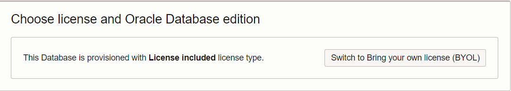

# Prepare your environment

## Introduction

This lab walks you through the steps to get started using the Oracle Autonomous Database and initialize it to use Oracle Database Vault.

Estimated time: 10 minutes

Watch the video below for a quick walk-through of the lab.
[Prepare your environment](videohub:1_3krv0mxe)
<!-- [](youtube:RmiewRNMceQ)-->

### Objectives

-   Learn how to provision a new Autonomous Database
-   Create owner and load dataset to perform the lab

## Task 1: Provision an Oracle Autonomous Database

  **Note:** If you plan to use an existing Oracle Autonomous Database in your own tenancy, or you are using an Oracle-provided environment, you can skip this step. You should not use a production database for this lab. You should use a database you are comfortable making changes to and, potentially, terminating at the end of the lab. 

1. Log in to the Oracle Cloud Infrastructure

2. Once you are logged in, you are taken to the cloud services dashboard where you can see all the services available to you. Click the navigation menu in the upper left to show top level navigation choices.

      **Note:** You can also directly access your Autonomous Database service in the **Quick Actions** section of the dashboard

    

3. The following steps apply similarly to eall Oracle Autonomous Database types. You can choose any of the types, for example select **Autonomous Transaction Processing**. 

    

4. From the **Compartment** drop-down list, select your compartment

  **Note:**
     - This console shows that no databases yet exist
     - If there were a long list of databases, you could filter the list by the **State** of the databases (Available, Stopped, Terminated, and so on)
     - You can also sort by **Workload Type** (here, we selected **All**)

         


5. Click [**Create Autonomous Database**]

    

6. On the **Create Autonomous Database** page, provide basic information for your database:
    - **Compartment:** If needed, select your compartment
    - **Display name:** Enter a memorable name for the database for display purposes, for this lab, use `ADBDV`

        ````
        <copy>ADBDV</copy>
        ````
    - **Database Name:** Enter `ADBDV`, it's important to use letters and numbers only, starting with a letter (the maximum length is 14 characters and Underscores are not supported)

        ````
        <copy>ADBDV</copy>
        ````

    - **Workload Type:** Select the type of your Autonomous Database to match your choice at Step 3 earlier above (here we select `Transaction Processing`)
    - **Deployment Type:** `Shared Infrastructure`

         

7. Configure the database:

    - **Always Free:** `Slide to enabled`
    - **Database version:** `19c`
    - **OCPU Count:** `1`
    - **Storage:**  `1`
    - **Auto scaling:** `Checked`

      **Note:** You cannot scale up/down an Always Free Autonomous Database

8. Create administrator credentials:

    - **Password** and **Confirm Password** - Specify a password for the ADMIN database user and jot it down. The password must be between 12 and 30 characters long and must include at least one uppercase letter, one lowercase letter, and one numeric character. It cannot contain your username or the double quote (`"`) character. You can create your own password, or use the example password provided here:

        ````
        <copy>WElcome_123#</copy>
        ````

        

9. Choose the network access and the license type:

    - **Network Access:** `Allow secure access from everywhere`
    - **License Type:** `License Included`

         
         

10. Click [**Create Autonomous Database**]

11.  Your instance will begin provisioning. In a few minutes, the state will turn from Provisioning to Available. At this point, your Autonomous Database is ready to use! Have a look at your instance's details here including its name, database version, OCPU count, and storage size.

    


## Task 2: Set up Application Schema and Users

Although you can connect to your Autonomous Database using local PC desktop tools like Oracle SQL Developer, Microsoft Visual Studio Code, and many more, you can conveniently access the browser-based SQL Worksheet directly from your Oracle Autonomous Database. 

1. In your `ADBDV` database's details page, click the `Database Actions` then click `SQL` to navigate to the SQL Worksheet page. 

    

2. **You should be signed in automatically.** If you are not, and you receive a screen like the following, enter your `ADMIN` username and password. 

    
    
      ````
      <copy>ADMIN</copy>
      ````

      ````
      <copy>WElcome_123#</copy>
      ````


3. Once you have logged into **Oracle Database Actions | SQL**, you should see a worksheet similar to the following.

    

4. Next, copy and paste the following SQL queries into SQL Worksheet.  

    - To create the working schema and working users

        ````
        <copy>
        -- Create SH1 schema, grant privileges, and authorize it to use DB Actions
        CREATE USER sh1 IDENTIFIED BY WElcome_123#;
        GRANT CREATE SESSION, CREATE TABLE TO sh1;
        GRANT UNLIMITED TABLESPACE TO sh1;
        BEGIN
            ORDS_ADMIN.ENABLE_SCHEMA(
                p_enabled => TRUE
              , p_schema => UPPER('sh1')
              , p_url_mapping_type => 'BASE_PATH'
              , p_url_mapping_pattern => LOWER('sh1')
              , p_auto_rest_auth => TRUE);
        END;
        /

        -- create a copy of the SH tables
        CREATE TABLE sh1.customers AS SELECT * FROM sh.customers;
        CREATE TABLE sh1.countries AS SELECT * FROM sh.countries;

      -- Create DBA_DEBRA user, grant privileges, and authorize it to use DB Actions
        CREATE USER dba_debra IDENTIFIED BY WElcome_123#;
        GRANT PDB_DBA TO dba_debra;
        BEGIN
            ORDS_ADMIN.ENABLE_SCHEMA(
                p_enabled => TRUE
              , p_schema => UPPER('dba_debra')
              , p_url_mapping_type => 'BASE_PATH'
              , p_url_mapping_pattern => LOWER('dba_debra')
              , p_auto_rest_auth => TRUE);
        END;
        /

        -- Create APPUSER user, grant privileges, and authorize it to use DB Actions
        CREATE USER appuser IDENTIFIED BY WElcome_123#;
        GRANT CREATE SESSION, READ ANY TABLE TO appuser;
        BEGIN
            ORDS_ADMIN.ENABLE_SCHEMA(
                p_enabled => TRUE
              , p_schema => UPPER('appuser')
              , p_url_mapping_type => 'BASE_PATH'
              , p_url_mapping_pattern => LOWER('appuser')
              , p_auto_rest_auth => TRUE);
        END;
        /

        </copy>
        ````

    - Press [**F5**] or click the "Run Scripts" icon.

         

    - In the **Script Output** frame, verify there are no errors. 

4. **Your environment is ready to use!** You may now proceed to the next lab. 

## Want to Learn More?

Click [Oracle Autonomous Database](https://docs.oracle.com/en/cloud/paas/autonomous-database/) for documentation on the Oracle Autonomous Database. 

## Acknowledgements
- **Author** - Richard C. Evans, Database Security PM
- **Contributors** - Hakim Loumi, Database Security PM
- **Last Updated By/Date** - Richard C. Evans, Database Security PM - May 2024
