# Configure the Autonomous Database environment

## Introduction

In this lab, we will explore the Oracle Cloud Platform (OCI) and configure the Autonomous Transaction Processing database instance (ATP). After that, using the `employee_data_load.sql` script, we will create the `EMPLOYEESEARCH_PROD` user, then populate that database schema with HR employee data using **Oracle Database Actions**.

For more information on the Autonomous Transaction Processing database click [here](https://www.oracle.com/autonomous-database/autonomous-transaction-processing/).

For more information on the OCI Database Actions click [here](https://www.oracle.com/database/sqldeveloper/technologies/db-actions/).

Estimated Time: 10 minutes

### Objectives

In this lab, you will complete the following tasks:

- Create an ATP database instance.
- Use the `employee_data_load.sql` script to create the `EMPLOYEESEARCH_PROD` user and upload data.

### Prerequisites

This lab assumes you have:
- Oracle Cloud Infrastructure (OCI) tenancy account
- Completed all of the previous labs in the **Protect sensitive data in REST GET calls using Oracle Data Redaction** LiveLab workshop

## Task 1: Create an ATP database instance.

1. With the OCI console open, navigate to the ATP portal by selecting the hamburger menu in the top left corner, which will allow for you to select **Oracle Database** and then, **Autonomous Transaction Processing.**

    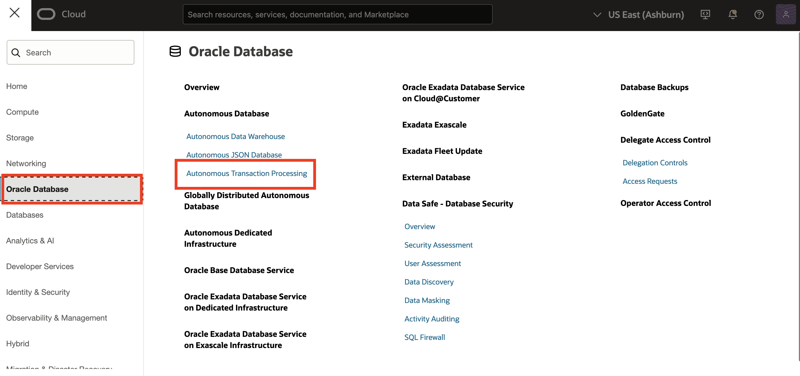 

2. Select **Create Autonomous Database.** Make sure you are in the correct compartment.

    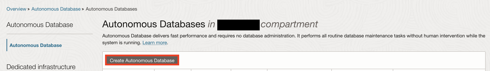 

3. Use a compartment of your choice and enter a display name and database name of **ADBSecurity**.  

    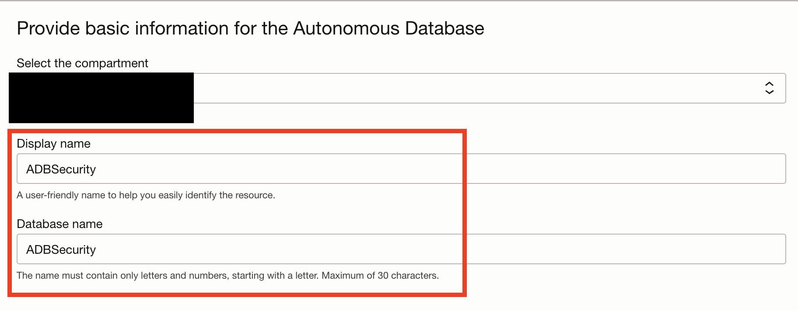 

4. For the database version, make sure **23ai** is selected.

    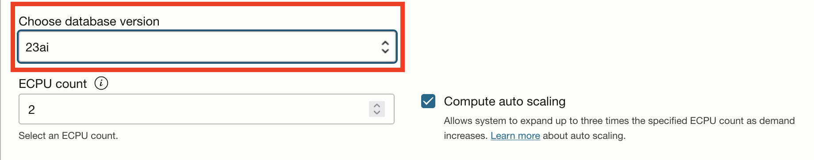

5. Create a password for the **ADMIN** credentials.

    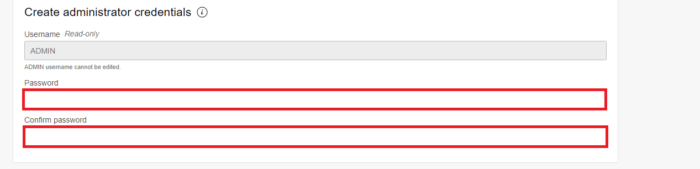 

6. For network access, choose **Secure access from everywhere**.

    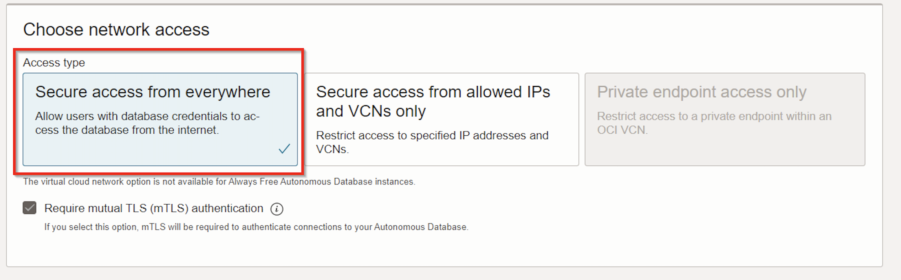

7. Select the licensing option of your choosing, then select **Create Autonomous Database** at the bottom.
    
    *Note*: Spinning up the ADB can take a couple of minutes.

    

    

## Task 2: Use the `employee_data_load.sql` script to create the `EMPLOYEESEARCH_PROD` user and upload data.

1. Once the Autonomous Database is green and available, navigate to top menu bar of the Autonomous Database dashboard and select **Database Actions**, then **SQL**.

    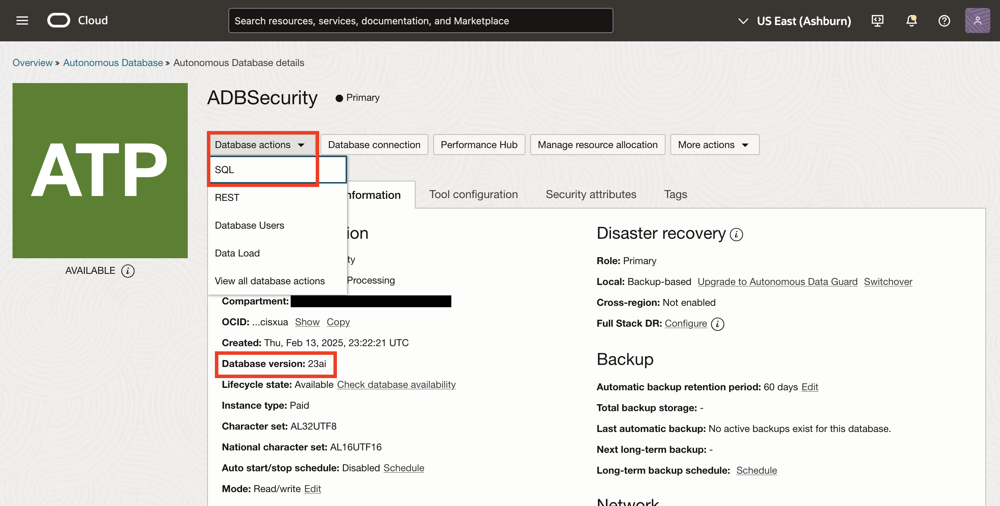

2. Use the following URL to download and save the `employee_data_load.sql` script:

    ```
    <copy>https://c4u04.objectstorage.us-ashburn-1.oci.customer-oci.com/p/EcTjWk2IuZPZeNnD_fYMcgUhdNDIDA6rt9gaFj_WZMiL7VvxPBNMY60837hu5hga/n/c4u04/b/livelabsfiles/o/data-management-library-files/employee_data_load.sql</copy>   
    ```

3. Drag and drop the `employee_data_load.sql` that was downloaded into the center of the SQL worksheet.

    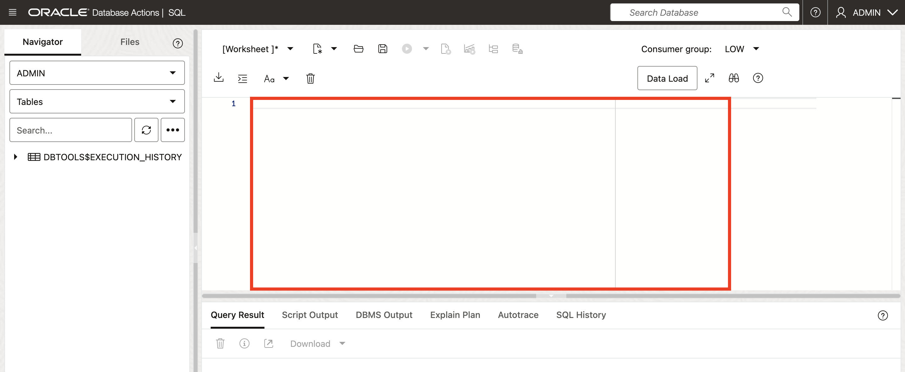

4. Once the script is loaded into the **SQL worksheet**, select the script icon to run the SQL script. Check the script output at the bottom to make sure no errors were received.

    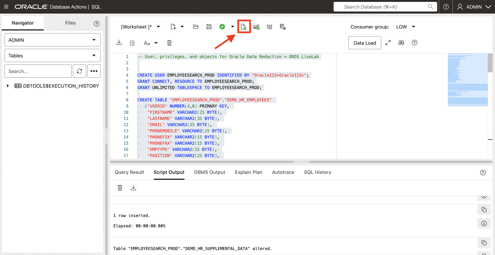

5. Clear the SQL worksheet and run the following command to grant the necessary privileges to `EMPLOYEESEARCH_PROD`. Select the green play button at the top menu bar to run the command.

    ```
    <copy>GRANT ADMINISTER REDACTION POLICY TO employeesearch_prod;</copy>
    ```

6. Return back to the **Database Actions** main dashboard by selecting the **Oracle** logo at the top left of the screen

    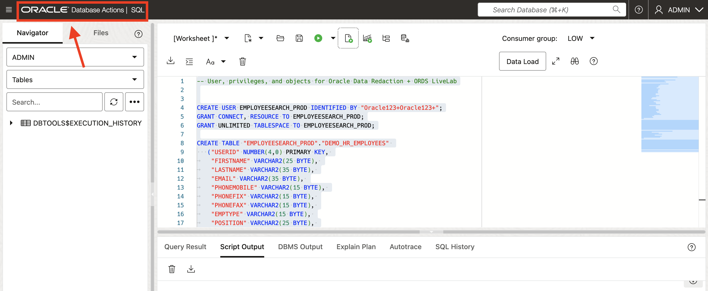

7. Under the **Administration** tab, select **DATABASE USERS**.

    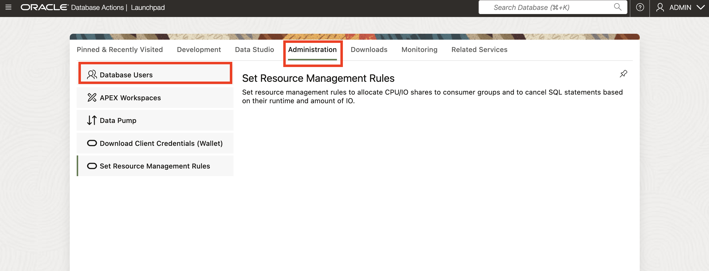

8. Scroll down. Under the user `EMPLOYEESEARCH_PROD`, select the elipsis then click **Enable REST**. 

    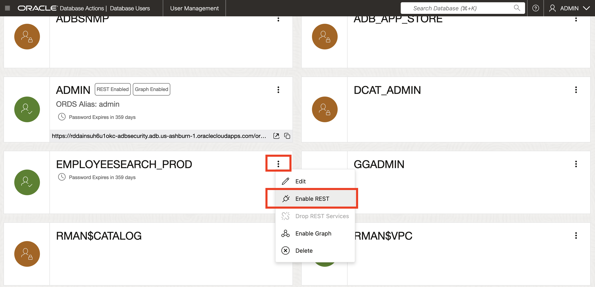

9. A pop-up menu will come up. Keeping everything as is, Select **REST Enable User**.

    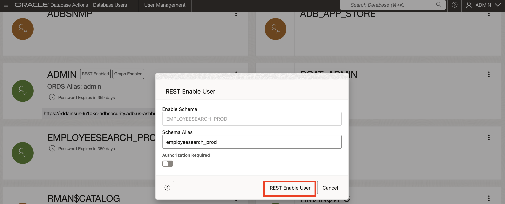

10. Open the **Database Actions** portal for `EMPLOYEESEARCH_PROD` by copying the URL and pasting in a new incognito window.

    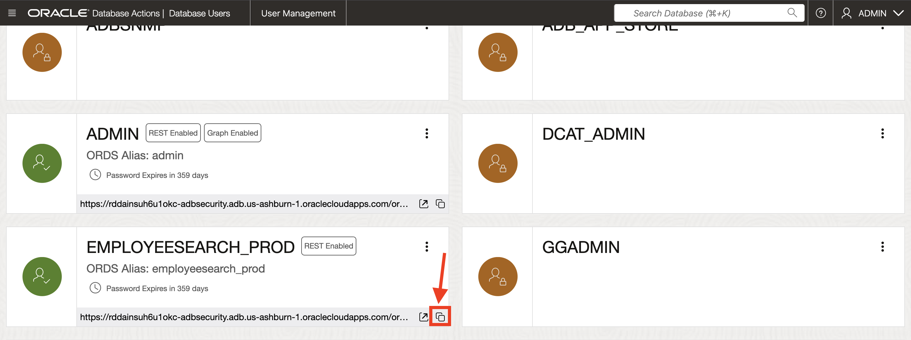

11. Login into **Database Actions** as `EMPLOYEESEARCH_PROD` using the following credentials:

    ```
    <copy>EMPLOYEESEARCH_PROD</copy>   
    ```

    ```
    <copy>Oracle123+Oracle123+</copy>
    ```

    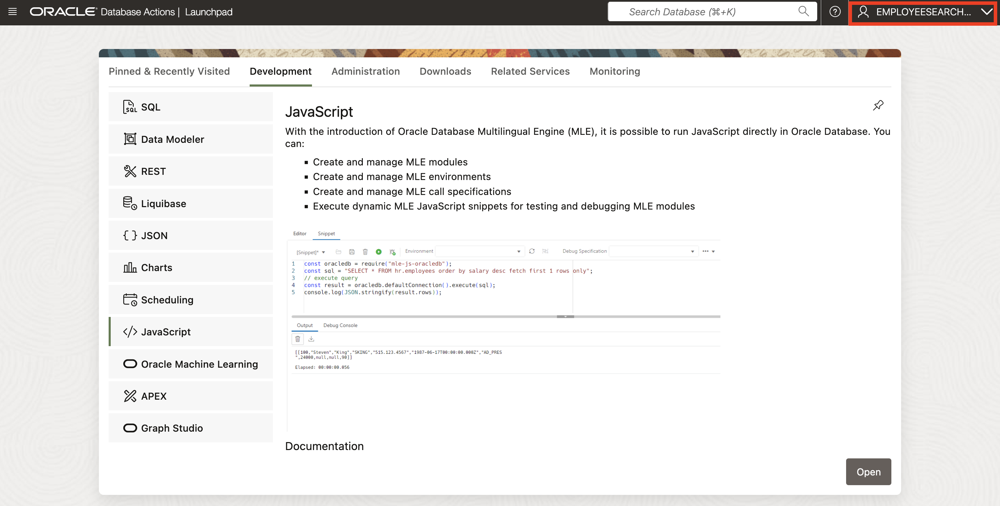

You may now **proceed to the next lab.**

## Acknowledgements

- **Authors** - Alpha Diallo & Ethan Shmargad
- **Creator** - Pedro Lopes, Database Security Product Manager
- **Last Updated By/Date** - Ethan Shmargad, February 2025
