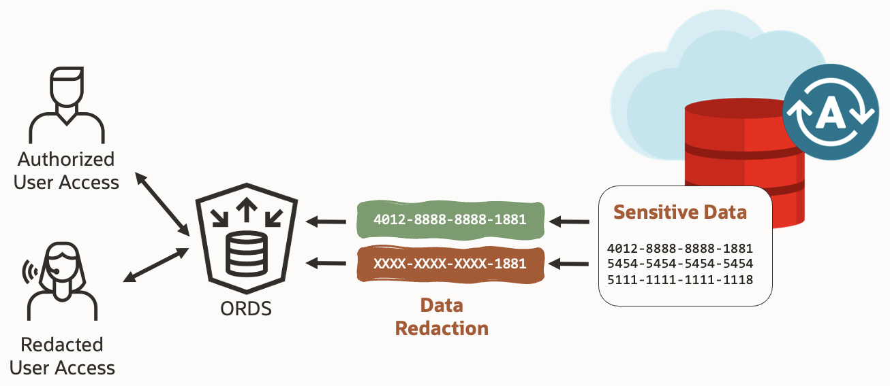

# Protect sensitive data in REST GET calls using Oracle Data Redaction

## Introduction

Oracle Data Redaction is an Advanced Security feature that allows you to mask sensitive data in real-time, protecting it from unauthorized disclosure. This feature is included with your Autonomous Database subscription and is particularly useful for read-only scenarios such as displaying sensitive information in reports or sending it to other applications via GET APIs.

The `DMBS_REDACT PL/SQL` package is used to manage redaction policies and configure the specific columns and redaction formats.

In this workshop, you will learn how to use Oracle Data Redaction with Oracle Rest Data Services (ORDS) to redact  data in a GET response, ensuring the privacy of sensitive data. The process includes REST enabling the table you want to make available through ORDS, creating redaction policies for specific columns and tables, and specifying the redaction function to be used. You'll be able to contrast the response that contains data in clear vs the one that has sensitive data redacted.

Estimated Workshop Time: 42 minutes

### Objectives

In this lab, you will complete the following tasks:

- Configure the Autonomous Database environment.
- Use Redaction to anonymize REST GET calls.
- Reset your environment.

### Prerequisites

This workshop assumes that you have:
- An Oracle Cloud Infrastructure tenancy account
- Familiarity with Database is desired
- Some understanding of cloud and database terms is helpful
- Familiarity with Oracle Cloud Infrastructure (OCI) is helpful
- Basic understanding of RESTFUL services is helpful

*Note: Throughout this workshop, if you ever find yourself struggling when it comes to finding your resources in Oracle Cloud, make sure both your compartment and region correspond to where you created the resource.*

## Want to learn more about Oracle Data Redaction?
- [Data Redaction Release 23 Guide](https://docs.oracle.com/en/database/oracle/oracle-database/23/dbred/index.html)
- [Oracle Data Redaction FAQs](https://docs.oracle.com/en/database/oracle/oracle-database/23/dbred/frequently-asked-questions.html)

## Acknowledgements

- **Authors** - Alpha Diallo & Ethan Shmargad
- **Creator** - Pedro Lopes, Database Security Product Manager
- **Last Updated By/Date** - Ethan Shmargad, February 2025