# Oracle Data Safe for on-premises database

## Introduction
This workshop introduces the various features and functionality of Oracle Data Safe. It gives the user an opportunity to learn how to register an on-premise Oracle Database with Oracle Data Safe, provision audit and alert policies on your database, analyze alerts and audit reports, assess the security of your database configurations and users, and discover and mask sensitive data.

*Estimated Lab Time:* 120 minutes 

*Version tested in this lab:* Oracle Data Safe on OCI and Oracle DB 19.13

### Video Preview

Watch a preview of "*Introduction to Oracle Data Safe (September 2019)*" [](youtube:wU-M5BlU0po)

### Objectives
- Register an on-premise Oracle Database with Oracle Data Safe
- Provision audit and alert policies on your database using Oracle Data Safe
- Collect audit data and generate alerts using Oracle Data Safe
- Assess the security of your database configurations and users using Oracle Data Safe
- Discover and mask sensitive data using Oracle Data Safe

### Prerequisites
This lab assumes you have:
- A Free Tier, Paid or LiveLabs Oracle Cloud account
- You have completed:
    - Lab: Prepare Setup (*Free-tier* and *Paid Tenants* only)
    - Lab: Environment Setup
    - Lab: Initialize Environment

### Lab Timing (estimated)

| Step No. | Feature | Approx. Time |
|--|------------------------------------------------------------|-------------|
|01| Register an on-premise Oracle Database | 20 minutes|
|02| Provision audit and alert policies | 20 minutes|
|03| Collect audit data and generate alerts | 20 minutes|
|04| Assess the security of your database configurations and users | 20 minutes|
|05| Discover and mask sensitive data | 30 minutes|
|06| (Optional) Reset Oracle Data Safe configuration | <10 minutes|

## Task 1: Register an on-premise Oracle Database

To use a database with Oracle Data Safe, you first need to register it with Oracle Data Safe

1. Open a web browser window to your OCI console and login with your OCI account

2. On the Burger menu, click on **Oracle Database**

    
 
3. Then, click on "**Data Safe**"

    

4. On **Connectivity Options** sub-menu, click  on **On-Premises Connectors**

    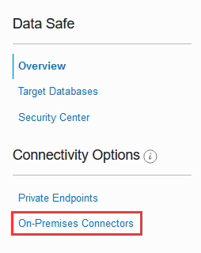

5. Click [**Create On-Premises Connectors**]

    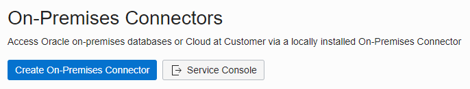

6. Select your Compartment and fill out as following

    - Name: `<Your On-Premises Connectors Name>` (here "*`DBSec-Livelab_DBs`*")
    - Decription: *`On-Premises connector for DBSec Livelabs databases`*

       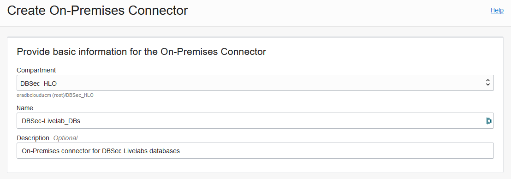

7. Click [**Create On-Premises Connectors**]

8. Once is created, the On-Premises connector is "**INACTIVE**"

       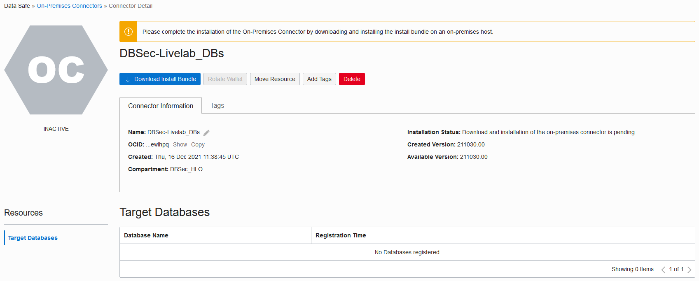

9. Now, let's active it

    - Click [**Download install Bundle**] to download the zip file onto your local machine and enter a password (here *`Oracle12345!`*)

        ````
        <copy>Oracle12345!</copy>
        ````

       

    - OCI Data Safe will generate a unique On-Premises connector and it can take up to one minute

       

    - Once is generated, select **Save File** and click [**OK**] to download it into your local machine

       

    - Browse the location where you want to store the zip file and click [**Save**]

        **Note**: The file name proposed a default value (here "*`DBSec-Livelab_DBs.zip`*"), please keep going with it

    - Now, upload the zip file downloaded into your DBSecLab VM to *`home/opc`* with a transfer file sottware like scp, filezilla or others

    - Setup the Data Safe On-Premises connector

        - Open a Terminal session on your **DBSec-Lab** VM as OS user *oracle*

            ````
            <copy>sudo su - oracle</copy>
            ````

            **Note**: If you are using a remote desktop session, double-click on the *Terminal* icon on the desktop to launch a session

        - Copy Data Safe on-premises connector uploaded to your Data Safe directory (here *`$DS_HOME`*)

            ````
            <copy>
            sudo mv /home/opc/DBSec-Livelab_DBs.zip $DS_HOME
            sudo chown -R oracle:oinstall $DS_HOME
            sudo chmod -R 775 $DS_HOME
            </copy>
            ````

               

        - Install Data Safe On-Premises connector (enter the password defined for the zip file above - here *`Oracle12345!`*)

            ````
            <copy>
            cd $DS_HOME
            unzip DBSec-Livelab_DBs.zip
            python setup.py install --connector-port=1560
            </copy>
            ````

            ````
            <copy>Oracle12345!</copy>
            ````

               

            **Note**: In case of trouble, you can stop or start the Data Safe On-Premises connector with the following command lines:

            ````
            <copy>
            python $DS_HOME/setup.py stop
            python $DS_HOME/setup.py start
            </copy>
            ````

    - Go back to the Data Safe console to verify the status of the Data Safe On-Premises connector

        

        **Note**: It sould be "**ACTIVE**" now!

10. Go back to your terminal session to create the Data Safe **DS_ADMIN** user on `pdb1`

    ````
    <copy>
    cd $DBSEC_LABS/data-safe
    ./ds_create_user.sh pdb1
    </copy>
    ````

    

11. On Data Safe Console, register the Target database **pdb1**

    - Click on the **On-Premises Connectors** link
    
    
    
    - Click on **Target Databases** sub-menu

    

    - Click [**Register Database**]

    

    - Fill out the "Register Target Database" as following

        - Database Type: Select *`Oracle On-Premises Database`*
        - Data Safe Target Display Name: *`DBSec_Livelabs_pdb1`*
        - Description: *`On-Premises pluggable database of DBSeclab VM (pdb1)`*
        - Compartment: Select your own Compartment

            

        - Choose a connectivity option: *`On-Premises Connector`*
        - Select On-Premises Connector: Select *`DBSec-Livelab_DBs`*
        - TCP/TLS: *`TCP`*
        - Database Service Name: *`pdb1`*
        - Database IP Address: *`10.0.0.150`*
        - Database Port Number: *`1521`*
        - Database User Name: *`DS_ADMIN`* (in uppercase)
        - Database Password: *`Oracle123`*
    
            

    - Click [**Register**] to launch the registration process

        

    - Once is created, the new target should be "**ACTIVE**"

        

        **Note:**
        - On the **Target Database Details** tab, you can view the target database name and description, OCID, when the target database was registered and the compartment to where the target database was registered.
        - You can also view connection information, such as database type, database service name, and connection protocol (TCP or TLS). The connection information varies depending on the target database type.
        - The **Target Database Details** page provides options to edit the target database name and description, edit connection details, update the Oracle Data Safe service account and password on the target database (applicable to non-Autonomous Databases), and download a SQL privilege script that enables features on your target database.
        - From the **More Actions** menu, you can choose to move the target database to a different compartment, add tags, deactivate your target database, and deregister your target database.

12. Click on the **Target Databases** link to view the list of registered target databases to which you have access

    

    **Note:** All your registered target databases are listed on the right

    

13. Let's have a look on a quick overview of the **Security Center**

    - Click on **Security Center** sub-menu

        

        **Note**:
        - Make sure your compartment is still selected under **List Scope**
        - In Security Center, you can access all the Oracle Data Safe features, including the dashboard, Security Assessment, User Assessment, Data Discovery, Data Masking, Activity Auditing, Alerts, and Settings

    - By default, the dashboard is displayed and the **Security Assessment** and **User Assessment** charts are automatically populated
    
        

        **Note**:
        - When you register a target database, Oracle Data Safe automatically creates a security assessment and user assessment for you
        - Therefore, the Security Assessment, User Assessment, Feature Usage, and Operations Summary charts in the dashboard already have data
        - During registration, Oracle Data Safe also discovers audit trails on your target database
        - That is why the Audit Trails chart in the dashboard shows one audit trail with the status In Transition for your Autonomous Database
        - Later you start this audit trail to collect audit data into Oracle Data Safe

            


## Task 2: Audit Database Activity

1. Review the global settings for Oracle Data Safe

    - In Security Center, click **Settings**

        

    - Review the global settings

        

        **Note**:
        - Each regional Oracle Data Safe service has global settings for paid usage, online retention period, and archive retention period.
        - Global settings are applied to all target databases unless their audit profiles override them.
        - By default, paid usage is enabled for all target databases, the online retention period is set to the maximum value of 12 months, and the archive retention period is set to the minimum value of 0 months.

2. Review the audit profile for your target database

    - On the left, click **Activity Auditing**

        

    - Under **Related Resources**, click **Audit Profiles**

        

        **Note**: From the **Compartment** drop-down list under **List Scope**, make sure that your compartment is selected

    - On the right, review the audit profile information about your target database, and then click your target database name to view more detail

        

    - Review the details in the audit profile

        

        **Note**:
        - There are default settings for paid usage, online retention period, and offline retention period
        - All initial audit profile settings are inherited from the global settings for Oracle Data Safe, but you can modify them here as needed

3. Review the audit trail(s) for your target database

    - In the breadcrumb at the top of the page, click **Activity Auditing**

        

    - On the left under **Related Resources**, click **Audit Trails**

        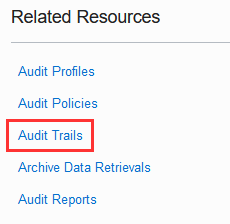

        **Note**: From the **Compartment** drop-down list, select your compartment

    - From the **Target Databases** drop-down list, notice that there is one audit trail discovered for your Autonomous Database (UNIFIED\_AUDIT\_TRAIL)

        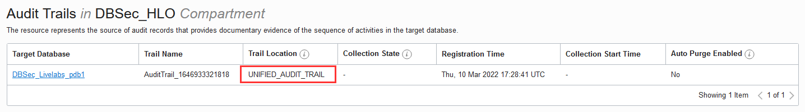

    - Review the information in the table, and then click your target database name to view more detail

        

    - Review the information on the **Audit Trail Details** page

        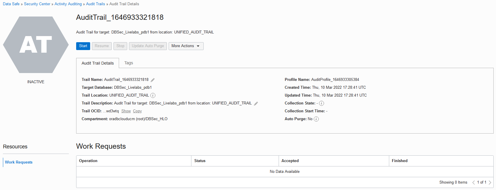

        **Note**: This is where you can manage audit data collection for the audit trail

4. Review the audit policy for your target database

    - In the breadcrumb at the top of the page, click **Activity Auditing**

        

    - Under **Related Resources**, click **Audit Policies**

        

        **Note**: From the **Compartment** drop-down list, select your compartment if needed

    - From the **Target Databases** drop-down list, review the information provided for your target database's audit policy

        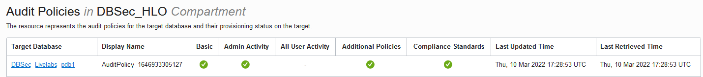

    - Then click your target database name to view more detail

        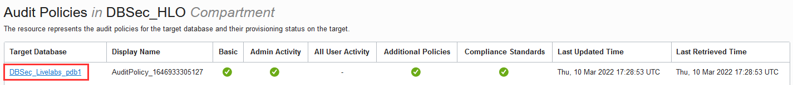

    - On the **Audit Policy Details** page, scroll down and review the list of audit policies available for your target database

        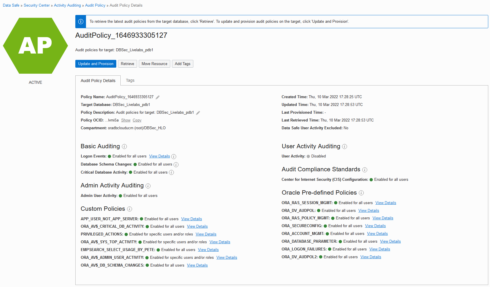

        **Note**:
        - A grey circle indicates the audit policy is not yet provisioned on the target database
        - A green circle indicates that the audit policy is provisioned
        - You can choose to provision any number of audit policies on your target database and set filters on users and roles

5. View the quantity of audit records available on your target database for the discovered audit trail(s)

    - In the breadcrumb at the top of the page, click **Activity Auditing**

        

    - On the left under **Related Resources**, click **Audit Profiles**

        

        **Note**: From the **Compartment** drop-down list, select your compartment.

    - From the **Target Databases** drop-down list, click the name of your target database

        

    - Scroll down to the **Compute Audit Volume** section, and click [**Available on Target Database**]

        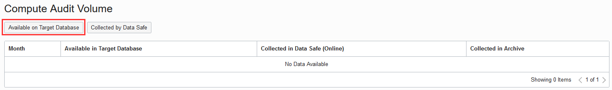

    - The **Compute Available Volume** dialog box is displayed

        - In the **Select Start Date** box, enter the current date (you can use the calendar widget to help you)
        - From the **Trail Locations** drop-down list, select ` `

            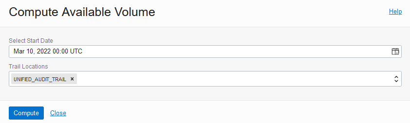

        - Click [**Compute**] and wait for Oracle Data Safe to calculate the available audit volume

            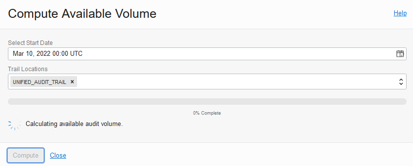

    - In the **Available in Target Database** column, view the number of audit records for the `UNIFIED_AUDIT_TRAIL`

        

        **Note**:
        - There is a small number of audit records in the `UNIFIED_AUDIT_TRAIL` because your target database has just been provisioned
        - For an older target database, there are probably many more audit records
        - Oracle Data Safe splits up the numbers by month
        - These values help you to decide on a start date for the Oracle Data Safe audit trail

6. Start audit data collection

    - In the breadcrumb at the top of the page, click **Activity Auditing**

        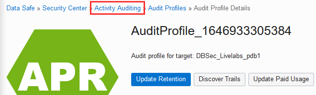

    - On the left under **Related Resources**, click **Audit Trails**

        

        **Note**: From the **Compartment** drop-down list, select your compartment

    - From the **Target Databases** drop-down list, click the name of your target database

        

        **Note**: The **Audit Trail Details** page is displayed!

    - Click [**Start**]

        

    - A **Start Audit Trail: UNIFIED\_AUDIT\_TRAIL** dialog box is displayed

        - Configure a start date based on the data in the **Compute Audit Volume** region of the audit profile that you viewed in task 5 (step 10), and then click [**Start**]

            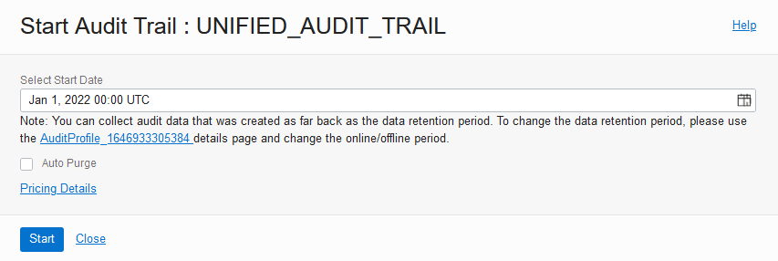

            **Note**: For example, if you have several months listed, you can set the start date to the beginning of the year

        - Notice when the **Collection State** changes to **COLLECTING** and then to **IDLE**
        
            

7. Provision audit policies

    - In the breadcrumb at the top of the page, click **Activity Auditing**

        

    - Under **Related Resources**, click **Audit Policies**

        

        **Note**: From the **Compartment** drop-down list, select your compartment

    - From the **Target Databases** drop-down list, click the name of your target database

        

    - Click [**Update and Provision**]
    
        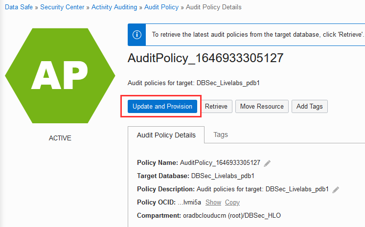

    - The **Provision Audit Policies** panel is displayed

        - Select *Exclude Data Safe user activity*
        - Under **Basic Auditing**, select *Database Schema Changes* and *Critical Database Activity*
        - Under **Admin Activity Auditing**, select *Admin User Activity*
        - Under **Custom Policies**, select *APP\_USER\_NOT\_APP\_SERVER*

            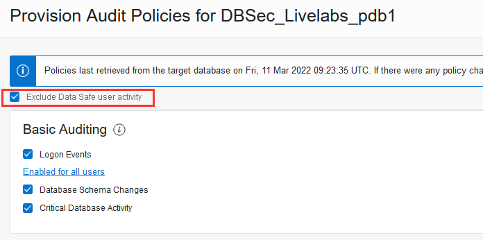

        - Click [**Update and Provision**] to provision the selected policies on your target database

    - Wait for the provisioning to finish, and then view the updated policy information on the page

        

        

8. View the All Activity report

    - In the breadcrumb at the top of the page, click **Activity Auditing**

        

    - Under **Related Resources**, click **Audit Reports**
    
        

    - Oracle Data Safe has the following predefined audit reports:

        

    - Click the **All Activity** report to view it

    - View the filters set in the report

        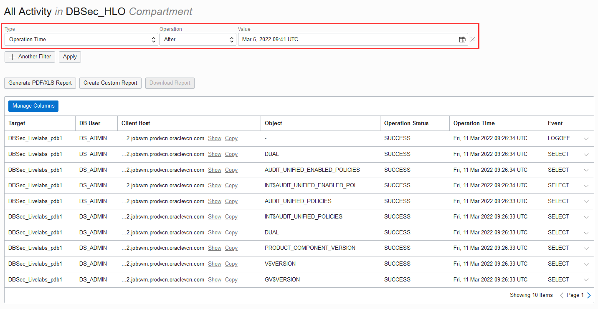

        **Note**: By default, the report is filtered to shows audit events for the past one week for all target databases in the selected compartment

    - To view more detail for a particular audit event, click the down arrow to expand the row and show details for the particular event
    
        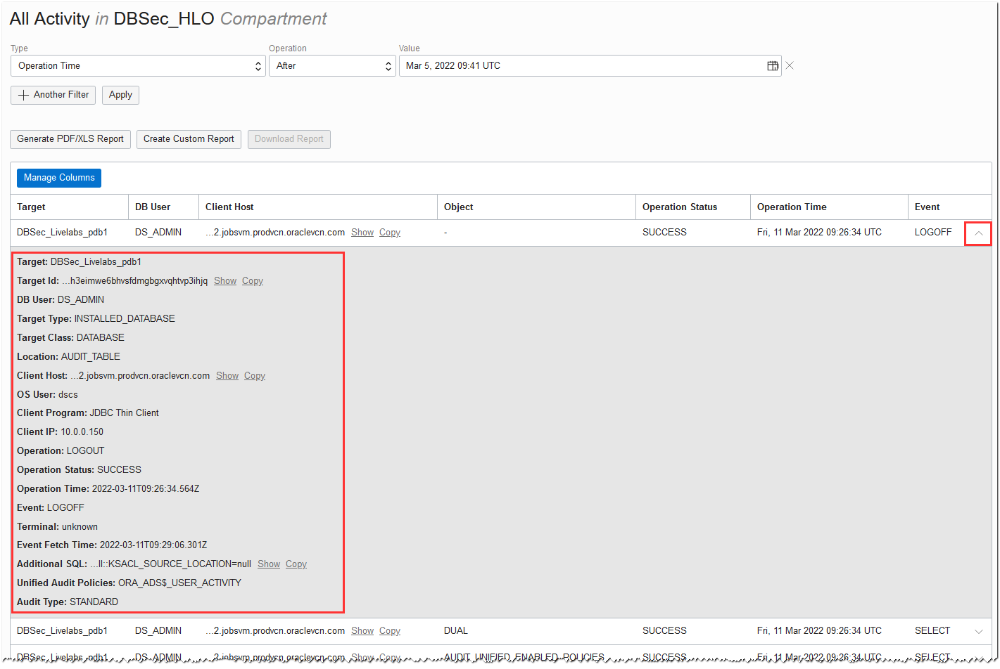

        **Note**: For some details, you can copy their values to the clipboard

9. Create a custom audit report

    - To add a filter, click [**+ Another Filter**] and add the following two filters:

        - *`Target = DBSec_Livelabs_pdb1`*
        - *`Event = SELECT`*

        

    - Click [**Apply**]
    
    - Click **Manage Columns**

        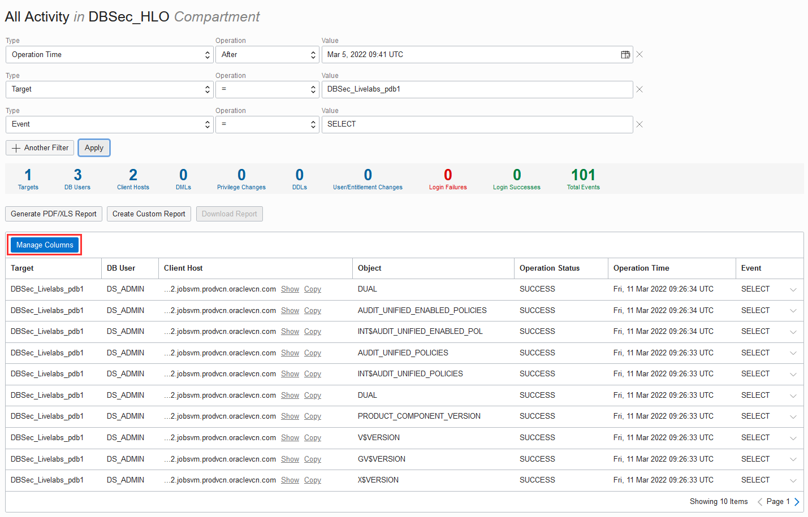

    - In the **Manage Columns** panel, select **Target**, **DB User**, **Object**, **Operation Time**, **Event**, and **Unified Audit Policies** columns
    
        
    
    - Click [**Apply Changes**]
    
    - The table displays the selected columns

        
        
        **Note**: Notice that the totals are adjusted too

    - Click [**Create Custom Report**]

    - The **Custom Report** dialog box is displayed!

        - Enter the report name *`All SELECT Activity Report in the target DBSec_Livelabs_pdb1`*
        - Enter an optional description *`Custom audit report for DBSec_Livelabs_pdb1 target db`*
        - Select your compartment
        
            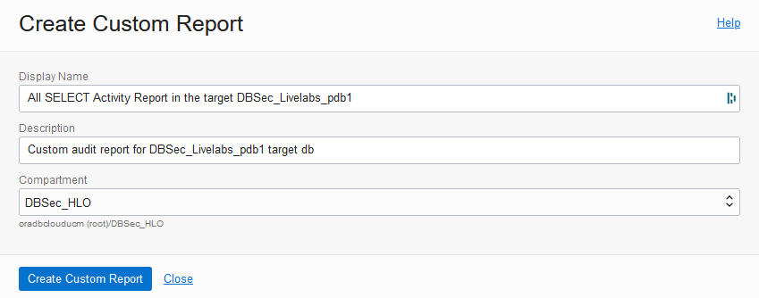

        - Click **Create Custom Report** and wait for the report to generate

        - In the **Create Custom Report** dialog box, click the **click here** link to navigate to your custom report

            

            **Note**: If you need to modify your custom report, you can click [**Save Report**] to save the changes

    - To view your custom report in the future, under **Related Resources**, click **Audit Reports**
    
        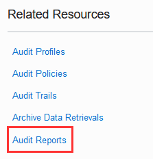
    
    - Click the **Custom Reports** tab, and then have a look on your custom audit reports

        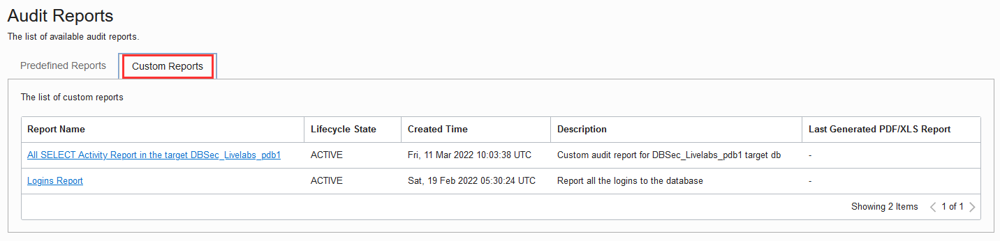

10. Generate and download a custom audit report as a PDF

    - Click on your "**All SELECT Activity Report in the target `DBSec_Livelabs_pdb1`**" custom report
    
        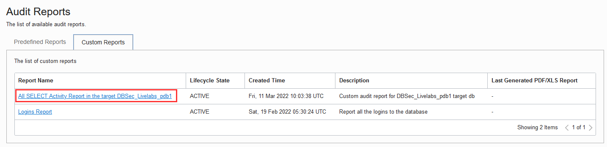

    - On the custom audit report page, click [**Generate PDF/XLS Report**]

        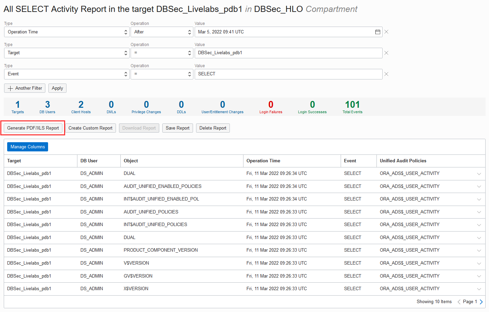

    - The **Generate Report** dialog box is displayed, and fill it out as following:

        - Report Format: Select *`PDF`*
        - Display Name: *`All SELECT Activity Report in the target DBSec_Livelabs_pdb1`*
        - Description: *`Custom audit report for DBSec_Livelabs_pdb1 target db`*
        - Compartment: Select your compartment

        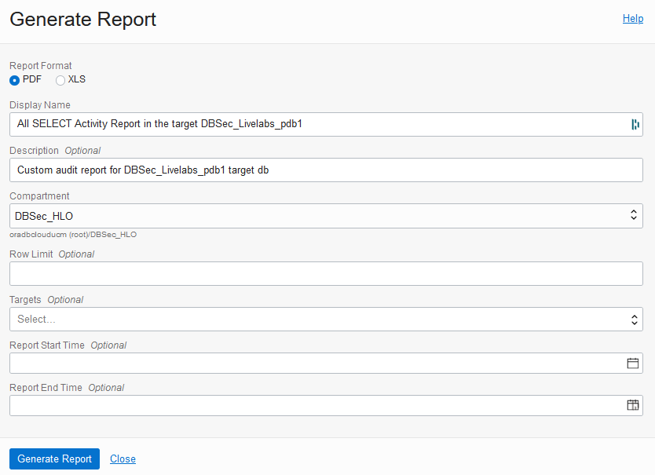

    - Click [**Generate Report**] and wait until the PDF report is generated

        **Note**: A message is displayed stating that report generation is complete

    - Click the **click here** link to download the report

        

        **Note**: A dialog box is displayed providing you options to open or save the document

    - Save the report to your local computer

    - Click **Close** on the dialog box and open the PDF report to view it

        


## Task 3: Generate Alerts

An alert is a message that notifies you when a particular audit event happens on a target database. In Oracle Data Safe, you can provision alert policies on your target databases, view and manage alerts, view predefined alert reports, and create custom alert reports.

Start by reviewing the predefined alert policies in Oracle Data Safe, and then provision two of them. Using the web tool in Oracle Cloud Infrastructure called Database Actions, perform activity on your target database to cause alerts in Oracle Data Safe. Review the generated alerts and create a custom alerts report. Download the report as a PDF.

1. Review the Oracle Data Safe alert policies

    - In Security Center, click **Alerts**

        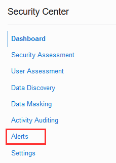

        **Note**:
        - The **Alerts** page is displayed
        - The alerts dashboard does not have any data because you have not yet enabled any alert policies

            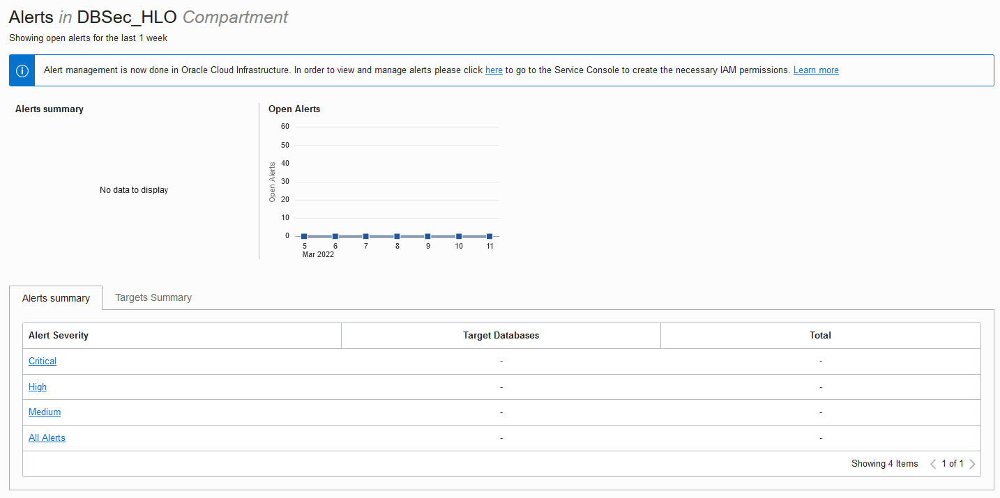

    - Under **Related Resources**, click **Alert Policies**

        

    - Review the list of available alert policies in Oracle Data Safe

        

    - Click the **User Creation/Modification** alert policy and review its details

        

        **Note**: The **Alert Policy Details** page is displayed for the **User Creation/Modification** alert policy

    - Next to **Policy Applied On Target Databases**, click **View List** to view the target databases associated with the alert policy

        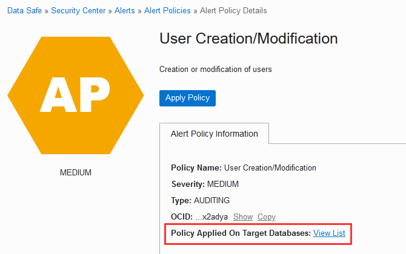

    - The **Target-Policy Associations** page is displayed with the **Policy Name** filter set to **User Creation/Modification**

        

        **Note**: Because you have not yet associated the alert policy with any target database, the table shows **No Target Policy Associations Available**

2. Provision alert policies on your target database

    - On the **Filters** section at the left:
    
        - Target Databases: select *`DBSec_Livelabs_pdb1`*
        - Policy Name: select *`All`*

            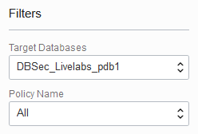

    - On the **Target-Policy Associations** page, click [**Apply Policy**]

        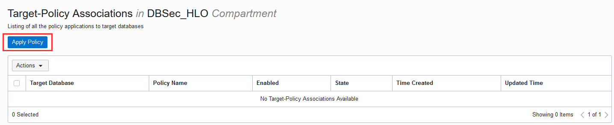

    - The **Apply And Enable Alert Policy To Target Databases** panel is displayed

        - Select **Selected Targets Only**
        - If needed, click **Change Compartment** and select your compartment
        - From the drop-down list, select your target database (here *`DBSec_Livelabs_pdb1`*)
        - Select **Selected Policies Only**
        - From the drop-down list, one at a time, select the *`User Creation/Modification`* and *`Failed Logins by Admin User`* alert policies

            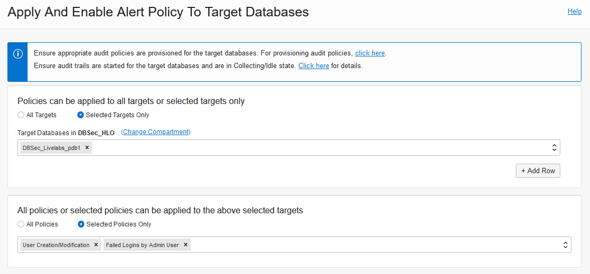

        - Click [**Apply Policy**]

            **Note**:
            - The alert policies are applied while the panel is open
            - Wait until both policies are applied and the status **Done** is displayed

                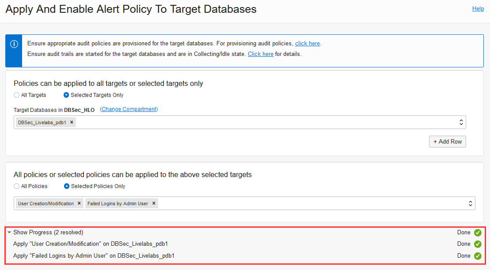

        - Click **Close**

            **Note**: The two target-policy associations for your target database are listed on the page and show as enabled

            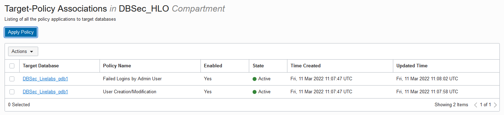

3. Perform activity on your target database to cause alerts in Oracle Data Safe

    - Open a Terminal session on your **DBSec-Lab** VM as OS user *oracle*

        ````
        <copy>sudo su - oracle</copy>
        ````

        **Note**: If you are using a remote desktop session, double-click on the *Terminal* icon on the desktop to launch a session

    - Execute the following SQL script

        <!--
        ````
        <copy>
        cd $DBSEC_LABS/data-safe
        ./ds_generate_bad_activity.sh
        </copy>
        ````
        -->

        ````
        <copy>
        sqlplus -s ${DBUSR_SYS}/${DBUSR_PWD}@pdb1 as sysdba<<EOF
        
        DROP USER malfoy CASCADE;
        CREATE USER malfoy IDENTIFIED BY ${DBUSR_PWD};
        GRANT pdb_dba TO malfoy;
        
        exit;
        EOF
        </copy>
        ````

           

4. Review the generated alerts in Oracle Data Safe

    - Go back to the Data Safe **Security Center** web page

    - Click **Alerts**

    - Notice that the alerts dashboard now has data

           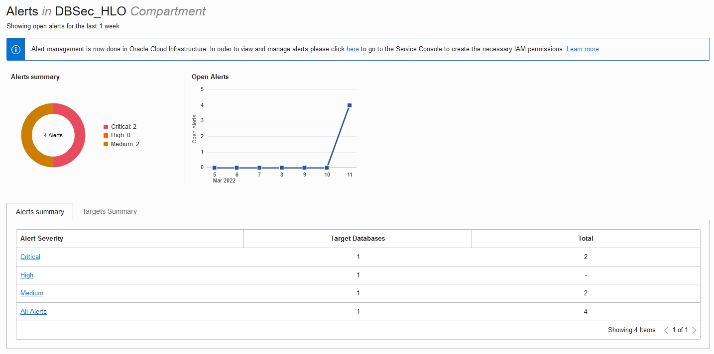

           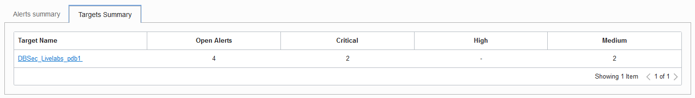

        **Note**:
        - The **Alerts summary** chart shows that there are four alerts: two are critical risk and two are medium risk
        - The **Open Alerts** chart shows that there are four alerts on the current day
        - The **Alerts Summary** tab shows the number of critical, high, and medium alerts along with target database counts, and it also shows you the total number of alerts and target databases
        - The **Targets Summary** tab shows you the number of open, critical, high, and medium alerts

    - Under **Related Resources**, click **Reports**

        

    - In the **Report Name** column on the right, click the **All Alerts** report to view it

        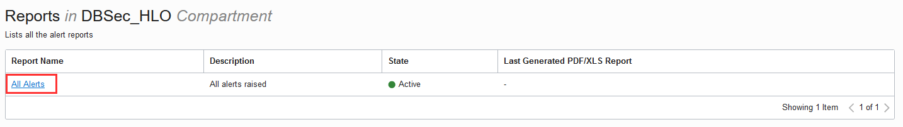

    - Review the report

        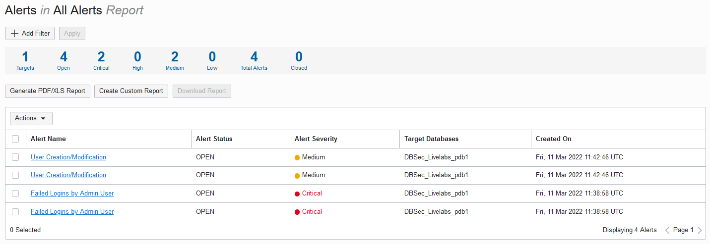

        **Note**:
        - The report currently does not have any filters set. It shows you all alerts for all target databases in the selected compartment
        - You can view the total number of target databases; total number of open and closed alerts, and the total number of critical, high, medium, and low alerts
        - You can click the **Targets** total to view the list of target databases. You can click the other totals to toggle a filter on the list of alerts
        - At the bottom of the report, you can view the list of alerts. By default, the table shows you the alert name, alert status, alert severity, target databases on which the audited event occurred, and when the alert was created
        - You have options to create a PDF or XLS report, create a custom report, open and close alerts, and specify which table columns you want displayed on the page

    - At the top of the report, add the two following filters by clicking [**+ Add Filter**]:
        - *Target Database Name = `DBSec_Livelabs_pdb1`*
        - *Alert Name = User Creation/Modification*

            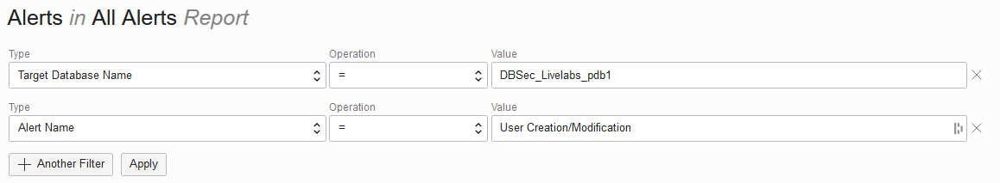
            
        - Click [**Apply**]

    - Review the alerts generated for **User Creation/Modification**

        

5. View details for an alert and close it

    - Click one of the alerts to view more detail about it

        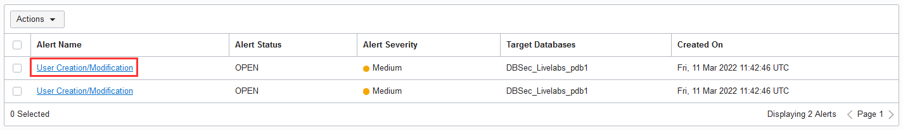

    - Review the information about the alert:

        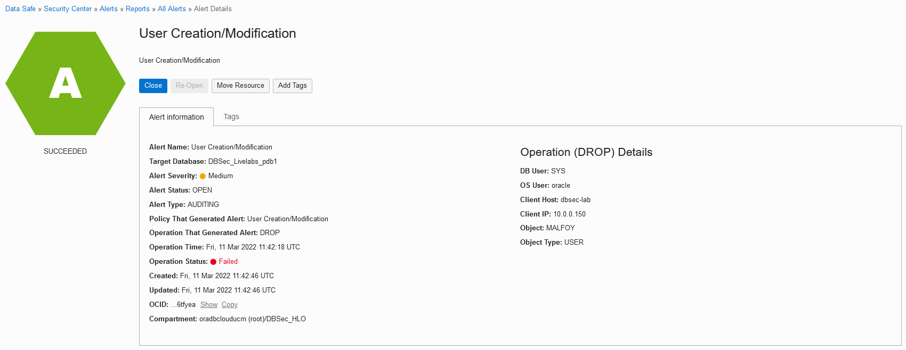

        **Note**:
        - Alert name (instance of the alert)
        - Target database to which the alert applies
        - Alert severity
        - Alert status - Whether the alert is open or closed
        - Alert type - Currently all alert types are AUDITING
        - Policy that generated the alert
        - User operation that generated the alert
        - Operation time
        - Operation status
        - When the alert was created and updated
        - Oracle Cloud Identifier (OCID) for the alert
        - Compartment in which the alert resides
        - Operation details

    - To close the alert, click [**Close**]

        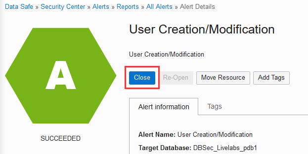

    - The alert status is immediately set to **CLOSED**

        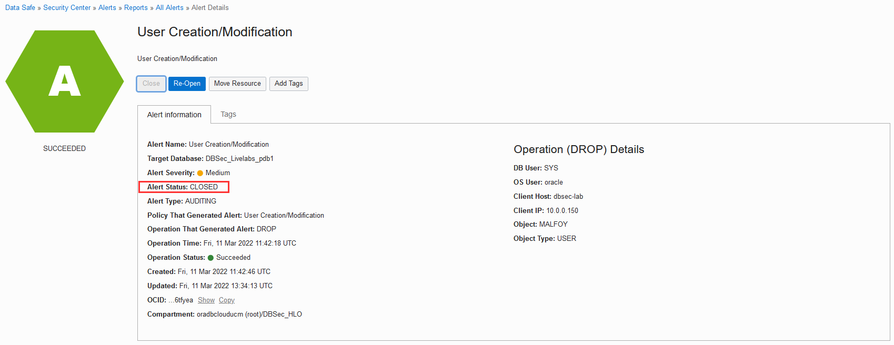

6. Create a custom alerts report

    - In the breadcrumb, click **All Alerts**

        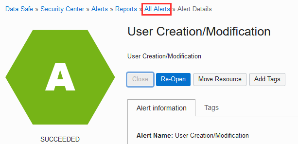

    - Apply two filters:

        - *Target Database Name = `DBSec_Livelabs_pdb1`*
        - *Alert Name = Failed Logins by Admin User*

            

        - Click [**Apply**]
    
    - Click [**Create Custom Report**]

        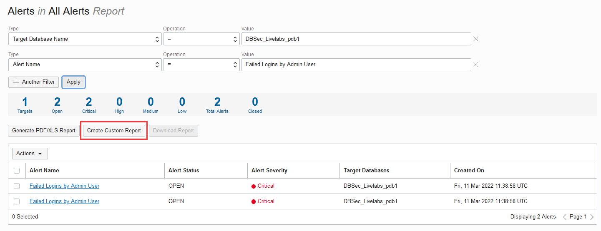

    - The **Create Custom Report** dialog box is displayed and fill it out as following:

        - Display Name: *Failed Logins by Admin User for - Target Database Name = `DBSec_Livelabs_pdb1`*
        - Compartment: select your compartment
        
            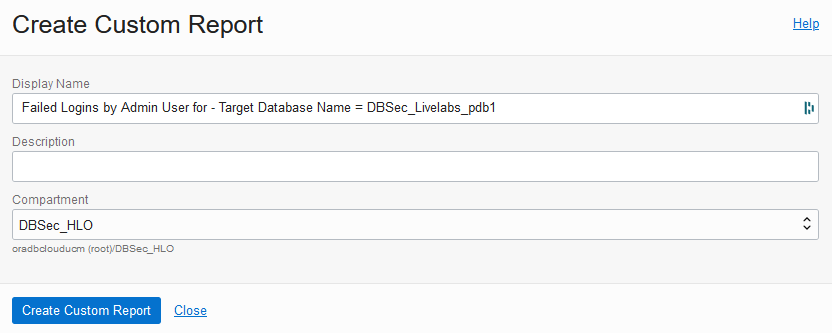
        
        - Click [**Create Custom Report**] and wait for the report to generate

        - Click the **click here** link to view the report

            

        - Save the report to your local computer

            

7. Generate and download a custom alerts report as a PDF

    - On the custom alert report page, click [**Generate PDF/XLS Report**]

        

    - The **Generate Report** dialog box is displayed, and fill it out as following:

        - Report Format: Select *`PDF`*
        - Display Name: *`Failed Admin Logins for DBSec_Livelabs_pdb1`*
        - Description: *`Custom alert report for DBSec_Livelabs_pdb1 target db`*
        - Compartment: Select your compartment

        

    - Click [**Generate Report**] and wait until the PDF report is generated

        **Note**: A message is displayed stating that report generation is complete

    - Click the **click here** link to download the report

        

        **Note**: A dialog box is displayed providing you options to open or save the document

    - Save the report to your local computer

    - Click **Close** on the dialog box and open the PDF report to view it

        

## Task 4: Assess the security of your database configurations and users

Security Assessment helps you assess the security of your database configurations. It analyzes database configurations, user accounts, and security controls, and then reports the findings with recommendations for remediation activities that follow best practices to reduce or mitigate risk. User Assessment helps you assess the security of your database users and identify high risk users. By default, Oracle Data Safe automatically generates security and user assessments for your target databases and stores them in the Assessment History. You can analyze assessment data across all your target databases and for each target database. You can monitor security drift on your target databases by comparing the latest assessment to a baseline or to another assessment.

In this lab, you explore Security Assessment and User Assessment. Because these features are similar, you perform some tasks in Security Assessment and others in User Assessment.

1. View the dashboard for **Security Assessment**

    - In Security Center, click **Security Assessment**

        

    - Under **List Scope**, select your compartment and deselect **Include child compartments**

        

        **Note**: The dashboard shows statistics across all the target databases in the selected compartment

    - At the top of the page, review the **Risk Level** and **Risks by Category** charts

        

        **Note**:
        - The **Risk Level** chart shows you a percentage breakdown of the different risk levels (High, Medium, Low, Advisory, and Evaluate) across all of your target databases
        - The **Risks by Category** chart shows you a percentage breakdown of the different risk categories (User Accounts, Privileges and Roles, Authorization Control, Data Encryption, Fine-Grained Access Control, Auditing, and Database Configurations) across all your target databases

    - View the **Risk Summary** tab

        

        **Note**:
        - The **Risk Summary** shows you how much risk you have across all target databases in the specified compartment(s)
        - You can compare the number of high, medium, low, advisory, and evaluate risk findings across all target databases, and view which risk categories have the greatest numbers
        - Risk categories include Target Databases, User Accounts, Privileges and Roles, Authorization Control, Fine-Grained Access Control, Data Encryption, Auditing, and Database Configuration
        - Make note of the **Total Findings** for high, medium, and low risk levels as you will compare them later to another assessment

    - Click the **Target Summary** tab and view the information

        

        **Note**:
        - The **Target Summary** shows you a view of the security posture of each of your target databases
        - You can view the number of high, medium, low, advisory, and evaluate risks for each database
        - You can view the assessment date and find out if the latest assessment deviates from a baseline (if one is set)
        - You can access the latest assessment report for each target database

2. View the latest security assessment for your target database

    When you registered your target database, Oracle Data Safe automatically created a security assessment for you, then this is what you are viewing now

    - On the **Target Summary** tab, locate the line that has your target database, and click **View Report**
    
        

        **Note**:
        - The latest security assessment for your target database is displayed
        - Notice that **Latest assessment for target database** is displayed at the top of the page

    - Review the table on the **Assessment Summary** tab

        
        
        **Note**:
        - This table compares the number of findings for each category in the report and counts the number of findings per risk level (**High Risk**, **Medium Risk**, **Low Risk**, **Advisory**, **Evaluate**, and **Pass**)
        - These values help you to identify areas that need attention

    - To view details about the assessment itself, click the **Assessment Information** tab

        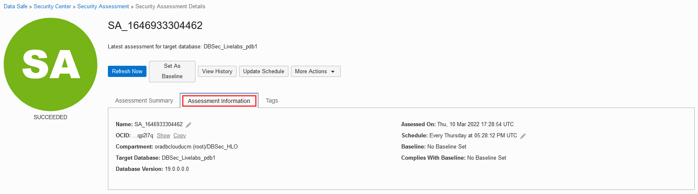

        **Note**: Details include assessment name, OCID, compartment to which the assessment was saved, target database name, target database version, assessment date, schedule (if applicable), name of the baseline assessment (if one is set), and complies with baseline flag (Yes, No, or No Baseline Set)

    - Scroll down and view the **Assessment Details** section

        

        **Note**:
        - This section shows you all the findings for each risk category
        - Risks are color-coded to help you easily identify categories that have high risk findings (red)

    - Under **Filters** on the left, notice that you can select the risk levels that you want displayed
    
        - Deselect **Advisory** and **Evaluate**

            

        - Then click [**Apply**]

        - Now, you see less Assessment details
        
            

    - Under **User Accounts**, expand **User Details**

        

        **Note**: For each user in your target database, the table shows you the user status, profile used, the user's default tablespace, whether the user is Oracle Defined (Yes or No), and how the user is authenticated (Auth Type)

    - Expand another category, such as **Patch check**, and review the findings

        

        **Note**:
        - Each finding shows you the status (risk level), a summary of the finding, details about the finding, remarks to help you to mitigate the risk, and references (whether a finding is recommended by the Center for Internet Security (**CIS**), European Union's General Data Protection Regulation (**GDPR**), and/or Security Technical Implementation Guide (**STIG**))
        - These references make it easy for you to identify the recommended security controls
        - In the example below, there are two references: STIG and GDPR

    - On the left under **Filters**, select all the filters, and click [**Apply**]

        

    - Collapse **User Accounts**, expand a few categories under **Privileges and Roles**, and review the findings

        

    - Scroll down further and expand other categories
    
        **Note**: Each category lists related findings about your target database and how you can make changes to improve its security
    
    - At the top of the page, click **View History**
    
        

    - Notice that you have one security assessment listed for your target database

        

        **Note**: This is a static copy of the latest security assessment
    
    - Click [**Close**]

3. Refresh the latest security assessment and analyze the results

    After you registered your target database at the beginning of this workshop, you loaded sample data into it. This sample data is not yet showing up in the latest security assessment. Refresh the latest assessment and view the new data.
    
    - While you are still viewing the latest security assessment, at the top of the assessment, click [**Refresh Now**]
    
        

        **Note**: The **Refresh Now** page is displayed

    - In the **Save Latest Assessment** box
    
        - Enter *`My Security Assessment`*

            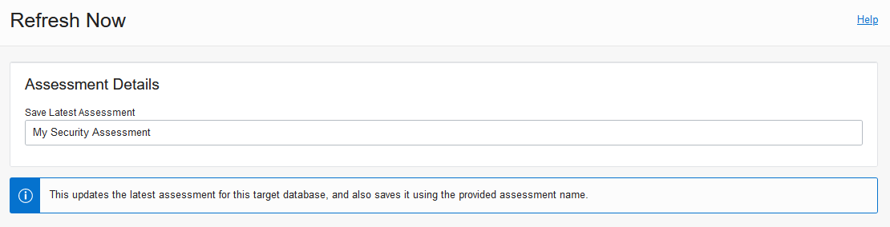

        - Then click [**Refresh Now**]
 
            **Note**:
            - This action updates the latest security assessment for your target database and also saves a copy named My Security Assessment in the Assessment History
            - The refresh operation takes about one minute

    - Click the **Assessment Information** tab and observe that the assessment date and time is right now

        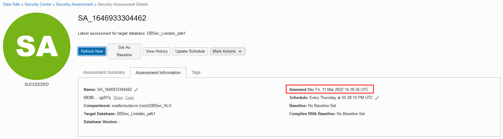

    - In the breadcrumb at the top of the page, click **Security Assessment** to return to the dashboard

        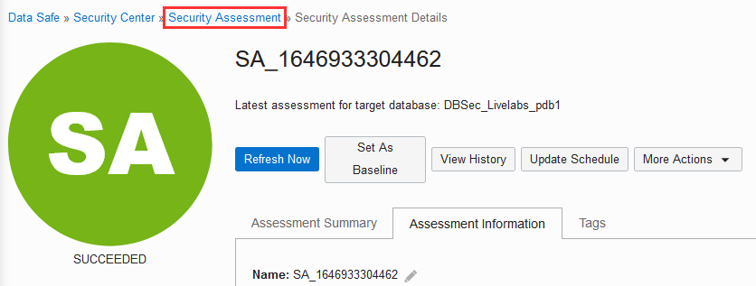

    -  Review the total findings for high, medium, and low risk levels
    
        

        **Note**: These values could be different than the values you viewed in the original assessment (in Step 1)

    - In the **Risk Level** column, click **High** to view all the high risk findings

        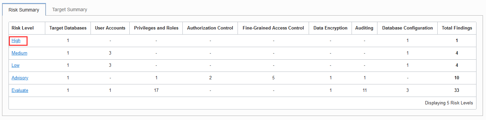

    - On the **Overview** tab, review the **Risks by Category** chart

        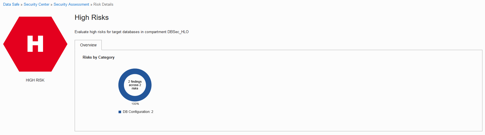

        **Note**: You can position your cursor over the percentage values to view the category name and count

    - In the **Risk Details** section, expand one of the high level risks, for example, **Database Backup**

        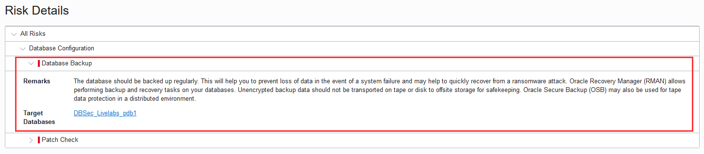

        **Note**:
        - The **Remarks** section explains the risk and how you can mitigate it
        - The **Target Databases** section lists the target databases to which the high risk applies

    - Click your target database name to view all the details about the finding for your target database

        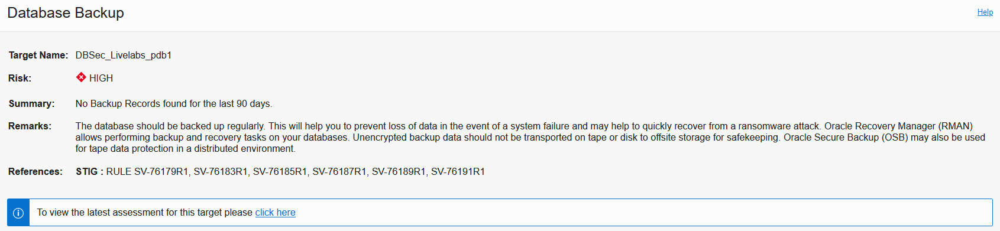
        
        **Note**: The finding includes your target database name, risk level, a summary about the risk, details on your target database, remarks that explain the risk and help you to mitigate it, and references

    - To view the latest assessment for your target database, click the **click here** link
    
        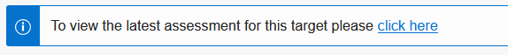
        
        **Note**: You are returned to the latest security assessment

4. Add a schedule to save a security assessment for your target database every Sunday at 11:30 PM

    - In the breadcrumb at the top of the page, click **Security Assessment**

    - Under **Related Resources** on the left, click **Schedules**

        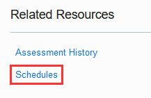

        **Note**: The Schedules page is displayed!

    - In the table, notice that a schedule already exists
    
        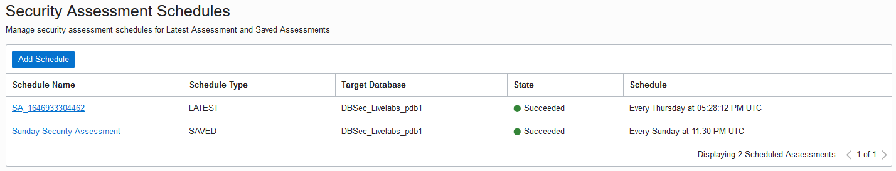

        **Note**:
        - It's type is LATEST
        - This is the default schedule that automatically runs a security assessment job on your target database once per week
        - You can update it and rename it, but you can't delete it

    - Click [**Add Schedule**]
    
    - The **Add Schedule To Save Assessments** page is displayed and fill it out as following:

        - Target Database: Select *`DBSec_Livelabs_pdb1`*
        - Schedule Name: *`Sunday Security Assessment`*
        - Compartment To Save The Assessment: Select your compartment
        - Schedule Type: Select *`Weekly`*
        - Every: Select *`Sunday`*
        - Time: Select *`11:30 PM`*

            

    - Click [**Add Schedule**]
    
    - When the schedule is created, its status changes to **SUCCEEDED**

        

5. View the history of all security assessments for your target database

    - In the breadcrumb at the top of the page, click **Security Assessment**

    - Click the **Target Summary** tab

    - Click the **View Report** link for your target database

        **Note**: The latest security assessment is displayed

    - At the top of the page, click [**View History**]

    - Review all the security assessments for your target database

        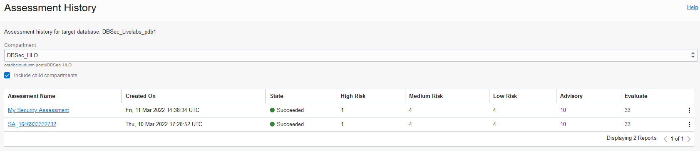

        **Note**:
        - So far, you should have two security assessments: The default assessment that was automatically generated for you by Oracle Data Safe, and the assessment that you saved earlier as My Security Assessment
        - If you don't see your assessments, make sure that your compartment is selected
        - To view assessments saved to a different compartment, select the compartment from the **Compartment** drop-down list
        - To also list assessments that were saved to child compartments of the selected compartment, select the **Include child compartments** check box

    - Review the number of findings for each risk level for your target database if the values changed between the two assessments, then click [**Close**]

6. Set a baseline and generate a Comparison report for Security Assessment

    A baseline assessment shows you data for all your target databases in a selected compartment at a given point in time. However, because we are only dealing with one Autonomous Database in your compartment, the baseline assessment shows data for only your database. When you do a baseline comparison, Oracle Data Safe automatically compares only the assessments that pertain to your database.

    - In the breadcrumb at the top of the page, click **Security Assessment**

    - Under **Related Resources**, click **Assessment History**

        

    - Click the first name starts with **SA_** (the first security assessment that Oracle Data Safe generated during target database registration)

        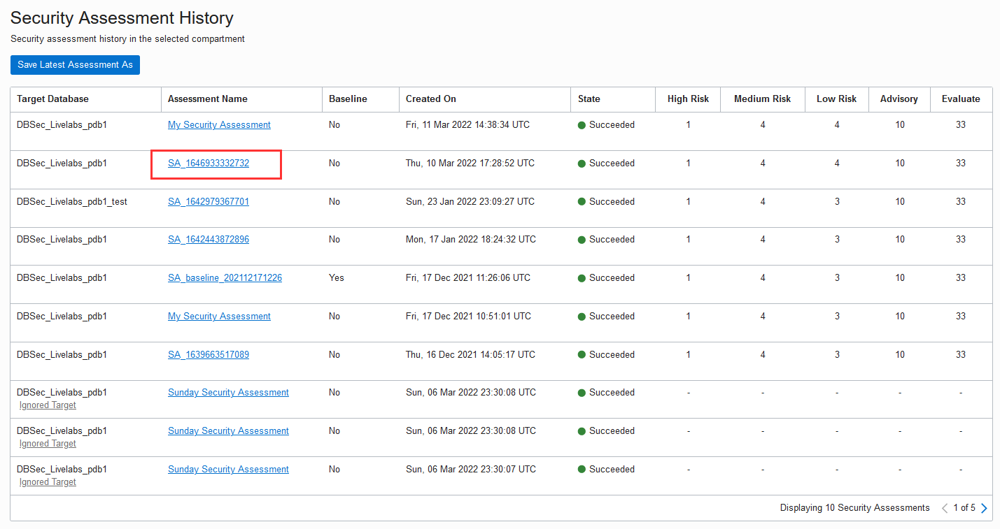
    
        **Note**: The security assessment is displayed

    - Click [**Set As Baseline**]

        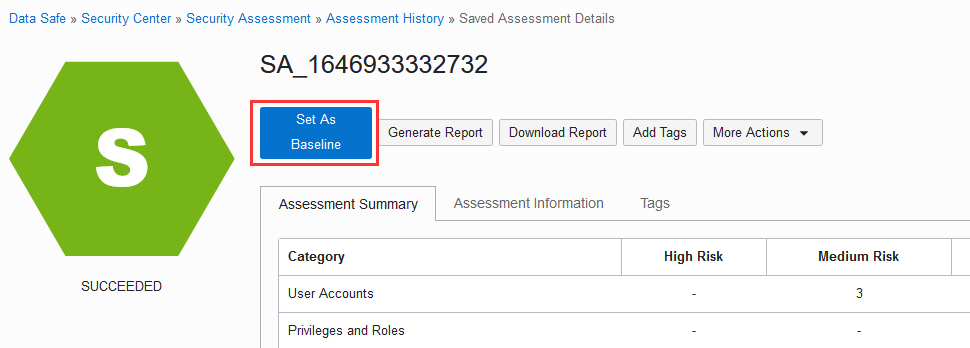

    - In the **Set As Baseline** dialog box, click **Yes** to confirm that you want to set these findings as the baseline

        

        **Important**: Stay on the page until the message **Baseline has been set** is displayed!

        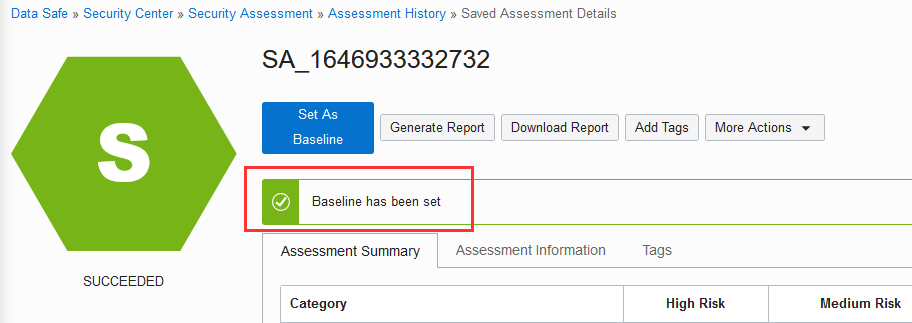

    - Access the latest assessment for your target database
    
        - To do this, in the breadcrumb, click **Security Assessment**
        - Click the **Target Summary** tab
        - Click **View Report** for your target database

    - Under **Resources** on the left, click **Compare with Baseline**
    
        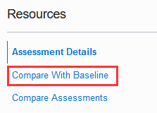
        
        **Note**: Oracle Data Safe automatically begins processing the comparison

    - When the comparison operation is completed, review the Comparison report (here we have nothing, but maybe you could have a few on your own comparison report)

        

        - Review the number of findings per risk category for each risk level. Categories include **User Accounts**, **Privileges and Roles**, **Authorization Control**, **Data Encryption**, **Fine-Grained Access Control**, **Auditing**, and **Database Configuration**
        - You can identify where the changes have occurred on your target database by viewing cells that contain the word **Modified**
        - The number represents the total count of new, remediated, and modified risks on the target database
        - In the details table, you can view the risk level for each finding, the category to which the finding belongs, the finding name, and a description of what has changed on your target database
        -The Comparison Report column is important because it provides explanations of what is changed, added, or removed from the target database since the baseline report was generated

7. View the dashboard for **User Assessment**

    - Navigate to User Assessment
    
        - In the breadcrumb at the top of the page, click **Security Center**

            

        - On the left, click **User Assessment**

            

    - Under **List Scope**, make sure your compartment is selected

    - At the top of the dashboard, review the four charts

        

        **Note**:
        - The **User Risk** chart shows you the number and percentage of users who are **Critical Risk**, **High Risk**, **Medium Risk**, and **Low Risk**
        - The **User Roles** chart shows you the number of users with the **DBA**, **DV Admin**, and **Audit Admin** roles
        - The **Last Password Change** chart shows you the number and percentage of users who changed their passwords within the last 30 days, within the last 30-90 days, and 90 days ago or more
        - The **Last Login** chart shows you the number and percentage of users that signed in to the database within the last 24 hours, within the last week, within the current month, within the current year, and a year ago or more

    - Review the **Risk Summary** tab

        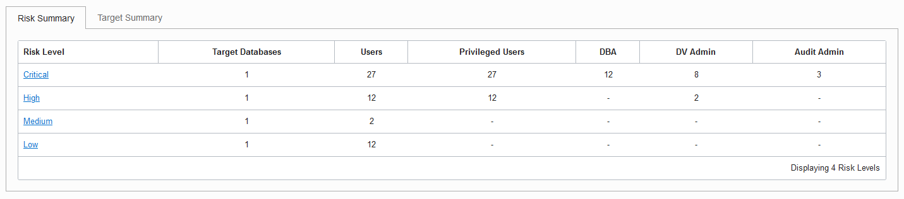

        **Note**:
        - The **Risk Summary** focuses on risks across all your target databases
        - It shows you risk levels, where the risks were found, the number of users at each risk level, and the roles held by the total number of users at each risk level

    - Click the **Target Summary** tab. This tab provides the following information:

        

        **Note**:
        - Number of critical and high risk users, DBAs, DV Admins, and Audit Admins
        - Date and time of the lastest user assessment
        - Whether the latest assessment deviates from the baseline (if one is set)

8. Analyze users in the latest user assessment

    Currently, the latest user assessment is the one that was automatically generated by Oracle Data Safe when you registered your target database
    
    - On the **Target Summary** tab, click **View Report** to view the latest user assessment for your target database

    - At the top of the report, review the **User Risk**, **User Roles**, **Last Password Change**, and **Last Login** charts

        

    - Scroll down and review the **Assessment Details** section
    
        
    
        **Note**:
        This table provides the following information about each user:
        - User name
        - User type (for example, PRIVILEGED, SCHEMA)
        - Whether the user is a DBA, DV Admin, or Audit Admin
        - User risk level (for example, LOW, CRITICAL)
        - User's status (for example, OPEN, LOCKED)
        - Date and time the user last logged in to the target database
        - Audit records for the user

    - In the **User Name** column, click one of the users
    
        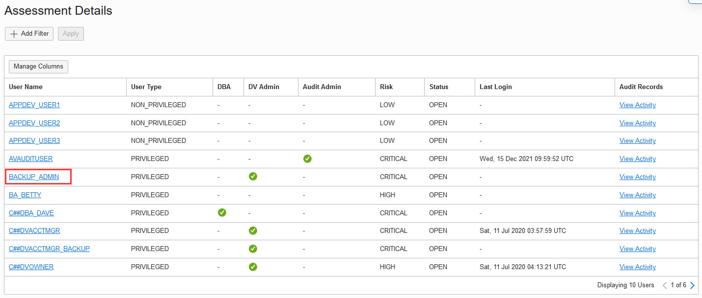

        **Note**:
        The **User Details** page shows the following information about the user:
        - User name
        - Target database name
        - Date and time when the user was created
        - Risk level - Hover over the question mark to view what constitutes a critical risk user.
        - User type
        - User profile
        - Privileged roles (the Admin roles granted to the user)
        - Last login date and time
        - Roles - Expand **All Roles** to view all the roles granted to the user.
        - Privileges - Expand **All Privileges** to view all the privileges granted to the user.

    - Click [**Close**]

    - Notice at the top of the table that you can set filters

        - Click [**+ Add Filter**]
        - From the first drop-down list, select **Risk**
        - From the second drop-down list, select **=**
        - In the box, enter **CRITICAL**
        
        
        
        - Click [**Apply**]
        
            **Note**: The table now shows you only critical risk users

            

9. Review the `DS_ADMIN` user's audit records

    - Identify the row in the table for the `DS_ADMIN` user and in the **Audit Records** column, click **View Activity**
    
        

        **Note**: The **All Activity** report for the `DS_ADMIN` user is displayed!

    - Examine the report

        

        **Note**:
        - The report is automatically filtered to show you audit records for the past week, for the `DS_ADMIN` user, and for your target database
        - At the top of the report, you can view totals for **Targets**, **DB Users**, **Client Hosts**, **Login Success**, **Login Failures**, **User Changes**, **Privilege Changes**, **User Changes**, **DDLs**, **DMLs**, and **Total Events**
        - The **Event** column in the table shows you the types of activities performed by the `DS_ADMIN` user, for example, `EXECUTE`, `LOGON`, `LOGOFF`, and so on
        - At the bottom of the page, click the page numbers to view more audit records

10. View the user **assessment history** for all target databases

    - Under **Security Center**, click **User Assessment**

        

    - Under **Related Resources**, click **Assessment History**

        

        **Note**: Under **List Scope**, make sure your compartment is selected

    - Review the assessment history for all target databases

        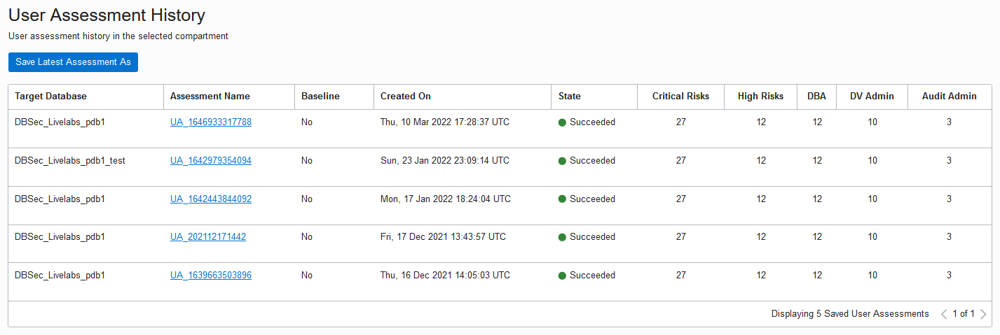

        **Note**:
        - You can compare the number of critical risks, high risks, DBAs, DV Admins, and Audit Admins across all target databases
        - You can also quickly identify user assessments that are set as baselines

    - To sort the list by target database, click the **Target Database** column heading
    
    - Click the name of the user assessment for your target database (here `UA_1646933317788`)

        

        **Note**:
        - This assessment was generated by Oracle Data Safe when you registered your target database
        - It is a saved copy of the latest assessment
        - Notice that you cannot refresh the data in a saved user assessment
        - Make note of the assessment's name (here the assessment's name ends with "7788"

            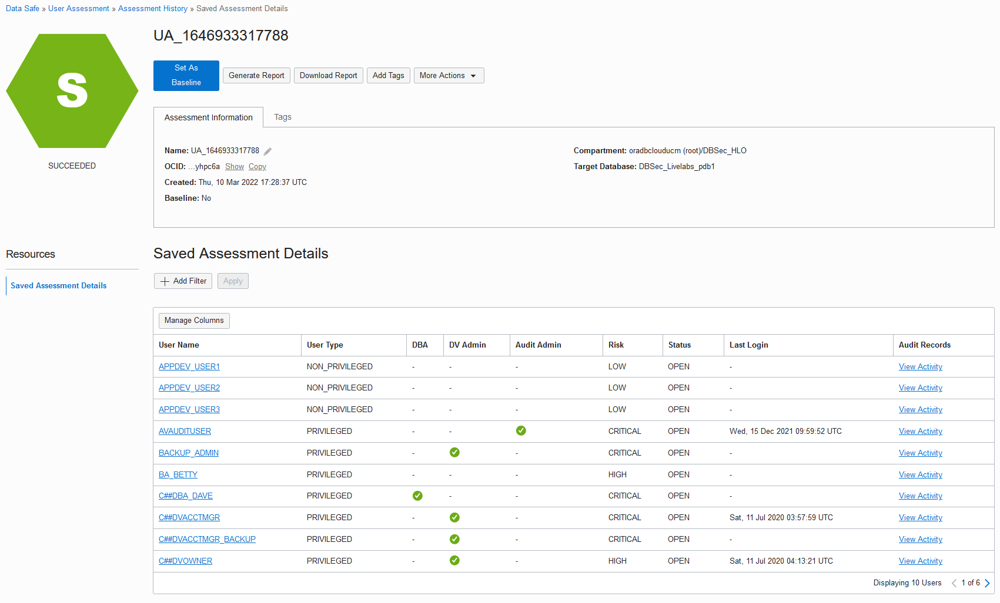

11. Refresh the latest user assessment and rename it

    Let's find the actual latest assessment (not a saved copy of it) and refresh it

    - In the breadcrumb at the top of the page, click **User Assessment**, and then click the **Target Summary** tab

    - Click **View Report** for your target database to open the latest assessment

        

        **Note**:
        - Notice that this assessment's name is different than the last assessment you viewed - not the same as the copy! It is a completely separate user assessment
        - Also notice that you can refresh this assessment, whereas you couldn't refresh the copy in the Assessment History

    - To refresh the latest user assessment
    
        - Click [**Refresh Now**]
    
            

            **Note**: The **Refresh Now** panel is displayed!
        
        - For now, let's keep the default name as is, click **Refresh Now** and wait for the status to read **SUCCEEDED**

            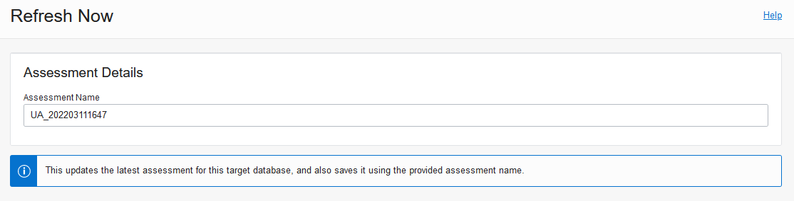

            **Note**: When you refresh the latest user assessment, Oracle Data Safe automatically saves a static copy of it to the Assessment History

    - Now, let's change the assessment name
    
        - Click the **Assessment Information** tab
        - Then click the **Pencil** icon next to the assessment name
        
            
        
        - Change the name to *`Latest User Assessment`*
        - Then click the **Save** icon
        
            

            **Note**: The name is updated on the page!

            

    - In the breadcrumb at the top of the page, click **User Assessment**
    
    - Under **Related Resources**, click **Assessment History**

    - Notice that there are now two saved user assessments, none of which are called "Latest User Assessment"

        

        **Note**: The most current user assessment in the history shows the same number of critical and high risk users as the latest assessment because it is a copy of it

12. Download the latest user assessment as a PDF report

    - Return to the latest user assessment
    
        - Under **Security Center**, click **User Assessment**
        - On the **Target Summary** tab, click **View Report** for your target database

    - From the **More Actions** menu, click **Generate Report**

        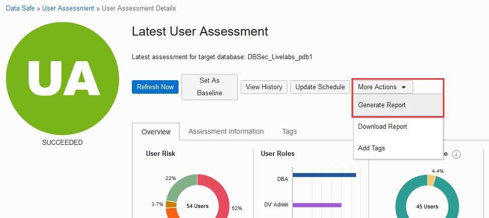

        **Note**: The **Generate Report** dialog box is displayed

    - Leave **PDF** selected as the report format, and click [**Generate Report**]

        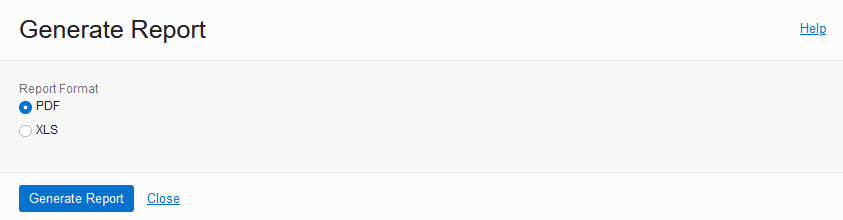

    - Wait for a message that says the **PDF report generation is complete**, and then click **Close**

        

    - From the **More Actions** menu, click **Download Report**

        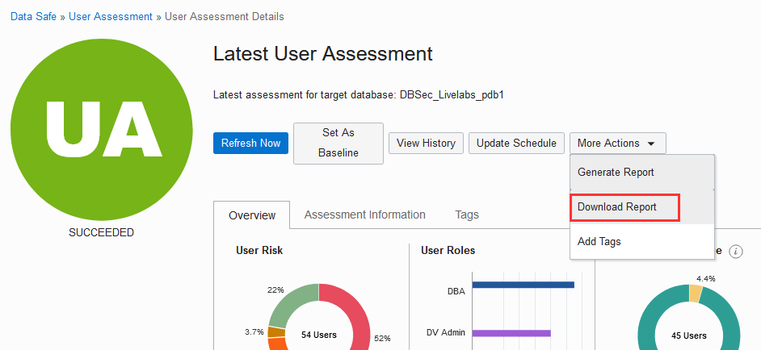

        **Note**: The **Download Report** dialog box is displayed
    
    - Leave the **PDF** report format selected, and click [**Download Report**]

        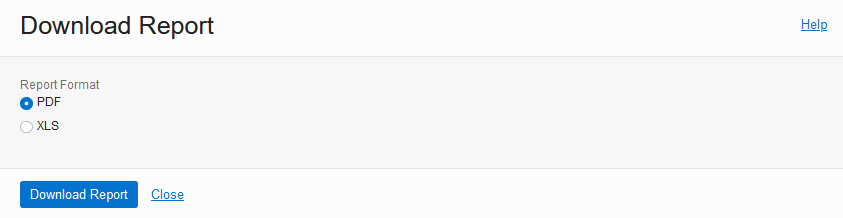

    - Save the report to your local computer

    - Click **Close** on the dialog box and open the PDF report to view it

        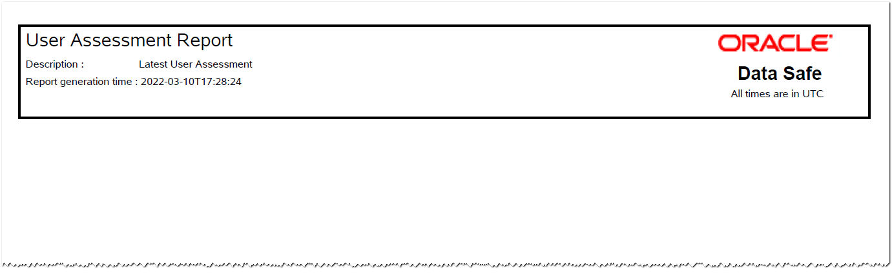
    
13. Compare the latest user assessment with another user assessment

    You can select a user assessment to compare with the latest user assessment and with this option, you don't need to set a baseline

    - On the left under **Resources**, click **Compare Assessments**

        

        **Note**: This option is only available when you are viewing the latest user assessment
    
    - Scroll down to the **Comparison with Other Assessments** section

    - If your compartment isn't shown, click **Change Compartment** and select your compartment

    - From the **Select Assessment** drop-down list, select the earliest assessment for your target database
    
        
    
        **Note**: As soon as you select it, the comparison operation is started!

    - Review the Comparison report
    
        

        **Note**: The report tells you that new user MALFOY has been added to the database since the initial user assessment and it's identified as a critical risk
    
    - In the **Comparison Results** column, click one of the **Open Details** links to view more information

        

        **Note**: The Comparison Details panel is displayed!

    - Review the information, and then click [**Close**]

        


## Task 5: Discover and mask sensitive data

Data Discovery helps you find sensitive data in your databases and Data Masking provides a way for you to mask sensitive data so that the data is safe for non-production purposes

1. View the original **sensitive data** in your database before masking

    - Go back to your Terminal session on your **DBSec-Lab** VM as OS user *oracle*

    - Review the sensitive data to mask

        ````
        <copy>
        cd $DBSEC_LABS/data-safe
        ./ds_query_employee_data.sh</copy>
        ````

        ... results in PROD (**data NOT to be masked!**)

        

        ... results in DEV (**data to mask**)

        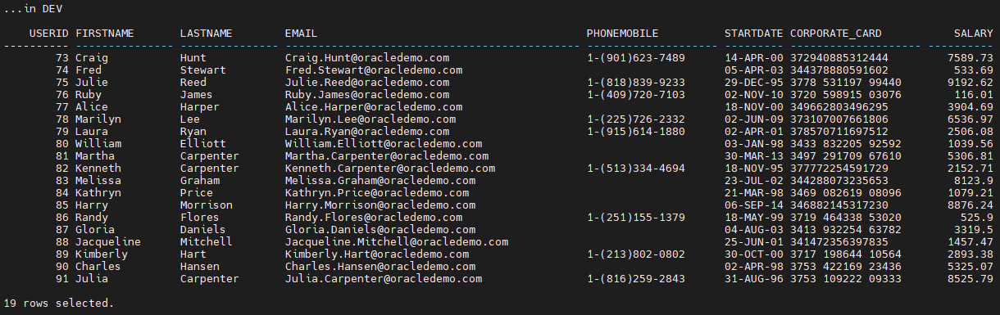

        **Note**:
        - Here we query `DEMO_HR_EMPLOYEES` table in PROD and DEV to be sure that the value are similar
        - Data such as `FIRST_NAME`, `LAST_NAME`, `EMAIL`, `PHONEMOBILE`, `STARTDATE`, `CORPORATE_CARD` and `SALARY` are considered sensitive data and should be masked if shared for non-production use, such as development and analytics

2. Discover sensitive data (for DEV table) by using Data Discovery

    In Data Discovery, you can select the sensitive types that you want to discover in your target database. Data Discovery then generates a sensitive data model that contains sensitive columns in your target database.

    - Return to the Oracle Data Safe web console

    - Go back to the Data Safe **Security Center** web page and then click **Data Discovery**
        
        

        **Note**:  Under **List Scope**, make sure your compartment is selected
    
    - A Data Discovery dashboard is displayed with statistics for the top five target databases in your compartment
    
        

        **Note**: Your dashboard is most likely empty because this is the first time you are using Data Discovery in this workshop
    
    - Click [**Discover Sensitive Data**]

        **Note**: The Create Sensitive Data Model page is displayed!

    - In the **Sensitive Data Model Information** section, do the following:

        - Name: *`SDM_DBSec_Livelabs_DEV`*
        - Compartment: select your Compartment
        - Description: *`Sensitive Data Model DBSec Livelabs 1`*
        - Target Name: select your target database (here *`DBSec_Livelabs_pdb1`*)

            

        - then click [**Next**]

    - For **Select Schemas**
    
        - Leave *Select specific schemas only* selected
        - Scroll down to select the *`EMPLOYEESEARCH_DEV`* schema
    
            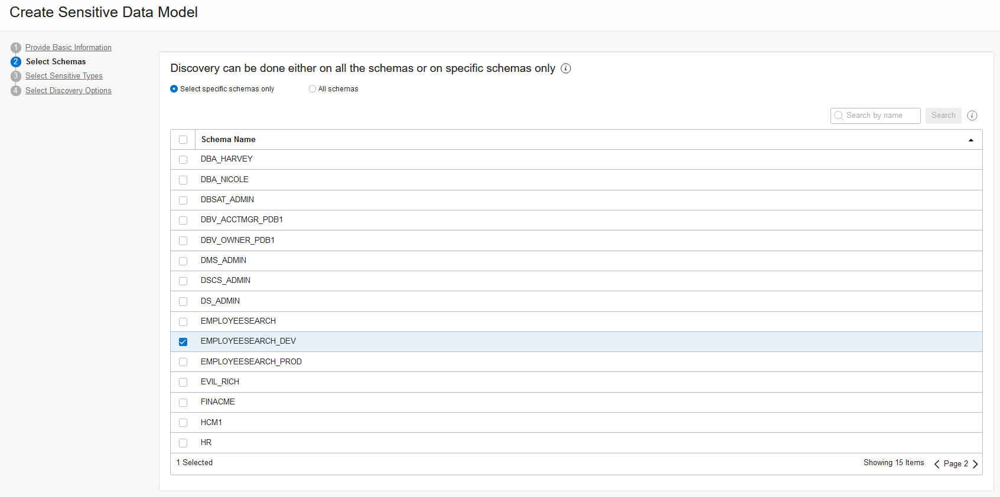

            **Note**: You may need to click the right arrow button at the bottom of the page to navigate to page 2

        - Then click [**Next**]

    - For **Select Sensitive Types**
    
        - Expand all of the sensitive categories by moving the **Expand All** slider to the right
        - Scroll down the page and review the sensitive types
        - At the top of the page, select the **All** check box
        
            

            **Note**: Notice that you can select individual sensitive types, sensitive categories, and all sensitive types

        - Then click [**Next**]

    - In the **Select Discovery Options** section
    
        - Select **Collect, display and store sample data**

            

        - Then click [**Create Sensitive Data Model**] at the bottom of the page to begin the data discovery process

    - After your sensitive data model is created, review its information on the **Sensitive Data Model Details** page

        - The **Sensitive Data Model Information** tab lists information about your sensitive data model, including its name and Oracle Cloud identifier (OCID), the compartment to which you saved it, the date and time when it was created and last updated, the target database associated with it, and totals for sensitive schemas, sensitive tables, sensitive columns, sensitive types, and sensitive values. You can click the **View Details** link to view the work request information. The pie chart compares the number of sensitive values per sensitive category and sensitive type. If the total values are not displayed, please refresh the browser tab

            

        - The **Sensitive Columns** table lists the sensitive columns retrieved by the data discovery job. By default, the table is displayed in **Flat View** format. For each sensitive column, you can view its schema name, table name, column name, sensitive type, parent column, data type, estimated row count, and sample data (if you retrieved sample data and if it exists). Review the sample data to get an idea of what it looks like.

            

    - Position your mouse over the **Identification Information** category in the chart to view its value

        

        **Note**: Your percentage value may be different than the value shown in the screenshot

    - With your mouse still over **Identification Information**, click the pie slice to drill down
    
        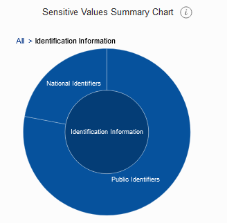

        **Note**: Notice that the **Identification Information** category is now divided into two smaller categories (**National Identifiers** and **Public Identifiers**)

    - To drill-up, click the **All** link in the chart's breadcrumb

        

    - From the drop-down list, select **Sensitive Type View** to sort the sensitive columns by sensitive type
    
        

        **Note**: By default, all items are expanded in the view and you can collapse the items by moving the Expand All slider to the left

    - Still from the drop-down list, select now **Schema View** to sort the sensitive columns by table name

        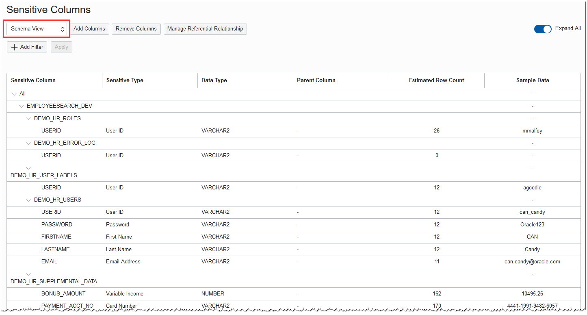

    - Identify the sensitive columns that are discovered because they have a relationship to another sensitive column and that relationship is defined in the database's data dictionary
    
        

        **Note**: For example, `USERID` in the `DEMO_HR_SUPPLEMENATL_DATA` table has a relationship to `USERIDID` in the `DEMO_HR_EMPLOYEES` table (as shown under Parent Column)

3. Create a PDF of the Sensitive Data Model report

    - Let's generate the report
    
        - At the top of the page, click [**Generate Report**]

            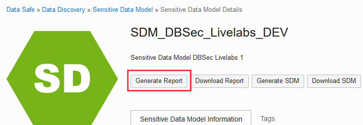

        - A **Generate Report** dialog box is displayed, then leave PDF selected

            

        - Click [**Generate Report**], and wait for the report to be 100% generated

            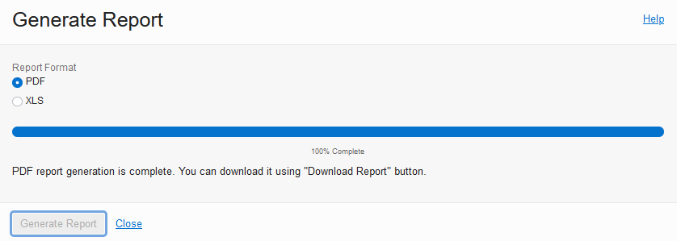

        - Click Close

    - Now, download the report
    
        - At the top of the page, click [**Download Report**]

            

        - A Download Report dialog box is displayed, then leave PDF selected and click Download Report

            
        
        - Save the report to your local computer

    - Open the PDF report to view it

        

        **Note**:
        - The **Summary** table shows totals for columns and values scanned, sensitive types, sensitive tables, sensitive columns, and sensitive values
        - The **Sensitive Columns** table lists the sensitive columns in the sensitive data model. For each sensitive column, the table shows you its sensitive type, schema name, table name, column name, sensitive value count, whether the column data was matched (Y or N), whether the column name was matched (Y or N), and whether the column comment was matched (Y or N)

    - Close the PDF report and return to the **Sensitive Data Models Details** page

4. Create a masking policy for your target database

    Data Masking can generate a masking policy for your target database based on your sensitive data model. It automatically tries to select a default masking format for each sensitive column. You can edit these default selections and select different ones as needed. Occasionally you are prompted to address masking formats in your masking policies that are causing issues.

    - In the breadcrumb at the top of the page, click **Data Safe**

        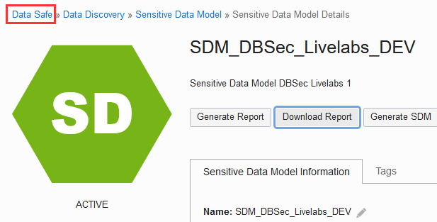

    - On the left under **Data Safe**, click **Security Center**

    - Click **Data Masking**

        
    
    - Under **Related Resources**, click **Masking Policies**
    
        

    - The **Masking Policies** page is displayed and shows that there is no masking policy available for your target database

        

    - Click [**Create Masking Policy**]

        - The Create Masking Policy panel is displayed!
        - Configure the masking policy as follows:
    
            - Name: *`Mask SDM1`*
            - Compartment: Select your compartment
            - Description: *`Masking policy for SDM1`*
            - Choose how you want to create the masking policy: *`Using a sensitive data model`*
            - Sensitive Data Model: *`SDM_DBSec_Livelabs_DEV`*

                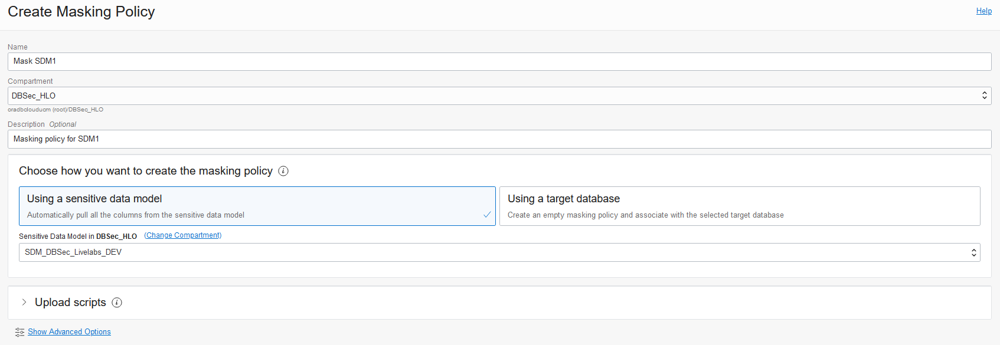

        - Then click [**Create Masking Policy**]

        **Important**:
        - *Please do not close the panel*
        - It closes automatically after all operations are completed
        - If you close the panel before the operations are finished, the operation to add columns to the masking policy is not initiated!

    - Review the masking policy

        
    
        **Note**:
        - On the **Masking Policy Information** tab, you can view the masking policy name (and edit it), the Oracle Cloud Identifier (OCID) for the masking policy, a link to the work request for the masking policy, the compartment in which the masking policy is stored, the target database and sensitive data model to which the masking policy is associated, and the date/time in which the masking policy was created and last updated.
        - The **Masking Columns** table lists all the sensitive columns and their masking formats. If needed, you can select a different masking format for any sensitive column. You can click the pencil icon next to a masking format to edit it.

    - Under **Resources**, click **Masking Columns Needing Attention**

        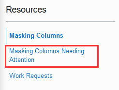

        **Note**:
        - The **Masking Columns Needing Attention** section is displayed at the bottom of the page
        - This section informs you of sensitive columns that do not have a masking format
        - The screenshot below shows an example where there are no sensitive columns without a masking format

            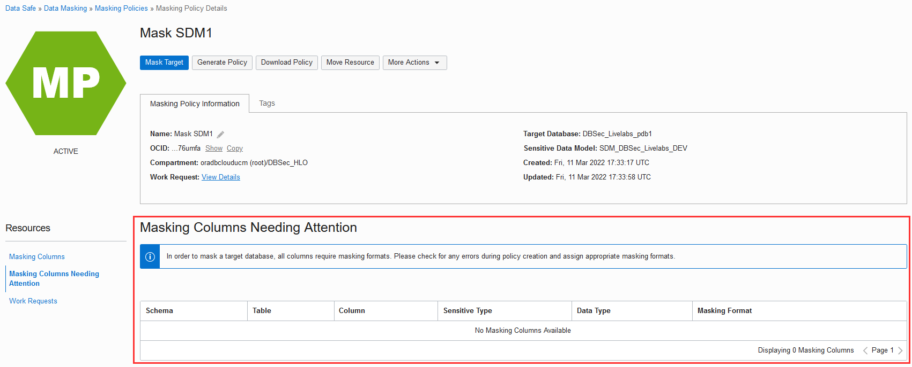
    
    - Now, we don't want mask all the columns, but just few of them (here *`FIRSTNAME`*, *`LASTNAME`*, *`SALARY`* and *`EMAIL`* from *`EMPLOYEESEARCH_DEV.DEMO_HR_EMPLOYEES`* table only)

        - Under **Resources**, click **Masking Columns**

        - Click [**Remove Columns**]

            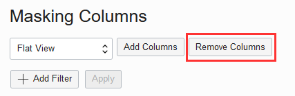

        - From the **Sensitive Type** drop-down list, select *`-- Select --`*, then click [**Search**]

            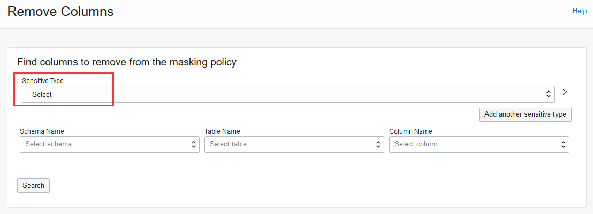

        - Select all the columns and unselect only the columns *`FIRSTNAME`*, *`LASTNAME`*, *`SALARY`* and *`EMAIL`* from *`EMPLOYEESEARCH_DEV.DEMO_HR_EMPLOYEES`* table

            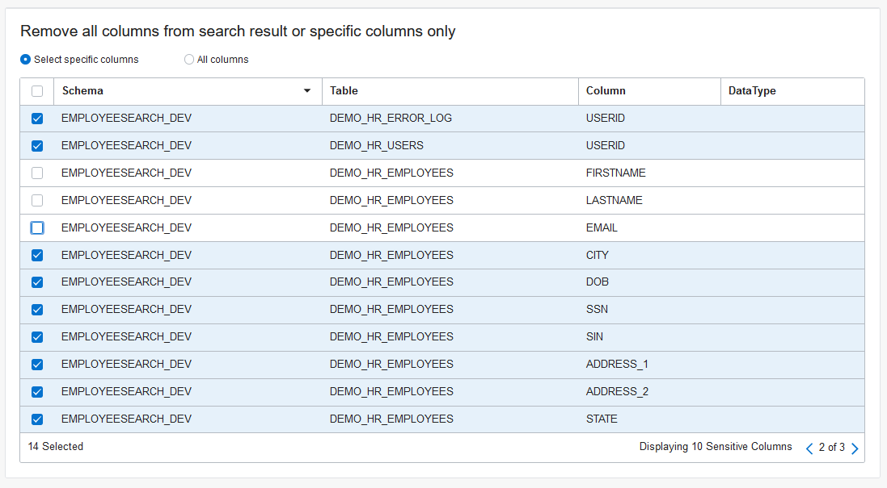
        
        - Then click [**Remove Columns**]
        
        - You should see now only the four columns that you want to mask

            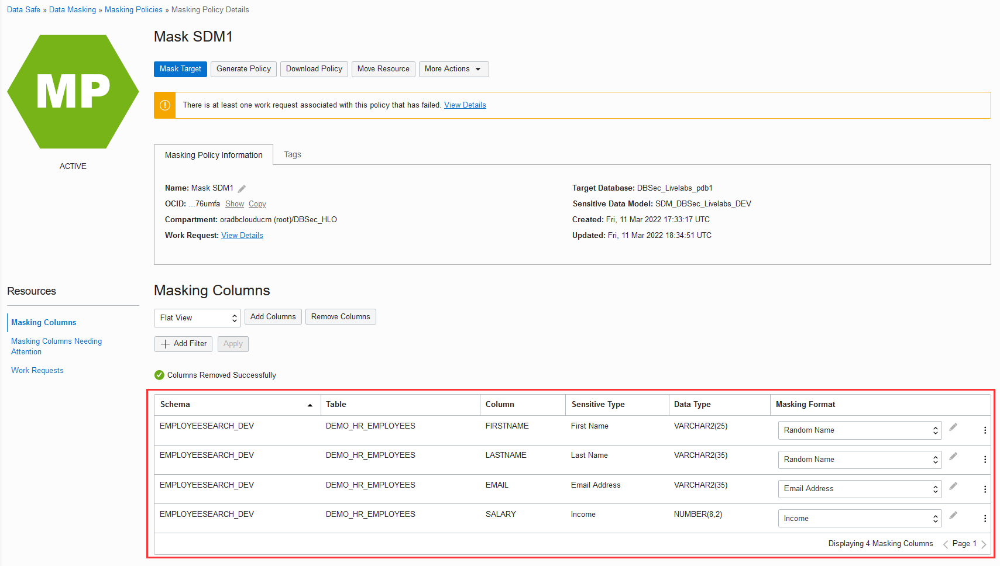

    - Now, let's change a Masking Format

        - Edit the Masking Format for the SALARY column by clicking on the Pencil icon
        
            
        
        - In **Masking Format Entry**, enter *`Null Value`*, then click [**Save**]

            

        - You should see the new Masking Format now

            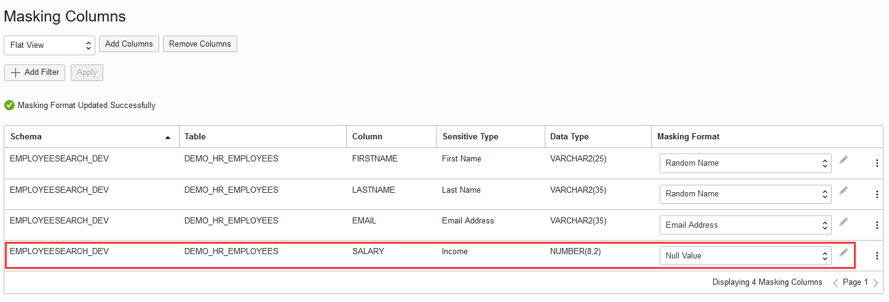

5. Mask sensitive data in your target database by using Data Masking

    After you create a masking policy, you can run a data masking job against your target database from the Masking Policy Details page. You can also run a data masking job from the Data Masking page.

    - On the **Masking Policy Details** page, click [**Mask Target**]

        

        **Note**: The Mask Sensitive Data panel is displayed!

    - From the **Target Database** drop-down list, select your target database, and then click [**Mask Data**]

        

        **Note**: The **Work Request** page is displayed!

    - Monitor the progress of the data masking job in the **Log Messages** table

        

    - Wait for the status to read **SUCCEEDED**

        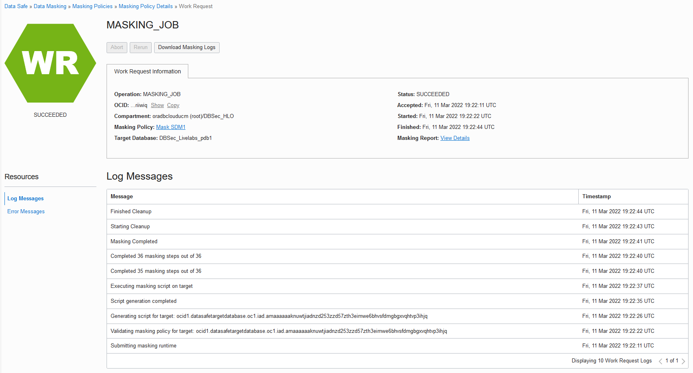

6. View the Data Masking report

    - While on the **Work Request** page, next to **Masking Report** on the **Work Request Information** tab, click View Details.

        

    - Review the masking report

        - The **Masking Report Information** tab shows you the target database name, masking policy name (you can click a link to view it), Oracle Cloud Identifier (OCID) for the masking policy, the date and time when the data masking job started and finished, and the number of masked sensitive types, schemas, tables, columns, and values. There is also a pie chart that shows you the masked value percentages for each sensitive type. You can click on a pie slide to drill down into the chart.

            

        - The Masked Columns table lists each masked sensitive column and its respective schema, table, masking format, sensitive type, parent column, and total number of masked values.

            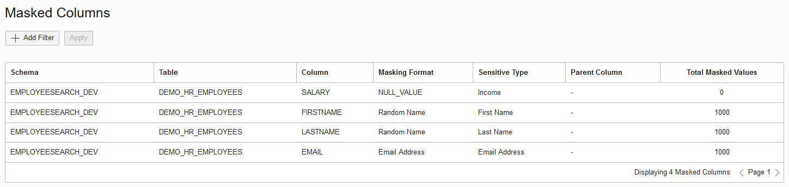

7. Create a PDF of the Data Masking report

    - Let's generate the report
    
        - At the top of the **Masking Report Details** page, click [**Generate Report**]

            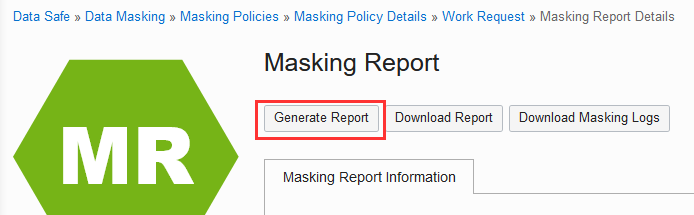

        - A **Generate Report** dialog box is displayed, then leave PDF selected

            

        - Click [**Generate Report**], and wait for the report to be 100% generated

            

        - Click Close

    - Now, download the report
    
        - At the top of the page, click [**Download Report**]

            

        - A Download Report dialog box is displayed, then leave PDF selected and click Download Report

            
        
        - Save the report to your local computer

    - Open the PDF report to view it

        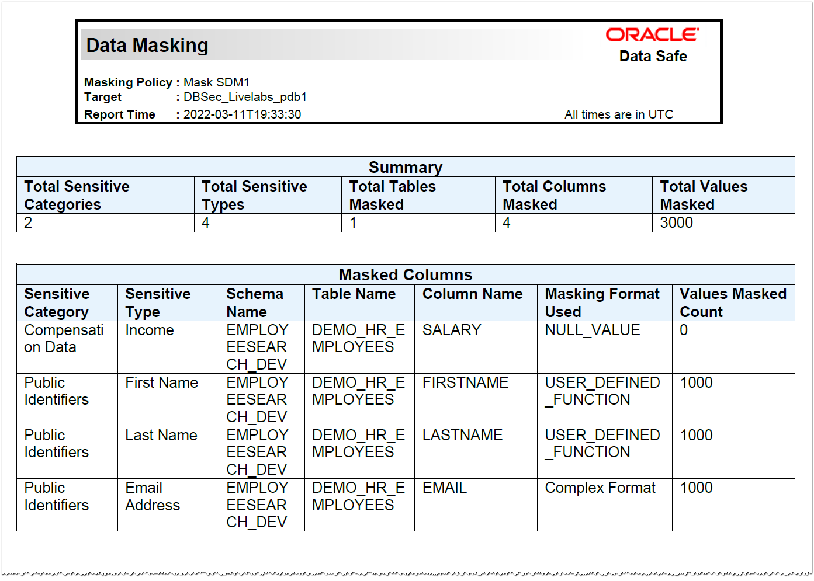

8. Validate the masked data in your target database

    - Go back to your Terminal session on your **DBSec-Lab** VM as OS user *oracle*

    - Rerun the query to compare the sensitive data after masking it

        ````
        <copy>./ds_query_employee_data.sh</copy>
        ````

        ... results in PROD (**original data**)

        

        ... results in DEV (**data masked**)

        

    - Take a moment to compare the original data (in PROD) to the masked data (in DEV) to check that it's different

        **Note**: Only the 4 columns have been masked, SALARY is now null and the 3 other columns have random values

9. Now, you can restore the masked data (DEV) from the orginial values (PROD)

    ````
    <copy>./ds_restore_pdb1_dev.sh</copy>
    ````

    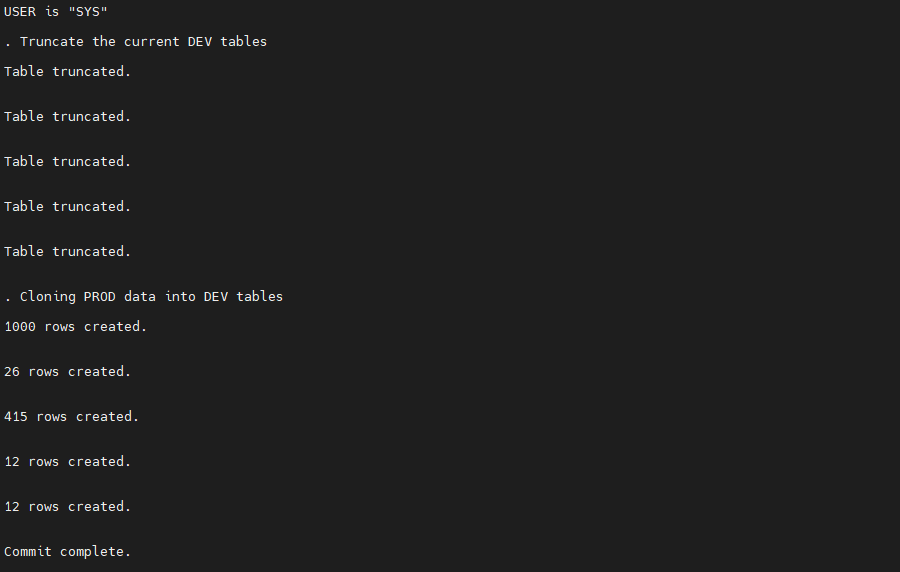


## Task 6: (Optional) Reset Oracle Data Safe configuration

1. From the Data Safe console

    - Deregister the target from Data Safe
        
        - On the Burger menu, click on **Oracle Database**, and then **Data Safe**

        - Click **Target Databases**

            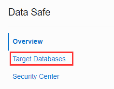

        - Click on the **Target Name** to deregister (here "*`DBSec_Livelabs_pdb1`*")

            

        - From the **More Actions** menu, click **Deregister**

            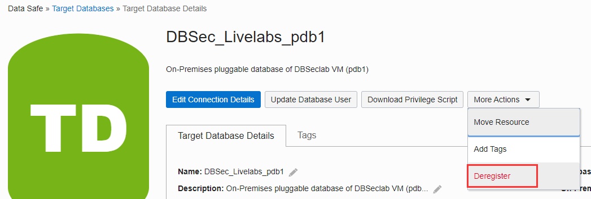

        - Click [**Deregister**] to confirm the deregistration

            
        
        - The target is deregistered when the status is "**DELETED**" 

            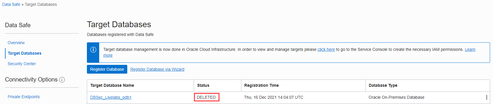

    - Next, delete the On-Premises connector from Data Safe

        - In the "**Connectivity Options** sub-menu, click on "**On-Premises Connectors**" 

            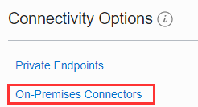

        - Click on your **On-Premises Connector** (here "*`DBSec_Livelabs_DBs`*")

            

        - Click [**Delete**]

            

        - Click [**Delete**] to confirm the deletion

            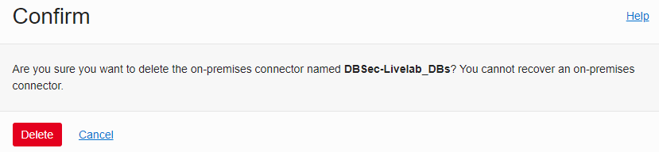
        
        - The On-Premises Connector should now have disappeared from the list!

2. Go back to your Terminal session on your **DBSec-Lab** VM as OS user *oracle*

    - Delete the On-Premises connector from Database server

        ````
        <copy>
        python $DS_HOME/setup.py stop
        rm -Rf $DS_HOME/*
        </copy>
        ````

        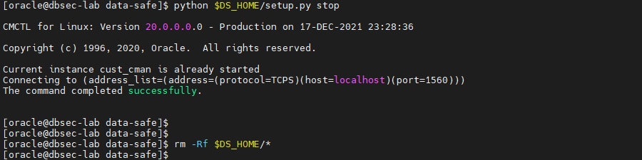

    - Drop the Data Safe **DS_ADMIN** user on `pdb1`

        ````
        <copy>
        cd $DBSEC_LABS/data-safe
        ./ds_drop_user.sh pdb1
        </copy>
        ````

        

3. **Now your Data Safe configuration is correctly reset!**

You may now proceed to the next lab!

## **Appendix**: About the Product
### **Overview**

Oracle Data Safe is Oracle’s platform for securing data in databases. As a native Oracle Cloud Infrastructure service, Oracle Data Safe lets you assess the security of your database configurations, find your sensitive data, mask that data in non-production environments, discover the risks associated with database users, and monitor database activity.


### **Benefits of Using Oracle Data Safe**
XXXXXX

## Want to Learn More?
Technical Documentation:
- [Oracle Data Safe website](https://www.oracle.com/database/technologies/security/data-safe.html)
- [Oracle Data Safe documentation on Oracle Cloud Infrastructure](https://docs.oracle.com/en-us/iaas/data-safe/index.html)
- [Oracle Data Safe videos](https://docs.oracle.com/en/cloud/paas/data-safe/videos.html)
- [Oracle Data Safe data sheet](https://www.oracle.com/a/tech/docs/dbsec/data-safe/ds-security-data-safe.pdf)
- [Oracle Data Safe frequently asked questions](https://www.oracle.com/a/tech/docs/dbsec/data-safe/faq-security-data-safe.pdf)

Video:
- *Oracle Data Safe Update (May 2020)* [](youtube:SXJl-Ab_zIo)
- *Keeping your Data Safe - on-premises! (April 2021)* [](youtube:xq2gf2Gn63o)
- *Information Lifecycle Management in Data Safe (April 2021)* [](youtube:rPzumDNWBZs)
- *Advanced Data Masking scenarios in Data Safe (May 2021)* [](youtube:6h1dLzLS2p8)
- *Update on Data Safe target registration (July 2021)* [](youtube:5eMnM9mEcN0)
- *Oracle Data Safe Assessment: New features, new user interface (October 2021)* [](youtube:LzDLNUdn3hg)

## Acknowledgements
- **Author** - Hakim Loumi, Database Security PM
- **Contributors** - Bettina Schaeumer, Rene Fontcha
- **Last Updated By/Date** - Hakim Loumi, Database Security PM - May 2022
