# Advanced Lab - Install Node.js in Compute Instance and Deploy the Application

## Introduction

In the earlier lab, we generated the ssh keys needed for the compute instance used for the node.js application to provide cryptographic signing of the user data outside the database.

In this lab, we will install Node.js in the compute instance, Then to prepare for data signing you will generate a private/public key pair and a PKI certificate in compute instance, which will include your public key. Afterwards you will store the certificate in your Oracle Autonomous Transaction Processing database instance, and save the certificate GUID it returns. Finally, deploy the application and sign a row in the database from cloud shell.

Estimated Time: 25 minutes

Watch the video below for a quick walk through of the lab.

[](youtube:2QHI3kH8H0o)

### Objectives

In this lab, you will:

- Provision a Oracle Linux compute instance and SSH into the instance
- Generate Certificate and Store Certificate in the Database
- Install Node.js in the compute instance
- Open Firewall for Ports
- Download and deploy the application
- Sign a row and verify all the rows in the blockchain table

### Prerequisites

This workshop assumes you have:

* LiveLabs Cloud Account
* Successfully completed the previous labs

## Task 1: Provision a Compute Instance

1. In the Oracle Cloud console, click on navigation menu, search for **Compute** and select **Instances** under Compute.

    

2. Make sure you are in the same region and compartment as the Oracle Autonomous Database instance and click on **Create Instance**.

    

3. Give a name to the instance. In this lab, we use the Name - **DEMOVM**.

    

4. In Placement, Image and shape, choose the following:
    - **Availability Domain** - For this lab, leave the default instance Placement to Always Free Eligible or you can click on **Edit** and choose an Availability Domain (AD).
    - **Image and shape** - For this lab, leave the default - Always Free Eligible resource or you can click on **Edit** to change the image and shape.

    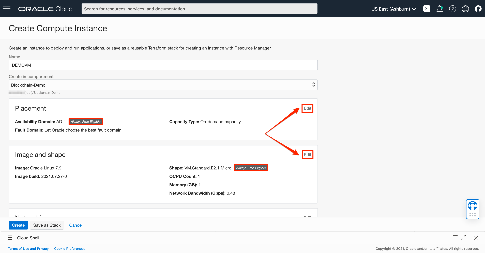

5. In Add SSH keys, choose **Paste public keys** and paste the public key noted in the earlier lab and click **Create**.

    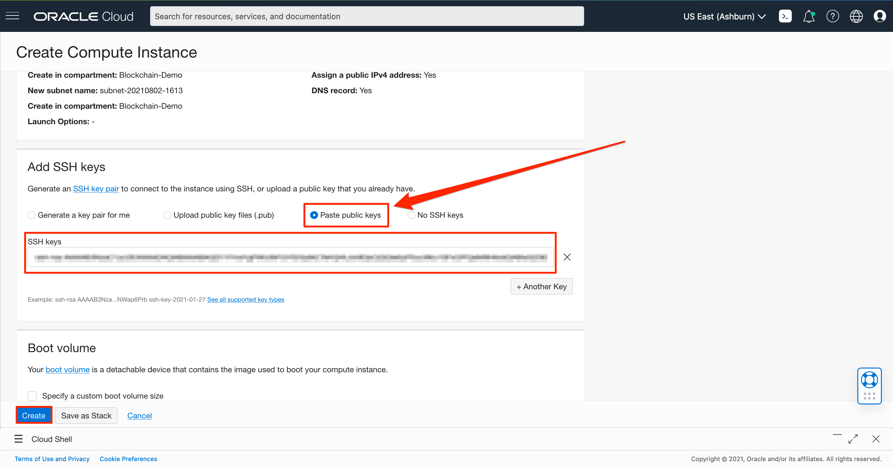

6. Your instance will begin provisioning. In a few minutes, the state will turn from Provisioning to Running. At this point, your compute instance is ready to use! Have a look at your instance's details and copy the **Public IP Address** to use later.

    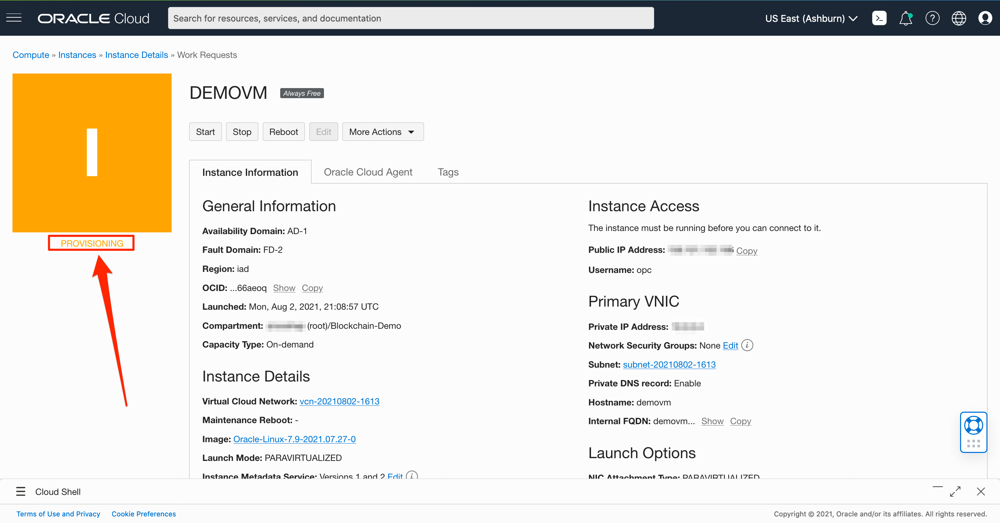
    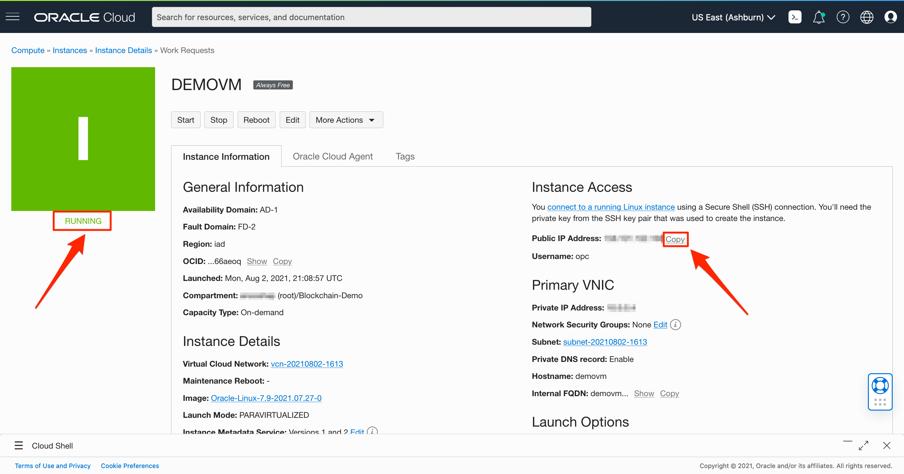

## Task 2: Connect to your Compute instance
<if type="freetier">
There are multiple ways to connect to your cloud instance. Choose the way to connect to your cloud instance that matches the SSH Key you generated.  *(i.e If you created your SSH Keys in cloud shell, choose cloud shell)*

- Oracle Cloud Shell
- MAC or Windows CYGWIN Emulator
- Windows Using Putty

### Oracle Cloud Shell
</if>
1. If you are logged out of cloud shell or to re-start the Oracle Cloud shell, click cloud shell icon to the right of the region in cloud console. *Note: Make sure you are in the region you were assigned*

    

2.  In the command  below, replace "sshkeyname" with your actual ssh key name from Lab 1 and replace "Your Compute Instance Public IP Address" with the one you copied in Task 1 of this lab. Enter the edited command to login to your instance.

    ````
    ssh -i ~/.ssh/<sshkeyname> opc@<Your Compute Instance Public IP Address>
    ````

    *Note: The angle brackets <> should not appear in your command.*

    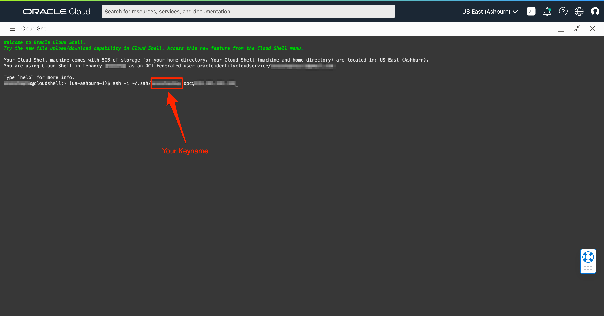

3.  When prompted, answer **yes** to continue connecting.

    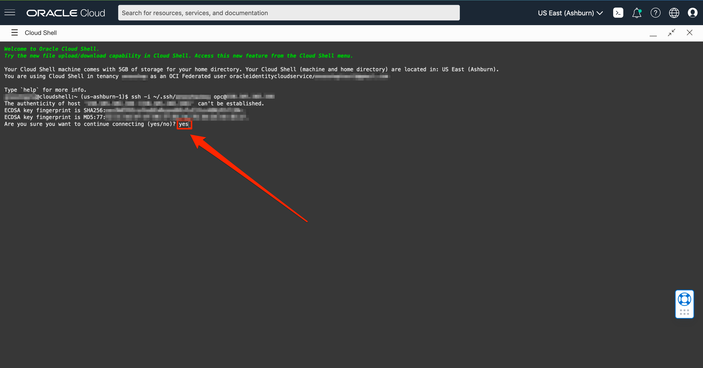
<if type="freetier">
4.  Proceed to the next task on the left hand menu.

### MAC or Windows CYGWIN Emulator
1.  Go to **Compute**, click **Instance** and select the instance you created (make sure you choose the correct compartment)
2.  On the instance homepage, find the Public IP address for your instance.

3.  Open up a terminal (MAC) or cygwin emulator as the opc user.  Enter yes when prompted.

    ````
    ssh -i ~/.ssh/<sshkeyname> opc@<Your Compute Instance Public IP Address>
    ````
    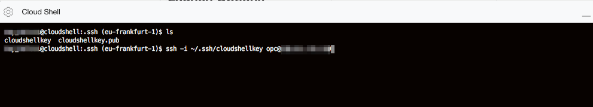

    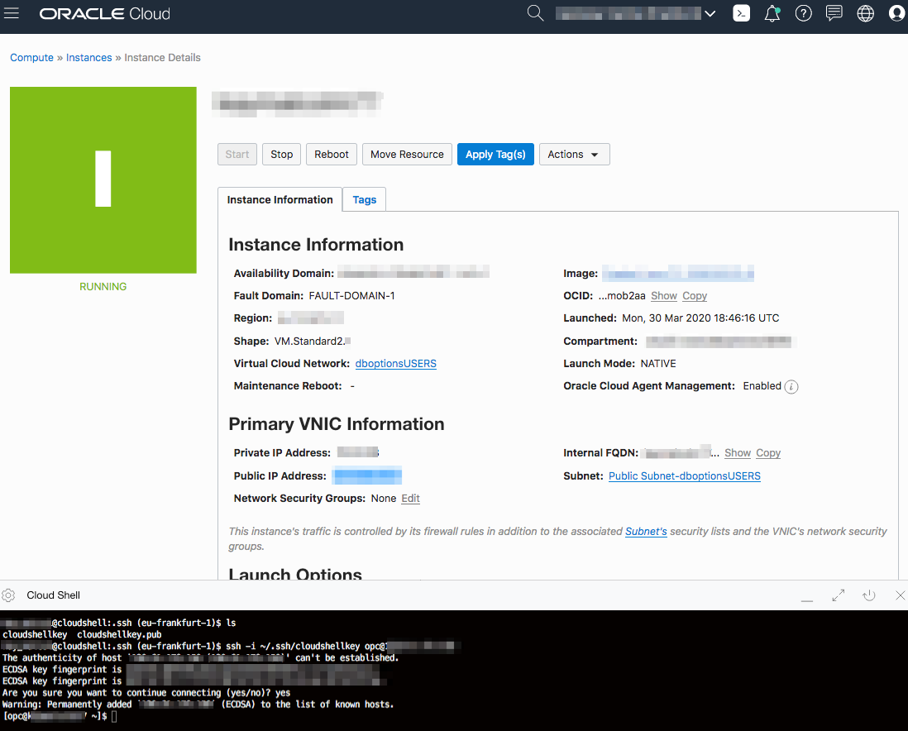

    *Note: The angle brackets <> should not appear in your command.*

4.  After successfully logging in, proceed to next task.

### Windows using Putty

1.  Open up putty and create a new connection.

    ````
    ssh -i ~/.ssh/<sshkeyname> opc@<Your Compute Instance Public IP Address>
    ````
    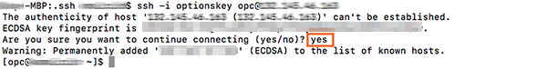

    *Note: The angle brackets <> should not appear in your command.*

2.  Enter a name for the session and click **Save**.

    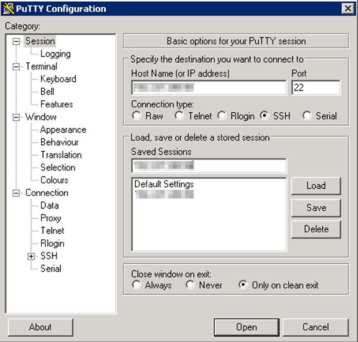

3. Click **Connection** then **Data** in the left navigation pane and set the Auto-login username to root.

4. Click **Connection** then **SSH** then **Auth** in the left navigation pane and configure the SSH private key to use by clicking Browse under Private key file for authentication.

5. Navigate to the location where you saved your SSH private key file, select the file, and click Open.  NOTE: You cannot connect while on VPN or in the Oracle office on clear-corporate (choose clear-internet).

    

6. The file path for the SSH private key file now displays in the Private key file for authentication field.

7. Click Session in the left navigation pane, then click Save in the Load, save or delete a stored session STEP.

8. Click Open to begin your session with the instance.
</if>
Congratulations!  You now have a fully functional Linux instance running on Oracle Cloud Compute.

## Task 3: Generate Certificate

Let's generate your x509 key pair. We are generating the key pair and an X509 certificate that will be used for data signing later.

1. Now that we have connected to the compute instance in Oracle cloud shell using SSH, let's download the nodejs.zip file.

    ```
    <copy>
	cd ~
    wget https://objectstorage.us-ashburn-1.oraclecloud.com/p/VEKec7t0mGwBkJX92Jn0nMptuXIlEpJ5XJA-A6C9PymRgY2LhKbjWqHeB5rVBbaV/n/c4u04/b/livelabsfiles/o/data-management-library-files/blockchain/nodejs.zip
    </copy>
    ```

    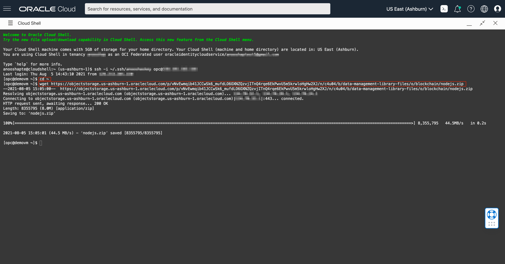

2.  Unzip the nodejs file.

	```
	<copy>
	unzip nodejs.zip
	</copy>
	```
	

3.  Navigate to nodejs folder.

    ```
    <copy>
    cd nodejs
    </copy>
    ```

	

4. Run the command to generate your x509 key pair - *user01.key*, *user01.pem* in the nodejs folder.

	When prompted, give the details for each parameter and press enter - Country Name, State, Locality Name, Organization name, Common name, Email address

	```
	<copy>
	openssl req -x509 -sha256 -nodes -newkey rsa:4096 -keyout user01.key -days 730 -out user01.pem
	</copy>
	```

	

5.	List the files and notice that your *user01.key*, *user01.pem* key pair is created.

	```
	<copy>ls</copy>
	```

	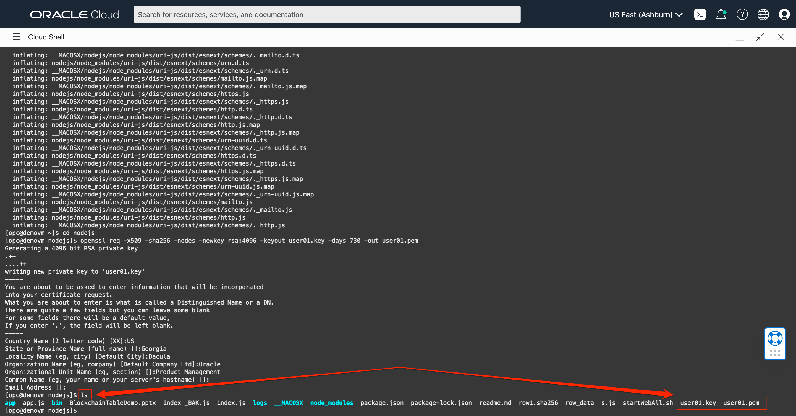

6. `cat` the *user01.pem* key.

	```
	<copy>cat user01.pem</copy>
	```

	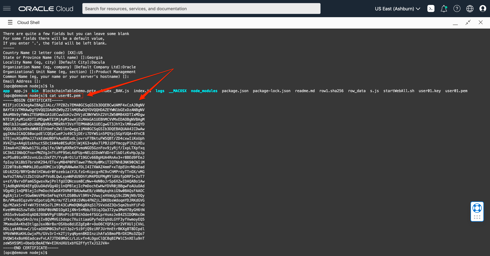

## Task 4: Store Certificate in the Database

1. Navigate to the tab with SQL Developer Web in your browser, copy and paste the below procedure in SQL Worksheet. Do not run the procedure yet.

	```
	<copy>
	set serveroutput on
	DECLARE
		amount NUMBER := 32767;
		cert_guid RAW(16);
		cert clob := '-----BEGIN CERTIFICATE----MIIFcjCCA1oCCQC+Rsk9wAYlzDANBgkqhkiG9w0BAQsFADB7MQswCQYDVQQGEwJV
		………
		-----END CERTIFICATE-----';
	BEGIN

  		DBMS_USER_CERTS.ADD_CERTIFICATE(
      		utl_raw.cast_to_raw(cert), cert_guid);
  		DBMS_OUTPUT.PUT_LINE('Certificate GUID = ' || cert_guid);
	END;
	/
	</copy>
	```

    From the Oracle cloud shell in the previous tab, copy the pem key and replace "-----BEGIN CERTIFICATE----MIIFcjCCA1oCCQC+Rsk9wAYlzDAN………-----END CERTIFICATE-----" with the pem key copied in the SQL Developer Web worksheet. Make sure the pem key is within the apostrophes and run the procedure.

	Your procedure should look like this

	```
	set serveroutput on
	DECLARE
		amount NUMBER := 32767;
		cert_guid RAW(16);
		cert clob := '-----BEGIN CERTIFICATE-----
	MIIFlTCCA32gAwIBAgIJAPyKGld/4jwSMA0GCSqGSIb3DQEBCwUAMGExCzAJBgNV
	BAYTAlVTMQswCQYDVQQIDAJOSjELMAkGA1UEBwwCTEExCzAJBgNVBAoMAlRBMQsw
	CQYDVQQLDAJQQTELMAkGA1UEAwwCSEExETAPBgkqhkiG9w0BCQEWAkFKMB4XDTIx
	MDcxNDAxNTcwM1oXDTIzMDcxNDAxNTcwM1owYTELMAkGA1UEBhMCVVMxCzAJBgNV
	BAgMAk5KMQswCQYDVQQHDAJMQTELMAkGA1UECgwCVEExCzAJBgNVBAsMAlBBMQsw
	CQYDVQQDDAJIQTERMA8GCSqGSIb3DQEJARYCQUowggIiMA0GCSqGSIb3DQEBAQUA
	A4ICDwAwggIKAoICAQDAlBMNqLDDprxCCFACf2v3oKaFmes1uSc0WfFPfblNDn7K
	kvvNYIAkcAxCsv6fvt/xg1ixpDEokwFMm9mf2L8uYZiqx7TnwOsWOABRrkMpnlQ5
	bVIiFnukb2hxrnehrM/PEkhCxTTXFkDHneNQVkrekYuETpLXK3t06+1eQCGRugZ4
	q0vcpAES3eNoSf3YS9aXqzcF8zp/qe71QFqdI0CoCUCJ5LN/7sCL+5hzZ80kiC9p
	1N7AR+LpYURSnFnYSeIk8pSCKx3u2oxRAmrhF+VrLGFUsM4D9uW+pTHQz4PN+VUs
	ylQati7pH9HRZ7NoGiBJWdRsUkRpS6ylwXzNCl1HmHWU7NbR5IPCuBbrKUfIK9iy
	mcUQECAHGV+M8hN2obE/MZFdySDpPt37Y7Z/B89GA7As6hUVpX7jUtl4oQhWDVCu
	6Ah40RvrAVmMI7knhv78+ZFrOlBTyVLxFxazNAzpSmAGQtKmdb68YJetBEB96eto
	hn4c9HCoUApQDT2AR98qWyQMd9gXQadsd0GmR2RgKtplaRdqVMZBaec1/59reyWT
	qfohfKpBJbXMLGD1pmkAFwtUiHHXm8NBBgjQNN92U3URVKEy6FEXyvzP2agnIvH4
	QvzDWPRzyoY2vzn3b7rWX3Srvk3EHCI1+ryYmfJsSKXrrvnDJja+2tpxL9IrxwID
	AQABo1AwTjAdBgNVHQ4EFgQUCKHo9yn9x3hp8hrl2HauGEzxJYQwHwYDVR0jBBgw
	FoAUCKHo9yn9x3hp8hrl2HauGEzxJYQwDAYDVR0TBAUwAwEB/zANBgkqhkiG9w0B
	AQsFAAOCAgEAfK7+UjY9XKvY1GpTMBi57SHc6QWhVZRhdtvd1ak4vBgwrqqmkV3U
	Uv7IGbG0uqGG1s00I3I8RJbQl5ebTUhdxtuo1XQUQ4Uz9InoUikVSsTWwylaS05d
	0YwL6i/D6A66Z9oMPxosDHkJLHL6DfyDq2SH4GCzynXx/G2B2uu3Id7jCOYbH4RZ
	Fm7ftpvsiIelJO99s7r2yLI3eyAMiKCYhRLJ3308/f8TMKs7Pd8xuNzVjxY1lugC
	u944OinKAgAiHRutwpmEyXgKacRiq8W3NA3dpCudTiRiqpIBaSBvPLyS1oIWP0O+
	FAl+ak/9UI5K0DD8OOU4Y4pxIbS/NvlHcxG3Sxt1wsunxwV4ujEo1dHRoC9Op8Pk
	SCpr8hf48AG1PYdufUA8kTvRdd9La6p1fL+nWJ+QuzDFDj0SG92WxQUC6gMRLzlA
	A7HPcDOG+04AduvMPfpcpkFOtnlJz1Ln1gDUsq0WHIrlfq7whawcJhgS9V9mHOen
	iw1H2yizZi8/d3y2WK4xJr1m7frIlEkXoemVXAJMwQLh14rdFU/kzcViZm7eQj/p
	PPEpEcdKfSgRraSNKjT3UdyGXTImRJat/XvjMHWokZPd4Zry7NS5hCqOhZgtUGjr
	P5ztpVj2DIAxPrrH8JOpUwvGsXOtCxoa0INzkWwckS9WImkJFy2QGfA=
	-----END CERTIFICATE-----';
	BEGIN
		DBMS_USER_CERTS.ADD_CERTIFICATE(
			utl_raw.cast_to_raw(cert), cert_guid);
		DBMS_OUTPUT.PUT_LINE('Certificate GUID = ' || cert_guid);
	END;
	/
	```

	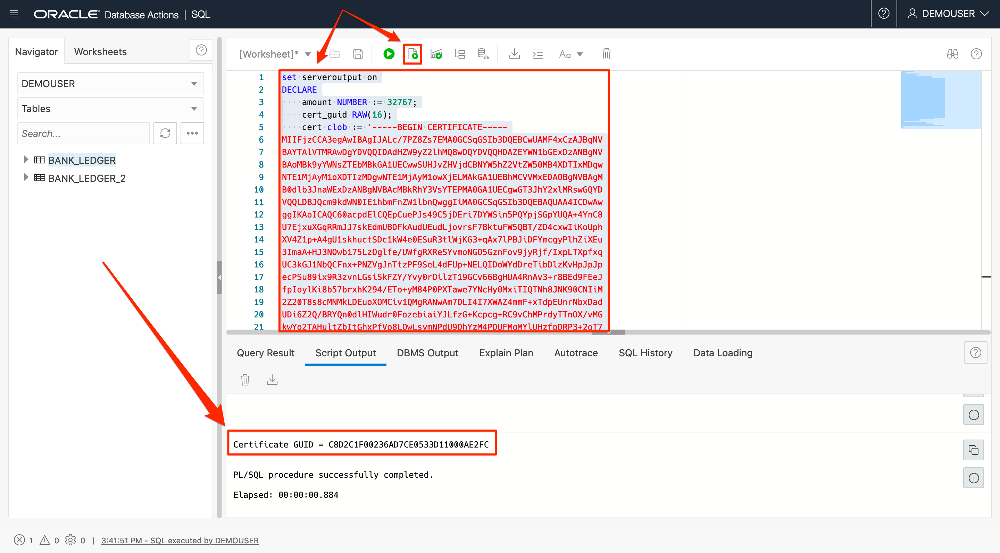

2. Copy the value of Certificate GUID. It will not be displayed again.

	> **Note:** Do not run the procedure again to generate another Certificate GUID.

	This output looks like this:

	```
	Certificate GUID = C8D2C1F00236AD7CE0533D11000AE2FC
	```

3. Run this command to show your certificate.

	```
	<copy>
	SELECT * FROM USER_CERTIFICATES;
	</copy>
	```
	

## Task 5: Install Node.js in the Compute Instance

Now, let's see how to install Node.js in the compute instance for the Node.js application to interact with the Oracle Autonomous database rest end points.

1. Navigate back to the tab with Oracle Cloud console. If you are logged out of cloud shell, click on cloud shell icon at the top right of the page to start the Oracle Cloud shell and SSH into the instance using this command. Else, you can proceed to the step.

    ```
    <copy>
    ssh -i ~/.ssh/<sshkeyname> opc@<Your Compute Instance Public IP Address>
    </copy>
    ```

    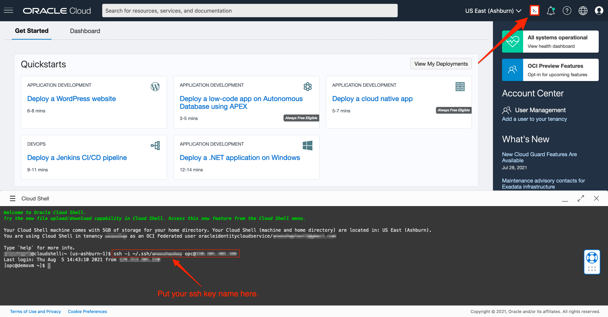

2.  To install Node.js we need to have oracle-release-el7 repo added to the virtual machine via sudo. This will take about a minute and will say "Complete!" when finished.

    ```
    <copy>
    sudo yum install -y oracle-nodejs-release-el7 oracle-release-el7
    </copy>
    ```
    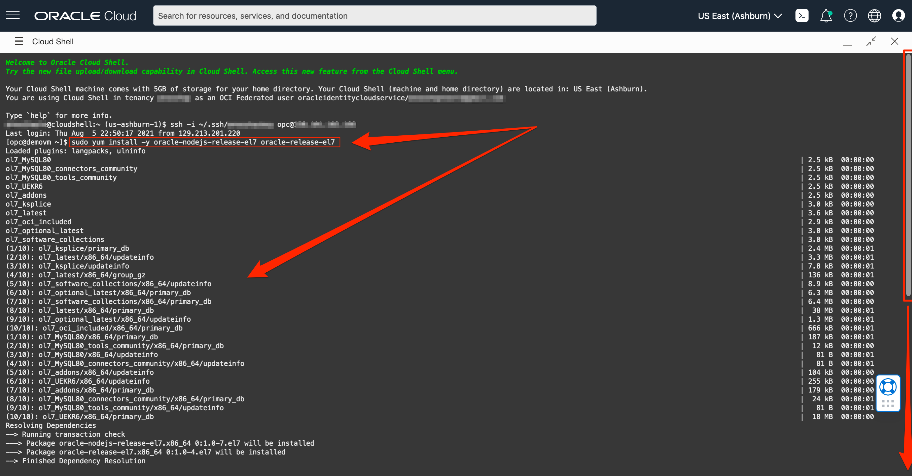

3. Run this command to install Node.js to set up the run time environment. Type `y` when prompted. After installing, it will print "Complete!".

    ```
    <copy>
    sudo yum install nodejs
    </copy>
    ```
    

## Task 6: Open Firewall for Ports

To connect to the Oracle Autonomous Database instance from the virtual machine we need to open firewall ports. Oracle linux compute instance internal firewall do not have any port enabled by default. We need to enable a port.

1. Run this sudo command to permanently add port 8080 under the public zone.

    ```
    <copy>
    sudo firewall-cmd --permanent --zone=public --add-port=8080-8080/tcp
    </copy>
    ```
    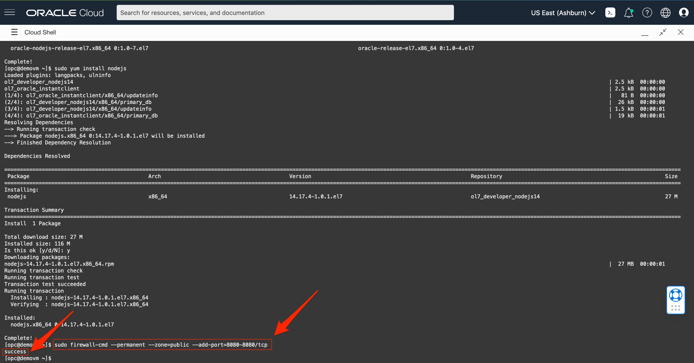

2.  Reload the firewall to make sure if the port is added.

    ```
    <copy>
    sudo firewall-cmd --reload
    </copy>
    ```
    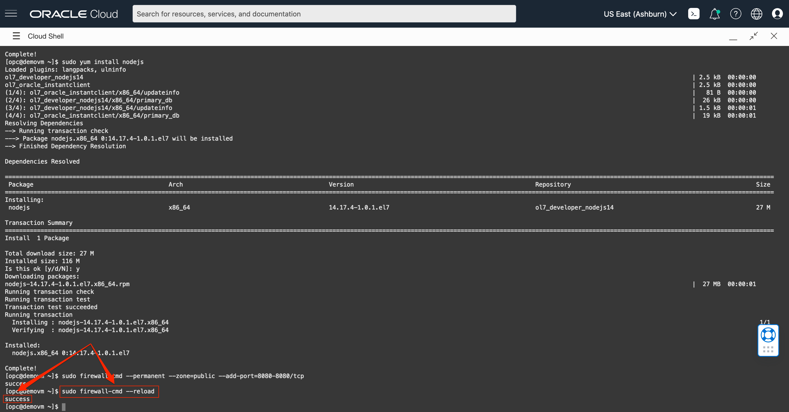

3.  List all the ports to see that port 8080 is available. If it displays 8080/tcp means that the virtual machine firewall that comes by default with Oracle linux has enabled the 8080 port on TCP protocol.

    ```
    <copy>
    sudo firewall-cmd --permanent --zone=public --list-ports
    </copy>
    ```
    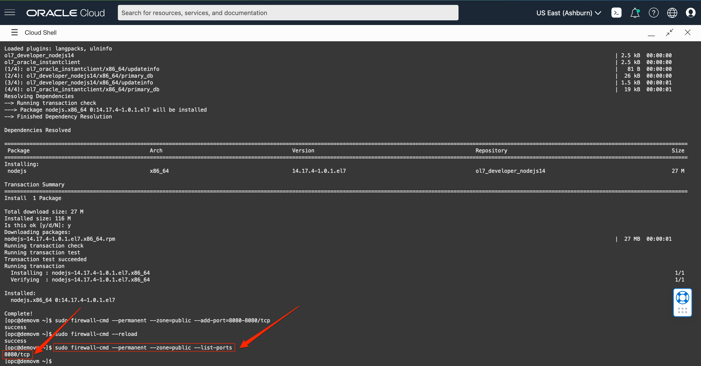

## Task 7: Deploy the Application

In the Oracle Linux virtual machine, since we have the Node.js installed and the ports are enabled, let's download and deploy the application.

1.  Navigate to nodejs folder.

    ```
    <copy>
    cd nodejs
    </copy>
    ```
    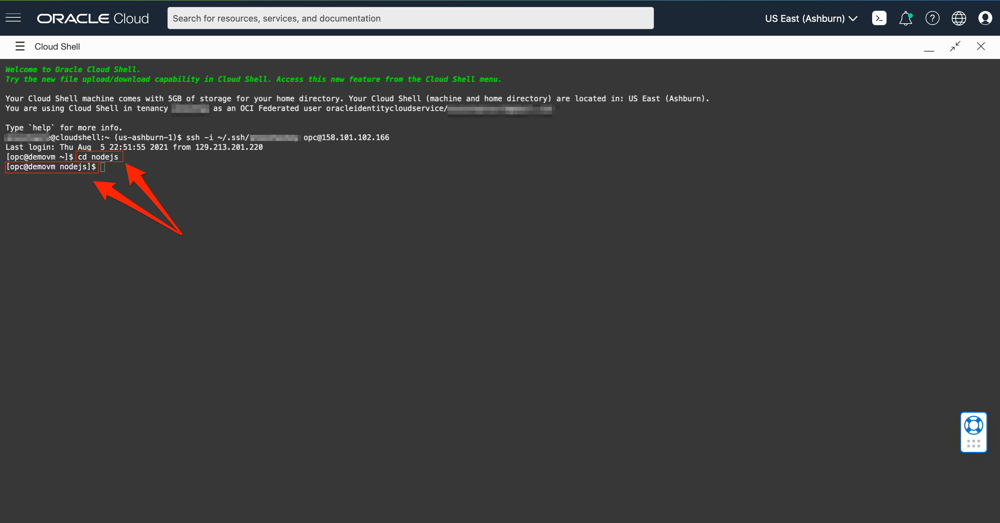

2.  Now, let's modify the index.js file with your Oracle Autonomous Transaction Processing database instance URL and Certificate GUID. Copy and paste the below command in notepad, replace `<paste your atp url>` in the command below with your Oracle Autonomous Transaction Processing database URL and press `Enter`.

    ```
    sed -i 's,atp-url,<paste your atp url>,g' index.js
    ```

    Your command should look like this:

    ```
    sed -i 's,atp-url,https://fw8mxn5ftposwuj-demoatp.adb.us-ashburn-1.oraclecloudapps.com,g' index.js
    ```

3.  Copy and paste the modified command in cloud shell and press `Enter`. This command searches for the string `atp-url` in the index.js file and replaces with your Oracle Autonomous Transaction Processing database URL.

    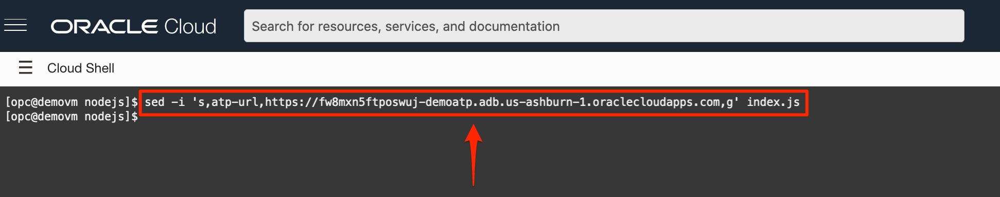

4.  Copy and paste the below command in notepad, replace `<paste your certificate guid>` in the command below with your Certificate GUID noted earlier.

    ```
    sed -i 's,cert-guid,<paste your certificate guid>,g' index.js
    ```

    Your command should look like this:

    ```
    sed -i 's,cert-guid,C8D2C1F00236AD7CE0533D11000AE2FC,g' index.js
    ```

5. Copy and paste the modified command in cloud shell and press `Enter`. This command searches for the string `cert-guid` in the index.js file and replaces with your Certificate GUID.

    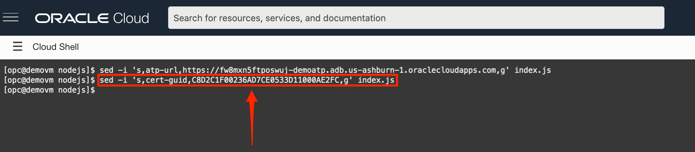

6. Duplicate the current tab in the browser.

    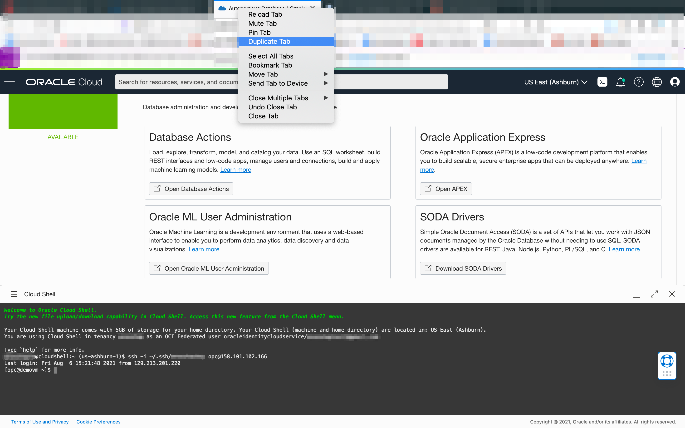

7. Let's reconnect into the compute instance. Click on cloud shell icon at the top right of the page to start the Oracle Cloud shell and SSH into the instance using the command.

    ````
    ssh -i ~/.ssh/<sshkeyname> opc@<Your Compute Instance Public IP Address>
    ````

    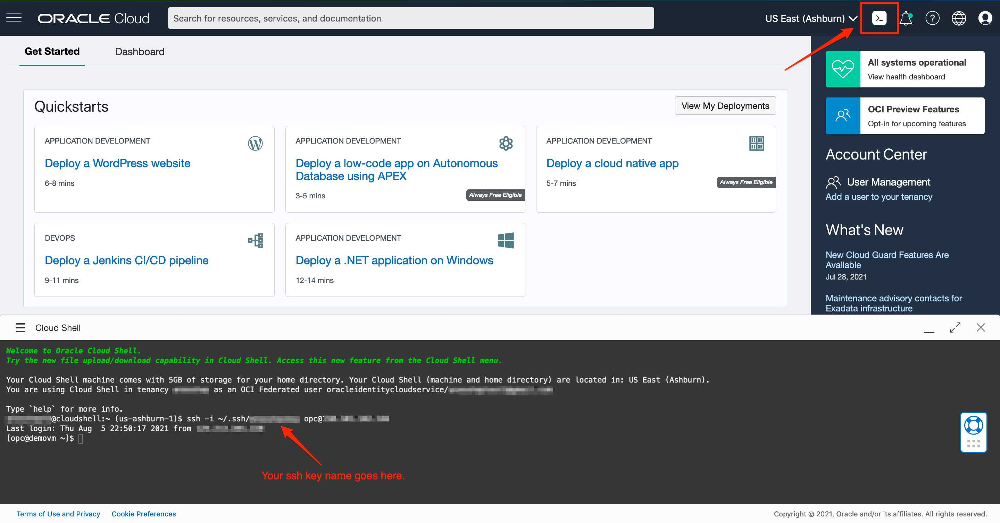

8.  Navigate to the nodejs folder and run the command to deploy the application. Once we run the `node bin/www` command the Node.js application will be running and will be listening on port 8080.

    ```
    <copy>
    cd nodejs
    node bin/www
    </copy>
    ```

    If the cursor is idle this means the nodejs application is running.

    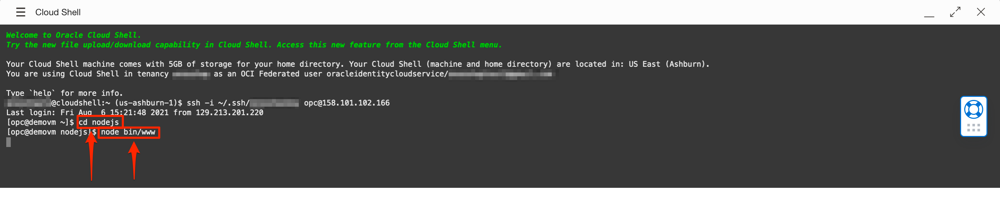

## Task 8: Sign the Row

Let's use the curl command to send a REST request to the node.js application we’ve just started. This will cause the application to:

- Retrieve the content of the row using DBMS\_BLOCKCHAIN\_TABLE.GET\_BYTES\_FOR\_ROW_SIGNATURE procedures
- Invoke openssl command to generate a signature using your private key
- Add the signature to the row using DBMS\_BLOCKCHAIN\_TABLE.SIGN_ROW procedure, at which point the database will use your certificate GUID to retrieve the certificate, extract the public key, and verify that the signature generated using your private key in the node.js application is valid based on the data present in the row and the public key in your X.509 certificate

If the signature and data are verified with the public key, the signature field is stored in the table and the application returns status 200 and a success message. If this fails, it returns error status 400.

1. Navigate back to the previous cloud shell window that does not have the Node.js application running.

    If you are logged out of cloud shell, click on cloud shell icon at the top right of the page to start the Oracle Cloud shell, SSH into the instance and navigate to nodejs folder. Else, you can proceed to the step.

    ```
    <copy>
    ssh -i ~/.ssh/<sshkeyname> opc@<Your Compute Instance Public IP Address>
    cd nodejs
    </copy>
    ```

    

2. Replace the number 1 for the instanceId, chainId and seqId and update with your noted instanceId, chainId and seqId values in the below command and press enter.

    ```
    curl --location --request POST 'http://localhost:8080/transactions/row' --header 'Content-Type: application/json' --data '{"instanceId":1,"chainId":1,"seqId":1}'
    ```

    After replacing the instanceId, chainId and seqId values in the command, it should look like this:

    ```
    curl --location --request POST 'http://localhost:8080/transactions/row' --header 'Content-Type: application/json' --data '{"instanceId":1,"chainId":5,"seqId":1}'
    ```

3. Notice JSON message with status 200 and message displayed is `Signature has been added to the row successfully` which means that the row how has been signed successfully.

    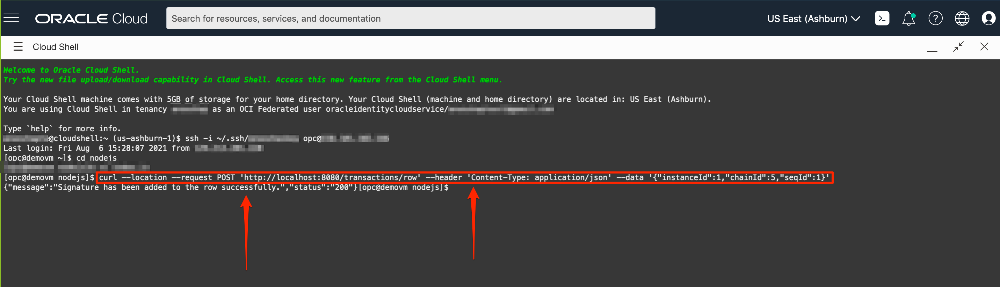

4. To verify, navigate back to the tab with Blockchain APEX application with the List of Transactions and refresh the tab. Notice that the row with the values Instance ID - , Chain ID - and Seq ID - `IS Signed` column should display a green tick from which indicates that the row is signed successfully.

    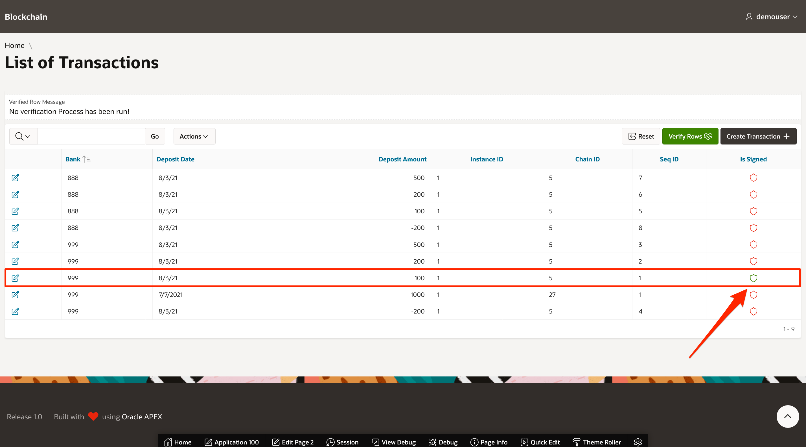

5. Navigate back to SQL Developer Web and query all the columns in the `bank_ledger` table to view the actual values in the signature and GUID columns.

    Scroll to the output to the right and notice values in the orabctab_signature$, _signature_alg$, and _signature_cert$ columns.

	```
	<copy>
	select bank, deposit_date, deposit_amount, ORABCTAB_INST_ID$,
	ORABCTAB_CHAIN_ID$, ORABCTAB_SEQ_NUM$,
	ORABCTAB_CREATION_TIME$, ORABCTAB_USER_NUMBER$,
	ORABCTAB_HASH$, ORABCTAB_SIGNATURE$, ORABCTAB_SIGNATURE_ALG$,
	ORABCTAB_SIGNATURE_CERT$ from bank_ledger;
	</copy>
	```

	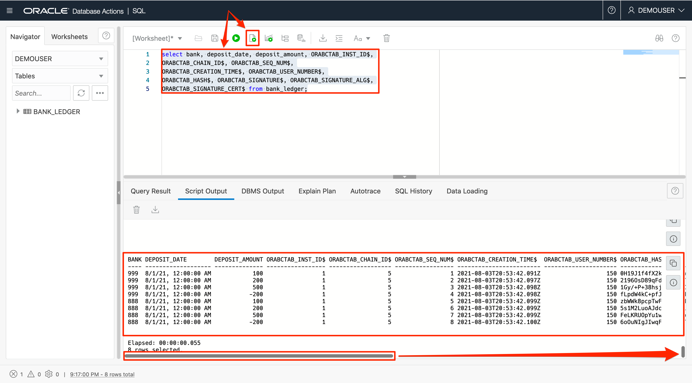

## Task 9: Verify Rows with Signature

1. In the SQL worksheet, copy ane paste the below procedure to verify the rows in blockchain table using DBMS\_BLOCKCHAIN\_TABLE.VERIFY_ROWS.

	> *Note: It is expected that every blockchain table will have different instance Id values. Please do not be concerned if you do not see the same values in the output as in the screenshot. If the PL/SQL procedure is completed successfully, the blockchain table is verified successfully.*

	```
	<copy>
	DECLARE
		verify_rows NUMBER;
		instance_id NUMBER;
	BEGIN
		FOR instance_id IN 1 .. 4 LOOP
			DBMS_BLOCKCHAIN_TABLE.VERIFY_ROWS('DEMOUSER','BANK_LEDGER',
	NULL, NULL, instance_id, NULL, verify_rows);
		DBMS_OUTPUT.PUT_LINE('Number of rows verified in instance Id '||
	instance_id || ' = '|| verify_rows);
		END LOOP;
	END;
	/
	</copy>
	```

	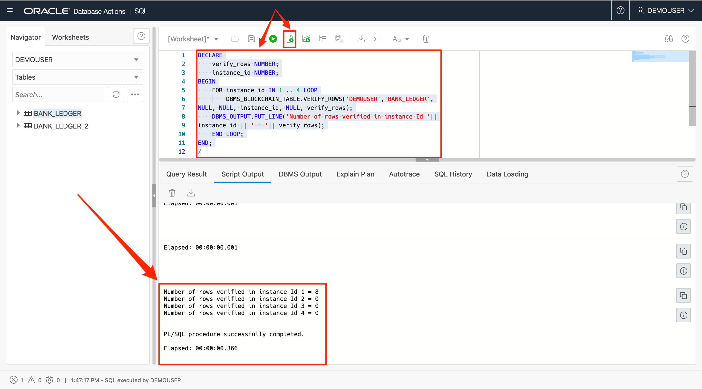

## Acknowledgements

* **Author** - Mark Rakhmilevich, Anoosha Pilli
* **Contributors** - Anoosha Pilli, Salim Hlayel, Brianna Ambler, Product Manager, Oracle Database
* **Last Updated By/Date** - Marion Smith, April 2022

