# Manage Blockchain Tables and Generate Certificate GUID

## Introduction

Blockchain tables are insert-only tables that organize rows into a number of chains. Updating existing rows is not allowed. Deleting rows is either prohibited or restricted based on retention time. Rows in a blockchain table are made tamper-resistant by chaining each inserted row to the previous row in the chain using a cryptographic hash. Users can verify that rows have not been deleted or tampered. Blockchain tables address data protection challenges faced by enterprises and governments by focusing on protecting data from criminals, hackers, and fraud. Blockchain tables provide enhanced data security by preventing unauthorized modification or deletion of data that records important actions, assets, entities, and documents. Unauthorized modification of important records can result in loss of assets, loss of business, and possible legal issues. Use blockchain tables when immutability of data is critical for your applications and you need to maintain a tamper-resistant ledger of current and historical transactions.

For enhanced fraud protection, an optional user signature can be added to a row. If you sign a blockchain table row, a digital certificate must be used. While verifying the chains in a blockchain table, the database needs the certificate to verify the row signature.

Blockchain tables can be used to implement blockchain applications where the participants are different database users who trust Oracle Database to maintain a verifiable, tamper-resistant blockchain of transactions. All participants must have privileges to insert data into the blockchain table. The contents of the blockchain are defined and managed by the application. By leveraging a trusted provider with verifiable crypto-secure data management practices, such applications can avoid the distributed consensus requirements. This provides most of the protection of the distributed peer-to-peer blockchains, but with much higher throughput and lower transaction latency compared to peer-to-peer blockchains using distributed consensus. Blockchain tables can be used along with (regular) tables in transactions and queries. Database users can continue to use the same tools and practices that they would use for other database application development. Please see Oracle Database 19c or 21c documentation for more information about Blockchain Tables.

This lab walks you through the steps to create a Blockchain table, insert data, manage the rows in the table, manage the blockchain table and verify the rows in a blockchain table without signature.

Estimated Time: 15 minutes

Watch the video below for a quick walk through of the lab.

[](youtube:ZEyDWdQVMhQ)

### Objectives

In this lab, you will:

* Create the Blockchain table and insert rows into the blockchain table
* View Blockchain tables and its internal columns
* Manage blockchain tables and rows in a blockchain table
* Verify the rows in a blockchain table without signature

### Prerequisites

* LiveLabs Cloud Account
* Have successfully completed the previous labs

## Task 1: Create a Blockchain Table

1. The `CREATE BLOCKCHAIN TABLE` statement requires additional attributes. The `NO DROP`, `NO DELETE`, `HASHING USING`, and `VERSION` clauses are mandatory. “NO DELETE LOCKED” means that no rows can be deleted and LOCKED means that this setting can not be changed using ALTER TABLE later.

    Copy and paste the query in SQL Developer Web worksheet and run the query to create a Blockchain table named `bank_ledger` that will maintain a tamper-resistant ledger of current and historical transactions using the SHA2_512 hashing algorithm. Rows of the `bank_ledger` blockchain table can never be deleted. Moreover the blockchain table can be dropped only after 16 days of inactivity.

	```
	<copy>
	CREATE BLOCKCHAIN TABLE bank_ledger (bank VARCHAR2(128), deposit_date DATE, deposit_amount NUMBER)
	NO DROP UNTIL 16 DAYS IDLE
	NO DELETE LOCKED
	HASHING USING "SHA2_512" VERSION "v1";
	</copy>
	```

	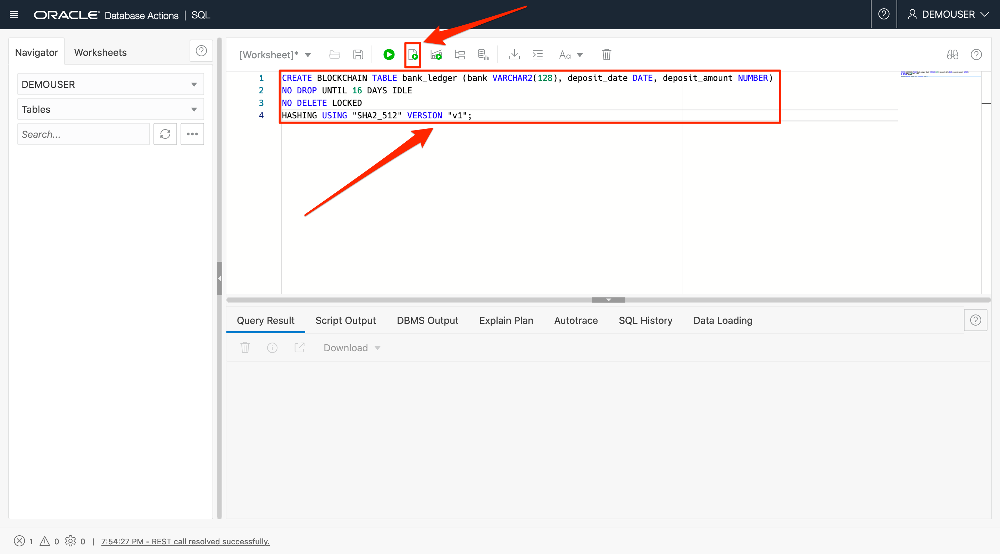

2. Click on the Refresh button in the Navigator tab to view that the table is created.

	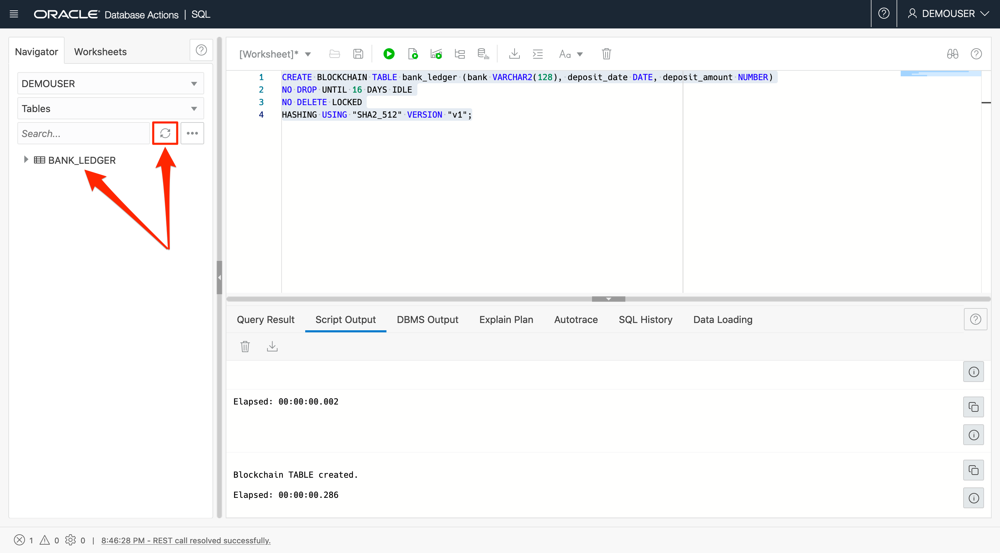

3. Run the query to describe the `bank_ledger` blockchain table to view the columns. Note that the description displays only the visible columns.

	```
	<copy>
	DESC bank_ledger;
	</copy>
	```

	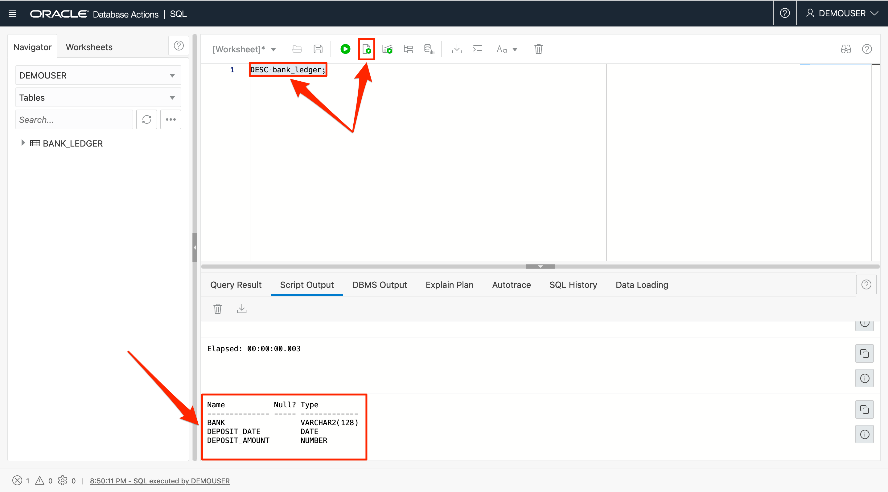

## Task 2: Insert Rows into the Blockchain Table

1. Copy and paste the below code snippet in the worksheet and run them to insert records into the `bank_ledger` blockchain table.

	```
	<copy>
	INSERT INTO bank_ledger VALUES ('999',to_date(sysdate,'dd-mm-yyyy'),100);
	INSERT INTO bank_ledger VALUES ('999',to_date(sysdate,'dd-mm-yyyy'),200);
	INSERT INTO bank_ledger VALUES ('999',to_date(sysdate,'dd-mm-yyyy'),500);
	INSERT INTO bank_ledger VALUES ('999',to_date(sysdate,'dd-mm-yyyy'),-200);
	INSERT INTO bank_ledger VALUES ('888',to_date(sysdate,'dd-mm-yyyy'),100);
	INSERT INTO bank_ledger VALUES ('888',to_date(sysdate,'dd-mm-yyyy'),200);
	INSERT INTO bank_ledger VALUES ('888',to_date(sysdate,'dd-mm-yyyy'),500);
	INSERT INTO bank_ledger VALUES ('888',to_date(sysdate,'dd-mm-yyyy'),-200);
	commit;
	</copy>
	```

	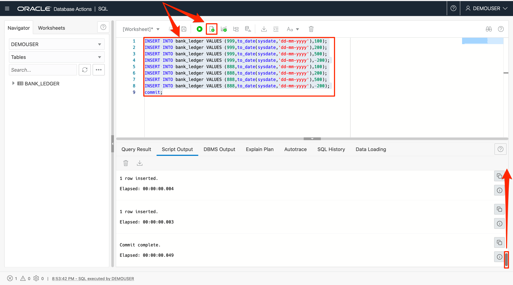

2. Query the `bank_ledger` blockchain table to show the records.

	```
	<copy>
	select * from bank_ledger;
	</copy>
	```

	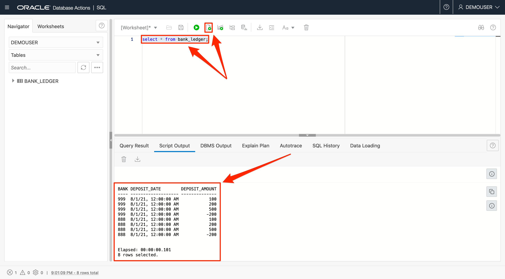

## Task 3: View Blockchain Tables and Its Internal Columns

1. Run the command to view all the blockchain tables.

	```
	<copy>
	select * from user_blockchain_tables;
	</copy>
	```

	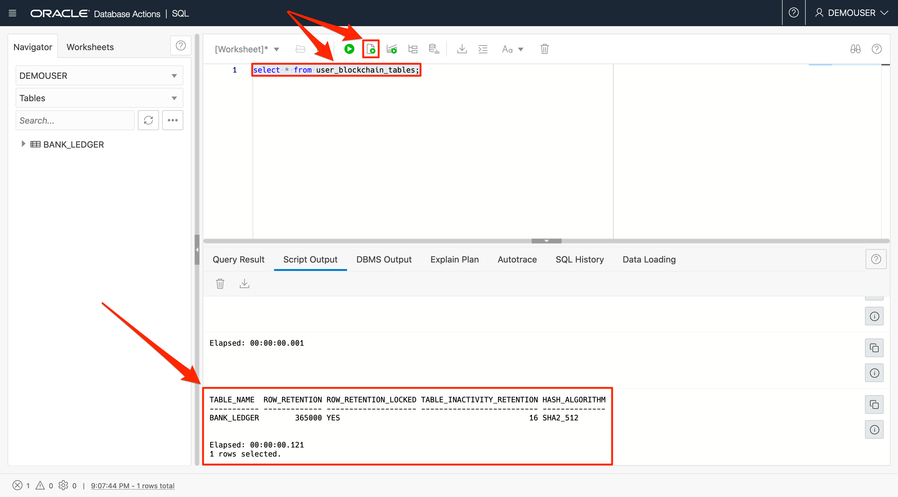

2. Use the `USER_TAB_COLS` view to display all internal column names used to store internal information like the users number, the users signature.

	```
	<copy>
	SELECT table_name, internal_column_id "Col ID", SUBSTR(column_name,1,30) "Column Name", SUBSTR(data_type,1,30) "Data Type", data_length "Data Length"
	FROM user_tab_cols
	ORDER BY internal_column_id;
	</copy>
	```

	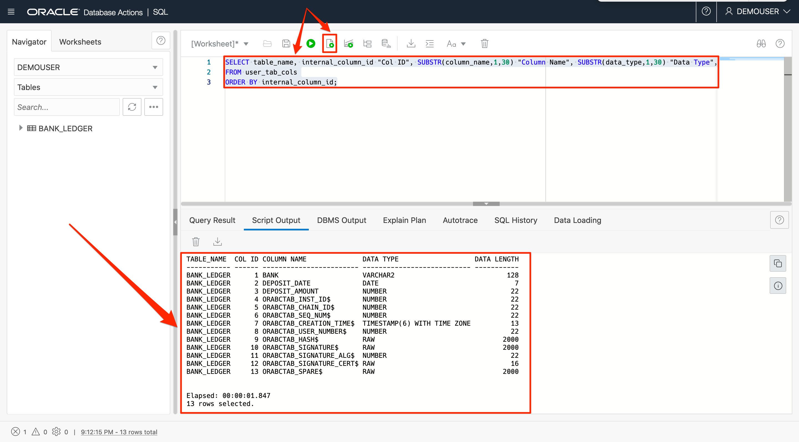

	The additional columns ending with $ are Oracle managed to maintain the chained sequence, cryptographic hash values, and support user signing. You can include these columns in your queries by referencing them explicitly.

3. Query the `bank_ledger` blockchain table to display all the values in the blockchain table including values of internal columns.

	```
	<copy>
	select bank, deposit_date, deposit_amount, ORABCTAB_INST_ID$,
	ORABCTAB_CHAIN_ID$, ORABCTAB_SEQ_NUM$,
	ORABCTAB_CREATION_TIME$, ORABCTAB_USER_NUMBER$,
	ORABCTAB_HASH$, ORABCTAB_SIGNATURE$, ORABCTAB_SIGNATURE_ALG$,
	ORABCTAB_SIGNATURE_CERT$ from bank_ledger;
	</copy>
	```

	

## Task 4: Manage Rows in a Blockchain Table

When you try to manage the rows using update, delete, truncate you get the error `operation not allowed on the blockchain table` if the rows are within the retention period.

1. Update a record in the `bank_ledger` blockchain table by setting deposit\_amount=0.

	```
	<copy>
	update bank_ledger set deposit_amount=0 where bank=999;
	</copy>
	```

	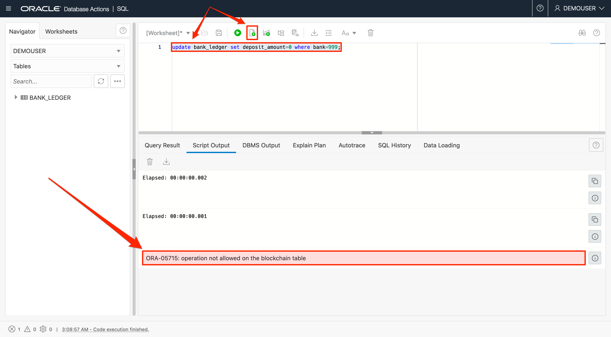

2. Delete a record in the `bank_ledger` blockchain table.

	```
	<copy>
	delete from bank_ledger where bank=999;
	</copy>
	```

	


3. Truncating the table `bank_ledger`.

	```
	<copy>
	truncate table bank_ledger;
	</copy>
	```

	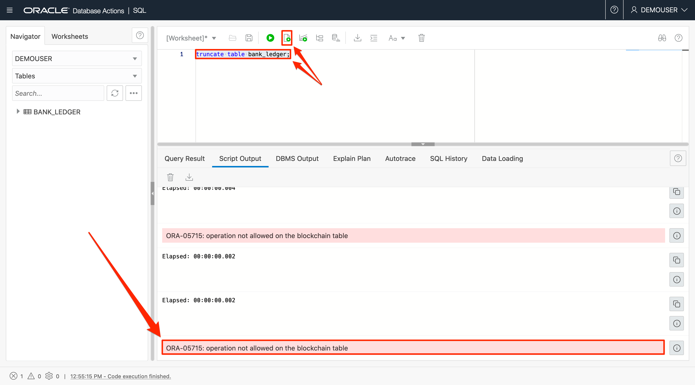

## Task 5: Manage Blockchain Tables

Similar to managing rows within the retention period, managing the blockchain table using alter, drop will throw an error.

1. Drop the table `bank_ledger`. It will drop successfully if no row exists in the table.

	```
	<copy>
	drop table bank_ledger;
	</copy>
	```

	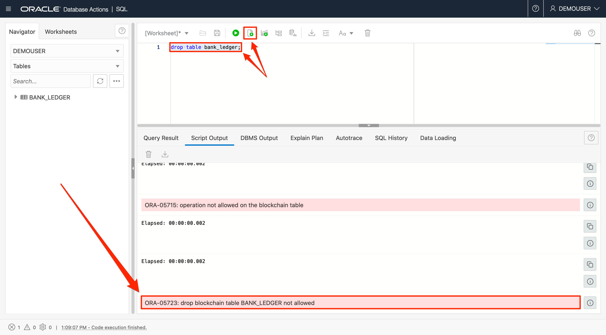


2. Alter the table `bank_ledger` to not delete the rows until 20 days after insert. Copy and paste the below query in the worksheet, highlight the query and then execute the query.

	```
	<copy>
	ALTER TABLE bank_ledger NO DELETE UNTIL 20 DAYS AFTER INSERT;
	</copy>
	```

	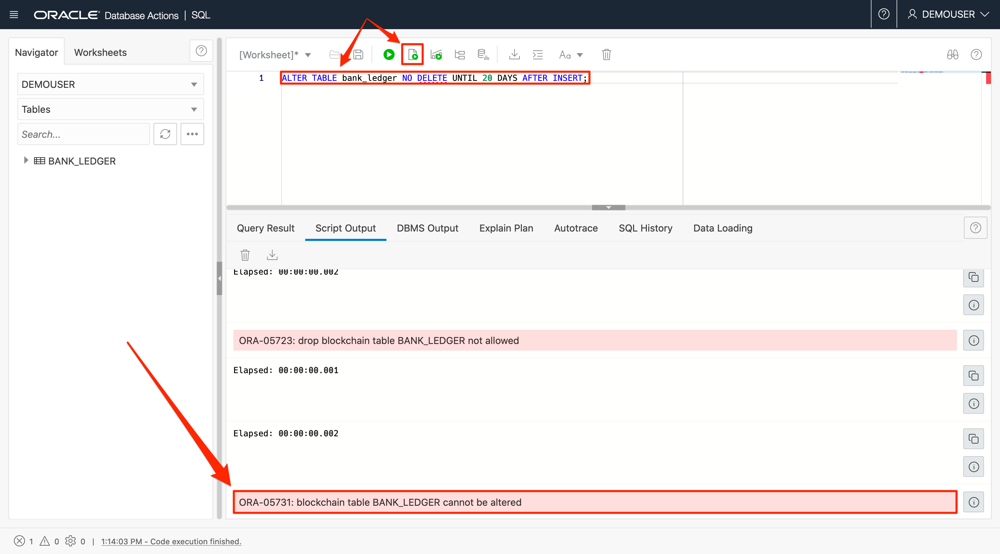

3. Create another table `bank_ledger_2`. Click the refresh button to view the new table.

	```
	<copy>
	CREATE BLOCKCHAIN TABLE bank_ledger_2 (bank VARCHAR2(128), deposit_date DATE, deposit_amount NUMBER)
	NO DROP UNTIL 16 DAYS IDLE
	NO DELETE UNTIL 16 DAYS AFTER INSERT
	HASHING USING "SHA2_512" VERSION "v1";
	</copy>
	```

	

4. ALTER can be used to increase the retention period but not to reduce it. For example, Alter with NO DELETE UNTIL 10 Days After Insert will fail with the error message - “ORA-05732: retention value cannot be lowered”.

	Alter the table `bank_ledger_2` by specifying that the rows cannot be deleted until 20 days after they were inserted. Copy and paste the below query in the worksheet, highlight the query and then execute the query.

	```
	<copy>
	ALTER TABLE bank_ledger_2 NO DELETE UNTIL 20 DAYS AFTER INSERT;
	</copy>
	```

	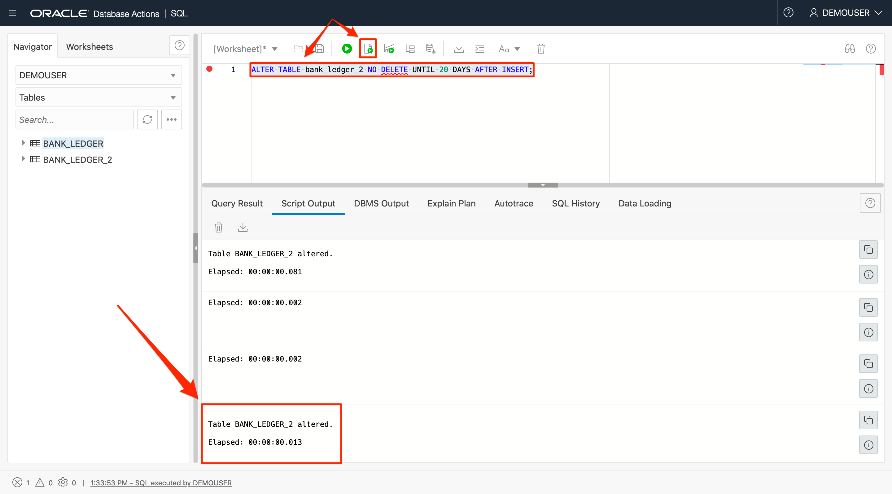

5. Run the command to view all the blockchain tables.

	```
	<copy>
	select * from user_blockchain_tables;
	</copy>
	```

	

## Task 6: Verify Rows Without Signature

You can verify the integrity of blockchain tables by verifying that the chain integrity has not been compromised. Oracle provides DBMS_BLOCKCHAIN\_TABLE.VERIFY\_ROWS procedure, which verifies all rows on all applicable chains for integrity of HASH column value and optionally the SIGNATURE column value for rows created in the range of low\_timestamp to high\_timestamp. An appropriate exception is thrown if the integrity of chains is compromised.

1. Verify the rows in blockchain table using DBMS\_BLOCKCHAIN\_TABLE.VERIFY_ROWS.

	> *Note: It is expected that every blockchain table will have different instance Id values. Please do not be concerned if you do not see the same values in the output as in the screenshot. If the PL/SQL procedure is completed successfully, the blockchain table is verified successfully.*

	```
	<copy>
	DECLARE
		verify_rows NUMBER;
		instance_id NUMBER;
	BEGIN
		FOR instance_id IN 1 .. 4 LOOP
			DBMS_BLOCKCHAIN_TABLE.VERIFY_ROWS('DEMOUSER','BANK_LEDGER',
	NULL, NULL, instance_id, NULL, verify_rows);
		DBMS_OUTPUT.PUT_LINE('Number of rows verified in instance Id '||
	instance_id || ' = '|| verify_rows);
		END LOOP;
	END;
	/
	</copy>
	```

	

You may now [proceed to the next lab](#next).

## Learn more

* For more information on validating a Blockchain Table and other Blockchain Table procedures, please see [DBMS\_BLOCKCHAIN\_TABLE](https://docs.oracle.com/en/database/oracle/oracle-database/21/arpls/dbms_blockchain_table.html) documentation.

## Acknowledgements

* **Author** - Rayes Huang, Mark Rakhmilevich, Anoosha Pilli
* **Contributors** - Anoosha Pilli, Brianna Ambler, Product Manager, Oracle Database
* **Last Updated By/Date** - Marion Smith, April 2022
