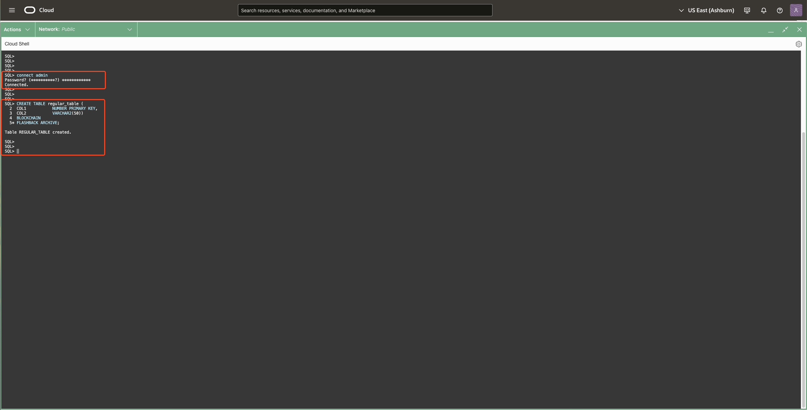
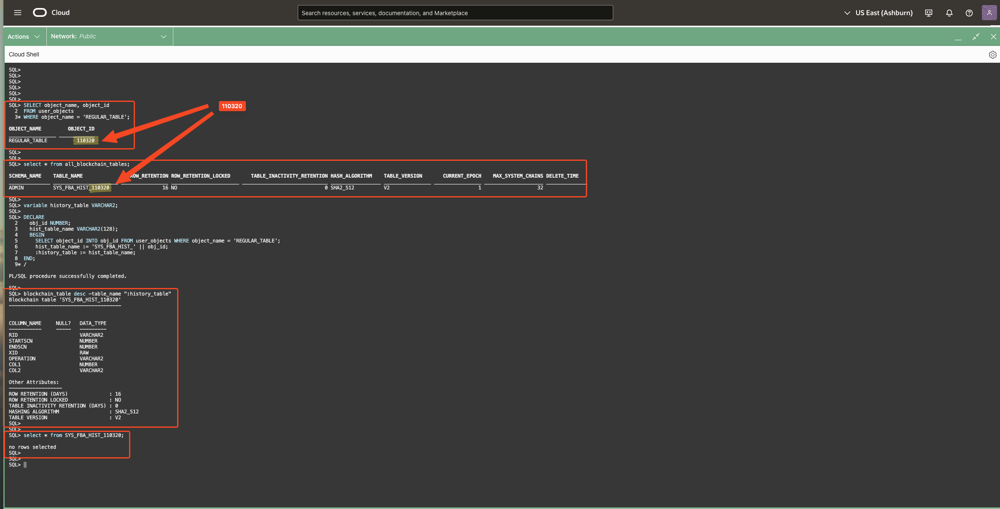
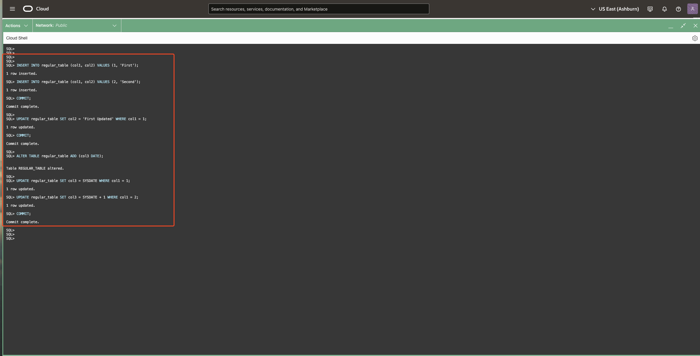
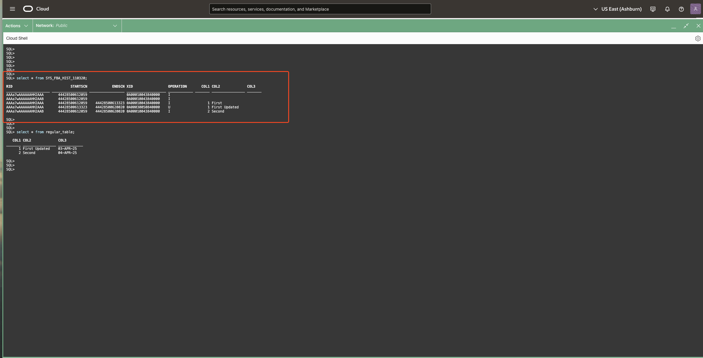
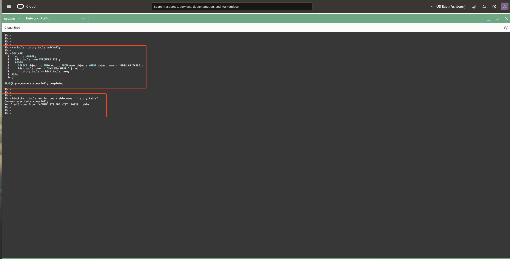
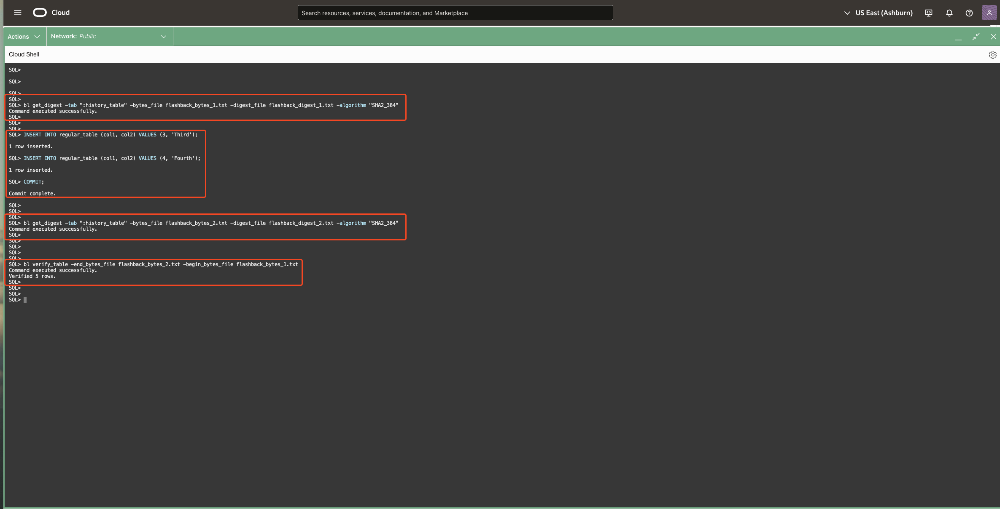

# Use Blockchain Flashback Journals for Regular Tables

## **Introduction**

In highly regulated environments, maintaining a verifiable history of data changes is critical. Oracle Flashback Archives (FBA) allow tracking of changes to regular user tables over time. With the addition of blockchain table support for Flashback Archives, Oracle enhances this capability by storing historical changes in tamper-resistant blockchain history tables.

When a table is created with the BLOCKCHAIN FLASHBACK ARCHIVE clause, its historical data is recorded in a blockchain table managed by Oracle. This enables cryptographic verification of data lifespans, ensuring that no historical changes have been altered or deleted.

This lab introduces how to protect regular tables using blockchain table based Flashback Archives.

* Estimated Time: 15 minutes

Watch the video below for a quick walk through of the lab.

[Blockchain Flashback Archive](videohub:1_cewkrd6o:medium)

### Objectives

In this lab, you will:

- **Create a Regular Table Protected by Blockchain Flashback Archive** <br />
  Learn to define a tracked table with blockchain table based Flashback Archive.

- **Understand the Architecture of Blockchain History Tables** <br />
  Explore how Oracle manages and protects historical data for tracked tables.

- **Perform Blockchain Table Based Verification on Flashback Archive History Tables** <br />
  Use blockchain table enabled SQLcl commands such as verify_rows, verify\_table, and get\_digest to verify the cryptographic integrity of Oracle-managed blockchain history tables created for Flashback Archive, ensuring that historical changes to the tracked table remain immutable and tamper-resistant.

### Prerequisites

* A Free-Tier or LiveLabs Oracle Cloud account.
* Have successfully completed the previous labs.

## Task 1: Create a Blockchain Flashback Archive Table

---

In this task, you will create a regular table that utilizes Oracle's Flashback Archive with blockchain capabilities to ensure tamper-resistant tracking of data changes.

- Connect to the Admin Schema:

  Begin by connecting to the admin schema. Execute the following command:

  ```
  <copy>
  connect admin
  </copy>
  ```
  > **Expected Output:**  
  > <pre>
  > Password? (**********?) </pre>


- Enter the Admin Schema Password:

  When prompted, enter the password for the admin schema. If you are using an Oracle-provided environment or following specific lab guidelines, use the following password:

  ```
  <copy>
  Welcome_123#
  </copy>
  ```
  > **Expected Output:**  
  > <pre>
  > Connected. </pre>


- Create the Regular Table with Blockchain Flashback Archive:

  Now, create a table named regular_table with two columns: COL1 (as the primary key) and COL2. This table will be enabled for Flashback Data Archive with blockchain capabilities. Execute the following command:

  ```
  <copy>
  CREATE TABLE regular_table (
  COL1           NUMBER PRIMARY KEY,
  COL2           VARCHAR2(50))
  BLOCKCHAIN
  FLASHBACK ARCHIVE;
  </copy>
  ```
  > **Expected Output:**  
  > <pre>
  > Table REGULAR_TABLE created. </pre>


> NOTE: Including the BLOCKCHAIN keyword while creating the table ensures that the history tables maintained by the Flashback Data Archive are blockchain tables, providing tamper-evident tracking of data changes.




## Task 2: Understand the Architecture of Blockchain History Tables

---

In this task, you will explore the internal structures that Oracle creates to support Flashback Archive with blockchain capabilities.

- Find the Object ID for the regular_table:

  Each table in Oracle has a unique OBJECT\_ID. Retrieve the OBJECT\_ID for the regular_table by executing:

  ```
  <copy>
  SELECT object_name, object_id
  FROM user_objects
  WHERE object_name = 'REGULAR_TABLE';
  </copy>
  ```

  > **Expected Output:**  
  > <pre>
  > OBJECT_NAME              OBJECT_ID 
  >________________ __________________ .
  > REGULAR_TABLE    {RANDOM_OBJECT_ID} </pre>

- Identify Associated Internal Tables:
  Oracle automatically creates two internal tables for each Flashback Archive-enabled table:
    - Blockchain History Table: Named SYS\_FBA\_HIST\_{RANDOM\_OBJECT\_ID}, this table stores the historical data in a tamper-evident manner using blockchain table technology.
    - Transaction Control Row Version Table (TCRV): Named SYS\_FBA\_TCRV\_{RANDOM\_OBJECT\_ID}, this table tracks the current row versions.

- List All Blockchain Tables:
  To view all blockchain tables that you can access in the database, execute:
  ```
  <copy>
    select * from all_blockchain_tables;
  </copy>
  ```
  Look for the table named SYS\_FBA\_HIST\_{RANDOM\_OBJECT\_ID} in the output.

- Describe the Blockchain History Table:

  To understand the structure of the blockchain history table, execute the following PL/SQL block:

  ```
  <copy>
  variable history_table VARCHAR2;

  DECLARE
    obj_id NUMBER;
    hist_table_name VARCHAR2(128);
    BEGIN
      SELECT object_id INTO obj_id FROM user_objects WHERE object_name = 'REGULAR_TABLE';
      hist_table_name := 'SYS_FBA_HIST_' || obj_id;
      :history_table := hist_table_name;
  END;
  /

  blockchain_table desc -table_name ":history_table"
  </copy>
  ```
  This script will describe the blockchain history table associated with regular_table.

  
- Query the Blockchain History Table:

  To view the contents of the blockchain history table, execute:

  ```
  <copy>
  select * from SYS_FBA_HIST_{RANDOM_OBJECT_ID}
  </copy>
  ```
  > Replace the {RANDOM\_OBJECT\_ID} with the object ID obtained earlier.





## Task 3: Modify the Tracked Table and Observe History

---

In this task, you will perform various operations on regular_table and observe how these changes are recorded in the blockchain history table.

- Insert Data and perform DML operations on the regular_table:
  Execute the following set of operations;
  ```
  <copy>
  INSERT INTO regular_table (col1, col2) VALUES (1, 'First');
  INSERT INTO regular_table (col1, col2) VALUES (2, 'Second');
  COMMIT;

  UPDATE regular_table SET col2 = 'First Updated' WHERE col1 = 1;
  COMMIT;

  ALTER TABLE regular_table ADD (col3 DATE);

  UPDATE regular_table SET col3 = SYSDATE WHERE col1 = 1;
  UPDATE regular_table SET col3 = SYSDATE + 1 WHERE col1 = 2;
  COMMIT;
  </copy>
  ```
  > **Expected Output:**  
  > <pre>
  > SQL> INSERT INTO regular_table (col1, col2) VALUES (1, 'First');
  > 
  > 1 row inserted.
  > 
  > SQL> INSERT INTO regular_table (col1, col2) VALUES (2, 'Second');
  > 
  > 1 row inserted.
  > 
  > SQL> COMMIT;
  > 
  > Commit complete.
  > 
  > SQL> 
  > SQL> UPDATE regular_table SET col2 = 'First Updated' WHERE col1 = 1;
  > 
  > 1 row updated.
  > 
  > SQL> COMMIT;
  > 
  > Commit complete.
  > 
  > SQL> 
  > SQL> ALTER TABLE regular_table ADD (col3 DATE);
  > 
  > 
  > Table REGULAR_TABLE altered.
  > 
  > SQL> 
  > SQL> UPDATE regular_table SET col3 = SYSDATE WHERE col1 = 1;
  > 
  > 1 row updated.
  > 
  > SQL> UPDATE regular_table SET col3 = SYSDATE + 1 WHERE col1 = 2;
  > 
  > 1 row updated.
  > 
  > SQL> COMMIT;
  > 
  > Commit complete. </pre>

  


> NOTE: The blockchain flashback archive is updated asynchronously by a background process; therefore, it is recommended to wait a few seconds after inserting or modifying rows before querying or verifying them.

- Query the Blockchain History Table:

  After performing the above operations, query the blockchain history table to observe how these changes have been recorded:

  ```
  <copy>
  select * from SYS_FBA_HIST_{RANDOM_OBJECT_ID}
  </copy>
  ```
  >Replace the {RANDOM\_OBJECT\_ID} with the object ID obtained earlier.
  >You should see entries corresponding to the insertions and updates made to regular_table.



## Task 4: Verify Data Integrity of Blockchain History Table

---

In this task, you will utilize Oracle's blockchain table commands to verify the integrity of the history table associated with REGULAR\_TABLE. These commands include verify\_rows, get\_digest, and verify\_table.

- Retrieve the Name of the Blockchain History Table:
  To dynamically determine the name of the history table, execute the following PL/SQL block:
  ```
  <copy>
  variable history_table VARCHAR2;

  DECLARE
    obj_id NUMBER;
    hist_table_name VARCHAR2(128);
    BEGIN
      SELECT object_id INTO obj_id FROM user_objects WHERE object_name = 'REGULAR_TABLE';
      hist_table_name := 'SYS_FBA_HIST_' || obj_id;
      :history_table := hist_table_name;
  END;
  /
  </copy>
  ```

  > **Expected Output:**  
  > <pre>
  > PL/SQL procedure successfully completed. </pre>

- Verify the Integrity of Rows in the Blockchain History Table:

  With the history table name stored in the history\_table bind variable, use the verify_rows command to check the integrity of the rows:

  ```
  <copy>
  blockchain_table verify_rows -table_name ":history_table"
  </copy>
  ```

  > **Expected Output:**  
  > <pre>
  > Verified 5 rows from '"ADMIN".SYS_FBA_HIST_{RANDOM_OBJECT_ID}' table </pre>


  

- Generate and Compare Digests to Detect Changes:

  To monitor changes over time, generate cryptographic digests before and after making modifications to REGULAR_TABLE. These digests can later be compared to verify the integrity of the data.

  - Generate Initial Digest:
    ```
    <copy>
    bl get_digest -tab ":history_table" -bytes_file flashback_bytes_1.txt -digest_file flashback_digest_1.txt -algorithm "SHA2_384"
    </copy>
    ```
    > **Expected Output:**  
    > <pre>
    > Command executed successfully. </pre>

  - Make Changes to REGULAR_TABLE:
    ```
    <copy>
    INSERT INTO regular_table (col1, col2) VALUES (3, 'Third');
    INSERT INTO regular_table (col1, col2) VALUES (4, 'Fourth');
    COMMIT;
    </copy>
    ```
    > **Expected Output:**  
    > <pre>
    > 1 row inserted.
    > 1 row inserted.
    > Commit complete. </pre>
  
  - Generate Subsequent Digest:
    ```
    <copy>
    bl get_digest -tab ":history_table" -bytes_file flashback_bytes_2.txt -digest_file flashback_digest_2.txt -algorithm "SHA2_384"
    </copy>
    ```
    > **Expected Output:**  
    > <pre>
    > Command executed successfully. </pre>

  - Verify Table Integrity Between Two Digests:
    Compare the two digests to confirm that the only changes are those that were intentionally made:

    ```
    <copy>
    bl verify_table -end_bytes_file flashback_bytes_2.txt -begin_bytes_file flashback_bytes_1.txt
    </copy>
    ```
    > **Expected Output:**  
    > <pre>
    > PL/SQL procedure successfully completed. </pre>

  

You may now [proceed to the next lab](#next).

## Learn more

* For more information on Blockchain Flashback Journals for regular tables, please see **[Protecting Flashback Archive Data](https://docs.oracle.com/en/database/oracle/oracle-database/23/adfns/flashback.html#GUID-6B04E5D6-4740-4CA6-9CC6-A3CD19E00FA6)** documentation.

## Acknowledgements

* **Contributors** - Amit Ketkar, Pavas Navaney, Vinay Pandhariwal 
* **Created By/Date** - Vinay Pandhariwal, April 2025
* **Last Updated By/Date** - Vinay Pandhariwal, April 2025
