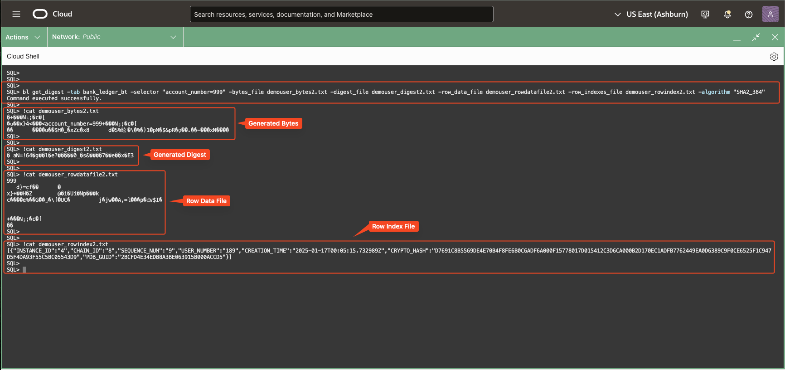

# Digest Generation and Verification in Blockchain Tables

## **Introduction**

While Blockchain Tables provide cryptographic chaining to ensure tamper-resistant data, real-world enterprise systems often require additional ways to validate and share the authenticity of table contents over time. This is where Blockchain Table digests come into play.

A digest is a compact, cryptographically signed or unsigned summary of selected rows or the last-row of each system chain in the Blockchain Table. The last-rows refers to the final row in each individual system chain, as a Blockchain Table can typically consist of multiple chains. These digests can be securely stored, exported, or distributed to third parties, enabling periodic integrity checks or providing legal proof of unchanged historical data. Oracle provides built-in support for both last-rows digests and filtered-row digests, along with flexible options for unsigned and signed digest generation. These capabilities allow organizations to implement fine-grained, auditable verification pipelines.

You can generate:
- Unsigned digests: Lightweight hashes for internal or local verification.
- Signed digests: Authenticated by the table owner's private key, suitable for regulatory, legal, or external sharing scenarios.

This lab explores how to generate different types of digests, validate them, and understand their applications.

> Oracle 23ai introduces the ability to generate filtered digests using row selectors. These allow you to verify digest integrity over a subset of rows rather than the last row of the system chains in a Blockchain table — ideal for cases like regional audits, department-level records, or sensitive data slices.
> 
> We will continue working with the **bank\_ledger\_bt** table created in Lab 3, building upon it to explore digest generation and verification features.


In this lab, we will use SQLcl to perform various operations on Blockchain Tables, leveraging its intuitive and user-friendly interface. The dedicated command for managing Blockchain Tables is `blockchain_table | bl` . SQLcl offers powerful features such as Completion Insight (TAB) for command suggestions, Command History to revisit previous commands, and an In-Line Editor for easy modifications, ensuring a smooth and efficient workflow. For additional guidance, you can access the help section directly in the SQLcl console by typing `help blockchain_table` or `help bl` . This provides a comprehensive overview of all commands and functionalities, making it easier to explore and manage Blockchain Tables throughout the lab.

* Estimated Time: 15 minutes

Watch the video below for a quick walk through of the lab.

[Digest Generation and Verification in Blockchain Tables](videohub:1_vc1xrzr9:medium)

### Objectives

In this lab, you will:

- **Generate a Last-Rows Digest** <br />
  Learn how to compute a cryptographic digest for the last row of the system chains in a Blockchain Table using SQLcl commands.

- **Generate a Signed Digest** <br />
  Create a digitally signed digest using the table owner's private key for secure distribution and validation.

- **Generate Digests for Filtered Rows** <br />
  Use -selector and -selector_file options introduced in Oracle 23ai to target specific row subsets.

- **Verify Blockchain Table State Using Digests** <br />
  Use the verify_table command to confirm data integrity against previously stored digest files.


### Prerequisites

* A Free-Tier or LiveLabs Oracle Cloud account.
* Have successfully completed the previous labs.

## Task 1: Distribution of last-rows digest for the Blockchain Table

---

The commands `get_digest` and `get_signed_digest` provide robust mechanisms for verifying data integrity and authenticity in Blockchain Tables. The signed digest ensures an additional layer of trust by using cryptographic signing.

<details open>
<summary><mark>Generating Unsigned last-rows Digest for the Blockchain Table</mark></summary>

The **`blockchain_table get_digest`** command generates a cryptographic hash (digest) for the last row of the system chains in the Blockchain Table. This digest enables validation of data integrity and authenticity by using all the rows at the end of each system chain.

#### Usage:
<pre>
blockchain_table get_digest {OPTIONS}
</pre>

<details open>
<summary>Options:</summary>
- **`-table_name|-tab <table_name>` (Required):** Specifies the name of the Blockchain Table.
- **`-bytes_file <bytes_file>` (Optional) (Out Parameter):** Specifies the file name to store the generated digest bytes.
- **`-digest <digest>` (Optional) (Out Parameter):** Outputs the hexadecimal representation of the digest.
- **`-digest_file <digest_file>` (Optional) (Out Parameter):** Specifies the file name to store the binary digest.
- **`-row_indexes_file <row_indexes_file>` (Optional) (Out Parameter):** Specifies the file to save the row index details in JSON format.
- **`-algorithm|-algo <algorithm>` (Optional):** Specifies the hash algorithm. Acceptable values:
    - `SHA2_256`
    - `SHA2_384`
    - `SHA2_512`
    - Default is `SHA2_256`
</details>

> **NOTE**:
> 1. The `bytes_file` option is used to store the digest in binary format in a file on the user's local machine from where the command is executed (here Cloud Shell). It stores the cryptographic hash of the digest.
> 2. The `digest` option is used to store the header followed by an array of row-info in a bind variable in a hexadecimal format, while the `digest_file` option is used to store the same information in a binary format at the path where the user specifies. This sequence of bytes is input to the cryptographic hash function.
> 3. The `row_indexes_file` specifies the rows in the blockchain table that were selected for the digest and is stored in a JSON format on the user's local machine from where the command is executed (here Cloud Shell).
> 4. The `bytes_file` option is the one that is used as input for the `verify_table` command.


#### Example: Generate last-rows Digest for the Blockchain Table
```
<copy>
bl get_digest -tab bank_ledger_bt -bytes_file demouser_bytes1.txt -digest_file demouser_digest1.txt -algorithm "SHA2_384"
</copy>
```

> **Expected Output:**  
> <pre>
> Command executed successfully. </pre>

> **NOTE**:
> 1. The mandatory option `bytes_file` is used to store the digest in the binary format in `demouser_bytes1.txt` file.
> 2. The option `digest_file` is used to store the header followed by an array of row-info in a binary format in the `demouser_digest1.txt` file.

</details>
</br>

<details>
<summary><mark>Generating a Signed last-rows Digest for the Blockchain Table</mark></summary>

The **`blockchain_table get_signed_digest`** command generates and signs a cryptographic hash (digest) for the last row of the system chains in the Blockchain Table.  The signed digest is created using the table owner's private key stored in the database wallet, ensuring both integrity and authenticity.

#### Usage:
<pre>
blockchain_table get_signed_digest {OPTIONS}
</pre>

<details open>
<summary>**Options:**</summary>
- **`-table_name|-tab <table_name>` (Required):** Specifies the name of the Blockchain Table.
- **`-bytes_file <bytes_file>` (Optional) (Out Parameter):** Specifies the file name to store the digest bytes before signing.
- **`-digest <digest>` (Optional) (Out Parameter):** Outputs the hexadecimal representation of the signed digest.
- **`-digest_file <digest_file>` (Optional) (Out Parameter):** Specifies the file name to store the signed binary digest.
- **`-row_indexes_file <row_indexes_file>` (Optional) (Out Parameter):** Specifies the file to save the row index details in JSON format.
- **`-cert_guid|-cg <cert_guid>` (Required) (Out Parameter):** Specifies the certificate GUID used for signing.
- **`-algorithm|-algo <algorithm>` (Optional):** Specifies the signing algorithm. Acceptable values:
    - `RSA_SHA2_256`
    - `RSA_SHA2_384`
    - `RSA_SHA2_512`
    - Default is `RSA_SHA2_256`
</details>

> **NOTE**:
> 1. The `bytes_file` option is used to store the digest in binary format in a file on the user's local machine from where the command is executed (here Cloud Shell). It stores the cryptographic hash of the digest.
> 2. The `digest` option is used to store the header followed by an array of row-info in a bind variable in a hexadecimal format, while the `digest_file` option is used to store the same information in a binary format at the path where the user specifies. This sequence of bytes is input to the cryptographic hash function.
> 3. The `row_indexes_file` specifies the rows in the blockchain table that were selected for the digest and is stored in a JSON format on the user's local machine from where the command is executed (here Cloud Shell).
> 4. The `bytes_file` option is the one that is used as input for the `verify_table` command.

#### Example: Generate Signed last-chain-row Digest for the Blockchain Table
```
<copy>
variable cert_guid VARCHAR2;

bl get_signed_digest -tab bank_ledger_bt -bytes_file demouser_signed_bytes2.txt -digest_file demouser_signed_digest2.txt -row_data_file demouser_signed_rowdatafile2.txt -cg ":cert_guid" -algorithm "RSA_SHA2_384"

print cert_guid
</copy>
```

</details>
</br>


## Task 2: Distribution of Digest for Filtered Rows in the Blockchain Table

---

Continuing from the previous task where we generated digests for the *last row of the system chains**, Oracle Database 23ai introduces powerful options to generate **filtered row digests**. These are useful when you want to validate specific subsets of rows.

From version **23ai** onward, the following options are available for the `get_digest` and `get_signed_digest` SQLcl commands:

- **`-selector`** – Supply a text-based filter condition (excluding the `WHERE` keyword) to select a subset of rows.
- **`-selector_file`** – Provide a file that contains the filter condition used for row selection.

These filters help you generate cryptographic digests for only a specific portion of the Blockchain Table, enabling **targeted verification** based on business logic or operational needs.


<details open>
<summary><mark>Generating Unsigned Digest for Filtered Rows in the Blockchain Table</mark></summary>

The **`blockchain_table get_digest`** command generates a cryptographic hash (digest) for a **subset of rows** in a Blockchain Table using filtering criteria. This feature allows users to validate integrity for **specific rows** instead of the last rows of the system chains in the Blockchain table, introduced in Oracle Database 23ai.

You can apply filters using:
- **`-selector`**: Directly specify the filter condition as a WHERE clause (without the `WHERE` keyword).
- **`-selector_file`**: Provide a file containing the row selection condition.

#### Usage:
<pre>
blockchain_table get_digest {OPTIONS}
</pre>

<details open>
<summary>Options:</summary>
- **`-table_name|-tab <table_name>` (Required):** Name of the Blockchain Table.
- **`-selector <selector>` (Optional):** Filtering clause for row selection.
- **`-selector_file <selector_file>` (Optional):** File containing the selector condition.
- **`-bytes_file <bytes_file>` (Optional) (Out Parameter):** File to store raw digest bytes.
- **`-digest <digest>` (Optional) (Out Parameter):** Hexadecimal digest output.
- **`-digest_file <digest_file>` (Optional) (Out Parameter):** File to store binary digest.
- **`-row_data_file <row_data_file>` (Optional) (Out Parameter):** File to store row data used for digest.
- **`-row_indexes_file <row_indexes_file>` (Optional) (Out Parameter):** File to store row index details in JSON.
- **`-algorithm|-algo <algorithm>` (Optional):** Hash algorithm to use. Options:
    - `SHA2_256` (default)
    - `SHA2_384`
    - `SHA2_512`
</details>

> **NOTE**:
> 1. The `bytes_file` option is used to store the digest in binary format in a file on the user's local machine from where the command is executed (here Cloud Shell). It stores the cryptographic hash of the digest.
> 2. The `digest` option is used to store the header followed by an array of row-info in a bind variable in a hexadecimal format, while the `digest_file` option is used to store the same information in a binary format at the path where the user specifies. This sequence of bytes is input to the cryptographic hash function.
> 3. The `row_data_file` is only generated in the case of filtered-row digests and stores the content of the rows in the blockchain table that were selected for the digest. It is stored at the path where the user executes the command from.
> 4. The `bytes_file` option is the one that is used as input for the `verify_table` command.
> 5. The `row_indexes_file` specifies the rows in the blockchain table that were selected for the digest and is stored in a JSON format on the user's local machine from where the command is executed (here Cloud Shell).

#### Example: Generate Digest for Specific Rows
```
<copy>
bl get_digest -tab bank_ledger_bt -selector "account_number=999" -bytes_file demouser_bytes2.txt -digest_file demouser_digest2.txt -row_data_file demouser_rowdatafile2.txt -row_indexes_file demouser_rowindex2.txt -algorithm "SHA2_384"
</copy>
```

> **Expected Output:**  
> <pre>
> Command executed successfully. </pre>

> **NOTE**:
> 1. The mandatory option `bytes_file` is used to store the digest in the binary format in `demouser_bytes2.txt` file.
> 2. The option `digest_file` is used to store the header followed by an array of row-info in a binary format in the `demouser_digest2.txt` file.
> 3. The `selector` option is used here to generate the filtered row digest for the row specified by `account_number=999`.
> 4. The `row_data_file` option is used to store the contents of the row specified by `account_number=999` in a binary format in the `demouser_rowdatafile2.txt` file.
> 5. The `row_indexes` option is used to store the details of selected rows in the JSON format in the `demouser_rowindex2.txt` file.

</details>
</br>

<details>
<summary><mark>Generating a Signed Digest for Filtered Rows in the Blockchain Table</mark></summary>

The **`blockchain_table get_signed_digest`** command generates and signs a cryptographic hash (digest) for specified rows of the Blockchain Table. The signed digest is created using the table owner's private key stored in the database wallet, ensuring both integrity and authenticity.

You can apply filters using:
- **`-selector`**: Directly specify the filter condition as a WHERE clause (without the `WHERE` keyword).
- **`-selector_file`**: Provide a file containing the row selection condition.

#### Usage:
<pre>
blockchain_table get_signed_digest {OPTIONS}
</pre>

<details open>
<summary>**Options:**</summary>
- **`-table_name|-tab <table_name>` (Required):** Specifies the name of the Blockchain Table.
- **`-selector <selector>` (Optional):** A WHERE clause without the `WHERE` keyword to filter rows for the signed digest.
- **`-selector_file <selector_file>` (Optional):** Specifies a file containing the row selection criteria.
- **`-bytes_file <bytes_file>` (Optional) (Out Parameter):** Specifies the file name to store the digest bytes before signing.
- **`-digest <digest>` (Optional) (Out Parameter):** Outputs the hexadecimal representation of the signed digest.
- **`-digest_file <digest_file>` (Optional) (Out Parameter):** Specifies the file name to store the signed binary digest.
- **`-row_data_file <row_data_file>` (Optional) (Out Parameter):** Specifies the file to save the generated row data bytes.
- **`-row_indexes_file <row_indexes_file>` (Optional) (Out Parameter):** Specifies the file to save the row index details in JSON format.
- **`-cert_guid|-cg <cert_guid>` (Required) (Out Parameter):** Specifies the certificate GUID used for signing.
- **`-algorithm|-algo <algorithm>` (Optional):** Specifies the signing algorithm. Acceptable values:
    - `RSA_SHA2_256`
    - `RSA_SHA2_384`
    - `RSA_SHA2_512`
    - Default is `RSA_SHA2_256`
</details>

> **NOTE**:
> 1. The `bytes_file` option is used to store the digest in binary format in a file on the user's local machine from where the command is executed (here Cloud Shell). It stores the cryptographic hash of the digest.
> 2. The `digest` option is used to store the header followed by an array of row-info in a bind variable in a hexadecimal format, while the `digest_file` option is used to store the same information in a binary format at the path where the user specifies. This sequence of bytes is input to the cryptographic hash function.
> 3. The `row_data_file` is only generated in the case of filtered-row digests and stores the content of the rows in the blockchain table that were selected for the digest. It is stored at the path where the user executes the command from.
> 4. The `bytes_file` option is the one that is used as input for the `verify_table` command.
> 5. The `row_indexes_file` specifies the rows in the blockchain table that were selected for the digest and is stored in a JSON format on the user's local machine from where the command is executed (here Cloud Shell).


#### Example: Generate Signed Digest for Specific Rows
```
<copy>
variable cert_guid VARCHAR2;

bl get_signed_digest -tab bank_ledger_bt -selector "account_number=999" -bytes_file demouser_signed_bytes2.txt -digest_file demouser_signed_digest2.txt -row_data_file demouser_signed_rowdatafile2.txt -row_indexes_file demouser_signed_rowindexfile2.txt -cg ":cert_guid" -algorithm "RSA_SHA2_384"

print cert_guid
</copy>
```

</details>
</br>

## Task 3: Verification of Blockchain Table digest

---

The **`blockchain_table verify_table`** command checks the integrity of all rows in a Blockchain Table between a specified range of digests. This includes verifying signatures, user chains, and system chains for rows created within the range defined by the provided digest files. This command is equivalent to the **`DBMS_BLOCKCHAIN_TABLE.VERIFY_TABLE_BLOCKCHAIN`** PL/SQL procedure.

#### Usage:
<pre>
blockchain_table verify_table {OPTIONS}
</pre>

<details open>
<summary>**Options:**</summary>
- **`-begin_bytes_file <begin_bytes_file>` (Required):** Specifies the file containing the starting digest. This digest must be generated using commands like `get_signed_digest` or `get_digest`.
- **`-end_bytes_file <end_bytes_file>` (Required):** Specifies the file containing the ending digest. This digest must also be generated using `get_signed_digest` or `get_digest`.
- **`-rowcount <rowcount>` (Optional) (Out Parameter):** Outputs the number of successfully verified rows.
- **`-skip_user_signature|-skipuser` (Optional):** Skips validation of user signatures if present. Default is `FALSE`.
- **`-skip_delegate_signature|-skipdlg` (Optional):** Skips validation of delegate signatures if present. Default is `FALSE`.
- **`-skip_countersignature|-skipctr` (Optional):** Skips validation of countersignatures if present. Default is `FALSE`.
</details>
</br>

> **NOTE**:
> 1. The `bytes_file` option generated from the previous `get_digest` or `get_signed_digest` commands, either for filtered-row digests or for last-chain-row digests, are used as inputs for the `begin_bytes_file` and `end_bytes_file` options.


#### Example: Verify unsigned digest for the last row of system chains in the Blockchain Table
Lets first create another digest files using `get_digest` command:
```
<copy>
bl get_digest -tab bank_ledger_bt -bytes_file demouser_bytes3.txt -digest_file demouser_digest3.txt -algorithm "SHA2_384"
</copy>
```
> **Expected Output:**  
> <pre>
> Command executed successfully. </pre>

To verify the `bank_ledger_bt` table using starting and ending digests:
```
<copy>
bl verify_table -end_bytes_file demouser_bytes3.txt -begin_bytes_file demouser_bytes1.txt
</copy>
```

> **Expected Output:**  
> <pre>
> Command executed successfully.  
> Verified 10 rows. </pre>

You may now [proceed to the next lab](#next).

## Learn more


* For more information on using certificates with blockchain tables, please see the **[DBMS\_USER\_CERTS](https://docs.oracle.com/en/database/oracle/oracle-database/23/arpls/dbms_user_certs.html)** documentation and SQLcl help section accessed using **`help certificate`** in the SQLcl console.

* For more information on Blockchain Table and other Blockchain Table commands, please see the **[DBMS\_BLOCKCHAIN\_TABLE](https://docs.oracle.com/en/database/oracle/oracle-database/23/arpls/dbms_blockchain_table.html)** documentation and SQLcl help section accessed using **`help blockchain_table`** in the SQLcl console.

* For more information about Blockchain table SQLcl commands, please see **[SQLcl Blockchain Table](https://docs.oracle.com/en/database/oracle/sql-developer-command-line/25.1/sqcug/blockchain_table.html)**

## Acknowledgements

* **Contributors** - Amit Ketkar, Pavas Navaney, Vinay Pandhariwal 
* **Created By/Date** - Vinay Pandhariwal, April 2025
* **Last Updated By/Date** - Vinay Pandhariwal, April 2025
