# Row-Level Signatures and Their Verification in Blockchain Tables

## **Introduction**

Blockchain Tables offer a powerful foundation for ensuring data is tamper-resistant. But in many enterprise scenarios, it’s not enough to protect data integrity — there’s also a need to prove that data was reviewed and cryptographically approved by trusted parties.

With row-level signing, Oracle Blockchain Tables allow each row to carry a digital signature tied to a registered certificate. This adds a critical layer of assurance: that the contents of the row were reviewed and signed by an authorized identity.

Blockchain Tables further support delegate signatures, allowing a trusted user to sign on behalf of another, and countersignatures, which are exclusive to table owners — enabling them to cryptographically affirm and endorse signed rows for added trust and authenticity. These layered trust mechanisms provide enhanced accountability in collaborative or multi-tenant environments.

This lab guides you through setting up Oracle Wallets, registering certificates, and using SQLcl commands to sign and verify rows — empowering you to build Blockchain Tables that don’t just protect data from change, but also verify its authenticity.

In this lab, we will use SQLcl to perform various operations on Blockchain Tables, leveraging its intuitive and user-friendly interface. The dedicated command for managing Blockchain Tables is `blockchain_table | bl` . SQLcl offers powerful features such as Completion Insight (TAB) for command suggestions, Command History to revisit previous commands, and an In-Line Editor for easy modifications, ensuring a smooth and efficient workflow. For additional guidance, you can access the help section directly in the SQLcl console by typing `help blockchain_table` or `help bl` . This provides a comprehensive overview of all commands and functionalities, making it easier to explore and manage Blockchain Tables throughout the lab.

* Estimated Time: 25 minutes

Watch the video below for a quick walk through of the lab.

[Row-Level Signing and Verification in Blockchain Tables](videohub:1_w6ghvbpi:medium)

### Objectives

In this lab, you will:

- **Execute Test Scripts to Manage Wallets** <br />
  Run scripts to create wallets and add certificates as required for Blockchain Table operations.

- **Manage Certificates for Blockchain Tables** <br />
  Learn to handle certificates, including their creation, addition, and removal.

- **Add and Remove Certificates from the `user_certs$` Table** <br />
  Understand the process of modifying the `user_certs$` table to manage certificates effectively.

- **Sign Rows in a Blockchain Table** <br />
  Understand the process of digitally signing rows to add an additional layer of verification.

- **Verify Rows and Chains for Integrity and Authenticity** <br />
  Explore the built-in mechanisms to check row integrity and the authenticity of data in the Blockchain Table.

### Prerequisites

* A Free-Tier or LiveLabs Oracle Cloud account.
* Have successfully completed the previous labs.

## Task 1: Managing Certificates for Blockchain Tables

To enable cryptographic signing and verification in Blockchain Tables, managing certificates is a crucial step. Certificates are used to digitally sign rows and validate the authenticity of data, ensuring tamper-resistant and traceable records. The **`DBMS_USER_CERTS`** package provides APIs for adding and deleting certificates, offering database users flexibility in managing the cryptographic credentials required for Blockchain Tables.

---

### **Why Add Certificates?**

---

Adding certificates to the database is essential as they form the foundation for enabling signature-based row verification in Blockchain Tables. Certificates represent the identity of the user or system performing the signing, and their cryptographic details are used to generate and validate digital signatures. Here’s why adding certificates is necessary:

- **Digital Signatures for Blockchain Rows**:
    - Each row in a Blockchain Table can be digitally signed to ensure its integrity and authenticity.
    - The certificate associated with the signature must be present in the database to verify the validity of the signature.
  
- **Certificate Retention for Historical Data**:
    - Even if a certificate expires, it must remain in the database until all rows signed with it are deleted. This ensures that digital signatures on historical rows can still be verified.

- **Multi-User Scenarios**:
    - Certificates allow different users or systems to sign and verify rows independently. Each certificate is uniquely identified with a **Global Unique Identifier (GUID)**, enabling clear ownership and usage tracking.

In this task, we will use **SQLcl commands** to add, drop, and list certificates required for Blockchain Tables. These commands are extensions of the `DBMS_USER_CERTS` PL/SQL package, which provides APIs to manage certificates for cryptographic operations. Certificates are essential for enabling digital signatures and verifying the integrity of data in Blockchain Tables.

---

### **Creating a Wallet and Certificates in Cloud Shell**

---

We will create a wallet containing certificates and private key pairs in the Cloud Shell local directory. This wallet will be used to add certificates to the `user_certs$` table. Follow the steps below to perform wallet creation and certificate generation. These commands need to be run from **SQLcl**.

#### Steps:

```
    <copy>
    -- 1. Create an Oracle Wallet in the current directory
    orapki wallet create -wallet . -auto_login -pwd Welcome_123#

    -- 2. Create a CA/ROOT private key and self-signed certificate using OpenSSL
    !openssl genrsa -out ca_privatekey.pem 4096
    !openssl req -x509 -new -key ca_privatekey.pem -sha512 -days 3650 -out ca_cert.pem -subj "/CN=Admin"

    -- 3. Generate a private key for demouser
    !openssl genrsa -out demouser_privatekey.pem 4096

    -- 4. Create a certificate signing request (CSR) and a self-signed certificate using the private key
    !openssl req -new -key demouser_privatekey.pem -out demouser_csr.pem -subj "/CN=demouser"
    !openssl x509 -req -in demouser_csr.pem -CA ca_cert.pem -CAkey ca_privatekey.pem -CAcreateserial -out demouser_cert.crt -days 3650 -sha512

    -- 5. Convert the certificate to PKCS#12 format
    !openssl pkcs12 -export -in demouser_cert.crt -inkey demouser_privatekey.pem -out demouser_cert.p12 -name "demouser" -passout pass:Welcome_123#

    -- 6. Import the PKCS#12 file into the Oracle Wallet
    orapki wallet import_pkcs12 -wallet . -pkcs12file demouser_cert.p12 -pwd Welcome_123# -pkcs12pwd Welcome_123#

    -- 7. Add the CA certificate to the Oracle Wallet
    orapki wallet add -wallet . -trusted_cert -cert ca_cert.pem -pwd Welcome_123#
    </copy>
```

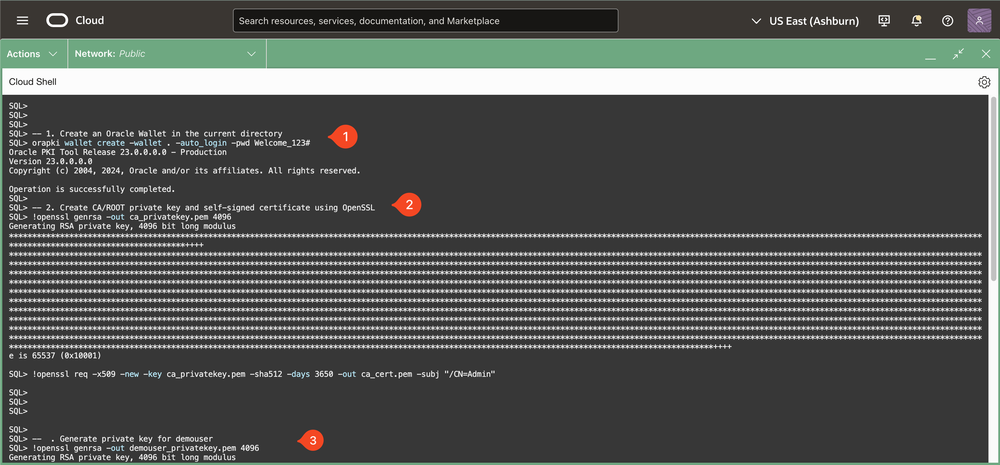
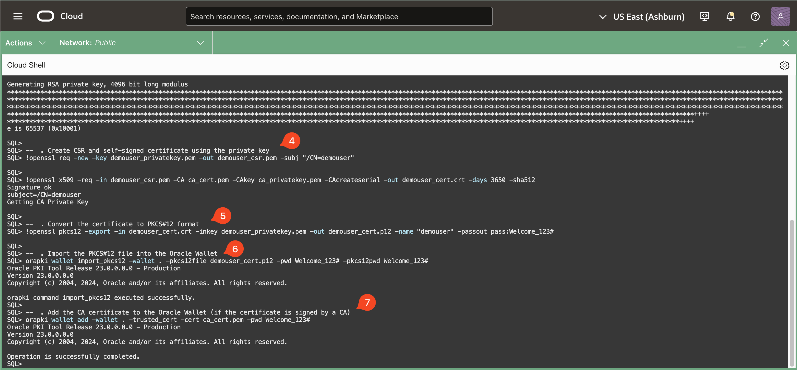

<pre>
Notes:
    - The wallet's password is `Welcome_123#`.
    - This script above involves:
        - Creating an Oracle wallet in the local directory.
        - Generating a CA/Root private key and self-signed certificate.
        - Generating a private key for `demouser`.
        - Creating a CSR and a self-signed certificate for `demouser`.
        - Converting the certificate to PKCS#12 format.
        - Importing the PKCS#12 file into the Oracle Wallet.
        - Adding the CA certificate to the Oracle Wallet.
        - The `demouser` certificate is stored as `demouser_cert.crt`.
        - The `demouser` private key is stored as `demouser_privatekey.pem`.
</pre>
---

### **Viewing the Wallet Contents**

---

You can view the contents of the wallet using the `orapki wallet display` command. Please note the alias for the demouser user certificate for future operations. (i.e. orakey0 in the image below)

```bash
    <copy>
    orapki wallet display -wallet . -pwd Welcome_123# -complete
    </copy>
```
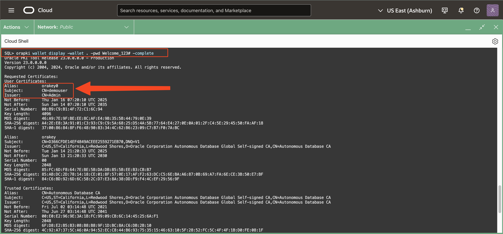

---

### **SQLcl Commands for Managing Certificates**

---

The SQLcl commands provide a user-friendly way to interact with certificates, offering functionality equivalent to the following `DBMS_USER_CERTS` PL/SQL subprograms:
    - **`ADD_CERTIFICATE` Procedure** → `certificate add`
    - **`DROP_CERTIFICATE` Procedure** → `certificate drop`

These commands simplify certificate management without requiring complex PL/SQL scripts. Below is a detailed explanation of the SQLcl commands.


---

#### **Adding Certificates**

---

The **`certificate add`** command allows users to add an X.509 certificate, which will be used for signature verification in Blockchain Tables. This is equivalent to the `ADD_CERTIFICATE` PL/SQL procedure.

#### Usage:
<pre>
    certificate add {OPTIONS}
</pre>

#### Options:
- **`-cert_file|-cf <cert_file>` (Required):** Specifies the X.509 certificate file used for signature verification.
- **`-cert_guid|-cg <cert_guid>` (Optional) (Out Parameter):** Species the bind variable used to store the generated GUID.
- **`-wallet_path|-wallet <wallet_path>` (Optional):** Specifies the local wallet's path where the certificate is stored.
- **`-wallet_password|-walletpw <wallet_password>` (Optional):** Provides the password for accessing the wallet. If not provided, the system will prompt for it interactively.
- **`-wallet_certificate_alias|-walletcertalias <alias>` (Optional):** Specifies an alias for the certificate being added.

#### Example:
Adding certificate using certificate file and storing the guid in a bind variable 
    ```
        <copy>
        variable guid VARCHAR2;

        certificate add -cert_file demouser_cert.crt -cert_guid ":guid"

        print guid
        </copy>
    ```

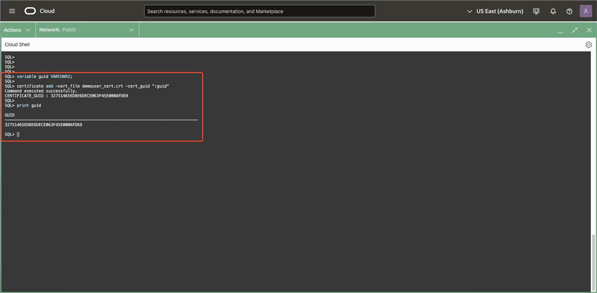
> **Expected Output:**  
> <pre>
> SQL> variable guid VARCHAR2;  
> SQL>   
> SQL> certificate add -cert_file demouser_cert.crt -cert_guid ":guid"
> Command executed successfully.  
> CERTIFICATE_GUID : &lt;RANDOM_GUID&gt;
> SQL>   
> SQL> print guid  
>   
> GUID  
> --------------------------------------------------------------------------------~
> &lt;RANDOM_GUID&gt;</pre>


---

#### **Listing Certificates**

---

The **`certificate list`** command lists all certificates that have been added to the database and can be used for signature verification in Blockchain Tables.

### Usage:
<pre>
    certificate list|ls
</pre>

### Example:
List Certificates
    ```
    <copy>
    certificate list
    </copy>
    ```

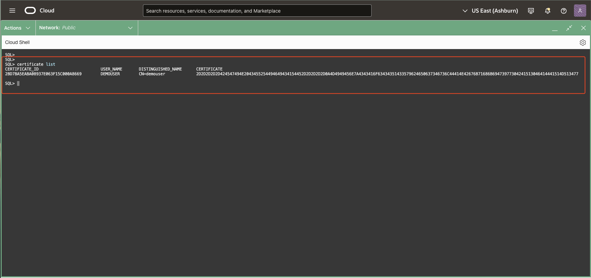
> **Expected Output:**  
> <pre>
> CERTIFICATE_ID                          USER_NAME       DISTINGUISHED_NAME      CERTIFICATE  
> ----------------------------------------------------------------------------------------------~
> &lt;RANDOM_GUID&gt;                           DEMOUSER        CN=demouser             &lt;RANDOM_BYTES&gt;  </pre>


---

#### **Dropping Certificates**

---

The **`certificate drop`** command allows users to delete a certificate using its GUID. This command is equivalent to the `DROP_CERTIFICATE` procedure in the `DBMS_USER_CERTS` PL/SQL package.

### Usage:
<pre>
certificate drop {OPTIONS}
</pre>

### Options:
- **`-cert_guid|-cg <cert_guid>` (Required):** The GUID of the certificate to be dropped.

### Example:
Dropping certificate using bind variable used in previous step
    ```
    <copy>
    certificate drop -cert_guid ":guid"
    </copy>
    ```

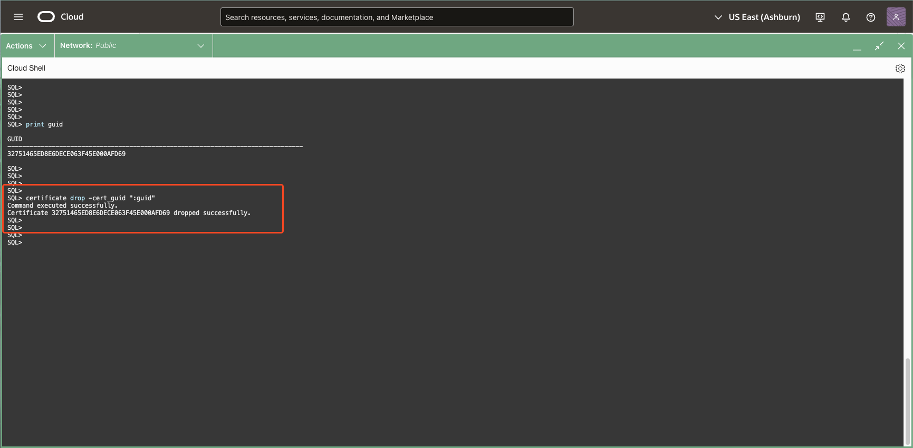
> **Expected Output:**  
> <pre>
> Command executed successfully.  
> Certificate 2D897A3B6BFD4EB9E063F45E000A80E9 dropped successfully.</pre>

Managing certificates is a vital step in enabling secure cryptographic operations in Blockchain Tables. By using SQLcl commands such as `certificate add`, `certificate drop`, and `certificate list`, users can efficiently perform these tasks with minimal complexity. These commands extend the functionality of the `DBMS_USER_CERTS` PL/SQL package, making certificate management accessible and user-friendly for all database users.


## Task 2: Row-Level Signing in Blockchain Tables

---

> In this lab, we will continue working with the **bank\_ledger\_bt** table created in Lab 3, building upon it to explore row signing and verification features.

The **`blockchain_table sign_row`** command enables users to provide a digital signature for a previously inserted row in a Blockchain Table. This signature ensures the authenticity and integrity of the row data. The command corresponds to the **`DBMS_BLOCKCHAIN_TABLE.SIGN_ROW`** PL/SQL procedure.

#### Usage:
<pre>
blockchain_table sign_row {OPTIONS}
</pre>

<details open>
<summary>**Options:**</summary>
- **`-table_name|-tab <table_name>` (Required):** Specifies the name of the Blockchain Table containing the row to be signed.
- **`-instance_id|-inst <instance_id>` (Optional):** Restricts the operation to rows inserted on the specified database instance.
- **`-chain_id|-ch <chain_id>` (Optional):** Specifies the chain to which the row belongs. By default, there are 32 chains per database instance, numbered from 0 to 31.
- **`-sequence_id|-seq <sequence_id>` (Optional):** Specifies the position of the row within the chain.
- **`-row_hash <row_hash>` (Optional):** Specifies the expected value of the row's hash before signing. Default is `NULL`.
- **`-keycol1_name|-kc1name <key_column>` (Optional):** Specifies the name of the first key column for identifying the row.
- **`-keycol1_value|-kc1val <key_value>` (Optional):** Specifies the value of the first key column.
- **`-keycol2_name|-kc2name <key_column>` (Optional):** Specifies the name of the second key column (for composite keys).
- **`-keycol2_value|-kc2val <key_value>` (Optional):** Specifies the value of the second key column.
- **`-keycol3_name|-kc3name <key_column>` (Optional):** Specifies the name of the third key column (for composite keys).
- **`-keycol3_value|-kc3val <key_value>` (Optional):** Specifies the value of the third key column.
- **`-signature|-sig <signature>` (Optional):** Outputs the hexadecimal representation of the digital signature.
- **`-signature_file|-sigfile <signature_file>` (Optional):** Specifies the file name to store the binary representation of the digital signature.
- **`-cert_guid|-cg <cert_guid>` (Required):** Specifies the Global Unique Identifier (GUID) of the certificate used for signing.
- **`-algorithm|-algo <algorithm>` (Required):** Specifies the algorithm used for generating the digital signature. Acceptable values:
    - `RSA_SHA2_256`
    - `RSA_SHA2_384`
    - `RSA_SHA2_512`
- **`-wallet_path|-wallet <wallet_path>` (Optional):** Specifies the local wallet path containing the private key for signing.
- **`-wallet_password|-walletpw <wallet_password>` (Optional):** Provides the password for accessing the wallet. If not provided, the system will prompt for it interactively.
- **`-wallet_private_key_alias|-walletpvtkeyalias <alias>` (Optional):** Identifies the private key in the wallet for signature generation. If not provided, the system retrieves the private key using the `cert_guid`.
- **`-wallet_private_key_password|-walletpvtkeypw <password>` (Optional):** Provides the password to access the private key stored in the wallet.
- **`-data_format|-df <data_format>` (Optional):** Specifies the version of the data layout for the hash in the row. Default is `1`.
- **`-type <type>` (Optional):** Specifies the type of signature. Acceptable values:
    - `USER`: Default value, used for user-generated signatures.
    - `DELEGATE`: Indicates the signature is delegated.
- **`-pdb_guid <pdb_guid>` (Optional):** Specifies the GUID of the Pluggable Database (PDB) where the Blockchain Table is located.
</details>

#### Before signing lets declare some variables and add certificates for ease of use.
```
<copy>
variable   inst_id        VARCHAR2;
variable   chain_id       VARCHAR2;
variable   seq_id         VARCHAR2;
variable   row_hash       VARCHAR2;
variable   guid           VARCHAR2;

certificate add -cert_file demouser_cert.crt -cert_guid ":guid"

</copy>
```
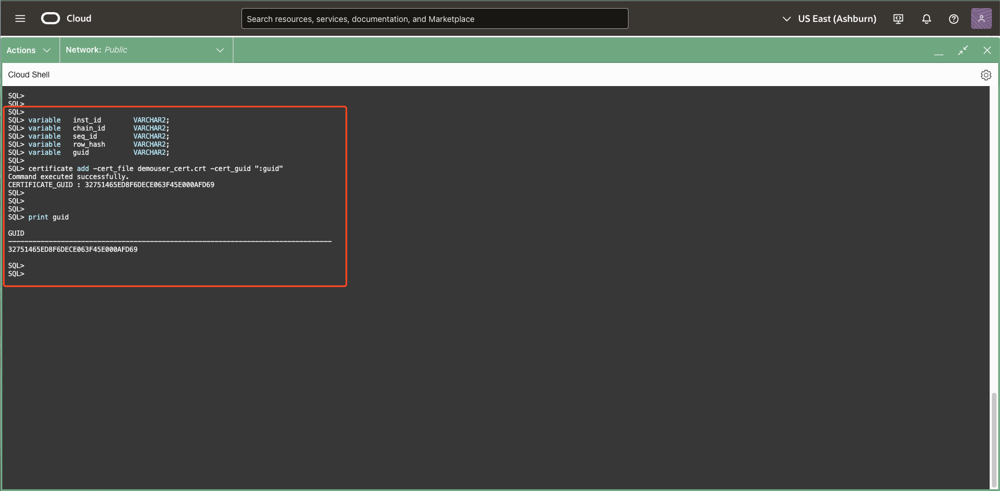
> **Expected Output:**  
> <pre>
> Command executed successfully.  
> CERTIFICATE_GUID : &lt;RANDOM_GUID&gt; </pre>


#### Example: Sign a Row Using Key Column Parameters and private key stored in a wallet 
To sign a specific row in the `bank_ledger_bt` table using key columns. The command accesses the wallet to retrieve the private key and generate a signature. If the wallet_password is not provided, you will be prompted to enter the password:
```
<copy>

bl sign_row -tab bank_ledger_bt  -kc1name "account_number" -kc1val "994" -cert_guid ":guid" -algo "RSA_SHA2_512" -type "USER" -wallet_path . -wallet_password Welcome_123# -wallet_private_key_password Welcome_123#

commit;
</copy>
```

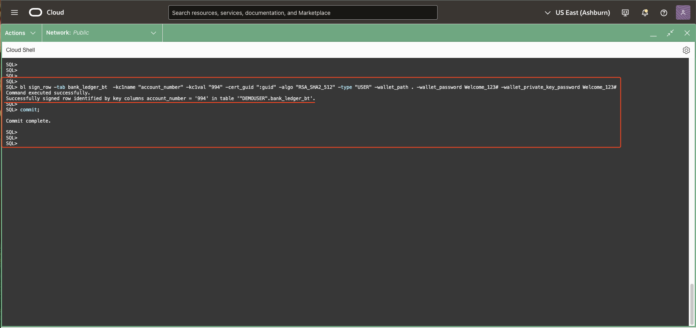
> **Expected Output:**  
> <pre>
> Command executed successfully.  
> Successfully signed row identified by key columns account_number = '994' in table '"DEMOUSER".bank_ledger_bt'. </pre>


#### Example: Sign a Row Using Key Column Parameters and a private key stored in a file
To sign a specific row in the `bank_ledger_bt` table using key columns. The code internally uses OpenSSL installed on user's local system (here Cloud Shell) to generate the signature:
```
<copy>

bl sign_row -tab bank_ledger_bt  -kc1name "account_number" -kc1val "993" -prvtkey demouser_privatekey.pem -cert_guid ":guid" -algo "RSA_SHA2_512" -type "USER"

commit;

</copy>
```
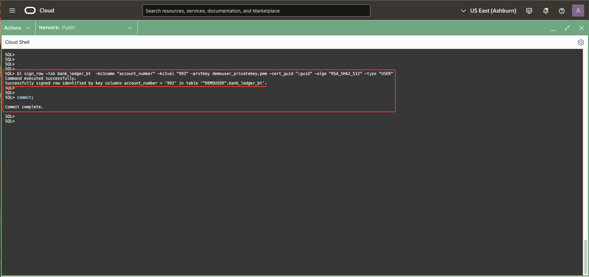
> **Expected Output:**  
> <pre>
> Command executed successfully.  
> Successfully signed row identified by key columns account_number = '993' in table '"DEMOUSER".bank_ledger_bt'. </pre>


#### Example: Sign a Row Using Positional Parameters and a private key stored in a file
To sign a specific row in the `bank_ledger_bt` table using positional parameters i.e. instance id, chain id and sequence id. The code internally uses OpenSSL installed on user's local system (here Cloud Shell) to generate the signature:
```
<copy>

begin
     select ORABCTAB_INST_ID$, ORABCTAB_CHAIN_ID$, ORABCTAB_SEQ_NUM$, ORABCTAB_HASH$  into :inst_id, :chain_id, :seq_id, :row_hash from bank_ledger_bt where account_number = '992';
end;
/

bl sign_row -tab bank_ledger_bt -inst ":inst_id" -ch ":chain_id" -seq ":seq_id"  -prvtkey demouser_privatekey.pem -cert_guid ":guid" -row_hash ":row_hash" -algo "RSA_SHA2_512" -type "USER"

commit;
</copy>
```

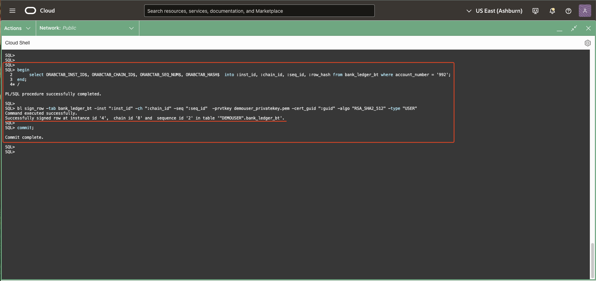
> **Expected Output:**  
> <pre>
> Command executed successfully.  
> Successfully signed row at instance id '<INST_ID>', chain id '<CHAIN_ID>' and sequence id '<SEQUENCE_ID>' in table '"DEMOUSER".bank_ledger_bt'. </pre>


#### Example: Sign a Row Using Positional Parameters and OpenSSL
To sign a specific row in the `bank_ledger_bt` table using positional parameters i.e. instance id, chain id and sequence id:
```
<copy>

begin
     select ORABCTAB_INST_ID$, ORABCTAB_CHAIN_ID$, ORABCTAB_SEQ_NUM$, ORABCTAB_HASH$  into :inst_id, :chain_id, :seq_id, :row_hash from bank_ledger_bt where account_number = '991';
end;
/

blockchain_table get_bytes_for_row_signature -tab bank_ledger_bt -inst ":inst_id" -ch ":chain_id" -seq ":seq_id" -row_data_file row1.dat -type "USER"

!openssl dgst -sha512 -sign demouser_privatekey.pem -out row1_sign.dat row1.dat

bl sign_row -tab bank_ledger_bt -inst ":inst_id" -ch ":chain_id" -seq ":seq_id" -row_hash ":row_hash" -signature_file row1_sign.dat -cert_guid ":guid" -algo "RSA_SHA2_512"

commit;
</copy>
```

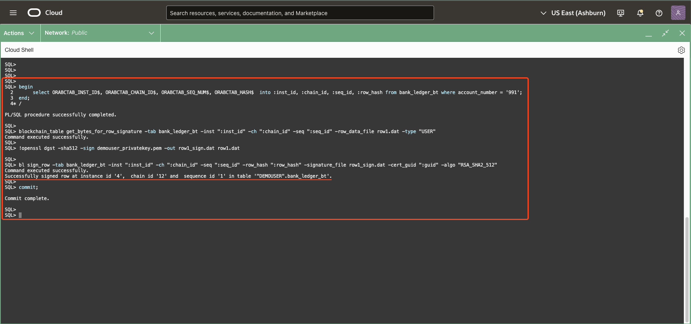
> **Expected Output:**  
> <pre>
> Command executed successfully.  
> Successfully signed row at instance id '<INST_ID>', chain id '<CHAIN_ID>' and sequence id '<SEQUENCE_ID>' in table '"DEMOUSER".bank_ledger_bt'. </pre>


Using the `sign_row` command ensures the authenticity of Blockchain Table data by attaching cryptographic signatures to rows, identified either by chain/sequence or key columns. The inclusion of the **`type`** option adds flexibility for advanced use cases in delegated signing.


<details open>
<summary>**Delegate Signing**</summary>

Delegate signing in Blockchain Tables allows a delegate to sign rows on behalf of the primary user, using a delegate certificate. This is particularly useful in scenarios where the primary user either does not have a private key or wants to enable other trusted entities to sign rows without sharing their private key. To perform delegate signing, the delegate certificate must be added to the database, and the **`type`** option must be set to **`DELEGATE`** in the **`sign_row`** command. This ensures that the signature is explicitly marked as a delegate's signature, preserving auditability and trust. Delegate signing provides flexibility while maintaining security, as the primary user's credentials remain secure.
</details>

<details open>
<summary>**Countersignature**</summary>

A countersignature in Blockchain Tables is an additional layer of security that involves the table owner signing the content of a previously signed row. This ensures the row's integrity and authenticity from both the user's and the owner's perspectives. The **`countersign_row`** command generates the countersignature by using the table owner's private key stored in the database wallet. This feature is particularly valuable in scenarios requiring end-to-end verification of critical data, as it enables independent validation of both the user's and the owner's signatures. Countersignatures enhance the overall trust and auditability of Blockchain Table rows, making them highly secure and reliable for sensitive applications.


#### Usage:
<pre>
blockchain_table countersign_row {OPTIONS}
</pre>

<details open>
<summary>Options:</summary>
- **`-table_name|-tab <table_name>` (Required):** Specifies the name of the Blockchain Table containing the row to be countersigned.
- **`-instance_id|-inst <instance_id>` (Optional):** Restricts the operation to rows inserted on the specified database instance.
- **`-chain_id|-ch <chain_id>` (Optional):** Specifies the chain to which the row belongs.
- **`-sequence_id|-seq <sequence_id>` (Optional):** Specifies the position of the row within the chain.
- **`-keycol1_name|-kc1name <key_column>` (Optional):** Specifies the name of the first key column for identifying the row.
- **`-keycol1_value|-kc1val <key_value>` (Optional):** Specifies the value of the first key column.
- **`-keycol2_name|-kc2name <key_column>` (Optional):** Specifies the name of the second key column (for composite keys).
- **`-keycol2_value|-kc2val <key_value>` (Optional):** Specifies the value of the second key column.
- **`-keycol3_name|-kc3name <key_column>` (Optional):** Specifies the name of the third key column (for composite keys).
- **`-keycol3_value|-kc3val <key_value>` (Optional):** Specifies the value of the third key column.
- **`-countersignature|-csig <countersignature>` (Optional) (Out Parameter):** Outputs the hexadecimal representation of the countersignature.
- **`-bytes_file <bytes_file>` (Optional) (Out Parameter):** Specifies the file name to store the countersignature bytes.
- **`-countersign_cert_guid|-cscg <cert_guid>` (Optional) (Out Parameter):** Specifies the certificate GUID used for verifying the countersignature.
- **`-countersignature_algorithm|-countersignalgo <algorithm>` (Optional):** Specifies the algorithm used for generating the countersignature. Acceptable values:
    - `RSA_SHA2_256`
    - `RSA_SHA2_384`
    - `RSA_SHA2_512`
- **`-content_version <content_version>` (Optional):** Specifies the version of the data layout for the countersignature. Default is `V2_DIGEST`.
</details>
</details>
</br>


## Task 3: Row-Level Verification in Blockchain Tables

---

This functionality verifies the integrity of rows in Blockchain Tables by checking the hash values and by default validating the row signatures. This command ensures that no rows have been tampered with or modified, preserving the table’s immutability. 

<details open>
<summary><mark>SQLcl based verification</mark></summary>

The command used here is **`blockchain_table verify_rows`**. This is equivalent to the **`DBMS_BLOCKCHAIN_TABLE.VERIFY_ROWS`** PL/SQL procedure.

Usage:
    <pre>
    blockchain\_table verify\_rows {OPTIONS}
    </pre>

<details open>
<summary>**Options:**</summary>
- **`-table_name|-tab <table_name>` (Required):** Specifies the name of the Blockchain Table to verify.
- **`-low_timestamp|-low <low_timestamp>` (Optional):** Defines the lower bound of the time range for verifying rows. Default is `NULL`.
- **`-high_timestamp|-high <high_timestamp>` (Optional):** Defines the upper bound of the time range for verifying rows. Default is `NULL`.
- **`-instance_id|-inst <instance_id>` (Optional):** Restricts verification to rows inserted on the specified instance.
- **`-chain_id|-ch <chain_id>` (Optional):** Restricts verification to rows on the specified chain (default is all chains).
- **`-rowcount <rowcount>` (Optional) (Out Parameter):** Outputs the number of rows verified.
- **`-skip_user_signature|-skipuser` (Optional):** Skips validation of user signatures if present. 
- **`-skip_delegate_signature|-skipdlg` (Optional):** Skips validation of delegate signatures if present.
- **`-skip_countersignature|-skipctr` (Optional):** Skips validation of countersignatures if present.
</details>
</br>

#### Example:
To verify all rows in a table:
```
    <copy>
    blockchain_table verify_rows -tab bank_ledger_bt;
    </copy>
```

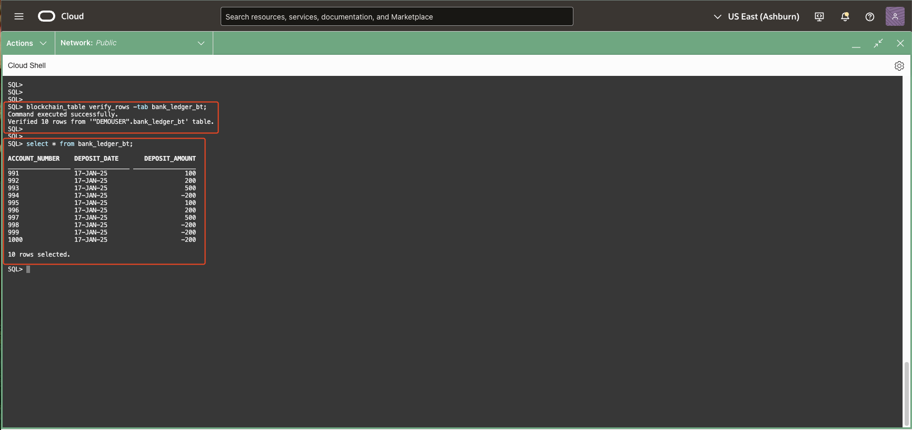
> **Expected Output:**  
> <pre>
> Command executed successfully.  
> Verified 10 rows from '"DEMOUSER".bank_ledger_bt' table.</pre>


#### Example with Timestamp Range:
Blockchain Tables allow selective verification of rows using timestamp boundaries. This feature is useful when you want to validate changes made within a specific time range.

- Query the Creation Time of Rows.<br/>
    Before verifying rows, identify the creation times by querying the `bank_ledger_bt` table:
    ```
        <copy>
        select ACCOUNT_NUMBER, ORABCTAB_CREATION_TIME$ from bank_ledger_bt;
        </copy>
    ```

 - Verify Rows with a Timestamp Range<br/>
    You can now use the `verify_rows` command with different combinations of -low and -high timestamps to validate only the rows created within that period.
    ```
        <copy>
        blockchain_table verify_rows -tab bank_ledger_bt -low '08-APR-25 05.01.01 AM UTC' -high '09-APR-25 11.21.30 AM UTC'
        </copy>
    ```
    ```
        <copy>
        blockchain_table verify_rows -tab bank_ledger_bt -low '08-APR-25 05.01.01 AM UTC' -high '08-APR-25 05.01.10 AM UTC'
        </copy>
    ```
> **NOTE**: Timestamps must align with the current NLS settings, such as NLS\_TIMESTAMP\_FORMAT for TIMESTAMP or NLS\_TIMESTAMP\_TZ\_FORMAT for TIMESTAMP WITH TIME ZONE.

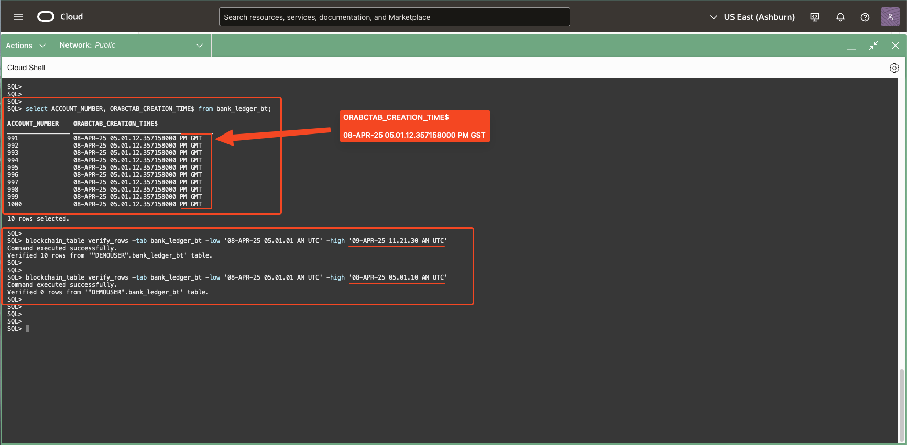
> **Expected Output:**  
> <pre>
> Command executed successfully.  
> Verified 0 rows from '"DEMOUSER".bank_ledger_bt' table. </pre>

#### Example with Signature Skipping:
To verify rows but skip validating all signatures:
```
    <copy>
    blockchain_table verify_rows -tab bank_ledger_bt -skip_user_signature -skip_delegate_signature -skip_countersignature
    </copy>
```
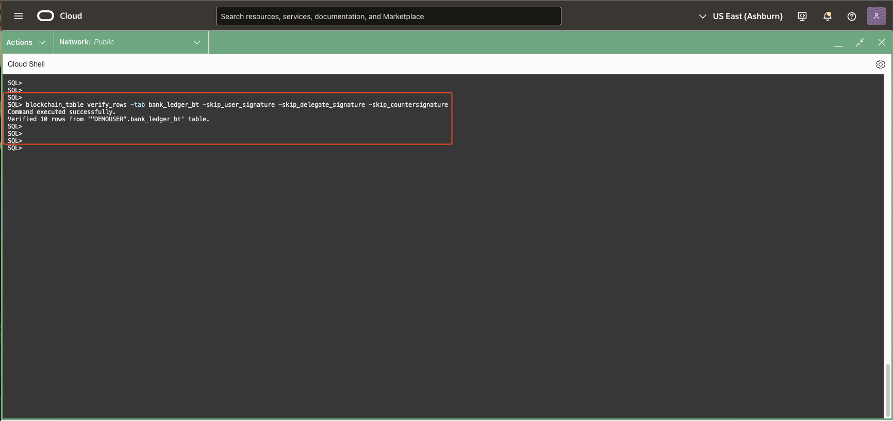
> **Expected Output:**  
> <pre>
> Command executed successfully.  
> Verified 10 rows from '"DEMOUSER".bank_ledger_bt' table.</pre>

</details>

<details>
<summary><mark>Independent Verification of Blockchain Table Data (Additional Information, Not Needed for the Lab)</mark></summary>

Oracle Blockchain Tables allow for **independent verification** of their data, ensuring tamper-resistant integrity even outside the Oracle Database environment. Oracle provides sample **Java source code** and **configuration files** to facilitate this independent verification process. These samples also demonstrate how to publish Oracle cryptographic hashes to platforms like **Hyperledger Fabric**, enabling cross-platform compatibility.

#### Key Features of Independent Verification:
- **Verify Oracle Blockchain Table Data:** Validate the integrity of blockchain table rows outside the Oracle Database using cryptographic hash checks.
- **Publish to Hyperledger Fabric:** Use the provided examples to distribute Oracle crypto-hashes on blockchain platforms such as Hyperledger Fabric.
- **Extend Functionality:** Customize the sample programs to integrate Oracle cryptographic solutions with other blockchain ecosystems.

#### Resources:
The resources, including source code and configuration samples, are available on GitHub. Access the full documentation and examples at the following link:

[Oracle Blockchain Table Samples – Independent Verification](https://github.com/oracle-samples/blockchain-table-samples/blob/main/README.md)

#### Getting Started:
1. Clone or download the repository from GitHub.
2. Follow the instructions in the **README.md** file to configure and run the Java verification program.
3. Customize the code to fit your organization's specific requirements for independent verification or blockchain integration.
</details>
</br>

You may now [proceed to the next lab](#next).

## Learn More

* For more information on using certificates with blockchain tables, please see the **[DBMS\_USER\_CERTS](https://docs.oracle.com/en/database/oracle/oracle-database/23/arpls/dbms_user_certs.html)** documentation and SQLcl help section accessed using **`help certificate`** in the SQLcl console.

* For more information on Blockchain Table and other Blockchain Table commands, please see the **[DBMS\_BLOCKCHAIN\_TABLE](https://docs.oracle.com/en/database/oracle/oracle-database/23/arpls/dbms_blockchain_table.html)** documentation and SQLcl help section accessed using **`help blockchain_table`** in the SQLcl console.

* For more information about PKI Certificate SQLcl commands, please see **[SQLcl Certificates](https://docs.oracle.com/en/database/oracle/sql-developer-command-line/25.1/sqcug/certificate.html)**

* For more information about Blockchain table SQLcl commands, please see **[SQLcl Blockchain Table](https://docs.oracle.com/en/database/oracle/sql-developer-command-line/25.1/sqcug/blockchain_table.html)**

## Acknowledgements

* **Contributors** - Amit Ketkar, Pavas Navaney, Vinay Pandhariwal 
* **Created By/Date** - Vinay Pandhariwal, April 2025
* **Last Updated By/Date** - Vinay Pandhariwal, April 2025
