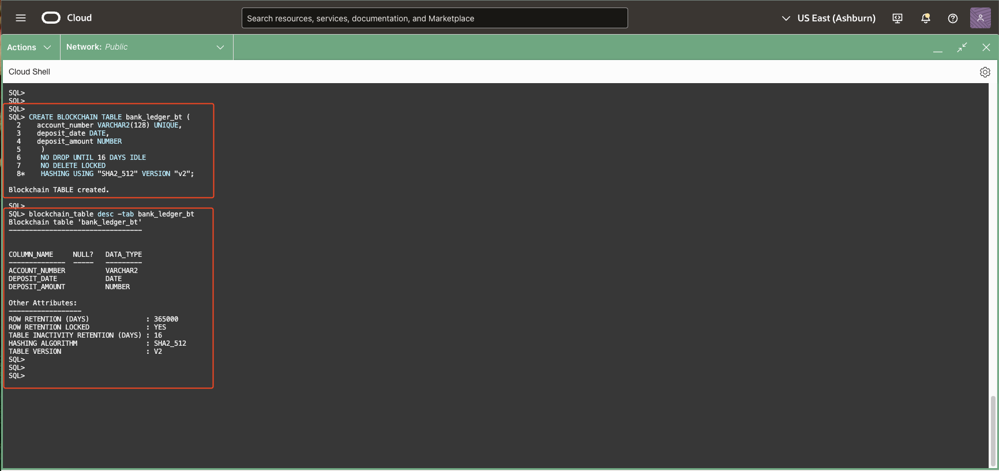

# Blockchain Tables with Cryptographic Verifiability

## **Introduction**

**Blockchain Tables** in Oracle Database extend the concept of immutability with cryptographic security, enabling organizations to ensure both data integrity and authenticity. They are designed to meet the increasing demand for secure, tamper-resistant, and auditable data storage solutions. Building on the foundation of Immutable Tables, Blockchain Tables introduce advanced features such as **row-level signing**, **digest verification**, and **distributed trust mechanisms**, making them ideal for scenarios where transparency, auditability, and verifiable data authenticity are essential.

At their core, Blockchain Tables are **insert-only tables** that organize rows into cryptographically secure chains. Each inserted row is linked to the previous row using a cryptographic hash, creating an immutable chain of data that ensures any attempt to tamper with or delete rows can be detected. Unlike traditional database tables, Blockchain Tables prohibit updates to rows and restrict deletions based on configurable retention policies, making them a powerful tool for applications requiring a tamper-resistant ledger.

These tables address critical challenges faced by enterprises and governments in protecting data from unauthorized modifications, fraud, and cyber-attacks. They provide an unparalleled level of security by focusing on safeguarding data that records important actions, assets, entities, and documents. Unauthorized modification of such records can result in loss of assets, business disruption, and legal complications. Blockchain Tables not only ensure the immutability of data but also provide built-in mechanisms for verifying that data remains unaltered over time.

<details open>
<summary><mark>Key Characteristics of Blockchain Tables:</mark></summary>
- **Tamper-Resistant Design:** Each row is chained to the previous row using cryptographic hashes, ensuring data immutability.
- **Insert-Only Operations:** Rows can only be inserted; updates are not allowed.
- **Retention Policy:** Deletion of rows is restricted based on a defined retention period, ensuring a secure and auditable history.
- **Row-Level Signing (Optional):** Users can add digital signatures to rows for enhanced fraud protection, requiring a digital certificate to verify the signature.
- **Independent Verification:** Built-in tools allow users to verify that rows and chains have not been tampered with or deleted.
- **Integration with Existing Applications:** Blockchain Tables can be seamlessly used with regular database tables in queries and transactions.
</details>
</ br>
<details open>
<summary><mark>Practical Use Cases:</mark></summary>
1. **Fraud Prevention:**
   Blockchain Tables provide cryptographic evidence of data authenticity, helping detect and prevent tampering with critical records.
   
2. **Regulatory Compliance:**
   Meet stringent requirements for data transparency and traceability in industries such as finance, healthcare, and government.
   
3. **Tamper-Resistant Ledgers:**
   Maintain a secure and auditable history of transactions, assets, or events, ensuring the integrity of current and historical data.

4. **Trusted Applications Without Distributed Consensus:**
   Blockchain Tables can be used in blockchain applications where different database users trust Oracle Database to maintain a tamper-resistant blockchain. This eliminates the need for distributed consensus mechanisms, providing the security of a blockchain with much higher throughput and lower latency.
</details>
</br>
<details open>
<summary><mark>Why Blockchain Tables?</mark></summary>
Blockchain Tables address critical challenges faced by enterprises and governments, focusing on protecting data from criminals, hackers, and fraud. Unauthorized modification of records can result in loss of assets, business, and legal repercussions. Blockchain Tables provide an effective solution to ensure that important records are immutable and verifiable. These features make them essential for applications requiring tamper-resistant ledgers of current and historical transactions.
</details>

> **Features such as row signing and digest generation will be introduced in subsequent labs.**

In this lab, we will use SQLcl to perform various operations on Blockchain Tables, leveraging its intuitive and user-friendly interface. The dedicated command for managing Blockchain Tables is `blockchain_table | bl` . SQLcl offers powerful features such as Completion Insight (TAB) for command suggestions, Command History to revisit previous commands, and an In-Line Editor for easy modifications, ensuring a smooth and efficient workflow. For additional guidance, you can access the help section directly in the SQLcl console by typing `help blockchain_table` or `help bl` . This provides a comprehensive overview of all commands and functionalities, making it easier to explore and manage Blockchain Tables throughout the lab.


* Estimated Time: 25 minutes

Watch the video below for a quick walk through of the lab.

[Blockchain Tables with Cryptographic Verifiability](videohub:1_3u8xev49:medium)

### Objectives

In this lab, you will:

- **Create a Blockchain Table** <br />
  Learn how to define and set up a Blockchain Table, including its structure and configuration.

- **Insert Rows into the Blockchain Table** <br />
  Understand how to add data to the Blockchain Table and ensure proper formatting for immutable storage.

- **Describe the Details of a Blockchain Table** <br />
  Retrieve and analyze metadata about the Blockchain Table, including its chain configuration, properties, and security features.

- **Verify Rows and Chains for Integrity and Authenticity** <br />
  Explore the built-in mechanisms to check row integrity and the authenticity of data in the Blockchain Table.

### Prerequisites

* A Free-Tier or LiveLabs Oracle Cloud account.

## Task 1: Create a Blockchain Table

---

1. The `CREATE BLOCKCHAIN TABLE` statement requires additional attributes to ensure tamper-resistant functionality. These include the **`NO DROP`**, **`NO DELETE`**, and **`HASHING USING`** clauses, along with the **BLOCKCHAIN** keyword. Here’s what each clause does:

    - **`NO DROP` Clause**:
        - Prevents the table from being dropped until specific conditions are met.
        - **`NO DROP UNTIL number DAYS IDLE`**: The table cannot be dropped until there have been no new rows inserted for the specified number of days. 
        - If the table has no rows, it can still be dropped regardless of this setting.

    - **`NO DELETE` Clause**:
        - Defines how long rows in the table are protected from deletion.
        - **`NO DELETE`**: Retains rows indefinitely (cannot be deleted).
        - **`NO DELETE UNTIL number DAYS AFTER INSERT`**: Protects rows from deletion for a specified minimum of **16 days**.
        - Adding **`LOCKED`** ensures that this retention setting cannot be changed later using the `ALTER TABLE` command.

    - **`HASHING USING` Clause**:
        - Specifies the cryptographic hash algorithm for securing row data.
        - **`HASHING USING sha2_512`**: Uses the SHA2_512 algorithm to create tamper-resistant rows.
        
    - **`VERSION v1`**: Basic blockchain table functionality.
    - **`VERSION v2`**: Supports additional features like schema evolution, delegate signatures, and countersignatures (available in Oracle 23ai).

    Run the following command to create a Blockchain Table named **`bank_ledger_bt`**. This table maintains a tamper-resistant ledger of current and historical transactions using the **SHA2_512** hashing algorithm. Rows in this table cannot be deleted, and the table itself can only be dropped after **16 days** of inactivity.

    ```
        <copy>
    CREATE BLOCKCHAIN TABLE bank_ledger_bt (
        account_number VARCHAR2(128) UNIQUE,
        deposit_date DATE,
        deposit_amount NUMBER
    )
    NO DROP UNTIL 16 DAYS IDLE
    NO DELETE LOCKED
    HASHING USING "SHA2_512" VERSION "v2";
    </copy>
    ```
    > **Expected Output:**  
    > <pre>
    > Blockchain TABLE created.</pre>


2. After creating the table, run the following **SQLcl command** to describe the table's clauses and confirm its creation. Note that the description will display only the visible columns of the table:
    ```
    <copy>
    blockchain_table desc -tab bank_ledger_bt
    </copy>
   ```
   

> **Expected Output:**  
    > <pre>
    > Blockchain table 'bank_ledger_bt'  
    > ---------------------------------~
    >   
    > COLUMN_NAME     NULL?   DATA_TYPE  
    > --------------  -----   ---------  
    > ACCOUNT_NUMBER          VARCHAR2  
    > DEPOSIT_DATE            DATE  
    > DEPOSIT_AMOUNT          NUMBER  
    >   
    > Other Attributes:  
    > ------------------~
    > ROW RETENTION (DAYS)              : 365000  
    > ROW RETENTION LOCKED              : YES  
    > TABLE INACTIVITY RETENTION (DAYS) : 16  
    > HASHING ALGORITHM                 : SHA2_512  
    > TABLE VERSION                     : V2</pre>


## Task 2: Insert Rows into the Blockchain Table

---

1. Copy and paste the below code snippet in the worksheet and run them to insert records into the `bank_ledger` blockchain table.

    ```
    <copy>
    INSERT INTO bank_ledger_bt VALUES ('991',to_date(sysdate,'dd-mm-yyyy'),100);
    INSERT INTO bank_ledger_bt VALUES ('992',to_date(sysdate,'dd-mm-yyyy'),200);
    INSERT INTO bank_ledger_bt VALUES ('993',to_date(sysdate,'dd-mm-yyyy'),500);
    INSERT INTO bank_ledger_bt VALUES ('994',to_date(sysdate,'dd-mm-yyyy'),-200);
    INSERT INTO bank_ledger_bt VALUES ('995',to_date(sysdate,'dd-mm-yyyy'),100);
    INSERT INTO bank_ledger_bt VALUES ('996',to_date(sysdate,'dd-mm-yyyy'),200);
    INSERT INTO bank_ledger_bt VALUES ('997',to_date(sysdate,'dd-mm-yyyy'),500);
    INSERT INTO bank_ledger_bt VALUES ('998',to_date(sysdate,'dd-mm-yyyy'),-200);
    INSERT INTO bank_ledger_bt VALUES ('999',to_date(sysdate,'dd-mm-yyyy'),-200);
    INSERT INTO bank_ledger_bt VALUES ('1000',to_date(sysdate,'dd-mm-yyyy'),-200);
    commit;
    </copy>
    ```

    

2. Query the `bank_ledger` blockchain table to show the records.

    ```
    <copy>
    select * from bank_ledger_bt;
    </copy>
    ```

    

## Task 3: View Blockchain Tables and Its Internal Columns

---

1. Run the command to view the table details.

    ```
    <copy>
    select * from user_blockchain_tables WHERE table_name = 'BANK_LEDGER_BT';
    </copy>
    ```

    

2. Use the `USER_TAB_COLS` view to display all internal column names used to store internal information like the users number, the users signature.

    ```
    <copy>
    SELECT table_name, internal_column_id "Col ID", SUBSTR(column_name,1,30) "Column Name", SUBSTR(data_type,1,30) "Data Type", data_length "Data Length"
    FROM user_tab_cols 
    WHERE TABLE_NAME = 'BANK_LEDGER_BT'
    ORDER BY internal_column_id;
    </copy>
    ```

    

    The additional columns ending with $ are Oracle managed to maintain the chained sequence, cryptographic hash values, and support user signing. You can include these columns in your queries by referencing them explicitly.

3. Query the `bank_ledger_bt` blockchain table to display all the values in the blockchain table including values of internal columns.

    ```
    <copy>
    select account_number, deposit_date, deposit_amount, ORABCTAB_INST_ID$,
    ORABCTAB_CHAIN_ID$, ORABCTAB_SEQ_NUM$,
    ORABCTAB_CREATION_TIME$, ORABCTAB_USER_NUMBER$,
    ORABCTAB_HASH$, ORABCTAB_SIGNATURE$, ORABCTAB_SIGNATURE_ALG$,
    ORABCTAB_SIGNATURE_CERT$ from bank_ledger_bt;
    </copy>
    ```

    

## Task 4: Manage Rows in a Blockchain Table

---

When you try to manage the rows using update, delete, truncate you get the error `operation not allowed on the blockchain table`.

1. Update a record in the `bank_ledger_bt` blockchain table by setting deposit\_amount=0.

    ```
    <copy>
    update bank_ledger_bt set deposit_amount=0 where account_number=999;
    </copy>
    ```

    
    > **Expected Output:**  
    > <pre>
    > Error starting at line : 1 in command -  
    > update bank_ledger_bt set deposit_amount=0 where account_number=999  
    > Error at Command Line : 1 Column : 8  
    > Error report -  
    > SQL Error: ORA-05715: operation not allowed on the blockchain or immutable table  
    >   
    > https://docs.oracle.com/error-help/db/ora-05715/05715.0000 - "operation not allowed on the blockchain or immutable table"  
    > *Cause:    An attempt was made to perform update, delete, alter, truncate,  
    >            insert as select, rename, or move operation on a blockchain  
    >            or immutable table.  
    > *Action:   No action required.  
    >   
    > More Details :  
    > https://docs.oracle.com/error-help/db/ora-05715/</pre>


2. Delete a record in the `bank_ledger_bt` blockchain table.

    ```
    <copy>
    delete from bank_ledger_bt where account_number=999;
    </copy>
    ```

    
    > **Expected Output:**  
    > <pre>
    > Error starting at line : 1 in command -  
    > delete from bank_ledger_bt where account_number=999  
    > Error at Command Line : 1 Column : 13  
    > Error report -  
    > SQL Error: ORA-05715: operation not allowed on the blockchain or immutable table  
    >   
    > https://docs.oracle.com/error-help/db/ora-05715/05715.0000 - "operation not allowed on the blockchain or immutable table"  
    > *Cause:    An attempt was made to perform update, delete, alter, truncate,  
    >            insert as select, rename, or move operation on a blockchain  
    >            or immutable table.  
    > *Action:   No action required.  
    >   
    > More Details :  
    > https://docs.oracle.com/error-help/db/ora-05715/  
    > </pre>


3. Truncating the table `bank_ledger_bt`.

    ```
    <copy>
    truncate table bank_ledger_bt;
    </copy>
    ```

    
    > **Expected Output:**  
    > <pre>
    > Error starting at line : 1 in command -  
    > truncate table bank_ledger_bt  
    > Error report -  
    > ORA-05715: operation not allowed on the blockchain or immutable table  
    >   
    > https://docs.oracle.com/error-help/db/ora-05715/05715.0000 - "operation not allowed on the blockchain or immutable table"  
    > *Cause:    An attempt was made to perform update, delete, alter, truncate,  
    >            insert as select, rename, or move operation on a blockchain  
    >            or immutable table.  
    > *Action:   No action required.</pre>


## Task 5: Manage Blockchain Tables

---

Managing Blockchain Tables involves ensuring their tamper-resistant and immutable properties are preserved while leveraging advanced features, especially in **V2 Blockchain Tables**. Below are examples of operations you can perform on Blockchain Tables, applicable to both **V1** and **V2** tables, with special features highlighted for V2.

### 1. **Create another blockchain Table without LOCKED keyword**
```
    <copy>
    CREATE BLOCKCHAIN TABLE bank_ledger_bt_2(
    account_number VARCHAR2(128),
    deposit_date DATE,
    deposit_amount NUMBER
    )
    NO DROP UNTIL 16 DAYS IDLE
    NO DELETE UNTIL 16 DAYS AFTER INSERT
    HASHING USING "SHA2_512" VERSION "v2";
    </copy>
```

> **Expected Output:**  
> <pre>
> Blockchain TABLE created.</pre>


### 2. **Alter a Blockchain Table**

The **`ALTER TABLE`** command allows modifications to the `NO DROP` and `NO DELETE` clauses, but:
- Retention periods **cannot** be reduced.
- In V2 tables, schema evolution features like adding or dropping columns are supported.

    #### Example: Modify Retention Period
    Increase the retention period for `bank_ledger_bt_2` rows to 20 days after insertion:
        ```
        <copy>
        ALTER TABLE bank_ledger_bt_2 NO DELETE UNTIL 20 DAYS AFTER INSERT;
        </copy>
        ```
    
    > **Expected Output:**  
    > <pre>
    > Table BANK_LEDGER_BT_2 altered.</pre>


    #### Example: Failed Reduction Example : Attempting to reduce the retention period will result in:
    ```
    <copy>
    ALTER TABLE bank_ledger_bt_2 NO DELETE UNTIL 17 DAYS AFTER INSERT;
    </copy>
    ```
    
    
    > **Expected Output:**  
    > <pre>
    > Error starting at line : 1 in command -  
    > ALTER TABLE bank_ledger_bt_2 NO DELETE UNTIL 17 DAYS AFTER INSERT  
    > Error report -  
    > ORA-05732: retention value cannot be lowered  
    >   
    > https://docs.oracle.com/error-help/db/ora-05732/05732.0000 - "retention value cannot be lowered"  
    > *Cause:    An attempt was made to alter a blockchain or immutable table to a  
    >            lower retention value.  
    > *Action:   Specify a higher retention value. </pre>
        
    #### Example: Add Columns (V2 Tables Only)
    Add a new column to a V2 Blockchain Table:
            ```
            <copy>
            ALTER TABLE bank_ledger_bt_2 ADD (additional_info VARCHAR2(100));
            </copy>
            ```
    
    > **Expected Output:**  
    > <pre>
    > Table BANK_LEDGER_BT_2 altered. </pre>

    #### Example: Drop Columns (V2 Tables Only)
    Drop a column in a V2 Blockchain Table:
        ```
            <copy>
            ALTER TABLE bank_ledger_bt_2 DROP COLUMN additional_info;
            </copy>
        ```
    
    > **Expected Output:**  
    > <pre>
    > Table BANK_LEDGER_BT_2 altered. </pre>

### 3. **Drop a Blockchain Table**

A Blockchain Table can only be dropped if:
- **No rows exist** in the table.
- The table complies with the `NO DROP` clause.
        The table `bank_ledger_bt_2` is dropped as it does not contain any rows.
        ```
        <copy>
        DROP TABLE bank_ledger_bt_2;
        </copy>
        ```
    > **Expected Output:**  
        > <pre>
        > Table BANK_LEDGER_BT_2 dropped. </pre>


- If rows exist or the `NO DROP` retention period is active, the command will fail.
        The table `bank_ledger_bt` does not get deleted as it contains multiple rows.
        ```
        <copy>
        DROP TABLE bank_ledger_bt;
        </copy>
        ```
    > **Expected Output:**  
        > <pre>
        > Error starting at line : 1 in command -  
        > DROP TABLE bank_ledger_bt  
        > Error report -  
        > ORA-05723: dropping BANK_LEDGER_BT, which is a non-empty blockchain or immutable table, is not allowed  
        >   
        > https://docs.oracle.com/error-help/db/ora-05723/05723.0000 - "dropping %s, which is a non-empty blockchain or immutable table, is not allowed"  
        > *Cause:    A blockchain or immutable table was created with a NO DROP clause,  
        >            or its idle period has not yet elapsed.  
        > *Action:   Do not attempt to drop this blockchain or immutable table, wait  
        >            until its idle period has elapsed, or wait until all its rows are  
        >            expired and deleted. </pre>

    

### 4. **Difference between a V1 Blockchain Table and V2 Blockchain Table with Advanced Features**

#### Example: Basic V1 Blockchain Table
<pre>
CREATE BLOCKCHAIN TABLE bank_ledger_bt_v1 (
   account_number VARCHAR2(128),
   deposit_date DATE,
   deposit_amount NUMBER
)
NO DROP UNTIL 16 DAYS IDLE
NO DELETE UNTIL 16 DAYS AFTER INSERT
HASHING USING "SHA2_512" VERSION "v1";
</pre>

#### Example: Advanced V2 Blockchain Table
Create a V2 Blockchain Table with user-defined chains and row versioning:
<pre>
CREATE BLOCKCHAIN TABLE bank_ledger_bt_v2 (
   id NUMBER,
   account_number VARCHAR2(128),
   deposit_date DATE,
   deposit_amount NUMBER
)
NO DROP UNTIL 0 DAYS IDLE
NO DELETE UNTIL 16 DAYS AFTER INSERT
HASHING USING "SHA2_512"
WITH ROW VERSION AND USER CHAIN bank_chain (bank)
VERSION "v2";
</pre>

V2 Blockchain Table comes with advance feature like ROW VERSION and USER_CHAIN


### 5. **Advanced Features for V2 Blockchain Tables**

#### **Row Versions**
Blockchain tables do not permit updates to existing rows. Instead, multiple versions of a row can be inserted, representing different stages of the same record. Row versions ensure accurate sequencing of related row inserts for a specified set of columns. Oracle automatically creates a view named **`<Table_Name>_LAST$`** to display only the latest row version for each unique set of values.

To create a blockchain table with row versions, use the **`WITH ROW VERSION`** clause.

##### Example: Create a Blockchain Table with Row Versions
<pre>
CREATE BLOCKCHAIN TABLE bank_ledger_version (
   bank VARCHAR2(128),
   account_no NUMBER,
   deposit_date DATE,
   deposit_amount NUMBER
)
  NO DROP UNTIL 31 DAYS IDLE
  NO DELETE LOCKED
  HASHING USING "SHA2_512"
  WITH ROW VERSION bank_version (bank, account_no)
  VERSION "v2";
</pre>

**Restrictions for Row Versions:**
- At most **three columns** can be specified.
- Supported column types: **NUMBER, CHAR, VARCHAR2, RAW**.
- The primary key columns must not be identical to the set of row version columns.
- The <row_version_name> must be supplied when creating the table.
- Row versions cannot be used with version 1 blockchain tables.

---

#### **User Chains**
In addition to row versions, V2 blockchain tables support **user-defined chains**, which group rows with the same values in up to three specified columns. These chains help logically partition data and are verified separately from system chains.
To create user chains in blockchain tables, use the following syntax:

- **`WITH USER CHAIN <chain_name> (col1 [, col2 [, col3]])`**: Creates a user-defined chain based on the specified columns.

- **`WITH ROW VERSION AND USER CHAIN <chain_name> (col1 [, col2 [, col3]])`**: Combines row versioning with user chains, ensuring row sequencing within the user chain.

The cryptographic hash for a user chain is stored in the hidden column **`ORABCTAB_USER_CHAIN_HASH$`**, and rows are ordered by **`ORABCTAB_ROW_VERSION$`**.

##### Example: Create a Blockchain Table with User Chains
<pre>
CREATE BLOCKCHAIN TABLE bank_ledger (
   bank VARCHAR2(128),
   account_no NUMBER,
   deposit_date DATE,
   deposit_amount NUMBER
)
  NO DROP UNTIL 31 DAYS IDLE
  NO DELETE LOCKED
  HASHING USING "SHA2_512"
  WITH ROW_VERSION AND USER CHAIN bank_accounts (bank, account_no)
  VERSION "v2";
</pre>

**Restrictions for User Chains:**
- At most **three columns** can be specified.
- Supported column types: **NUMBER, CHAR, VARCHAR2, RAW**.
- The user chain columns must not be identical to the primary key columns.
- User chains are not supported in version 1 blockchain tables.


## Task 6: Verifying Rows in Blockchain Tables

---

This functionality verifies the integrity of rows in Blockchain Tables by checking the hash values and by default validating the row signatures. This command ensures that no rows have been tampered with or modified, preserving the table’s immutability. 

<details open>
<summary><mark>SQLcl based verification</mark></summary>

The command used here is **`blockchain_table verify_rows`**. This is equivalent to the **`DBMS_BLOCKCHAIN_TABLE.VERIFY_ROWS`** PL/SQL procedure.

Usage:
    <pre>
    blockchain\_table verify\_rows {OPTIONS}
    </pre>

<details open>
<summary>**Options:**</summary>
- **`-table_name|-tab <table_name>` (Required):** Specifies the name of the Blockchain Table to verify.
- **`-low_timestamp|-low <low_timestamp>` (Optional):** Defines the lower bound of the time range for verifying rows. Default is `NULL`.
- **`-high_timestamp|-high <high_timestamp>` (Optional):** Defines the upper bound of the time range for verifying rows. Default is `NULL`.
- **`-instance_id|-inst <instance_id>` (Optional):** Restricts verification to rows inserted on the specified instance.
- **`-chain_id|-ch <chain_id>` (Optional):** Restricts verification to rows on the specified chain (default is all chains).
- **`-rowcount <rowcount>` (Optional) (Out Parameter):** Outputs the number of rows verified.
- **`-skip_user_signature|-skipuser` (Optional):** Skips validation of user signatures if present. 
- **`-skip_delegate_signature|-skipdlg` (Optional):** Skips validation of delegate signatures if present.
- **`-skip_countersignature|-skipctr` (Optional):** Skips validation of countersignatures if present.
</details>
</br>

#### Example:
To verify all rows in a table:
```
    <copy>
    blockchain_table verify_rows -tab bank_ledger_bt;
    </copy>
```


> **Expected Output:**  
> <pre>
> Command executed successfully.  
> Verified 10 rows from '"DEMOUSER".bank_ledger_bt' table.</pre>


#### Example with Timestamp Range:
Blockchain Tables allow selective verification of rows using timestamp boundaries. This feature is useful when you want to validate changes made within a specific time range.

- Query the Creation Time of Rows.<br/>
    Before verifying rows, identify the creation times by querying the `bank_ledger_bt` table:
    ```
        <copy>
        select ACCOUNT_NUMBER, ORABCTAB_CREATION_TIME$ from bank_ledger_bt;
        </copy>
    ```

 - Verify Rows with a Timestamp Range<br/>
    You can now use the `verify_rows` command with different combinations of -low and -high timestamps to validate only the rows created within that period.
    ```
        <copy>
        blockchain_table verify_rows -tab bank_ledger_bt -low '08-APR-25 05.01.01 AM UTC' -high '09-APR-25 11.21.30 AM UTC'
        </copy>
    ```
    ```
        <copy>
        blockchain_table verify_rows -tab bank_ledger_bt -low '08-APR-25 05.01.01 AM UTC' -high '08-APR-25 05.01.10 AM UTC'
        </copy>
    ```
> **NOTE**: Timestamps must align with the current NLS settings, such as NLS\_TIMESTAMP\_FORMAT for TIMESTAMP or NLS\_TIMESTAMP\_TZ\_FORMAT for TIMESTAMP WITH TIME ZONE.


> **Expected Output:**  
> <pre>
> Command executed successfully.  
> Verified 0 rows from '"DEMOUSER".bank_ledger_bt' table. </pre>

#### Example with Signature Skipping:
To verify rows but skip validating all signatures:
```
    <copy>
    blockchain_table verify_rows -tab bank_ledger_bt -skip_user_signature -skip_delegate_signature -skip_countersignature
    </copy>
```

> **Expected Output:**  
> <pre>
> Command executed successfully.  
> Verified 10 rows from '"DEMOUSER".bank_ledger_bt' table.</pre>

</details>

<details>
<summary><mark>Independent Verification of Blockchain Table Data (Additional Information, Not Needed for the Lab)</mark></summary>

Oracle Blockchain Tables allow for **independent verification** of their data, ensuring tamper-resistant integrity even outside the Oracle Database environment. Oracle provides sample **Java source code** and **configuration files** to facilitate this independent verification process. These samples also demonstrate how to publish Oracle cryptographic hashes to platforms like **Hyperledger Fabric**, enabling cross-platform compatibility.

#### Key Features of Independent Verification:
- **Verify Oracle Blockchain Table Data:** Validate the integrity of blockchain table rows outside the Oracle Database using cryptographic hash checks.
- **Publish to Hyperledger Fabric:** Use the provided examples to distribute Oracle crypto-hashes on blockchain platforms such as Hyperledger Fabric.
- **Extend Functionality:** Customize the sample programs to integrate Oracle cryptographic solutions with other blockchain ecosystems.

#### Resources:
The resources, including source code and configuration samples, are available on GitHub. Access the full documentation and examples at the following link:

[Oracle Blockchain Table Samples – Independent Verification](https://github.com/oracle-samples/blockchain-table-samples/blob/main/README.md)

#### Getting Started:
1. Clone or download the repository from GitHub.
2. Follow the instructions in the **README.md** file to configure and run the Java verification program.
3. Customize the code to fit your organization's specific requirements for independent verification or blockchain integration.
</details>
</br>

You may now [proceed to the next lab](#next).

## Learn more

* For more information on Blockchain Table and other Blockchain Table commands, please see the **[DBMS\_BLOCKCHAIN\_TABLE](https://docs.oracle.com/en/database/oracle/oracle-database/23/arpls/dbms_blockchain_table.html)** documentation and SQLcl help section accessed using **`help blockchain_table`** in the SQLcl console.

* For more information about Blockchain table SQLcl commands, please see **[SQLcl Blockchain Table](https://docs.oracle.com/en/database/oracle/sql-developer-command-line/25.1/sqcug/blockchain_table.html)**

## Acknowledgements

* **Contributors** - Amit Ketkar, Pavas Navaney, Vinay Pandhariwal 
* **Created By/Date** - Vinay Pandhariwal, April 2025
* **Last Updated By/Date** - Vinay Pandhariwal, April 2025
