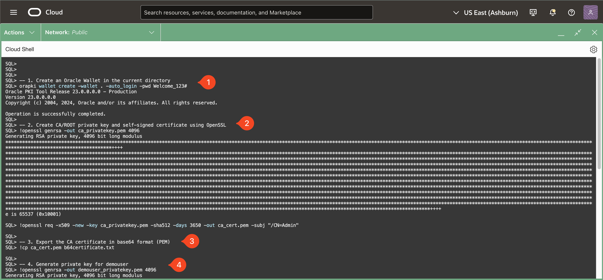
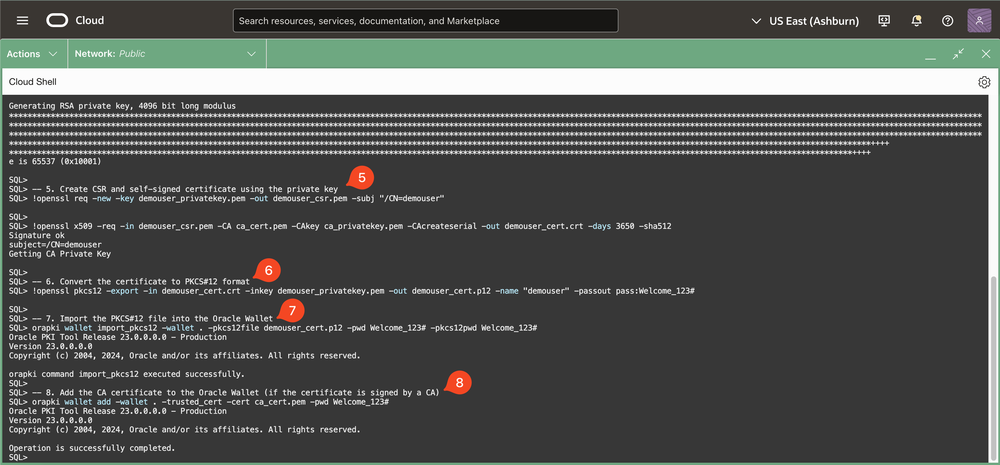
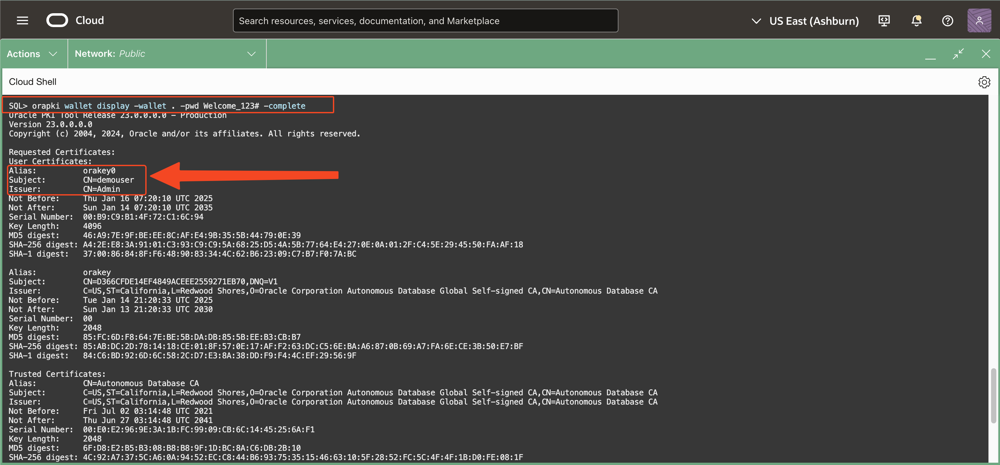
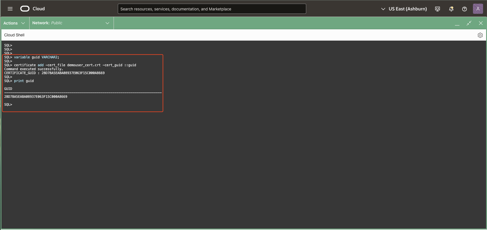
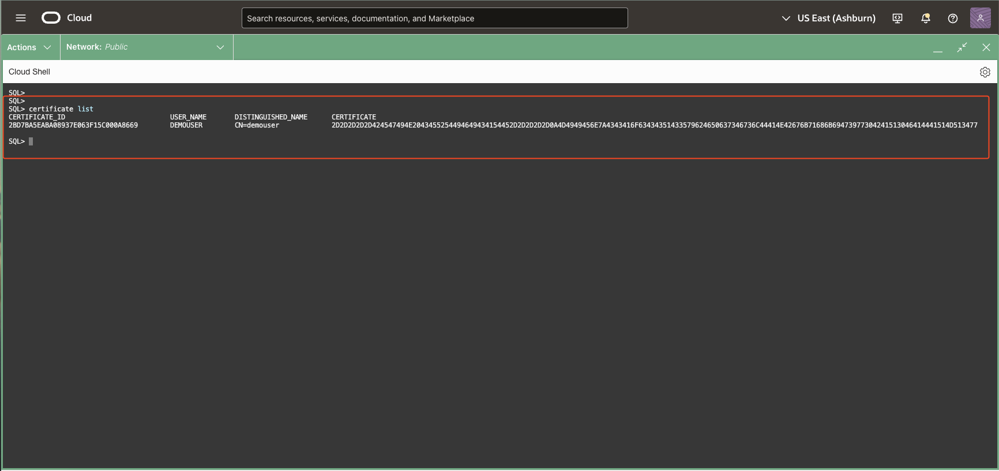
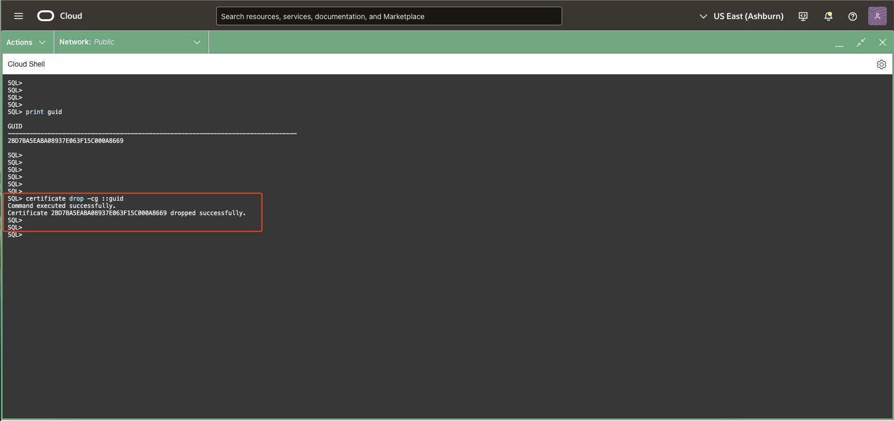

# Blockchain Table Prerequisites: Public Key Infrastructure (PKI) Certificates

## **Introduction**

By completing these prerequisites, you establish a foundation for Blockchain Table functionality, allowing the database to manage tamper-resistant data and support cryptographic operations seamlessly. The setup process is a critical step in preparing your database to support robust, immutable storage with advanced verification capabilities.

* Estimated Time: 15 minutes

Watch the video below for a quick walk through of the lab.

[Certificates](videohub:1_3u8xev49:medium)

### Objectives

In this lab, you will:

- **Execute Test Scripts to Manage Wallets** <br />
  Run scripts to create wallets and add certificates as required for Blockchain Table operations.

- **Manage Certificates for Blockchain Tables** <br />
  Learn to handle certificates, including their creation, addition, and removal.

- **Add and Remove Certificates from the `user_certs$` Table** <br />
  Understand the process of modifying the `user_certs$` table to manage certificates effectively.

### Prerequisites

* A Free-Tier or LiveLabs Oracle Cloud account.
* Have successfully completed the previous labs.

## Task 1: Managing Certificates for Blockchain Tables

To enable cryptographic signing and verification in Blockchain Tables, managing certificates is a crucial step. Certificates are used to digitally sign rows and validate the authenticity of data, ensuring tamper-resistant and traceable records. The **`DBMS_USER_CERTS`** package provides APIs for adding and deleting certificates, offering database users flexibility in managing the cryptographic credentials required for Blockchain Tables.

---

### **Why Add Certificates?**

---

Adding certificates to the database is essential as they form the foundation for enabling signature-based row verification in Blockchain Tables. Certificates represent the identity of the user or system performing the signing, and their cryptographic details are used to generate and validate digital signatures. Here’s why adding certificates is necessary:

- **Digital Signatures for Blockchain Rows**:
	- Each row in a Blockchain Table can be digitally signed to ensure its integrity and authenticity.
	- The certificate associated with the signature must be present in the database to verify the validity of the signature.
  
- **Certificate Retention for Historical Data**:
  	- Even if a certificate expires, it must remain in the database until all rows signed with it are deleted. This ensures that historical rows can still be verified.

- **Multi-User Scenarios**:
  	- Certificates allow different users or systems to sign and verify rows independently. Each certificate is uniquely identified with a **Global Unique Identifier (GUID)**, enabling clear ownership and usage tracking.

In this task, we will use **SQLcl commands** to add, drop, and list certificates required for Blockchain Tables. These commands are extensions of the `DBMS_USER_CERTS` PL/SQL package, which provides APIs to manage certificates for cryptographic operations. Certificates are essential for enabling digital signatures and verifying the integrity of data in Blockchain Tables.

---

### **Creating a Wallet and Certificates in CloudShell**

---

We will create a wallet containing certificates and private key pairs in the CloudShell local directory. This wallet will be used to add certificates to the `user_certs$` table. Follow the steps below to perform wallet creation and certificate generation. These commands need to be run from **SQLcl**.

#### Steps:

```
	<copy>
	-- 1. Create an Oracle Wallet in the current directory
	orapki wallet create -wallet . -auto_login -pwd Welcome_123#

	-- 2. Create a CA/ROOT private key and self-signed certificate using OpenSSL
	!openssl genrsa -out ca_privatekey.pem 4096
	!openssl req -x509 -new -key ca_privatekey.pem -sha512 -days 3650 -out ca_cert.pem -subj "/CN=Admin"

	-- 3. Export the CA certificate in base64 format (PEM)
	!cp ca_cert.pem b64certificate.txt

	-- 4. Generate a private key for demouser
	!openssl genrsa -out demouser_privatekey.pem 4096

	-- 5. Create a certificate signing request (CSR) and a self-signed certificate using the private key
	!openssl req -new -key demouser_privatekey.pem -out demouser_csr.pem -subj "/CN=demouser"
	!openssl x509 -req -in demouser_csr.pem -CA ca_cert.pem -CAkey ca_privatekey.pem -CAcreateserial -out demouser_cert.crt -days 3650 -sha512

	-- 6. Convert the certificate to PKCS#12 format
	!openssl pkcs12 -export -in demouser_cert.crt -inkey demouser_privatekey.pem -out demouser_cert.p12 -name "demouser" -passout pass:Welcome_123#

	-- 7. Import the PKCS#12 file into the Oracle Wallet
	orapki wallet import_pkcs12 -wallet . -pkcs12file demouser_cert.p12 -pwd Welcome_123# -pkcs12pwd Welcome_123#

	-- 8. Add the CA certificate to the Oracle Wallet
	orapki wallet add -wallet . -trusted_cert -cert ca_cert.pem -pwd Welcome_123#
	</copy>
```




<pre>
Notes:
	- The wallet's password is `Welcome_123#`.
	- This script above involves:
		- Creating an Oracle wallet in the local directory.
		- Generating a CA/Root private key and self-signed certificate.
		- Exporting the CA certificate in base64 format.
		- Generating a private key for `demouser`.
		- Creating a CSR and a self-signed certificate for `demouser`.
		- Converting the certificate to PKCS#12 format.
		- Importing the PKCS#12 file into the Oracle Wallet.
		- Adding the CA certificate to the Oracle Wallet.
		- Displaying the wallet's contents for verification.
		- The `demouser` certificate is stored as `demouser_cert.crt`.
		- The `demouser` private key is stored as `demouser_privatekey.pem`.
</pre>
---

### **Viewing the Wallet Contents**

---

You can view the contents of the wallet using the `orapki wallet display` command. Please note the alias for the demouser user certificate for future operations. (i.e. orakey0 in the image below)

```bash
	<copy>
	orapki wallet display -wallet . -pwd Welcome_123# -complete
	</copy>
```


---

### **SQLcl Commands for Managing Certificates**

---

The SQLcl commands provide a user-friendly way to interact with certificates, offering functionality equivalent to the following `DBMS_USER_CERTS` PL/SQL subprograms:
	- **`ADD_CERTIFICATE` Procedure** → `certificate add`
	- **`DROP_CERTIFICATE` Procedure** → `certificate drop`

These commands simplify certificate management without requiring complex PL/SQL scripts. Below is a detailed explanation of the SQLcl commands.


---

#### **Adding Certificates**

---

The **`certificate add`** command allows users to add an X.509 certificate, which will be used for signature verification in Blockchain Tables. This is equivalent to the `ADD_CERTIFICATE` PL/SQL procedure.

#### Usage:
<pre>
	certificate add {OPTIONS}
</pre>

#### Options:
- **`-cert_file|-cf <cert_file>` (Required):** Specifies the X.509 certificate file used for signature verification.
- **`-cert_guid|-cg <cert_guid>` (Optional):** Species the bind variable used to store the generated GUID.
- **`-wallet_path|-wallet <wallet_path>` (Optional):** Specifies the local wallet's path where the certificate is stored.
- **`-wallet_password|-walletpw <wallet_password>` (Optional):** Provides the password for accessing the wallet. If not provided, the system will prompt for it interactively.
- **`-wallet_certificate_alias|-walletcertalias <alias>` (Optional):** Specifies an alias for the certificate being added.

#### Example:
Adding certificate using certificate file and storing the guid in a bind variable 
	```
		<copy>
		variable guid VARCHAR2;

		certificate add -cert_file demouser_cert.crt -cert_guid ::guid

		print guid
		</copy>
	```


> **Expected Output:**  
> <pre>
> SQL> variable guid VARCHAR2;  
> SQL>   
> SQL> certificate add -cert_file demouser_cert.crt -cert_guid ::guid  
> Command executed successfully.  
> CERTIFICATE_GUID : &lt;RANDOM_GUID&gt;
> SQL>   
> SQL> print guid  
>   
> GUID  
> --------------------------------------------------------------------------------~
> &lt;RANDOM_GUID&gt;</pre>


---

#### **Listing Certificates**

---

The **`certificate list`** command lists all certificates that have been added to the database and can be used for signature verification in Blockchain Tables.

### Usage:
<pre>
	certificate list|ls
</pre>

### Example:
List Certificates
	```
	<copy>
	certificate list
	</copy>
	```


> **Expected Output:**  
> <pre>
> CERTIFICATE_ID                          USER_NAME       DISTINGUISHED_NAME      CERTIFICATE  
> ----------------------------------------------------------------------------------------------~
> &lt;RANDOM_GUID&gt;                           DEMOUSER        CN=demouser             &lt;RANDOM_BYTES&gt;  </pre>


---

#### **Dropping Certificates**

---

The **`certificate drop`** command allows users to delete a certificate using its GUID. This command is equivalent to the `DROP_CERTIFICATE` procedure in the `DBMS_USER_CERTS` PL/SQL package.

### Usage:
<pre>
certificate drop {OPTIONS}
</pre>

### Options:
- **`-cert_guid|-cg <cert_guid>` (Required):** The GUID of the certificate to be dropped.

### Example:
Dropping certificate using bind variable used in previous step
	```
	<copy>
	certificate drop -cert_guid ::guid
	</copy>
	```


> **Expected Output:**  
> <pre>
> Command executed successfully.  
> Certificate 2D897A3B6BFD4EB9E063F45E000A80E9 dropped successfully.</pre>

Managing certificates is a vital step in enabling secure cryptographic operations in Blockchain Tables. By using SQLcl commands such as `certificate add`, `certificate drop`, and `certificate list`, users can efficiently perform these tasks with minimal complexity. These commands extend the functionality of the `DBMS_USER_CERTS` PL/SQL package, making certificate management accessible and user-friendly for all database users.


You may now [proceed to the next lab](#next).

## Other Certificate commands

<details>
<summary><mark>Adding a Copy of a Certificate to the Database</mark></summary>

The **`certificate add_copy`** command is used to copy an X.509 certificate from one pluggable database to another while retaining its original Global Unique Identifier (GUID). This ensures consistency in signature verification for Blockchain Tables across replicated or migrated environments.

#### Usage:
<pre>
certificate add_copy {OPTIONS}
</pre>

<details>
<summary>**Options:**</summary>
- **`-cert_file|-cf <cert_file>` (Required):** Specifies the X.509 certificate file to be copied into the database. This file is used for signature verification.
- **`-cert_guid|-cg <cert_guid>` (Required):** Specifies the GUID of the certificate being copied. The original GUID is preserved for consistency across databases.
- **`-username|-uname <username>` (Optional):** Specifies the database user under whose schema the certificate will be added. If omitted, the certificate is added to the current user's schema.
</details>
</br>

#### Key Notes:
1. This command is equivalent to the **`DBMS_USER_CERTS.ADD_COPY`** PL/SQL procedure.
2. The certificate GUID is preserved to maintain compatibility for verifying signatures in replicated Blockchain Tables.

By using the **`add_copy`** command, you can ensure seamless integration of certificates across pluggable databases, enabling consistent and secure signature verification in distributed environments.
</details>
</br>

You may now [proceed to the next lab](#next).

## Learn More

* For more information on managing certificates, including adding, dropping, and other related procedures, please see the [DBMS\_USER\_CERTS](https://docs.oracle.com/en/database/oracle/oracle-database/23/arpls/dbms_user_certs.html) documentation and SQLcl help section accessed using **`help certificate`** in the SQLcl console.


## Acknowledgements

* **Contributors** - Amit Ketkar, Pavas Navaney, Vinay Pandhariwal 
* **Created By/Date** - Vinay Pandhariwal, March 2025
* **Last Updated By/Date** - Vinay Pandhariwal, March 2025
