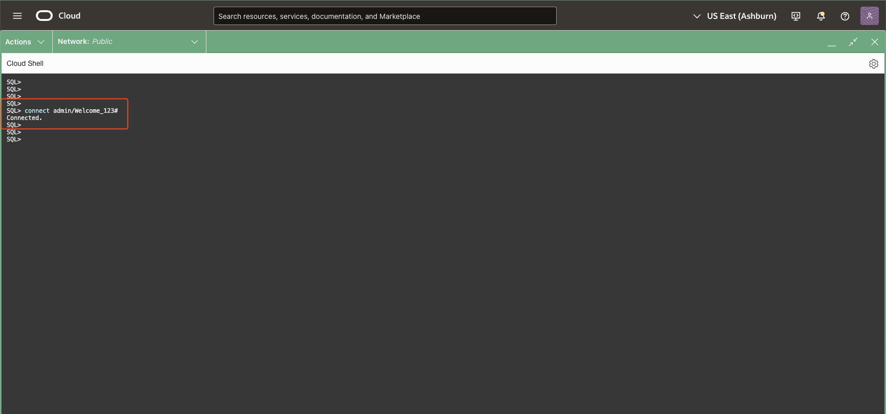
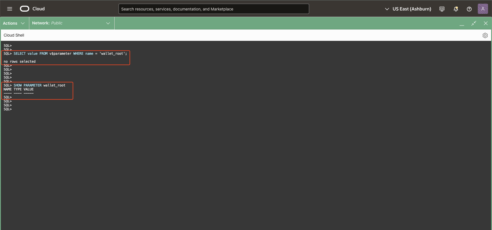

# Blockchain Table Prerequisites : Introduction to Blockchain Table Wallet and Certificates.

Setting up Blockchain Tables in Oracle Database requires configuring certain prerequisites to enable their advanced cryptographic features. A key component of this setup is the creation of a wallet, which securely stores the cryptographic keys and certificates required for signing and verifying data within Blockchain Tables. This wallet ensures that every operation involving cryptographic integrity—such as row signing or digest verification—remains secure and traceable.

By completing these prerequisites, you establish a foundation for Blockchain Table functionality, allowing the database to manage tamper-proof data and support cryptographic operations seamlessly. The setup process is a critical step in preparing your database to support robust, immutable storage with advanced verification capabilities. One critical prerequisite is enabling wallet functionality through the WALLET_ROOT initialization parameter, which specifies the root directory for storing and managing Oracle wallets.

Estimated Time: XX minutes

Watch the video below for a quick walk through of the lab.

[](youtube:)

### Objectives

In this lab, you will:

- **Verify or Configure Initialization Parameters for Blockchain Tables** <br />
  Ensure that the required parameters are properly set for working with Blockchain Tables.

- **Create a Wallet at a Specified Location** <br />
  Learn how to generate a wallet for secure operations and manage its location.

- **Understand Wallet Locations** <br />
  Distinguish between the primary wallet at the `WALLET_ROOT` location and a secondary wallet in an alternate location.

- **Execute Test Scripts to Manage Wallets** <br />
  Run scripts to create wallets and add certificates as required for Blockchain Table operations.

- **Manage Certificates for Blockchain Tables** <br />
  Learn to handle certificates, including their creation, addition, and removal.

- **Add and Remove Certificates from the `user_certs$` Table** <br />
  Understand the process of modifying the `user_certs$` table to manage certificates effectively.

### Prerequisites

* LiveLabs Cloud Account
* Have successfully completed the previous labs

## Task 1: Oracle Initialization Parameters and WALLET_ROOT

Oracle Database uses initialization parameters to configure and manage database behavior. For Blockchain Tables, the WALLET_ROOT parameter plays a pivotal role by defining the directory where Oracle wallets are stored. These wallets act as secure storage for certificates, keys, and other cryptographic material required for Blockchain operations.

### Key Details About `WALLET_ROOT`

- **Definition:** Specifies the root directory for the wallet infrastructure used by the database instance.
- **Importance for Blockchain Tables:** Ensures the database can store and manage the cryptographic keys and certificates required for Blockchain operations.

1. You will need admin access to check/modify the initilization parameters, please connect to ADMIN user using the command and password set in Lab1-Task 2 -Step 3. in this case password is **Welcome_123#**.
	- To connect from SQLcl
	```
	<copy>
	connect admin/<ADMIN_PASSWORD>
	</copy>
	```
	

2. Check If WALLET_ROOT Is Already Configured.
	
    Before proceeding to configure the WALLET_ROOT parameter, you can check if it has already been set. Use the following SQL command to verify its value:

	```
	<copy>
	SELECT value FROM v$parameter WHERE name = 'wallet_root';
	</copy>
	```
	or 
	```
	<copy>
	SHOW PARAMETER wallet_root
	</copy>
	```
	- If the query returns a **valid directory path**, the wallet functionality is already configured, and you can skip the parameter setup step.
	

    - If the query returns **NULL** or an empty value, proceed with the steps below to configure `WALLET_ROOT`.
	

3. **Configuring `WALLET_ROOT`:**

	1. Create the wallet directory at a desired path accessible to the database.
    2. Set the parameter dynamically using the following command:
     ```
	 <copy>
     ALTER SYSTEM SET WALLET_ROOT = '/work/<pdb>/bctable' SCOPE = BOTH;
	 </copy>
     ```

By ensuring the WALLET_ROOT parameter is properly configured, you establish a secure cryptographic environment for Blockchain Table functionality. This is the first step in enabling tamper-proof data storage and advanced verification capabilities. If the parameter is already set, you can proceed directly to wallet initialization and certificate management.

## Task 2: Understanding about Oracle Wallets and Blockchain Table wallet.

Oracle Wallets play a critical role in managing the cryptographic credentials required for Blockchain Tables. They securely store the **PKI private key** and **certificate** of the Blockchain Table owner, which are essential for cryptographic operations such as signing and verifying rows. Proper wallet configuration ensures secure and seamless Blockchain Table functionality.

#### Key Requirements for Blockchain Table Wallets:

- **Storing the Wallet**:
	- The wallet containing the private key and certificate must be stored in a specific directory based on the database configuration:
		- **Non-CDB Environment:** The wallet must be located in the `WALLET_ROOT/bctable/` directory.
		- **PDB Environment:** The wallet must be stored in the `WALLET_ROOT/pdb_guid/bctable/` directory, where `pdb_guid` is the unique identifier (GUID) of the PDB that contains the Blockchain Table.
- **Directory Structure:**
	- The `WALLET_ROOT` parameter specifies the root directory for wallet storage.
	- For multi-tenant databases, `WALLET_ROOT` defines a hierarchical structure with subdirectories for each PDB, ensuring logical separation and secure storage of wallets associated with different PDBs.

#### Example Directory Structure:

Assuming `WALLET_ROOT` is set to `/work/pdb/`:
- For a Non-CDB instance:
	```
		/work/pdb/bctable/
	```
- For a PDB with GUID `1234567890ABCDEF`:
	```
		/work/pdb/1234567890ABCDEF/bctable/
	```

#### Importance of Wallet Configuration:
- Ensures that private keys and certificates are securely managed and readily available for Blockchain Table operations.
- Maintains strict isolation between wallets of different PDBs in multi-tenant environments, enhancing security.
- Provides a centralized and structured approach to cryptographic key and certificate management.


## Task 3: Managing Certificates for Blockchain Tables

To enable cryptographic signing and verification in Blockchain Tables, managing certificates is a crucial step. Certificates are used to digitally sign rows and validate the authenticity of data, ensuring tamper-proof and traceable records. The **`DBMS_USER_CERTS`** package provides APIs for adding and deleting certificates, offering database users flexibility in managing the cryptographic credentials required for Blockchain Tables.

---

### **Why Add Certificates?**

---

Adding certificates to the database is essential as they form the foundation for enabling signature-based row verification in Blockchain Tables. Certificates represent the identity of the user or system performing the signing, and their cryptographic details are used to generate and validate digital signatures. Here’s why adding certificates is necessary:

- **Digital Signatures for Blockchain Rows**:
  - Each row in a Blockchain Table can be digitally signed to ensure its integrity and authenticity.
  - The certificate associated with the signature must be present in the database to verify the validity of the signature.
  
- **Certificate Retention for Historical Data**:
  - Even if a certificate expires, it must remain in the database until all rows signed with it are deleted. This ensures that historical rows can still be verified.

- **Multi-User Scenarios**:
  - Certificates allow different users or systems to sign and verify rows independently. Each certificate is uniquely identified with a **Global Unique Identifier (GUID)**, enabling clear ownership and usage tracking.

In this task, we will use **SQLcl commands** to add, drop, and list certificates required for Blockchain Tables. These commands are extensions of the `DBMS_USER_CERTS` PL/SQL package, which provides APIs to manage certificates for cryptographic operations. Certificates are essential for enabling digital signatures and verifying the integrity of data in Blockchain Tables.

---

### **Creating a Wallet and Certificates in CloudShell**

---

We will create a wallet containing certificates and private key pairs in the CloudShell local directory. This wallet will be used to add certificates to the `user_certs$` table. Follow the steps below to perform wallet creation and certificate generation. These commands need to be run from **SQLcl**.

#### Steps:

```
	<copy>
	-- 1. Create an Oracle Wallet in the current directory
	orapki wallet create -wallet . -auto_login -pwd Welcome_123#

	-- 2. Create a CA/ROOT private key and self-signed certificate using OpenSSL
	!openssl genrsa -out ca_privatekey.pem 4096
	!openssl req -x509 -new -key ca_privatekey.pem -sha512 -days 3650 -out ca_cert.pem -subj "/CN=Admin"

	-- 3. Export the CA certificate in base64 format (PEM)
	!cp ca_cert.pem b64certificate.txt

	-- 4. Generate a private key for demouser
	!openssl genrsa -out demouser_privatekey.pem 4096

	-- 5. Create a CSR and a self-signed certificate using the private key
	!openssl req -new -key demouser_privatekey.pem -out demouser_csr.pem -subj "/CN=demouser"
	!openssl x509 -req -in demouser_csr.pem -CA ca_cert.pem -CAkey ca_privatekey.pem -CAcreateserial -out demouser_cert.crt -days 3650 -sha512

	-- 6. Convert the certificate to PKCS#12 format
	!openssl pkcs12 -export -in demouser_cert.crt -inkey demouser_privatekey.pem -out demouser_cert.p12 -name "demouser" -passout pass:Welcome_123#

	-- 7. Import the PKCS#12 file into the Oracle Wallet
	orapki wallet import_pkcs12 -wallet . -pkcs12file demouser_cert.p12 -pwd Welcome_123# -pkcs12pwd Welcome_123#

	-- 8. Add the CA certificate to the Oracle Wallet
	orapki wallet add -wallet . -trusted_cert -cert ca_cert.pem -pwd Welcome_123#
	</copy>
```


### Notes:

	- The wallet's password is `Welcome_123#`.
	- This script above involves:
		- Creating an Oracle wallet in the local directory.
		- Generating a CA/Root private key and self-signed certificate.
		- Exporting the CA certificate in base64 format.
		- Generating a private key for `demouser`.
		- Creating a CSR and a self-signed certificate for `demouser`.
		- Converting the certificate to PKCS#12 format.
		- Importing the PKCS#12 file into the Oracle Wallet.
		- Adding the CA certificate to the Oracle Wallet.
		- Displaying the wallet's contents for verification.
		- The `demouser` certificate is stored as `demouser_cert.crt`.
		- The `demouser` private key is stored as `demouser_privatekey.pem`.

---

### **Viewing the Wallet Contents**

---

You can view the contents of the wallet using the `orapki wallet display` command. Please note the alias for the demouser user certificate for future operations. (i.e. orakey0 in the image below)

```
	<copy>
	orapki wallet display -wallet . -pwd Welcome_123# -complete
	</copy>
```


---

### **SQLcl Commands for Managing Certificates**

---

The SQLcl commands provide a user-friendly way to interact with certificates, offering functionality equivalent to the following `DBMS_USER_CERTS` PL/SQL subprograms:
	- **`ADD_CERTIFICATE` Procedure** → `certificate add`
	- **`DROP_CERTIFICATE` Procedure** → `certificate drop`

These commands simplify certificate management without requiring complex PL/SQL scripts. Below is a detailed explanation of the SQLcl commands.


---

#### **Adding Certificates**

---

The **`certificate add`** command allows users to add an X.509 certificate, which will be used for signature verification in Blockchain Tables. This is equivalent to the `ADD_CERTIFICATE` PL/SQL procedure.

#### Usage:
```
	certificate add {OPTIONS}
```

#### Options:
- **`-cert_file|-cf <cert_file>` (Required):** Specifies the X.509 certificate file used for signature verification.
- **`-cert_guid|-cg <cert_guid>` (Optional):** Species the bind variable used to store the generated GUID.
- **`-wallet_path|-wallet <wallet_path>` (Optional):** Specifies the local wallet's path where the certificate is stored.
- **`-wallet_password|-walletpw <wallet_password>` (Optional):** Provides the password for accessing the wallet. If not provided, the system will prompt for it interactively.
- **`-wallet_certificate_alias|-walletcertalias <alias>` (Optional):** Specifies an alias for the certificate being added.

#### Example:
Adding certificate using certificate file and storing the guid in a bind variable 
	```
		<copy>
		variable guid VARCHAR2;

		certificate add -cert_file demouser_cert.crt -cert_guid ::guid

		print guid
		</copy>
	```


---

#### **Listing Certificates**

---

The **`certificate list`** command lists all certificates that have been added to the database and can be used for signature verification in Blockchain Tables.

### Usage:
```
	certificate list|ls
```

### Example:
List Certificates
	```
	<copy>
	certificate list
	</copy>
	```


---

#### **Dropping Certificates**

---

The **`certificate drop`** command allows users to delete a certificate using its GUID. This command is equivalent to the `DROP_CERTIFICATE` procedure in the `DBMS_USER_CERTS` PL/SQL package.

### Usage:
```
certificate drop {OPTIONS}
```

### Options:
- **`-cert_guid|-cg <cert_guid>` (Required):** The GUID of the certificate to be dropped.

### Example:
Dropping certificate using bind variable used in previous step
	```
	<copy>
	certificate drop -cert_guid ::guid
	</copy>
	```
	


Managing certificates is a vital step in enabling secure cryptographic operations in Blockchain Tables. By using SQLcl commands such as `certificate add`, `certificate drop`, and `certificate list`, users can efficiently perform these tasks with minimal complexity. These commands extend the functionality of the `DBMS_USER_CERTS` PL/SQL package, making certificate management accessible and user-friendly for all database users.


You may now [proceed to the next lab](#next).

## Other Certificate commands

<details>
<summary><mark>Adding a Copy of a Certificate to the Database</mark></summary>

The **`certificate add_copy`** command is used to copy an X.509 certificate from one pluggable database to another while retaining its original Global Unique Identifier (GUID). This ensures consistency in signature verification for Blockchain Tables across replicated or migrated environments.

#### Usage:
```
certificate add_copy {OPTIONS}
```

<details>
<summary>**Options:**</summary>
- **`-cert_file|-cf <cert_file>` (Required):** Specifies the X.509 certificate file to be copied into the database. This file is used for signature verification.
- **`-cert_guid|-cg <cert_guid>` (Required):** Specifies the GUID of the certificate being copied. The original GUID is preserved for consistency across databases.
- **`-username|-uname <username>` (Optional):** Specifies the database user under whose schema the certificate will be added. If omitted, the certificate is added to the current user's schema.
</details>
</br>

#### Key Notes:
1. This command is equivalent to the **`DBMS_USER_CERTS.ADD_COPY`** PL/SQL procedure.
2. The certificate GUID is preserved to maintain compatibility for verifying signatures in replicated Blockchain Tables.

By using the **`add_copy`** command, you can ensure seamless integration of certificates across pluggable databases, enabling consistent and secure signature verification in distributed environments.
</details>
</br>


## Learn More

* For more information on managing certificates, including adding, dropping, and other related procedures, please see the [DBMS\_USER\_CERTS](https://docs.oracle.com/en/database/oracle/oracle-database/23/arpls/dbms_user_certs.html) documentation and SQLcl help section accessed using **`help certificate`** in the SQLcl console.


## Acknowledgements

* **Author** - Amit Ketkar, Pavas Navaney, Vinay Pandhariwal
* **Contributors** - Pavas Navaney, Vinay Pandhariwal 
* **Last Updated By/Date** - Vinay Pandhariwal, Member of Technical Staff
