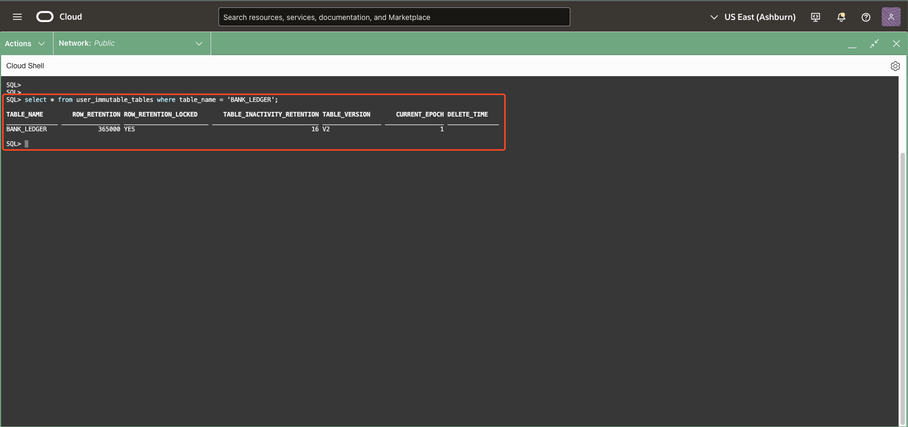
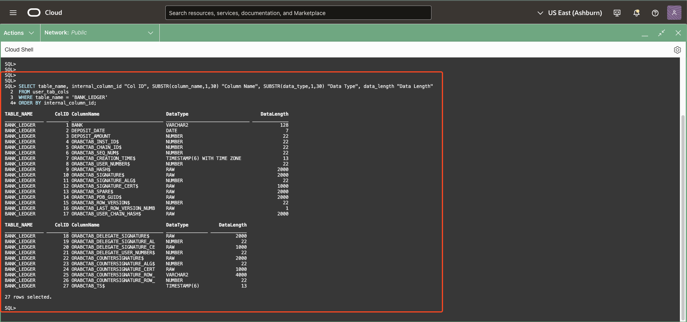

# Immutable Tables : Build the Foundation of tamper-resistant Data Storage

## **Introduction**

**Immutable Tables** in Oracle Database are designed as append-only tables that safeguard data against unauthorized or accidental modifications. They provide a foundational level of data protection, ensuring that information remains intact and unaltered once written to the table. This capability is particularly useful for scenarios requiring high data integrity, such as maintaining audit logs, transaction histories, or sensitive compliance-related records.

To enforce immutability, Immutable Tables require the specification of **retention periods** at two levels: the table and the individual rows. Rows within the table can only be deleted after their retention period has elapsed, and the table itself can only be dropped if it contains no rows or once the table-level retention period has passed with no rows being inserted during that period. These strict controls eliminate the possibility of tampering or accidental data loss during the defined retention period, making Immutable Tables a reliable choice for preserving historical data.

#### Key Characteristics of Immutable Tables:
- **Append-Only Design:** Data is write-once , ensuring that once written, it cannot be updated or deleted until retention conditions are met.
- **Retention Periods:** Administrators specify retention periods for both the table and its rows, controlling when data becomes eligible for deletion.

#### Practical Use Cases:
- **Preventing Accidental Modifications:** Immutable Tables protect against human errors that could lead to unintentional data changes.
- **Regulatory Compliance:** They support industries with stringent data integrity requirements, ensuring records remain tamper-resistant for auditing purposes.
- **Secure Audit Trails:** Immutable Tables provide a trusted, unmodifiable source of truth for monitoring and compliance.

While Immutable Tables deliver robust data immutability and protection, they represent a foundational step in Oracle’s in-database security. For more advanced capabilities, such as cryptographic signing and distributed trust, Blockchain Tables build on this concept, adding additional layers of security and functionality. 

In this LiveLab, we will use **SQLcl** to perform various operations on Immutable Tables, leveraging its intuitive and user-friendly interface. The dedicated command for managing Immutable Tables is **<code> immutable_table | im </code>**. SQLcl offers powerful features such as **Completion Insight (TAB)** for command suggestions, **Command History** to revisit previous commands, and an **In-Line Editor** for easy modifications, ensuring a smooth and efficient workflow. For additional guidance, you can access the help section directly in the SQLcl console by typing **<code>"help immutable_table" </code>** or **<code> "help im" </code>**. This provides a comprehensive overview of all commands and functionalities, making it easier to explore and manage Immutable Tables throughout the LiveLab.

* Estimated Time: 25 minutes

Watch the video below for a quick introduction to Immutable Tables and a walkthrough of the lab.

[Immutable Tables](videohub:1_bg8039ja:medium)


### Objectives

In this lab, you will:

* **Create the Immutable Table**  <br />
  Learn how to define and set up an Immutable Table, including specifying the retention periods for the table and its rows. 

* **Use SQLcl Commands to Perform Operations**  <br />
  Explore how SQLcl simplifies interactions with Immutable Tables by using user-friendly commands to manage and query the table.

* **Describe the Details of an Immutable Table**  <br />
  Retrieve and analyze metadata about the Immutable Table, including retention settings, table structure, and properties.

* **Attempt Premature Operations**  <br />
  Test the immutability of the table by attempting to prematurely drop the table or delete rows before the retention period expires, and observe the failure scenarios that protect data integrity.

### Prerequisites

* A Free-Tier or LiveLabs Oracle Cloud account.
* Have successfully completed the previous labs.

## Task 1: Create an Immutable Table

---

1. The `CREATE IMMUTABLE TABLE` statement requires additional attributes. The `NO DROP` and `NO DELETE` clauses are mandatory while `VERSION` clause is optional with default value being `V1` . “NO DELETE LOCKED” means that no rows can be deleted and LOCKED means that this setting can not be changed using ALTER TABLE later. <br/>
    Copy and paste the command in Oracle Cloud Shell  to create an Immutable table named `bank_ledger` that will maintain a tamper-resistant ledger of current and historical transactions. In the below command, rows of the `bank_ledger` immutable table can never be deleted and the `bank_ledger` table can be dropped only after 16 days of inactivity. 

    ```
    <copy>
    CREATE IMMUTABLE TABLE bank_ledger (bank VARCHAR2(128), deposit_date DATE, deposit_amount NUMBER)
    NO DROP UNTIL 16 DAYS IDLE
    NO DELETE LOCKED VERSION "V2";
    </copy>
    ```

    

    > **Expected Output:**
    > <pre>
    > Immutable TABLE created.</pre>


2. Run the following command to view that the table's clauses and if it is created. Note that the description displays only the visible columns.

    ```
    <copy>
    immutable_table desc -table_name bank_ledger
    </copy>
     ```
    

    > **Expected Output:**
    > <pre>
    > Immutable table 'bank_ledger'
    > -----------------------------~
    > 
    > 
    > COLUMN_NAME     NULL?   DATA_TYPE
    > --------------  -----   ---------
    > BANK                    VARCHAR2 
    > DEPOSIT_DATE            DATE     
    > DEPOSIT_AMOUNT          NUMBER   
    > 
    > Other Attributes: 
    > ------------------~
    > ROW RETENTION (DAYS)              : 365000
    > ROW RETENTION LOCKED              : YES
    > TABLE INACTIVITY RETENTION (DAYS) : 16
    > TABLE VERSION                     : V2</pre>

## Task 2: Insert Rows into the Immutable Table

---

1. Copy and paste the below code snippet in the worksheet and run them to insert records into the `bank_ledger` immutable table.

    ```
    <copy>
    INSERT INTO bank_ledger VALUES ('999',to_date(sysdate,'dd-mm-yyyy'),100);
    INSERT INTO bank_ledger VALUES ('999',to_date(sysdate,'dd-mm-yyyy'),200);
    INSERT INTO bank_ledger VALUES ('999',to_date(sysdate,'dd-mm-yyyy'),500);
    INSERT INTO bank_ledger VALUES ('999',to_date(sysdate,'dd-mm-yyyy'),-200);
    INSERT INTO bank_ledger VALUES ('888',to_date(sysdate,'dd-mm-yyyy'),100);
    INSERT INTO bank_ledger VALUES ('888',to_date(sysdate,'dd-mm-yyyy'),200);
    INSERT INTO bank_ledger VALUES ('888',to_date(sysdate,'dd-mm-yyyy'),500);
    INSERT INTO bank_ledger VALUES ('888',to_date(sysdate,'dd-mm-yyyy'),-200);
    commit;
    </copy>
    ```

    

2. Query the `bank_ledger` immutable table to show the records.

    ```
    <copy>
    select * from bank_ledger;
    </copy>
    ```

    

## Task 3: View Immutable Tables and Its Internal Columns

---

1. Run the command to view the table details.

    ```
    <copy>
    select * from user_immutable_tables where table_name = 'BANK_LEDGER';
    </copy>
    ```

    

2. Use the `USER_TAB_COLS` view to display all internal column names used to store internal information.

    ```
    <copy>
    SELECT table_name, internal_column_id "Col ID", SUBSTR(column_name,1,30) "Column Name", SUBSTR(data_type,1,30) "Data Type", data_length "Data Length"
    FROM user_tab_cols
    WHERE table_name = 'BANK_LEDGER'
    ORDER BY internal_column_id;
    </copy>
    ```

    

    The additional columns ending with $ are Oracle managed to maintain the chained sequence, cryptographic hash values, and support user signing. You can include these columns in your queries by referencing them explicitly.

3. Query the `bank_ledger` immutable table to display all the values in the immutable table including values of internal columns.

    ```
    <copy>
    select bank, deposit_date, deposit_amount, ORABCTAB_INST_ID$,
    ORABCTAB_CHAIN_ID$, ORABCTAB_SEQ_NUM$,
    ORABCTAB_CREATION_TIME$, ORABCTAB_USER_NUMBER$ from bank_ledger;
    </copy>
    ```

    

## Task 4: Manage Rows in an Immutable Table

---

When you try to manage the rows using update, delete, truncate you get the error `operation not allowed on the immutable table` if the rows are within the retention period.

1. Update a record in the `bank_ledger` immutable table by setting deposit\_amount=0.

    ```
    <copy>
    update bank_ledger set deposit_amount=0 where bank=999;
    </copy>
    ```

    
    > **Expected Output:**
    > <pre>
    > 
    > Error starting at line : 1 in command -
    > update bank_ledger set deposit_amount=0 where bank=999
    > Error at Command Line : 1 Column : 8
    > Error report -
    > SQL Error: ORA-05715: operation not allowed on the blockchain or immutable table
    > 
    > https://docs.oracle.com/error-help/db/ora-05715/05715. 0000 -  "operation not allowed on the blockchain or immutable table" 
    > *Cause:    An attempt was made to perform update, delete, alter, truncate,
    >             insert as select, rename, or move operation on a blockchain
    >             or immutable table.
    > *Action:   No action required.
    > 
    > More Details :
    > https://docs.oracle.com/error-help/db/ora-05715/</pre>

2. Delete a record in the `bank_ledger` immutable table.

    ```
    <copy>
    delete from bank_ledger where bank=999;
    </copy>
    ```

    
    > **Expected Output:**  
    > <pre>
    > Error starting at line : 1 in command -  
    > delete from bank_ledger where bank=999  
    > Error at Command Line : 1 Column : 13  
    > Error report -  
    > SQL Error: ORA-05715: operation not allowed on the blockchain or immutable table  
    >   
    > https://docs.oracle.com/error-help/db/ora-05715/05715. 0000 -  "operation not allowed on the blockchain or immutable table"  
    > *Cause:    An attempt was made to perform update, delete, alter, truncate,  
    >            insert as select, rename, or move operation on a blockchain  
    >            or immutable table.  
    > *Action:   No action required.  
    >   
    > More Details :  
    > https://docs.oracle.com/error-help/db/ora-05715/  </pre>


3. Truncating the table `bank_ledger`.

    ```
    <copy>
    truncate table bank_ledger;
    </copy>
    ```

    
    > **Expected Output:**  
    > <pre>
    > Error starting at line : 1 in command -  
    > truncate table bank_ledger  
    > Error report -  
    > ORA-05715: operation not allowed on the blockchain or immutable table  
    >   
    > https://docs.oracle.com/error-help/db/ora-05715/05715. 0000 -  "operation not allowed on the blockchain or immutable table"  
    > *Cause:    An attempt was made to perform update, delete, alter, truncate,  
    >            insert as select, rename, or move operation on a blockchain  
    >            or immutable table.  
    > *Action:   No action required.  </pre>


## Task 5: Manage Immutable Tables

---

Similar to managing rows within the retention period, managing the immutable table using alter, drop will throw an error.

1. Drop the table `bank_ledger`. It will drop successfully if no row exists in the table.

    ```
    <copy>
    drop table bank_ledger;
    </copy>
    ```

    
    > **Expected Output:**  
    > <pre>
    > Error starting at line : 1 in command -  
    > drop table bank_ledger  
    > Error report -  
    > ORA-05723: dropping BANK_LEDGER, which is a non-empty blockchain or immutable table, is not allowed  
    >   
    > https://docs.oracle.com/error-help/db/ora-05723/05723. 0000 -  "dropping %s, which is a non-empty blockchain or immutable table, is not allowed"  
    > *Cause:    A blockchain or immutable table was created with a NO DROP clause,  
    >            or its idle period has not yet elapsed.  
    > *Action:   Do not attempt to drop this blockchain or immutable table, wait  
    >            until its idle period has elapsed, or wait until all its rows are  
    >            expired and deleted.  </pre>


2. Alter the table `bank_ledger` to not delete the rows until 20 days after insert. Copy and paste the below query in the worksheet, highlight the query and then execute the query.

    ```
    <copy>
    ALTER TABLE bank_ledger NO DELETE UNTIL 20 DAYS AFTER INSERT;
    </copy>
    ```

    
    > **Expected Output:**  
    > <pre>
    > Error starting at line : 1 in command -  
    > ALTER TABLE bank_ledger NO DELETE UNTIL 20 DAYS AFTER INSERT  
    > Error report -  
    > ORA-05731: blockchain or immutable table BANK_LEDGER cannot be altered  
    >   
    > https://docs.oracle.com/error-help/db/ora-05731/05731. 0000 -  "blockchain or immutable table %s cannot be altered"  
    > *Cause:    An attempt was made to alter a blockchain or immutable table that  
    >            could not be altered.  
    > *Action:   No action required.  </pre>


3. Create another table `bank_ledger_2` without `LOCKED` keyword. Run the describe query to view this table.

    ```
    <copy>
    CREATE IMMUTABLE TABLE bank_ledger_2 (bank VARCHAR2(128), deposit_date DATE, deposit_amount NUMBER)
    NO DROP UNTIL 16 DAYS IDLE
    NO DELETE UNTIL 16 DAYS AFTER INSERT VERSION "v2";
    </copy>
    ```

    
    > **Expected Output:**
    > <pre>
    > Immutable TABLE created. </pre>

4. ALTER can be used to increase the retention period but not to reduce it. For example, Alter with NO DELETE UNTIL 10 Days After Insert will fail with the error message - “ORA-05731: blockchain or immutable table `<TABLE_NAME>` cannot be altered”.<br />

    Alter the table `bank_ledger_2` by specifying that the rows cannot be deleted until 20 days after they were inserted. Copy and paste the below query in the worksheet, highlight the query and then execute the query.</p>

    ```
    <copy>
    ALTER TABLE bank_ledger_2 NO DELETE UNTIL 20 DAYS AFTER INSERT;
    </copy>
    ```

    
    > **Expected Output:**
    > <pre>
    > Table BANK_LEDGER_2 altered. </pre>


5. In V2 Immutable tables, ALTER can be used to add new columns and drop existing columns. The dropped columns are marked as hidden, rather than actually being dropped.<br /> 
    Copy and paste the below set of query and commands in the Cloud Shell.</p>

    i. Adding a column additional_info
    ```
    <copy>
    ALTER TABLE bank_ledger_2 ADD (additional_info varchar2(50));
    </copy>
    ```
    > **Expected Output:**
    > <pre>
    > Table BANK_LEDGER_2 altered.</pre>

    ii. View the table and its properties.

    ``` 
    <copy>
    im desc -tab bank_ledger_2
    </copy>
    ```
    > **Expected Output:**  
    > <pre>
    > Immutable table 'bank_ledger_2'
    > -------------------------------~
    > 
    > COLUMN_NAME     NULL?   DATA_TYPE
    > --------------- -----   ---------
    > ADDITIONAL_INFO         VARCHAR2 
    > BANK                    VARCHAR2 
    > DEPOSIT_DATE            DATE     
    > DEPOSIT_AMOUNT          NUMBER   
    > 
    > Other Attributes: 
    > ------------------~
    > ROW RETENTION (DAYS)              : 20
    > ROW RETENTION LOCKED              : NO
    > TABLE INACTIVITY RETENTION (DAYS) : 16
    > TABLE VERSION                     : V2</pre>

    

    iii. Drop Column deposit_amount

    ```
    <copy>
     ALTER TABLE bank_ledger_2 DROP COLUMN deposit_amount ;
    </copy>
    ```
    > **Expected Output:**
    > <pre>
    > Table BANK_LEDGER_2 altered. </pre>

    iv. View the table and its properties.

    ``` 
    <copy>
    im desc -tab bank_ledger_2
    </copy>
    ```
    > **Expected Output:**  
    > <pre>
    > Immutable table 'bank_ledger_2'
    > -------------------------------~
    > 
    > COLUMN_NAME     NULL?   DATA_TYPE
    > --------------- -----   ---------
    > ADDITIONAL_INFO         VARCHAR2 
    > BANK                    VARCHAR2 
    > DEPOSIT_DATE            DATE     
    > 
    > Other Attributes: 
    > ------------------~
    > ROW RETENTION (DAYS)              : 20
    > ROW RETENTION LOCKED              : NO
    > TABLE INACTIVITY RETENTION (DAYS) : 16
    > TABLE VERSION                     : V2</pre>


    


6. Run the command to view all the immutable tables.

    ```
    <copy>
    select * from user_immutable_tables;
    </copy>
    ```


    The output shows the following tables and their details:

    - **BANK_LEDGER**: The `CURRENT_EPOCH` is **1**, indicating that the table schema has never been changed since its creation.
    - **BANK\_LEDGER\_2**: The `CURRENT_EPOCH` is **3**, showing that this table’s schema has been revised **twice**, resulting in a total of three epochs.

    >NOTE:    The `CURRENT_EPOCH` column helps track how many times the schema of an immutable table has been updated. This is essential for understanding the versioning and evolution of table structures.


    

## Task 6: Maintenance of the Immutable Tables

---

### **Deleting Expired Rows in Immutable Tables**

---

The **`immutable_table delete_expired_rows`** command removes expired rows from an Immutable Table based on the table’s retention policy. This ensures compliance with data lifecycle management while preserving immutability for rows still under retention. This is equivalent to the **`DBMS_IMMUTABLE_TABLE.DELETE_EXPIRED_ROWS`** PL/SQL procedure

#### Usage:
<pre>
immutable_table delete_expired_rows {OPTIONS}
</pre>

#### Options:
- **`-table_name|-tab <table_name>` (Required):** Specifies the name of the Immutable Table from which expired rows are to be deleted.
- **`-before_timestamp|-before <before_timestamp>` (Optional):** Deletes expired rows with timestamps earlier than the specified value. If not provided, all expired rows are deleted.
- **`-rowcount <rowcount>` (Optional):** Outputs the number of rows deleted.

#### Example:
To delete all expired rows from the table:
    ```bash
    <copy>immutable_table delete_expired_rows -tab bank_ledger_2;</copy>
    ```


> **Expected Output:**  
    > <pre>
    > Command executed successfully.  
    > Deleted 0 expired rows from '"DEMOUSER".bank_ledger_2' immutable table before '2025-02-07T08:02:00.365480Z' timestamp.</pre>


#### Example with Timestamp Filter:
To delete rows that expired before a specific timestamp:
    ```
    <copy>
    immutable_table delete_expired_rows -tab bank_ledger_2 -before '16-JAN-25 01.00.01 AM UTC';
    </copy>
    ```
>NOTE: Timestamps need to be specified as per NLS settings.
> **Expected Output:**  
> <pre>
> Command executed successfully.  
> Deleted 0 expired rows from '"DEMOUSER".bank_ledger_2' immutable table before '16-JAN-25 01.00.01 AM UTC' timestamp.</pre>


#### Example with Row Count Output:
To delete expired rows and display the number of rows deleted:
    ```
    <copy>
    variable rowCount NUMBER;

    immutable_table delete_expired_rows -tab bank_ledger_2 -rowcount ::rowCount;

    print rowCount
    </copy>
    ```
> **Expected Output:**  
    > <pre>
    > SQL> variable rowCount NUMBER;  
    > SQL>   
    > SQL> immutable_table delete_expired_rows -tab bank_ledger_2 -rowcount ::rowCount;  
    > Command executed successfully.  
    > Deleted 0 expired rows from '"DEMOUSER".bank_ledger_2' immutable table before '2025-02-07T08:04:59.601858Z' timestamp.  
    > SQL>   
    > SQL> print rowCount  
    >   
    >   ROWCOUNT  
    > ----------.
    >          0  
    >   
    > SQL>  </pre>


This command simplifies the management of data retention in Immutable Tables, ensuring that expired rows are removed while preserving the integrity of active rows.

You may now [proceed to the next lab](#next).

## Other Immutable Table Commands

<details>
<summary><mark>Adding Interval Partitioning to Immutable Tables</mark></summary>

The **`immutable_table add_interval_partitioning`** command adds interval partitioning to an existing, non-partitioned Immutable Table. This feature automatically creates partitions for new data at regular intervals based on the specified settings, streamlining data management. It is supported for **V1** and **V2 Immutable Tables** starting from database version **23ai**.

#### Usage:
<pre>
immutable_table add_interval_partitioning {OPTIONS}
</pre>

<details>
<summary>**Options:**</summary>
- **`-table_name|-tab <table_name>` (Required):** Specifies the name of the Immutable Table. The table name can be preceded by its schema name. For case-sensitive schema or table names, enclose the full name in double quotes, and individual parts in double, double quotes.
- **`-interval_number|-intnum <interval_number>` (Required):** Defines the interval for partition creation. For example, setting `1` creates a partition every 1 unit of the specified frequency.
- **`-interval_frequency|-intfreq <interval_frequency>` (Required):** Specifies the time unit for the interval. Acceptable values are:
    - `YEAR`
    - `MONTH`
    - `DAY`
    - `HOUR`
    - `MINUTE`
- **`-first_high_timestamp|-firsthigh <first_high_timestamp>` (Required):** A timestamp specifying the upper boundary of the first partition. This timestamp determines the starting point for partition creation.
</details>
</br>

#### Key Notes:
1. This command is equivalent to the **`DBMS_IMMUTABLE_TABLE.ADD_INTERVAL_PARTITIONING`** PL/SQL procedure for programmatic operations.
2. It is only applicable to non-partitioned Immutable Tables.
3. Adding interval partitioning automates partition management, reducing manual overhead for handling large datasets.

By using the **`add_interval_partitioning`** command, you can seamlessly manage time-based data in Immutable Tables, ensuring efficient and scalable performance.
</details>
</br>

You may now [proceed to the next lab](#next).

## Learn more

* For more information on Immutable Table and other Immutable Table commands, please see [DBMS\_IMMUTABLE\_TABLE](https://docs.oracle.com/en/database/oracle/oracle-database/23/arpls/dbms_immutable_table.html) documentation and SQLcl help section accessed using **`help immutable_table`** in the SQLcl console.


## Acknowledgements

* **Contributors** - Amit Ketkar, Pavas Navaney, Vinay Pandhariwal 
* **Created By/Date** - Vinay Pandhariwal, March 2025
* **Last Updated By/Date** - Vinay Pandhariwal, March 2025