# Prepare your environment

## **Introduction**

This lab provides step-by-step instructions to connect to a pre-provisioned Oracle Autonomous Database using SQLcl.

* Estimated time: 5 minutes

Watch the video below for a quick walk-through of the lab.
[Prepare your environment](videohub:1_nw8ufqzp:medium)

> **NOTE**: The video covers the full setup process. Since you are using the **LiveLabs Sandbox**, the Autonomous Database and a user named `DEMOUSER` have already been created for you. You can skip directly to **Task 3** in the video, which starts at **01:50**.

### Objectives

-   Connect to an existing Autonomous Database using Oracle Cloud Shell and SQLcl

### Prerequisites

* Access to a LiveLabs Oracle Cloud account with a sandbox environment

## Task 1: Navigate to Oracle Autonomous Database

1. Log in to the Oracle Cloud Infrastructure Console.

2. Once you are logged in, you are taken to the cloud services dashboard where you can see all the services available to you. Click the navigation menu in the upper left to show top level navigation choices.

    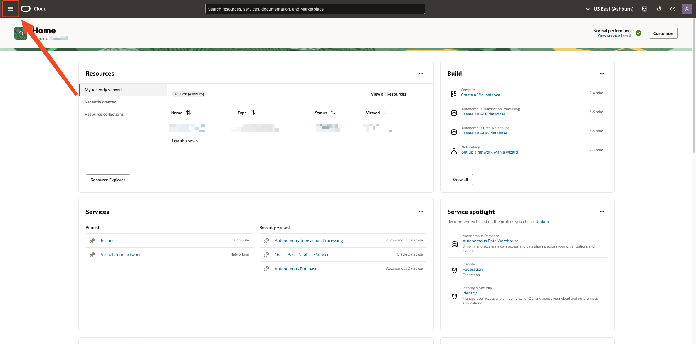

3. The following steps apply to Autonomous Databases. So please **click the Autonomous Database**.

    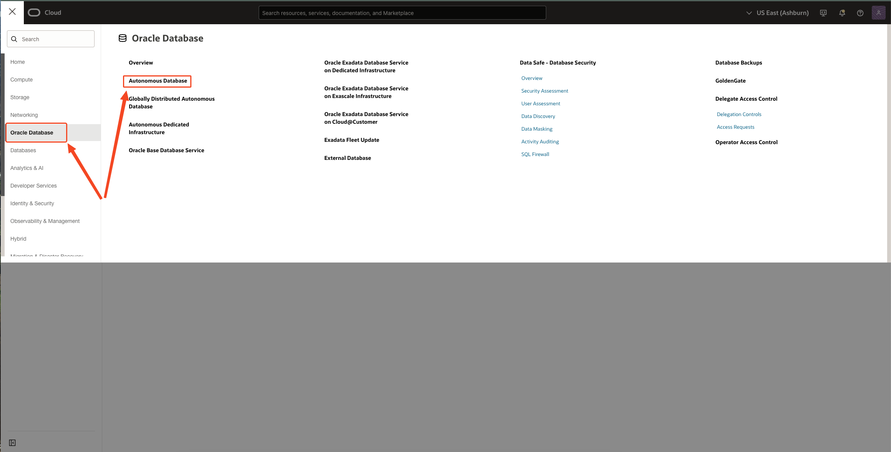

4.  From the **Compartment** filter, select your **LiveLabs environment compartment**. The exact value depends on your environment and is visible in your console, as shown in *Get Started Task 1*.

    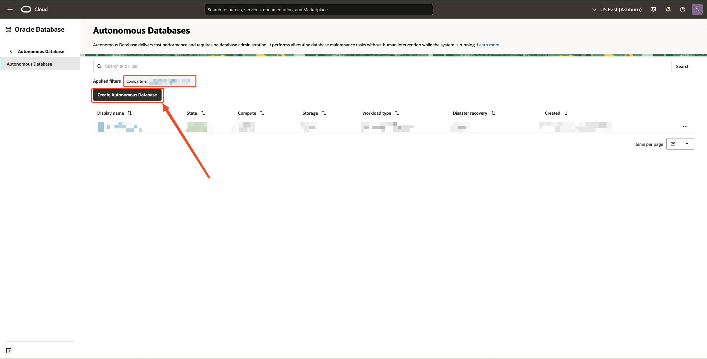

5. Please note the following details about the created Oracle Autonomous Database
    - **Display name** - *`Blockchain-Table-Demo`*.
    - **Database Name** - *`BlockchainTableDemo`*.
    - **Compartment** - As selected in Step 4
    - **Workload Type** - *`Transaction Processing`*.
    - **Always Free** - Enabled.
    - **Database version** - *`23ai`*.
    - **ADMIN PASSWORD** - *`Welcome_123#`*.


## Task 2: Pre-Created Database User

The following user has been set up in the Autonomous Database instance:

- **Username**: *`DEMOUSER`*.  
- **Password**: *`Welcome_123#`*.  
- **Quota on tablespace DATA**: *`500M`*.  

This user has sufficient privileges to complete all lab tasks.

## Task 3: Connect to Autonomous Database using Oracle Cloud Shell and SQLcl

1. On the **Blockchain-Table-Demo ATP** instance details page, click on **Copy** to copy the **OCID** of the ATP instance.  
    

2. In the top-right corner, click on **Developer Tools** and select **Cloud Shell**.  
    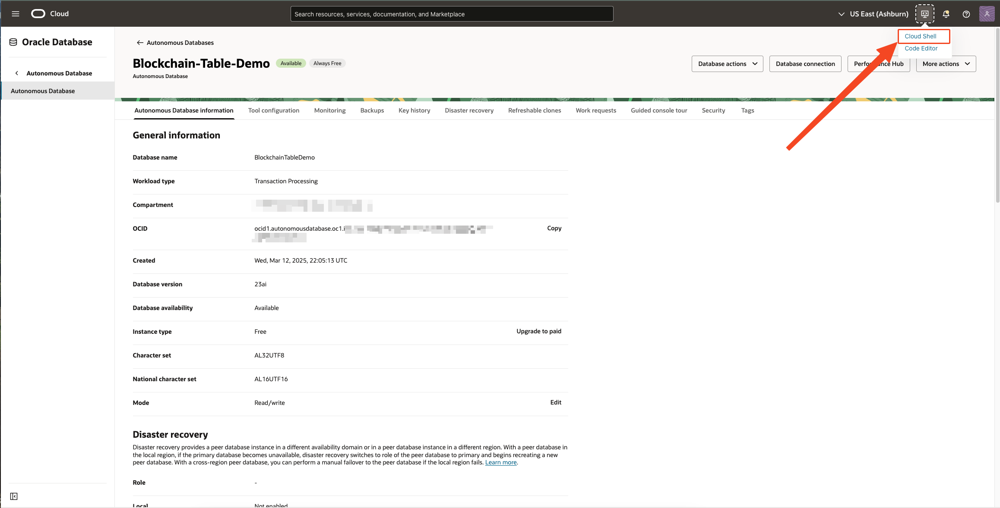

3. Once the **Cloud Shell** interface loads, create a wallet for the ATP instance and store it in the root directory of the Cloud Shell:
    - **autonomous-database-id**: Paste the OCID copied in Step 1 into this field.
    - **file**: Specify the file name for the generated wallet (e.g., **wallet.zip**).
    - **password**: Specify a password for the wallet.

        Enter your values below. The command will update in real time:
        - **Autonomous Database OCID:** <input type="text" id="ocid" placeholder="ocid1.autonomousdatabase.oc1..example" style="width: 30%; padding: 6px; font-size: 14px; border: 1px solid #ccc; border-radius: 4px;" oninput="createWalletCommand()">
        - **File Name:** <input type="text" id="file_name" placeholder="wallet.zip" style="width: 30%; padding: 6px; font-size: 14px; border: 1px solid #ccc; border-radius: 4px;" oninput="createWalletCommand()"> <br/>
        - **Password:** <input type="text" id="password" placeholder="Enter Secure Password" style="width: 30%; padding: 6px; font-size: 14px; border: 1px solid #ccc; border-radius: 4px;" oninput="createWalletCommand()">

        **Generated Command:**
        <pre id="code-container" style="display: flex; align-items: center; background: #f5f5f5; border: 1px solid #ccc; padding: 10px; border-radius: 5px; position: relative; transition: opacity 0.3s;">
        <copy id="code-text">oci db autonomous-database generate-wallet --autonomous-database-id &lt;OCID&gt; --file &lt;FILE_NAME&gt; --password &lt;PASSWORD&gt;</copy>
        <button id="copy-btn" 
                style="position: absolute; right: -10px; top: -10px; background: white; border: 1px solid #ccc; padding: 3px 8px; cursor: pointer; font-size: 15px; border-radius: 3px; transition: background 0.2s, color 0.2s;" 
                onmouseover="this.style.background='grey'; this.style.color='white';" 
                onmouseout="this.style.background='white'; this.style.color='black';" 
                onclick="copyToClipboard('code-text','code-container')">Copy</button>
        </pre>
    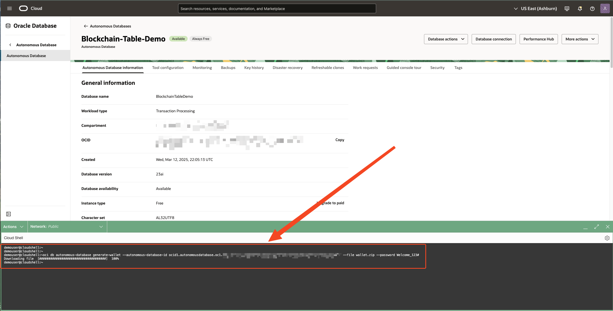
    
    > **Expected Output:**
    > <pre>Downloading file  [####################################]  100%</pre>

<script>
    function createWalletCommand() {
        let ocid = document.getElementById('ocid').value || '<OCID>';
        let fileName = document.getElementById('file_name').value || '<FILE_NAME>';
        let password = document.getElementById('password').value || '<PASSWORD>';

        let command = `oci db autonomous-database generate-wallet --autonomous-database-id ${ocid} --file ${fileName} --password ${password}`;
        document.getElementById('code-text').innerText = command;
        if(fileName != '<FILE_NAME>'){
            updateFileName()
        }
    }

    function pathToUnzippedWallet(){
        let path = document.getElementById('PathUnzippedWalletinp').value || '<PATH_TO_UNZIPPED_WALLET>';

        let command = `export TNS_ADMIN=${path} \necho $TNS_ADMIN`;
        document.getElementById('PathUnzippedWallet').innerText = command;
    }

    function updateFileName(){
        let fileName = document.getElementById('file_name').value || '<FILE_NAME>';
        let command = `unzip ${fileName}`;
        document.getElementById('unzipCmd').innerText = command;
    }

    function copyToClipboard(elementId,containerId) {
        let text = document.getElementById(elementId).innerText;
        navigator.clipboard.writeText(text);
        let codeContainer = document.getElementById(containerId);
        codeContainer.style.opacity = "0.5"; 
        setTimeout(() => codeContainer.style.opacity = "1", 200); 
    }
</script>

4. After the wallet is downloaded, unzip it using the following command:
    <pre id="code-container1" style="display: flex; align-items: center; background: #f5f5f5; border: 1px solid #ccc; padding: 10px; border-radius: 5px; position: relative; transition: opacity 0.3s;">
        <copy id="unzipCmd">unzip &lt;FILE_NAME&gt;</copy>
        <button id="copy-btn" 
                style="position: absolute; right: -10px; top: -10px; background: white; border: 1px solid #ccc; padding: 3px 8px; cursor: pointer; font-size: 15px; border-radius: 3px; transition: background 0.2s, color 0.2s;" 
                onmouseover="this.style.background='grey'; this.style.color='white';" 
                onmouseout="this.style.background='white'; this.style.color='black';" 
                onclick="copyToClipboard('unzipCmd','code-container1')">Copy</button>
    </pre>

    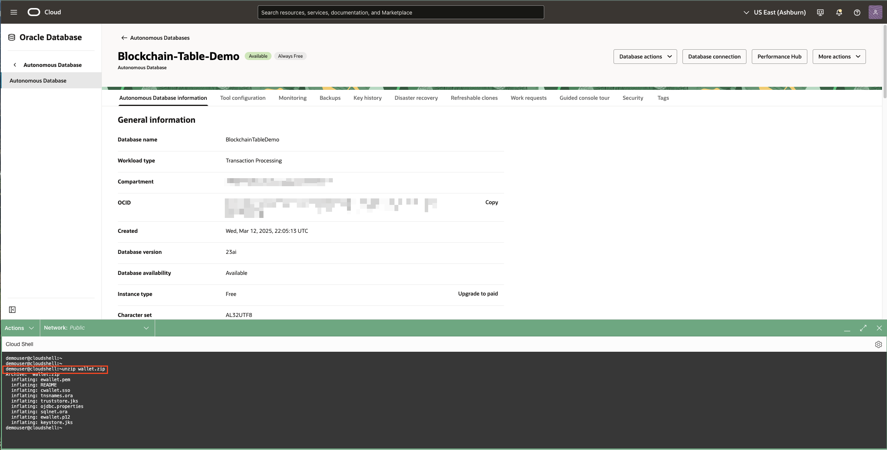
    > **Expected Output:**
    > <pre>
    > inflating: ewallet.pem
    > inflating: README                  
    > inflating: cwallet.sso             
    > inflating: tnsnames.ora            
    > inflating: truststore.jks          
    > inflating: ojdbc.properties        
    > inflating: sqlnet.ora              
    > inflating: ewallet.p12             
    > inflating: keystore.jks</pre>

5. Now, set up the **TNS_ADMIN** environment variable for SQLcl:
    - Run the following command to view the directory where the unzipped wallet is stored:
    ```
        <copy>
        pwd
        </copy>
    ```
    - Replace `<PATH_TO_UNZIPPED_WALLET>` with the output of the previous command and run:
        - Enter your values below. The command will update in real time:
            - **PATH TO UNZIPPED WALLET:** <input type="text" id="PathUnzippedWalletinp" placeholder="PATH TO UNZIPPED WALLET" style="width: 30%; padding: 6px; font-size: 14px; border: 1px solid #ccc; border-radius: 4px;" oninput="pathToUnzippedWallet()">
    <pre id="code-container2" style="display: flex; align-items: center; background: #f5f5f5; border: 1px solid #ccc; padding: 10px; border-radius: 5px;position: relative; transition: opacity 0.3s;">
            <copy id="PathUnzippedWallet">export TNS_ADMIN=&lt;PATH_TO_UNZIPPED_WALLET&gt;
             echo $TNS_ADMIN;</copy>
            <button id="copy-btn" 
                    style="position: absolute; right: -10px; top: -10px; background: white; border: 1px solid #ccc; padding: 3px 8px; cursor: pointer; font-size: 15px; border-radius: 3px; transition: background 0.2s, color 0.2s;" 
                    onmouseover="this.style.background='grey'; this.style.color='white';" 
                    onmouseout="this.style.background='white'; this.style.color='black';" 
                    onclick="copyToClipboard('PathUnzippedWallet','code-container2')">Copy</button>
    </pre>

    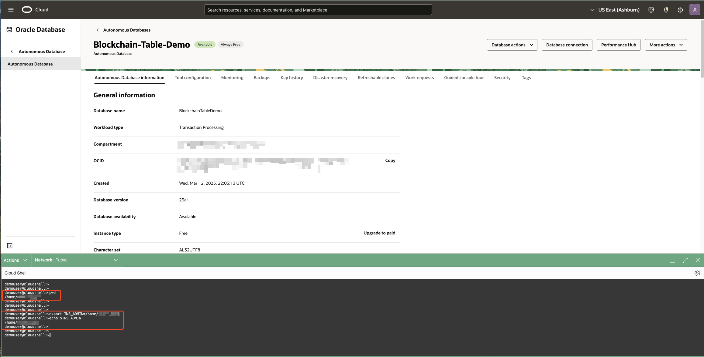

6. To connect to the Autonomous Database instance, use the **mTLS connection string**:
    - On the **Blockchain-Table-Demo ATP** instance details page, click **Database Connection**.  
    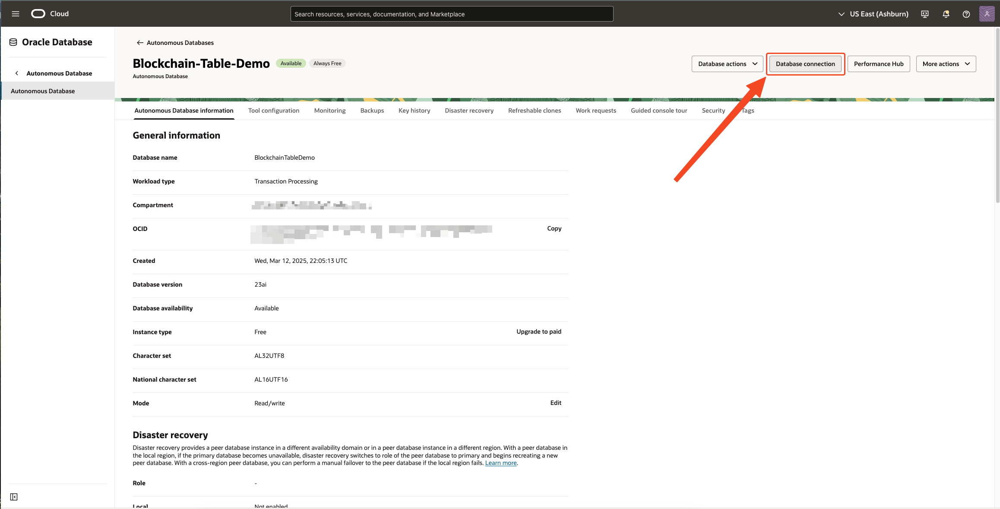
    - Select the connection string for the **blockchaintabledemo_medium** TNS name.  
    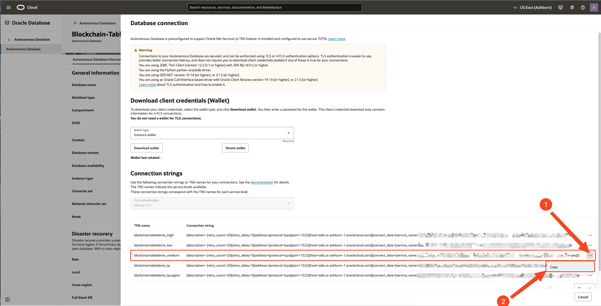

7. In the **Cloud Shell**, run the following command to connect to the Blockchain-Table-Demo ATP instance:
    - Note: `demouser` is the user created in Task 2.
    - Enter your values below. The command will update in real time:
        - **CONNECTION STRING:** <input type="text" id="connectionStringInp" placeholder="CONNECTION STRING" style="width: 30%; padding: 6px; font-size: 14px; border: 1px solid #ccc; border-radius: 4px;" oninput="connectionString()">
    <pre id="code-container3" style="display: flex; align-items: center; background: #f5f5f5; border: 1px solid #ccc; padding: 10px; border-radius: 5px; position: relative; transition: opacity 0.3s;">
                <copy id="connectionString" style="white-space: pre-line;">sql demouser@'&lt;CONNECTION_STRING&gt;'</copy>
                <button id="copy-btn" 
                        style="position: absolute; right: -10px; top: -10px; background: white; border: 1px solid #ccc; padding: 3px 8px; cursor: pointer; font-size: 15px; border-radius: 3px; transition: background 0.2s, color 0.2s;" 
                        onmouseover="this.style.background='grey'; this.style.color='white';" 
                        onmouseout="this.style.background='white'; this.style.color='black';" 
                        onclick="copyToClipboard('connectionString','code-container3')">Copy</button>
    </pre>
    - When the password prompt appears, enter the password for `demouser` set in Task 2, i.e., **Welcome_123#**.
    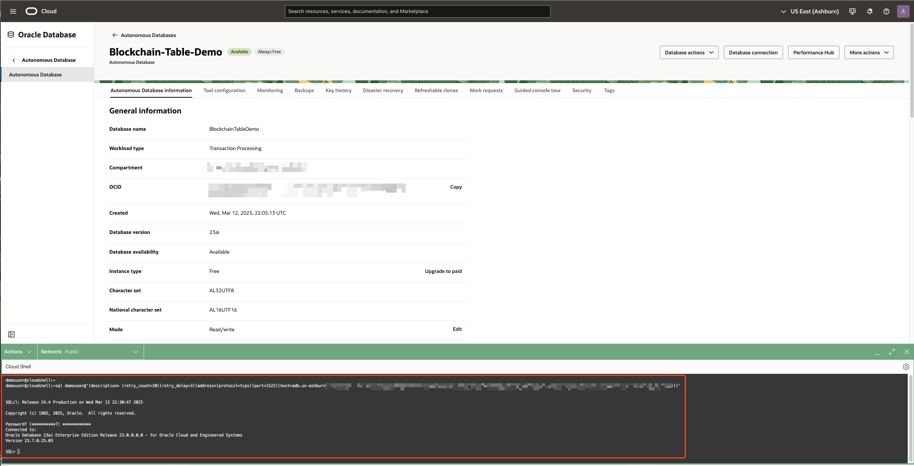
    
    > **Expected Output:**
    > <pre>
    > SQLcl: Release 24.4 Production on 
    >
    > Copyright (c) 1982, 2025, Oracle.  All rights reserved.
    >
    > Password? (**********?) ************
    > Connected to:
    > Oracle Database 23ai Enterprise Edition Release 23.0.0.0.0 - for Oracle Cloud and Engineered Systems
    > Version 23.7.0.25.03
    >
    > SQL> </pre>

<script>
    function connectionString(){
        let CONNECTION_STRING = document.getElementById('connectionStringInp').value || '<PATH_TO_UNZIPPED_WALLET>';

        let command = `sql demouser@'${CONNECTION_STRING}'`;
        document.getElementById('connectionString').innerText = command;
    }
</script>

8. **Your environment is ready to use!** You may now proceed to the next lab.  
    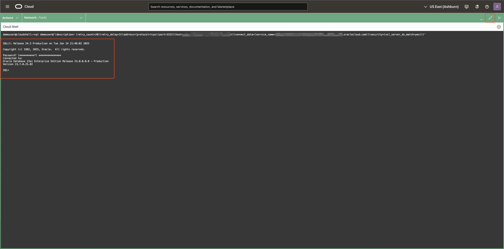

You may now [proceed to the next lab](#next).

## Acknowledgements

* **Contributors** - Amit Ketkar, Pavas Navaney, Vinay Pandhariwal 
* **Created By/Date** - Vinay Pandhariwal, April 2025
* **Last Updated By/Date** - Vinay Pandhariwal, April 2025
