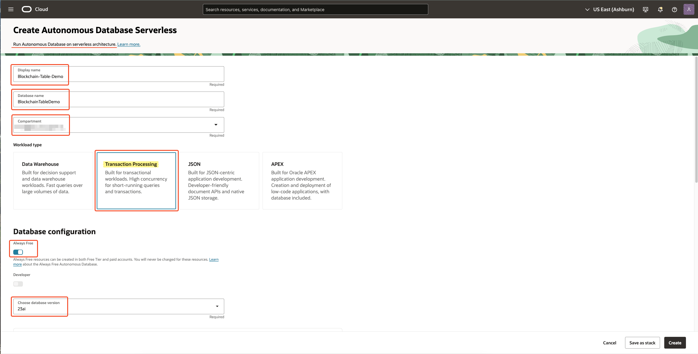
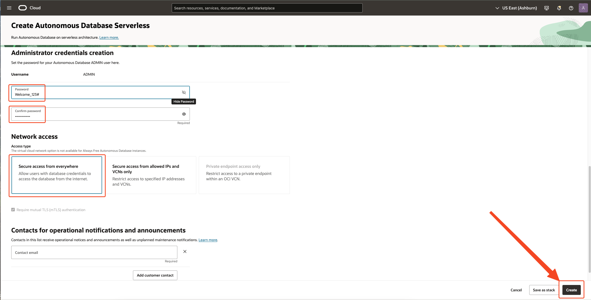
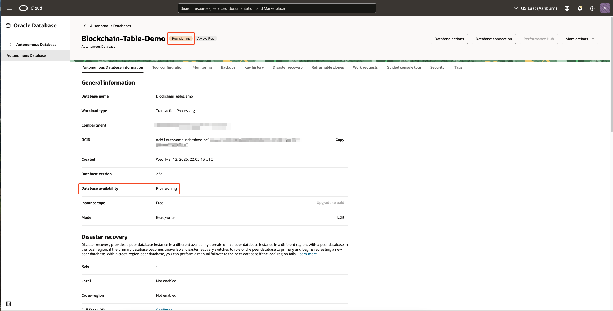
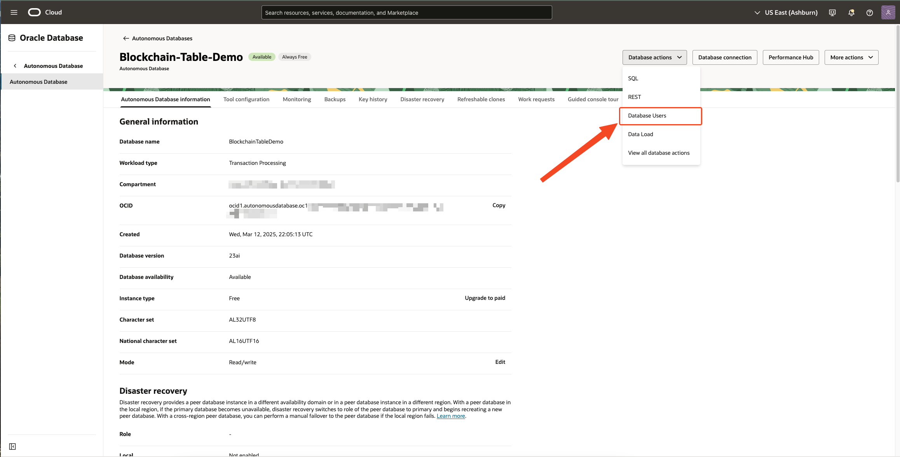
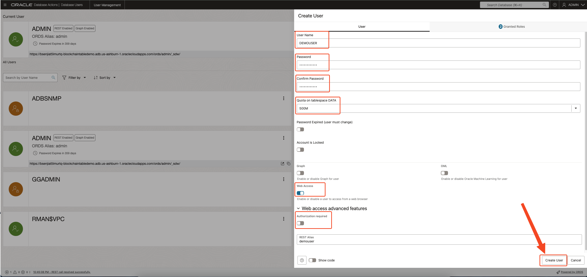
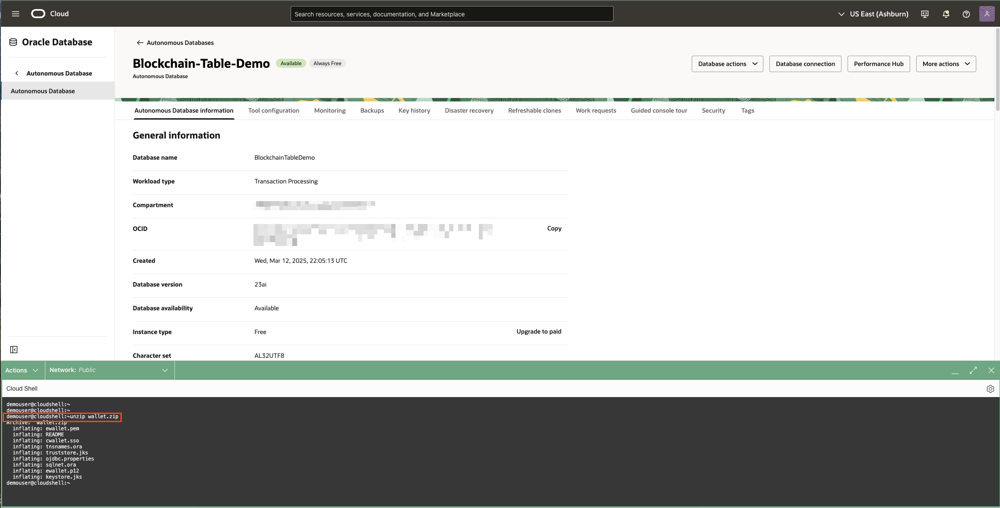
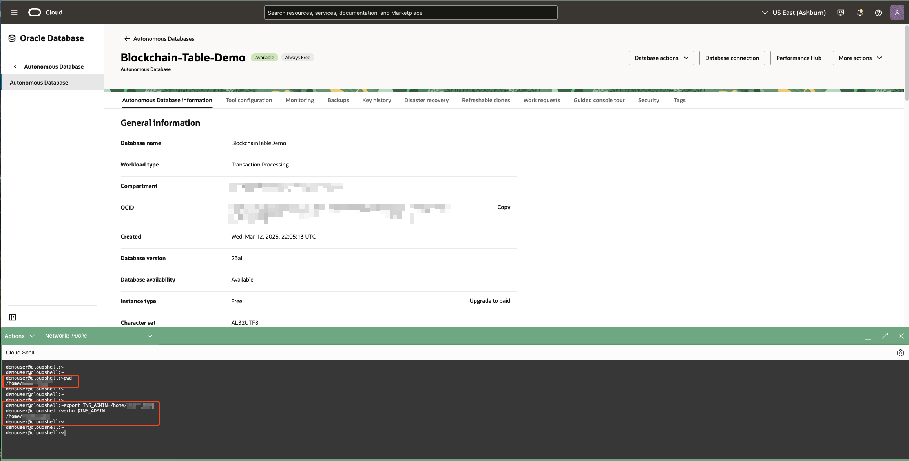
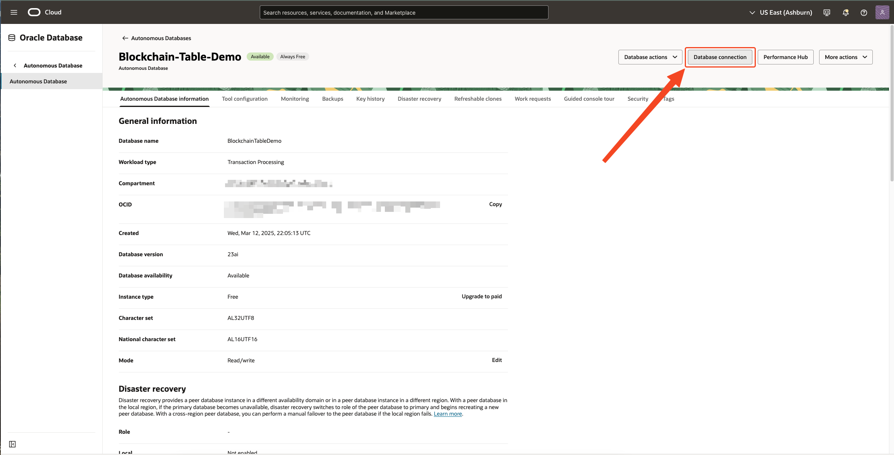

# Prepare your environment

## **Introduction**

This lab provides step-by-step instructions to create an Oracle Autonomous Database and connect to it using SQLcl.

* Estimated time: 20 minutes

Watch the video below for a quick walk-through of the lab.
[Prepare your environment](videohub:1_nw8ufqzp:medium)


### Objectives

-   Learn how to provision a new Autonomous Database
-   Create a new user for demo purpose
-   Connect to Autonomous Database using Oracle CloudShell and SQLcl

### Prerequisites

* A Free-Tier or LiveLabs Oracle Cloud account.

## Task 1: Provision an Autonomous Database

  **Note:** If you plan to use an existing Autonomous Database in your own tenancy, or you are using an Oracle-provided environment, you can skip the Task 1 and Task 2.

1. Log in to the Oracle Cloud Infrastructure

2. Once you are logged in, you are taken to the cloud services dashboard where you can see all the services available to you. Click the navigation menu in the upper left to show top level navigation choices.

    

3. The following steps apply to Autonomous Databases. So please **click the provisioning of Autonomous Database**.

    

4. From the **Compartment** filter, select your compartment and click [**Create Autonomous Database**]

    


5. On the **Create Autonomous Database** page, provide basic information for your database:
    - **Display name** - Enter a memorable name for the database for display purposes, for this lab, use *`Blockchain-Table-Demo`*

        ```
        <copy>Blockchain-Table-Demo</copy>
        ```

    - **Database Name** - Enter *`BlockchainTableDemo`*, it's important to use letters and numbers only, starting with a letter (the maximum length is 14 characters and Underscores are not supported)
        
        ```
        <copy>BlockchainTableDemo</copy>
        ```
    - **Compartment** - If needed, select your compartment

    - **Workload Type** - Select the type of your Autonomous Database (here we select "Transaction Processing")

6. Configure the database:

    - **Always Free** - Select this option by moving the slider to the right
    - **Database version** - Select *`23ai`* 

    


7. Create administrator credentials:

    - **Password** and **Confirm Password** - Specify a password for the ADMIN database user and jot it down. The password must be between 12 and 30 characters long and must include at least one uppercase letter, one lowercase letter, and one numeric character. It cannot contain your username or the double quote (") character. For example : *`Welcome_123#`*

        ```
        <copy>Welcome_123#</copy>
        ```

8. Choose the network access :

    - **Network Access** - Leave *`Secure access from everywhere`* selected
    - **Provide Contacts** - You can leave this blank

    

9. Click [**Create**]

10.  Your instance will begin provisioning. In a few minutes, the state will turn from Provisioning to Available. At this point, your Autonomous Database is ready to use! Have a look at your instance's details here including its name, database version, OCID, Instance Type amd Mode.

    

## Task 2: Create a New User Using Database Actions

1. On the Blockchain-Table-Demo ATP instance details page, click on the **Database Actions** tab, select **Database Users**, a new tab will open up.
    

2. Click on **Create User** to create a new user to access the database.
    

3. In the Create User page, under User tab, give the following details and click **Create User**:
    - **User Name** - Give the new user a User Name. The username is case-sensitive. In the lab, we name the user **Username - DEMOUSER**.
    - **Password** - Give the new user a password and confirm the Password. In this lab, we give the same password as admin user for ease of use, **Password - Welcome_123#** and confirm the password.
    - **Quota on tablespace DATA** - Set a value for the Quota on tablespace DATA for the user. Choose **500M** for this user.
    - **Web Access** - Turn on the Web Access radio button to access the SQL Developer Web.
    - **Web access advanced features** - Expand the Web access advanced features and turn off the Authorization required radio button to disable the authorization for `demouser` REST services

    

4.  Notice that the new user is created successfully.
    

## Task 3: Connect to Autonomous Database using Oracle CloudShell and SQLcl

1. On the **Blockchain-Table-Demo ATP** instance details page, click on **Copy** to copy the **OCID** of the ATP instance.  
    

2. In the top-right corner, click on **Developer Tools** and select **Cloud Shell**.  
    

3. Once the **Cloud Shell** interface loads, create a wallet for the ATP instance and store it in the root directory of the Cloud Shell:
    - **autonomous-database-id**: Paste the OCID copied in Step 1 into this field.
    - **file**: Specify the file name for the generated wallet (e.g., **wallet.zip**).
    - **password**: Specify a password for the wallet.

        Enter your values below. The command will update in real time:
        - **Autonomous Database OCID:** <input type="text" id="ocid" placeholder="ocid1.autonomousdatabase.oc1..example" style="width: 30%; padding: 6px; font-size: 14px; border: 1px solid #ccc; border-radius: 4px;" oninput="createWalletCommand()">
        - **File Name:** <input type="text" id="file_name" placeholder="wallet.zip" style="width: 30%; padding: 6px; font-size: 14px; border: 1px solid #ccc; border-radius: 4px;" oninput="createWalletCommand()"> <br/>
        - **Password:** <input type="text" id="password" placeholder="Enter Secure Password" style="width: 30%; padding: 6px; font-size: 14px; border: 1px solid #ccc; border-radius: 4px;" oninput="createWalletCommand()">

        **Generated Command:**
        <pre id="code-container" style="display: flex; align-items: center; background: #f5f5f5; border: 1px solid #ccc; padding: 10px; border-radius: 5px; position: relative; transition: opacity 0.3s;">
        <copy id="code-text">oci db autonomous-database generate-wallet --autonomous-database-id &lt;OCID&gt; --file &lt;FILE_NAME&gt; --password &lt;PASSWORD&gt;</copy>
        <button id="copy-btn" 
                style="position: absolute; right: -10px; top: -10px; background: white; border: 1px solid #ccc; padding: 3px 8px; cursor: pointer; font-size: 15px; border-radius: 3px; transition: background 0.2s, color 0.2s;" 
                onmouseover="this.style.background='grey'; this.style.color='white';" 
                onmouseout="this.style.background='white'; this.style.color='black';" 
                onclick="copyToClipboard('code-text','code-container')">Copy</button>
        </pre>
    
    
    > **Expected Output:**
    > <pre>Downloading file  [####################################]  100%</pre>

<script>
    function createWalletCommand() {
        let ocid = document.getElementById('ocid').value || '<OCID>';
        let fileName = document.getElementById('file_name').value || '<FILE_NAME>';
        let password = document.getElementById('password').value || '<PASSWORD>';

        let command = `oci db autonomous-database generate-wallet --autonomous-database-id ${ocid} --file ${fileName} --password ${password}`;
        document.getElementById('code-text').innerText = command;
        if(fileName != '<FILE_NAME>'){
            updateFileName()
        }
    }

    function pathToUnzippedWallet(){
        let path = document.getElementById('PathUnzippedWalletinp').value || '<PATH_TO_UNZIPPED_WALLET>';

        let command = `export TNS_ADMIN=${path} \necho $TNS_ADMIN`;
        document.getElementById('PathUnzippedWallet').innerText = command;
    }

    function updateFileName(){
        let fileName = document.getElementById('file_name').value || '<FILE_NAME>';
        let command = `unzip ${fileName}`;
        document.getElementById('unzipCmd').innerText = command;
    }

    function copyToClipboard(elementId,containerId) {
        let text = document.getElementById(elementId).innerText;
        navigator.clipboard.writeText(text);
        let codeContainer = document.getElementById(containerId);
        codeContainer.style.opacity = "0.5"; 
        setTimeout(() => codeContainer.style.opacity = "1", 200); 
    }
</script>

4. After the wallet is downloaded, unzip it using the following command:
    <pre id="code-container1" style="display: flex; align-items: center; background: #f5f5f5; border: 1px solid #ccc; padding: 10px; border-radius: 5px; position: relative; transition: opacity 0.3s;">
        <copy id="unzipCmd">unzip &lt;FILE_NAME&gt;</copy>
        <button id="copy-btn" 
                style="position: absolute; right: -10px; top: -10px; background: white; border: 1px solid #ccc; padding: 3px 8px; cursor: pointer; font-size: 15px; border-radius: 3px; transition: background 0.2s, color 0.2s;" 
                onmouseover="this.style.background='grey'; this.style.color='white';" 
                onmouseout="this.style.background='white'; this.style.color='black';" 
                onclick="copyToClipboard('unzipCmd','code-container1')">Copy</button>
    </pre>

    
    > **Expected Output:**
    > <pre>
    > inflating: ewallet.pem
    > inflating: README                  
    > inflating: cwallet.sso             
    > inflating: tnsnames.ora            
    > inflating: truststore.jks          
    > inflating: ojdbc.properties        
    > inflating: sqlnet.ora              
    > inflating: ewallet.p12             
    > inflating: keystore.jks</pre>

5. Now, set up the **TNS_ADMIN** environment variable for SQLcl:
    - Run the following command to view the directory where the unzipped wallet is stored:
    ```
        <copy>
        pwd
        </copy>
    ```
    - Replace `<PATH_TO_UNZIPPED_WALLET>` with the output of the previous command and run:
        - Enter your values below. The command will update in real time:
            - **PATH TO UNZIPPED WALLET:** <input type="text" id="PathUnzippedWalletinp" placeholder="PATH TO UNZIPPED WALLET" style="width: 30%; padding: 6px; font-size: 14px; border: 1px solid #ccc; border-radius: 4px;" oninput="pathToUnzippedWallet()">
    <pre id="code-container2" style="display: flex; align-items: center; background: #f5f5f5; border: 1px solid #ccc; padding: 10px; border-radius: 5px;position: relative; transition: opacity 0.3s;">
            <copy id="PathUnzippedWallet">export TNS_ADMIN=&lt;PATH_TO_UNZIPPED_WALLET&gt;
             echo $TNS_ADMIN;</copy>
            <button id="copy-btn" 
                    style="position: absolute; right: -10px; top: -10px; background: white; border: 1px solid #ccc; padding: 3px 8px; cursor: pointer; font-size: 15px; border-radius: 3px; transition: background 0.2s, color 0.2s;" 
                    onmouseover="this.style.background='grey'; this.style.color='white';" 
                    onmouseout="this.style.background='white'; this.style.color='black';" 
                    onclick="copyToClipboard('PathUnzippedWallet','code-container2')">Copy</button>
    </pre>

    

6. To connect to the Autonomous Database instance, use the **mTLS connection string**:
    - On the **Blockchain-Table-Demo ATP** instance details page, click **Database Connection**.  
    
    - Select the connection string for the **blockchaintabledemo_medium** TNS name.  
    

7. In the **Cloud Shell**, run the following command to connect to the Blockchain-Table-Demo ATP instance:
    - Note: `demouser` is the user created in Task 2.
    - Enter your values below. The command will update in real time:
        - **CONNECTION STRING:** <input type="text" id="connectionStringInp" placeholder="CONNECTION STRING" style="width: 30%; padding: 6px; font-size: 14px; border: 1px solid #ccc; border-radius: 4px;" oninput="connectionString()">
    <pre id="code-container3" style="display: flex; align-items: center; background: #f5f5f5; border: 1px solid #ccc; padding: 10px; border-radius: 5px; position: relative; transition: opacity 0.3s;">
                <copy id="connectionString" style="white-space: pre-line;">sql demouser@'&lt;CONNECTION_STRING&gt;'</copy>
                <button id="copy-btn" 
                        style="position: absolute; right: -10px; top: -10px; background: white; border: 1px solid #ccc; padding: 3px 8px; cursor: pointer; font-size: 15px; border-radius: 3px; transition: background 0.2s, color 0.2s;" 
                        onmouseover="this.style.background='grey'; this.style.color='white';" 
                        onmouseout="this.style.background='white'; this.style.color='black';" 
                        onclick="copyToClipboard('connectionString','code-container3')">Copy</button>
    </pre>
    - When the password prompt appears, enter the password for `demouser` set in Task 2, i.e., **Welcome_123#**.
    
    
    > **Expected Output:**
    > <pre>
    > SQLcl: Release 24.4 Production on 
    >
    > Copyright (c) 1982, 2025, Oracle.  All rights reserved.
    >
    > Password? (**********?) ************
    > Connected to:
    > Oracle Database 23ai Enterprise Edition Release 23.0.0.0.0 - for Oracle Cloud and Engineered Systems
    > Version 23.7.0.25.03
    >
    > SQL> </pre>

<script>
    function connectionString(){
        let CONNECTION_STRING = document.getElementById('connectionStringInp').value || '<PATH_TO_UNZIPPED_WALLET>';

        let command = `sql demouser@'${CONNECTION_STRING}'`;
        document.getElementById('connectionString').innerText = command;
    }
</script>

8. **Your environment is ready to use!** You may now proceed to the next lab.  
    

You may now [proceed to the next lab](#next).

## Acknowledgements

* **Contributors** - Amit Ketkar, Pavas Navaney, Vinay Pandhariwal 
* **Created By/Date** - Vinay Pandhariwal, March 2025
* **Last Updated By/Date** - Vinay Pandhariwal, March 2025
