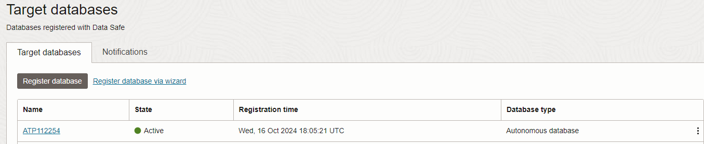
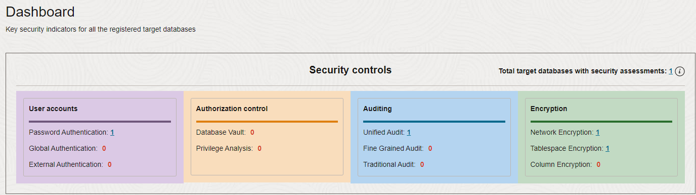

# Access your environment

## Introduction

In this lab, you access and review your LiveLabs Sandbox environment in Oracle Cloud Infrastructure. Your environment comes with a tenancy, a compartment, an Oracle Cloud account in the LiveLabs tenancy, and a pre-provisioned Autonomous Database. Sample data is loaded into your database and your database is registered with Oracle Data Safe.

Estimated Lab Time: 5 minutes

### Objectives

In this lab, you will:

- View your LiveLabs reservation information and sign in
- Access Oracle Data Safe and view your registered target database
- Explore Security Center
- Access Oracle Database Actions

### Prerequisites

This lab assumes you have:

- Obtained an Oracle Cloud account and signed in to the Oracle Cloud Infrastructure Console at `https://cloud.oracle.com`

## Task 1: View your LiveLabs Sandbox reservation information and sign in

1. In the upper-left corner of the lab instructions page (this page), click the **View Login Info** link. 

    A **Reservation Information** panel is displayed.

2. Review the information. You are provided with the following in Oracle Cloud Infrastructure:

    - Access to one of the LiveLab's tenancies
    - A link that directs you to the sign-in page for Oracle Cloud Infrastructure (**Launch OCI** button)
    - A username and password to sign in to the LiveLabs tenancy. When signing in for the first time, you are prompted to change your password.
    - A compartment of your very own. We refer to this compartment as "your compartment" throughout the workshop. Make note of your compartment's name because you need to select it often throughout the workshop.
    - An Autonomous Database in your compartment. You are provided the password for the `ADMIN` account on your database.

3. Make note of your username and click the **Copy Password** button for Oracle Cloud Infrastructure.

4. On the **Reservation Information** panel, click the **Launch OCI** button. Leave the default domain selected, and click **Next**.

    A new browser tab is opened and the sign in page for the LiveLabs tenancy is displayed.

5. Enter your username (if needed) and paste the password into the **Password** box, and then click **Sign In**.

    The **Change Password** page is displayed.

6. In the **Current Password** box, paste your password. In the **New Password** and **Confirm New Password** boxes, enter a new password. Note the password requirements, which are provided on the page. Click **Save New Password**.

    You are now signed in to your LiveLabs Sandbox in Oracle Cloud Infrastructure.

## Task 2: Access Oracle Data Safe and view your registered target database

A database registered with Oracle Data Safe is referred to as a *target* database in Oracle Data Safe.

1. From the navigation menu, select **Oracle Database**, and then **Data Safe - Database Security**. The **Overview** page is displayed. If the **Welcome to Data Safe** tour dialog box is displayed, click **Stop tour**.

2. On the left, click **Target databases**.

3. Under **List scope**, browse to and select your compartment. Your registered target database is listed on the right.

    - A target database with an **Active** status means that it is currently registered with Oracle Data Safe.
    - A target database with a **Deleted** status means that it is no longer registered with Oracle Data Safe. The listing is removed 45 days after the target database is deregistered.

    

## Task 3: Explore Security Center

1. In the breadcrumb at the top of the page, click **Data Safe**.

    The **Overview** page is displayed.

2. Under **Security center** on the left, click **Dashboard** and review the dashboard. Scroll down to view the security controls and feature metrics (charts). Make sure your compartment is selected under **List scope**. From the **Target databases** drop-down list, select your target database so that the data in the dashboard pertains to your target database only.

    - In Security center, you can access all the Oracle Data Safe features, including the dashboard, Security Assessment, User Assessment, Data Discovery, Data Masking, Activity Auditing, SQL Firewall, and Alerts.
    - When you register a target database, Oracle Data Safe automatically creates a security assessment and user assessment for you. That's why the **Security assessment**, **User assessment**, **Feature usage**, and **Operations summary** charts in the dashboard already have data.
    - During registration, Oracle Data Safe also discovers audit trails on your target database. That's why the **Audit trails** chart in the dashboard shows one audit trail with the status **In transition** for your Autonomous Database. Later you start this audit trail to collect audit data into Oracle Data Safe.

    

    

    

## Task 4: Access Oracle Database Actions

Database Actions provides a way for you to run SQL commands on your database. The step-by-step instructions for accessing Database Actions are covered here. Subsequent labs simply say to "access the SQL worksheet in Database Actions." You can always refer back to these steps for help if needed.

1. From the navigation menu (hamburger menu in the upper-left corner), select **Oracle Database**, and then **Autonomous Transaction Processing**. Under **List Scope**, select your compartment under the **LiveLabs** folder. In the table on the right, click the name of your database.

2. At the top of the **Autonomous Database details** page, from the **Database actions** menu, select **SQL**.

3. If required, sign in as the `ADMIN` user. 

    - If a tenancy administrator provided you an Autonomous Database, obtain the password from that person.
    - If you are using an Oracle-provided environment, enter the database password provided to you.

4. Close the **SQL History** and **Warning** dialog boxes.

5. Review the interface. Here are the ways that you use Database Actions during the workshop:

    - In the **Navigator** pane on the left, you select tables from the **HCM1** schema on your database.
    - On the **Worksheet** on the right, you run SQL commands and scripts.
    - On the **Query Result** and **Script Output** tabs at the bottom of the page, you review query results and output generated from running scripts.

    

6. *Leave the **SQL | Oracle Database Actions** tab open because you return to it throughout this workshop.* If your session expires, you can always sign in again. 

7. Return to Oracle Data Safe: Click the **Autonomous Database | Oracle Cloud Infrastructure** browser tab. From the navigation menu, select **Oracle Database**, and then **Data Safe - Database Security**. The **Overview** page is displayed.

You may now **proceed to the next lab**.

## Learn More

- [Oracle Cloud Infrastructure documentation](https://docs.oracle.com/iaas/Content/home.htm)
- [OCI Cloud Free Tier](https://www.oracle.com/cloud/free/)
- [Target Database Registration](https://www.oracle.com/pls/topic/lookup?ctx=en/cloud/paas/data-safe&id=ADMDS-GUID-B5F255A7-07DD-4731-9FA5-668F7DD51AA6)
- [Oracle Data Safe Dashboard](https://www.oracle.com/pls/topic/lookup?ctx=en/cloud/paas/data-safe&id=ADMDS-GUID-B4D784B8-F3F7-4020-891D-49D709B9A302)

## Acknowledgements

- **Author** - Jody Glover, Consulting User Assistance Developer, Database Development
- **Last Updated By/Date** - Jody Glover, August 22, 2024
