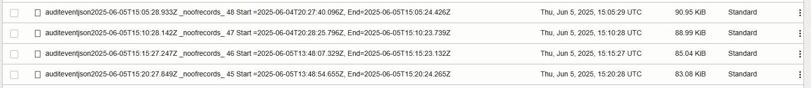

# Schedule the copying of audit data to object storage using the Oracle Data Safe REST API

## Introduction

When you start your target database's audit trail in Oracle Data Safe, Oracle Data Safe begins copying audit records from the database's audit trail into the Oracle Data Safe repository. In this lab, you use the Oracle Data Safe application programming interface (API) and crontab on a compute instance to schedule the copying of Oracle Data Safe's audit data for your target database into object storage. 

If you already have a bucket in Oracle Cloud Infrastructure and you have started the audit trail for your target database in Oracle Data Safe, then you can skip tasks 1 and 2.

Estimated Lab Time: 30 minutes

### Objectives

In this lab, you will:

- Create a bucket in your compartment
- Start the audit trail for your target database in Oracle Data Safe
- View the quantity of audit data collected by Oracle Data Safe
- Create SSH keys in Cloud Shell
- Create a virtual cloud network (VCN)
- Create a compute instance using the Oracle Linux Cloud Developer 8 image
- Connect to your compute instance from Cloud Shell
- Create an API key
- Upload your private key (PEM file) to your compute instance
- Create a configuration file
- Compile the Java program
- Obtain the compartment OCID for your target database
- Run the compiled Java class file
- Verify that the audit data is in your bucket
- Create an SH script for cronjob
- Schedule the SH script using crontab
- Remove the scheduled activity in crontab


### Prerequisites

This lab assumes you have:

- Obtained an Oracle Cloud account and signed in to the Oracle Cloud Infrastructure Console
- Prepared your environment for this workshop (see [Prepare Your Environment](?lab=prepare-environment))
- Registered your target database with Oracle Data Safe (see [Register an Autonomous Database with Oracle Data Safe](?lab=register-autonomous-database))


## Task 1: Create a bucket in your compartment

Create a bucket to store your audit data. You also use the bucket to transfer a PEM file to a compute instance in a later task.

1. From the navigation menu in Oracle Cloud Infrastructure, select **Storage**, and then **Buckets**.

2. Select your compartment.

3. Click **Create Bucket**.

    The **Create Bucket** dialog box is displayed.

4. For bucket name, enter **DataSafeAuditData**.

5. Leave the default settings as is, and click **Create**.


## Task 2: Start the audit trail for your target database in Oracle Data Safe

1. From the navigation menu in Oracle Cloud Infrastructure, select **Oracle Database**, and then **Data Safe - Database Security**.

2. Under **Security Center** on the left, click **Activity Auditing**.

3. Under **Related Resources** on the left, click **Audit Trails**.

4. From the **Compartment** drop-down list on the left, make sure your compartment is selected.

5. On the right, click the name of your target database for the **UNIFIED\_AUDIT\_TRAIL**.

    The **Audit Trail Details** page is displayed.

6. Click **Start**.

    A **Start Audit Trail: UNIFIED\_AUDIT\_TRAIL** dialog box is displayed.

7. Set the start date to the beginning of the current month.

8. Click **Start**. Wait for **Collection State** to change from **STARTING** to **COLLECTING** and then to **IDLE**. It takes about one minute.


## Task 3: View the quantity of audit data collected by Oracle Data Safe

1. In the breadcrumb at the top of the page, click **Activity Auditing**.

2. Under **Security Center**, click **Audit Profiles**.

3. On the right, click the name of your target database.

    The **Audit Profile Details** page for your target database is displayed.

4. Scroll down the page to the **Compute Audit Volume** section.

5. Click **Collected by Data Safe**.

    The **Compute Collected Volume** dialog box is displayed.

6. Set the **Start Month** and **End Month** fields to the first and last day of the current month respectively, and click **Compute**. Make note of the number of audit records collected by Oracle Data Safe.

7. If for some reason the number of audit records is equal to zero, run the [**load-data-safe-sample-data_admin.sql**](https://objectstorage.us-ashburn-1.oraclecloud.com/p/AUKfPIGuTde04z4OnuaZN2EP0LxNl4hJWI2jZiTw23aWzSoa2_Byvs8OGPw20-dt/n/c4u04/b/livelabsfiles/o/security-library/load-data-safe-sample-data_admin.sql) SQL script in Database Actions to load sample data into your database. This script generates auditable database activity for the `ADMIN` user. Then, repeat steps 5 and 6 to view the amount of collected audit data.


## Task 4: Create SSH keys in Cloud Shell

In Cloud Shell, create an SSH key pair that you can use to connect to your compute instance. The standard name in LiveLabs workshops is `cloudshellkey`.

1. On the toolbar in Oracle Cloud Infrastructure, click **Developer tools**, and then select **Cloud Shell**. When you first open Cloud Shell, you are in your home directory; for example, `/home/jody_glove`.

2. (Optional) Reset your Cloud Shell environment. The following command erases all the data in your `$HOME` directory on your Cloud Shell machine and resets the `$HOME/.bashrc`, `$HOME/.bash_profile`, `$HOME/.bash_logout`, and `$HOME/.emacs` files back to their default values. Enter **y** at the prompt to confirm.

    ```bash
    $ <copy>csreset --all</copy>
    ```

3. Create an `.ssh` directory in your home directory on your Cloud Shell machine, change to it, and then verify the directory in which you are working.

    ```bash
    $ <copy>mkdir ~/.ssh</copy>
    $ <copy>cd ~/.ssh</copy>
    $ <copy>pwd</copy>

    /home/your-user-name/.ssh
    ```


4. While you are in the `.ssh` directory, generate an SSH key pair. The following command generates two keys: a private key named `cloudshellkey` and a public key named `cloudshellkey.pub`. Please use the `cloudshellkey` naming convention as it is a LiveLabs standard. When prompted to enter a passphrase, simply click **Enter** twice to not enter a passphrase.

    ```bash
    $ <copy>ssh-keygen -b 2048 -t rsa -f cloudshellkey</copy>
    ```

5. Confirm the private key and public key files exist in the `.ssh` directory.

    ```bash
    $ <copy>ls</copy>

    cloudshellkey cloudshellkey.pub
    ``` 


6. Show the contents of the public key. Later, you copy this to the clipboard and paste it into the SSH keys box when creating the compute instance.

    ```bash
    $ <copy>cat cloudshellkey.pub</copy>
    ```
 
7. Leave Cloud Shell open.


## Task 5: Create a virtual cloud network (VCN)

1. From the navigation menu in Oracle Cloud Infrastructure, select **Networking**, and then **Virtual cloud networks**.

2. Select your compartment.

3. Click **Create VCN**.

4. For **Name**, enter **labVCN**.

5. Select your compartment. 

6. For **IPv4 CIDR Blocks**, enter **10.0.0.0/24**.

7. Leave the **Use DNS hostnames in this VCN** check box selected.

8. For **DNS Label**, enter **labVCN**.

9. Click **Create VCN**.

10. Click **Create Subnet**.

11. For name, enter **lab-public-subnet1**.

12. Select your compartment.

13. For subnet type, leave **Regional** selected.

14. For **IPv4 CIDR Block**, enter **10.0.0.0/24**.

15. For subnet access, leave **Public Subnet** selected.

16. Leave the **Use DNS hostnames in this SUBNET** check box selected.

17. For **DNS label**, enter **subnet1**.

18. Click **Create Subnet**.

19. On the left, click **Internet Gateways**.

20. Click **Create Internet Gateway**. The **Create Internet Gateway** panel is displayed.

21. For name, enter **livelabs-igw**.

22. Select your compartment.

23. Click **Create Internet Gateway**.

24. On the left, click **Route Tables**.

25. In the list of route tables, click **Default Route Table for labVCN**.

26. Click **Add Route Rules**.

    The **Add Route Rules** panel is displayed.

27. For target type, select **Internet Gateway**.

28. For destination CIDR block, enter **0.0.0.0/0**.

29. For target internet gateway, select **livelabs-igw**.

30. Click **Add Route Rules**.


## Task 6: Create a compute instance using the Oracle Linux Cloud Developer 8 image

The Oracle Linux Cloud Developer Image is supported on all compute shapes, except the GPU shapes. A minimum of 8 GB of memory is required for this image for all standard and flexible shapes. The one exception is the VM.Standard.E2.1.Micro shape, which only has 1 GB of memory allocated to it. Because of the small memory size in the VM.Standard.E2.1.Micro shape, some graphical intensive programs are not installed in the image. 

1. From the navigation menu for Oracle Cloud Infrastructure, select **Compute**, and then **Instances**.

2. Select your compartment.

3. Click **Create instance**.

4. Enter a friendly name for your compute instance.

5. Leave your compartment selected.

6. Leave placement as is.

7. In the **Image and shape** section, click **Edit**. 

8. Click **Change image**. Leave **Oracle Linux** selected. Scroll down and select **Oracle Linux Cloud Developer 8**. Select the **I have reviewed and accept the following documents: Oracle LInux Cloud Developer Image Terms of Use** check box. Click **Select image**.

9. Click **Change shape**. Leave **Virtual Machine** and the **Ampere** shape series selected. Leave the **VM.Standard.A1.Flex** image selected. Scroll down and enter **8** GB of memory. Click **Select shape**. 

10. In the  **Networking** section, click **Edit**, leave **Select existing virtual cloud network** selected. For **Virtual cloud network in your-compartment**, select **labVCN**. For **Subnet in your-compartment**, select **lab-public-subnet1**. For **Public IPv4 Address**, leave **Assign a public IPv4 address** selected.

11. In the **Add SSH keys** section, select **Paste public keys**. Return to Cloud Shell and copy the entire SSH public key to the clipboard. It starts with `ssh-rsa` and ends with something similar to `jody_glove@1e3ebc618797`. In the SSH keys box, paste your public key. Make sure that there are no hard returns. If needed, you can run `cat .ssh/cloudshellkey.pub` to display the public key again.

12. In the **Boot volume** section, leave the default settings as is.

13. Click **Create** and wait two minutes for your compute instance to be provisioned. The **Work requests** page is displayed where you can view information about your compute instance.


## Task 7: Connect to your compute instance from Cloud Shell

1. If you've navigated away from your compute instance page, you can find it again by doing this: From the navigation menu in Oracle Cloud Infrastructure, select **Compute**, and then **Instances**. Select your compartment. Click the name of your compute instance.

2. On the **Instance Information** tab under **Instance access**, copy the public IP address to the clipboard.

3. In Cloud Shell, enter the following `SSH` command to connect to your compute instance, replacing `public-ip-address` with the one you just copied to the clipboard.

    ```bash
    $ <copy>ssh -i ~/.ssh/cloudshellkey opc@public-ip-address</copy>
    ```

    You receive a message stating that the authenticity of your compute instance can't be established. Do you want to continue connecting?


4. Enter **yes** to continue.

    The public IP address of your compute instance is added to the list of known hosts on your Cloud Shell machine. The terminal prompt becomes `[opc@<your-compute-name> ~]$`, where `opc` is your user account on your compute instance. You are now connected to your new compute instance.


## Task 8: Create an API key

There are three parts to configuring the SDK: create an API key, create a configuration file, and upload a PEM file to your compute instance. To use the SDK for Java, you must have a key pair used for signing API requests, with the public key uploaded to Oracle. Only the user calling the API should be in possession of the private key.


1. Begin by creating an API key. To do so, in the upper-right corner of the Oracle Cloud Infrastructure Console, click the **Profile** icon, and then click your username.

2. On the left, click **API Keys**.

3. Click **Add API Key**.

    The **Add API Key** dialog box is displayed.

4. Leave **Generate API Key Pair** selected, click **Download Private Key**, and save your private key (PEM file) to a local directory on your computer. 

5. Click **Add**.

    The **Configuration File Preview** dialog box is displayed. This dialog shows you a preview of the configuration file.

6. Copy the configuration file contents to a temporary text file because you need it in a later task. It content looks similar to this:

    ```text
    <copy>[DEFAULT]
    user=ocid1.user.oc1...
    fingerprint=your-fingerprint
    tenancy=ocid1.tenancy.oc1...
    region=eu-frankfurt-1
    key_file=<path to your private keyfile> # TODO</copy>
    ```

6. Click **Close**.

7. In Cloud Shell, switch to the `root` user.

    ```bash
    $ <copy>sudo su -</copy>
    ```

8. Create a `.oci` directory.

    ```text
    # <copy>mkdir ~/.oci</copy>
    ```

## Task 9: Upload your private key (PEM file) to your compute instance

Upload your private key (PEM file) into object storage, and then copy it to your compute instance.

1. From the navigation menu in Oracle Cloud Infrastructure, select **Storage**, and then **Buckets**. Select your compartment. Click the name of your bucket.
   
    The **Bucket Details** page is displayed.

2. Scroll down to the **Objects** section and click **Upload**.

    The **Upload Objects** panel is displayed.

3. Drag your private key file to the **Choose Files from your Computer** area, and click **Upload**.

4. Click **Close**.

5. At the end of the row for your private key file listing, click the three dots, and then select **Create Pre-Authenticated Request**. 

    The **Create Pre-Authenticated Request** panel is displayed.

6. Click **Create Pre-Authenticated Request**.

    The **Pre-Authenticated Request Details** dialog box is displayed.

7. Copy the **Pre-Authenticated Request URL** to the clipboard and paste it into a temporary local text file. *IMPORTANT:* You will not be able to view this URL again after you close the dialog box.

8. Click **Close**.

9. In Cloud Shell, change to the `.oci` directory.

    ```text
    # <copy>cd ~/.oci</copy>
    ```

10. Use the `WGET` command to copy your private key file from object storage into the `.oci` directory. Replace `pre-authenticated-request-url` with your own url.

    ```text
    # <copy>wget pre-authenticated-request-url</copy>
    ```

11. List the contents of the directory to ensure the private key file is present.

    ```text
    # <copy>ls</copy>
    ```

## Task 10: Create a configuration file

In this task, you create a configuration file named `config` in the `.oci` directory for the SDK, and then add the API content that you obtained from the API key (which you created in a previous task). In the config file, correct the last line by adding the actual path to your private key file on your compute instance. The java file that you compile in a subsequent task looks for the config file in `~/.oci/config` with a profile named `DEFAULT`.

1. Using the vi editor and while you are still in the `.oci` directory, create a configuration file.

    ```text
    # <copy>vi config</copy>
    ```

2. Paste the configuration file contents into the `config` file. Note: Earlier you pasted this content into a temporary text file. The content looks similar to the following code. Be sure to include `[DEFAULT]` at the top.

   ```text
    <copy>[DEFAULT]
    user=ocid1.user.oc1...
    fingerprint=your-fingerprint
    tenancy=ocid1.tenancy.oc1...
    region=eu-frankfurt-1
    key_file=<path to your private keyfile> # TODO</copy>
    ```

3. Modify the last line to be the path to your PEM file on your compute instance. In the example below, substitute `your-private-key-file-name` with your own private key file name.

    ```text
    <copy>key_file=~/.oci/your-private-key-file-name</copy>
    ```

4. Save and close the file (press **Escape**, enter **:wq**, and press **Enter**).

5. List the contents of the current directory and ensure that your `config` file is there.

    ```text
    # <copy>ls</copy>

    config  your-private-key-file-name
    ```


## Task 11: Compile a Java program

The Oracle Linux Cloud Developer image comes with the SDK and Java software already installed. The OCI jar file is located in `/usr/lib64/java-oci-sdk/lib/oci-java-sdk-full-<version>.jar`, and third-party libraries are in `/usr/lib64/java-oci-sdk/third-party/lib`. To compile a Java file, use the `javac` command. 

In this task, you compile a Java program named `DataSafeRestAPIClientExample.java`, which comes with the SDK installation. The purpose of this program is to copy audit data from the Oracle Data Safe repository into a specified object storage bucket. If needed, you can also download the program directly from Github by running the following command: `wget https://raw.githubusercontent.com/oracle/oci-java-sdk/master/bmc-examples/src/main/java/DataSafeRestAPIClientExample.java`.

1. Verify the version of the `oci-java-sdk-full-version.jar` file. In this example, the version is 2.27.0.

    ```text
    # <copy>ls /usr/lib64/java-oci-sdk/lib</copy>

    oci-java-sdk-full-2.27.0.jar  oci-java-sdk-full-2.27.0-javadoc.jar  oci-java-sdk-full-2.27.0-sources.jar
    ```

2. Switch to the `/usr/lib64/java-oci-sdk` directory.

    ```text
    # <copy>cd /usr/lib64/java-oci-sdk</copy>
    ```

3. Compile the `DataSafeRestAPIClientExample.java` file. Be sure to use the correct version in the `oci-java-sdk-full-<version>.jar` file name. The example below uses version 2.27.0. 

    It’s very common that a Java program depends on one or more external libraries (JAR files). Use the flag `-classpath` (or `-cp`) to tell the compiler where to look for external libraries. By default, the compiler looks in the bootstrap classpath and in the `CLASSPATH` environment variable.

    ```text
    # <copy>javac -cp lib/oci-java-sdk-full-2.27.0.jar:third-party/lib/* examples/DataSafeRestAPIClientExample.java</copy>
    ```

    Note: There is no output after the file is compiled. You are simply returned to the prompt.


6. Change to the `examples` directory and list the files. Confirm that you now have a class file named `DataSafeRestAPIClientExample.class`.

    ```text
    # <copy>cd examples</copy>
    # <copy>ls</copy>
    ```

## Task 12: Obtain the compartment OCID for your target database

1. From the navigation menu in Oracle Cloud Infrastructure, select **Oracle Database**, and then **Data Safe - Database Security**. 

2. On the left, click **Target Databases**. 

3. On the left, select your compartment.

4. On the right, click the name of your target database. 

    The **Target Database Details** page is displayed.
    
5. On the **Target Database Details** tab, make note of the compartment. 

6. From the navigation menu, select **Identity & Security**, and then on the right under **Identity**, select **Compartments**. 

7. Click the name of your compartment.

    The **Compartment details** page is displayed.

8. On the **Compartment Information** tab, click the **Copy** link next to **OCID** and paste the OCID into a temporary local text file. You need the OCID for the next task.


## Task 13: Run the compiled Java class file

Run the `DataSafeRestAPIClientExample.class` file to test that it runs without errors before you schedule it. The program requires two inputs, which you can define upfront:

- The name of the bucket in which to store the copied audit data
- The compartment OCID of your target database

1. Run the following commands to set two variables - **BUCKET** and **COMPARTMENT**. Substitute `compartment-ocid-for-target-database` with your own OCID.

    ```text
    # <copy>export BUCKET=DataSafeAuditData</copy>
    # <copy>export COMPARTMENT=compartment-ocid-for-target-database</copy>
    ```

2. Make sure that you are still working in the `/usr/lib64/java-oci-sdk/lib/examples` directory.

3. Run the following command to run the class file. The example below uses `oci-java-sdk-full-2.27.0.jar`, but be sure to use the version that is on your system. You can ignore the error about failing to load the `org.slf4j.impl.StaticLoggerBinder` class. 

    ```text
    # <copy>java -cp /usr/lib64/java-oci-sdk/lib/oci-java-sdk-full-2.27.0.jar:/usr/lib64/java-oci-sdk/third-party/lib/*:/usr/lib64/java-oci-sdk/examples DataSafeRestAPIClientExample $BUCKET $COMPARTMENT</copy>

    SLF4J: Failed to load class "org.slf4j.impl.StaticLoggerBinder".
    SLF4J: Defaulting to no-operation (NOP) logger implementation
    SLF4J: See http://www.slf4j.org/codes.html#StaticLoggerBinder for further details.
    Getting the namespace


    Namespace: frmwj0cqbupb


    Getting content for object cursor  from bucket: DataSafeAuditData


    ignore
    Finished reading content for object cursor, last upload's last auditEvent record's timecollected FAILED


    2023-02-15T19:03:33.225Z
    Querying for auditEvents with timeCollected Start = 2023-02-15T19:03:33.225Z, End = 2023-02-16T19:03:33.223Z


    Count43


    Upload complete at  Thu Feb 16 19:03:34 GMT 2023 of auditeventjson2023-02-16T19:03:34.290935835Z _noofrecords_ 43 Start =2023-02-15T19:03:33.225Z, End=2023-02-16T19:03:33.223Z  OpcRequestId: fra-1:RMvrVLBJGMQYyKnOATHwJs6Ywthox3dK9BGYWIaZv3LD2lFq5oRaUuZKzWsJkwZf


    Upload complete at  Thu Feb 16 19:03:34 GMT 2023 of cursor  OpcRequestId: fra-1:v5KE-S9VbuBMsqnof2qx5dkabTsHgbZv50wSAJJLk-TD-b3e4cqwRmIDG6Bdwa1y
    ```

4. Review the output. The third last output line tells you the count of audit records copied into object storage. Your value may be different. If your count is equal to zero, delete any cursors in your bucket and repeat step 3.


## Task 14: Verify that the audit data is in your bucket

1. From the navigation menu in Oracle Cloud Infrastructure, select **Storage**, and then **Buckets**.

2. Select your compartment.

3. Click the name of your bucket.

    The **Bucket Details** page for your bucket is displayed.

4. Scroll down to the **Objects** section.

5. Notice that you now have a line item named `auditeventjson` that contains the text `noofrecords_<some-number>`. This is the audit data copied from the Oracle Data Safe repository. `<some-number>` is the number of copied audit records.

    


## Task 15: Create an SH script for cronjob

Now that you've verified that the compiled Java program works fine, you are ready to schedule it using cronjob on your compute instance. The Cron daemon is a built-in Linux utility that runs processes on your system at a scheduled time. Cron reads the crontab (cron tables) for predefined commands and scripts. You need to be the `root` user or a user with `sudo` privileges to create a cron job.

In this task, you create an SH script that contains the variables and Java command to run the Java program. In the next task, you schedule the SH script.

1. Change to the `/usr/local/bin` directory.

    ```text
    # <copy>cd /usr/local/bin</copy>
    ```

2. Using the vi editor, create an SH file named `datasafejob.sh`.

    ```text
    # <copy>vi datasafejob.sh</copy>
    ```

3. Add the following content to the SH file. Notice that we run the class file using a slightly different Java command than we used in task 13. To run the class file from anywhere, we need to include the path to the `examples` directory in the class path. Again, we are using `oci-java-sdk-full-2.27.0.jar`. Be sure to use the correct version on your system. Substitute `compartment-ocid-for-target-database` with your own compartment OCID.

    ```text
    <copy>#!/bin/bash

    export BUCKET=DataSafeAuditData

    export COMPARTMENT=compartment-ocid-for-target-database

    java -cp /usr/lib64/java-oci-sdk/lib/oci-java-sdk-full-2.27.0.jar:/usr/lib64/java-oci-sdk/third-party/lib/*:/usr/lib64/java-oci-sdk/examples DataSafeRestAPIClientExample $BUCKET $COMPARTMENT</copy>
    ```

4. Save and close the file (press **Escape**, enter **:wq**, and press **Enter**).

5. Add permissions to the script.

    ```text
    # <copy>chmod 777 datasafejob.sh</copy>
    ```

## Task 16: Schedule the SH script using crontab

Start by scheduling the SH script to run every minute so that you can test that the scheduling works. After confirming, change the schedule to be at 2AM every day.

1. To edit the cron job, enter the following command:

    ```text
    # <copy>crontab -e</copy>
    ```

2. Add the following to the first line and then save (press **Escape**, enter **:wq**, and press **Enter**):


    ```text
    <copy>* * * * * /usr/local/bin/datasafejob.sh</copy>
    ```

3. Generate some activity for Oracle Data Safe to audit. To do this, access Database Actions for your target database. Download the [**load-data-safe-sample-data_admin.sql**](https://objectstorage.us-ashburn-1.oraclecloud.com/p/AUKfPIGuTde04z4OnuaZN2EP0LxNl4hJWI2jZiTw23aWzSoa2_Byvs8OGPw20-dt/n/c4u04/b/livelabsfiles/o/security-library/load-data-safe-sample-data_admin.sql) script and open it in a text editor, such as NotePad. Copy the entire script to the clipboard and paste it into the worksheet in Database Actions. On the toolbar, click the **Run Script** button and wait for the script to finish running.


4. Return to your bucket and view the audit data being collected each minute. It can take up to ten minutes for the audit data objects to be displayed.

    


5. In Cloud Shell, access crontab.

    ```text
    # <copy>crontab -e</copy>
    ```

6. Change the schedule to be at 2AM every day and then save the file (press **Escape**, enter **:wq**, and press **Enter**). 

    In the example below, `0 2 * * *` indicates that the cron job runs any time the system clock shows 2am. 

    ```text
    <copy>0 2 * * * /usr/local/bin/datasafejob.sh</copy>
    ```


## Task 17: Remove the scheduled activity in crontab

1. Access crontab.

    ```text
    # <copy>crontab -e</copy>
    ```

2. Delete the content.

3. Save your changes (press **Escape**, enter **:wq**, and press **Enter**).

4. Close Cloud Shell.

You may now **proceed to the next lab**.

## Learn More
- [Activity Auditing Overview](https://www.oracle.com/pls/topic/lookup?ctx=en/cloud/paas/data-safe&id=UDSCS-GUID-741E8CFE-041E-46C4-9C04-D849573A4DB7)
- [Audit Trails](https://www.oracle.com/pls/topic/lookup?ctx=en/cloud/paas/data-safe&id=UDSCS-GUID-8E684604-879A-4312-8FF6-519ECD67D179)
- [Oracle Linux Cloud Developer Image](https://docs.oracle.com/en-us/iaas/oracle-linux/developer/index.htm)
- [Getting Started (with SDK for Java)](https://docs.oracle.com/en-us/iaas/Content/API/SDKDocs/javasdkgettingstarted.htm)
- [oci-java-sdk (on GitHub)](https://github.com/oracle/oci-java-sdk)
- [SDK for Java (configuring the SDK)](https://docs.oracle.com/en-us/iaas/Content/API/SDKDocs/javasdk.htm)
- [Data Safe API (reference and endpoints)](https://docs.oracle.com/en-us/iaas/api/#/en/data-safe/20181201/)
- [Oracle Cloud Infrastructure Java SDK (packages and classes)](https://docs.oracle.com/en-us/iaas/tools/java/3.2.2/)


## Acknowledgements
- **Author** - Jody Glover, Consulting User Assistance Developer, Database Development
- **Contributors** - Richard Evans, Anna Haikl, Russ Lowenthal, Archana Rao, Bettina Schaeumer
- **Last Updated By/Date** - Jody Glover, April 11, 2023


