# Assess Database Configurations and Users

## Introduction

Security Assessment helps you assess the security of your database configurations. It analyzes database configurations, user accounts, and security controls, and then reports the findings with recommendations for remediation activities that follow best practices to reduce or mitigate risk. User Assessment helps you assess the security of your database users and identify high risk users. By default, Oracle Data Safe automatically generates security and user assessments for your target databases and stores them in the Assessment History. You can analyze assessment data across all your target databases and for each target database. You can monitor security drift on your target databases by comparing the latest assessment to a baseline or to another assessment.

In this lab, you explore Security Assessment and User Assessment. Because these features are similar, you perform some tasks in Security Assessment and others in User Assessment.

Estimated Lab Time: 20 minutes

### Objectives

In this lab, you will:

- View the dashboard for Security Assessment
- View the latest security assessment for your target database
- Refresh the latest security assessment and analyze the results
- Add a schedule to save a security assessment for your target database every Sunday at 11:30 PM
- View the history of all security assessments for your target database
- Set a baseline and generate a Comparison report for Security Assessment
- View the dashboard for User Assessment
- Analyze users in the latest user assessment
- Review the `ADMIN` user's audit records
- View the user assessment history for all target databases
- Refresh the latest user assessment and rename it
- Download the latest user assessment as a PDF report
- Compare the latest user assessment with another user assessment

### Prerequisites

This lab assumes you have:

- Obtained an Oracle Cloud account and signed in to the Oracle Cloud Infrastructure Console at `https://cloud.oracle.com`
- Prepared your environment for this workshop (see [Prepare Your Environment](?lab=prepare-environment))
- Registered your target database with Oracle Data Safe and loaded sample data into it (see [Register an Autonomous Database with Oracle Data Safe](?lab=register-autonomous-database))
- Started audit data collection for your target database in Oracle Data Safe (see [Audit Database Activity](?lab=audit-database-activity))

### Assumptions

- Your data values are most likely different than those shown in the screenshots.

## Task 1: View the dashboard for Security Assessment

1. In Security Center, click **Security Assessment**.

2. Under **List Scope**, select your compartment. Deselect **Include child compartments**.

    The dashboard shows statistics across all target databases in the selected compartment(s).

3. At the top of the page, review the **Risk Level** and **Risks by Category** charts.

    - The **Risk Level** chart shows you a percentage breakdown of the different risk levels (High, Medium, Low, Advisory, and Evaluate) across all target databases in the selected compartment(s).
    - The **Risks by Category** chart shows you a percentage breakdown of the different risk categories (User Accounts, Privileges and Roles, Authorization Control, Data Encryption, Fine-Grained Access Control, Auditing, and Database Configurations) across target databases in the selected compartment(s).

    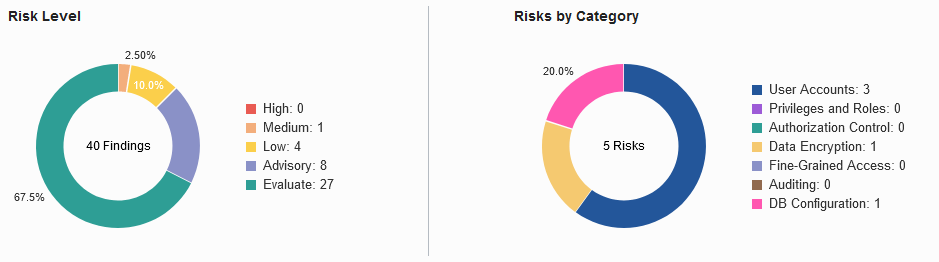

4. View the **Risk Summary** tab.

    - The **Risk Summary** tab shows you how much risk you have across all target databases in the specified compartment(s).
    - You can compare the number of high, medium, low, advisory, and evaluate risk findings across all target databases, and view which risk categories have the greatest numbers.
    - Risk categories include Target Databases, User Accounts, Privileges and Roles, Authorization Control, Fine-Grained Access Control, Data Encryption, Auditing, and Database Configuration.
    - Make note of the **Total Findings** for high, medium, and low risk levels as you later compare them to another assessment.

    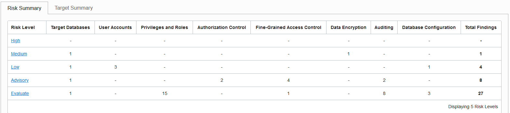

5. Click the **Target Summary** tab and view the information.

    - The **Target Summary** tab shows you the security posture of each target database.
    - You can view the number of high, medium, low, advisory, and evaluate risks for each target database.
    - You can view the assessment date and find out if the latest assessment deviates from a baseline (if one is set).
    - You can access the latest assessment report for each target database.

    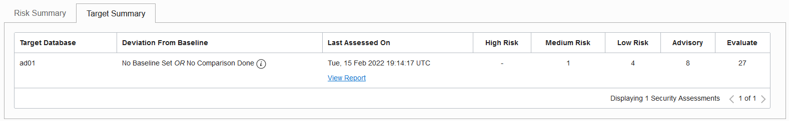

## Task 2: View the latest security assessment for your target database

When you registered your target database, Oracle Data Safe automatically created a security assessment for you. This is what you are viewing now.

1. On the **Target Summary** tab, locate the line that has your target database, and click **View Report**.

    The latest security assessment for your target database is displayed. Notice that **Latest assessment for target database** is displayed at the top of the page.

2. Review the table on the **Assessment Summary** tab.

    - This table compares the number of findings for each category in the report and counts the number of findings per risk level (**High Risk**, **Medium Risk**, **Low Risk**, **Advisory**, **Evaluate**, and **Pass**).
    - These values help you to identify areas that need attention.

    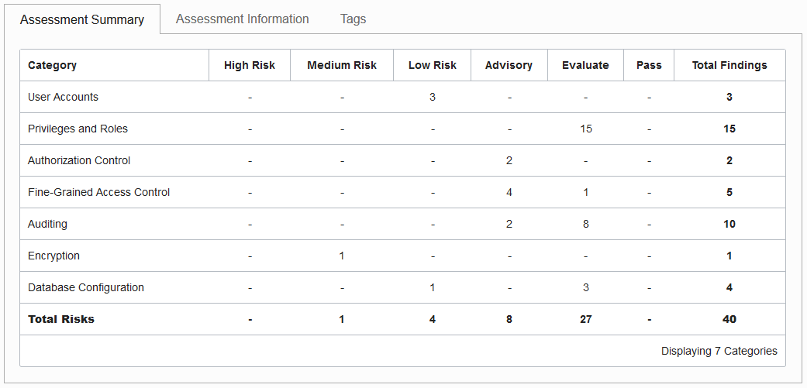

3. To view details about the security assessment itself, click the **Assessment Information** tab.

    - Details include assessment name, OCID, compartment to which the assessment was saved, target database name, target database version, assessment date, schedule (if applicable), name of the baseline assessment (if one is set), and complies with baseline flag (Yes, No, or No Baseline Set).

    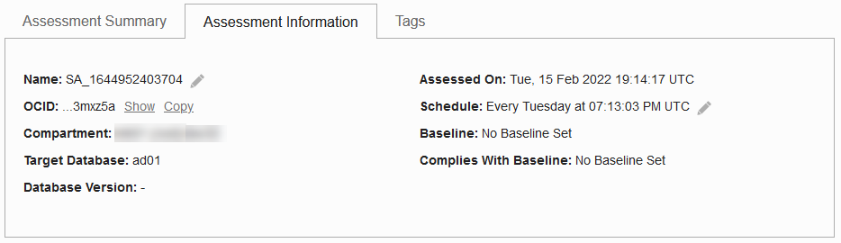

4. Scroll down and view the **Assessment Details** section.

    - This section shows you all the findings for each risk category.
    - Risks are color-coded to help you easily identify categories that have high risk findings (red).

    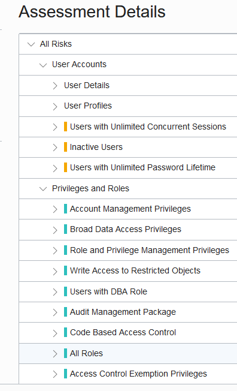

5. Under **Filters** on the left, notice that you can select the risk levels that you want displayed. Deselect **Advisory** and **Evaluate**, and then click **Apply**.

    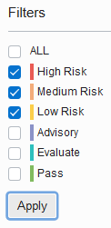

6. Under **User Accounts**, expand **User Details**.

    - For each user in your target database, the table shows you the user status, profile used, the user's default tablespace, whether the user is Oracle Defined (Yes or No), and how the user is authenticated (Auth Type).

    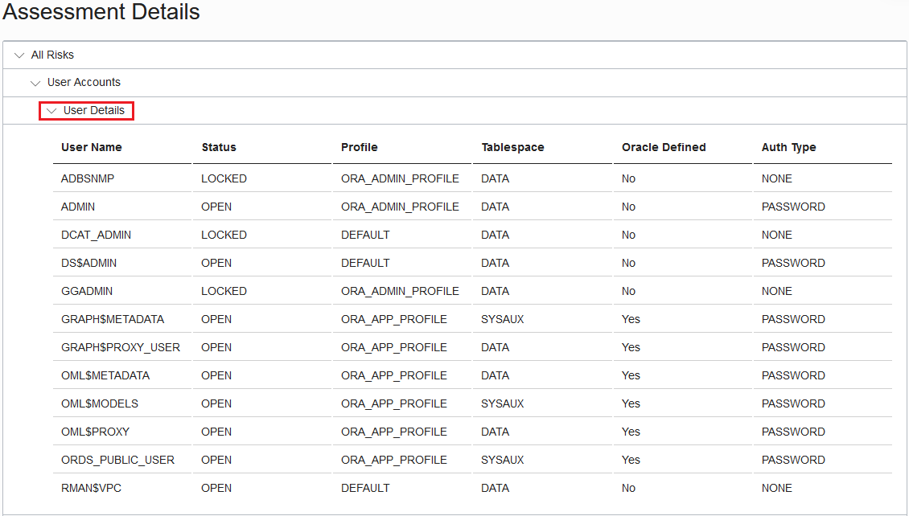

7. Expand another category and review the findings.

    - Each finding shows you the status (risk level), a summary of the finding, details about the finding, remarks to help you to mitigate the risk, and references - whether a finding is recommended by the Center for Internet Security (**CIS**), European Union's General Data Protection Regulation (**GDPR**), and/or Security Technical Implementation Guide (**STIG**). These references make it easy for you to identify the recommended security controls.
    - In the example below, the **Transparent Data Encryption** finding has two references: **STIG** and **GDPR**.

    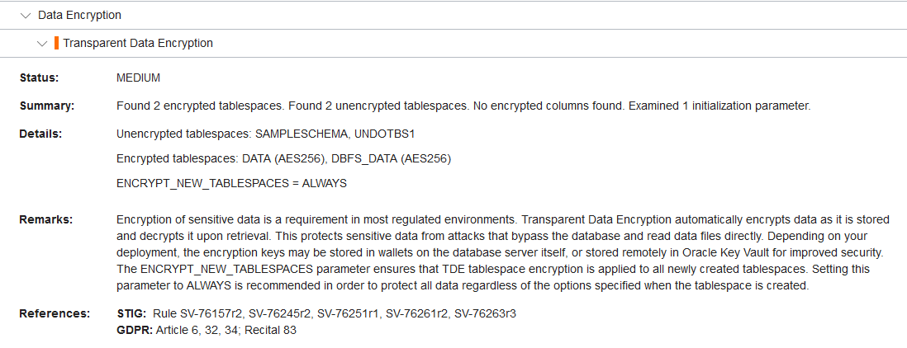

8. On the left under **Filters**, select **ALL**, and click **Apply**.

9. Collapse **User Accounts**, expand a few categories under **Privileges and Roles**, and review the findings.

10. Scroll down further and expand other categories. Each category lists related findings about your target database and how you can make changes to improve its security.

11. At the top of the page, click **View History**. Notice that you have one security assessment listed for your target database. This is a static copy of the latest security assessment.

    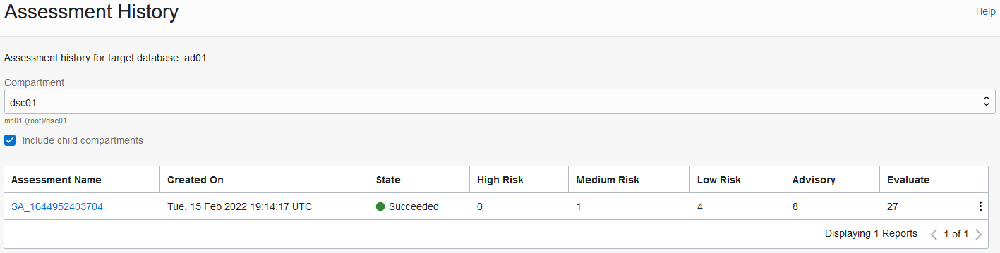

12. Click **Close** to return to the latest security assessment.

## Task 3: Refresh the latest security assessment and analyze the results

After you registered your target database at the beginning of this workshop, you loaded sample data into it. This sample data is not yet showing up in the latest security assessment. Refresh the latest assessment and view the new data.

1. While you are still viewing the latest security assessment, at the top of the assessment, click **Refresh Now**.

    The **Refresh Now** panel is displayed.

2. In the **Save Latest Assessment** box, enter **My Security Assessment**, and then click **Refresh Now**.

    - This action updates the latest security assessment for your target database and also saves a copy named My Security Assessment in the Assessment History.
    - The refresh operation takes about one minute.

    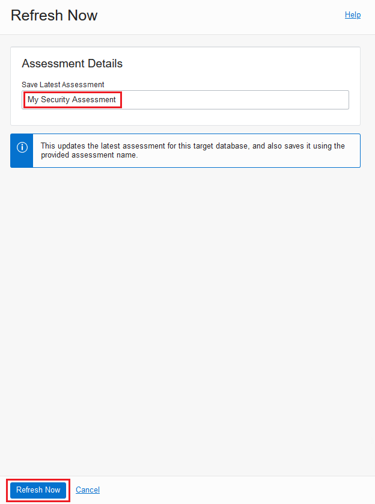

3. Click the **Assessment Information** tab and observe that the assessment date and time is right now.

    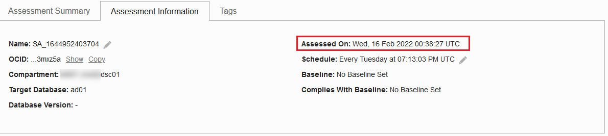

4. In the breadcrumb at the top of the page, click **Security Assessment** to return to the dashboard. Make sure your compartment is selected. Review the total findings for high, medium, and low risk levels.

    Notice that the values are different than the values you viewed in the original assessment in Task 1.

    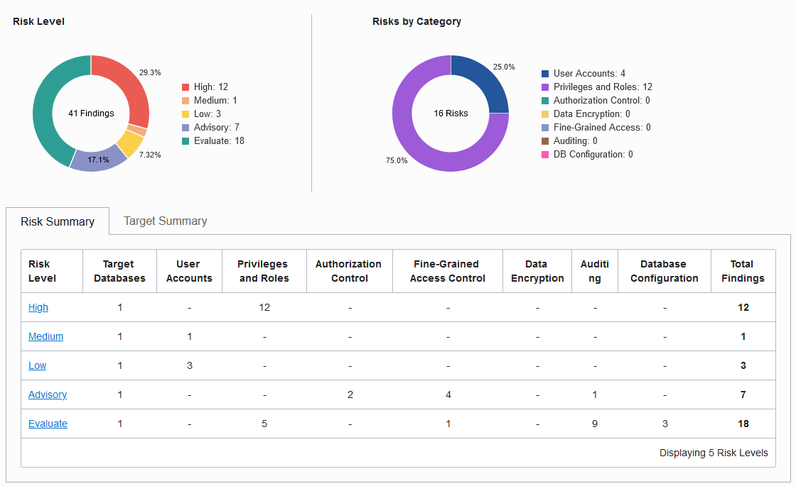

5. In the **Risk Level** column, click **High** to view all the high risk findings.

    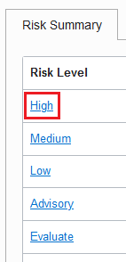

6. On the **Overview** tab, review the **Risks by Category** chart.

    - You can position your cursor over the percentage values to view the category name and count.

    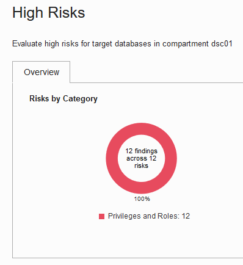

7. In the **Risk Details** section, expand one of the high level risks, for example, **System Privileges Granted to PUBLIC**.

    - The **Remarks** section explains the risk and how you can mitigate it.
    - The **Target Databases** section lists the target databases to which the high risk applies.

    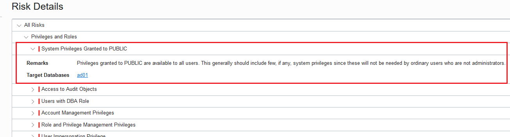

8. Click your target database name to view the details about the finding for your target database.

    - The finding includes your target database name, risk level, a summary about the risk, details on your target database, remarks that explain the risk and help you to mitigate it, and references.

    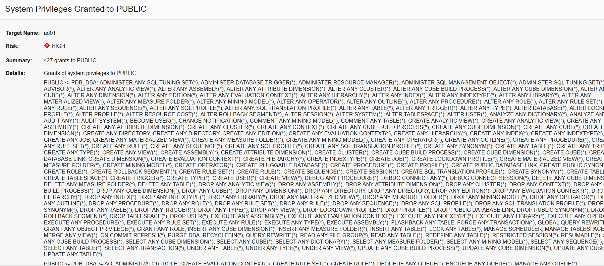

9. To view the latest assessment for your target database, scroll down to the bottom of the page and click the **click here** link. You are returned to the latest security assessment.

    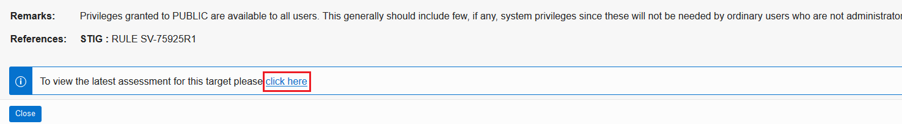

## Task 4: Add a schedule to save a security assessment for your target database every Sunday at 11:30 PM

1. In the breadcrumb at the top of the page, click **Security Assessment**.

2. Under **Related Resources** on the left, click **Schedules**.

    The **Schedules** page is displayed.

3. In the table, notice that a schedule already exists. Its type is LATEST. This is the default schedule that automatically runs a security assessment job on your target database once per week. You can update it and rename it, but you can't delete it.

    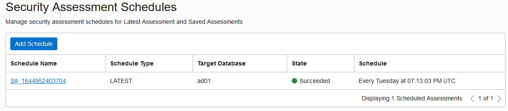

4. Click **Add Schedule**.

    The **Add Schedule To Save An Assessment** panel is displayed.

5. If the compartment shown at the top of the page is not yours, click **Change Compartment** and select your compartment.

6. From the **Target Database** drop-down list, select your target database.

7. In the **Schedule Name** box, enter **Sunday Security Assessment**.

8. From the **Compartment To Save The Assessments** drop-down list, select your compartment.

9. From the **Schedule Type** drop-down list, select **Weekly**.

10. From the **Every** drop-down list, select **Sunday**.

11. Click the **Time** box, scroll down, and select **11:30 PM**. You can manually enter the time too.

12. Click **Add Schedule**. When the schedule is created, its status changes to SUCCEEDED.

    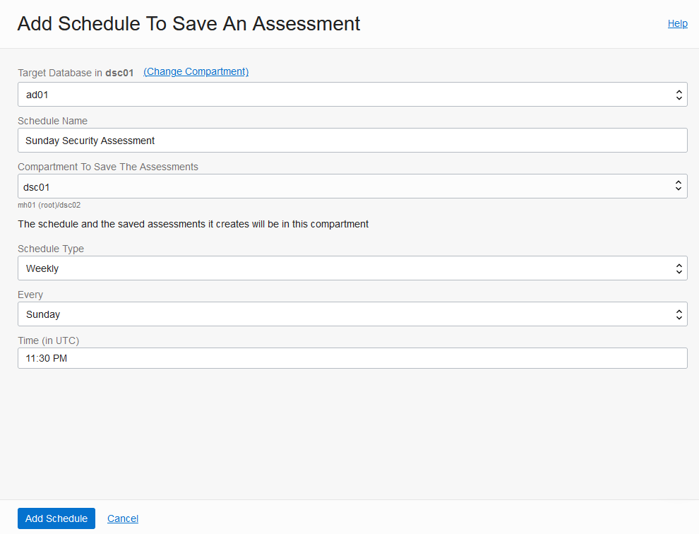

## Task 5: View the history of all security assessments for your target database

1. In the breadcrumb at the top of the page, click **Security Assessment**.

2. Click the **Target Summary** tab.

3. Click the **View Report** link for your target database.

    The latest security assessment is displayed.

4. At the top of the page, click **View History**.

5. Review all the security assessments for your target database.

    - So far, you should have two security assessments: The original security assessment (static copy) that was automatically generated for you by Oracle Data Safe, and the security assessment that you saved earlier as My Security Assessment.
    - If you don't see your assessments, make sure that your compartment is selected.
    - To view assessments saved to a different compartment, select the compartment from the **Compartment** drop-down list.
    - To also list assessments that were saved to child compartments of the selected compartment, select the **Include child compartments** check box.

    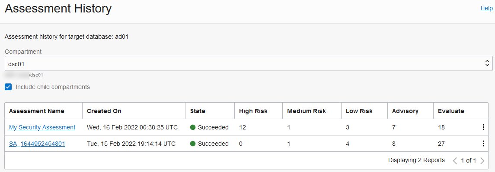

6. Review the number of findings for each risk level for your target database. Notice how the values changed between the two assessments.

7. Click **Close**.

## Task 6: Set a baseline and generate a Comparison report for Security Assessment

A baseline assessment shows you data for all your target databases in a selected compartment at a given point in time. However, because we are only dealing with one target database in your compartment, the baseline assessment shows data for only your target database. When you do a baseline comparison, Oracle Data Safe automatically compares only the assessments that pertain to your target database.

1. In the breadcrumb at the top of the page, click **Security Assessment**.

2. Under **Related Resources**, click **Assessment History**.

3. Click the name of the first security assessment that Oracle Data Safe generated during target database registration. The names starts with **SA_**.

    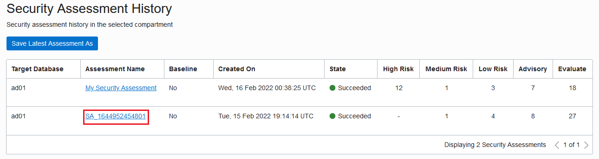

    The security assessment is displayed.

4. Click **Set As Baseline**.

    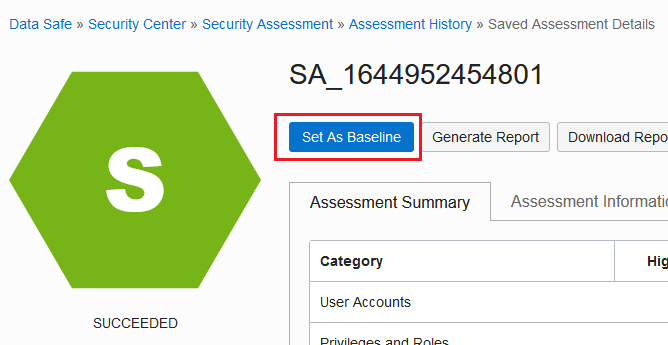

    The **Set As Baseline?** dialog box is displayed.

5. Click **Yes** to confirm that you want to set these findings as the baseline.

    *Important! Stay on the page until the message **Baseline has been set** is displayed.*

    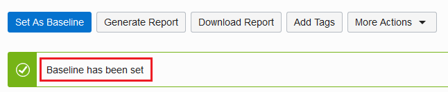

6. In the breadcrumb at the top of the page, click **Assessment History** and confirm that there is a new row in the table for the baseline assessment.

    

7. Access the latest assessment for your target database. To do this, click **Security Assessment**. Click the **Target Summary** tab. Click **View Report** for your target database.

    The latest security assessment report for your target database is displayed.

8. Under **Resources** on the left, click **Compare with Baseline**.

    Oracle Data Safe automatically begins processing the comparison.

    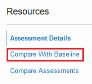

9. When the comparison operation is completed, review the **Comparison** report.

    - Review the number of findings per risk category for each risk level. Categories include **User Accounts**, **Privileges and Roles**, **Authorization Control**, **Data Encryption**, **Fine-Grained Access Control**, **Auditing**, and **Database Configuration**.
    - You can identify where the changes have occurred on your target database by viewing cells that contain the word **Modified**. The number represents the total count of new, remediated, and modified risks on the target database.
    - In the details table, you can view the risk level for each finding, the category to which the finding belongs, the finding name, and a description of what has changed on your target database. The Comparison Report column is important because it provides explanations of what is changed, added, or removed from the target database since the baseline report was generated.

    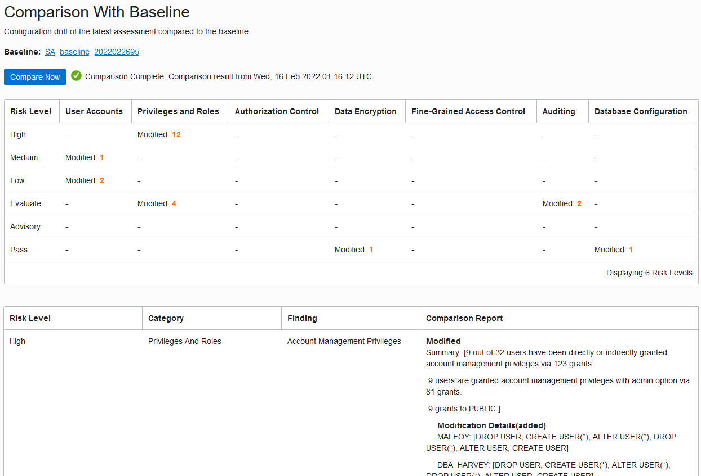

## Task 7: View the dashboard for User Assessment

1. Navigate to **User Assessment**. To do this, in the breadcrumb at the top of the page, click **Security Center**. On the left, click **User Assessment**.

2. Under **List Scope**, make sure your compartment is selected.

3. At the top of the dashboard, review the four charts.

    - The **User Risk** chart shows you the number and percentage of users who are **Critical Risk**, **High Risk**, **Medium Risk**, and **Low Risk**.
    - The **User Roles** chart shows you the number of users with the **DBA**, **DV Admin**, and **Audit Admin** roles.
    - The **Last Password Change** chart shows you the number and percentage of users who changed their passwords within the last 30 days, within the last 30-90 days, and 90 days ago or more.
    - The **Last Login** chart shows you the number and percentage of users that signed in to the target database within the last 24 hours, within the last week, within the current month, within the current year, and a year ago or more.

    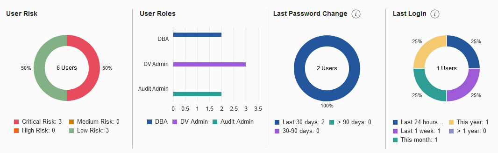

4. Review the **Risk Summary** tab.

    - The **Risk Summary** tab focuses on risks across all your target databases. It shows you risk levels, where the risks were found, the number of users at each risk level, and the roles held by the total number of users at each risk level.

    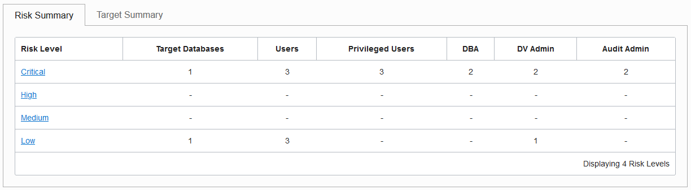

5. Click the **Target Summary** tab. This tab provides the following information:

    - Number of critical and high risk users, DBAs, DV Admins, and Audit Admins
    - Date and time of the latest user assessment
    - Whether the latest user assessment deviates from the baseline (if one is set)

    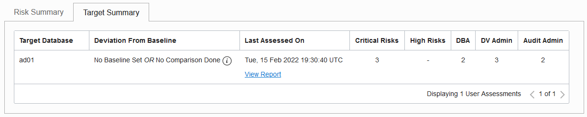

## Task 8: Analyze users in the latest user assessment

Currently, the latest user assessment is the one that was automatically generated by Oracle Data Safe when you registered your target database.

1. On the **Target Summary** tab, click **View Report** to view the latest user assessment for your target database.

2. At the top of the report, review the **User Risks**, **User Roles**, **Last Password Change**, and **Last Login** charts.

    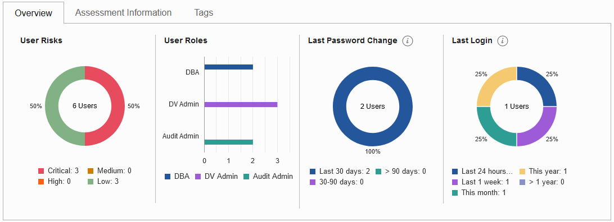

3. Scroll down and review the **Assessment Details** section. This table provides the following information about each user:

    - User name
    - User type (for example, PRIVILEGED, SCHEMA)
    - Whether the user is a DBA, DV Admin, or Audit Admin
    - User risk level (for example, LOW, HIGH, or CRITICAL)
    - User's status (for example, OPEN, LOCKED, or EXPIRED\_AND\_LOCKED)
    - Date and time the user last logged in to the target database
    - Audit records for the user

    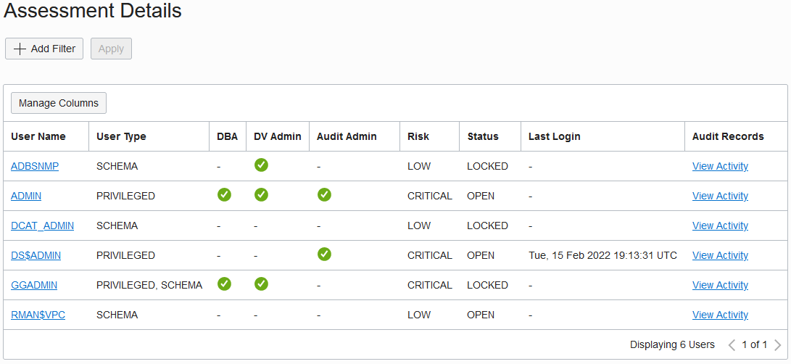

4. In the **User Name** column, click one of the users.

    The **User Details** panel shows the following information about the user:

    - User name
    - Target database name
    - Date and time when the user was created
    - Risk level - Hover over the question mark to view what constitutes a critical risk user.
    - User type
    - User profile
    - Privileged roles (the Admin roles granted to the user)
    - Last login date and time
    - Roles - Expand **All Roles** to view all the roles granted to the user.
    - Privileges - Expand **All Privileges** to view all the privileges granted to the user.

    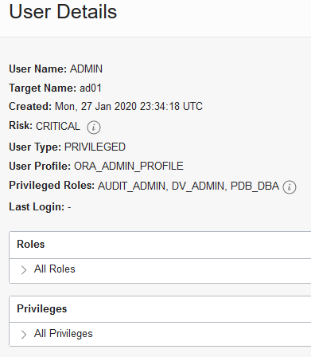

5. Click **Close**.

6. Notice at the top of the table that you can set filters. Click **+ Filter**. From the first drop-down list, select **Risk**. From the second drop-down list, select **=**. In the box, enter **CRITICAL**. Click **Apply**. The table now shows you only critical risk users.

    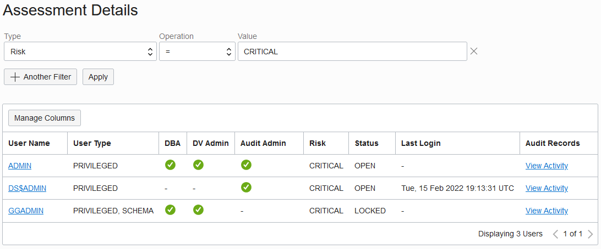

7. To remove the filter, click the **X** next to the filter.

## Task 9: Review the `ADMIN` user's audit records

1. Identify the row in the table for the `ADMIN` user. In the **Audit Records** column for the `ADMIN` user, click **View Activity**.

    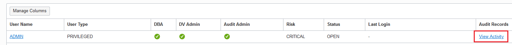

    The **All Activity** report for the `ADMIN` user is displayed.

2. Examine the report.

    - The report is automatically filtered to show you audit records for the past one week, for the `ADMIN` user, and for your target database.
    - At the top of the report, you can view totals for **Targets**, **DB Users**, **Client Hosts**, **DMLs**, **Privilege Changes**, **DDLs**, **User/Entitlement Changes**, **Login Failures**, **Login Successes**, and **Total Events**.
    - The **Event** column in the table shows you the types of activities performed by the `ADMIN` user, for example, `LOGON`, `AUDIT`, `CREATE AUDIT POLICY`, and so on.
    - At the bottom of the page, click the page numbers to view more audit records.

    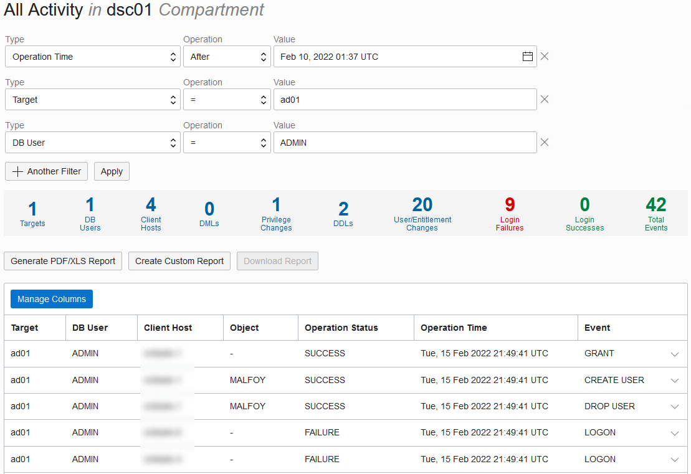

## Task 10: View the user assessment history for all target databases

1. Under **Security Center**, click **User Assessment**.

2. Under **Related Resources**, click **Assessment History**.

    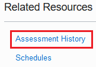

3. Under **List Scope**, make sure your compartment is selected.

4. Notice that you currently have one user assessment for your target database. This view, however, lets you review the user assessment history for all your target databases.

    - You can compare the number of critical risks, high risks, DBAs, DV Admins, and Audit Admins across all target databases.
    - You can also quickly identify user assessments that are set as baselines.

    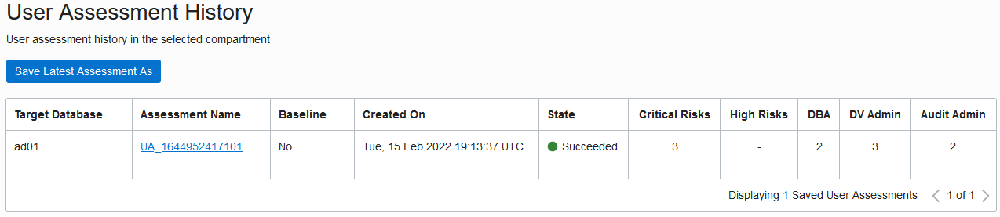

5. To sort the list by target database, click the **Target Database** column heading.

6. Click the name of the user assessment for your target database.

    - This assessment was generated by Oracle Data Safe when you registered your target database. It is a saved copy of the latest assessment.
    - Notice that you cannot refresh the data in a saved user assessment.
    - Make note of the assessment's name. In the example below, the assessment's name ends with 17101.

    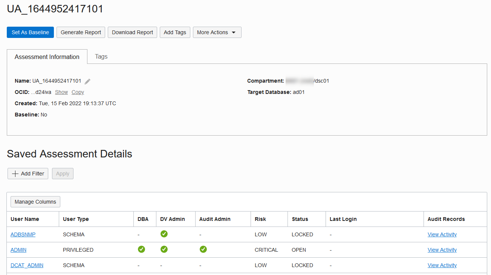

## Task 11: Refresh the latest user assessment and rename it

Let's find the actual latest assessment (not a saved copy of it) and refresh it.

1. In the breadcrumb at the top of the page, click **User Assessment**, and then click the **Target Summary** tab.

2. Click **View Report** for your target database to open the latest user assessment.

    - Notice that this assessment's name is different than the last assessment you viewed. It is not the same as the copy. It's a completely separate user assessment.
    - Also notice that you can refresh this assessment, whereas you couldn't refresh the copy in the Assessment History.

3. To refresh the latest user assessment, click the **Refresh Now** button.

    The **Refresh Now** panel is displayed.

4. For now, let's keep the default name as is, and click **Refresh Now**. Wait for the status to read **SUCCEEDED**.

    - When you refresh the latest user assessment, Oracle Data Safe automatically saves a static copy of it to the Assessment History.

    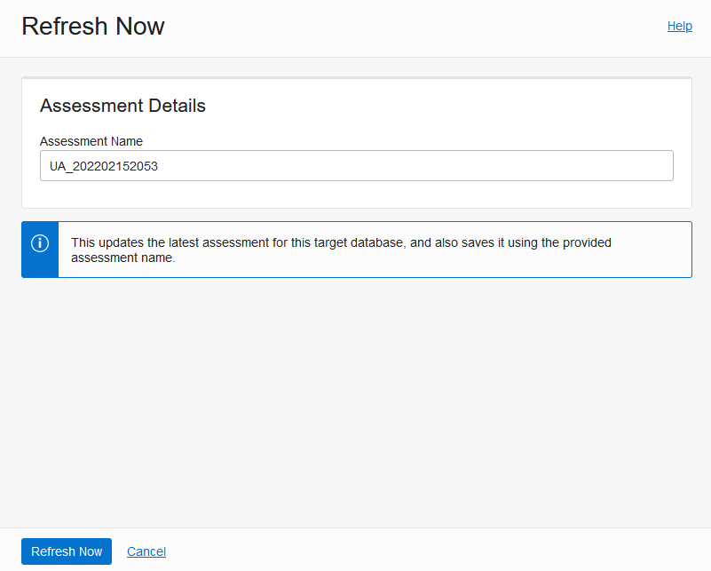

5. Review the refreshed latest assessment. Notice that the latest assessment kept its original name.

6. Click the **Assessment Information** tab, and then click the **Pencil** icon next to the assessment name. Change the name to **Latest User Assessment**, and then click the **Save** icon. The name is updated on the page.

    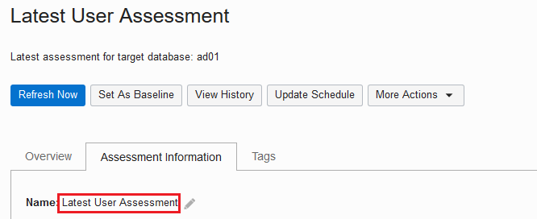

7. In the breadcrumb at the top of the page, click **User Assessment**. Under **Related Resources**, click **Assessment History**.

8. Notice that there is an additional saved user assessment. None of the user assessments is called **Latest User Assessment**. At a glance, you can compare the number of critical risks, high risks, DBAs, DV Admins, and Audit Admins between the two user assessments.

    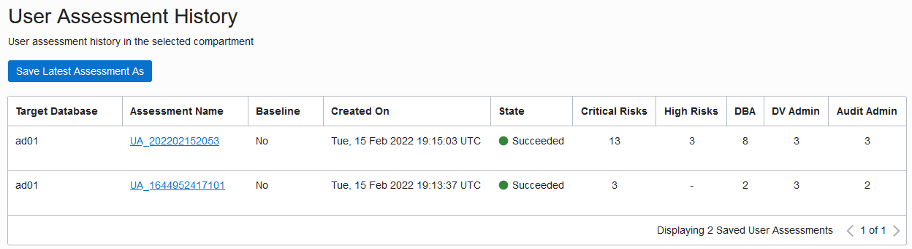

## Task 12: Download the latest user assessment as a PDF report

1. Return to the latest user assessment. To do so, under **Security Center**, click **User Assessment**. Click the **Target Summary** tab, and then click **View Report** for your target database.

2. From the **More Actions** menu, click **Generate Report**.

    The **Generate Report** dialog box is displayed.

3. Leave **PDF** selected as the report format, and click **Generate Report**.

4. Wait for a message that says the **PDF report generation is complete**, and then click **Close**.

    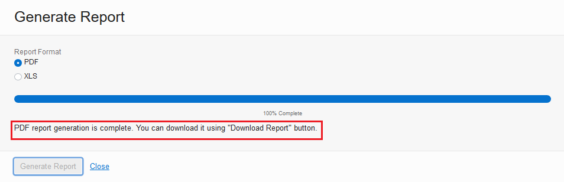

5. From the **More Actions** menu, click **Download Report**.

    The **Download Report** dialog box is displayed.

6. Leave the **PDF** report format selected, and click **Download Report**.

    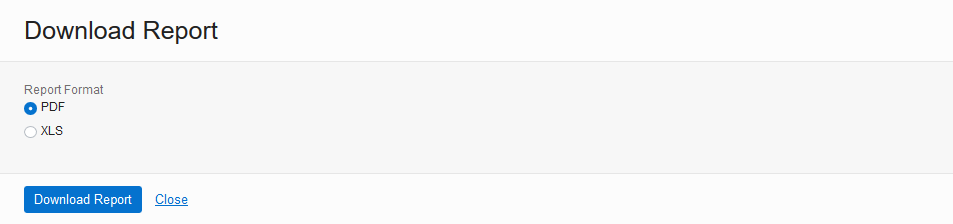

7. In the **Opening user-assessment-report.pdf** dialog box, leave **Save File** selected, and click **OK**.

    The **Enter name of file to save to** dialog box is displayed.

8. Browse to the desktop, leave **user-assessment-report.pdf** set as the name, and then click **Save**.

9. On your desktop, open the report and scroll through it. When you are done, close the file.

    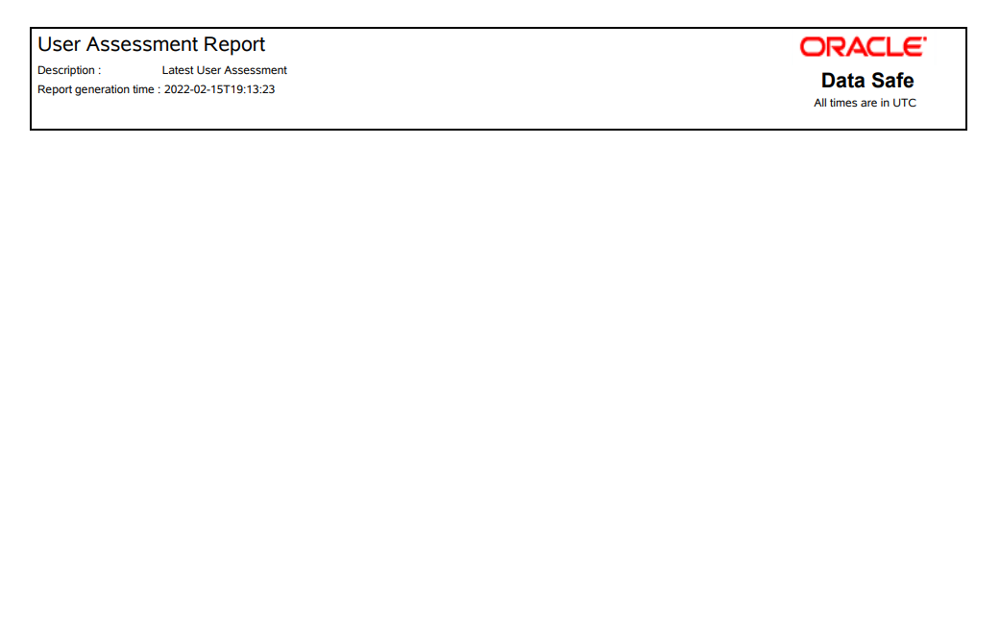

    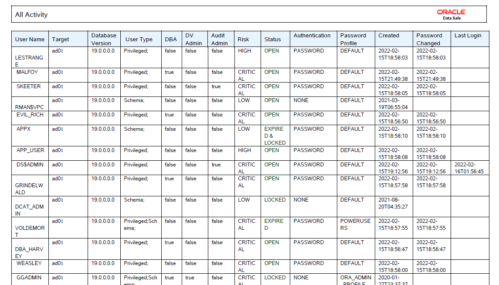

10. Close the PDF.

## Task 13: Compare the latest user assessment with another user assessment

You can select a user assessment to compare with the latest user assessment. With this option, you don't need to set a baseline.

1. On the left under **Resources**, click **Compare Assessments**. This option is only available when you are viewing the latest user assessment.

    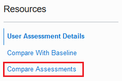

2. Scroll down to the **Comparison with Other Assessments** section.

3. If your compartment isn't shown, click **Change Compartment** and select your compartment.

4. From the **Select Assessment** drop-down list, select the earliest assessment for your target database. As soon as you select it, the comparison operation is started.

5. Review the **Comparison** report. The report tells you that several new users are added to the database since the initial user assessment. Many are identified as a critical risk. At the bottom of the page, click the **Next to Page 2** button to view the entire report.

    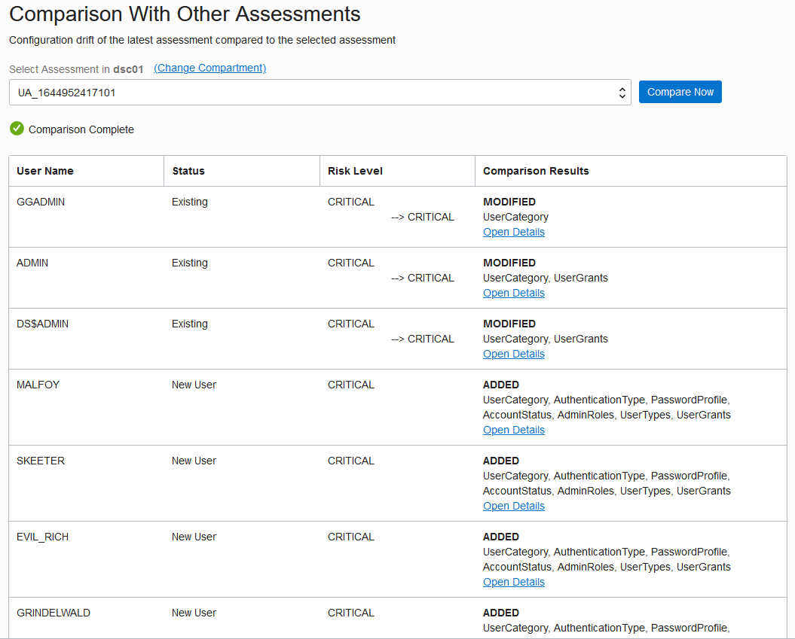

6. In the **Comparison Results** column, click one of the **Open Details** links to view more information.

    The **Comparison Details** panel is displayed.

    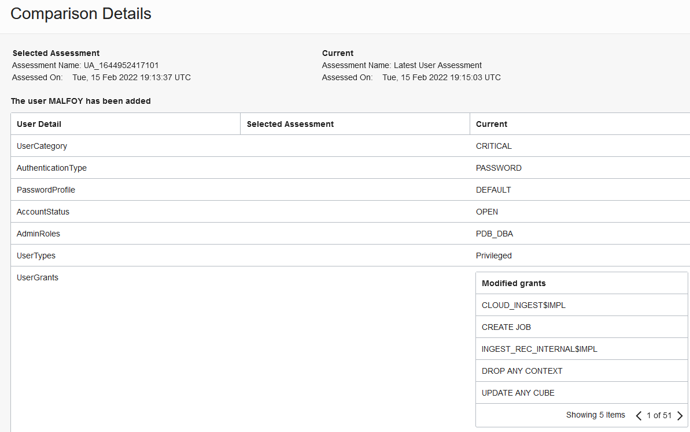

7. Review the information, and then click **Close**.

## Learn More

- [Security Assessment Overview](https://www.oracle.com/pls/topic/lookup?ctx=en/cloud/paas/data-safe&id=UDSCS-GUID-030B2A14-272F-49CF-80D2-5559C722E0FF)
- [User Assessment Overview](https://www.oracle.com/pls/topic/lookup?ctx=en/cloud/paas/data-safe&id=UDSCS-GUID-6BF46EE2-F7B5-4710-A09C-069EA95F8052)

## Acknowledgements

* **Author** - Jody Glover, Consulting User Assistance Developer, Database Development
* **Last Updated By/Date** - Jody Glover, April 14, 2022
