# Assess database configurations

## Introduction

Imagine that you are a database security administrator responsible for keeping your organization's databases securely configured.

Your team has established an approved security posture for a database, but database configurations do not remain static. Administrators grant privileges, application requirements change, and configuration settings are modified. A change that seems harmless can introduce a security risk, and manually reviewing every database configuration change is difficult.

You need a way to answer questions, such as:

- What security risks exist in my database today?
- Which findings should I investigate first?
- Does the database still comply with the security posture my team previously approved?
- Has a recent database change introduced a new security risk?
- What changed, and how can I remediate it?

Oracle Data Safe Security Assessment helps you answer these questions by analyzing database configurations, user accounts, and security controls and identifying findings that could introduce risk.

When you register a target database, Data Safe automatically creates its latest security assessment and updates it weekly. You can also refresh an assessment on demand. By establishing an assessment as a baseline, you can detect security drift and identify changes to the database's security posture.

### Scenario

In this lab, assume that you are responsible for monitoring the security posture of a database used by your organization.

You will first review the database's current security assessment and determine that its existing configuration represents an acceptable starting point. You will establish that assessment as your baseline.

Next, a database privilege will be granted to `PUBLIC`, simulating a potentially risky administrative change.

Rather than relying on someone to tell you that the change occurred, you will use Security Assessment to:

1. Reassess the database.
2. Detect that its security posture has changed.
3. Investigate the new high-risk finding.
4. Compare the current assessment with your approved baseline.
5. Identify exactly what changed.

By the end of the lab, you will have experienced the workflow a security or database administrator can use to identify security configuration drift.

Estimated Time: 20 minutes

[Lab 2 - Assess database configurations](videohub:1_8st8f2xf)

### Objectives

In this lab, you will:

- Evaluate the current security posture of your target database
- Establish an approved security posture as a baseline
- Simulate a risky database privilege change
- Reassess the database to detect the new risk
- Investigate the new security finding and its remediation guidance
- Compare the current security posture with the baseline to identify security drift


### Prerequisites

This lab assumes you have:

- Obtained an Oracle Cloud account and signed in to the Oracle Cloud Infrastructure Console
- Access to or prepared an environment for this workshop
- Access to a registered target database


### Assumptions

- Your data values might be different than those shown in the screenshots.
- Please ignore the dates for the data and database names. Screenshots are taken at various times and may differ between labs and within labs.


## Task 1: View the latest security assessment for your target database

1. Navigate to the **Security assessment** landing page.

2. If needed, select your compartment without child compartments.

3. On the **Overview** tab, review the charts.

    - The **Risk level** pie chart shows you a percentage breakdown of the different risk levels (for example, LOW, HIGH, MEDIUM, ADVISORY, EVALUATE, DEFERRED) across all target databases in the selected compartment(s).
    - The **Risks by category** pie chart shows you a percentage breakdown of the applicable risk categories (for example, User Accounts, Privileges and Roles, Authorization Control, Data Encryption, Fine-Grained Access, Auditing, and Database Configurations) across target databases in the selected compartment(s).
    - The **Top 5 common security controls** bar chart shows the number of target databases at each risk level for each of the top five common controls. The top five common controls are the five security controls that Oracle considers the most important to the security of your target databases.

    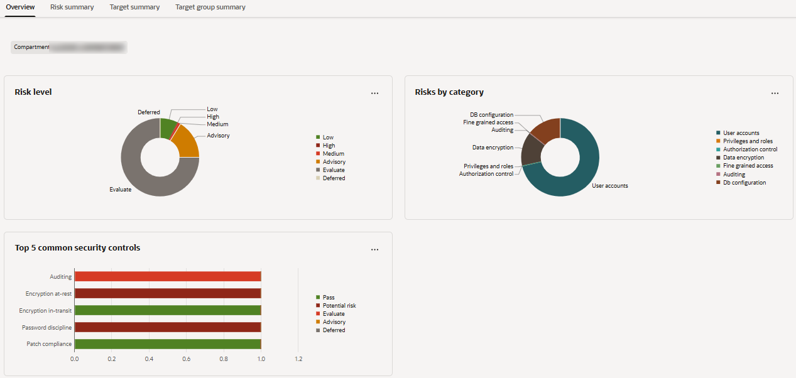

4. Select the **Target summary** tab, and then select the name of your database.

    The latest security assessment for your target database opens. Notice that **Latest assessment for target database...** is displayed at the top of the page.

5. Select the **Assessment summary** tab and review the risk level, finding name, and summary for the top 5 common security controls that Oracle considers to be the most important to the security of your target database.

    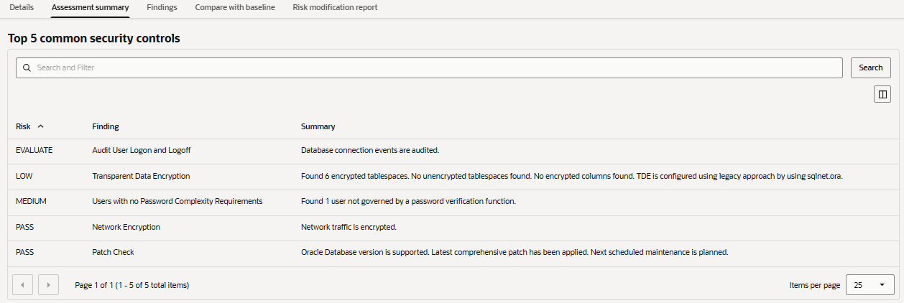

6. Scroll down and review the **Summary** table.

    - This table lists the number of findings for each risk category, broken down by risk level.
    - These values help you to identify areas that need attention.

    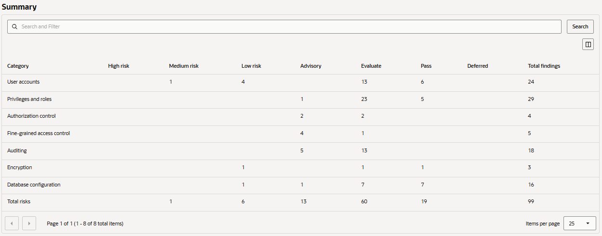

7. Select the **Findings** tab.

    This tab lists all the findings. For each finding, you can view the risk level, finding name, risk category, references, and documentation links.

    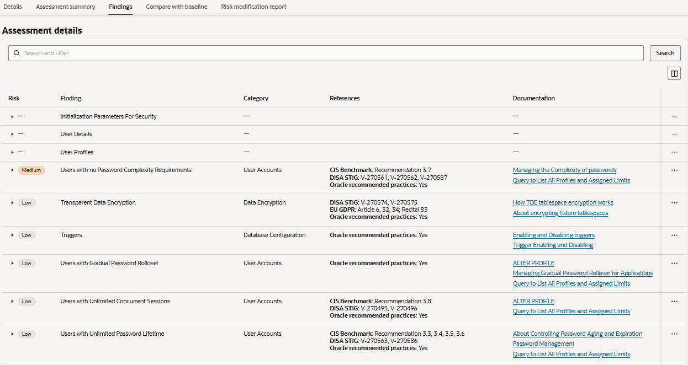

8. At the top, select the **Search and Filter** box. Notice that you can filter by risk, finding, category, references, documentation, summary, details, and remarks. Select outside the box to hide the filter options.

    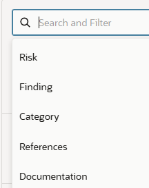

9. Expand a finding (the expand arrow is to the left of the risk level) and review the information. Remove any filters after you are done.

    - For each finding, there is a brief overview of the finding, a summary of what Oracle Data Safe found on your target database, details about the finding on your target database, remarks to help you to mitigate the risk, and references for Center for Internet Security (**CIS Benchmark**), Security Technical Implementation Guide (**DISA STIG**), European Union's General Data Protection Regulation (**EU GDPR**), and/or **Oracle recommended practices**. These references make it easy for you to identify the recommended security controls.
    - In the example below, the **Transparent Data Encryption** finding has three references: **DISA STIG**, **EU GDPR**, and **Oracle recommended practices**.

    TIP: To quickly locate a finding, search by finding in the **Search and Filter** box.

    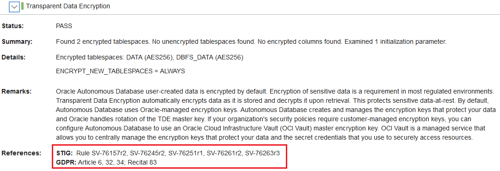


## Task 2: Set the latest assessment as the baseline assessment

A baseline assessment shows you data for all your target databases in a selected compartment at a given point in time. However, because we are only dealing with one target database in your compartment, the baseline assessment shows data for only one target database. Let’s assume that we are okay with the current configuration and we want to set it as our baseline. New assessments are then automatically compared to the baseline.

1. From the **Actions** menu, select **Set as baseline**.

    The **Set baseline** dialog box appears.

    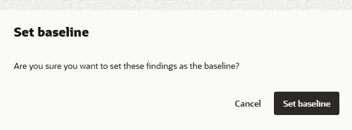

2. Select **Yes** to confirm that you want to set these findings as the baseline and wait a moment for the dialog box to close.

3. Wait until the baseline name appears on the **Details** tab.

    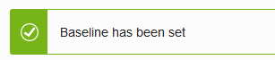


## Task 3: Create a risk on the target database

In this task, you manually create a new configuration risk on your database by issuing a `GRANT` command. Later, when you refresh the latest security assessment, you can compare assessments.

1. Access the SQL worksheet in Database Actions. If your session has expired, sign in again as the `ADMIN` user.

2. If needed, clear the worksheet and the **Script Output** tab.

3. On the worksheet, enter the following command:

    ```
    <copy>grant ALTER ANY ROLE to PUBLIC;</copy>
    ```

4. On the toolbar, select the **Run Statement** button (green circle with white arrow).

    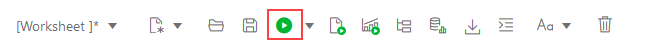

5. On the **Script Output** tab, verify that the grant is successful.


## Task 4: Refresh the latest security assessment and analyze the results

1. Return to the browser tab for Oracle Data Safe.

2. From the **Actions** menu, select **Refresh now** to get the latest data.

    The **Refresh now** panel opens.

3. Leave the default name as is, and select **Refresh now**. Wait for the status next to the name of the security assessment to change from **Updating** to **Succeeded**. It takes about 1 minute.

    This action updates the data in the latest security assessment for your target database and also saves a copy of the assessment to the Assessment History.

    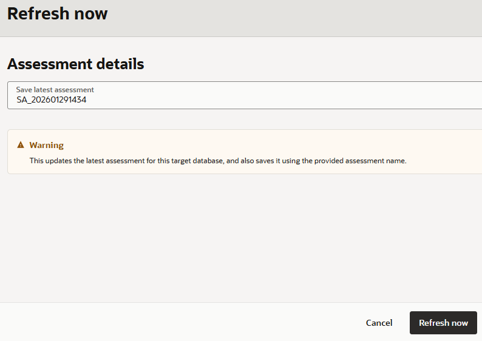

4. On the **Details** tab, notice that the assessed date and time is right now, and that **Complies with baseline** is equal to **No**.

    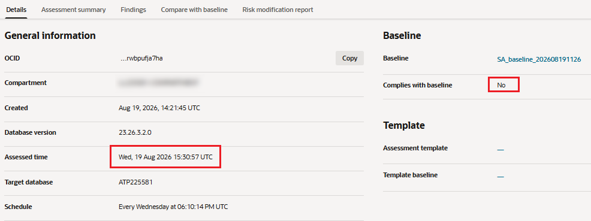

5. Select the **Findings** tab and expand **System Privileges Granted to PUBLIC**. You can use the search box to quickly display this finding.

    - This is a high risk finding.
    - In the **Summary** section, you can see that the grant you made in the previous task is identified: All users are granted via 1 grant to PUBLIC.

    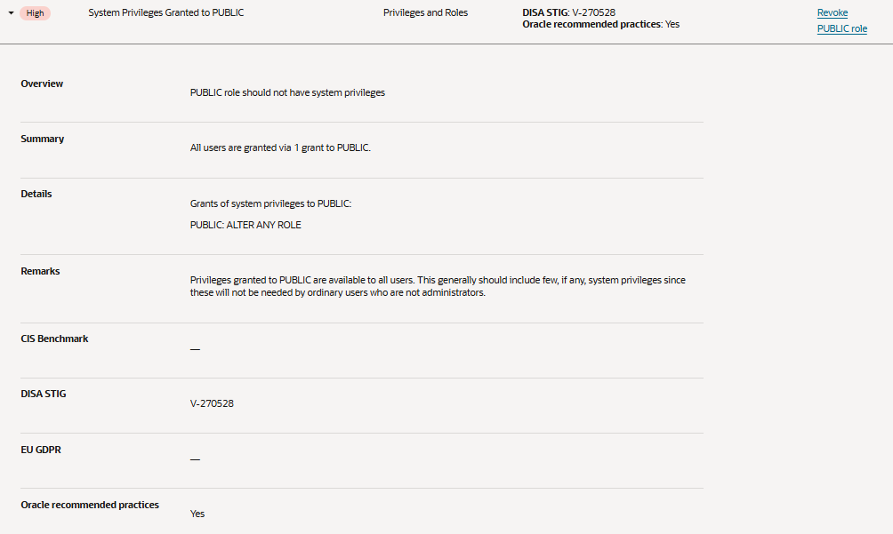

## Task 5: Compare your assessment with the baseline

1. Select the **Compare with baseline** tab. If the baseline is not listed, refresh your browser.

2. Select **View comparison report**.

    The **Comparison with baseline** panel opens.

3. Review the information.

    - Review the number of findings per risk category for each risk level. Categories include **User accounts**, **Privileges and roles**, **Authorization control**, **Data encryption**, **Fine-grained access control**, **Auditing**, and **Database configuration**.
    - You can identify where the changes have occurred on your target database by viewing cells that contain the word **Modified**. The number represents the total count of new, remediated, and modified risks on the target database.
    - In the details table, you can view information about each finding, including the risk level, the category to which the finding belongs, the finding name, and what was added, removed, or modified in the target database since the baseline report was generated. You can expand each finding to view more information.

    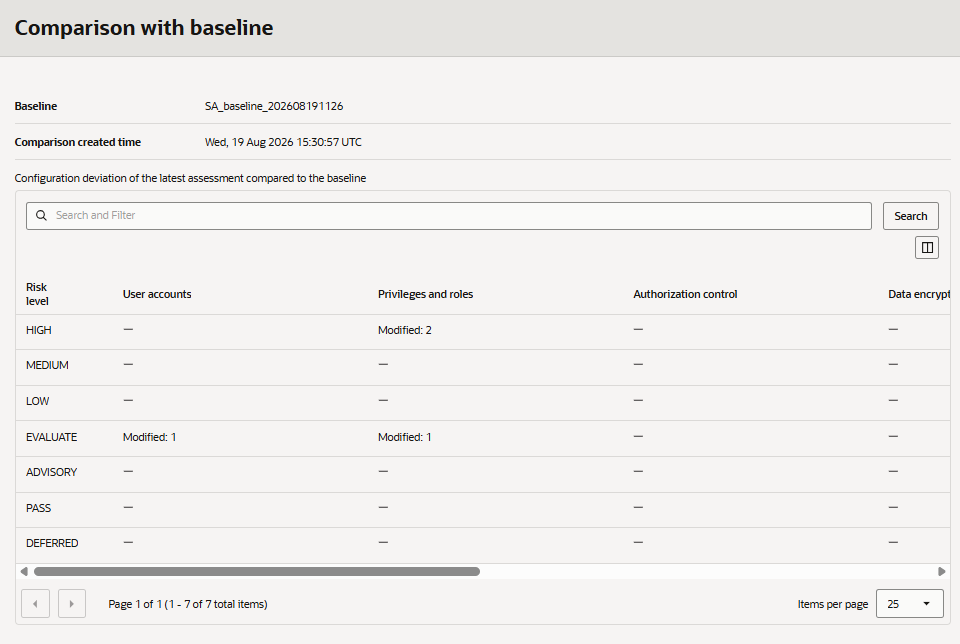
    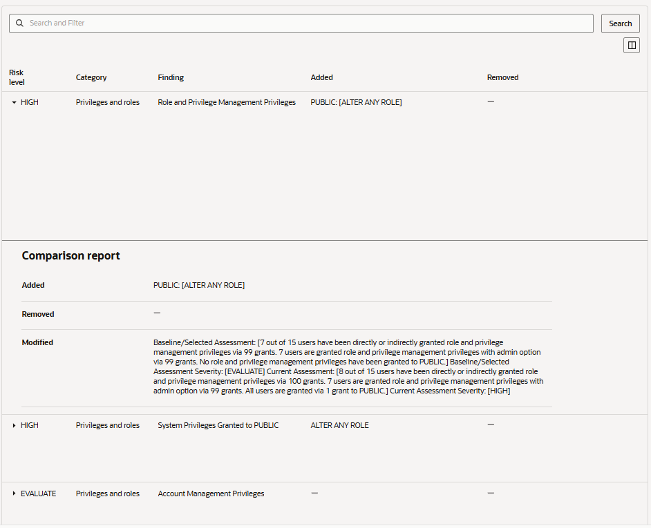

4. Select **Close** to close the panel.

You may now **proceed to the next lab**.


## Learn More

- [Security Assessment Overview](https://docs.oracle.com/iaas/data-safe/doc/security-assessment-overview.html)

## Acknowledgements

- **Author** - Jody Glover, Lead Principal User Assistance Developer, Database Development
- **Contributor** - Bettina Schäumer, Lead Principal Product Manager, Oracle Database Security
- **Last Updated By/Date** - Bettina Schäumer, August 20, 2026
