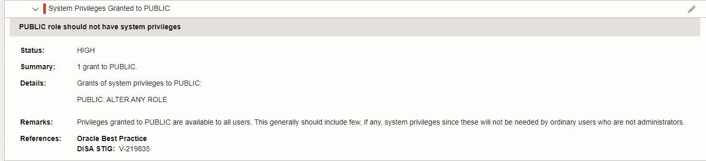

# Assess Database Configurations

## Introduction

Security Assessment helps you assess the security of your database configurations. It analyzes database configurations, user accounts, and security controls, and then reports the findings with recommendations for remediation activities that follow best practices to reduce or mitigate risk. By default, Oracle Data Safe automatically generates security assessments for your target databases and stores them in the Assessment History. You can analyze assessment data across all your target databases and for each target database. You can monitor security drift on your target databases by comparing the latest assessment to a baseline or to another assessment.

In this lab, you explore Security Assessment.

Estimated Time: 20 minutes

Watch the video below for a quick walk-through of the lab.
[Assess Database Configurations](videohub:1_egh1qfyz)

### Objectives

In this lab, you will:

- View the overview page for Security Assessment
- View the latest security assessment for your target database
- Set the latest assessment as the baseline assessment
- Generate activity on the target database
- Refresh the latest security assessment and analyze the results
- Compare your assessment with the baseline

### Prerequisites

This lab assumes you have:

- Obtained an Oracle Cloud account and signed in to the Oracle Cloud Infrastructure Console
- Prepared your environment for this workshop
- Registered your target database with Oracle Data Safe


### Assumptions

- Your data values are most likely different than those shown in the screenshots.


## Task 1: View the overview page for Security Assessment

1. In Security Center, click **Security Assessment**.

2. Under **List Scope**, select your compartment. Deselect **Include child compartments**.

    The overview page shows statistics for your target database.

3. At the top of the page, review the **Risk Level** and **Risks by Category** charts.

    - The **Risk Level** chart shows you a percentage breakdown of the different risk levels (High, Medium, Low, Advisory, and Evaluate) across all target databases in the selected compartment(s).
    - The **Risks by Category** chart shows you a percentage breakdown of the different risk categories (User Accounts, Privileges and Roles, Authorization Control, Data Encryption, Fine-Grained Access, Auditing, and Database Configurations) across target databases in the selected compartment(s).

    


4. Review the information on the **Risk Summary** tab.

    - The **Risk Summary** tab shows you how much risk you have across all target databases in the specified compartment(s).
    - You can compare the number of high, medium, low, advisory, and evaluate risk findings across all target databases, and view which risk categories have the greatest numbers.
    - Risk categories include Target Databases, User Accounts, Privileges and Roles, Authorization Control, Fine-Grained Access Control, Data Encryption, Auditing, and Database Configuration.

    


5. Click the **Target Summary** tab and review the information.

    - The **Target Summary** tab shows you the security posture of each target database.
    - You can view the number of high, medium, low, advisory, and evaluate risk findings for each target database.
    - You can view the assessment date and find out if the latest assessment deviates from a baseline (if one is set).
    - You can access the latest assessment report for each target database.

    

## Task 2: View the latest security assessment for your target database

Oracle Data Safe automatically creates a security assessment of your target database during registration. This assessment is referred to as the *latest assessment*.

1. On the **Target Summary** tab, locate the line that has your target database, and click **View Report**.

    The latest security assessment for your target database is displayed. Notice that **Latest assessment for target database** is displayed at the top of the page.

2. Review the table on the **Assessment Summary** tab.

    - This table compares the number of findings for each category in the report and counts the number of findings per risk level (**High Risk**, **Medium Risk**, **Low Risk**, **Advisory**, **Evaluate**, and **Pass**).
    - These values help you to identify areas that need attention.

    


3. To view details about the security assessment itself, click the **Assessment Information** tab.

    - Details include assessment name, OCID, compartment to which the assessment was saved, target database name, target database version, assessment date, schedule, name of the baseline assessment (if one is set), and complies with baseline flag (Yes, No, or No Baseline Set).

    

4. Rename the latest security assessment: Click the pencil icon to the right of **Name**, enter **SA_target-database** (replace **target-database** with the name of your target database), and click the **Save** icon.

    

5. Scroll down and view the **Assessment Details** section.

    - This section shows you all the findings for each risk category.
    - Risks are color-coded to help you easily identify categories that have high risk findings (red).
    - The high risk findings listed under **Privileges and Roles** were introduced when you ran the SQL script to populate your target database with sample data.

    


6. Under **Filters By Risks** on the left, notice that you can select the risk levels that you want displayed. Select **Pass**, and then click **Apply**.

    

7. Expand categories and review the findings.

    - Each finding shows you the status (risk level), a summary of the finding, details about the finding, remarks to help you to mitigate the risk, and references - whether a finding is recommended by the Center for Internet Security (**CIS**), European Union's General Data Protection Regulation (**GDPR**), and/or Security Technical Implementation Guide (**STIG**). These references make it easy for you to identify the recommended security controls.
    - In the example below, the **Transparent Data Encryption** finding has two references: **STIG** and **GDPR**.

    


## Task 3: Set the latest assessment as the baseline assessment

A baseline assessment shows you data for all your target databases in a selected compartment at a given point in time. However, because we are only dealing with one target database in your compartment, the baseline assessment shows data for only one target database.

1. At the top of the page, click **Set As Baseline**.

    The **Set As Baseline?** dialog box is displayed.

    

2. Click **Yes** to confirm that you want to set these findings as the baseline.

3. *Important! Stay on the page until the message **Baseline has been set** is displayed.*

    


## Task 4: Generate activity on the target database

In this task, you issue a `GRANT` command on your target database so that later, when you refresh the latest security assessment, you can compare assessments.

1. Access the SQL worksheet in Database Actions. If your session has expired, sign in again as the `ADMIN` user.

2. If needed, clear the worksheet and the **Script Output** tab.

3. On the worksheet, enter the following command:

    ```
    <copy>grant ALTER ANY ROLE to PUBLIC;</copy>
    ```

4. On the toolbar, click the **Run Statement** button (green circle with white arrow).

    


## Task 5: Refresh the latest security assessment and analyze the results

1. Return to the browser tab for Oracle Data Safe.

2. At the top of the latest security assessment, click **Refresh Now** to get the latest data.

    The **Refresh Now** panel is displayed.

3. In the **Save Latest Assessment** box, enter **My Security Assessment**, and then click **Refresh Now**. Wait for the status to read as **SUCCEEDED**.

    - This action updates the data in the latest security assessment for your target database and also saves a copy of the assessment (named My Security Assessment) to the Assessment History.
    - The refresh operation takes about one minute.

    

4. Click the **Assessment Information** tab. Notice that the assessment date and time is right now, and that **Complies With Baseline** is equal to **No**.

    

5. Scroll down and expand **System Privileges Granted to Public**.

    - This is a high risk finding.
    - In the **Details** section, you can see that the grant you made in the previous task is identified.

    

## Task 6: Compare your assessment with the baseline

1. With the latest security assessment displayed, under **Resources** on the left, click **Compare With Baseline**. Oracle Data Safe automatically begins processing the comparison. 

    If you navigated away from the latest security assessment, you can return to it by doing the following: Click **Security Assessment** in the breadcrumb. Click the **Target Summary** tab. Click **View Report** for your target database.

    

2. When the comparison operation is completed, scroll down the page to the **Comparison With Baseline** section and review the information.

    - Review the number of findings per risk category for each risk level. Categories include **User Accounts**, **Privileges and Roles**, **Authorization Control**, **Data Encryption**, **Fine-Grained Access Control**, **Auditing**, and **Database Configuration**.
    - You can identify where the changes have occurred on your target database by viewing cells that contain the word **Modified**. The number represents the total count of new, remediated, and modified risks on the target database.
    - In the details table, you can view the risk level for each finding, the category to which the finding belongs, the finding name, and a description of what has changed on your target database. The Comparison Report column is important because it explains what is changed, added, or removed from the target database since the baseline report was generated.
    - Notice that the change you made is noted in the **Comparison Report** column.

    
    


## Learn More

- [Security Assessment Overview](https://www.oracle.com/pls/topic/lookup?ctx=en/cloud/paas/data-safe&id=UDSCS-GUID-030B2A14-272F-49CF-80D2-5559C722E0FF)

## Acknowledgements

* **Author** - Jody Glover, Consulting User Assistance Developer, Database Development
* **Last Updated By/Date** - Jody Glover, May 24, 2023
