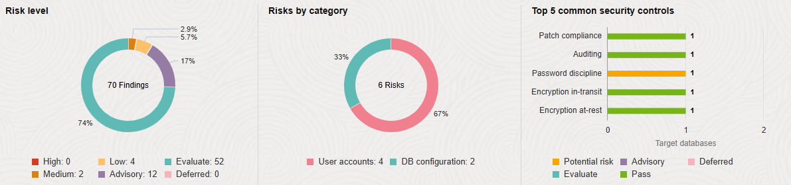
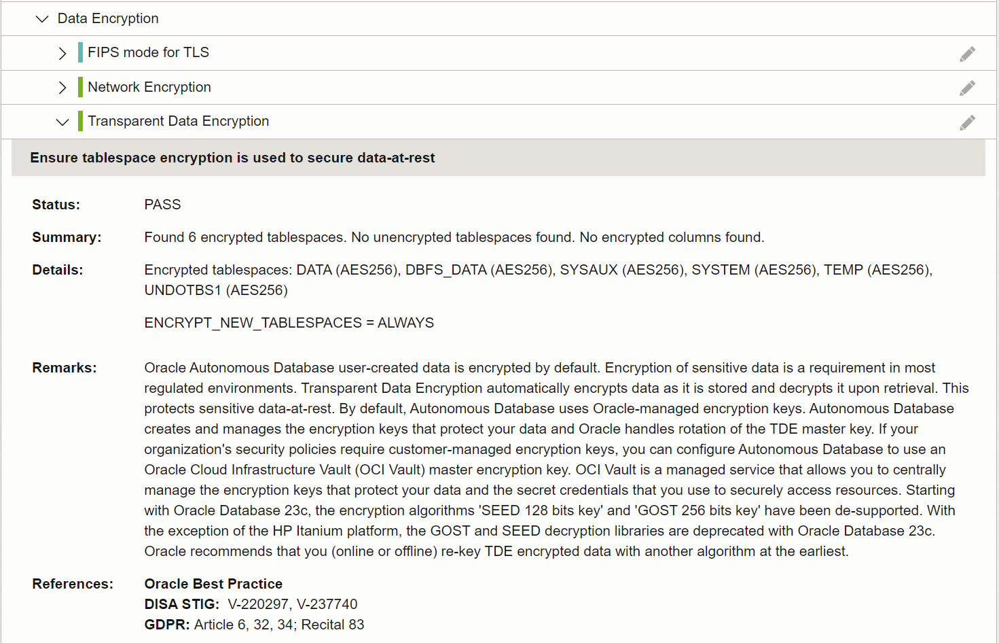
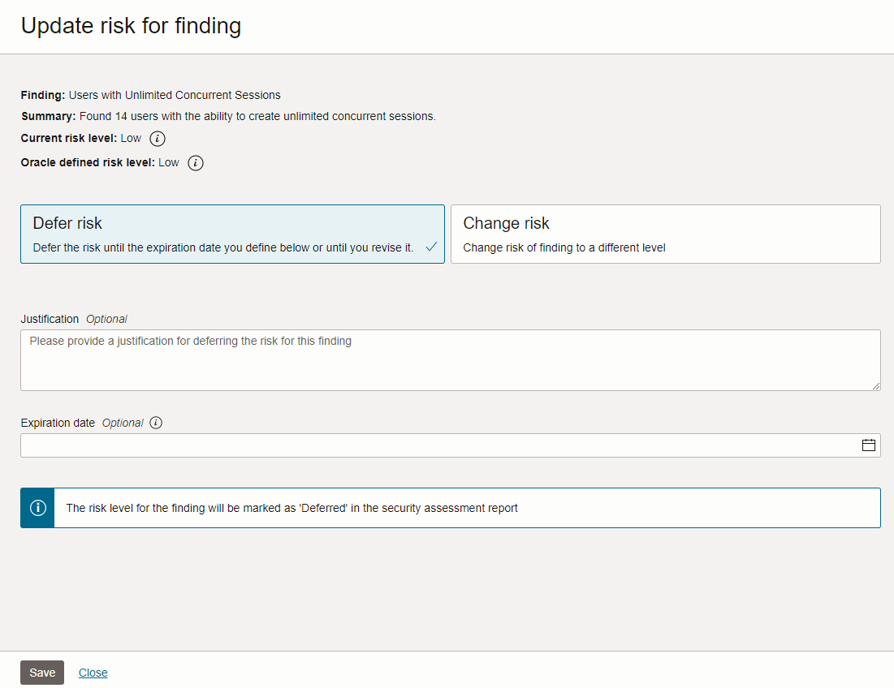

# Assess database configurations

## Introduction

Security Assessment helps you assess the security of your database configurations. It analyzes database configurations, user accounts, and security controls, and then reports the findings with recommendations for remediation activities that follow best practices to reduce or mitigate risk. 

Oracle Data Safe automatically creates a security assessment of your target database during registration. This assessment is referred to as the *latest assessment* and is automatically updated on a weekly basis. All assessments are stored in the Assessment History. You can analyze assessment data across all your target databases and for each target database. You can monitor security drift on your target databases by comparing the latest assessment to a baseline or to another assessment.

In this lab, you explore Security Assessment.

Estimated Time: 20 minutes

### Objectives

In this lab, you will:

- View the landing page for Security Assessment
- View the latest security assessment for your target database
- Adjust the risk level of a risk finding
- Set the latest assessment as the baseline assessment
- Create a risk on the target database
- Refresh the latest security assessment and analyze the results
- Compare your assessment with the baseline

### Prerequisites

This lab assumes you have:

- Obtained an Oracle Cloud account and signed in to the Oracle Cloud Infrastructure Console
- Access to or prepared an environment for this workshop
- Access to a registered target database


### Assumptions

- Your data values might be different than those shown in the screenshots.
- Please ignore the dates for the data and database names. Screenshots are taken at various times and may differ between labs and within labs.


## Task 1: View the landing page for Security Assessment

1. Navigate to the **Security assessment** landing page.

2. If needed, next to **Applied filters**, select your compartment. Deselect **Include child compartments**, and then select **Apply filter**. 

    Note: From here on in, the labs simply say *Select your compartment without child compartments* to simplify the instructions.

3. On the **Overview** tab, review the charts.

    - The **Risk level** pie chart shows you a percentage breakdown of the different risk levels (for example, LOW, HIGH, MEDIUM, ADVISORY, EVALUATE, DEFERRED) across all target databases in the selected compartment(s).
    - The **Risks by category** pie chart shows you a percentage breakdown of the applicable risk categories (for example, User Accounts, Privileges and Roles, Authorization Control, Data Encryption, Fine-Grained Access, Auditing, and Database Configurations) across target databases in the selected compartment(s).
    - The **Top 5 common security controls** bar chart shows the number of target databases at each risk level for each of the top five common controls. The top five common controls are the five security controls that Oracle considers the most important to the security of your target databases.

     


4. Select the **Risk summary** tab and review the information. 

    - This tab shows you how much risk you have across all target databases in the specified compartment(s).
    - You can compare the number of high, medium, low, advisory, and evaluate risk findings across all target databases, and view which risk categories have the greatest numbers.
    - Risk categories include Target databases, User accounts, Privileges and roles, Authorization control, Fine-grained access control, Data encryption, Auditing, and Database configuration.

    


5. Select the **Target summary** tab and review the information. 

    - This tab shows you the security posture of each target database.
    - You can view the number of high, medium, low, advisory, and evaluate risk findings for each target database.
    - You can view the date of the lastest assessment and find out if the latest assessment deviates from a baseline (if one is set).
    - You can access the latest assessment report for each target database.

    


## Task 2: View the latest security assessment for your target database

1. On the **Target summary** tab, select the name of your database.

    The latest security assessment for your target database opens. Notice that **Latest assessment for target database...** is displayed at the top of the page.

2. On the **Details** tab, review the details about the security assessment itself.

    Details include the assessment OCID, compartment to which the assessment was saved, date and time the assessment was created, database version, the assessed date and time, target database name, schedule, name of the baseline assessment (if one is set), whether the assessment complies with the baseline (Yes, No, or No baseline set), assessment template name, and template baseline name.

    


3. Select the **Assessment summary** tab and review the risk level, finding name, and summary for the top 5 common security controls that Oracle considers to be the most important to the security of your target database.

    

4. Scroll down and review the **Summary** table.

    - This table lists the number of findings for each risk category, broken down by risk level.
    - These values help you to identify areas that need attention.

    

5. Select the **Assessment details** tab.

    - This tab lists all the findings. For each finding, you can view the risk level, risk category, and references.
    - The high risk findings listed under **Privileges and Roles** were introduced when you ran the SQL script to populate your target database with sample data.

    

6. At the top, select the **Search and Filter** box. Notice that you can filter by risk, finding, category, reference, and documentation.  Select outside the box to hide the filter options.

    

7. Expand a finding (the expand arrow is to the left of the risk level) and review the information.

    - For each finding, there is an brief overview of the finding, a summary of what Oracle Data Safe found on your target database, details about the finding on your target database, remarks to help you to mitigate the risk, and references for Center for Internet Security (**CIS Benchmark**), Security Technical Implementation Guide (**DISA STIG**), European Union's General Data Protection Regulation (**EU GDPR**), and/or **Oracle recommended practices**. These references make it easy for you to identify the recommended security controls.
    - In the example below, the **Transparent Data Encryption** finding has three references: **DISA STIG**, **EU GDPR**, and **Oracle recommended practices**. 
    
    TIP: To quickly locate a finding, search by finding in the **Search and Filter** box.

    


## Task 3: Adjust the risk level of a risk finding

You can defer or change the risk level of a finding. In this task, you defer the **Users with Unlimited Concurrent Sessions** finding.

1. Set a filter: **Finding = Users with Unlimited Concurrent Sessions**.

    You do not need to include the equal sign.

2. Select the three dots for the **Users with Unlimited Concurrent Sessions** finding, and then select **Update risk**.

    The **Update risk for finding** panel opens.

3. Leave **Defer risk** selected. Optionally, enter a justification and set an expiration date. Select **Update**.

    Setting an expiration date is optional. Upon expiry, the next assessment resumes evaluating the finding and displays as found. With no expiration date, the risk finding is deferred indefinitely. 

   

4. Notice that the risk finding is recategorized as **DEFERRED**.

   

5. Select the **X** to remove the filter.


## Task 4: Set the latest assessment as the baseline assessment

A baseline assessment shows you data for all your target databases in a selected compartment at a given point in time. However, because we are only dealing with one target database in your compartment, the baseline assessment shows data for only one target database. Let’s assume that we are okay with the current configuration and we want to set it as our baseline. New assessments are then automatically compared to the baseline.

1. From the **Actions** menu, select **Set as baseline**.

    The **Set baseline** dialog box appears.

    

2. Select **Yes** to confirm that you want to set these findings as the baseline and wait a moment for the dialog box to close.

    The **Details** tab opens.

3. Wait until the baseline name appears.

    


## Task 5: Create a risk on the target database

In this task, you manually create a new configuration risk on your database by issuing a `GRANT` command. Later, when you refresh the latest security assessment, you can compare assessments.

1. Access the SQL worksheet in Database Actions. If your session has expired, sign in again as the `ADMIN` user.

2. If needed, clear the worksheet and the **Script Output** tab.

3. On the worksheet, enter the following command:

    ```
    <copy>grant ALTER ANY ROLE to PUBLIC;</copy>
    ```

4. On the toolbar, select the **Run Statement** button (green circle with white arrow).

    

5. On the **Script Output** tab, verify that the grant is successful.


## Task 6: Refresh the latest security assessment and analyze the results

1. Return to the browser tab for Oracle Data Safe.

2. From the **Actions** menu, select **Refresh now** to get the latest data.

    The **Refresh now** panel opens.

3. Leave the default name as is, and select **Refresh now**. Wait for the status next to the name of the security assessment to change from **Updating** to **Succeeded**. It takes about 1 minute.

    - This action updates the data in the latest security assessment for your target database and also saves a copy of the assessment to the Assessment History.

    

4. On the **Details** tab, notice that the assessed date and time is right now, and that **Complies with baseline** is equal to **No**.

    

5. Select the **Assessment details** tab and expand **System Privileges Granted to PUBLIC**. You can use the search box to quickly display this finding.

    - This is a high risk finding.
    - In the **Summary** section, you can see that the grant you made in the previous task is identified: All users are granted via 1 grant to PUBLIC.

    

6. Remove the filter if you set one.


## Task 7: Compare your assessment with the baseline

1. Select the **Compare with baseline** tab.

2. Select **View comparison report**.

    The **Comparison with baseline** panel opens.

3. Review the information.

    - In the top table, review the number of findings per risk category for each risk level. Categories include **User accounts**, **Privileges and roles**, **Authorization control**, **Data encryption**, **Fine-grained access control**, **Auditing**, and **Database configuration**. You can identify where the changes have occurred on your target database by viewing cells that contain the word **Modified**. The number represents the total count of new, remediated, and modified risks on the target database.
    - In the bottom table, review the risk level for each finding, the category to which the finding belongs, and the finding name. You can expand each finding to view more detail; for example, what is changed, added, or removed from the target database since the baseline report was generated.

    
    

4. Select **Close** to close the panel.


You may now **proceed to the next lab**.


## Learn More

- [Security Assessment Overview](https://www.oracle.com/pls/topic/lookup?ctx=en/cloud/paas/data-safe&id=UDSCS-GUID-030B2A14-272F-49CF-80D2-5559C722E0FF)

## Acknowledgements

* **Author** - Jody Glover, Consulting User Assistance Developer, Database Development
* **Last Updated By/Date** - Jody Glover, February 5, 2026
