# Assess database users

## Introduction

In the previous lab, you acted as a database security administrator responsible for monitoring the security posture of a target database. You established an approved configuration as a baseline, introduced a risky privilege change, and used Oracle Data Safe Security Assessment to detect and investigate security drift.

A secure database configuration is only part of the security picture. Who can access the database, what they can do, and whether their accounts are still appropriate are equally important.

Imagine that you are responsible for reviewing access to a database containing sensitive business data. Your security team needs to know the following:

- Which database users represent the greatest potential risk?
- Which users have powerful administrative roles?
- Which users have access to many schemas?
- Are privileged accounts actively being used?
- Have users or their entitlements changed since the last review?
- Did a new privileged account appear, or did an existing risky account disappear?

Oracle Data Safe User Assessment helps answer these questions by analyzing database users, their roles and privileges, account status, login activity, password information, and schema access.

Data Safe automatically generates user assessments for registered target databases and stores assessment copies in Assessment History. You can analyze users across your target databases, investigate individual users, and compare assessments to identify changes in users and their entitlements.

### Scenario

You have just completed a security configuration review of your database and discovered that its configuration had drifted from the approved baseline.

Now your security team asks you to perform an access review.

During the review, you discover a user account with a CRITICAL potential risk rating. You need to understand why this account is considered risky and what privileges and access it has.

Then, imagine that changes are made to the database:

- The high-risk `EVIL_RICH` account is removed.
- A new user, `JOE_SMITH`, is created.
- `JOE_SMITH` is granted the `PDB_DBA` role.

You will refresh the user assessment and compare it with the earlier assessment to determine what changed.

The goal is not simply to find users. The goal is to answer a security question: How has database access changed, and did the change introduce a new potentially dangerous user?

Estimated Time: 20 minutes

[Lab 3 - Assess database users](videohub:1_3riz09r3)

### Objectives

In this lab, you will:

- Evaluate the current potential risk of database users
- Investigate a potentially critical-risk user and its entitlements
- Simulate changes to database users and privileges
- Refresh the user assessment to detect access changes
- Compare user assessments to identify new and removed users and entitlement changes
- Determine the security significance of a newly created privileged user


### Prerequisites

This lab assumes you have:

- Obtained an Oracle Cloud account and signed in to the Oracle Cloud Infrastructure Console
- Access to or prepared an environment for this workshop
- Access to a registered target database

### Assumptions

- Your data values might be different than those shown in the screenshots.
- Please ignore the dates for the data and database names. Screenshots are taken at various times and may differ between labs and within labs.

## Task 1: Analyze users in the latest user assessment

The latest user assessment was automatically generated by Oracle Data Safe when you registered your target database.

1. Navigate to the **User assessment** landing page.

2. If needed, select your compartment without child compartments.

3. Select the **Target summary** tab, and then select the name of the latest user assessment for your target database.

    The latest security assessment opens.

4. Review the information on the **Details** tab.

    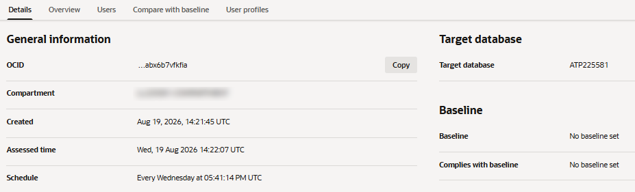

5. Select the **Overview** tab, and then review the charts.

    - The **Potential user risk** pie chart shows you the number and percentage of users who are potentially **Critical**, **High**, **Medium**, and **Low** risk.
    - The **User roles** bar chart shows you the number of users with the **DBA**, **DV admin**, and **Audit admin** roles.
    - The **Top 5 users by schema access** bar chart shows you the top 5 users who have access to the most schemas.
    - The **Last login** bar chart shows you the number of users that signed in to the target database within the last 24 hours, within the last week, within the current month, within the current year, and a year ago or more.
    - The **Last password change** bar chart shows you the number of users who changed their passwords within the last 30 days, within the last 30-90 days, and 90 days ago or more.
    - The **Password expiry date** bar chart shows you the number of users whose passwords will expire within three distinct time intervals: next 30 days, 30-90 days, and beyond 90 days.

    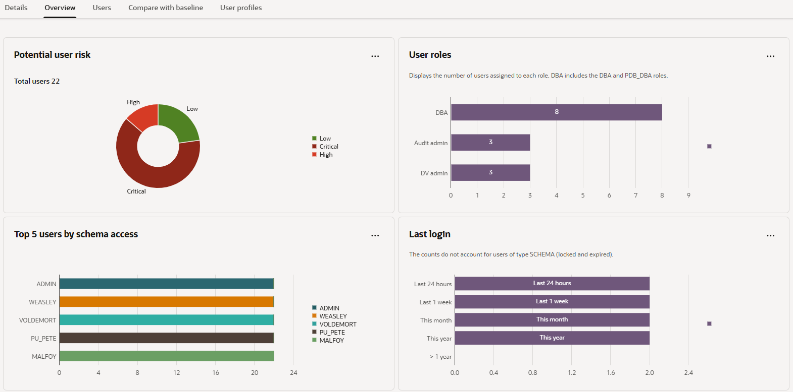
    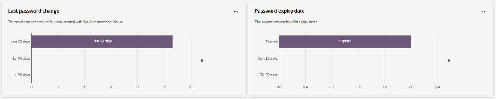


6. Select the **Users** tab and review the following information in the table:

    - Target database name
    - User name
    - User type (for example, PRIVILEGED, SCHEMA)
    - Whether the user is a DBA, DV admin, or Audit admin
    - Potential risk level (for example, LOW, HIGH, or CRITICAL)
    - User's status (for example, OPEN, LOCKED, or EXPIRED\_AND\_LOCKED)
    - Date and time the user's password changed on the target database
    - Date and time the user last logged in to the target database
    - Schemas that the user has access to
    - User profile
    - Audit records for the user
    - Password expiry date

    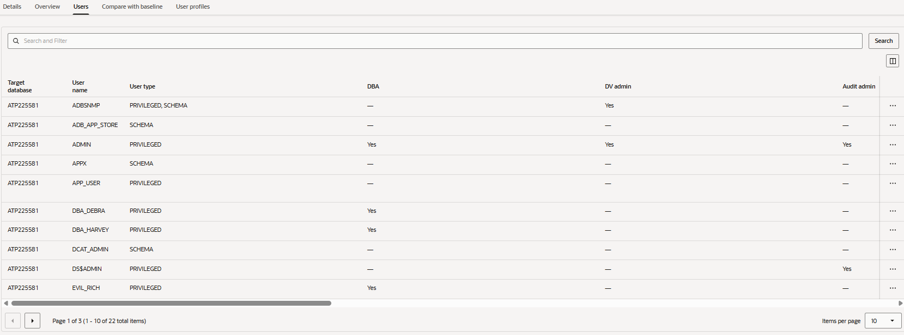

7. To rename the latest user assessment: From the **Actions** menu, select **Edit display name**. Enter **UA\_target-database\_LATEST** (replace **target-database** with the name of your target database), and select **Update**.

    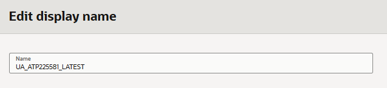

8. Locate a **CRITICAL** potential risk user, for example, **EVIL_RICH**. At the end of the row, select the three dots, and then select **View roles and privileges**. The **User details** panel opens.

    Review the following information about the user:

    - Target database name
    - User name
    - User profile
    - User type (for example, PRIVILEGED)
    - Date and time when the user was created
    - Potential risk (for example, CRITICAL)
    - Status (for example, OPEN)
    - Date and time when the password was last changed
    - Last login date and time
    - Password expiry date
    - Privileged roles (the Admin roles granted to the user)
    - Roles: Expand **All roles** to view all the roles granted to the user
    - Privileges: Expand **All privileges** to view all the privileges granted to the user
    - Schema access

    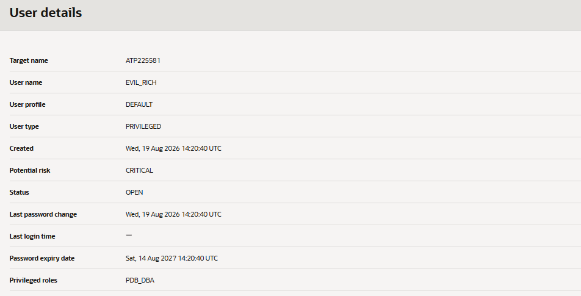
    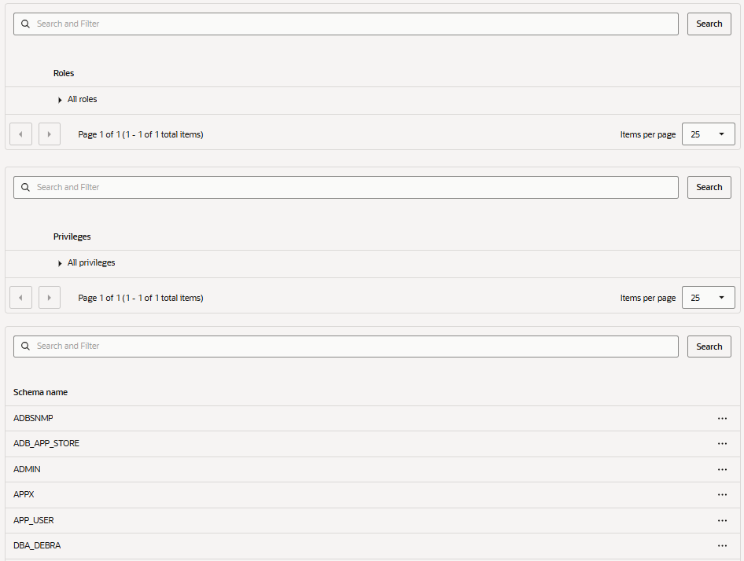

9. Select **Close**.

10. To filter the report to show potentially critical risk users only, select the **Search and Filter** box, and then select **Potential risk**. Select the **Critical** check box, and then select **Apply filter**.

    The table is adjusted.

    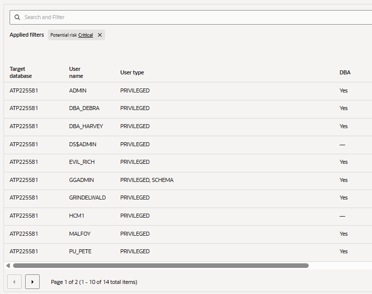

11. To remove the filter, select the **X** next to the filter.

## Task 2: Change users and entitlements on the target database

1. Access the SQL worksheet in **Database Actions**.

2. Clear the worksheet and the **Script Output** tab.

3. On the SQL worksheet, enter the following commands. Substitute your own password for `database-password`.

    ```
    <copy>DROP USER evil_rich;
    CREATE USER joe_smith identified by database-password;
    GRANT PDB_DBA to joe_smith;</copy>
    ```

4. On the toolbar, select the **Run Script** button (page with a small green circle and white arrow) to run the query.

    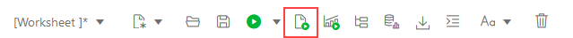

5. On the **Script Output** tab, verify that the `EVIL_RICH` user is dropped, the `JOE_SMITH` user is created, and the grant is successful.

## Task 3: Refresh the latest user assessment

1. Return to the browser tab for Oracle Data Safe. You last left off viewing the latest user assessment.

2. Select the **Refresh now** button.

    The **Refresh now** panel opens.

3. Name the assessment **UA\_target-database\_2** (replace **target-database** with the name of your target database), and then select **Refresh now**. Wait for the status of the latest user assessment (shown to the right of the assessment's name) to change from **Updating** to **Succeeded**. It takes about 1 minute. Oracle Data Safe automatically saves a static copy of the assessment to the Assessment History.

    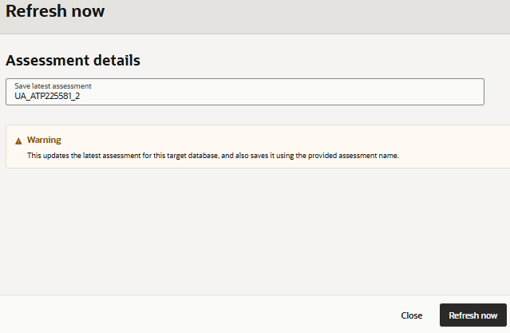

4. Review the refreshed latest assessment.

## Task 4: Compare the latest user assessment with the initial user assessment

You can select a user assessment to compare with the latest user assessment. With this option, you don't need to set a baseline. This option is available only when you are viewing the latest user assessment. Note that you could have set a baseline and compared the latest assessment to it.

1. While viewing the latest user assessment, from the **Actions** menu, select **Compare with other assessments**.

2. Select your compartment, and then select the initial assessment for your target database. If a comparison already exists, it is immediately displayed. Because this is your first time, select **Compare**.

3. Review the results. A new user is added and a user is deleted. The new user finding is identified as a potential **CRITICAL** risk.

    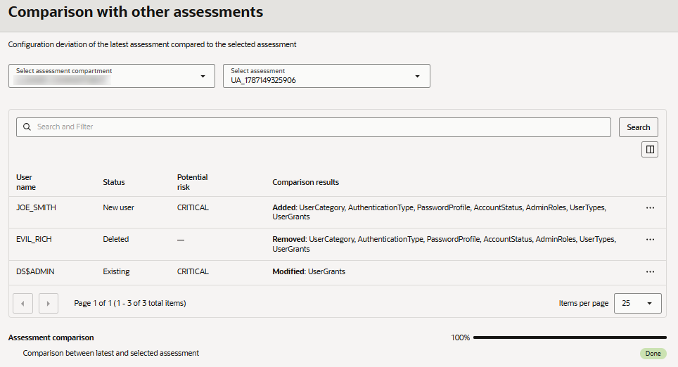

4. In the row that has the **CRITICAL** potential risk, select the three dots, and then select **View added details**.

    The **Comparison details** panel opens.

    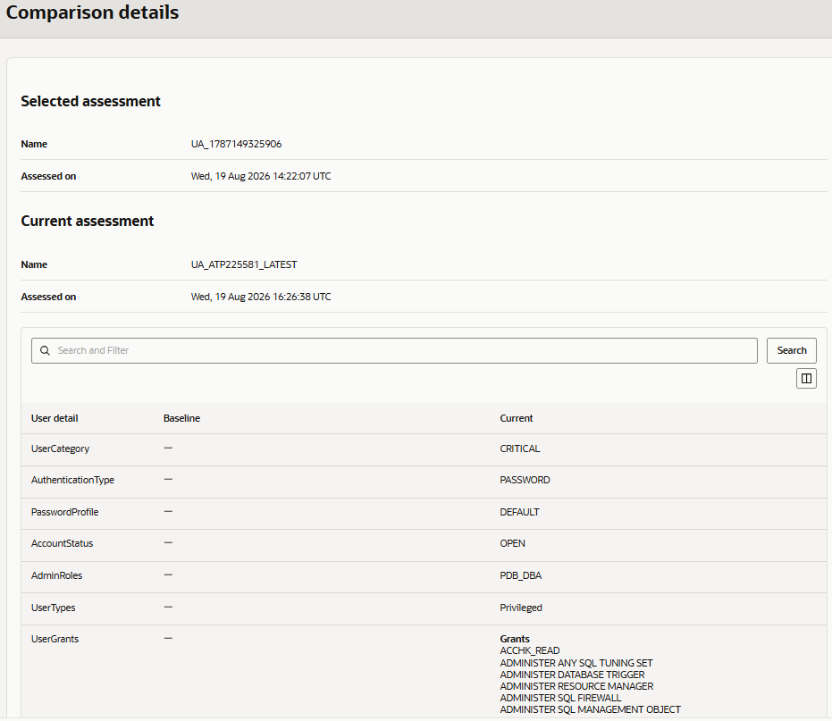

5. Review the information, and then select **Close** and then **Close** again. At this point, you might consider setting a baseline assessment.

You may now **proceed to the next lab**.

## Learn More

- [User Assessment Overview](https://docs.oracle.com/iaas/data-safe/doc/user-assessment-overview.html)

## Acknowledgements

- **Author** - Jody Glover, Lead Principal User Assistance Developer, Database Development
- **Contributor** - Bettina Schäumer, Lead Principal Product Manager, Oracle Database Security
- **Last Updated By/Date** - Bettina Schäumer, August 20, 2026
