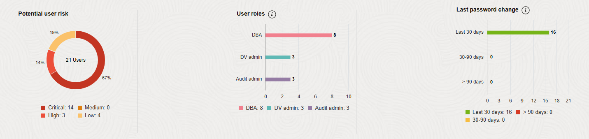
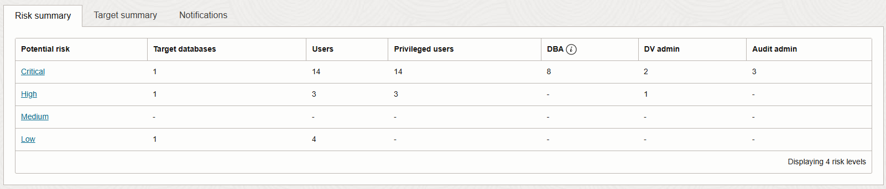
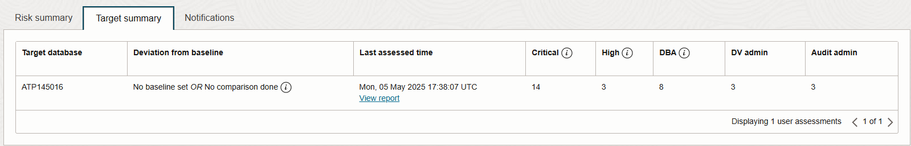
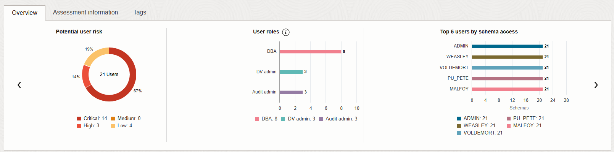
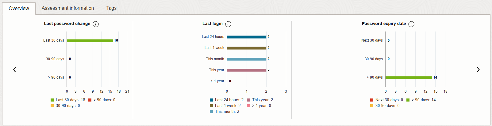
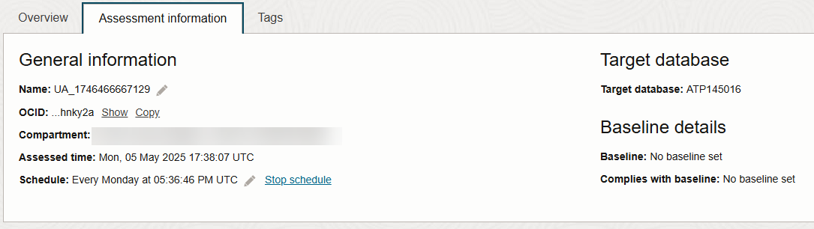
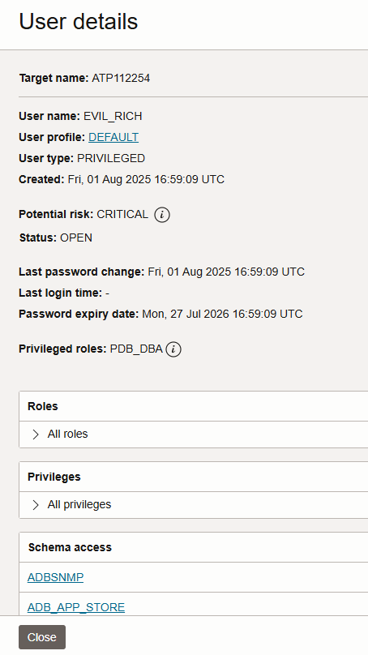

# Assess database users

## Introduction

User Assessment helps you assess the security of your database users and identify potential high risk users. By default, Oracle Data Safe automatically generates user assessments for your target databases and stores them in the Assessment History. You can analyze assessment data across all your target databases and for each target database. You can monitor security drift on your target databases by comparing the latest assessment to a baseline or to another assessment.

In this lab, you explore User Assessment.

Estimated Time: 20 minutes

[Data Safe](videohub:1_nvfme592)

### Objectives

In this lab, you will:

- View the overview page for User Assessment
- Analyze users in the latest user assessment
- Change users and entitlements on the target database
- Refresh the latest user assessment
- Compare the latest user assessment with the initial user assessment


### Prerequisites

This lab assumes you have:

- Obtained an Oracle Cloud account and signed in to the Oracle Cloud Infrastructure Console
- Access to or prepared an environment for this workshop
- Access to a registered target database
- (Optional) Started audit data collection for your target database in Oracle Data Safe. Audit data collection is required if you want to view users' audit records from within User Assessment.


### Assumptions

- Your data values might be different than those shown in the screenshots.
- Please ignore the dates for the data and database names. Screenshots are taken at various times and may differ between labs and within labs.


## Task 1: View the overview page for User Assessment

1. In the breadcrumb at the top of the page, click **Security center**. On the left, click **User assessment**.

2. Under **List scope**, make sure your compartment is selected. Deselect **Include child compartments**.

3. At the top of the overview page, review the four charts.

    - The **Potential user risk** chart shows you the number and percentage of users who are potentially **Critical**, **High**, **Medium**, and **Low** risk.
    - The **User roles** chart shows you the number of users with the **DBA**, **DV admin**, and **Audit admin** roles.
    - The **Last password change** chart shows you the number of users who changed their passwords within the last 30 days, within the last 30-90 days, and 90 days ago or more.
    - The **Last login** chart shows you the number of users that signed in to the target database within the last 24 hours, within the last week, within the current month, within the current year, and a year ago or more.

    

    

4. Review the **Risk summary** tab.

    - The **Risk summary** tab focuses on potential risks across all selected target databases. It shows you potential risk levels, the number of target databases, the total number of users at each risk level, the total number of privileged users at each risk level, and counts for DBAs, DV admins, and Audit admins.
    - Potential risk levels are categorized as **Critical**, **High**, **Medium**, and **Low**.

    

5. Click the **Target summary** tab. This tab provides the following information:

    - Number of critical and high risk users, DBAs, DV admins, and Audit admins
    - Date and time of the latest user assessment
    - Whether the latest user assessment deviates from the baseline (if one is set)

    


## Task 2: Analyze users in the latest user assessment

The latest user assessment is the one that was automatically generated by Oracle Data Safe when you registered your target database.

1. On the **Target summary** tab, click **View report** to view the latest user assessment for your target database.

2. At the top of the report on the **Overview** tab, review the **Potential user risk**, **User roles**, **Top 5 users by schema access**, **Last password change**, and **Last login** charts.

    

    

3. Click the **Assessment Information** tab and review the details.

    

4. Scroll down and review the **User details** section. This table provides the following information about each user:

    - User name
    - User type (for example, PRIVILEGED, SCHEMA)
    - Whether the user is a DBA, DV admin, or Audit admin
    - Potential risk level (for example, LOW, HIGH, or CRITICAL)
    - User's status (for example, OPEN, LOCKED, or EXPIRED\_AND\_LOCKED)
    - Date and time the user last logged in to the target database
    - Schemas and tables to which the user has access and the privileges granted on them
    - User profile
    - Audit records for the user

    

5. In the **User name** column, click a user that is a **CRITICAL** potential risk, for example, **EVIL_RICH**.

    The **User details** panel shows the following information about the user:

    - Target database name
    - User name
    - User profile
    - User type (for example, PRIVILEGED)
    - Status (for example, OPEN)
    - Potential risk (for example, CRITICAL) - Hover over the **i** to view what constitutes a critical risk user.
    - Last login date and time
    - Date and time when the user was created
    - Date and time when the password was last changed
    - Privileged roles (the Admin roles granted to the user)
    - Roles: Expand **All roles** to view all the roles granted to the user.
    - Privileges: Expand **All privileges** to view all the privileges granted to the user.

    

6. Click **Close**.

7. To filter the report to show potentially critical risk users only, do the following: Click the **Overview** tab. In the **Potential user risk** chart, click the **Critical** section of the chart. A filter is automatically created.

    

8. To remove the filter, click the **X** next to the filter.


## Task 3: Change users and entitlements on the target database

1. Access the SQL worksheet in **Database Actions**.

2. Clear the worksheet and the **Script Output** tab.

3. On the SQL worksheet, enter the following commands. Substitute your own password for database-password.

    ```
    <copy>DROP USER evil_rich;
    CREATE USER joe_smith identified by database-password;
    GRANT PDB_DBA to joe_smith;</copy>
    ```

4. On the toolbar, click the **Run Script** button (green circle with a white arrow) to run the query.

    

5. On the **Script Output** tab at the bottom of the page, verify that the `EVIL_RICH` user is dropped, the `JOE_SMITH` user is created, and the grant is successful.


## Task 4: Refresh the latest user assessment

1. Return to the browser tab for Oracle Data Safe. You last left off viewing the latest user assessment.

2. Click the **Refresh now** button.

    The **Refresh now** panel is displayed.

3. Keep the default name as is, and click **Refresh now**. Wait for the status of the latest user assessment to read as **SUCCEEDED**. Oracle Data Safe automatically saves a static copy of the assessment to the Assessment History.

    

4. Review the refreshed latest assessment.


## Task 5: Compare the latest user assessment with the initial user assessment

You can select a user assessment to compare with the latest user assessment. With this option, you don't need to set a baseline. This option is only available when you are viewing the latest user assessment. Note that you could have set a baseline and compared the latest assessment to it.

1. While viewing the latest user assessment, on the left under **Resources**, click **Compare assessments**.

2. Scroll down to the **Comparison with other assessments** section.

3. If your compartment isn't shown, click **Change compartment** and select your compartment.

4. From the **Select assessment** drop-down list, select the initial assessment for your target database (second one in the list). As soon as you select it, the comparison operation is started.

5. Review the results.

    - There is a new user added and a user deleted. The new user finding is identified as a potential **CRITICAL** risk.
    - There are user grants modified by the `DS$ADMIN` user. This finding is also identified as a potential **CRITICAL** risk.

    

6. In the **Comparison results** column, click one of the **Open details** links to view more information.

    The **Comparison details** panel is displayed.

    

7. Review the information, and then click **Close**. At this point, you might consider setting a baseline assessment.


You may now **proceed to the next lab**.

## Learn More

- [User Assessment Overview](https://www.oracle.com/pls/topic/lookup?ctx=en/cloud/paas/data-safe&id=UDSCS-GUID-6BF46EE2-F7B5-4710-A09C-069EA95F8052)

## Acknowledgements

* **Author** - Jody Glover, Consulting User Assistance Developer, Database Development
* **Last Updated By/Date** - Jody Glover, August 22, 2024
