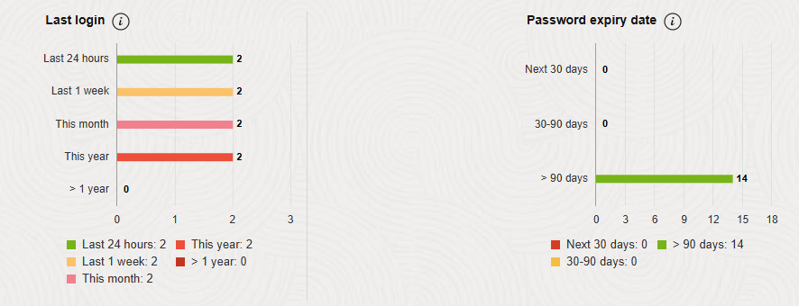

# Assess Database Users

## Introduction

User Assessment helps you assess the security of your database users and identify high risk users. By default, Oracle Data Safe automatically generates user assessments for your target databases and stores them in the Assessment History. You can analyze assessment data across all your target databases and for each target database. You can monitor security drift on your target databases by comparing the latest assessment to a baseline or to another assessment.

In this lab, you explore User Assessment.

Estimated Lab Time: 20 minutes

### Objectives

In this lab, you will:

- View the dashboard for User Assessment
- Analyze users in the latest user assessment
- Review the `ADMIN` user's audit records
- Generate suspicious activity on the target database
- Refresh the latest user assessment and rename it
- Compare the latest user assessment with the initial user assessment
- Set the latest assessment as the baseline
- View the user assessment history for all target databases
- Download the latest user assessment as a PDF report


### Prerequisites

This lab assumes you have:

- Obtained an Oracle Cloud account and signed in to the Oracle Cloud Infrastructure Console at `https://cloud.oracle.com`
- Prepared your environment for this workshop (see [Prepare Your Environment](?lab=prepare-environment))
- Registered your target database with Oracle Data Safe (see [Register an Autonomous Database with Oracle Data Safe](?lab=register-autonomous-database))
- Started audit data collection for your target database in Oracle Data Safe (see [Audit Database Activity](?lab=audit-database-activity))


### Assumptions

- Your data values are most likely different than those shown in the screenshots.


## Task 1: View the dashboard for User Assessment

1. Navigate to **User Assessment**. To do this, in the breadcrumb at the top of the page, click **Security Center**. On the left, click **User Assessment**.

2. Under **List Scope**, make sure your compartment is selected.

3. At the top of the dashboard, review the four charts.

    - The **User Risk** chart shows you the number and percentage of users who are **Critical Risk**, **High Risk**, **Medium Risk**, and **Low Risk**.
    - The **User Roles** chart shows you the number of users with the **DBA**, **DV Admin**, and **Audit Admin** roles.
    - The **Last Password Change** chart shows you the number and percentage of users who changed their passwords within the last 30 days, within the last 30-90 days, and 90 days ago or more.
    - The **Last Login** chart shows you the number and percentage of users that signed in to the target database within the last 24 hours, within the last week, within the current month, within the current year, and a year ago or more.

    

4. Review the **Risk Summary** tab.

    - The **Risk Summary** tab focuses on risks across all your target databases. It shows you risk levels, where the risks were found, the number of users at each risk level, and the roles held by the total number of users at each risk level.

    

5. Click the **Target Summary** tab. This tab provides the following information:

    - Number of critical and high risk users, DBAs, DV Admins, and Audit Admins
    - Date and time of the latest user assessment
    - Whether the latest user assessment deviates from the baseline (if one is set)

    


## Task 2: Analyze users in the latest user assessment

Currently, the latest user assessment is the one that was automatically generated by Oracle Data Safe when you registered your target database.

1. On the **Target Summary** tab, click **View Report** to view the latest user assessment for your target database.

2. At the top of the report, review the **User Risks**, **User Roles**, **Last Password Change**, and **Last Login** charts.

    

3. Scroll down and review the **Assessment Details** section. This table provides the following information about each user:

*Also look at the grant for evil rich - need to add*

    - User name
    - User type (for example, PRIVILEGED, SCHEMA)
    - Whether the user is a DBA, DV Admin, or Audit Admin
    - User risk level (for example, LOW, HIGH, or CRITICAL)
    - User's status (for example, OPEN, LOCKED, or EXPIRED\_AND\_LOCKED)
    - Date and time the user last logged in to the target database
    - Audit records for the user

    

4. In the **User Name** column, click one of the users.

    The **User Details** panel shows the following information about the user:

    - User name
    - Target database name
    - Date and time when the user was created
    - Risk level - Hover over the question mark to view what constitutes a critical risk user.
    - User type
    - User profile
    - Privileged roles (the Admin roles granted to the user)
    - Last login date and time
    - Roles - Expand **All Roles** to view all the roles granted to the user.
    - Privileges - Expand **All Privileges** to view all the privileges granted to the user.

    

5. Click **Close**.

6. Notice at the top of the table that you can set filters. Click **+ Filter**. From the first drop-down list, select **Risk**. From the second drop-down list, select **=**. In the box, enter **CRITICAL**. Click **Apply**. The table now shows you only critical risk users.

    

7. To remove the filter, click the **X** next to the filter.


## Task 3: Review the `ADMIN` user's audit records

1. Identify the row in the table for the `ADMIN` user. In the **Audit Records** column for the `ADMIN` user, click **View Activity**.


    

    The **All Activity** report for the `ADMIN` user is displayed.

2. Examine the report.

    - The report is automatically filtered to show you audit records for the past one week, for the `ADMIN` user, and for your target database.
    - At the top of the report, you can view totals for **Targets**, **DB Users**, **Client Hosts**, **DMLs**, **Privilege Changes**, **DDLs**, **User/Entitlement Changes**, **Login Failures**, **Login Successes**, and **Total Events**.
    - The **Event** column in the table shows you the types of activities performed by the `ADMIN` user, for example, `LOGON`, `AUDIT`, `CREATE AUDIT POLICY`, and so on.
    - At the bottom of the page, click the page numbers to view more audit records.


    


## Task 4: Generate suspicious activity on the target database

1. Access Database Actions.

2. On the SQL worksheet, enter the following commands:

    ```
    DROP USER evilrich;
    CREATE USER joesmith identified by Oracle123_Oracle123;
    GRANT PDB_DBA to joesmith;
    ```

2. On the toolbar, click the **Run Script** button (green circle with a white arrow) to execute the query.

    


## Task 5: Refresh the latest user assessment and rename it

Let's find the actual latest assessment (not a saved copy of it) and refresh it.

1. In the breadcrumb at the top of the page, click **User Assessment**, and then click the **Target Summary** tab.

2. Click **View Report** for your target database to open the latest user assessment.

    - Notice that this assessment's name is different than the last assessment you viewed. It is not the same as the copy. It's a completely separate user assessment.
    - Also notice that you can refresh this assessment, whereas you couldn't refresh the copy in the Assessment History.

3. To refresh the latest user assessment, click the **Refresh Now** button.

    The **Refresh Now** panel is displayed.

4. For now, let's keep the default name as is, and click **Refresh Now**. Wait for the status to read **SUCCEEDED**.

    - When you refresh the latest user assessment, Oracle Data Safe automatically saves a static copy of it to the Assessment History.

    

5. Review the refreshed latest assessment. Notice that the latest assessment kept its original name.

6. Click the **Assessment Information** tab, and then click the **Pencil** icon next to the assessment name. Change the name to **Latest User Assessment**, and then click the **Save** icon. The name is updated on the page.

    

7. In the breadcrumb at the top of the page, click **User Assessment**. Under **Related Resources**, click **Assessment History**.

8. Notice that there is an additional saved user assessment. None of the user assessments is called **Latest User Assessment**. At a glance, you can compare the number of critical risks, high risks, DBAs, DV Admins, and Audit Admins between the two user assessments.

    


## Task 6: Compare the latest user assessment with the initial user assessment

You can select a user assessment to compare with the latest user assessment. With this option, you don't need to set a baseline.

*compare the latest with the intial assessment. See one user added, one user removed. - need to add*

1. On the left under **Resources**, click **Compare Assessments**. This option is only available when you are viewing the latest user assessment.

    

2. Scroll down to the **Comparison with Other Assessments** section.

3. If your compartment isn't shown, click **Change Compartment** and select your compartment.

4. From the **Select Assessment** drop-down list, select the earliest assessment for your target database. As soon as you select it, the comparison operation is started.

5. Review the **Comparison** report. The report tells you that several new users are added to the database since the initial user assessment. Many are identified as a critical risk. At the bottom of the page, click the **Next to Page 2** button to view the entire report.

    

6. In the **Comparison Results** column, click one of the **Open Details** links to view more information.

    The **Comparison Details** panel is displayed.

    

7. Review the information, and then click **Close**.


## Task 7: Set the latest assessment as the baseline


## Task 8: View the user assessment history for all target databases

1. Under **Security Center**, click **User Assessment**.

2. Under **Related Resources**, click **Assessment History**.

    

3. Under **List Scope**, make sure your compartment is selected.

4. Notice that you currently have one user assessment for your target database. This view, however, lets you review the user assessment history for all your target databases.

    - You can compare the number of critical risks, high risks, DBAs, DV Admins, and Audit Admins across all target databases.
    - You can also quickly identify user assessments that are set as baselines.

    

5. To sort the list by target database, click the **Target Database** column heading.

6. Click the name of the user assessment for your target database.

    - This assessment was generated by Oracle Data Safe when you registered your target database. It is a saved copy of the latest assessment.
    - Notice that you cannot refresh the data in a saved user assessment.
    - Make note of the assessment's name. In the example below, the assessment's name ends with 17101.

    


## Task 9: Download the latest user assessment as a PDF report

1. Return to the latest user assessment. To do so, under **Security Center**, click **User Assessment**. Click the **Target Summary** tab, and then click **View Report** for your target database.

2. From the **More Actions** menu, click **Generate Report**.

    The **Generate Report** dialog box is displayed.

3. Leave **PDF** selected as the report format, and click **Generate Report**.

4. Wait for a message that says the **PDF report generation is complete**, and then click **Close**.

    


5. From the **More Actions** menu, click **Download Report**.

    The **Download Report** dialog box is displayed.

6. Leave the **PDF** report format selected, and click **Download Report**.

    


7. In the **Opening user-assessment-report.pdf** dialog box, leave **Save File** selected, and click **OK**.

    The **Enter name of file to save to** dialog box is displayed.

8. Browse to the desktop, leave **user-assessment-report.pdf** set as the name, and then click **Save**.

9. On your desktop, open the report and scroll through it. When you are done, close the file.

    

    

10. Close the PDF.


## Learn More

- [User Assessment Overview](https://www.oracle.com/pls/topic/lookup?ctx=en/cloud/paas/data-safe&id=UDSCS-GUID-6BF46EE2-F7B5-4710-A09C-069EA95F8052)

## Acknowledgements

* **Author** - Jody Glover, Consulting User Assistance Developer, Database Development
* **Last Updated By/Date** - Jody Glover, July 5, 2022
