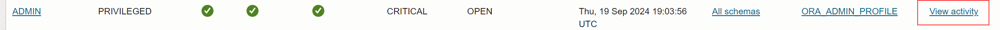
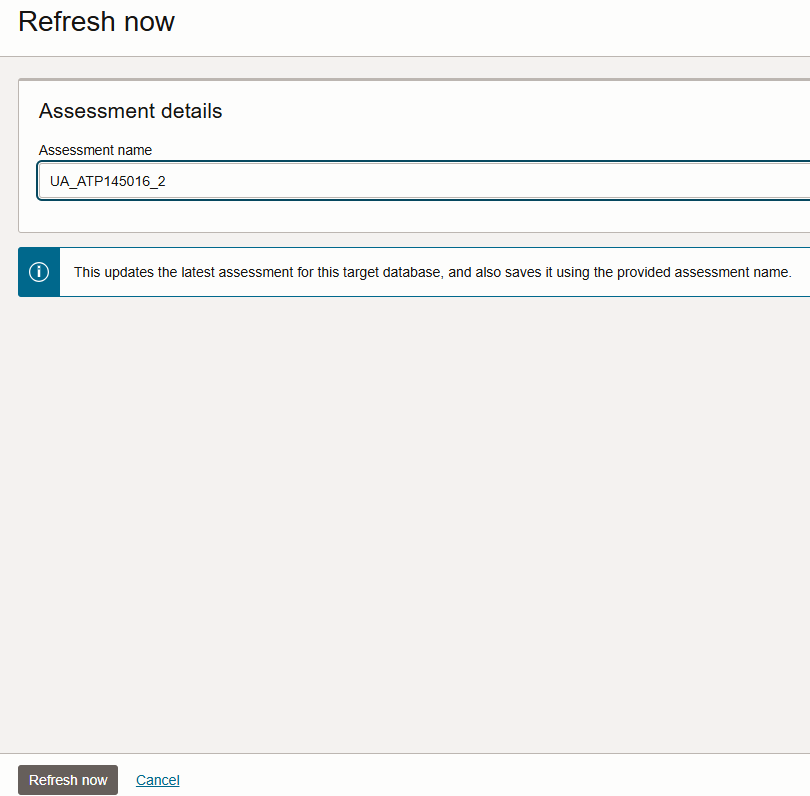

# Assess Database Users

## Introduction

User Assessment helps you assess the security of your database users and identify potential high risk users. By default, Oracle Data Safe automatically generates user assessments for your target databases and stores them in the Assessment History. You can analyze assessment data across all your target databases and for each target database. You can monitor security drift on your target databases by comparing the latest assessment to a baseline or to another assessment.

In this lab, you explore User Assessment.

Estimated Lab Time: 20 minutes

### Objectives

In this lab, you will:

- View the overview page for User Assessment
- Analyze users in the latest user assessment
- Review the `ADMIN` user's audit records
- Create a user on the target database
- Refresh the latest user assessment and rename it
- View the user assessment history for your target database
- Compare the latest user assessment with the initial user assessment
- Download the latest user assessment as a PDF report
- View the user assessment history for all target databases


### Prerequisites

This lab assumes you have:

- Obtained an Oracle Cloud account and signed in to the Oracle Cloud Infrastructure Console
- Prepared your environment for this workshop (see [Prepare Your Environment](?lab=prepare-environment))
- Registered your target database with Oracle Data Safe (see [Register an Autonomous Database with Oracle Data Safe](?lab=register-autonomous-database))
- Started audit data collection for your target database in Oracle Data Safe (see [Audit Database Activity](?lab=audit-database-activity)). Audit data collection is required if you want to view users' audit records from within User Assessment.


### Assumptions

- Your data values might be different than those shown in the screenshots.


## Task 1: View the overview page for User Assessment

1. Navigate to **User Assessment**. To do this, in the breadcrumb at the top of the page, click **Security Center**. On the left, click **User Assessment**.

2. Under **List Scope**, make sure your compartment is selected. Deselect **Include child compartments**.

3. At the top of the overview page, review the four charts.

    - The **Potential User Risk** chart shows you the number of users who are potentially **Critical**, **High**, **Medium**, and **Low** risk.
    - The **User Roles** chart shows you the number of users with the **DBA**, **DV Admin**, and **Audit Admin** roles.
    - The **Last Password Change** chart shows you the number of users who changed their passwords within the last 30 days, within the last 30-90 days, and 90 days ago or more.
    - The **Last Login** chart shows you the number of users that signed in to the target database within the last 24 hours, within the last week, within the current month, within the current year, and a year ago or more.

    

4. Review the **Risk Summary** tab.

    - The **Risk Summary** tab focuses on potential risks across all selected target databases. It shows you potential risk levels, the number of target databases, the total number of users at each risk level, the total number of privileged users at each risk level, and counts for DBAs, DV Admins, and Audit Admins.
    - Potential risk levels are categorized as **Critical**, **High**, **Medium**, and **Low**.

    

5. Click the **Target Summary** tab. This tab provides the following information:

    - Number of critical and high risk users, DBAs, DV Admins, and Audit Admins
    - Date and time of the latest user assessment
    - Whether the latest user assessment deviates from the baseline (if one is set)

    


## Task 2: Analyze users in the latest user assessment

The latest user assessment is automatically generated by Oracle Data Safe when you register your target database.

1. On the **Target Summary** tab, click **View Report** to view the latest user assessment for your target database.

2. At the top of the report on the **Overview** tab, review the **Potential User Risk**, **User Roles**, **Last Password Change**, and **Last Login** charts.

    

3. Click the **Assessment Information** tab. You can view the following information:

    - The name of the latest user assessment
    - The OCID of the latest user assessment
    - The compartment to which the latest user assessment belongs
    - The target database name
    - The assessment date and time
    - The schedule for the latest assessment
    - Whether the latest assessment is set as a baseline assessment
    - Whether the latest assessment complies with the baseline assessment (if one is set)

    

4. Scroll down and review the **User Details** section. By default, this table provides the following information about each user:

    - User name
    - User type (for example, PRIVILEGED, SCHEMA)
    - Whether the user is a DBA, DV Admin, or Audit Admin
    - Potential risk level (for example, LOW, HIGH, or CRITICAL)
    - User's status (for example, OPEN, LOCKED, or EXPIRED\_AND\_LOCKED)
    - Date and time the user last logged in to the target database
    - User profile
    - Audit records for the user

    

5. In the **User Name** column, click a user that is a **CRITICAL** potential risk, for example, **EVIL_RICH**.

    The **User Details** panel shows the following information about the user:

    - Target database name
    - User name
    - User profile
    - User type (for example, PRIVILEGED)
    - Status (for example, OPEN)
    - Potential risk (for example, CRITICAL) - Hover over the **i** to view what constitutes a critical risk user.
    - Last login date and time
    - Date and time when the user was created
    - Date and time when the password was changed
    - Privileged roles (the Admin roles granted to the user)
    - Roles: Expand **All Roles** to view all the roles granted to the user.
    - Privileges: Expand **All Privileges** to view all the privileges granted to the user.

    

6. Click **Close**.

7. To filter the report to show potentially critical risk users only, do the following: Click the **Overview** tab. In the **Potential User Risk** chart, click the **CRITICAL** section of the chart. A filter is automatically created.

    

8. To remove the filter, click the **X** next to the filter.


## Task 3: Review the `ADMIN` user's audit records

1. Identify the row in the table for the `ADMIN` user. In the **Audit Records** column for the `ADMIN` user, click **View Activity**.

    

    The **All Activity** report for the `ADMIN` user is displayed.

2. Examine the report.

    - The report is automatically filtered to show you audit records for the past one week, for the `ADMIN` user, and for your target database.
    - At the top of the report, you can view totals for **Targets**, **DB Users**, **Client Hosts**, **DMLs**, **Privilege Changes**, **DDLs**, **User/Entitlement Changes**, **Login Failures**, **Login Successes**, and **Total Events**.
    - The **Event** column in the table shows you the types of activities performed by the `ADMIN` user, for example, `GRANT`, `LOGON`, `CREATE USER`, and so on.
    - At the bottom of the page, you can click the page numbers to view more audit records.

    


## Task 4: Create a user on the target database

1. Access the SQL worksheet in **Database Actions**.

2. If needed, clear the worksheet and the **Script Output** tab.

3. On the SQL worksheet, enter the following commands:

    ```
    <copy>CREATE USER joe_smith identified by Oracle123_Oracle123;
    GRANT PDB_DBA to joe_smith;</copy>
    ```

4. On the toolbar, click the **Run Script** button (green circle with a white arrow) to run the query.

    

5. On the **Script Output** tab at the bottom of the page, verify that the `JOE_SMITH` user is created and the grant is successful.


## Task 5: Refresh the latest user assessment and rename it

1. Return to the browser tab for Oracle Data Safe.

2. Under **Security Center** on the left, click **User Assessment**.

3. Click the **Target Summary** tab.

4. Click **View Report** for your target database to open the latest user assessment.

5. To refresh the latest user assessment, click the **Refresh Now** button.

    

6. In the **Refresh Now** panel, keep the default name as is, and click **Refresh Now**. Wait for the status of the latest user assessment to read as **SUCCEEDED**. Oracle Data Safe automatically saves a static copy of the assessment to the Assessment History.

    

7. Review the refreshed latest assessment. Notice that the user you just created, `JOE_SMITH`, is listed.

8. Click the **Assessment Information** tab, and then click the **Pencil** icon next to the assessment name. Change the name to **Latest User Assessment**, and then click the **Save** icon. Wait for the status to change from **UPDATING** to **SUCCEEDED**. The name is updated on the page.

    


## Task 6: View the user assessment history for your target database

1. At the top of the **Latest User Assessment** page, click **View History**.

2. Make sure that your compartment is selected. Deselect **Include child compartments**.

3. Review the list of assessments.

    

4. Click **Close** to return to the latest user assessment.

    If you navigated away from the latest user assessment, you can return to it by doing the following: Click **User Assessment** in the breadcrumb. Click the **Target Summary** tab. Click **View Report** for your target database.


## Task 7: Compare the latest user assessment with the initial user assessment

You can select a user assessment to compare with the latest user assessment. With this option, you don't need to set a baseline. This option is only available when you are viewing the latest user assessment.

1. While viewing the latest user assessment, on the left under **Resources**, click **Compare Assessments**.

2. Scroll down to the **Comparison With Other Assessments** section.

3. If your compartment isn't shown, click **Change Compartment** and select your compartment.

4. From the **Select Assessment** drop-down list, select the initial assessment for your target database (second one in the list). As soon as you select it, the comparison operation is started.

5. Review the **Comparison** report.

    - The report tells you that there is a new user added.
    - The **New User** finding is a potential **CRITICAL** risk.

    

6. In the **Comparison Results** column for the potential critical risk finding, click the **Open Details** links to view more information.

    The **Comparison Details** panel is displayed.

    

7. Review the information, and then click **Close**.


## Task 8: Download the latest user assessment as a PDF report

1. At the top of the latest user assessment page, from the **More actions** menu, click **Generate Report**.

    The **Generate Report** dialog box is displayed.

2. Leave **PDF** selected as the report format, and click **Generate Report**.

3. Wait for a message that says the **PDF report generation is complete**, and then click the **here** link.

    

4. Open the PDF and review it.

    

    

5. Close the PDF and return to the browser tab for Oracle Data Safe.


## Task 9: View the user assessment history for all target databases

On the User Assessment History page, you can view a listing of all of your saved user assessments for all your target databases.

1. In the breadcrumb at the top of the page, click **User Assessment**.

2. Under **Related Resources**, click **Assessment History**.

3. Under **List Scope**, make sure your compartment is selected.

4. Notice that your saved user assessments are listed here.

    - You can compare the number of critical risks, high risks, DBAs, DV Admins, and Audit Admins across all target databases in the selected compartment(s).
    - You can also quickly identify user assessments that are set as baselines.

    


5. To sort the list by target database, click the **Target Database** column heading.

6. Click the name of a user assessment for your target database. Notice that you cannot refresh the data in a saved user assessment.

You may now **proceed to the next lab**.


## Learn More

- [User Assessment Overview](https://www.oracle.com/pls/topic/lookup?ctx=en/cloud/paas/data-safe&id=UDSCS-GUID-6BF46EE2-F7B5-4710-A09C-069EA95F8052)

## Acknowledgements

* **Author** - Jody Glover, Consulting User Assistance Developer, Database Development
* **Last Updated By/Date** - Jody Glover, June 8, 2023
