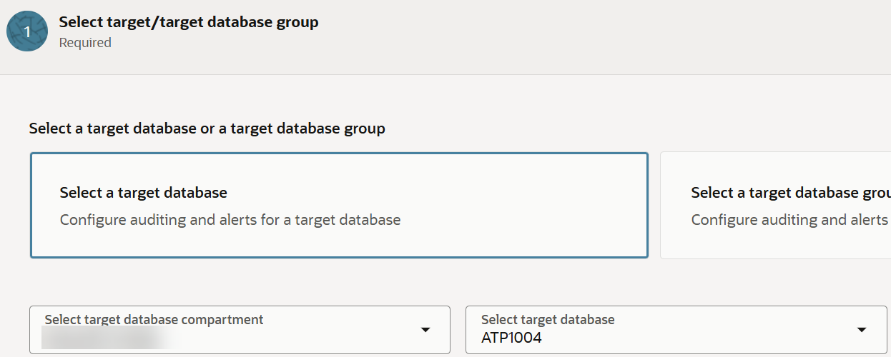
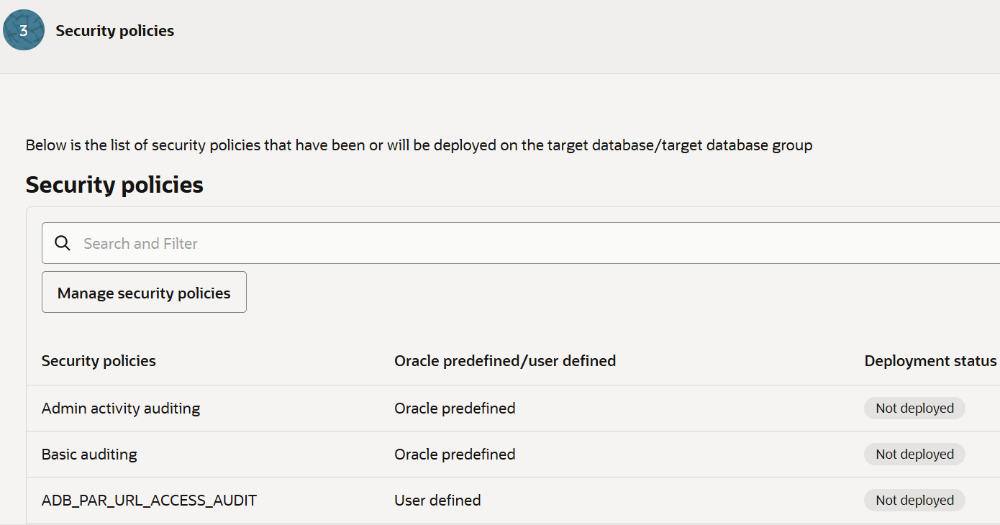
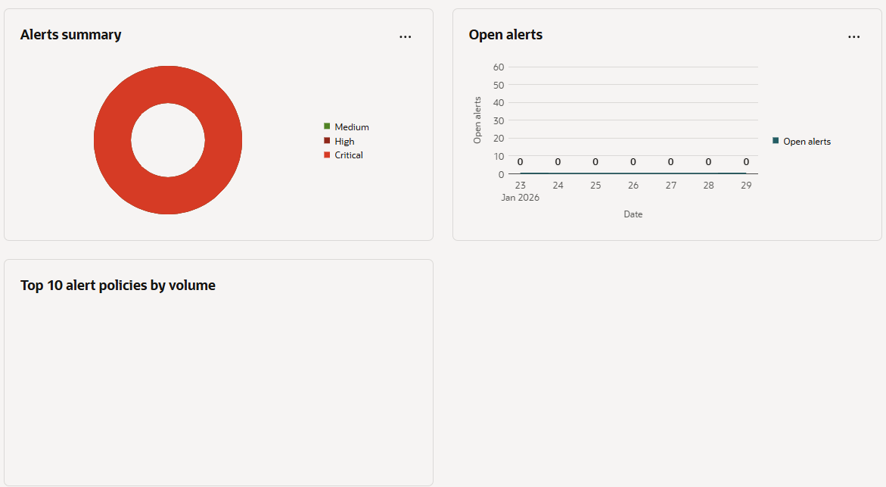
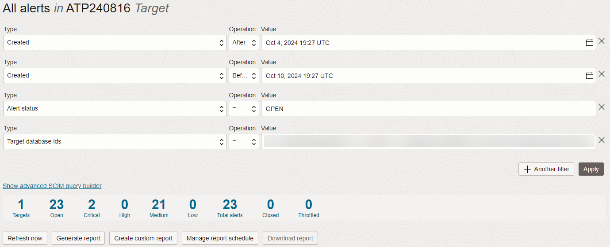
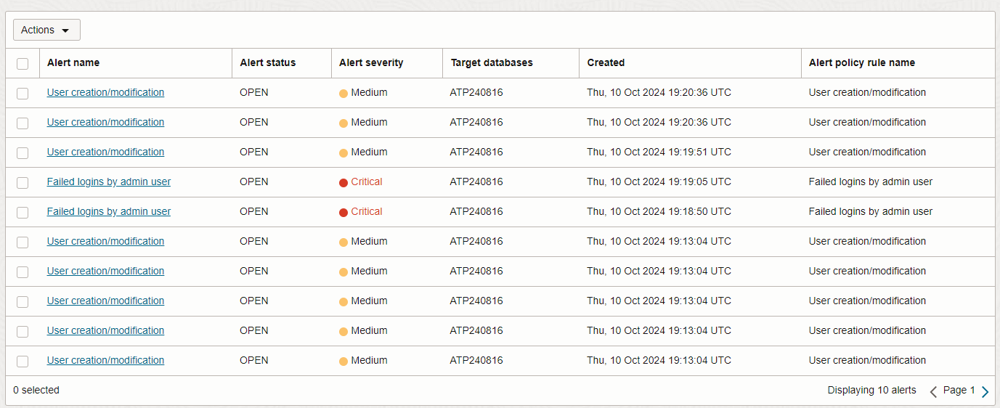
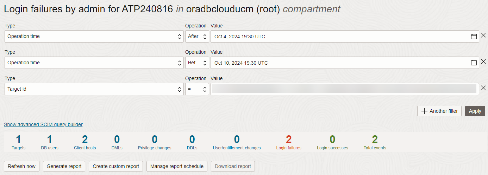
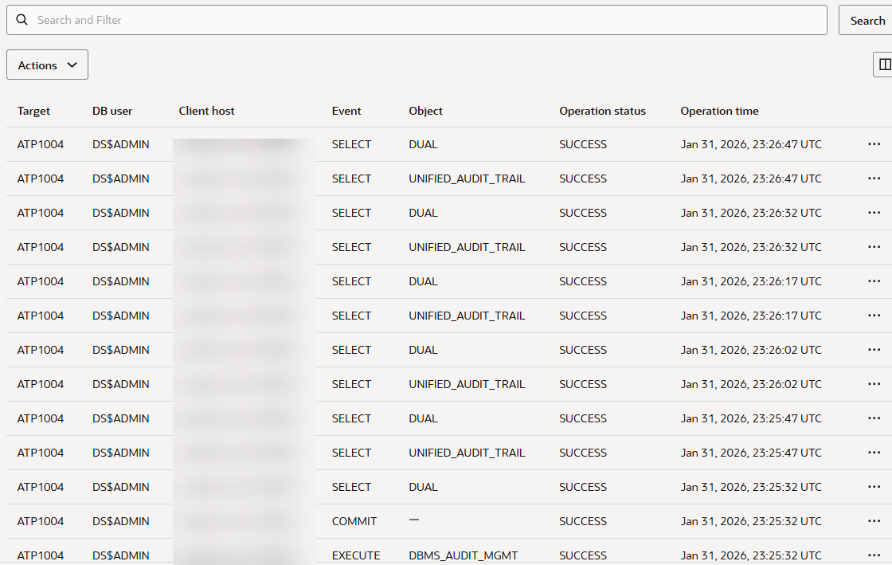

# Audit database activity

## Introduction

Audit resources for Oracle Data Safe (audit profiles, audit policies, and audit trails) are automatically created for all registered target databases. 

In this lab, you use the auditing wizard to enable alert and audit policies on your target database, start audit data collection in Oracle Data Safe, and configure the retention periods for your audit data. You then perform activity on your target database and review the alerts and audit events generated in Oracle Data Safe.

Estimated Lab Time: 10 minutes

### Objectives

In this lab, you will:

- Configure auditing and alerts for your target database
- Perform activities on your target database to generate audit data
- Review alerts in Oracle Data Safe
- Review audit events in Oracle Data Safe


### Prerequisites

This lab assumes you have:

- Obtained an Oracle Cloud account
- Signed in to the Oracle Cloud Infrastructure Console
- Prepared your environment for this workshop
- Registered your target database with Oracle Data Safe


### Assumptions

- Your data values may be different than those shown in the screenshots.
- Please ignore the dates for the data and database names. Screenshots are taken at various times and may differ between labs and within labs. 

## Task 1: Configure auditing and alerts for your target database

1. On the browser tab for Oracle Data Safe, navigate to the **Activity auditing** landing page.

2. Select **Configure auditing and alerts** to start the Activity Auditing wizard.

    The **Configure auditing and alerts** page opens.

3. For **Step 1 - Select target/target database group**, leave **Select a target database** selected. Select your database compartment and your target database.

4. Select **Next**.

    

5. For **Step 2 - Alert policies**, do the following to enable alert policies:

    a) Select **Manage alert policies**. The **Manage alert policies** panel opens.
    
    b) Leave the **Select pre-defined alert policies** tile selected.
    
    c) Select the **Failed logins by admin user** and **User creation/modification** alert policies.

    d) Select **Update**, and then select **Next**.

     


 6. For **Step 3 - Security policies**, do the following to enable security policies:

    a) Select **Manage security policies**. The **Manage security policies** panel opens.
   
    b) Select **Admin activity auditing** and **Basic auditing**.
    
    c) Select the **Custom security policies** tile.

    d) Select one of the security policies; for example, **CIS\_POLICY**.  <!-- Note: **APP\_USER\_NOT\_APP\_SERVER** is not listed -->

    e) Select **Update**, and then select **Next**.

    


7. For **Step 4 - Audit trails**, do the following:

    a) Select **UNIFIED\_AUDIT\_TRAIL**. 
    
    b) For start date, select the beginning of your current month. Leave start time as is.

    c) Select **Next**.

    

 
8. For **Step 5 - Audit profile**, configure the following, and then click **Next**.

    - Audit data online retention months = 12
    - Audit data offline retention months = 0
    - Paid usage = not enabled
    
    

    - Each regional Oracle Data Safe service in a tenancy has global settings for paid usage, online retention period, and archive retention period.
    - Global settings are applied to all target databases unless their audit profiles override them. These override the global retention setting.
    - All initial audit profile settings for your target database are inherited from the global settings for Oracle Data Safe.
    - By default, paid usage is not enabled for all target databases. You cannot enable paid usage for a free trial account.

9. For **Step 6 - Review and submit**, review the configuration, and then select **Submit** if everything is correct. Wait for the policies to be provisioned, and then select **Close**.


## Task 2: Perform activities on your target database to generate audit data

In this task, you perform activities on your target database in Database Actions to generate some audit data. First, purposely try to log in as the `ADMIN` user with incorrect passwords. Then, sign in and create a user account.

1. Return to the SQL worksheet in Database Actions.

2. Sign out of Database Actions.

    The **Sign-in** page is displayed.

3. In the **Username** box, enter `ADMIN`.

4. Do this two or three times: Enter an incorrect password, and then click **Sign in**. 

    An **Invalid credentials** message is displayed.

    

5. Enter the correct password, and click **Sign in**.

    If you are using a Sandbox environment, you can find the database password in the LiveLabs reservation.

6. If needed, close any tip dialog boxes, select the **Development** tab, and then select **SQL**.

7. Paste the following SQL script. Replace `your-password` with a password of your choice.

    The password must be between 12 and 30 characters long and must include at least one uppercase letter, one lowercase letter, and one numeric character. It cannot contain your username or the double quote (") character.

    ```
    <copy>drop user MALFOY cascade;
    create user MALFOY identified by your-password;
    grant PDB_DBA to MALFOY;</copy>
    ```

8. On the toolbar, click the **Run Script** button and wait for the script to finish running. 

9. In the script output, verify that the `MALFOY` user was successfully dropped and then recreated.

10. Return to the browser tab for Oracle Data Safe and wait a couple of minutes for Oracle Data Safe to produce the alerts.


## Task 3: Review alerts in Oracle Data Safe

1. Navigate to the **Alerts** landing page.

2. Adjust the **Time period** filter to include the current day. Also ensure that you are working in your compartment.

3. Review the charts on the **Overview** tab.

    - The **Alerts summary** chart compares the number of critical, high, and medium alerts.
    - The **Open alerts** chart shows that there are open alerts on the current day.
    - The **Top 10 alert policies by volume** chart shows you the number of alerts for the alert policies you just configured.

    

4. Select the **Alerts summary** tab and review the information.

    This tab shows the number of critical, high, and medium alerts along with target database counts. It also shows you the total number of alerts and target databases. 

    
    
5. Select the **Targets summary** tab and review the information.

    This tab shows the number of open, critical, high, and medium alerts.

    

6. Under **Alerts** on the left, select **Reports**.

7. Select the **All alerts** report to open it.

    - The report is automatically filtered to show you all alerts for all target databases in the selected compartment for the past one week. To create filters, select **Actions** and then select **Filter alerts**. In the **Edit filters** panel, you can create additional filters and use the **SCIM query builder**. 
    - You can view several totals, including the total number of target databases; total number of open and closed alerts, the total number of critical, high, medium, and low alerts; and the total number of alerts.
    - At the bottom of the page, you can view the list of alerts. By default, the table shows you the alert name, alert status, alert severity, target databases on which the audited event occurred, when the alert was created, and the alert policy rule name.
    - You have options to create a PDF or XLS report, create a custom report, schedule a custom report, open and close alerts, and specify which table columns you want displayed on the page.

    
    


## Task 4: Review audit events in Oracle Data Safe

1. Navigate to the **Activity auditing** landing page.

2. Select the **Events summary** tab.

3. Select one of the event categories, for example, **Login failures by admin**, to view more detail.
   
    
    


You may now **proceed to the next lab**.

## Learn More

* [Activity Auditing Overview](https://www.oracle.com/pls/topic/lookup?ctx=en/cloud/paas/data-safe&id=UDSCS-GUID-A73D8630-E59F-44C3-B467-F8E13041A680)
* [View and Manage Audit Reports](https://www.oracle.com/pls/topic/lookup?ctx=en/cloud/paas/data-safe&id=UDSCS-GUID-364B6431-9861-4B42-B24D-103D5F43B44A)

## Acknowledgements

* **Author** - Jody Glover, Consulting User Assistance Developer, Database Development
* **Last Updated By/Date** - Jody Glover, January 31, 2026
