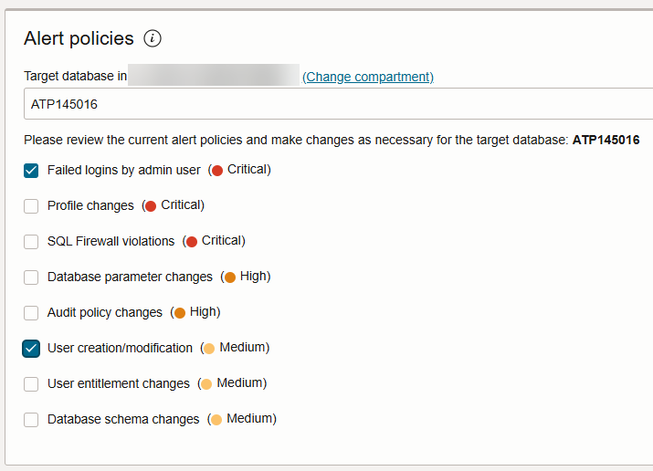
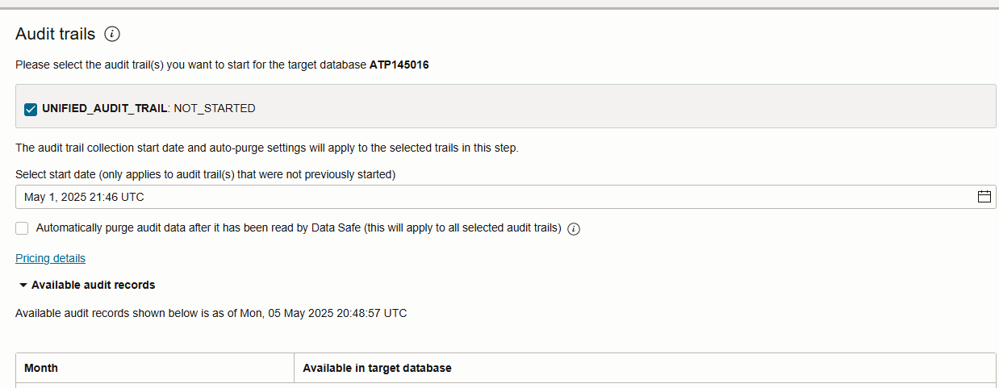
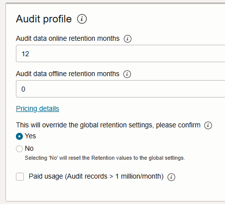
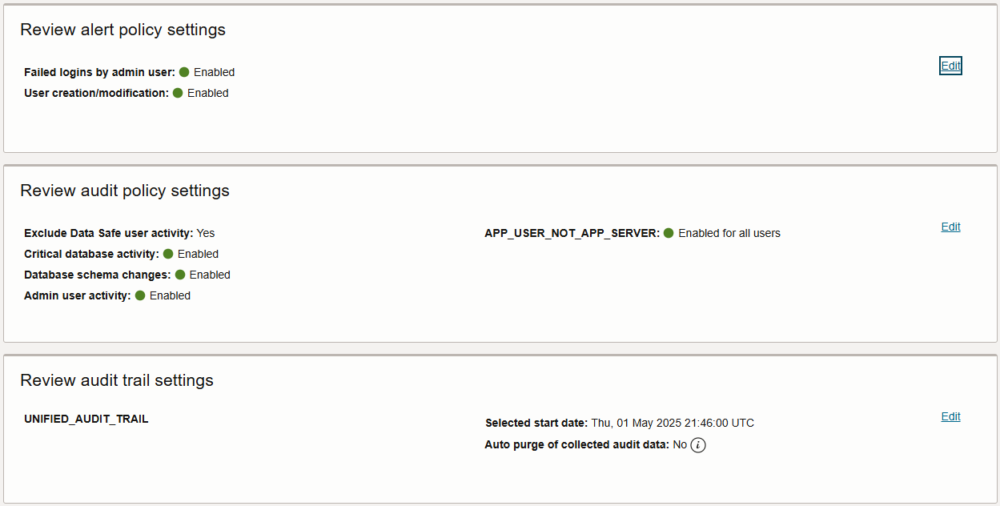
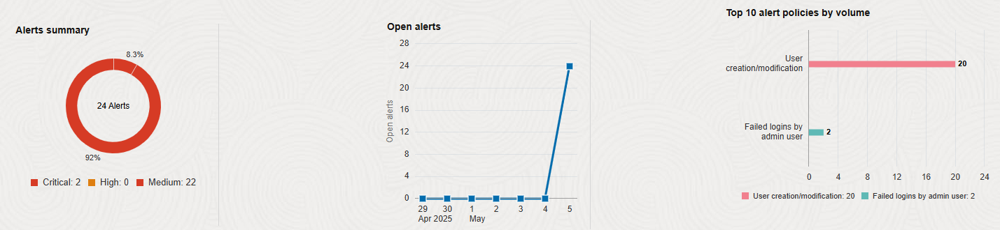
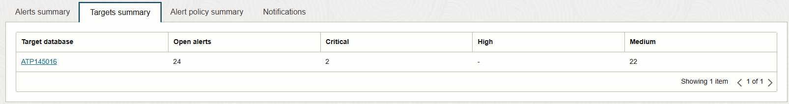

# Audit database activity

## Introduction

In Oracle Data Safe, you can provision audit policies on your target databases and collect audit data into the Oracle Data Safe repository. There are basic, administrator, user, Oracle pre-defined, and custom audit policies, as well as audit policies designed to help your organization meet compliance standards. When you register a target database, Oracle Data Safe automatically creates an audit profile, audit policy, and audit trails relevant for the target database.

Start by reviewing the global settings in Oracle Data Safe. Then, review the audit profile, audit trail(s), and audit policy that are automatically created for your target database. Start audit data collection on your target database and provision a few audit policies. Analyze the audit events and view reports. Create, download, and schedule a custom audit report.


new-
Audit resources (Audit profiles, Audit policies and Audit trails) are auto-created for all registered target databases. 

Estimated Lab Time: 20 minutes

### Objectives

In this lab, you will:

- Provision alert and audit policies and start data collection
- Review the Activity Auditing dashboard and audit policy
- Perform activity on your target database to generate alerts and audit events in Oracle Data Safe
- Review the alerts
- Review the audit events


### Prerequisites

This lab assumes you have:

- Obtained an Oracle Cloud account
- Signed in to the Oracle Cloud Infrastructure Console
- Prepared your environment for this workshop
- Registered your target database with Oracle Data Safe


### Assumptions

- Your data values may be different than those shown in the screenshots.
- Please ignore the dates for the data and database names. Screenshots are taken at various times and may differ between labs and within labs. 

## Task 1: Provision alert and audit policies and start data collection

1. In the breadcrumb at the top of the page, click **Data Safe**.

2. Under **Data Safe**, click **Activity auditing**.

3. Click **Configure auditing and alerts** to start the Activity Auditing wizard.

4. For **Alert policy**, do the following, and then click **Next**.

    a) Select your target database. The list of available alert policies is displayed.

    b) Select the **Failed logins by admin user** and **User creation/modification** alert policies.

   
    
6. For **Audit policy**, select the following, and then click **Next**.

   a) Select **Exclude Data Safe user activity**.
   
   b) Under **Basic auditing**, select **Critical database activity** and **Database schema changes**.
   
   c) Under **Admin activity auditing**, select **Admin user activity**.
   
   d) Under **Custom policies**, select **APP\_USER\_NOT\_APP\_SERVER**.

    

    

7. For **Audit trails**, do the following, and then click **Next**.

    a) Select **UNIFIED\_AUDIT\_TRAIL: NOT_STARTED**.

    b) For the start date, select the beginning of the month.

    

8. For **Audit profile**, leave the default selections as is (see below), and click **Next**.

    - Audit data online retention months = 12
    - Audit data offline retention months = 0
    - Paid usage = selected

    

    - Each regional Oracle Data Safe service in a tenancy has global settings for paid usage, online retention period, and archive retention period.
    - Global settings are applied to all target databases unless their audit profiles override them.
    - All initial audit profile settings for your target database are inherited from the global settings for Oracle Data Safe.
    - By default, paid usage is enabled for all target databases, the online retention period is set to the maximum value of 12 months, and the archive retention period is set to the minimum value of 0 months. Note that you cannot enable paid usage for a free trial account.
    

9. For **Review and submit**, review the configuration, and click **Submit** if everything is correct.

    

10. For **Audit configuration progress**, wait until the alert policies are provisioned and the audit trail is started. 
    
    
    
    


11. Click **Close**.


## Task 2: Review the Activity Auditing dashboard and audit policy

By default, the Activity Auditing dashboard shows you a summary of audit events for the last one week for all target databases in the form of charts and tables. On the left under **List scope** and **Filters**, you can filter by compartment, time period, and target database.

1. On the **Activity auditing** page, on the left under **Filters**, select your target database.

2. Review the charts.

    - The **Audit trails** chart shows you the number of audit trails that are running, stopped, not started, and that need attention.
    - The **Failed login activity** chart shows you the number of failed logins on your target database for the last one week. You may or may not have any failed logins, depending on how you have interacted in Database Actions so far.
    - The **Admin activity** chart shows you the number of database schema changes, failed logins, audit setting changes, and entitlement changes on your target database for the last one week.
    - The **All activity** chart shows you the total count of audit events on your target database for the specified time period.

    
        
    


3. Review the **Events summary** and **Targets summary** tabs.

    - Statistics include the number of target databases that have an audit event in each event category and the total number of events per category. Because you are viewing statistics for your target database only, the **Target databases** column shows ones.
    - Audit events include the number of login failures, schema changes, entitlement changes, audit settings changes, all activity (all audit events), Database Vault all violations, and Database Vault policy changes.

    

      


4. Review your target database's audit policy: To do so, under **Related resources**, click **Audit polices**. On the right, click the name of your target database.

    - A grey circle means the audit policy is not yet provisioned on the target database. A green circle means the audit policy is provisioned.
    - You can choose to provision and enable any number of audit policies on your target database and set filters on users and roles.

      


## Task 3: Perform activity on your target database to generate alerts and audit events in Oracle Data Safe

In this task, you perform activities on your target database in Database Actions to generate some audit data. First, purposely try to log in as the `ADMIN` user with incorrect passwords. Then, sign in and create a user account.

1. Return to the SQL worksheet in Database Actions.

2. Sign out of Database Actions.

    The **Sign-in** page is displayed.

3. In the **Username** box, enter `ADMIN`.

4. Do this twice: Enter an incorrect password, and then click **Sign in**. 

    An **Invalid credentials** message is displayed.

    

5. Enter the correct password, and click **Sign in**.

6. If needed, click the **SQL** tile.

7. Clear the worksheet, and then paste the following SQL script. Replace `your-password` with a password of your choice. The password must be between 12 and 30 characters long and must include at least one uppercase letter, one lowercase letter, and one numeric character. It cannot contain your username or the double quote (") character.

    ```
    <copy>drop user MALFOY cascade;
    create user MALFOY identified by your-password;
    grant PDB_DBA to MALFOY;</copy>
    ```


8. On the toolbar, click the **Run Script** button and wait for the script to finish running. 

9. In the script output, verify that the `MALFOY` user was successfully dropped and then recreated.

10. Return to the browser tab for Oracle Data Safe and wait a couple of minutes for Oracle Data Safe to produce the alerts.


## Task 4: Review the alerts

1. Under **Security center** on the left, click **Alerts**.

2. Under **Filters** on the left, select your target database.

3. Review the alerts dashboard.

    - The **Alerts summary** chart compares the number of critical, high, and medium alerts.
    - The **Open alerts** chart shows that there are open alerts on the current day.
    - The **Top 10 alert policies by volume** chart shows you the number of alerts for the alert policies you just configured.
    - The **Alerts summary** tab shows the number of critical, high, and medium alerts along with target database counts. It also shows you the total number of alerts and target databases. 
    - The **Targets summary** tab shows the number of open, critical, high, and medium alerts.

    
    
    


4. Under **Related resources**, click **Reports**.

5. In the **Report name** column on the right, click the **All alerts** report and review it.

    - The report is automatically filtered to show you all alerts for all target databases in the selected compartment for the past one week. To manually create custom filters, you can use the **SCIM query builder**. 
    - You can view several totals, including the total number of target databases; total number of open and closed alerts, and the total number of critical, high, medium, and low alerts. You can click the **Targets** total to view the list of target databases. You can click the other totals to toggle a filter on the list of alerts.
    - At the bottom of the report, you can view the list of alerts. By default, the table shows you the alert name, alert status, alert severity, target databases on which the audited event occurred, when the alert was created, and the alert policy rule name.
    - You have options to create a PDF or XLS report, create a custom report, schedule a custom report, open and close alerts, and specify which table columns you want displayed on the page.

    
    


## Task 5: Review the audit events

1. On the left under **Security center**, click **Activity auditing**.

2. From the **Target databases** drop-down list on the left, select your target database. 

3. On the **Events summary** tab, click one of the event categories, for example, **Login failures by admin** to view more detail.
   
    

 

You may now **proceed to the next lab**.

## Learn More

* [Activity Auditing Overview](https://www.oracle.com/pls/topic/lookup?ctx=en/cloud/paas/data-safe&id=UDSCS-GUID-A73D8630-E59F-44C3-B467-F8E13041A680)
* [View and Manage Audit Reports](https://www.oracle.com/pls/topic/lookup?ctx=en/cloud/paas/data-safe&id=UDSCS-GUID-364B6431-9861-4B42-B24D-103D5F43B44A)

## Acknowledgements

* **Author** - Jody Glover, Consulting User Assistance Developer, Database Development
* **Last Updated By/Date** - Jody Glover, October 8, 2024
