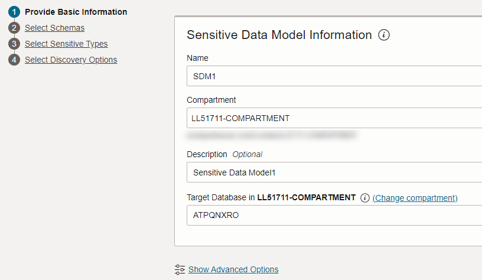
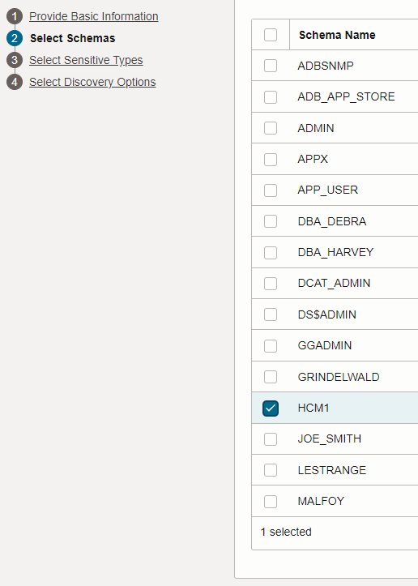
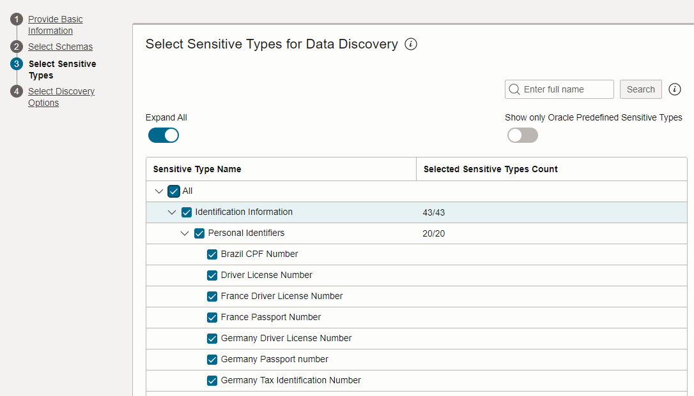
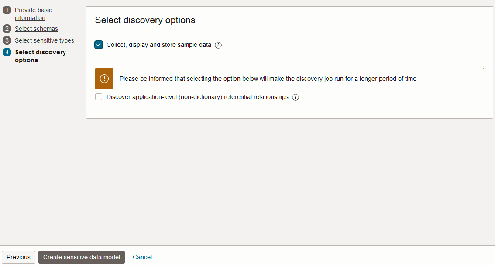
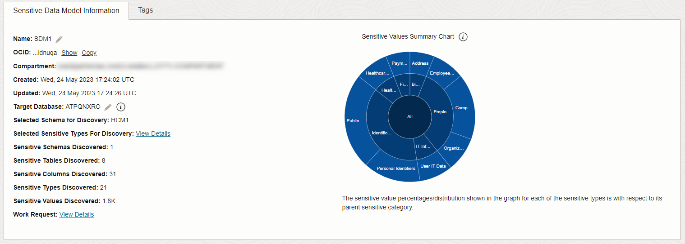
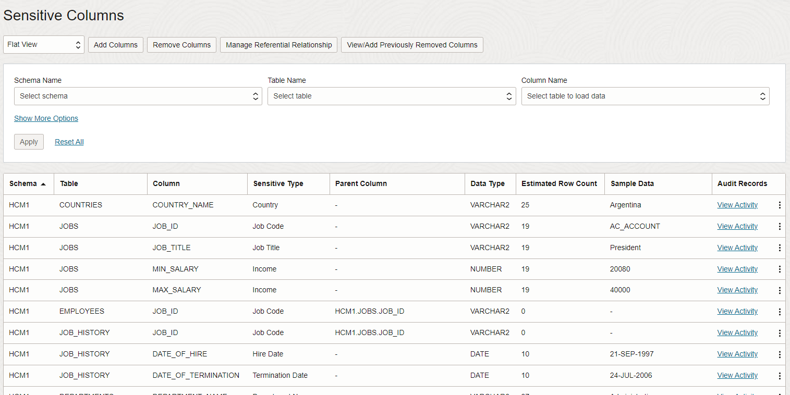
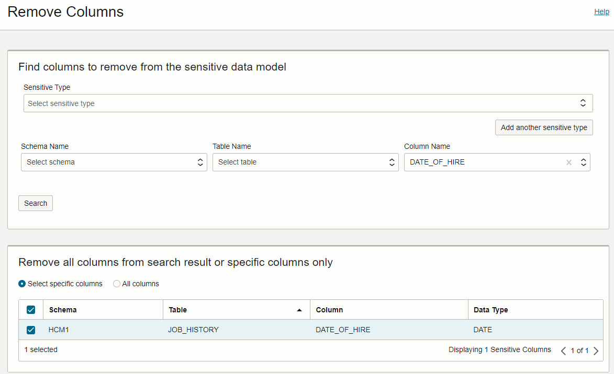

# Discover Sensitive Data

## Introduction

Data Discovery helps you find sensitive data in your target databases. You tell Data Discovery what kind of sensitive data to search for, and it inspects the actual data in your target database and its data dictionary, and then returns to you a list of sensitive columns. By default, Data Discovery can search for a wide variety of sensitive data pertaining to identification, biographic, IT, financial, healthcare, employment, and academic information.

Use Oracle Data Safe to discover sensitive data on your target database and then adjust the sensitive data model.

Estimated Time: 10 minutes

### Objectives

In this lab, you will:

- Discover sensitive data in your target database by using Data Discovery
- Adjust the sensitive data model

### Prerequisites

This lab assumes you have:

- Obtained an Oracle Cloud account and signed in to the Oracle Cloud Infrastructure Console
- Prepared your environment for this workshop
- Registered your target database with Oracle Data Safe

### Assumptions

- Your data values are most likely different than those shown in the screenshots.

Watch the video below for a quick walk-through of the lab.
[Discover Sensitive Data](videohub:1_d0fz5ep5)

## Task 1: Discover sensitive data in your target database by using Data Discovery

1. Make sure that you are on the browser tab for Oracle Data Safe. If needed, sign in again.

2. In the breadcrumb at the top of the page, click **Data Safe**.

3. On the left under **Security Center**, and click **Data Discovery**.

4. From the **Compartment** drop-down list, select your compartment.

    A Data Discovery overview page is displayed with statistics for the top five target databases in your compartment. Your page is most likely empty because this is the first time you are using Data Discovery in this workshop.

5. Click **Discover Sensitive Data**.

    The **Create Sensitive Data Model** page is displayed.

6. On the **Provide Basic Information** page, do the following, and then click **Next**.

    - In the **Name** box, enter **SDM1**.
    - Leave the compartment set to your compartment.
    - In the **Description** box, enter **Sensitive Data Model 1**.
    - Select your target database

    

7. On the **Select Schemas** page, leave **Select specific schemas only** selected. Scroll down and select the **HCM1** schema, and then click **Next**. You might need to click the right arrow button at the bottom of the page to navigate to page 2.

    

8. On the **Select Sensitive Types** page, expand all of the sensitive categories by moving the **Expand All** slider to the right. Scroll down the page and review the sensitive types. Notice that you can select individual sensitive types, sensitive categories, and all sensitive types at one time. At the top of the page, select the **All** check box, and then click **Next**.

    

9. On the **Select Discovery Options** page, select **Collect, display and store sample data**, and then click **Create Sensitive Data Model** at the bottom of the page to begin the data discovery process.

    

10. Wait for the sensitive data model to be created.

    The **Sensitive Data Model Details** page is displayed.

11. Review the information on the **Sensitive Data Model Details** page.

    - The **Sensitive Data Model Information** tab lists information about your sensitive data model, including its name and Oracle Cloud Identifier (OCID), the compartment to which you saved it, the date and time when it was created and last updated, the target database associated with it, the selected schema for discovery (HCM1), and totals for discovered sensitive schemas, sensitive tables, sensitive columns, sensitive types, and sensitive values.
    - You can view the selected sensitive types for discovery (click **View Details**).
    - You can view the work request information (click **View Details**).
    - The pie chart compares the number of sensitive values per sensitive category and sensitive type.
    - The **Sensitive Columns** table lists the discovered sensitive columns. By default, the table is displayed in **Flat View** format. For each sensitive column, you can view its schema name, table name, column name, sensitive type, parent column, data type, estimated row count, and sample data (if you chose to retrieve sample data and if it exists). Review the sample data to get an idea of what it looks like.

    
    

## Task 2: Adjust the sensitive data model

Remove the `DATE_OF_HIRE` column from the sensitive data model.

1. In the **Sensitive Columns** section, click **Remove Columns**. 

    The **Remove Columns** panel is displayed.
    
2. In the **COLUMN NAME** box, enter **DATE**, and then select **DATE\_OF\_HIRE**.

3. Click **Search**.

4. Select the checkbox for the **DATE\_OF\_HIRE** column in the **JOB_HISTORY** table, and then click **REMOVE COLUMNS**.

    

You may now **proceed to the next lab**.

## Learn More

- [Data Discovery](https://docs.oracle.com/en-us/iaas/data-safe/doc/data-discovery.html)

## Acknowledgements
- **Author** - Jody Glover, Consulting User Assistance Developer, Database Development
- **Last Updated By/Date** - Jody Glover, August 22, 2023
