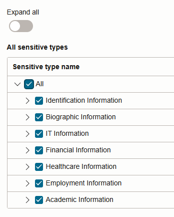

# Discover sensitive data

## Introduction

Data Discovery helps you find sensitive data in your target databases. You tell Data Discovery what kind of sensitive data to search for, and it inspects the actual data in your target database and its data dictionary, and then returns to you a list of sensitive columns. By default, Data Discovery can search for a wide variety of sensitive data pertaining to identification, biographic, IT, financial, healthcare, employment, and academic information.

In this lab, you use Oracle Data Safe to discover sensitive data on your target database and then adjust the sensitive data model.

Estimated Lab Time: 15 minutes

[Lab 4 - Discover sensitive data](videohub:1_g5kt8rbe)

### Objectives

In this lab, you will:

- Discover sensitive data in your target database by using Data Discovery
- Add a column to the sensitive data model

### Prerequisites

This lab assumes you have:

- Obtained an Oracle Cloud account and signed in to the Oracle Cloud Infrastructure Console
- Access to or prepared an environment for this workshop
- Access to a registered target database

### Assumptions

- Your data values might be different than those shown in the screenshots.
- Please ignore the dates for the data and database names. Screenshots are taken at various times and may differ between labs and within labs. 

## Task 1: Discover sensitive data in your target database by using Data Discovery

1. Make sure that you are on the browser tab for Oracle Data Safe. If needed, sign in again.

2. In the breadcrumb at the top of the page, click **Data Safe**.

3. On the left under **Security center**, and click **Data discovery**.

4. From the **Compartment** drop-down list, select your compartment.

    The Data discovery page is displayed with statistics for the top five target databases in your compartment. Your page is most likely empty because this is the first time you are using Data Discovery in this workshop.

5. Click **Discover sensitive data**.

    The **Create sensitive data model** wizard is displayed.

6. On the **Provide basic information** page, do the following, and then click **Next**.

    - In the **Name** box, enter **SDM1**.
    - Leave the compartment set to your compartment.
    - In the **Description** box, enter **Sensitive Data Model 1**.
    - Select your target database

    

7. On the **Select schemas** page, wait for the schemas to be refreshed if prompted to do so. Leave **Select specific schemas only** selected. Scroll down and select the **HCM1** schema, and then click **Next**. You might need to click the right arrow button at the bottom of the page to navigate to page 2.

    

8. On the **Select tables for schema** page, leave **All tables** selected, and click **Next**.

    
    
9. On the  **Select sensitive types** page, review the list of common sensitive types and then scroll down and review all available sensitive types. Select all sensitive types, and click **Next**.

    

10. On the **Select discovery options** page, select **Collect, display and store sample data**, and then click **Create sensitive data model** at the bottom of the page to begin the data discovery process.

    

11. Wait for the sensitive data model to be created. The **Sensitive data model details** page is displayed.

12. Review the information about the sensitive data model.

    - The **Sensitive data model information** tab lists general information about your sensitive data model, the target database, sensitive data information, and sensitive data counts.
    - You can view the selected sensitive types for discovery, sensitive schemas discovered, sensitive types discovered, and work request information by clicking the respective **View details** link.
    - The bar chart shows you the number of sensitive columns found for the top five sensitive types.
    - The **Sensitive columns** table lists the discovered sensitive columns. By default, the table is displayed in **Flat view** format. You can change it to **Sensitive type view** or **Schema view**. For each sensitive column, you can view its schema name, table name, column name, sensitive type, parent column, data type, estimated row count, sample data (if you chose to retrieve sample data and if it exists), and audit records. Review the sample data to get an idea of what it looks like.

    
    

## Task 2: Add a column to the sensitive data model

Add `COUNTRY_ABBREV` to the sensitive data model.

1. Click **Add columns**.

2. From the **Schema name** drop-down list, select **HCM1**.

3. From the **Table name** drop-down list, select **LOCATIONS**.

4. From the **Column name** drop-down list, select **COUNTRY_ABBREV**.

5. Click **Search**.

6. Select the check box for the `COUNTRY_ABBREV` column.

7. From the **Sensitive type** drop-down list, under **Biographic Information > Address**, select **Country**. *Be sure to select Country, not County.*

8. Click **Add columns**.

   

9. Verify that `COUNTRY_ABBREV` from the `LOCATIONS` table is added to your sensitive data model.

You may now **proceed to the next lab**.

## Learn More

- [Data Discovery Overview](https://docs.oracle.com/en/cloud/paas/data-safe/udscs/data-discovery-overview.html)

## Acknowledgements
- **Author** - Jody Glover, Consulting User Assistance Developer, Database Development
- **Last Updated By/Date** - Jody Glover, October 20, 2025
