# Discover sensitive data

## Introduction

In the previous two labs, you investigated the security posture of the database and then reviewed who can access it and what they can do. You have now identified risky configuration changes and changes to privileged users and entitlements. The next question is more fundamental: What data are we actually trying to protect? Knowing that a user has access to a database does not tell you whether that access puts sensitive information at risk. To understand the potential impact of a compromised or over-privileged account, you need to know where sensitive data resides.

For example, a user might have access to a schema containing the following:

- Employee information
- Contact information
- Identification information
- Financial information
- Healthcare information
- Academic information
- Other information that your organization considers sensitive

Manually locating this information across database tables and columns can be difficult, particularly as databases grow and application schemas change. Oracle Data Safe Data Discovery helps you build an inventory of sensitive data by inspecting the actual data in your target database and its data dictionary. You specify the types of sensitive information you are interested in, and Data Safe identifies columns that contain or are related to that information.

### Scenario

Continue acting as the database security administrator from the previous labs. You have already done the following:

- Reviewed the database's configuration and established an approved security baseline
- Detected a risky configuration change
- Reviewed database users and identified changes to privileged access

Now your security team asks a different question: If one of these accounts were compromised, what sensitive information could potentially be exposed?

Your first step is to discover where sensitive data exists in the database. You will use Data Discovery to examine the `HCM1` schema and identify sensitive columns. You will review the results and sample data to understand what information is being protected. During the review, you will also recognize that automated discovery does not necessarily capture every piece of information your organization considers sensitive. You will therefore extend the sensitive data model by performing an incremental discovery of sensitive data and by explicitly adding another sensitive column. This creates a more complete inventory that can support the security and data protection activities you will perform in subsequent labs.

Estimated Lab Time: 15 minutes

### Objectives

In this lab, you will:

- Discover sensitive data in your target database
- Review where sensitive information is stored
- Examine the sensitive data model
- Understand how Data Safe uses sensitive types and data relationships
- Extend the sensitive data model with an additional sensitive column
- Build a more complete view of the data that needs protection

### Prerequisites

This lab assumes you have:

- Obtained an Oracle Cloud account and signed in to the Oracle Cloud Infrastructure Console
- Access to or prepared an environment for this workshop
- Access to a registered target database

### Assumptions

- Your data values might be different than those shown in the screenshots.
- Please ignore the dates for the data and database names. Screenshots are taken at various times and may differ between labs and within labs. 

## Task 1: Discover sensitive data in your target database by using Data Discovery

1. Navigate to the **Data discovery** landing page.

2. Select **Discover sensitive data**.

    The **Create sensitive data model** wizard opens.

3. For **Step 1 - Provide basic information**, do the following, and then select **Next**.

    - In the **Name** box, enter **SDM1**.
    - Select your compartment, if needed.
    - In the **Description** box, enter **Sensitive Data Model 1**.
    - Select the compartment for your target database, and then select the name of target database.

    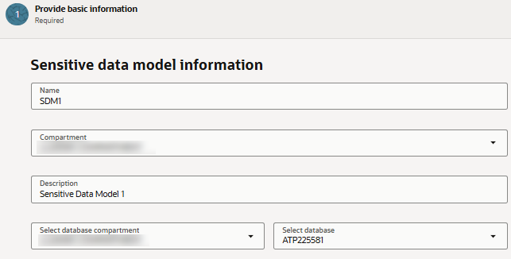

4. For **Step 2 - Select schemas**, wait for the schemas to be refreshed if prompted to do so. Leave **Select specific schemas only** selected. Scroll down and select the **HCM1** schema, and then select **Next**. You might need to click the right arrow button at the bottom of the page to navigate to page 2.

    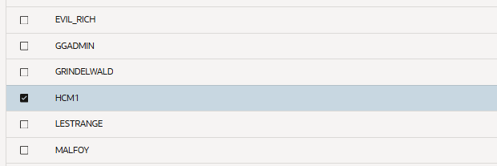

5. For **Step 3 - Select tables for schemas**, leave **All tables** selected, and select **Next**.

    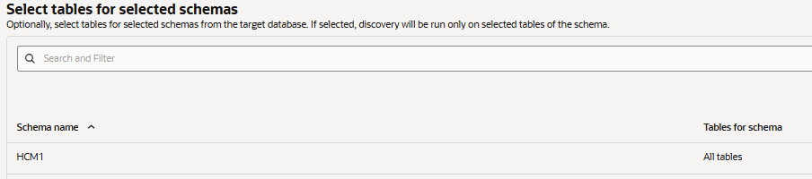
    
6. For **Step 4 - Select sensitive types**, review the common sensitive types. From the dropdown list, select **All sensitive types** and review them. Switch back to **Common sensitive types**, and then select them all by selecting the **Sensitive type** check box. Select **Next**.

    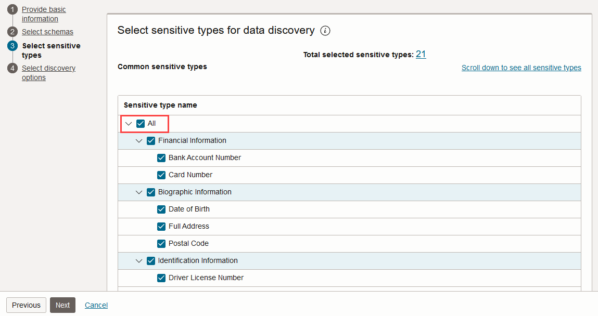

7. For **Step 5 - Select discovery options**, select **Collect, display and store sample data**.

    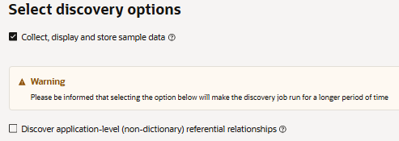

8. Select **Create sensitive data model** to begin the data discovery process. Wait for the sensitive data model to be created.

    The **SDM1** page opens.

## Task 2: Analyze the sensitive data model

1. Review the information about the sensitive data model.

    - The **Details** tab lists general information about your sensitive data model, the target database, sensitive data information, and sensitive data counts.
    - You can view the selected schemas for discovery, selected sensitive types for discovery, sensitive schemas discovered, and sensitive types discovered by selecting the respective **View details** button.

    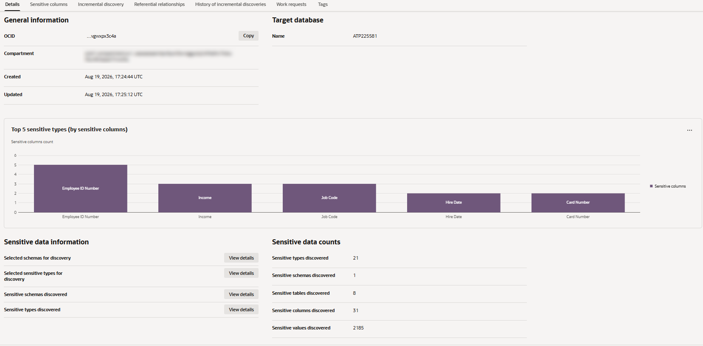
    
2. Select the **Sensitive columns** tab and review the discovered sensitive columns. 

    - For each sensitive column, you can view its schema name, table name, column name, sensitive type, parent column, data type, sample data (if you chose to retrieve sample data and if it exists), confidence level, estimated row count, and audit records.
    - Review the sample data to get an idea of what it looks like.
    - If a sensitive column was discovered because it has a relationship to another sensitive column as defined in the database's data dictionary, the other sensitive column is displayed in the column named **Parent column**. For example, `EMPLOYEE_ID` in the `EMP_EXTENDED` table has a relationship to `EMPLOYEE_ID` in the `EMPLOYEES` table.

    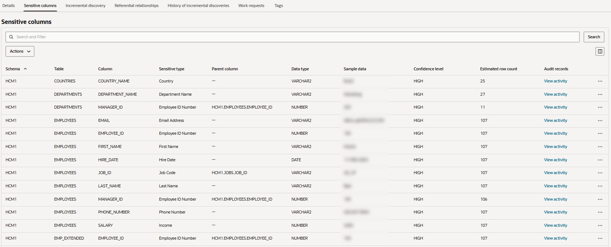

## Task 3: Perform an incremental discovery

Increase the scope of the data discovery job.

1. Select the **Incremental discovery** tab.

2. Select **Run discovery now**.

    The **Run discovery now** dialog box opens.

3. Select **Adjust the scope for the incremental discovery**, and then select **Submit**.

    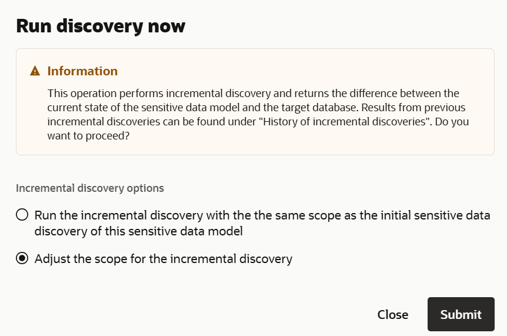

    You are returned to the beginning of the data discovery wizard.

4. For **Step 1 - Provide basic information**, select **Next**.

5. For **Step 2 - Select schemas**, select **Next**.

6. For **Step 3 - Select tables for schema**, select **Next**.

7. For **Step 4 - Select sensitive types**, select **All sensitive types** from the dropdown list. Select **Biographic Information** and **Employment Information**, and then select **Next**.

8. For **Step 5 - Select discovery options**, select **Collect, display and store sample data**.

9. Select **Run discovery now**.

    When the discovery job finishes, the **History of incremental discoveries** tab is displayed. Your discovery job is listed in the table and has a status of **Active**.

10. Select the **Incremental discovery** tab, scroll down, and review the additional sensitive data that was discovered.

11. Select the check box next to **Schema** in the table to select all of the discovered sensitive columns.

12. From the **Actions** menu, select **Approve**.

    The **Approve discovery results** dialog box is displayed. Approving the selected columns will mark the discovery results to add new columns, remove deleted columns or update the modified columns. This action does not update the sensitive data model automatically. Apply to SDM will update the sensitive data model with the latest results that have been approved or rejected.

    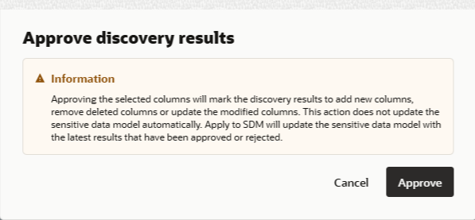

13. Select **Approve**.

14. With all of the columns still selected, from the **Actions** menu, select **Apply to SDM**.

    The **Apply to SDM** dialog box opens. You are warned that this operation will update the sensitive data model with all the columns of this discovery job results that have been processed.

    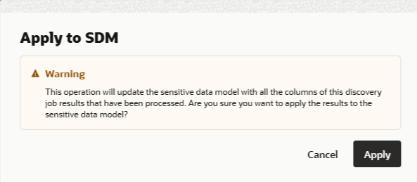

15. Select **Apply**, and then wait to be returned to the **Incremental discovery** tab.

    The sensitive data model is updated with the additional sensitive columns.
    
16. Select the **History of incremental discoveries** tab, and then select your incremental discovery job. All of the sensitive columns are marked as **Approved** in the **Planned action** column.

## Task 4: Remove a column from the sensitive data model

Remove the `DATE_OF_HIRE` column from the sensitive data model.

1. Return to the the **Sensitive columns** tab.

2. Under **Sensitive columns**, from the **Actions** menu, select **Remove columns**.

    The **Remove columns** panel opens.

3. From the **Column** dropdown list, select **DATE\_OF\_HIRE**.

4. Select **Search**.

5. Select the check box for the **DATE\_OF\_HIRE** column in the **JOB_HISTORY** table, and then select **Remove columns**.

    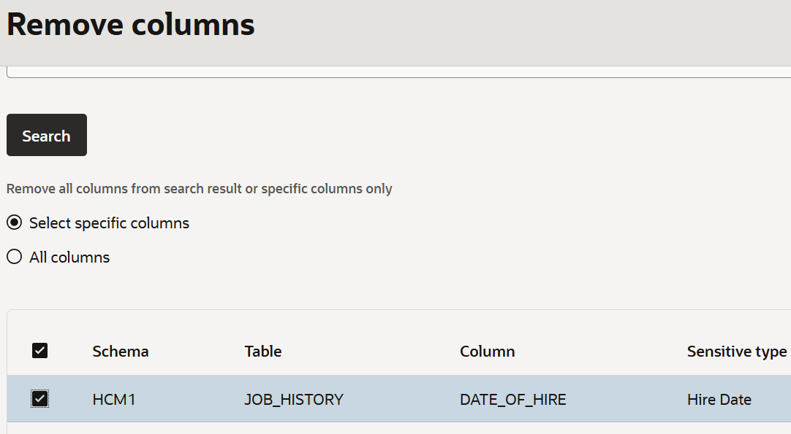

## Task 5: Add a column to the sensitive data model

Add `COUNTRY_ABBREV` to the sensitive data model.

1. Under **Sensitive columns**, from the **Actions** menu, select **Add columns**.

    The **Add columns** panel opens.

2. From the **Schema name** dropdown list, select **HCM1**.

3. From the **Table name** dropdown list, select **LOCATIONS**.

4. From the **Column name** dropdown list, select **COUNTRY_ABBREV**.

5. Select **Search**.

6. Scroll down, and then from the **Sensitive type** dropdown list for the `COUNTRY_ABBREV` column, select **Address - Country**. *Be sure to select Country, not County.*

7. Select the check box for the `COUNTRY_ABBREV` column.

8. Select **Add columns**, and then wait until you are returned to the **Sensitive columns** list.

    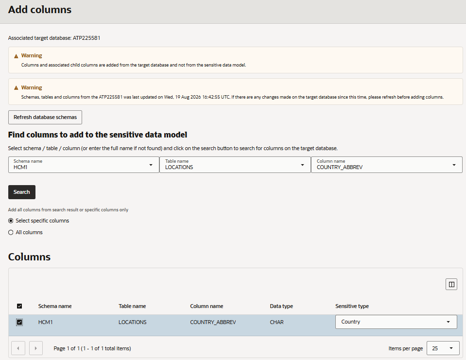

9. Verify that `COUNTRY_ABBREV` from the `LOCATIONS` table is added to your sensitive data model.

You may now **proceed to the next lab**.

## Learn More

- [Data Discovery Overview](https://docs.oracle.com/iaas/data-safe/doc/data-discovery-overview.html)

## Acknowledgements

- **Author** - Jody Glover, Lead Principal User Assistance Developer, Database Development
- **Contributor** - Bettina Schäumer, Lead Principal Product Manager, Oracle Database Security
- **Last Updated By/Date** - Jody Glover, August 20, 2026
