# Discover sensitive data

## Introduction

In the previous two labs, you investigated the security posture of the database and then reviewed who can access it and what they can do. You have now identified risky configuration changes and changes to privileged users and entitlements. The next question is more fundamental: What data are we actually trying to protect?

Knowing that a user has access to a database does not tell you whether that access puts sensitive information at risk. To understand the potential impact of a compromised or over-privileged account, you need to know where sensitive data resides.

For example, a user might have access to a schema containing the following:
- Customer information
- Contact information
- Identification information
- Payment information
- Support information

Manually locating this information across database tables and columns can be difficult, particularly as databases grow and application schemas change. Oracle Data Safe Data Discovery helps you build an inventory of sensitive data by inspecting the actual data in your target database and its data dictionary. You specify the types of sensitive information you are interested in, and Data Safe identifies columns that contain or are related to that information.

Data Discovery also allows you to incrementally expand an existing sensitive data model as your data protection requirements change. This helps you maintain a sensitive data inventory over time without having to recreate the entire model each time you need to discover sensitive data in additional schemas.

### Scenario

Continue acting as the database security administrator from the previous labs. You have already done the following:
- Reviewed the database's configuration and established an approved security baseline
- Detected a risky configuration change
- Reviewed database users and identified changes to privileged access

Now your security team asks a different question: If one of these accounts were compromised, what sensitive information could potentially be exposed?

Your application is being prepared for testing, and the initial testing scope includes customer and payment data. Your first step is therefore to discover where sensitive data exists in these schemas.

You will create a sensitive data model and use Data Discovery to examine the `CUSTOMER` and `PAYMENT` schemas. You will review the results to understand what sensitive information was discovered and where it resides.

The application testing scope then expands to include customer-support data. Rather than creating a new sensitive data model from scratch, you will reuse the existing model and perform an incremental discovery of the `SUPPORT` schema.

Data Safe identifies the newly discovered sensitive columns so that you can review and approve the changes before applying them to the existing sensitive data model.

This demonstrates how a sensitive data inventory can evolve as application requirements change:

Discover → Review → Approve → Apply

By the end of the lab, your sensitive data model will provide a more complete inventory covering the customer, payment, and support data relevant to application testing.

Estimated Lab Time: 20 minutes

### Objectives

In this lab, you will:

- Discover sensitive data in the `CUSTOMER` and `PAYMENT` schemas using common sensitive types.
- Review the sensitive data model and the initial discovery results.
- Run an incremental discovery for the `SUPPORT` schema.
- Review, approve, and apply the newly discovered sensitive columns to the existing model.
- Build and maintain a more complete sensitive data inventory as application requirements expand.

### Prerequisites

This lab assumes you have:

- An Oracle Cloud account and access to the Oracle Cloud Infrastructure Console.
- Access to the workshop environment.

### Assumptions

- Compartment names, target database names, dates, and discovery results can differ in your tenancy. The numbers of sensitive schemas, tables, columns, and types shown in this lab are examples from the workshop database.

## Task 1: Discover sensitive data in customer and payment schemas

1. Navigate to **Data discovery** in Oracle Data Safe, open **Sensitive data models**, and select **Create sensitive data model**.

2. In **Provide basic information**, enter the following, and then select **Next**:

    - **Name:** `SDM1` (or a unique name in your compartment).
    - **Compartment:** your workshop compartment.
    - **Description:** `Sensitive data inventory for customer application testing`.
    - Select the compartment for your target database, and then select the name of target database.

    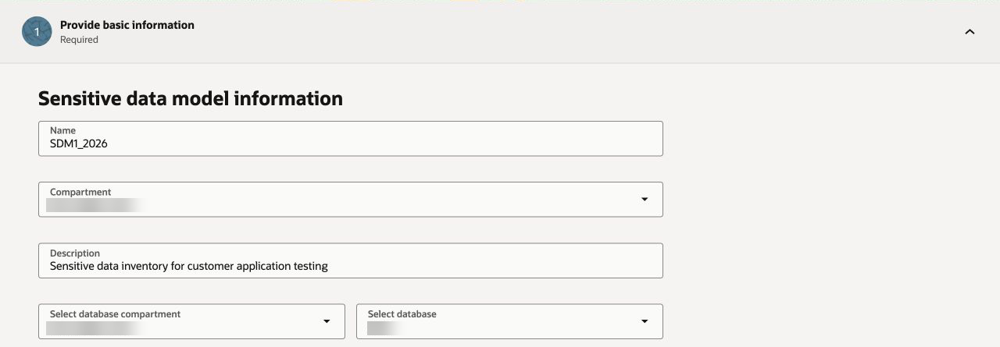

3. In **Select schemas**, wait for the schema list to load. If the database schemas have changed since the displayed update time, select **Refresh database schemas**. Keep **Select specific schemas only** selected, and select only `CUSTOMER` and `PAYMENT`. Leave `SUPPORT` unselected for this first discovery, and select **Next**.

    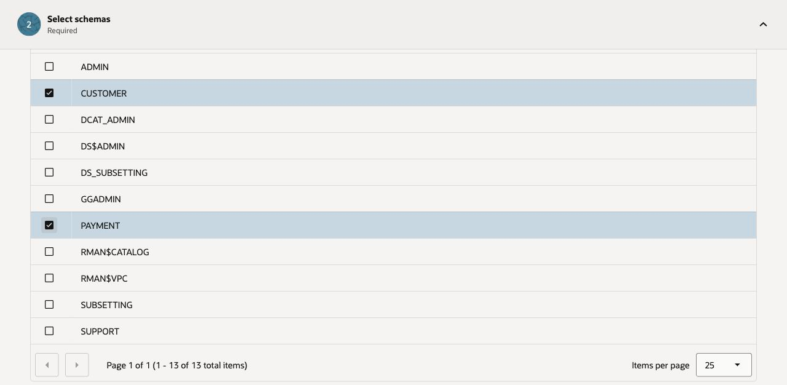

4. In **Select tables for schema**, confirm that `CUSTOMER` and `PAYMENT` are listed with **All tables**, and select **Next**.

    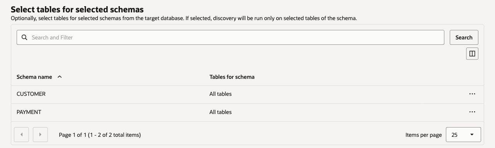

5. In **Select sensitive types**, choose **Common sensitive types** in **Select sensitive type group**. Use the checkbox in the table header to select all common sensitive types, and select **Next**.

    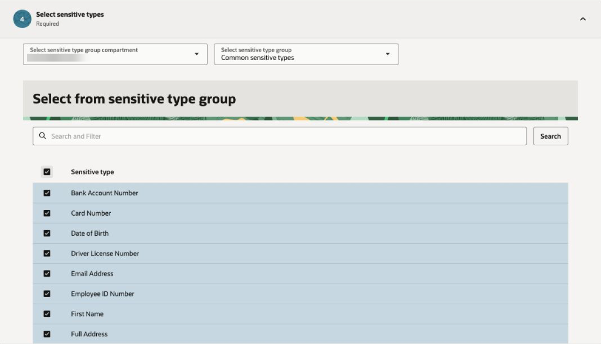

6. In **Select discovery options**, leave **Collect, display and store sample data** and **Discover application-level (non-dictionary) referential relationships** unselected for this lab. If **Run AI data discovery** is shown, leave it unselected.

    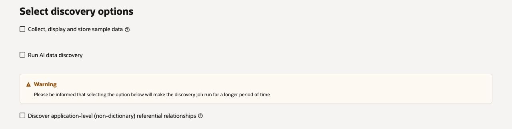

7. Select **Create sensitive data model**. Wait until the `SDM1` model becomes **Active**.

## Task 2: Review the initial discovery results

1. On the **Details** tab, review **Sensitive data information** and **Sensitive data counts**. Select **View details** beside an information item to view its details.

    In the captured run, the initial discovery found **12 sensitive columns across 2 schemas and 3 tables**, covering **10 sensitive types**.

    

2. Select **Sensitive columns**. Review the schema, table, column, sensitive type, and confidence level for the discovered columns. The **Parent column** field identifies a related sensitive column when a referential relationship is found. Sample data is empty because it was not collected.

    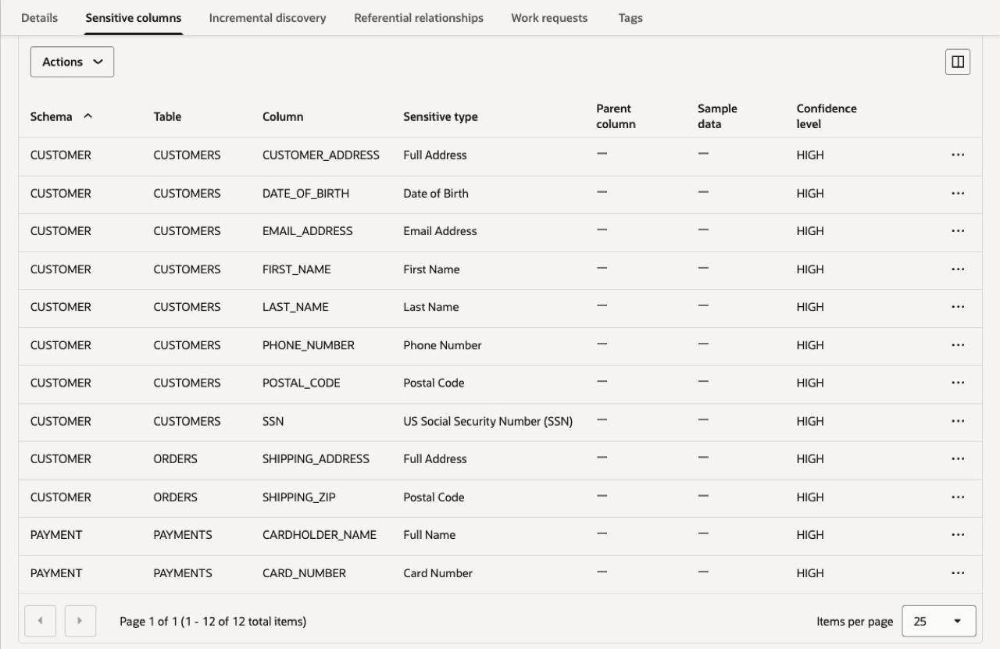

    The initial inventory in the captured run is:

    | Schema | Table | Column | Sensitive type |
    | --- | --- | --- | --- |
    | CUSTOMER | CUSTOMERS | CUSTOMER_ADDRESS | Full Address |
    | CUSTOMER | CUSTOMERS | DATE_OF_BIRTH | Date of Birth |
    | CUSTOMER | CUSTOMERS | EMAIL_ADDRESS | Email Address |
    | CUSTOMER | CUSTOMERS | FIRST_NAME | First Name |
    | CUSTOMER | CUSTOMERS | LAST_NAME | Last Name |
    | CUSTOMER | CUSTOMERS | PHONE_NUMBER | Phone Number |
    | CUSTOMER | CUSTOMERS | POSTAL_CODE | Postal Code |
    | CUSTOMER | CUSTOMERS | SSN | US Social Security Number (SSN) |
    | CUSTOMER | ORDERS | SHIPPING_ADDRESS | Full Address |
    | CUSTOMER | ORDERS | SHIPPING_ZIP | Postal Code |
    | PAYMENT | PAYMENTS | CARDHOLDER_NAME | Full Name |
    | PAYMENT | PAYMENTS | CARD_NUMBER | Card Number |

## Task 3: Run incremental discovery

The application testing scope now includes customer-support tickets. Reuse `SDM1` to discover the additional sensitive data.

1. Select the **Incremental discovery** tab, and then select **Run discovery now** under **Discovery job results**.

2. Select **Adjust the scope for the incremental discovery**, and then select **Submit**.

    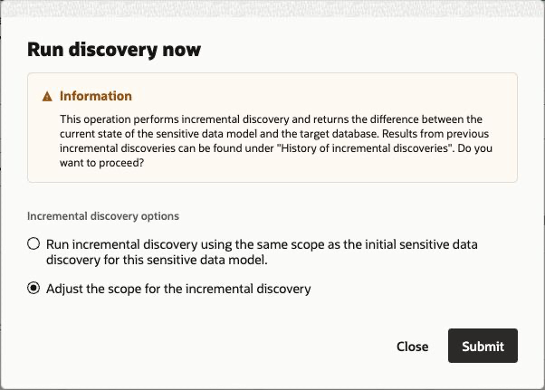

3. In **Provide basic information**, name the job `Discover_SUPPORT`, review the compartment, and select **Next**.

4. In **Select schemas**, keep **Select specific schemas only** selected. Clear the preselected `CUSTOMER` and `PAYMENT` checkboxes, select `SUPPORT`, and select **Next**. This limits the new discovery job to support data; the existing customer and payment columns remain in the model.

    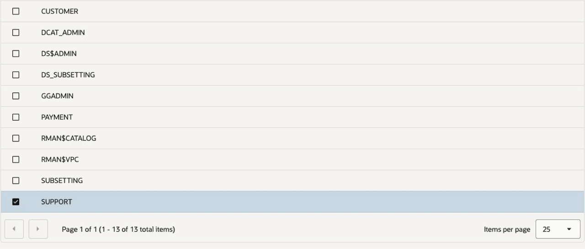

5. In **Select tables for schema**, confirm that only `SUPPORT` is listed with **All tables**, and select **Next**.

    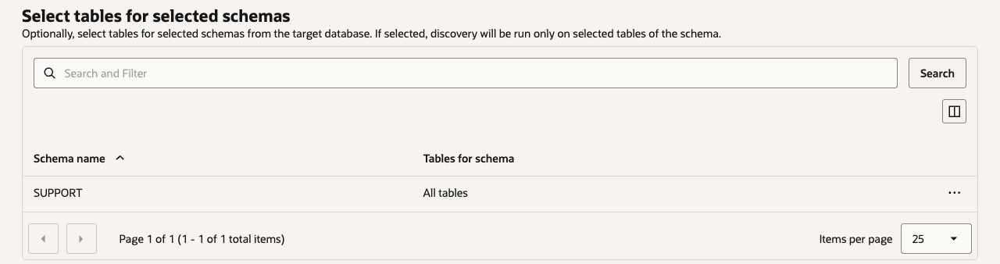

6. In **Select sensitive types**, keep **Common sensitive types** and confirm that all common types remain selected. Select **Next**.

7. In **Select discovery options**, keep the same options as the initial discovery: leave sample data collection, application-level relationship discovery, and **Run AI data discovery** (if shown) unselected. Select **Run discovery now**, and wait for the job to complete. If **History of incremental discoveries** opens, select **Cancel** to return to the **Incremental discovery** tab.

## Task 4: Apply the incremental discovery results

1. On the **Incremental discovery** tab, review **Discovery job results**. In the captured run, two columns in `SUPPORT.SUPPORT_TICKETS` have the column status **New**:

    | Column | Sensitive type |
    | --- | --- |
    | CONTACT_EMAIL | Email Address |
    | CONTACT_PHONE | Phone Number |

    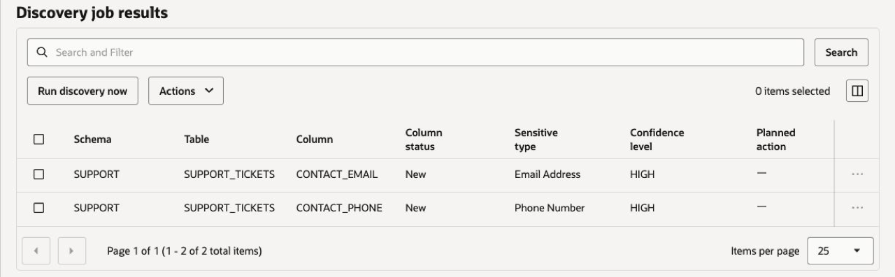

2. Select the two new support columns, open **Actions**, and select **Approve**. Confirm the approval in the dialog.

3. Open **Actions** and select **Apply to SDM**. Confirm that you want to apply the approved changes, and wait for the update to complete. Approval records your decision; applying the changes updates the sensitive data model.

    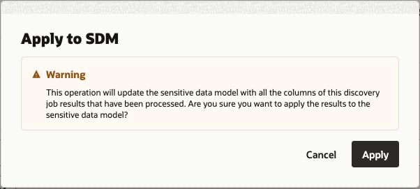

4. Return to **Sensitive columns** and verify that the support contact columns are present alongside the existing customer and payment columns. Review the **Details** tab to confirm the updated counts.

    | Sensitive data count | Initial discovery | After applying incremental discovery |
    | --- | ---: | ---: |
    | Schemas | 2 | 3 |
    | Tables | 3 | 4 |
    | Columns | 12 | 14 |
    | Sensitive types | 10 | 10 |

    These totals reflect the workshop example. The sensitive type count stays the same because Email Address and Phone Number were already represented in the initial model.

    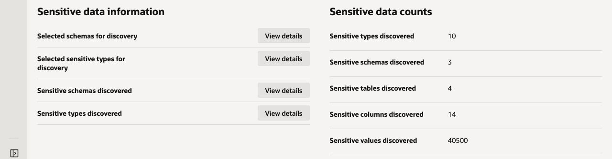

The same sensitive data model now covers the customer, payment, and support data needed for application testing. You may now **proceed to the next lab** to prepare the data masking policy.

## Learn More

- [Data Discovery Overview](https://docs.oracle.com/en-us/iaas/data-safe/doc/data-discovery-overview.html)
- [Update Sensitive Data Models and Perform Incremental Discovery](https://docs.oracle.com/en-us/iaas/data-safe/doc/update-sensitive-data-models.html)

## Acknowledgements

- **Author** - Jody Glover, Lead Principal User Assistance Developer, Database Development
- **Contributor** - Kajal Singh, Product Manager, Oracle Database Security
- **Last Updated By/Date** - Kajal Singh, October 7, 2026
