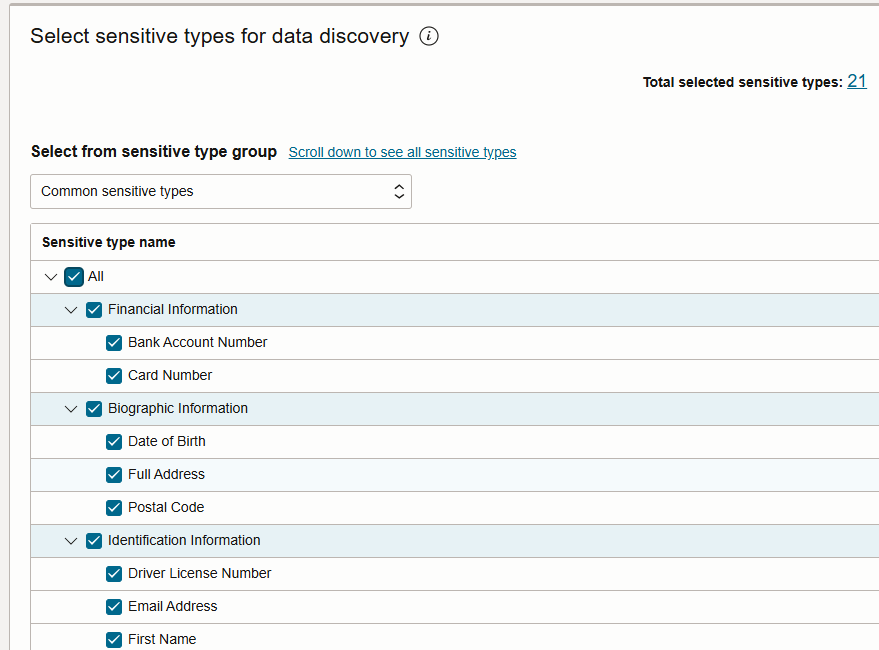
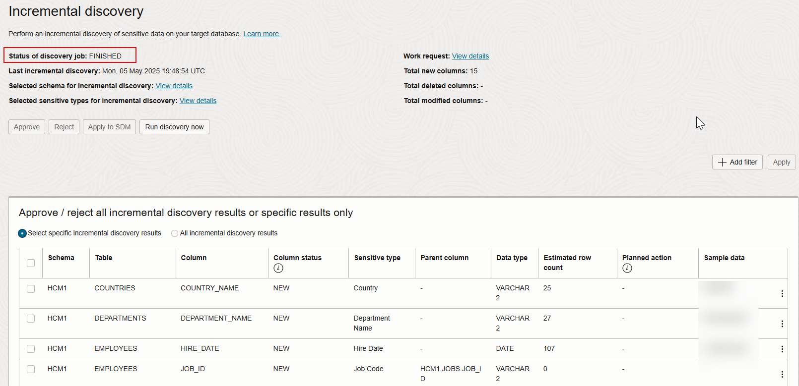

# Discover sensitive data

## Introduction

Data Discovery helps you find sensitive data in your target databases. You tell Data Discovery what kind of sensitive data to search for, and it inspects the actual data in your target database and its data dictionary, and then returns to you a list of sensitive columns. By default, Data Discovery can search for a wide variety of sensitive data pertaining to identification, biographic, IT, financial, healthcare, employment, and academic information.

In this lab, you use Oracle Data Safe to discover sensitive data on your target database and then adjust the sensitive data model.

Estimated Lab Time: 15 minutes

### Objectives

In this lab, you will:

- Discover sensitive data in your target database by using Data Discovery
- Analyze the sensitive data model
- Perform an incremental discovery
- Remove a column from the sensitive data model
- Add a column to the sensitive data model

### Prerequisites

This lab assumes you have:

- Obtained an Oracle Cloud account and signed in to the Oracle Cloud Infrastructure Console
- Access to or prepared an environment for this workshop
- Access to a registered target database

### Assumptions

- Your data values might be different than those shown in the screenshots.
- Please ignore the dates for the data and database names. Screenshots are taken at various times and may differ between labs and within labs. 

## Task 1: Discover sensitive data in your target database by using Data Discovery

1. Navigate to the **Data Discovery** landing page.

2. Select **Discover sensitive data**.

    The **Create sensitive data model** wizard opens.

3. For **Step 1 - Provide basic information**, do the following, and then select **Next**.

    - In the **Name** box, enter **SDM1**.
    - Select your compartment, if needed.
    - In the **Description** box, enter **Sensitive Data Model 1**.
    - Select the compartment for your target database, and then select the name of target database.

    

4. For **Step 2 - Select schemas**, wait for the schemas to be refreshed if prompted to do so. Leave **Select specific schemas only** selected. Scroll down and select the **HCM1** schema, and then select **Next**. You might need to click the right arrow button at the bottom of the page to navigate to page 2.

    

5. For **Step 3 - Select tables for schemas**, leave **All tables** selected, and select **Next**.

    
    
6. For **Step 4 - Select sensitive types**, review the common sensitive types. From the dropdown list, select **All sensitive types** and review them. Switch back to **Common sensitive types**, and then select them all by selecting the **Sensitive type** check box. Select **Next**.

    

7. For **Step 5 - Select discovery options**, select **Collect, display and store sample data**, and then select **Create sensitive data model** to begin the data discovery process.

    

8. Wait for the sensitive data model to be created.

    The **Sensitive data model details** page opens.

## Task 2: Analyze the sensitive data model

1. Review the information about the sensitive data model.

    - The **Details** tab lists general information about your sensitive data model, the target database, sensitive data information, and sensitive data counts.
    - You can view the selected schemas for discovery, selected sensitive types for discovery, sensitive schemas discovered, and sensitive types discovered by selecting the respective **View details** button.

   
    
2. Select the **Sensitive columns** tab and review the discovered sensitive columns. 

    - For each sensitive column, you can view its schema name, table name, column name, sensitive type, parent column, data type, sample data (if you chose to retrieve sample data and if it exists), confidence level, estimated row count, and audit records.
    - Review the sample data to get an idea of what it looks like.
    - If a sensitive column was discovered because it has a relationship to another sensitive column as defined in the database's data dictionary, the other sensitive column is displayed in the **Parent column**. For example, `EMPLOYEE_ID` in the `EMP_EXTENDED` table has a relationship to `EMPLOYEE_ID` in the `EMPLOYEES` table.

    

## Task 3: Perform an incremental discovery

Increase the scope of the data discovery job.

1. Select the **Incremental discovery** tab.

2. Under **Incremental discovery**, from the **Actions** menu, select **Run discovery now**.

    The **Run discovery now** dialog box opens.

3. Select **Adjust the scope for the incremental discovery**, and then select **Submit**.

    

    You are returned to the beginning of the data discovery wizard.

4. For **Step 1 - Provide basic information**, select **Next**.

5. For **Step 2 - Select schemas**, select **Next**.

6. For **Step 3 - Select tables for schema**, select **Next**.

7. For **Step 4 - Select sensitive types**, select **All sensitive types** from the dropdown list. Select **Biographic Information** and **Employment Information**, and then select **Next**.

8. For **Step 5 - Select discovery options**, select **Collect, display and store sample data**.

9. Select **Run discovery now**. Scroll down and wait for the status of the discovery job to read as **Done**, and then select **Close**.

   

10. Review the additional sensitive data that was discovered. 

11. Under **Incremental discovery**, from the **Actions** menu, select **Manage results**. 

    The **Incremental discovery** panel opens. Here you can approve and reject incremental discovery results.

12. Scroll down and select **All incremental discovery results**, and then select **Approve**. 

    

13. In the **Approve discovery results** dialog box, select **Approve**.

    

    You are returned to the **Incremental discovery** panel.
    
14. Select **Close** to close the panel.

15. Scroll to the right in the table, if needed, and verify that the **Planned action** column now has **Approved** listed in each row. 

    

16. Under **Incremental discovery**, from the **Actions** menu, select **Manage results**. Select **Apply to SDM**.

    

    The **Apply to SDM** dialog box opens.

17. Select **Apply to sensitive data model**, and then wait to be returned to the **Incremental discovery** tab.

    The sensitive data model is updated with the additional sensitive columns.
    
18. Select **Close** to close the panel.

    There are no sensitive columns listed anymore because you added them to the sensitive data model.

## Task 4: Remove a column from the sensitive data model

Remove the `DATE_OF_HIRE` column from the sensitive data model.

1. Select the **Sensitive columns** tab.

2. Under **Sensitive columns**, from the **Actions** menu, select **Remove columns**. 

    The **Remove columns** panel opens.
    
3. From the **Column** dropdown list, select **DATE\_OF\_HIRE**.

4. Select **Search**.

5. Select the check box for the **DATE\_OF\_HIRE** column in the **JOB_HISTORY** table, and then select **Remove columns**.

    

## Task 5: Add a column to the sensitive data model

Add `COUNTRY_ABBREV` to the sensitive data model.

1. Under **Sensitive columns**, from the **Actions** menu, select **Add columns**.

    The **Add columns** panel opens.

2. From the **Schema name** dropdown list, select **HCM1**.

3. From the **Table name** dropdown list, select **LOCATIONS**.

4. From the **Column name** dropdown list, select **COUNTRY_ABBREV**.

5. Select **Search**.

6. Scroll down, and then select the check box for the `COUNTRY_ABBREV` column.

7. From the **Sensitive type** dropdown list, select **Address - Country**. *Be sure to select Country, not County.*

8. Select **Add columns**, and then wait until you are returned to the **Sensitive columns** list.

   

9. Verify that `COUNTRY_ABBREV` from the `LOCATIONS` table is added to your sensitive data model.

You may now **proceed to the next lab**.

## Learn More

- [Data Discovery Overview](https://docs.oracle.com/en/cloud/paas/data-safe/udscs/data-discovery-overview.html)

## Acknowledgements
- **Author** - Jody Glover, Consulting User Assistance Developer, Database Development
- **Last Updated By/Date** - Jody Glover, February 3, 2026
