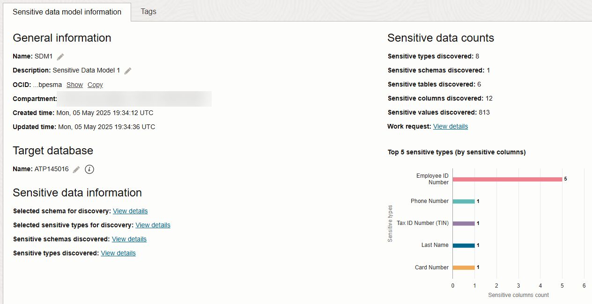
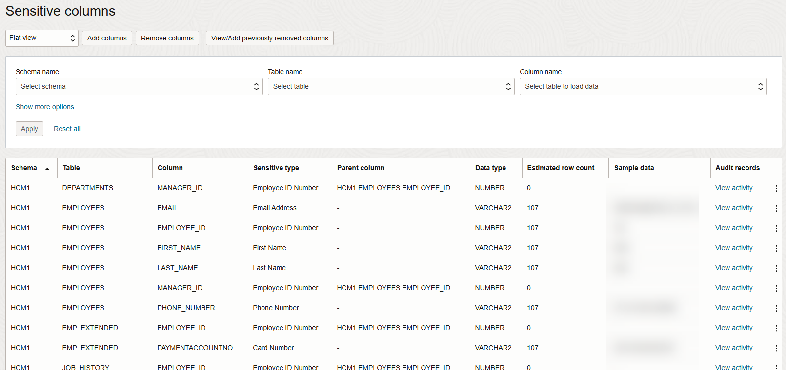
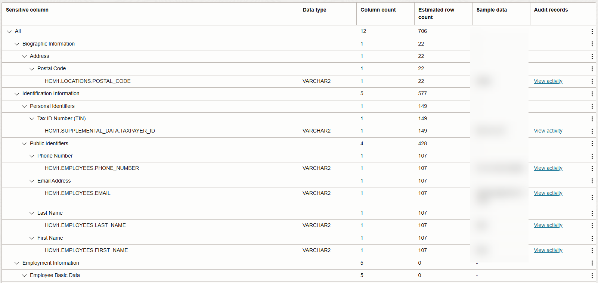

# Discover Sensitive Data

## Introduction

Data Discovery helps you find sensitive data in your target databases. You tell Data Discovery what kind of sensitive data to search for, and it inspects the actual data in your target database and its data dictionary, and then returns to you a list of sensitive columns. By default, Data Discovery can search for a wide variety of sensitive data pertaining to identification, biographic, IT, financial, healthcare, employment, and academic information.

Start by examining sensitive data in one of the tables on your target database by using Database Actions. Then, use Oracle Data Safe to discover sensitive data on your target database and generate a sensitive data model. Create a PDF of your sensitive data model.

Estimated Lab Time: 10 minutes

### Objectives

In this lab, you will:

- Discover sensitive data in your target database by using Data Discovery
- Analyze the sensitive data model
- Create a PDF of the Sensitive Data Model report

### Prerequisites

This lab assumes you have:

- Obtained an Oracle Cloud account and signed in to the Oracle Cloud Infrastructure Console
- Prepared your environment for this workshop (see [Prepare Your Environment](?lab=prepare-environment))
- Registered your target database with Oracle Data Safe (see [Register an Autonomous Database with Oracle Data Safe](?lab=register-autonomous-database))

### Assumptions

- Your data values might be different than those shown in the screenshots.

## Task 1: Discover sensitive data in your target database by using Data Discovery

1. Make sure that you are on the browser tab for Oracle Data Safe. If needed, sign in again.

2. In the breadcrumb at the top of the page, click **Data Safe**.

3. On the left under **Security Center**, and click **Data Discovery**.

4. From the **Compartment** drop-down list, select your compartment.

    A Data Discovery overview page is displayed with statistics for the top five target databases in your compartment. Your page is most likely empty because this is the first time you are using Data Discovery in this workshop.

5. Click **Discover Sensitive Data**.

    The **Create Sensitive Data Model** wizard is displayed.

6. On the **Provide Basic Information** page, do the following, and then click **Next**.

    - In the **Name** box, enter **SDM1**.
    - Leave the compartment set to your compartment.
    - In the **Description** box, enter **Sensitive Data Model 1**.
    - Select your target database

    

7. On the **Select Schemas** page, leave **Select specific schemas only** selected. Scroll down and select the **HCM1** schema, and then click **Next**. You might need to click the right arrow button at the bottom of the page to navigate to page 2.

    

8. On the **Select Sensitive Types** page, expand all of the sensitive categories by moving the **Expand All** slider to the right. Scroll down the page and review the sensitive types. Notice that you can select individual sensitive types, sensitive categories, and all sensitive types at one time. At the top of the page, select the **All** check box, and then click **Next**.

    

9. On the **Select Discovery Options** page, select **Collect, display and store sample data**, and then click **Create Sensitive Data Model** at the bottom of the page to begin the data discovery process.

    

10. Wait for the sensitive data model to be created. The **Sensitive Data Model Details** page is displayed.

## Task 2: Analyze the sensitive data model

1. Review the information on the **Sensitive Data Model Details** page.

    - The **Sensitive Data Model Information** tab lists information about your sensitive data model, including its name and Oracle Cloud Identifier (OCID), the compartment to which you saved it, the date and time when it was created and last updated, the target database associated with it, the selected schema for discovery (HCM1), the selected sensitive types for discovery (click the **View Details** link), and totals for discovered sensitive schemas, sensitive tables, sensitive columns, sensitive types, and sensitive values.
    - You can view the selected sensitive types for discovery (click **View Details**).
    - You can view the work request information (click **View Details**).
    - The pie chart shows percentages of sensitive categories and sensitive types.
    - The **Sensitive Columns** table lists the discovered sensitive columns. By default, the table is displayed in **Flat View** format. For each sensitive column, you can view its schema name, table name, column name, sensitive type, parent column, data type, estimated row count, sample data (if you chose to retrieve sample data and if it exists), and audit records. Review the sample data to get an idea of what it looks like.

    
    

2. Position your mouse over the **Identification Information** category in the chart to view its value. Your percentage value might be different than the value shown in the screenshot.

    

3. With your mouse still over **Identification Information**, click the pie slice to drill down. Notice that the **Identification Information** category is now divided into two smaller categories (**Personal Identifiers** and **Public Identifiers**).

    

4.  To drill-up, click the **All** link in the chart's breadcrumb.

5. Under **Sensitive Columns**, from the drop-down list, select **Sensitive Type View** to sort the sensitive columns by sensitive type. By default, all items are expanded in the view. You can collapse the items by moving the **Expand All** slider to the left.

    

6. From the drop-down list, select **Schema View** to sort the sensitive columns by table name.

    - If a sensitive column was discovered because it has a relationship to another sensitive column as defined in the database's data dictionary, the other sensitive column is displayed in the **Parent Column**. For example, `EMPLOYEE_ID` in the `EMP_EXTENDED` table has a relationship to `EMPLOYEE_ID` in the `EMPLOYEES` table.

    

## Task 3: Create a PDF of the Sensitive Data Model report

1. At the top of the **Sensitive Data Models Details** page, click **Generate Report**.

    A **Generate Report** dialog box is displayed.

2. Leave **PDF** selected, click **Generate Report**, and wait for the report to be 100% generated. Click the **here** link to download the report.

    

3. Open the PDF report and review it.

    - The **Summary** table shows totals for columns and values scanned, and counts for sensitive types, sensitive tables, sensitive columns, and sensitive values.
    - The **Sensitive Columns** table lists the sensitive columns in the sensitive data model. For each sensitive column, the table shows you its sensitive type, schema name, table name, column name, sensitive value count, whether the column data was matched (Y or N), whether the column name was matched (Y or N), and whether the column comment was matched (Y or N).

    

4. Close the PDF report and return to Oracle Data Safe.

You may now **proceed to the next lab**.

## Learn More

- [Data Discovery](https://docs.oracle.com/en-us/iaas/data-safe/doc/data-discovery.html)

## Acknowledgements
- **Author** - Jody Glover, Consulting User Assistance Developer, Database Development
- **Last Updated By/Date** - Jody Glover, June 8, 2023
