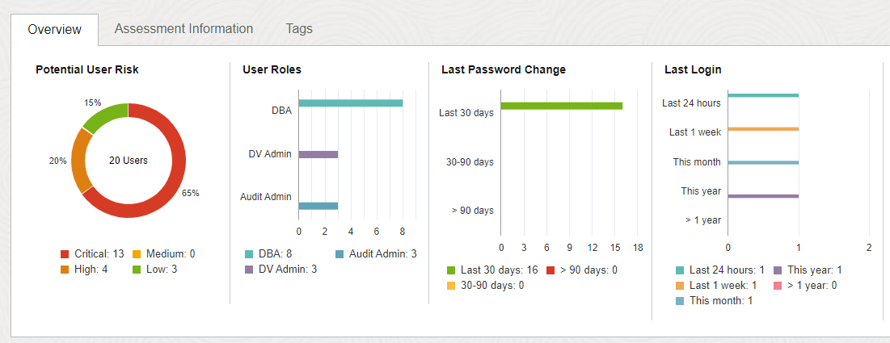
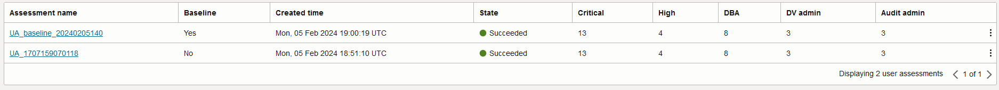
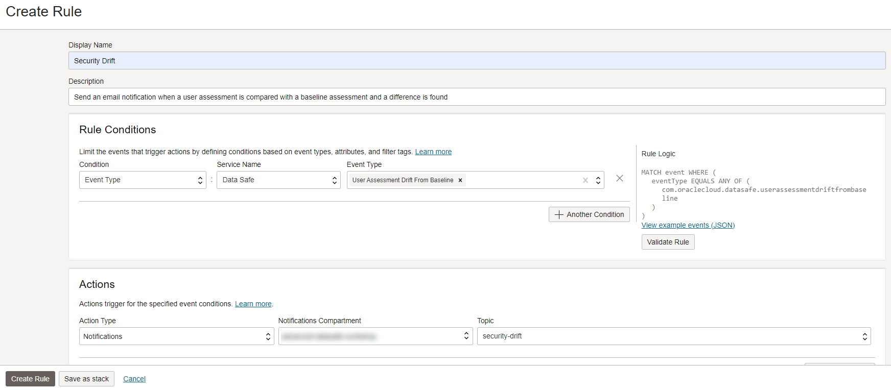
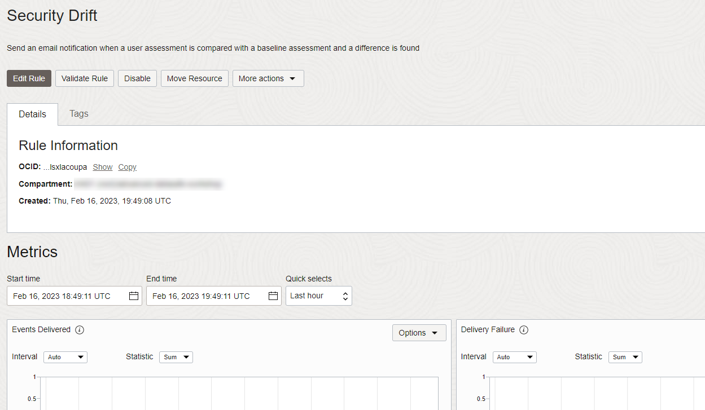

# Get notified about security drift on your target databases by setting up Oracle Data Safe events

In this lab, you configure the Events service to notify you via email when there is security drift on your target database.

Estimated Lab Time: 20 minutes

## Objectives

In this lab, you will:

- Review the latest user assessment
- Set the latest user assessment as the baseline
- Create a notification topic and subscription
- Create a rule in the Events service
- Generate activity on the target database
- Refresh the latest user assessment and analyze the results
- Generate a Comparison report for User Assessment
- Review your email notification

### Prerequisites

This lab assumes you have:

- Obtained an Oracle Cloud account and signed in to the Oracle Cloud Infrastructure Console
- *Administrator* permissions in your tenancy
- Prepared your environment for this workshop (see [Prepare Your Environment](?lab=prepare-environment))
- Registered your target database with Oracle Data Safe (see [Register an Autonomous Database with Oracle Data Safe](?lab=register-autonomous-database))
- A valid email address

### Assumptions

- Your data values might be different than those shown in the screenshots.


## Task 1: Review the latest user assessment

1. From the navigation menu in Oracle Cloud Infrastructure, select **Oracle Database**, and then **Data Safe - Database Security**.

2. Under **Security Center**, click **User Assessment**.

    The User Assessment dashboard is displayed.

3. Click the **Target Summary** tab.

4. In the **Last Assessed On** column, click **View Report** to view the latest user assessment.

5. Review the charts on the **Overview** tab. 

    

6. Scroll down and review the information in the **User Details** section.

    


## Task 2: Set the latest user assessment as the baseline

1. While you are still viewing the latest user assessment, click **Set As Baseline**.

    The **Set As Baseline?** dialog box is displayed asking if you are sure.

2. Click **Yes**, and remain on the page until the following message is displayed:

     `Baseline has been set.`

3. Click **View History**. Notice that in your compartment you have a baseline assessment.

    


## Task 3: Create a notification topic and subscription

To create a notifications topic, you must a tenancy administrator.

1. From the navigation menu in Oracle Cloud Infrastructure, select **Developer Services**, and then under **Application Integration**, select **Notifications**.

    The **Notifications** page is displayed.

2. Under **List scope**, make sure that your compartment is selected.

3. Click **Create Topic**. 

    The **Create Topic** panel is displayed.

4. Enter a topic name, for example, **security-drift**.

5. Click **Create**. 
    
6. Click the name of the topic.

    The **Topic Details** page is displayed.

7. Click **Create Subscription**. 

    The **Create Subscription** panel is displayed.

8. For **Protocol**, leave **Email** selected.

9. For **Email**, enter your email address.

10. Click **Create**. 

    The state of the subscription is **Pending**.

11. Open your email application and locate the email from Oracle. In the email, click **Confirm subscription**. 

    A **Subscription confirmed** page is displayed in the browser.

12. Refresh the **Topic Details** page. Notice that the state of the subscription is now set to **Active**.

    


## Task 4: Create a rule in the Events service

1. From the navigation menu in Oracle Cloud Infrastructure, select **Observability & Management**, and then **Events Service**.

2. Under **List scope**, make sure your compartment is selected.

3. Click **Create Rule**.

4. For **Display Name**, enter **Security Drift**.

5. For **Description**, enter **Send an email notification when a user assessment is compared with a baseline assessment and a difference is found**.

6. In the **Rule Conditions** section, leave **Event Type** selected as the condition.

7. For **Service Name**, select **Data Safe**.

8. For **Event Type**, select **User Assessment Drift From Baseline**.

9. Click **View example events (JSON)** and review the rule logic. This is the information that you will receive in your email. Click **Cancel** to close the panel.

10. For **Action Type**, select **Notifications**.

11. For **Notifications Compartment**, select your compartment.

12. For **Topic**, select the topic that you just created (for example, **security-drift**).

    

13. Click **Create Rule**.

    The **Security Drift** page is displayed.

    


## Task 5: Generate activity on the target database

In this task, you create a user on your target database with the `PDB_DBA` role.

1. Access the SQL worksheet in Database Actions. If your session has expired, sign in again as the `ADMIN` user.

2. If needed, clear the worksheet and the **Script Output** tab.

3. On the worksheet, enter the following command:

    ```
    <copy>CREATE USER joe_smith identified by Oracle123_Oracle123;
    GRANT PDB_DBA to joe_smith;</copy>
    ```

4. On the toolbar, click the **Run Statement** button (green circle with white arrow).

    


## Task 6: Refresh the latest user assessment and analyze the results


1. Return to the browser tab for Oracle Cloud Infrastructure.

2. From the navigation menu, select **Oracle Database**, and then **Data Safe - Database Security**.

3. Under **Security Center**, click **User Assessment**.

4. Click the **Target Summary** tab.

5. Click **View Report** to view the latest user assessement.

6. At the top of the latest user assessment, click **Refresh Now** to get the latest data.

    The **Refresh Now** panel is displayed.

7. Leave the default assessment name as is, and click **Refresh Now**. Wait for the status to read as **SUCCEEDED**. 

    - This action updates the data in the latest user assessment for your target database and also saves a copy of the assessment in the Assessment History.
    - The refresh operation takes about one minute.

8. Click **View History**. 

9. Compare the risk values between the baseline assessment and the new assessment that you just generated. Are there any differences?

    

10. Click **Close**.


## Task 7: Generate a Comparison report for User Assessment

After you generate a comparison report, if there is security drift (which there should be because you added a privileged user), the Events service should trigger an email notification.

1. With the latest user assessment displayed, under **Resources** on the left, click **Compare with Baseline**. Oracle Data Safe automatically begins processing the comparison.

2. When the comparison operation is completed, review the **Comparison** report. Click **Open Details** to view more information.

    


## Task 8: Review your email notification

1. Open your email application.

2. Locate and open the email notification from Oracle. The message contains text similar to the following:

    ```text
    <copy>{
    "eventType" : "com.oraclecloud.datasafe.userassessmentdriftfrombaseline",
    "cloudEventsVersion" : "0.1",
    "eventTypeVersion" : "2.0",
    "source" : "DataSafe",
    "eventTime" : "2023-02-16T19:54:52Z",
    "contentType" : "application/json",
    "data" : {
        "compartmentId" : "ocid1.compartment.oc1...",
        "compartmentName" : "compartment-name",
        "resourceName" : "userAssessment",
        "resourceId" : "not applicable",
        "availabilityDomain" : "ad3",
        "additionalDetails" : {
        "targetName" : "ATP2000",
        "comparedWith" : "ocid1.datasafeuserassessment.oc1..."
        }
    },
    "eventID" : "e46fad7b-ac11...",
    "extensions" : {
        "compartmentId" : "ocid1.compartment.oc1..."
    }
    }

    --
    You are receiving notifications as a subscriber to the topic: security-drift (Topic OCID: ocid1.onstopic.oc1.eu-frankfurt-1.aaaaa...). 
    To stop receiving notifications from this topic, unsubscribe: https://cell1.notification.eu-frankfurt-1.oci.oraclecloud.com/20181201/subscriptions/ocid1.onssubscription.oc1.eu-frankfurt-1.aaaaa.../unsubscription?token=YVpsOE4weTU4TTdKSGxoTkVwR3kyaU8...==&protocol=EMAIL

    Please do not reply directly to this email. If you have any questions or comments regarding this email, contact your account administrator.

    Oracle Corporation - Worldwide Headquarters
    2300 Oracle Way, Austin, Texas 78741 USA</copy>
    ```

## Learn More
- [Event Types for Oracle Data Safe](https://www.oracle.com/pls/topic/lookup?ctx=en/cloud/paas/data-safe&id=ADMDS-GUID-A8D65EBC-9A53-43EC-B335-0DA0E2F9CDC8)
- [Events in Oracle Cloud Infrastructure](https://docs.oracle.com/en-us/iaas/Content/Events/home.htm)


## Acknowledgements
- **Author** - Jody Glover, Consulting User Assistance Developer, Database Development
- **Contributors** - Bettina Schaeumer
- **Last Updated By/Date** - Jody Glover, April 11, 2023


