# Generate Alerts

## Introduction

An alert is a message that notifies you when a particular audit event happens on a target database. In Oracle Data Safe, you can provision alert policies on your target databases, view and manage alerts, view predefined alert reports, and create custom alert reports.

Start by reviewing the predefined alert policies in Oracle Data Safe, and then provision two of them. Using the web tool in Oracle Cloud Infrastructure called Database Actions, perform activity on your target database to cause alerts in Oracle Data Safe. Review the generated alerts and create a custom alerts report. Download the report as a PDF.

Estimated Lab Time: 20 minutes

### Objectives

In this lab, you will:

- Review the Oracle Data Safe alert policies
- Provision alert policies on your target database
- Perform activity on your target database to cause an alert in Oracle Data Safe
- Review the generated alerts in Oracle Data Safe
- View details for an alert and close it
- Create a custom alerts report
- Generate and download a custom alerts report as a PDF

### Prerequisites

This lab assumes you have:

- Obtained an Oracle Cloud account and signed in to the Oracle Cloud Infrastructure Console at `https://cloud.oracle.com`
- Prepared your environment for this workshop (see [Prepare Your Environment](?lab=prepare-environment))
- Registered your target database with Oracle Data Safe and loaded sample data into it. Make sure to have the `ADMIN` password for your target database on hand (see [Register an Autonomous Database with Oracle Data Safe](?lab=register-autonomous-database)).
- Started audit data collection for your target database in Oracle Data Safe (see [Audit Database Activity](?lab=audit-database-activity))
- Accessed Security Center


### Assumptions

- Your data values are most likely different than those shown in the screenshots.

## Task 1: Review the Oracle Data Safe alert policies

1. In Security Center, click **Alerts**.

    The **Alerts** page is displayed. The alerts dashboard does not have any data because you have not yet enabled any alert policies.

    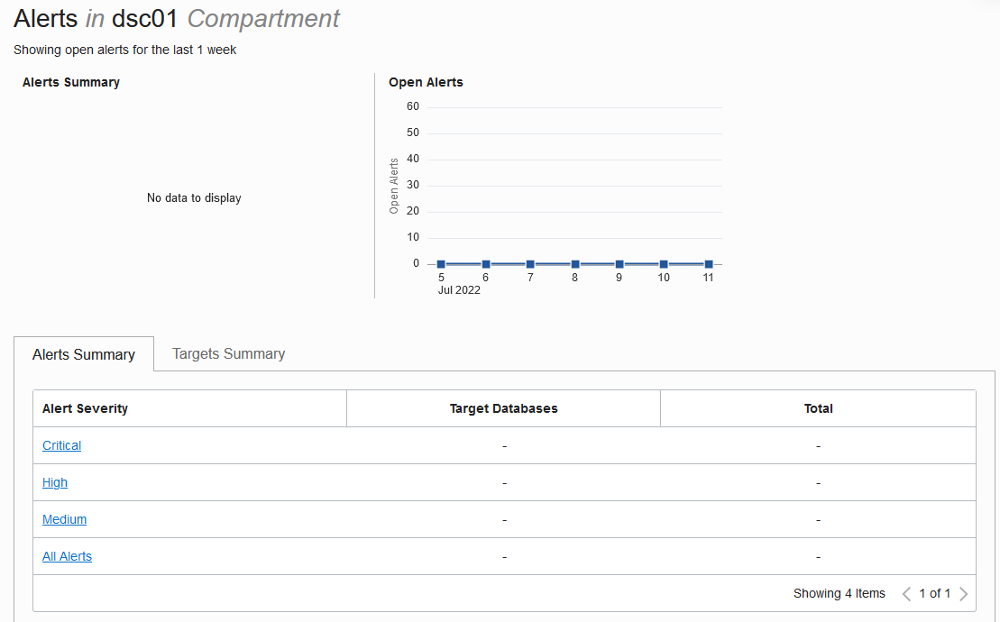

2. Under **Related Resources**, click **Alert Policies**.

3. Review the list of available alert policies in Oracle Data Safe. They are as follows:

    - Profile Changes
    - Failed Logins by Admin User
    - Audit Policy Changes
    - Database Parameter Changes
    - Database Schema Changes
    - User Entitlement Changes
    - User Creation/Modification


    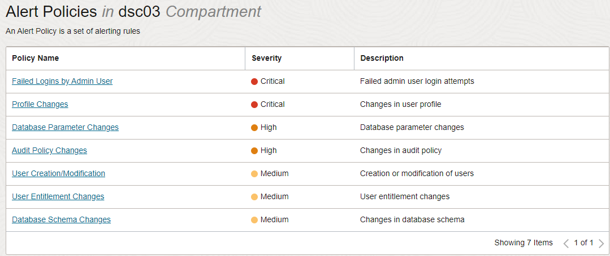

4. Click the **User Creation/Modification** alert policy and review its details.

    The **Alert Policy Details** page is displayed for the **User Creation/Modification** alert policy.

    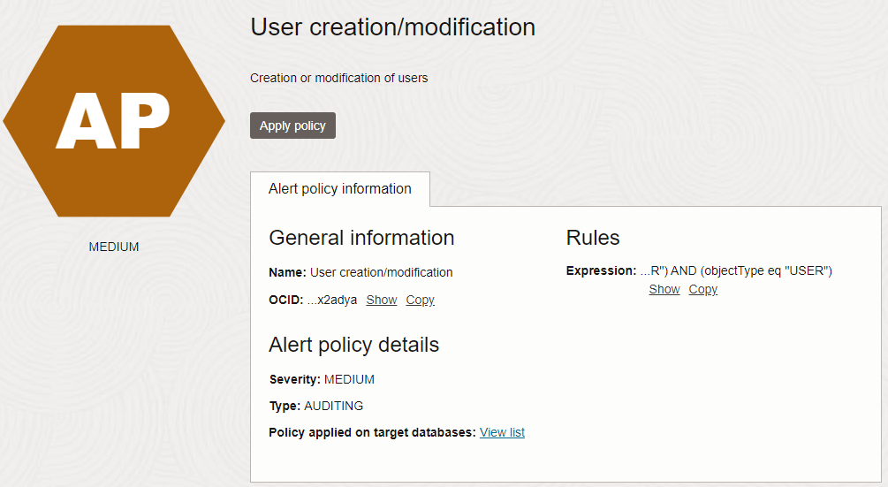

5. Next to **Policy Applied On Target Databases**, click **View List** to view the target databases associated with the alert policy.

    The **Target-Policy Associations** page is displayed with the **Policy Name** filter set to **User Creation/Modification**.
    Because you have not yet associated the alert policy with any target database, the table shows **No Target-Policy Associations Available**.

    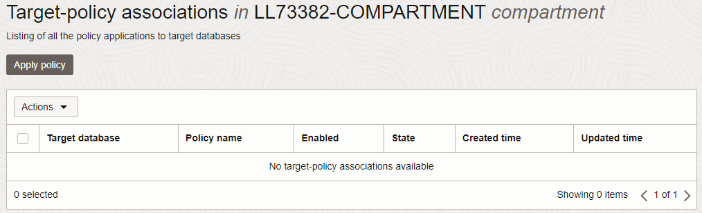


## Task 2: Provision alert policies on your target database

1. From the **Policy Name** drop-down list under **Filters**, select **All**.

2. On the **Target-Policy Associations** page, click **Apply Policy**.

    The **Apply And Enable Alert Policy To Target Databases** panel is displayed.

3. Select **Selected Targets Only**.

4. If needed, click **Change Compartment** and select your compartment.

5. From the drop-down list, select your target database.

6. Select **Selected Policies Only**.

7. From the drop-down list, one at a time, select the **User Creation/Modification** and **Failed Logins by Admin User** alert policies.

8. Click **Apply Policy**.

    The alert policies are applied while the panel is open.

9. Wait until both policies are applied. The status **Done** is displayed.

    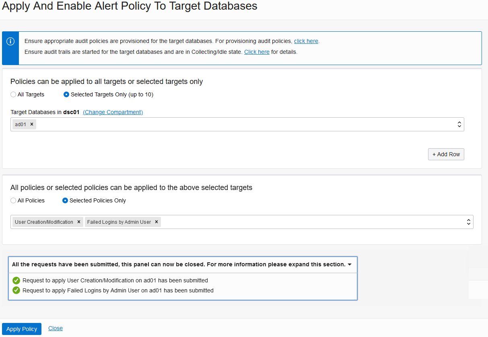

10. Click **Close**.

    The two target-policy associations for your target database are listed on the page and show as enabled.

    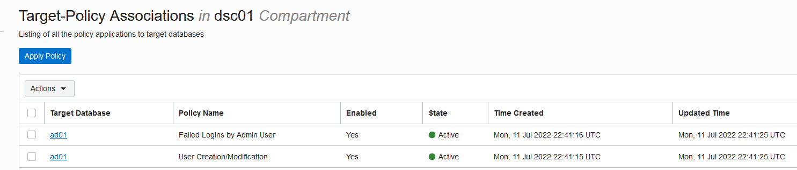

## Task 3: Perform activity on your target database to cause alerts in Oracle Data Safe

Access Oracle Database Actions in Oracle Cloud Infrastructure and perform some activities on your target database to generate some audit data. First, purposely try to log in as the `ADMIN` user with incorrect passwords. Then, sign in and create a user account.

1. From the navigation menu, select **Oracle Database**, and then **Autonomous Transaction Processing**.

2. Under **COMPARTMENT**, select your compartment.

3. On the right, click the name of your target database.

    The **Autonomous Database Details** page is displayed.

4. Click **Database Actions** and wait for a new browser tab to open.

    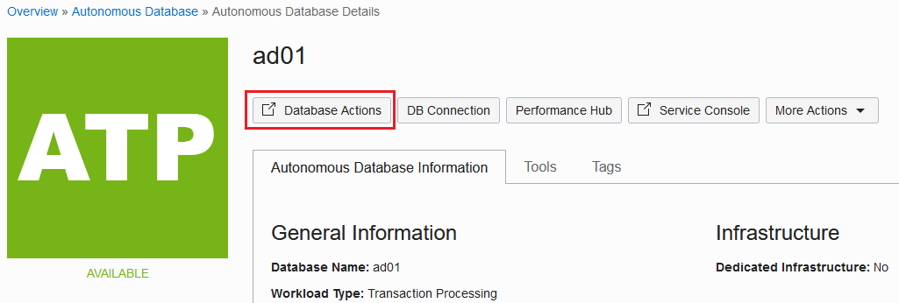

    You are automatically signed in to the database as the `ADMIN` user.

5. From the drop-down list in the upper-right corner, select **Sign Out**.

6. Click **Sign in**.

7. Enter `ADMIN` for the username, and then click **Next**.

8. Do this twice: Enter an incorrect password, and then click **Sign in**. The message **An invalid user name or password was supplied.**

    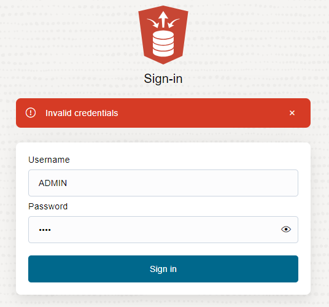

9. Enter the correct password, and click **Sign in**.

10. In the **Development** section, click **SQL**.

11. If a help note is displayed, click the **X** button to close it.

12. On the worksheet, run the following SQL script:

    ```
    <copy>drop user MALFOY cascade;
    create user MALFOY identified by Oracle123_Oracle123;
    grant PDB_DBA to MALFOY;</copy>
    ```

13. Sign out, close the browser tab, and return to the **Autonomous Database | Oracle Cloud Infrastructure** browser tab.

14. Wait a couple of minutes for Oracle Data Safe to produce the alerts.


## Task 4: Review the generated alerts in Oracle Data Safe


1. From the navigation menu, select **Oracle Database** and then **Data Safe**.

2. Under **Security Center** on the left, click **Alerts**.

3. Notice that the alerts dashboard now has data.

    - The **Alerts summary** chart shows that there are four alerts. Two are critical risk and two are medium risk.
    - The **Open Alerts** chart shows that there are four alerts on the current day.
    - The **Alerts Summary** tab shows the number of critical, high, and medium alerts along with target database counts. It also shows you the total number of alerts and target databases.
    - The **Targets Summary** tab shows the number of open, critical, high, and medium alerts.

    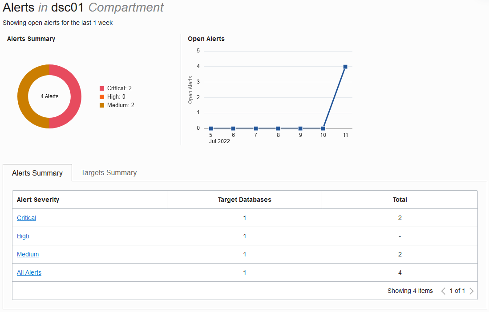
    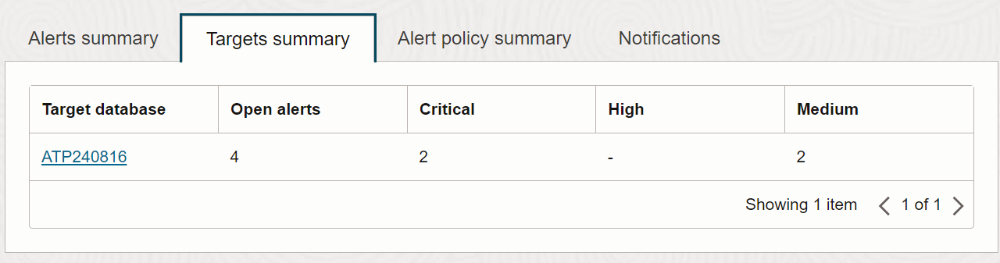

4. Under **Related Resources**, click **Reports**.

5. In the **Report Name** column on the right, click the **All Alerts** report to view it.

    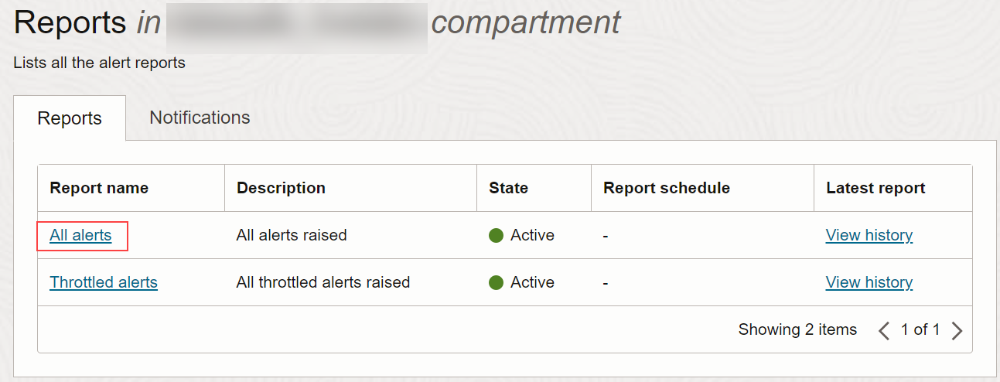

6. Review the report.

    - The report currently does not have any filters set. It shows you all alerts for all target databases in the selected compartment.
    - At the top of the report, you can view several totals, including the total number of target databases; total number of open and closed alerts, and the total number of critical, high, medium, and low alerts. You can click the **Targets** total to view the list of target databases. You can click the other totals to toggle a filter on the list of alerts.
    - At the bottom of the report, you can view the list of alerts. By default, the table shows you the alert name, alert status, alert severity, target databases on which the audited event occurred, and when the alert was created.
    - You have options to create a PDF or XLS report, create a custom report, open and close alerts, and specify which table columns you want displayed on the page.

    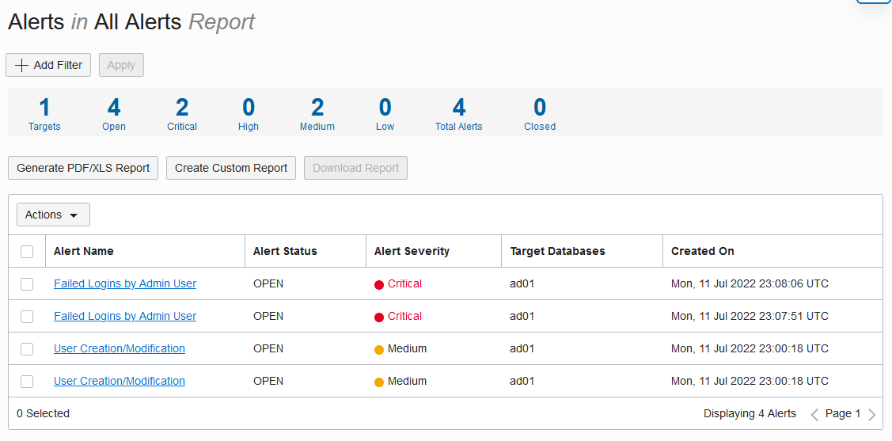

7. At the top of the report, click **+ Add Filter**. Create the filter **Target Database Name = your-target-database-name**, and click **Apply**.

    Only alerts that pertain to your target database are listed in the table.

8. Click **+ Another Filter**. Create the filter **Alert Name = User Creation/Modification**, and click **Apply**.

    Only alerts that pertain to User Creation/Modification are listed in the table.

    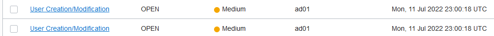

9. Review the alerts generated for **User Creation/Modification**.


## Task 5: View details for an alert and close it

1. Click one of the alerts to view more detail about it.

    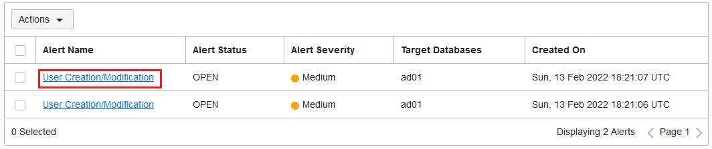


2. Review the following information about the alert:

    - Alert name (instance of the alert)
    - Target database to which the alert applies
    - Alert severity
    - Alert status - Whether the alert is open or closed
    - Alert type - Currently all alert types are AUDITING
    - Policy that generated the alert
    - User operation that generated the alert
    - Operation time
    - Operation status
    - When the alert was created and updated
    - Oracle Cloud Identifier (OCID) for the alert
    - Compartment in which the alert resides
    - Operation details

    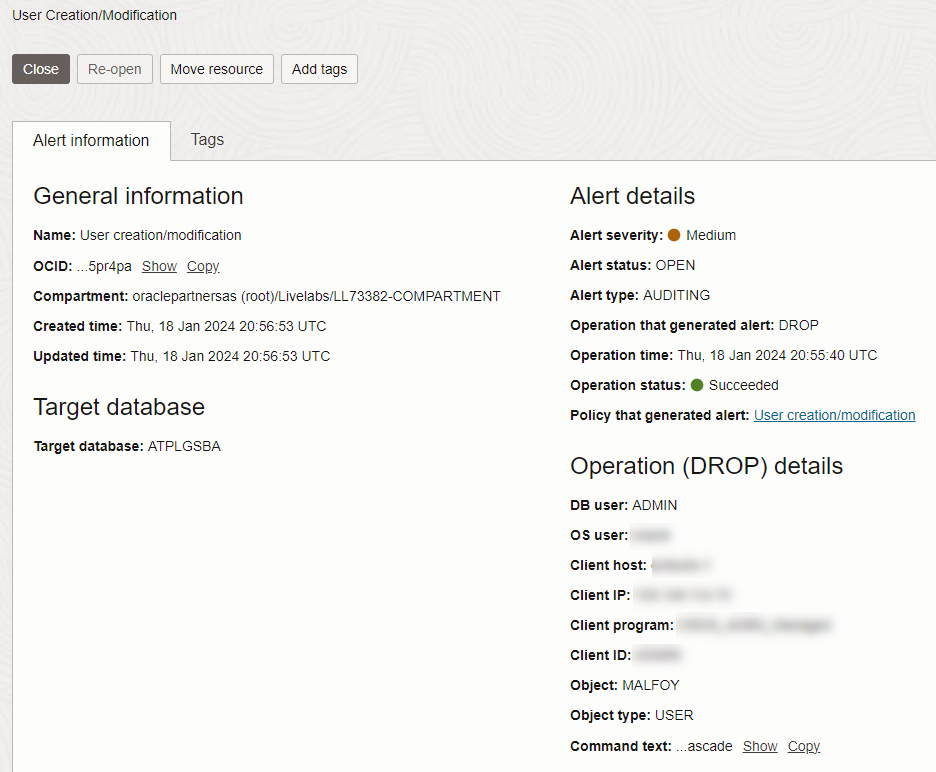

3. To close the alert, click **Close**.

    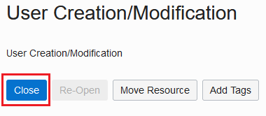

    The alert status is immediately set to **CLOSED**.

## Task 6: Create a custom alerts report

1. In the breadcrumb at the top of the page, click **All Alerts** to return to the All Alerts report.

2. Apply two filters:

    - **Target Database Name = your-target-database-name**
    - **Alert Name = Failed Logins by Admin User**

    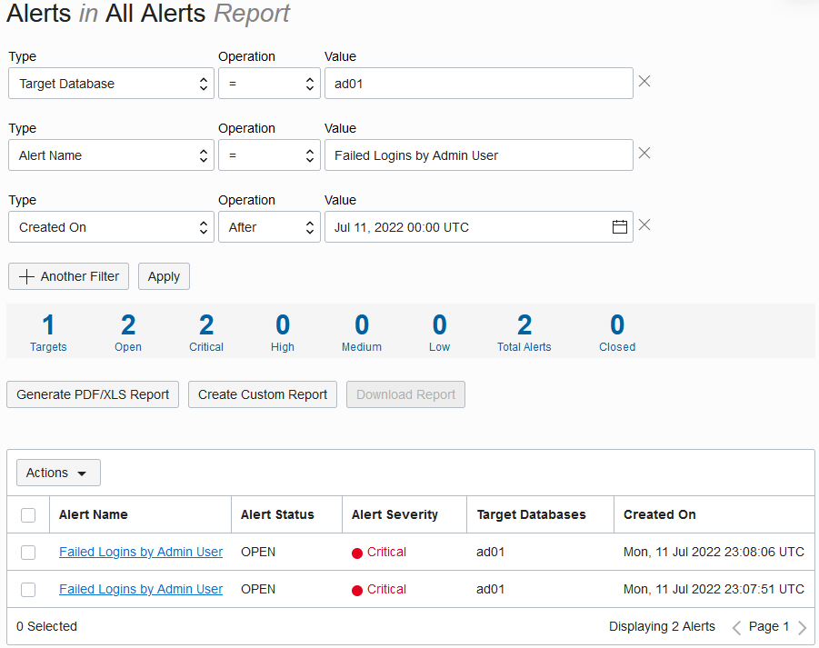

3. Click **Create Custom Report**.

    The **Create Custom Report** dialog box is displayed.

4. For **Display Name**, enter **Failed Logins by Admin User for your-target-database-name**. (Optional) Enter a description. Select your compartment. Click **Create Custom Report** and wait for the report to generate.

    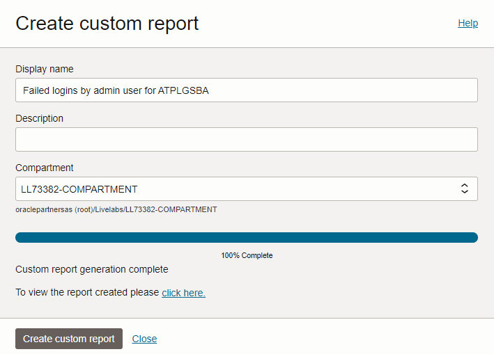

5. Click the **click here** link to view the report.


## Task 7: Generate and download a custom alerts report as a PDF

1. On the custom report page, click **Generate PDF/XLS Report**.

    The **Generate Report** dialog box is displayed.

2. Leave **PDF** selected.

3. For **Display Name**, enter **Failed Admin Logins for your-target-database-name**.

4. (Optional) For **Description**, enter **Failed logins by Admin user for target database your-target-database-name**.

5. Select your compartment.

6. Click **Generate Report** and wait until the PDF report is generated.

    A message is displayed stating that report generation is complete.

    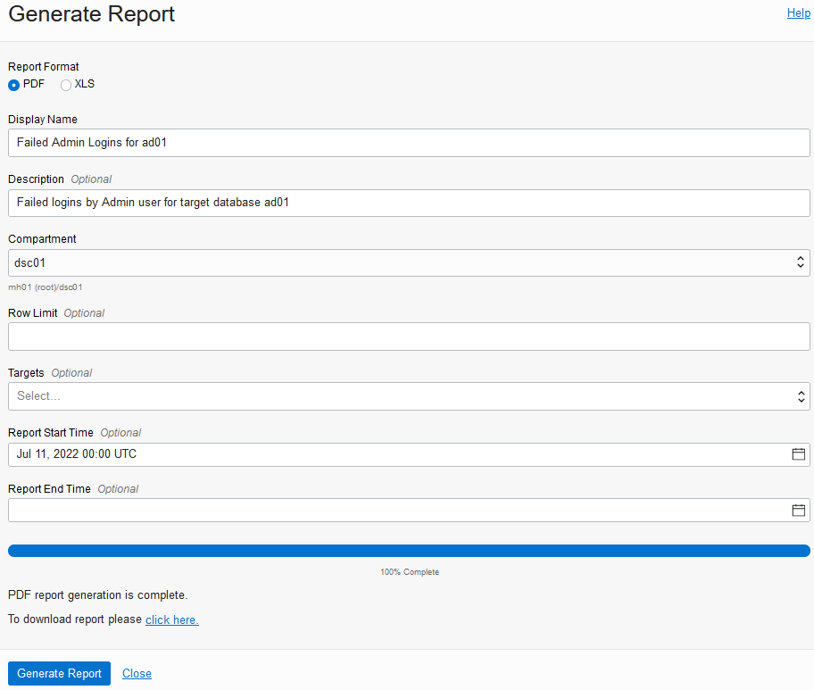

7. Click the **click here** link to download the report.

    A dialog box is displayed providing you options to open or save the document.

8. Save the report to your local computer.

9. Open the PDF report and view it.


## Learn More

- [Alerts Overview](https://www.oracle.com/pls/topic/lookup?ctx=en/cloud/paas/data-safe&id=UDSCS-GUID-37F8AC38-44D4-42D1-AE93-9775DCF21511)


## Acknowledgements

* **Author** - Jody Glover, Consulting User Assistance Developer, Database Development
* **Last Updated By/Date** - Jody Glover, April 14, 2022
